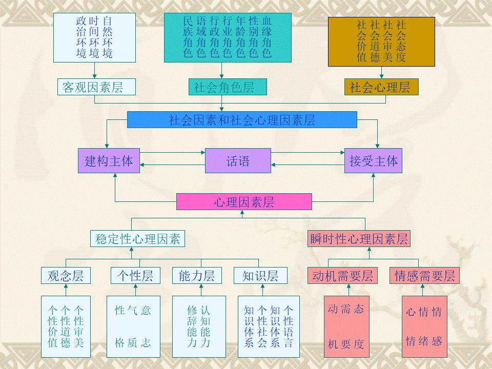
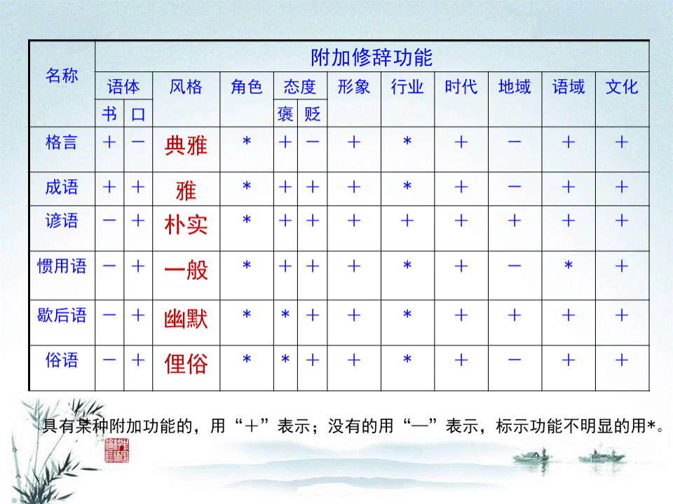
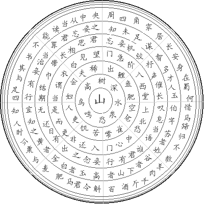

> **汉语修辞学 - 北京大学【国家精品课】- 陈汝东（教授）**

# **修辞概说**

## 一、什么是修辞？


### 古代中国说法

《周易》记载，孔子说：“君子进德修业。忠信，所以进德也；**修辞**立其诚，所以居业也。[^1]

大意是说：君子要增进美德、营修功业。

忠诚信实，是增进美德的主要基础。修饰文辞和言语，确立至诚的感情，是营修功业的根基。 

*《周易》，[英]理雅各 英译，秦颖、秦穗校注，秦颖今译，长沙：湖南出版社1993年，第8页。*

其他解说：

- 《说文解字》说：“**修**，饰也”；“辞 ，讼也”。 
- 唐代人孔颖达解释说：“**辞**谓文教，诚谓诚实也；外则修理文教，内则立其诚实，内外相成，则有功业可居，故云居业也。”

也就是说，“修”就是“修理”， “辞”就是“文教”，“修辞”就是“修理文教”的意思，即提高自身的言谈举止等外在素养水平。

### 外国说法

1. 演说实践; 

（The practice of oratory）

2. 书面语或口语的运用，传递信息或说服;

(The use of language, written or spoken, to inform or persuade)

3. 隐喻的分类与应用;

(The classification and use of tropes and figures)

4. 运用空头承诺和半真半假的宣传形式; 

（The use of empty promises and half-truths as a form of propaganda）

5. 积极演说的策略研究;

(The study of strategies of effective oratory)

6. 语言的说服效果研究;

(The study of persuasive effects of language) 

7. 语言与知识之间的关系研究。

(The study of the relation between language and knowledge)

20世纪70年代以来，有西方学者提出：“东方或中东没有修辞学”。 

### 西方学者对亚洲修辞的说法

1. 詹姆斯·墨菲指出，修辞完全是一种西方现象，非洲与亚洲时至今日还未出现修辞学。
2. 乔治·肯尼迪认为，“修辞是西方独有的现象”。
3. 罗伯特·奥利弗也认为:任何试图在亚洲发现西方古典修辞学经典理论的努力都是徒劳的。

### 陈汝东说法

“修辞是人类的一种媒介符号传播行为，是人们依据具体的语境，有意识、有目的地建构话语和理解话语以及其他文本，以取得理想传播效果的社会行为。”[^2]


## **二、**语音修辞

**汉语是有修辞的，比如下面的谐音双关例子**

**打败你的不是天真是“无鞋”**（ 2013年央视蛇年春晚小品《今天的幸福2》） 

**《蒜你狠豆你玩被查处**——一批公司因操纵绿豆大蒜价格被查处》，新华网，2010年7月1。 （算你狠，逗你玩。）

**“蒜你狠”“豆你玩”**传言四散 记者调查一一辟谣，中国广播网，2010年5月26日。

**“青椒”——“大学青年教师”；**

**“神马”——“什么”；**

**粉丝——fans；**

**杯具——悲剧；**

**洗具——喜剧；**

**餐具——惨剧；**

**家庭煮夫——家庭主妇；**

**搏仕——博士。**

今天你**“围脖”**了吗？（微博）

**模拟锣等打击乐器谐音双关的手法：**

普天同庆，庆得自然，庆庆庆，当当庆，当庆当庆当当庆；
举国若狂，狂到极点，狂狂狂，且且狂，且狂且狂且且狂。

**更多网络谐音双关：**

“负翁”（富翁）、“性福”（幸福）、 “剩女”（圣女）、“月光族”、 “海龟”（海归）、“土鳖”、 “鸡（基）民”、“养鸡（基）”、“鸡的屁”（GDP) 、“大食代”、“驴友”（旅游） 等。斑竹（版主）、大虾（大侠，高手）；美眉（妹妹） “气管炎”——“妻管严”； “肤轻松”——“夫轻松”；“床头柜”——“床头跪”。 “盯、关、跟”。

**优美的谐音双关：**

3.14159265358979，谐音为“山，一寺一壶酒，二鹿舞三舞，把酒吃酒。”

“落花人独立，微雨燕双飞。”(宋·晏几道,临江仙) 

“晴川历历汉阳树，芳草萋萋鹦鹉洲” 。 （唐·崔颢，黄鹤楼）

> 汉语不但有修辞，而且语音修辞很丰富


## **三、词语**修辞

### 视觉修辞

京口瓜洲一水间，
钟山只隔数重山。
春风又==**绿**==江南岸，
明月何时照我还。
（王安石《泊船瓜洲》 ）

宋代洪迈的《容斋续笔·诗词改字》中记载：“吴中士人家藏其草，初云：‘又到江南岸’，圈去‘到’字，注曰：‘不好’，改为‘过’。复圈去，而改为‘入’。旋改为‘满’。凡如是十许字，始定为‘绿’。”

### 声觉修辞

闲居少邻并，草径入荒园。
鸟宿池边树，僧==**敲**==月下门。
过桥分野色，移石动云根。
暂去还来此，幽期不负言。
（贾岛《题李凝幽居》）

### 表达死亡的词语修辞

“死”：“死亡”、“仙逝”、“作古”、“殒命”、“弃世”、“丧命”、“身亡”、“遇难”、“逝世”、“殉职”、“牺牲”、“与世长辞”、“寿终正寝”、“呜呼哀哉”、“溘然长逝”、“溘然而去”、“驾鹤西归”、“撒手人寰 ”、“阴阳两隔”

“老了”、“去了”、“走了”、“光荣了”、“不在了”、“断气了”，以及“蹬腿了”、“完蛋了”、“爬烟囱了”、“见阎王了”、“见上帝了”、“去见马克思了” 、“圆寂”、“已归道山”。


### 词语的功能类别

**1、时代变体：** 

“殒命”、“弃世”

**2、语体变体：**

“蹬腿了”、“完蛋了”、“爬烟囱了”、“见阎王了”（口语语体） 

“作古”、“殒命”、“弃世” 、“溘然长逝”（书面语语体）

**3、风格变体：** 

“死”、“去世”（通俗）；

“老了”、“去了”、“走了”、 “不在了”（委婉）； 

“呜呼哀哉” 、“见上帝了”（幽默诙谐）； 

“遇难”、“逝世”、“殉职”、 “与世长辞”、“寿终正寝”、 “溘然而去”（庄重）； 

“撒手人寰 ”（藻丽）

**4、角色变体：**

“夭折”（未成年人）、

兵解、羽化（道士）； 

“已归道山”（学者）、 

“仙逝”、、 “驾鹤西归”（诗人等）

**5、领域变体：** 

“圆寂”（宗教）；

“牺牲”（战争等领域）；

“挂了”（网络）

**6、文化变体：**

见上帝（西方）、

“下地狱”（东方）


## **四、**语序修辞

语序修辞

古木阴中系短蓬， 
**杖藜扶我**过桥东， 
**沾衣欲湿**杏花雨， 
**吹面不寒**杨柳风。 
——（南宋•僧志南《绝句》 ）

倒着说

## 五、句式修辞

按语气分有陈述句、疑问句、祈使句、感叹句4种句式。

红豆生南国，（陈述句）
春来发几枝？（疑问句）
愿君多采撷，（祈使句）
此物最相思！（感叹句）
（王维《相思》）

## 六、语体风格修辞

- 晚餐后未名湖畔散步——晚饭后，未名湖边遛弯。

- 未名湖、中南海

- 饭、餐、膳；捯饬（化妆）、白话（滔滔不绝，很能说）

- 我、俺、偶、俄、阿拉、本人、鄙人、在下——吾、臣、朕、哀家

- 十分、很、非常、甚、贼、巨、 N

说话的时候修辞，下面例子：（前面是口语，后面是文学语）

- 有开水吗？请来一杯！ 

- 兹因天气炎热、酷暑难当，鄙人口干舌燥，亟需沸水若干，尚祈照发为荷，以解燃眉之急！不胜感激之至！ 


- 有盐吗？来二斤。 

- 有氯化钠吗？来一千克！ 


- 晚上六点半，电影院门口见。 

- 月上柳梢头，人约黄昏后。（宋·欧阳修《生查子·元 夕》）

口语中的修辞（反例）

有个笑话，说是有个人请四位客人吃饭，来了三位。等了一会儿，见第四位还没来，主人就说：“该来的怎么还不来？”旁边的一位客人听了，心想：“该来的不来，那我是不该来的了。” 于是，他推说有事走了。主人一看，就又说：“不该走的走了。”另一位客人一听，明白了：“不该走的走了，那我就是该走的了。”想到这里，他也起身告辞了。过了一会儿，主人觉得奇怪：“怎么都走了？”就问剩下的一位客人。这位客人直言相告：“开始，你说‘该来的不来’，第一位客人认为他是不该来的，不高兴，就走了。后来你又说‘不该走的走了’，第二位客人认为他是该走的，也走了。”主人听后说：“嗨！我不是说他们啊！”最后一位客人听了，心想：“既然不是说他们，那是说我了。”想到这里，他也走了。


## **五、**语境修辞

### 语境是什么？

语境就是语言运用的环境。

- “您走好！欢迎再来！”
- “本店24小时为您服务”。（武汉一家花圈店）【反例】
- 黛玉：“宝玉，你好· · · · · · ”

- 台湾: 同志们你们好。[^3]。【反例】

- 夫人——wife；爱人——lover。【反例】

### 修辞与社会角色：


窈窕、苗条、丰满、水灵、漂亮。 

彪悍、威猛、英俊、潇洒、帅。 

### 称谓系统词语的角色功能 

古代词语在角色中的分化

天子——崩；诸侯——薨；大夫——卒；士 ——不禄；庶人——死 

天子——后；诸侯——夫人；大夫——孺人；士——妇人；庶人——妻。

### 修辞与社会政治心理

政治下的语境例子：

凡到我革命照相馆照相，拍革命照片的革命同志，进我革命门，问革命话，须先呼革命口号。如革命同志不呼革命口号，则革命职工坚决以革命态度不予照相。致革命敬礼。——赵丰《“忠”字下的阴影》。 

王拒马——拒马河——拒绝马克思主义；（文革时期就会被批判）

邦有道，危言危行；邦无道，危行言孙。（《论语·宪问》。 ）


### 修辞与民族心理

不同的国家民族心理中的修辞不同

- 瑞士厄堡村——游客通告牌

- “请勿摘花”——英语

- “严禁摘花”——德语

- “喜爱这些山峦景色的人们，请让山峦身旁的花朵永远陪伴着它们吧！”——法语

- 汉语（中国人）？摘花罚款？

- “打倒美帝国主义及其一切走狗！”

### 修辞与社会心理

修辞中要注意社会心理，例子：

1949年春天，中国人民解放军准备渡江战役。解放军给老乡送的锦旗中就有“**一帆风顺**”，结果惹得老乡不高兴，借船受阻。


## **六、**修辞与生活

### 新闻中的修辞

**新闻领域中的修辞很重要，如果运用不当容易造成误解。比如：**

**乡镇女书记患癌症后坚持工作 为忍病痛摁断肋骨**[^4]

- 为了坚持工作，她把患癌症说成感冒

- 怕人看到伤口，她三伏天穿高领衣服

- 瞒病4年多，她摁断了一根锁骨和肋骨


合川区沙鱼镇党委书记蒋琼，查出患癌症4年多，除了丈夫和女儿，她对其他所有人隐瞒了病情，坚守在工作岗位上。每次病发，蒋琼都说：“没事，只是感冒。”因为使劲摁右肋忍痛，她摁断了自己一根锁骨和肋骨。

**她为忍痛摁断了肋骨**

2000年，时任钱塘镇副镇长的蒋琼发现颈部上冒出一个小疙瘩，于是穿高领衣服“遮丑”。随着时间的推移，小疙瘩慢慢变大，蒋琼意识到不对劲，到医院检查，初次诊断是甲亢。2007年3月，因甲亢病一直未好转，蒋琼在丈夫陪同下，到重医第一附属医院检查，被确诊为甲状腺癌伴双肺弥漫性转移。蒋琼当即和丈夫、女儿约法三章，患癌的事不能告诉任何人，她要坚持工作。……

> 反映了医保、干部待遇问题。

**写新闻稿更要讲究修辞**

“没有哪个职业比新闻界更讲究修辞了”

“如果他是一名记者并认为劝服的艺术与他不相干，因为他与事实打交道的话，那么他就错了。他所从事的是改变人的心灵的工作，使人从无知的状态转入知的状态。这意味着他必须掌握向人们传递讯息的艺术，而这就是修辞学。”

“修辞学是一门吸引和保持注意力以改变某种意向的学问。当其目的是出售某件商品时，修辞学被称为市场营销学。”[^5]


### 广告中的修辞

比如化妆品的广告：

- 今年二十，明年十八。 （化妆品）
- 实不相瞒，我们的电扇的名气，是“吹” 出来的。（电器）
- 「请不要同刚刚走出本院的女人调情，她或许就是你的外祖母。」（化妆品）

- 趁早下『斑』，请勿『痘』留。」（香港一家化妆品公司的广告 ） 
- “恒源祥,北京奥运会赞助商,鼠鼠鼠” 【反例】
- “过年了不吃旺旺，新的一年不会旺哦！”【反例】
- 一农村普及义务教育：“养女不读书，不如养头猪！养儿不读书，就像养头驴！”【反例】

### 政治中的修辞

- 打过长江去，解放全中国。

- 千万不要忘记阶级斗争。

- 不管白猫黑猫，捉住老鼠就是好猫。

- 三个代表。

- 群众利益无小事。

- 立党为公，执政为民。

- “保鲜（先）”。

- 中国梦理论。


- 2008北京奥运会的召开日期；(中国人喜欢8)

- 2008年北京奥运会吉祥物“福娃”共有5个：鱼、大熊猫、孙悟空、藏羚羊、燕子，名字分别为**贝贝、晶晶、欢欢、迎迎和妮妮**。五个吉祥物对应五大洲、奥运会五环，代表海洋、森林、火、大地和天空五种自然事物，能体现人与自然和谐相处的“五行”思想。“福娃”与“friendlies”中都有“f”这个吉祥音。五个吉祥物的叠音名字琅琅上口，谐音为“北京欢迎您”，表达中国对世界人民的友好。
- 人民币——20世纪80年代以前：18元8角8分。后来，增加了100元的和50元的，加起来是168元8角8分——“一路发发发”；
- 2000年10月16日，中国人民银行又发行了面额为20元的纸币；人民币的票面单位值就成了188．88，可以谐音成“要发发发发”。


中国古代中的修辞

### 修辞与人生

子贡：“出言陈辞，身之得失，国之安危也。”（汉·刘向《说苑·善说》） 

主父偃说：“人而无辞，安所用之。”......夫辞者乃所以尊君重身，安国全性者也。故辞不可不修，说不可不善。 （汉·刘向《说苑·善 说》） 

“盖文章，经国之大业，不朽之盛事。年寿有时而尽，荣乐止乎其身，二者必至之常期，未若文章之无穷。是以古之作者，寄身于翰墨，见意于篇籍，不假良史之辞，不托飞驰之势，而声名自传于后。”——————（魏文帝曹丕）

“太上有立德，其次有立功，其次有立言，虽久不废，此之谓三不朽。……禄之大者，不可谓不朽。” （叔孙豹， 《左传·襄公二十四年》 ）

## 七、修辞及其性质

1、修辞的定义

修辞是人类的一种媒介符号传播行为，是人们依据具体的语境，有意识、有目的地建构话语和理解话语以及其他文本，以取得理想传播效果的社会行为。 

2、“修辞”概念的要点

- 其一，修辞是一种传播行为。

- 其二，修辞是一种言语行为或者说符号行为。

- 其三，修辞是一种言语传播行为。

- 其四，修辞是一种有意识、有目的的言语传播行为或者说符号行为。

- 第五，修辞是一定语境下的一种有意识、有目的的言语传播行为。 

3、修辞行为的属性

（1）言语性或符号性 

（2）动机性、目的性：1998年12月出版的长篇小说《走出硝烟的女神》、《孕妇队》。 

（3）语境性：小心有狗！（地下工作者之间的对话）

（4）社会性。

（5）认知属性：一个姑娘和她的教授妈妈走在大街上。这时，对面走过来一小伙子。“大妈，到知春里怎么走？”

（6）规律性。

4、修辞的社会功能

修辞有什么作用和功能呢？

修辞行为具有四种功能：

（1）传递信息；

（2）情感交流；

（3）协调人际关系；

（4）进行社会控制。

## 八、修辞系统

什么样的语境就需要什么样的话术

1、语境要素系统

1953年4月16日，朝鲜石岘洞北山战役打响。当时蒋庆泉是67师201团5连的步话机员，而陆洪坤是师部的通信兵，负责接收、上报前线所有步话机员的战况汇报并传递指挥部作战指令。战斗一开始很顺利，蒋庆泉所在营队半个小时就拿下了敌人阵地。到了天亮，敌人开始反攻，炮火非常密集，几乎没用多久就攻到了阵地前。蒋庆泉一开始是向师部请求炮火支援，而在当时的“军语”中，炮火用“**花生米**”代替。

**“敌人很多，有花生米吗？”“花生米很多，往哪里送？”“向我这里送，有多少送多少。**”

“请报告我方准确位置，花生米向哪里送？”“管不了那么多了，向我这里送，向我这里送。”……“敌人只有15米了，快向我的碉堡顶开炮，快向我的碉堡顶开炮。” （ 《电影〈英雄儿女〉王成原型没有死——蒋庆泉老人隐姓埋名五十七载 》，《人民网·图说中国》2010年9月19日。）

> 要根据不同的语境选择调整自己的修辞

1848年，大英帝国的维多利亚女王和她的表哥阿尔伯特公爵结了婚。与女王同岁的阿尔伯特，比较喜欢读书，不大爱社交，对政治也不太关心。
有一次，女王敲门找阿尔伯特。
“谁？”里面问道。
“英国女王。”女王回答道。
门没有开。敲了好几次后，女王突然感觉到了什么，又敲了几下，用温和的语气说：“我是你的妻子，阿尔伯特。”
这时，门开了。

> 要注意交际双方的社会关系抉择

**2**、修辞的社会心理机制




## **九、修辞观**

### 1、国外的修辞观

亚里士多德认为修辞术是“**一种能在任何一个问题上找出可能的说服方式的功能**”。 

美国当代修辞学家则认为，修辞是“**有效地运用语言的艺术”，“是劝服的艺术**”。同时，修辞也是人类运用符号相互交际的独特能力，是 “一种用以协调社会行为的交际活动”，并且“**是人类一切行为的基础**”。 

“修辞传播学是人们用来操控除了我们的生存环境之外的他人思想和行为的主要工具 。 ” [^6]

“修辞是一套建立在某些语言特征之上的必要的操作技术。” [^7]

修辞是一种“语境行为、符号行为、互动行为、社会行为和策略行为”。[^8]


### 2、中国的修辞观

- 1926年王易《修辞学》一书中提出，修辞学是研究表现文章内美之学。
- 20世纪60年代，张弓说：“修辞是为了有效地表达意旨，交流思想而适应现实语境，利用民族语言各因素以美化语言” 。

- “修辞原是达意传情的手段。主要为着意和情，修辞不过是调整语辞使达意传情能够适切的一种努力。”（ 陈望道）

- “修辞就是在运用语言的时候，根据一定的目的精心的选择语言材料这样一个工作过程。”（张志公）

- 修辞学，“它主要研究使用语言的特点和规律。”（王德春、陈晨， 《现代修辞学》，江西教育出版社1989年，第7页。） 

- 修辞“是一种活动，运用语言文字的活动，努力提高语言文字的表达效果的活动。”（王希杰《修辞学导论》，浙江教育出版社2000年， 第4页。 ）

### 3、对修辞的新认识

修辞不仅是一种选择语音、词语、句式、修辞格等的语言运用现象，也不仅是一种运用语言、音乐、图片、图像、建筑、环境等涉及听觉、视觉、触觉等媒介符号，建构有效的文本，传播信息，以影响、改变他人情感、态度、思想、观念乃至社会行为的社会行为和社会现象；

它也是一种人类传播现象，是一种人类传播秩序和社会秩序，是公共权力和公共秩序建构、社会事务处理、公共政策制定的方式和方法，是一种社会公平、公正的制度体系，是一种人类生活方式，同时也是一种文化传统和文化形态。


## **十、修辞学**

> 它是一门学科

### 1、关于“修辞学”的认识

- 修辞学也被界定为“研究人与人如何运用符号交际的一门学科”。[^9] 
- “现代修辞学是以现代语言学为理论基础，从语言和言语区分的角度研究语言修辞手段、修辞方法和整个言语修辞规律的现代语言学分科。”(王德春、陈晨《现代修辞学》，江西教育出版社1989年，第1页。)

- 所谓修辞学，就是研究在交际活动中如何提高语言表达效果的规律规则的科学。 (王希杰《修辞学通论》，南京大学出版社1996年，第32页。

- 研究修辞规律的科学就叫修辞学。(刘焕辉《修辞学纲要》（修订本），百花洲文艺出版社1997年，第4页。)

### 2．修辞学的定义 

修辞学是研究言语交际行为及其规律的科学，或者说，修辞学是研究修辞行为及其规律的科学。（陈汝东《当代汉语修辞学》） 

修辞学是研究人类积极有效的传播行为及其规律的科学。

### 3．修辞学的分支学科

（1）法律修辞学（Austin Sarat and Thomas R. Kearn）；

（2）宗教修辞学（Kenneth Burke）；

（3）图像修辞学（Michael Ann Holly）；

（4）叙事与电影修辞学（Chatman, Seymour Benjamin）；

（5）讽刺修辞学（Booth, Wayne C.）；

（6）动机修辞学（Kenneth Burke）；

（7）演讲修辞学（Edwin Du Bois Shurter）；

（8）浪漫主义修辞学（Paul. De Man）；

（9）梦幻修辞学（States, Bert O.）；

（10）修辞传播学导论（McCroskey, J. C.）


### 4、修辞学的研究对象和任务

（1）探讨修辞行为的机制，揭示修辞交际所关涉的各种语境因素及其与修辞行为之间的关系

（2）总结、归纳各种修辞手段和修辞方法，阐释其结构和功能

（3）揭示修辞规律，综括人类传播秩序


## 十一、修辞学传统

### 1、中国

• 汉语修辞学的历史可以追溯到2500多年以前，先秦诸子以及后世的文论著作中蕴涵了丰富的修辞思想，比如先秦时代的《鬼谷子》、汉代刘向的《说苑·善 说》。一般认为，我国古代第一部系统的修辞学著作是宋代陈骙的《文则》、魏代曹丕的《典论·论文》、西晋陆机的《文赋》、南朝梁代刘勰的《文心雕龙》、南朝梁钟嵘《诗品序》、唐代日本僧人空海编的《文镜秘府论》等等。

我国现代修辞学创立于20世纪初期，主要的代表人物有王易《修辞学》、《修辞学通诠》、唐钺《修辞格》、陈望道《修辞学发凡》、张弓《现代汉语修辞学》、张志公《修辞概要》、王德春《现代修辞学》等等。

### 2、日本

 一般认为，日本修辞学诞生于明治时代(1868–1912 )。也有的认为，始于唐朝空海法师的《文镜秘府论》。 明治时代日本出现了不少著名的修辞学家和修辞学著作，比如高田早苗（《美辞学》，1889.5）、坪内逍遥（雄三、雄藏，《修辞学》、《美辞学》，《美辞论稿》、《美辞论》，1893？）、岛村抱月（岛村泷太郎， 《美辞学》， 《新美辞学》，1916.3）、五十岚力（《文章讲话》、《新文章讲话 》 、 《 常识修辞学 : 作 文 应 用 》1909.10）等等

### 3、西方

修辞研究的历史源远流长。据说最早的一篇修辞论文出现在公元前3000年，是一篇写给埃及法老胡尼（Huni）的长子卡扎莫尼（Kagemni）的关于如何把话说好的建议书。这篇论文是写在羊皮纸碎片上的。第一部修辞学著作大约诞生在公元前2675年，是霍代波·巴达为埃及法老的儿子写的指导书，书名《格言》。 [^10]

系统的修辞学理论的诞生应该追溯到公元前五世纪。大约在公元前465年，古希腊的一个殖民小岛上发生了一场民主革命，它扩大了公民言语行为的社会功能，人们可以通过论辩决定社会事务。这一时期的重要著作主要是亚里士多德的《修辞学》 。

古希腊、古罗马时期的修辞学代表人 物主要有伊索克拉底（ Isocrates 436-338B.C.）、柏拉图(Plato 427-347 B. C.) 、 亚里士多德 (Aristotle384-322B.C.)、西塞罗(Cicero106-43 B.C.)、昆体莲 （ M. Fabius Quintilian 35-95A.D.）。 

### 公元三世纪到文艺复兴时期

主要有奥古斯汀（ Augustine) 、 培根 （ SirFrancis Bacon)。这一时期修辞学盛极一时，成为学校教育的三大的学科之一（**语法、逻辑、修辞**）。

### 18世纪、19世纪

主要有布莱尔(Hugh Blair1718-1800)、康帕拜尔(George Campbell1719-1796)和怀特利(Richard Whately1758-1859)等。19世纪末期修辞学开始复兴。

### 20世纪

成为一们“显学”。这一时期诞生了许多伟大的修辞学家，比如爱沃 ·阿 姆 斯 壮 ·瑞查兹 (IvorArmstrong Richards 1893—1979 、哈伊姆·佩雷尔曼和露西·奥布莱茨-泰特卡的《新修辞学：论辩文集》 、斯戴芬·督尔门(Stephen Toulmin)、柏克（Kenneth Burke） 、哈贝马斯（Jürgen Habermas）等等


# **修辞手段**

## 语音修辞

“敬、静、净”的标语。

995、999，谐音“救救吾”、“救救救”（急救电话）；

廉政账号：510、581，谐音“吾要零（廉）”、“吾不要”。

史上原本没有“砖家”，只是有些专家挨的“板砖”多了，才有了“砖家”一说。

《丐世英雄》----一部电影

“村骗乡、乡骗县、一直骗到国务院。国务院下文件，一层一层往下念，念完文件进饭店，文件根本不兑现。” [^11]

### **一、谐音功能**

押韵和谐的功能:

- 每天送你888，顺心顺意天天发；每天送你555，每天上班不辛苦；每天送你333，无论干啥都过关！

- 吃汤圆乐团圆，赏花灯合家欢！ 元宵圆圆，好运连连！元宵甜甜，幸福绵绵！元宵之夜月儿圆，合家欢乐吃汤圆，甜甜蜜蜜满心间，幸福一年又一年。

- “汾酒必喝，喝酒必汾” 、“咳不容缓”、“随心所浴”、“骑乐无穷”

### 二、韵律功能

**押韵** 

- “关关雎**鸠**，在河之**洲**；窈窕淑女，君子好**逑**。” 《诗经·关雎》
- “**山**，快马加鞭未下**鞍**。惊回首，离天三尺**三**。”
- “**山**，倒海翻江卷巨澜。奔腾急，万马战犹**酣**。”(毛泽东的《十六字令·1934年到1935年》 )
- “昔我往矣，杨柳依依；今我来思，雨雪霏霏。行道迟迟，载渴载饥。我心伤悲，莫知我哀。

**叠音**

- 张名河的歌曲《美丽的心情》中的“水蓝蓝”、“山青青”、“灯闪闪”、“鼓声声”、“天朗朗”、“地盈盈”、“星灿灿”、“雨纷纷” 。

- 《古诗十九首》之一

青青河畔草，郁郁园中柳。
盈盈楼上女，皎皎当窗牖（yǒu ）。 
娥娥红粉妆，纤纤出素手。
昔为倡家女，今为荡子妇。
荡子行不归，空床难独守。

**双声和叠韵**

> 一个双音节词语的声母一样，称之为双声，如果韵母相同，则是叠韵。

比如“伶俐”、“慷慨”，是双声词。“窈 窕”、“逍遥”、“苍茫”等，则是叠韵词。这两种方式都可用来增强话语韵律。

- “**流连**对蝶时时舞，**自在**娇莺恰恰啼”  杜甫的《独步寻花》 

- “长夜难明赤县天，百年魔怪舞**翩跹**”  毛泽东《和柳亚子先生》

### **三、节奏功能**

语音除了上述修辞功能之外，还可以调节话语的节奏，这主要是通过音节和停顿进行。

“看万山红遍，层林尽染；漫江碧透，百舸争流。”

“恰同学少年，风华正茂；书生意气，挥斥方遒。”

红酥手，黄縢酒，满城春色宫墙柳。东风恶，欢情薄。一怀愁绪，几年离索。错！错！错！ 

春如旧，人空瘦，泪痕红浥（yì）鲛（jiāo）绡透。桃花落，闲池阁。山盟虽在，锦书难托。 莫！莫！莫！（陆游的《钗头凤》）

> 是语言上的修辞节奏


### 四、语篇功能

轻轻的我走了， 
	正如我轻轻的来； 
		我轻轻的招手， 
			作别西天的云彩； 
......
悄悄的我走了， 
	正如我悄悄的来， 
		我挥一挥衣袖， 
			不带走一片云彩。 
(徐志摩的《再别康桥》 )


给我一瓢长江水啊长江水
酒一样的长江水
醉酒的滋味
是乡愁的滋味
给我一瓢长江水啊长江水

给我一张海棠红啊海棠红
血一样的海棠红
沸血的烧痛
是乡愁的烧痛
给我一张海棠红啊海棠红 

（余光中《乡愁四韵》）


> 首尾两端有相同的片段，语音上形成反复、复沓的功能，是整个诗浑然一体。这就是语音的语篇功能

### 五、风格功能

北国风光，千里冰封，万里雪飘。望长城内外，惟馀莽莽，大河上下，顿失滔滔，山舞银蛇，原驰腊象，欲与天公试比高。须晴日，看红装素裹，分外妖娆。 

江山如此多娇，引无数英雄竞折腰。惜秦皇汉武，略输文采；唐宗宋祖，稍逊风骚。一代天骄，成吉思汗，只识弯弓射大雕。俱往矣，数风流人物，还看今朝。（毛泽东《沁园春·雪》 ）

寻寻觅觅，冷冷清清，凄凄惨惨戚戚。乍暖还寒时候，最难将息。三杯两盏淡酒，怎敌他晚来风急？雁过也，正伤心，却是旧时相识。 

满地黄花堆积，憔悴损，如今有谁堪摘？守著窗儿独自，怎生得黑！梧桐更兼细雨，到黄昏、点点滴滴。这次第，怎一个愁字了得！ （李清照《声声慢》）


## **词汇修辞**


### **一、词语的类别**

**语法功能类别：**实词和虚词两大类。实词分为名词、动词、形容词、副词、数词、量词、代词和叹词。虚词分为介词、连词、助词和语气词。

**修辞功能类别：**书面语词、口语词；普通话词、方言词、外来词；现代词、古代词；科技词、一般词、文学词；同义词、反义词；褒义词、贬义词等等。

> 对词语的划分比较难区分，比如下面的例子。所以一般按词语的修辞功能来划分

- “呐喊”、“喊叫”、“呼喊”、“吆喝”

- “娘”、“妈妈”、“母亲”

- “老婆”、“爱人”、“妻子”、“夫人”

### 二、词语的意义或功能

- 语言意义、言语意义

- 理性意义、附加意义
  - 比如妈妈和母亲，母亲附加更书面的意义，妈妈附加更亲切的意义

- 语言修辞功能、言语修辞功能

- 把脉——北京市请专家为北京的发展把脉

  - 枪杆子里面出政权。„„延安的一切就是枪杆子造出来的。枪杆子里面出一切东西。（毛泽东《战争与战略问题》。）


  - 草原上的草可以喂牛羊，也可以变成烈火——牧民可以养育王爷，也可以消灭；用火攻。(电影嘎达梅林，起义军遭到军阀炮火猛烈轰击，老汉临死前对嘎达梅林说)

### 三、词语的附加意义和功能

#### （一）词语的语体标示功能 

- “夫妻”、“夫妇”、 “伉丽”、 “秦晋之好” 、“两口子” 等 

- 故乡、原籍、老家、祖籍——“奥运回到故乡”——“奥运回到老家”、“奥运回到原籍” （2004年8月，第28届夏季奥运会——雅典、108年之后） 

- 摄影展《俺爹俺娘》、摄影展报道《我看〈我的父亲母亲〉》；电影《我的父亲母亲》 ；电视剧《好爹好娘》 

- 钱、钞票——款、货币：中国人民银行——中国人民钱行、中国人民款行 

- 中国人民政治协商会——商议、商量 

- “寻思——思考”，“自个儿——独自”，“机灵——聪颖、聪慧”，“好像——仿佛” 。

#### （二）词语的风格标示功能

词语的语体标示功能实际上是词语的语体分化造成的。伴随语体分化而来的是风格差异，比如**通俗、平实、自然、庄重、正式、典雅、诙谐、幽默**等等。也就是说，在一组表达同样理性意义的词语中，它们具有风格上的差异。这些差异可以用上述风格范畴来区分。

- “解决”、“搞定”、“摆平”、“搞掂”

- 我、俺、偶、俄、阿拉、本人、鄙人、在下——吾、臣、朕、哀家

- 十分、很、非常、贼、N、老（上海话）、倍儿（见领导“红楼”选手倍 儿紧张，《法制晚报》2007年3月16日）


- “京师大学堂”、“京师大学校”和“北京大学”
- “但为了Academician，科学家们还是煞费了心思。起初拟为“会员”，觉得太俗。而后称为“学侣”，“院侣”，没有科学倒有了宗教味。又说译为“院员”吧，更不好听，好像是扫大街的清洁工。几经周折，傅斯年先生倡议称“院士”。真是一个好词，听着看着，都有了深邃和高雅的感觉。交给“评议员”们去表决，一致通过。”邓琮琮、张建伟《中国院士诞生记》 

- Waterloo Bridge——魂断蓝桥——滑铁卢桥；The Bridges of Madison County——廊桥遗梦；西游记——The Monkey

#### （三）词语的角色标示功能

- 昨天警方在市场抓获**两位**窃贼

位有尊敬的意思，不合适

- 俄罗斯运动员因为太**长**出界了—体 

长一般不能用来表示身高，不合适

- 窈窕、苗条、丰满、水灵、漂亮

- 彪悍、威猛、英俊、潇洒、帅

- 男、女；雄，雌；公，母。

- 审阅、批阅、阅读、拜读

**名词的角色分化** 

“寿辰”、“寿诞”、“诞辰”、“华诞”、“生日” ； 

**动词的角色分化** 

“赡养”、“抚养”、“抱养”、“收养”、“领养”

**量词的角色标示功能** 

“一头人”、“一匹牛”、“一位狼” ？ 

**称谓系统词语的角色功能** 

天子——崩；诸侯——薨；大夫——卒；士 ——不禄；庶人——死

#### （四）词语的态度标示功能 

- 爱好、喜好、嗜好。（正大综艺、主持人说管风琴演奏家的嗜好。） 

- “撤退——逃跑”，“顽强——顽固”，“鼓励——教唆”，“发动——煽动”，“丰满——臃肿、肥胖”，“控制——操纵”，“爱护、保护——袒护、庇护”，“稳妥——拖沓”，“羡慕——嫉妒”，“钻研——钻营”

- 词语的态度功能不是一个从褒到贬的对立两极，而是一个连续的序列。有的褒，有的贬，有的中性，即使褒贬也有程度差异。 

- “成果”、“效果”、“结果”、“后果”、“恶果”

- 褒贬功能的时代性：“愚公移山” 、“龟”

#### （五）词语的形象标示功能 

- “向阳花”、“马蹄莲”、“仙人掌”、“千年虫”、“爬山虎”

- 哈尔滨街头不和谐一幕：“外来妹”“**饭碗**”被踢碎——几位身穿“综合执法”制服的人员当街将“外来妹”叫卖的商品踢碎，外来妹坐在地上无助地哭泣。

- 中国立法机构力堵中央财政转移支付“跑冒滴漏”
- “北海公园” “当代商城” “凤凰早班车” 、“欢乐总动员”、媒体广场


汉语中许多词语具有形象性，尤其是名词、动词、形容词、副词、叹词、语气词等。 

名词：

- “眼泪”、“泪水”、“泪珠” ；“饭碗”
- “浪潮”、 “校花”


动词：

- 她一边给女儿张罗营养的食品，一边兴高采烈地催促我，说：“你这写诗的，快为外孙女取个诗的名字！”过了半晌，又忙不迭地拿来了一本《新华字典》，翻来覆去地审视着，笑盈盈地说：“我准能从字典里**揪**出个漂亮的名字。” （野曼《为孩子起名》）

#### （六）词语的行业标示功能 

- “千年古城被淹没，解密千岛湖下的‘时间胶囊’”
- “盘点”、 “下课”
- “失业痼疾，全球都在开‘处方’”
- 脑袋、头、头部、头颅
- 开车、驾驶车辆；刹车-制动；大喘气、深呼吸；潜力股、钻石王老五。

#### （七）词语的时代标示功能

- “须眉”、“巾帼”、“矍铄”、“耄耋”、“祝融”、“沐浴”、“囹圄”、“觊觎”、“状元”、“之”、“乎”、“者”

- 非常、很、甚、颇

- 大众领域中的“同志”、“师傅”、“老师”、“先生”、“小姐”、“夫人”

#### （八）词语的地域标示功能

地域变体，通常称为地域方言。地域方言用在全民领域中时，具有特殊效果。 方言词语带有浓厚的地域特色，它们在交际中具有普通话难以替代的作用。

“转基因食品悄然登货架，消费者心里犯嘀咕” –“警报时间有时很长，长达两三个小时，也很‘腻歪’。紧急警报后，日本飞机轰炸已毕，人们就轻松下来。”（汪曾祺《跑警报》）

#### （九）词语的语域标示功能 

“激光”、“冰淇淋”、“松下”、“桑塔纳”、“英特尔”、“克隆”、“麦当劳”、“肯德基”、“萨斯”

语音生造的词：“雅戈尔”、“得利斯”、“力波”、“克比奇” ——“羚羊角胶囊”

一方面来自它们所指示的事物或现象，比如“冰淇淋”、“英特尔”、“克隆”等等；

另一方面，来自外来词的语音带来的听觉上和语义理解上的新异性。如“康斯坦郡”、“玛丽”、“娜塔莎”等。

#### （十）词语的文化标示功能 

宝山区妇联通过多种渠道、多种形式，积极为下岗姐妹再就业架桥铺路，以帮助2400多名下岗女工再就业。目前，该区74%的下岗女工已走上新的岗位。

- 待业、下岗——失业
- 颜色词：红色、白色、绿色

词语的文化功能，即词语标示一定文化背景信息的功能。词语的文化标示功能来自其所使用的文化语境。

#### （十一）词语的各种附加功能之间的关系

词语的各种附加功能之间具有重叠交叉关系：

一方面，同一个词语可以具有几种附加功能；

另一方面，各种附加功能之间又是相互联系、相互影响的。

词语的语体功能往往与风格功能、时代功能等相交叉，而词语的地域功能也往往与风格功能相联系。

词语的时代标示功能与态度功能之间也存在联系。

“好久不见，您**胖**了“


## **熟语修辞**

### 什么是熟语？

汉民族在长期的生活实践中创造了十分丰富的熟语，这包括惯用语、成语、谚语、格言、歇后语、俗语等： 

- “小康不小康，关键看老乡”、“撸起袖子加油干”、“鞋子合不合脚，自己穿了才知道”、“党纪国法不能成为‘橡皮泥’、„稻草人‟”。  
- “一窝蜂”、“泼冷水”、“温故知新”、“人生自古谁无死，留取丹心照汗青”、 “萝卜快了不洗泥”、现上轿现扎耳朵眼儿” „„ 

熟语具有形式固定、言简意赅、生动形象等特定的修辞功能，使用熟语可使话语更具表现力

### **一、惯用语及其修辞功能**

汉语中有一种三音节的修辞手段成品——惯用语，它是人们口头上相沿习用的固定词组。 

- 动词性的惯用语：“走后门”、“抓小辫”、 “开绿灯”、“打棍子”、“扣帽子”、 “吃老本”、打酱油 等。 
- 名词性的惯用语：“大锅饭”、“铁饭碗”、 “半吊子”、“二百五”、“马后炮”等 

惯用语一般具有两层含义，一层是字面意思；一层是比喻、引申意义或文化含义。 – “走后门”、“炒鱿鱼”、“大锅饭” 

惯用语多来自大众口语，贴近生活，具有通俗、简明、生动、诙谐等修辞功能，使用频率较高

### 二、成语及其修辞功能

汉语词汇宝库中还有许多定型的词组，且多为四个音节（或四个字），如“**提纲挈领”、“舍生取义”、“刻舟求剑”**等，人们通常称之为成语。成语形式较固定，一般不能改变词序或替换其中的某个成分。


成语的形成过程丰富多样。有的来源于**神话、寓言**。有的成语源自**历史故事或传说**，还有的成语是来自**诗文语句**， 有的则是来自**口头俗语**。

- 但当他已具备了充分依据，他就以惊人的顽强毅力，来向哥德巴赫猜想挺进了。他**废寝忘食，昼夜不舍，潜心思考，探测精蕴**，进行了大量的运算。**一心一意**地搞数学，搞得他发呆了。（徐迟《哥德巴赫猜想》） 

- 一进病房，一个散发着焦味的黑黝黝的人便跃入苏静眼帘。目睹**血肉模糊，体无完肤，面目全非，奄奄一息**的梁强，苏静几乎要晕倒在地……（魏泽、李大勇《痴爱无悔》 ） 


- 新闻标题“**女郎投怀送抱 威廉满脸通红”。 面红耳赤**”

- **秋风送爽 硕果满怀**:北京大学召开共青团系统评优表彰大会（**金秋十月，硕果累累**）

- 今天是国庆日，所以放假一天，爸爸妈妈特地带我们到动物园玩。 

  按照惯例，我们早餐喜欢吃地瓜粥。今天因为地瓜卖完了，妈妈只**好黔驴技穷**地削些芋头来滥竽充数。没想到那些种在阳台的芋头很好吃，全家都**贪得无厌**地**自食其果**。 

  出门前，我那**徐娘半老**的妈妈打扮的**花枝招展**，**鬼斧神工**到一点也看不出是个**糟糠之妻**。头顶**羽毛未丰**的爸爸也赶紧**洗心革面沐猴而冠**，换上双管齐下的西装后英俊得**惨绝人寰，鸡飞狗跳**到让人**退避三舍。东施效颦**爱漂亮的妹妹更是穿上调整型内衣**愚公移山，画虎类犬**地打扮的**艳光四射，趾高气昂**地穿上新买的高跟鞋。 (《一篇必定令老师疯狂的国庆游记》，《新华网》2003年10月6日。）


- 10月24日上午，在江西婺源县传来一则让人难以置信的消息， “飞机撞上拖拉机了”，这消息在婺源县城**大径相传**，人们**奔走相告**，却又不太相信，这怎么可能呢？ （王德宝、王国红《江西婺源：飞机撞上拖拉机了》，《人民网》2001年11月4日。

### **三、谚语及其修辞功能**

日常生活中，特别是在与农业生产、农村生活密切相关的交际领域中，经常用到一些熟语。这类熟语多来自百姓的日常生活，特别是与农业生产、农村生活密切相关的交际领域。因此，其中蕴涵了一定的生产、生活道理。

“白露早，寒露迟，秋分种麦正当时” 
“燕子低飞蛇过道，大雨不久就来到” 
“种了人家的地，荒了自家的田” 
“马有失蹄，人有失足”

谚语的来源以及风格特征：因谚语多来自口语交际领域，特别是与乡村生活密切相关的生活领域，且蕴涵了一定的哲理，因此其风格特征是朴实，但不俗气。多数谚语都泛着乡土气息。

#### **谚语的功能**

谚语中一般都包含具体的形象，大多数都具有比喻意义，因此形象功能很强。运用得当，可增加话语的形象性和口语风格特征，有的还可以起到一定的衔接和起兴作用。

- 1996年，石门基础设施会战年。吴奇修承诺一一实现。他以真诚实干、加速发展、廉洁自律赢得民心。**栽下梧桐树，引得凤凰归**。吴奇修率班子一行亲赴新疆、广州、沈阳、重庆招商，动员游子回村创业。

#### **应用领域**

谚语朴实、易懂、形象而含义深刻，所蕴涵的哲理具有一定的普遍性，因此富有教育意义。它们多适用于**大众传播领域，尤其是一些关涉农村题材的报道中，谚语的使用频率相对高一些**

### **四、格言及其修辞功能**

#### 格言的来源

格言是高度凝炼而富有哲理的话语成品，是人们常用的名言、警句。它们或出自大众之口，或出自名人手笔，丰富了汉语的词语宝库。 

- “知识就是力量” 、“谦受益，满招损” ；“世上无难事，只怕有心人”； “虚心使人进步，骄傲使人落后” ；

- “知无不言，言无不尽”、“学如逆水行舟，不进则退”、“工欲善其事，必先利其器”、“言之无文，行而不远”。

#### **格言的功能以及运用**

增强话语的说服力，使话语风格典雅，还可以使话语言简意赅、发人深省。口语语体经常用，书面语体中的出现频率更高。适当运用格言，不但可以格言多适用于正式、雅致的交际领域。

#### **格言与谚语的比较**

- 相同点：都具有哲理性和教育功能
- 不同点：格言的句式工整，更文雅，多出自名人著作或典籍。格言多强调抽象的哲理，往往没有谚语形象、生动，表达方式比谚语更凝练。

### **五、歇后语及其修辞功能**

#### 歇后语的结构形态

- “小葱拌豆腐——一清（青）二白” 
- “孔夫子搬家——尽是输（书） 
- “骑驴看唱本——走着瞧” 
- “木匠吊线——睁一只眼，闭一只眼”
- 你烙的饼是——皇帝他妈——太后（厚）

人们在长期的生活实践中，创造了许多通俗易懂、幽默风趣的特殊言语形式——歇后语。这也是人们喜闻乐用的一种修辞手段成品。

它分为两类：一类是由喻意构成的；一类是由谐音构成的。

#### 歇后语的修辞功能:

幽默、诙谐。无论是谐音歇后语，还是喻意歇后语，都含有前后两部分，前半部分多是一个比喻，后半部分是抽象出的结论或结果，类似于谜面和谜底。因此，歇后语既具有一定的趣味性，又具有哲理性。

“飞蛾扑火——自取灭亡” 
“十五只吊桶打水——七上八下” 
“周瑜打黄盖——一个愿打，一个愿挨” 
“姜太公钓鱼——愿者上钩”

#### 歇后语的运用

在这条山沟里，像他这样的年纪都快要抱孙子了。可他还是**庙前的旗杆——光棍一条**。不能说他没有儿女之情，年轻时，他的野劲、浪劲是出了名的。  （高旭帆《岩鹰盘旋的山谷》）


### **六、俗语及其修辞功能**

- “一个巴掌拍不响”、“一个鼻孔出气”、“两个人穿一条裤子”、“人不知，鬼不觉”、“偷鸡不成蚀把米”、“三句话不离本行”、“无事不登三宝殿”、 “狗嘴里吐不出象牙来”、“打肿脸充胖子”、“不费吹灰之力”、“不管三七二十一”、“三步并作两步”、 “给你个棒槌就当针使”、“拿着鸡毛当令箭”、“站着说话不腰疼”、“不见棺材不落泪”、“吃不了兜着走” 、“死猪不怕开水烫”、“两个人穿一条裤子”

俗语——就是俚俗的熟语 。这些熟语既不像谚语那样透着乡土气息，也不像格言那样富有哲理，与三字的惯用语和四个字的成语也不相同。

- “不到黄河不死心”、“撞到南墙不回头”、“杀鸡给猴看”、“跑了和尚跑不了庙”、“杀鸡焉用牛刀”、“有眼不识泰山”、“背靠大树好乘凉”、“搬起石头砸自己的脚”、“放长线钓大鱼”、“没有不透风的墙”、“无风不起浪”、“拔出萝卜带出泥”

- 俗话说得好“**豇豆茄子靠栅栏，嫁人之后靠汉汉**”虽然我这个博士女今后不指望要男人养 活，但是能嫁一个高工资的男人才算符合中国几千年来女人的择偶标准吧？我也算随大流 思想哟！ (一个漂亮女博士超级雷人的择偶标准(图) 2009年01月05日19:13:32 [新闻大杂烩] Mitbbs.com )

- “**现上轿现扎耳朵眼儿**”这句老话又一次应验了。南部非洲的小国斯威士兰最高法院的法官3月1日判处6名罪犯死刑。但由于没有刽子手，死刑无法执行，政府不得不向社会急征刽子手。（《死刑恢复独缺“屠夫”——斯威士兰急征刽子手》《新民晚报》2000年3月6日。）


#### 俗语的运用

因其俚俗风格特征，俗语多适用于比较随和或不太严肃的交际领域，用以调节话语风格，比如日常言语交际领域、文艺交际领域等等。俗语较少使用于科技语体、公文语体。

**新闻传播中也时常使用俗语：**

“人怕出名猪怕壮，树王出名也遭殃”。该报道说，美国蒙哥马利森林国家保护区内的一株近水红杉，因高367英尺半被称为树王后，游人增多，导致生存环境恶化，大树受连累。 

“打铁还需自身硬。我们的责任，就是同全党同志一道，坚持党要管党、从严治党，切实解决自身存在的突出问题，切实改进工作作风，密切联系群众，使我们的党始终成为中国特色社会主义事业的坚强领导核心。” （习近平在中外记者见面会上的讲话，新华网，2012年11月15日。）

### **七、熟语的附加修辞功能**

态度标示功能:贬斥/褒扬

熟语还具有一定的语体、风格标示功能。 

至于地域特点，惯用语、成语不明显。而谚语、歇后语、俗语则具有一定的地域特点。格言的地域特点不明显。

大部分熟语具有时代性，只是程度有差异。

绝大部分熟语具有文化标示功能。学习和运用熟语时，还应特别注意汉语与其他民族语言中相同或相近熟语的附加修辞功能差异，特别是与韩国语和日语的差异。




## **句式修辞**

说话、写文章，如同量体裁衣，肥瘦松紧，可随意整合。同样的材料，可做成不同的样式。同样的意思，同样的词语，可以组织成风格、效果不同的话语。句式在其中起了重要作用。

大科学家牛顿有个传说是：
他养了两只猫，一只大，一只小。他为便利猫的出入，在门上开了两个洞，一小，一大。
他认为大猫不能进小洞，可不知道小猫能进大洞，开一个洞就够了。
这故事是笑学者脱离生活实际，还是笑科学思想方法认死理，不灵活？(金克木《大小猫洞》)

> 调整句式,改为轻快的

有个传说：大科学家牛顿养了两只猫，一大，一小。为便利猫出入，他在门上开了两个洞，一小，一大。

大猫不能进小洞，小猫却能进大洞，开一个就够了。

这是笑学者脱离实际，还是笑其认死理，不灵活？

> 句式拉长些：=> 缺少变化,冗长

传说大科学家牛顿养了一大一小两只猫。为便利猫出入，他在门上开了一大一小两个洞。

他认为大猫不能进小洞，可不知道小猫能进大洞，开一个洞就够了。

不知道这故事是笑学者脱离生活实际，还是笑科学思想方法认死理不灵活。

> 句式会影响表意，还会影响话语风格

### 黄犬奔马句法工拙论

1.有奔马践死一犬。 ——沈括

2.马逸，有黄犬遇蹄而毙。 ——穆修

3.有犬死奔马之下。——张景

4.有奔马毙犬于道。 — 《唐宋八家丛话》

5.有犬卧通衢，逸马蹄而死之。 —欧阳修同院

6.逸马杀犬于道。 ——欧阳修


### **一、句式的语气变化**

按语气，汉语句式可划分为陈述句、疑问句、祈使句和感叹句四种。话语组织过程中，可以根据表达需要，选择不同语气的句式，以使话语更具效力。

  相 思
红豆生南国，
春来发几枝？
愿君多采撷，
此物最相思！(王维)


在农村长大的姑娘，**谁不熟悉拣麦穗的事呢？**
我要说的，却是几十年前拣麦穗的那段往事。
月残星疏的清晨，挎着一个空荡荡的篮子，顺着田埂上的小路走去拣麦穗的时候，**她想的是什么呢？**
在那夜雾腾起的黄昏，蹚着沾着露水的青草，挎着装满麦 穗的篮子，走回破旧的窑洞的时候，**她想的是什么呢？** 唉，**她能想什么呢？！**(张洁《拣麦穗》)


感叹句重在突出感情。它适用于表达强烈的情感。

- **“白杨树实在是不平凡的，我赞美白杨树！”**

感叹句多适用于抒发情感的交际领域或交际场合。口语交际领域和书面语交际领域中，感叹句的使用频率都比较高。

- 刘成章《安塞腰鼓》

每一个舞姿都充满了力量。每一个舞姿都呼呼作响。每一个舞姿都是光和影的匆匆变幻。每一个舞姿都使人颤栗在浓烈的艺术享受中，使人叹为观止。 
好一个痛快了山河、蓬勃了想象力的安塞腰鼓！ 
愈捶愈烈！形体成了沉重而又纷飞的思绪！ 
愈捶愈烈！思绪中不存在任何隐秘！ 
愈捶愈烈！痛苦和欢乐，生活和梦幻，摆脱和追求，都在这舞姿和鼓点中，交织！旋转！凝聚！奔突！辐射！翻飞！升华！人，成了茫茫一片；声，成了茫茫一片„„  

### **二、句式的长短调整**

长句

- 毛泽东同志毕生最突出最伟大的贡献，就是领导我们党和人民找到了新民主主义革命的正确道路，完成了反帝反封建的任务，建立了中华人民共和国，确立了社会主义基本制度，并从中国实际出发探索社会主义建设的道路，为古老的中国赶上时代发展潮流、阔步走向繁荣昌盛创造了根本前提，奠定了坚实的理论和实践基础。（胡锦涛）

短句

- 有一次，我把鸭子赶回家。它们又推又挤，乱吵乱叫，不肯进窝。妈妈听见了，对我说：“鸭子叫：‘懒姑娘，房里脏’！你有几天不锄粪了？”我回答：“六天。”果然，等我把鸭窝打扫干净，鸭子就排着队，一步一摇地走进去了。


- 配药员李师傅还用自己刚到药店时由于工作不安心，责任心不强，工作时精神不集中，曾经两次配错药，造成严重事故，后来在党支部和老职工的帮助教育下，热爱本职工作，加强了责任心，连续五年没有发生差错，急病人之所急，想方设法帮助患者解决困难，多次受到顾客赞扬的亲身经历，向青年职工说明了必须树立全心全意为人民服务的思想、热爱本职工作的道理。

改为短句：

- 用自己的亲身经历，配药员李师傅向青年职工说明了一个道理。刚到药店时，李师傅工作不安心，责任心不强，工作时精神不集中，曾经两次配错药，造成严重事故。后来，在党支部和老职工的帮助教育下，他开始热爱本职工作，加强了责任心，连续五年没有发生差错。李师傅急病人之所急，想方设法帮助患者解决困难，多次受到顾客赞扬。他总结说，必须树立全心全意为人民服务的思想、热爱本职工作。

### 三、句式的整散匹配

所谓整句，就是字数或音节、结构相同或相近、语义相关的一组句子。具有视觉和听觉上的整齐效果，可构成语音和语法结构上的对称美，使语义层次分明，气势畅达。

整句在人类交际或传播活动中具有重要作用。整句不但可以增加文势，调节话语的整体风格，同时还具有高度的概括力，易记易传，经常被用来概括政治理念、社会准则等。

- 立党为公，执政为民。
- 权为民所用，情为民所系，利为民所谋 。 
- 爱国守法、明礼诚信、团结友善、勤俭自强、敬业奉献。

至于散句，则是一组音节或字数长短不一的句子。与整句相反，散句的特点在于长短、结构参差不齐。

整散结合

- 左边的园修复了，右边的园开放了。有客自海上来，有客自异乡来。塔更挺拔，桥更洗练，寺更幽凝，河更闹热，石径好吟诗，帆船应入画。而重重叠叠的假山，传至今天还要继续传下去的是你的匠心真情。是你的参差坎坷的魅力。 （王蒙《苏州赋》。）

### 四、句式的松紧处理

- “在我的后园，可以看见墙外有两株树，一株是枣树，还有一株也是枣树”（鲁迅《秋夜》）
- “左边是园，右边是园。”（王蒙《苏州赋》）
- 教学楼是不完整的，宿舍楼是不完整的，图书馆是不完整的，食堂是不完整的。经过日新月异的十年，整座校园都不是完整的，除去那座朝大门招手的巨型塑像。严格地说，它也不完整。（陈村《大学：风俗画》。）


- 眼下正是所谓寒冬时节吧。 ……看一看吧，山茶花开着，杜鹃花开着，玉兰花开着，月季花开着，连叶子花也开着！花丛中不时飞起的蝴蝶、蜜蜂，搅乱了丝丝阳光…… （吴然《那只红嘴鸥》。）


松句就是结构松散、信息分散的一组句子。而紧句，则是结构紧凑、信息集中的句子。

松句，从话语形态上是多个句子，存在时间间隔，反映在理解过程中就会产生多个图像或镜头。紧句，则呈现为一个画面或镜头。因此，**采用松句，理解起来的视觉效果往往要优于紧句**。所以，松句往往出现在传达形象效果的交际领域中

松句和紧句，各有不同的修辞功能，它们有各自适用的语境。但多数情况下是松句和紧句搭配使用，这样有助于发挥各自的修辞功能

- 五月中下旬，果树开花了。果园，美极了。梨树开花了，苹果树开花了，葡萄也开花了。（汪曾祺《葡萄月令》） 

- 我敬仰昆仑，我爱慕昆仑。（刘白羽《昆仑礼赞》） 

- 街上有春风，窗上有春风，春风能寄远吗？（周为《三月》。）

- 秦淮河里的船，比北京万生园，颐和园的船好，比西湖的船好，比扬州瘦西湖的船也好。（朱自清《桨声灯影里的秦淮河》。）


### 五、句式的雅俗分化

句子的雅俗之分，则主要是侧重交际方式和风格特征，具体指书面语句式和口语句式。


书面语句式是指常用于书面语中的句式。其特点是词语多，结构完整、复杂，且多是书面语词，多经过加工锤炼。书面语句除表意严密，能完成复杂的交际任务之外，还具有庄重、文雅的修辞功能。

口语句式词语少且多是口语词，结构比较松散、简短，多省略成分。口语句的逻辑性较弱，多停顿，因而具有通俗、易懂、活泼的风格特征，经常使用于口语交际领域。此外，因交际领域的语境特点，口语句的信息是提示性的，有许多省略，需要依靠语境补足。


这两种句式由于具有风格功能差异，人们往往对其进行能动的利用，在书面语交际领域中适当运用口语句式，口语交际领域中也会适当运用书面语句式，以调节话语的风格。

- 扶沟县有这么一个技术员，他名叫刘凤理，是正规农业大学毕业的，过去很长时间说他走白专道路，批的够呛。实行责任制以来，他变成最吃得开的人了，到处去抢他。他到哪个队，哪个队的棉花就增产，而且一倍两倍地往上翻，社员很快就富起来了。（口语）
- 扶沟县有一个名为刘凤理的技术员，他毕业于正规农业大学，过去长时间内因“走白专道路”，而受到严厉的批判。自从实行了责任制，刘凤理的农业技术找到了用武之地，广大农民纷纷请他去。凡是他所去过的队，棉花均会成倍增产。（正式语）


# **修辞方法**

## **第一节 修辞方法及其分类**

### **一、修辞方法的内涵**

- 在长期的社会实践中，汉民族总结出了一系列组织话语、提高修辞效果、有利于完成交际任务的方法，通常称之为修辞方法

- “湖南双峰一煤矿发生**特大瓦斯爆炸**，确认33人死亡”、“湖南双峰一煤矿发生**瓦斯突出事故”**。

- 伟人长逝，巨星陨落。消息传来，似晴天霹雳，全国上下，顿成悲痛的海洋。
- 我爱你，爱着你，就像老鼠爱大米。
- 上邪，我欲与君相知，长命无绝衰。 山无陵，江水为竭，冬雷震震，夏雨雪，天地合，乃敢与君绝！（《乐府民歌——上邪》）

### **二、修辞方法的类别**

1．修辞单位或层次类别

修辞方法多种多样，有词语运用的方法，句子组织的方法，句际衔接的方法，句式调配的方法，辞格运用的方法，语体选择的方法以及风格调配的方法等等。

- 中华鲟王病故（《北京晚报》2005年3月17日。）

- “中华鲟王”意外死亡（《京华时报》2005年3 月18日 ） 
- 狗不理——go believe

2．功能类别
（1）感觉类别：听觉修辞方法、视觉修辞方法、嗅觉修辞方法

- “白笋黑心”、“红辣椒，黑心肠” ；售楼“瘦”得人憔悴

（2）风格类别：朴实性修辞方法、藻丽性修辞方法、幽默性修辞方法、庄重性修辞方法、委婉性修辞方法、通俗性的修辞方法、典雅性的修辞方法等等。

- 2002年11月26日，中央电视台《今日说法》节目播出了一则离婚故事。杭州一女士因丈夫有外遇，遂在自己的家里安装了摄像头偷拍证据，离婚成功。节目制作者名之为“剪爱”。（英国作家夏绿蒂•勃朗特的著名小说叫《简爱》（Jane Eyre）

3．修辞格类别

（1）侧重话语形式的修辞方法：对偶、排比、反复、顶真、回环等。

（2）侧重深化语义的修辞方法：比喻、借代、比拟、夸张、双关和移就等。

友谊的不可传递性，决定了它是一部孤本的书。我们可以和不同的人有不同的友谊，但我们不会和同一个人有不同的友谊。友谊是一条越掘越深的巷道，没有回头路可以走的，刻骨铭心的友谊也如仇恨一样，没齿难忘。

## **第二节 形式化修辞方法**

### 一、两两相对法——对偶


1．对偶的性质

汉语运用中还经常出现字数（或音节数）相等、句法结构相同或相似、语义相关、两两相对的言语格式，通常称为对偶或对仗。如果用在节庆中又称为对联、对子，如果出现在楼台亭阁的楹柱（框）上，则被称为楹联。

- 恩比青天，广施甘露千株翠；
  节犹黄菊，报得春风一寸丹。

- 指数函数，对数函数，三角函数，数数含辛茹苦；
  平行直线，交叉直线，异面直线，线线意切情真。

2．对偶的类别

对偶按照上下联之间的格律、句法结构、语义等的不同要求，区分为工对（严式对偶）和宽对。对偶又可根据上下句之间的语义关系，分为正对、反对、串对三种。

（1）正对。正对是上下联各从一个方面说明同一事理，两者相互补充。

- “落霞与孤鹜齐飞，秋水共长天一色”
  “日出江花红胜火，春来江水绿如蓝”

（2）反对。反对的上下联是从矛盾对立的两个方面揭示事理。

- “骑奇马，张长弓，琴瑟琵琶八大王，王王在上，单戈成战（俄使者）；”
  “伪为人，袭龙衣，魑魅魍魉四小鬼，鬼鬼犯边，合手即拿（纪昀）。“

（3）串对。串对也叫“流水对”，上下联之间具有因果、条件、目的等关系。串对对词性、句法的要求往往不那么严格。

- “野火烧不尽，春风吹又生”
  “举头望明月，低头思故乡”
  “深化企业改革，加速经济发展”

3．对偶的功能

（1）对偶的修辞功能

- 一支粉笔两袖清风，三尺讲台四季晴雨，加上五脏六腑七嘴八舌九思十想，教必有方滴滴汗水诚滋桃李芳天下；
  十卷诗赋九章勾股，八索文思七纬地理，连同六艺五经四书三字两雅一心，诲而不倦点点心血勤育英才泽神州。

（2）对偶的文化功能

 第一，汉语中的对偶文化具有悠久的历史 。《诗经》、古典诗词
 第二，对偶作为汉语文化的一个重要方面，不仅历史悠久，而且使用领域广泛。 节庆、婚丧嫁娶等。
 第三，对偶也是宗教文化和园林文化的一个重要组成部分。 四面荷花三面柳 一城山色半城湖（济南大明湖）
 第四，对偶是一种文化修养 解缙 的故事：“门外千杆竹，家内万卷书。” （短；长。短命，长存。）

 3．对偶的运用

 （1）运用对偶首先应注意其所适用的领域。
 （2）不过分追求格式工整，影响意思的表达。
 （3）此外，对偶也要讲究创新，避免拾人牙慧。

-  1985年位于湖北省武汉市的黄鹤楼重建，向社会征集楹联：
-  “鹤舞帆飞，两水浪开东海日；楼成景换，五洲客醉楚天春。” （汉川县一位会计） 
-  “袅袅白云，不尽帆飞，三峡浪开东海日；翩翩黄鹤，天边霞涌，五洲客醉楚天春。” （某大学教授 ）
-  “扬子流开东海日，长庚客醉楚天春”（清人汤用彬《过黄鹄矶》 1913年）

### 二、一唱三叹法——反复

1．反复及其类别

说话或写文章时，经常会有意识地重复某一话语，有时是词语，有时是句子，有时甚至是语段。这种修辞方法叫做反复。

反复有两种划分方法。根据反复的成分，可分为词语反复、句子反复和语段反复。此外，根据反复成分出现的位置，又可分为连续反复和间隔反复。结合使用，效果更加

撑着油纸伞，独自
彷徨在悠长，悠长
又寂寥的雨巷，
我希望逢着
一个丁香一样地
结着愁怨的姑娘。

她是有
丁香一样的颜色，
丁香一样的芬芳，
丁香一样的忧愁，
在雨中哀怨，
哀怨又彷徨；

......

在雨的哀曲里，
消了她的颜色，
散了她的芬芳，
消散了，甚至她的
太息般的眼光，
丁香般的惆怅。 

撑着油纸伞，独自
彷徨在悠长，悠长
又寂寥的雨巷，
我希望飘过
一个丁香一样地
结着愁怨的姑娘。
（戴望舒《雨巷》。）

2．反复的修辞功能

（1）增强韵律。反复不是重复，其修辞功能重在突出话语的音乐美，使话语回环复沓，具有一唱三叹的音响效果。
（2）深化语义。运用反复有时不仅是为了韵律的和谐，更重要的是强化所要表达的意思。当反复成分出现在诗句的开头和结尾时，更是如此。
（3）语篇衔接。有些反复不仅具有增强韵律和深化语义的功能，而且起一定的语段衔接或照应作用，特别是一些间隔反复。

- 街上有春风，窗上有春风，**春风能寄远吗？**
  让千万里渺茫的云烟，让千万里遥遥的山水，隔绝了你我的馨颏，已经两度春风了。

  ......

  但让云烟与山水隔绝了我们的馨颏，已经两度春风了，所以我要问： **春风能寄远吗？**（周为《三 月》。）

- 我第二次到仙岩的时候，**我惊诧于梅雨潭的绿了**。
  梅雨潭是一个瀑布。

  ......

  我第二次到仙岩的时候，我不禁惊诧于梅雨潭的绿了。（朱自清《绿》。）

- 昆明的冬天是温暖的。
  眼下正是所谓寒冬时节吧。

  ......

  啊，昆明的冬天是温暖的。（吴然《那只红嘴鸥》。）

3．反复的运用

运用反复时要注意以下方面：
一、是注意反复所出现的语体。反复多用于文艺语体的话语中，如诗歌、散文、歌词等。
二、是注意反复出现的具体语境。反复多用于抒发强烈的情感，所以运用反复时必须是情之所致，不可违反话语内在的情感逻辑。
三、运用反复也应注意创新。灵活使用各种反复，以取得更佳的修辞效果。

周总理，你在哪里？——柯岩
周总理，我们的好总理，
**你在哪里呵，你在哪里？**
你可知道，我们想念你，
——你的人民想念你！
我们对着高山喊：
周总理——
山谷回音：
“**他刚离去，他刚离去**，革命征途千万里，
他大步前进不停息！”
……
总理呵，我们的好总理！
**你就在这里啊，就在这里。**
**——在这里，在这里，**
**在这里……**
**你永远和我们在一起，**
**——在一起，在一起**
**在一起……**
你永远居住在太阳升起的地方，
你永远居住在人民心里，
你的人民世世代代想念你！
想念你呵，想念你
——想——念——你……

### 三、首尾蝉联法——顶真

1．顶真的形态

前后相继、环环相扣的修辞方法叫顶真。

- 王尔列到江南主持科考。江南举子刁难他，出一上句试其才能：“**江南千山千水千秀才**”。王尔列应声答道：“**塞北一天一地一圣人**”。
  一个举子躬身问道：“王大人学识如此渊博，敢问尊师大名？”
  王尔列笑道：“天下文章数**三江**，三江文章数**吾乡**，吾乡文章数**吾弟**，吾为**吾弟**改文章。”举子们自愧不如。
- 有个农村叫**张家庄**。**张家庄**有个**张木匠**。**张木匠**有个好老婆，外号叫个“**小飞蛾**”。**小飞蛾**生了个女儿叫“艾艾”，算到一九五０年阴历正月十五元宵节，虚岁二十，周岁十九。

2．顶真的修辞功能

顶真使话语首尾蝉联，一方面，能揭示事物之间的辩证关系；另一方面，可使语气连贯，语音和谐流畅。

顶真首尾蝉联，环环紧扣，耐人寻味，言语交际中人们经常使用，特别是政论、散文以及日常口语。

谈到这儿，老人又慨叹说：“这真是座活山啊。有山就**有水，有水**就**有脉，有脉**就有苗，难怪人家说下面埋着聚宝盆。”

3．顶真的运用

顶真因为其形式和表意上的特点，经常被用于阐述事物之间的逻辑关系。因此，口语语体和书面语体中的文艺语体、政论语体、科技语体乃至于公文语体中，都会出现顶真

- 大开发促大开放，大开放促大发展，大发展促大繁荣

- 对于“西部大开发带来大开放，大开放带来大发展”的提法，对于新闻媒介对“西部热”的推波助澜，极可能诱发数百万的“西部民工潮”，科技界委员们深感忧虑。

### 四、回环往返法——回文

- 客上天然居，居然天上客

- 僧游云隐寺，寺隐云游僧


回环是把一个词组、一句话甚至是一段话，以语素、词或词组为单位颠倒顺序，构成具有连贯意义话语的一种修辞方法。所以，回环有两个要件，一是颠倒语序，二是颠倒语序后的话语依然可以理解，且与原文一起构成连贯的话语。

回环是一种古老的修辞方法，《老子》一书中就回环形式，如“**知者不言，言者不知”、“信言不美，美言不信”、“善者不辩，辩者不善**”等等.

传说该诗作是妻子劝夫归家的。苏伯玉宦游巴山蜀水，留连忘返。其妻遂作此诗以劝之



```
“山树高，鸟啼悲。泉水深，鲤鱼肥。空仓雀，常苦饥。吏人妇，会夫稀。出门望，见白衣。谓当是，而更非。还入门，心中悲。北上堂，西入阶。急机绞，杼声催。长叹息，当语谁。君有行，妾念之。山有日，还无期。结巾带，长相思。君忘妾，未知之。妾忘君，罪当治。安有行，宜知之。黄者金，白者王。高者山，下者谷。姓者苏，字伯玉。人才多，知谋足。家居长安身在蜀。何情马蹄归不数。羊肉千斤酒百科。令君马肥麦与粟。今时人，智不足。与其书。不能读。当从中央周四角。”
```


## **第三节 意义化修辞方法**

### 一、形象生动法——比喻

1、比喻的性质

- 治大国如烹小鲜；不管白猫黑猫，抓住老鼠就是好猫

- 党的群众路线教育实践活动全过程，要贯穿“照镜子、正衣冠、洗洗澡、治治病”的总要求。 （《中共中央政治局召开会议 习近平主持 》 ， 《 新华网 》 2013 年 4 月 19 日 。 ） 

  “照镜子”“正衣冠”就是比如对照党的基本理论、党的规章制度认真自我检查，勇于正视缺点和不足，严明党的纪律。“洗洗澡”比喻要以整风精神开展批评和自我批评，深入分析各种不正之风的根源，清洗思想和行为上的灰尘。 “治治病”就是比喻要惩前毖后、治病救人，提 醒、教育存在问题的党员、干部。

2、比喻的结构、类型

（1）比喻的结构。在传统的比喻理论中，比喻被切分为四个部分。被比的事物叫“本体”，用来作比的事物叫“喻体”，连接词叫“喻词”。常用的喻词有“如”、“像”、“是”、“宛如”、“仿佛”等等。此外，有些比喻在喻体之后还有个说明成分，如“像箭一般快”，“一般快”通常称为“喻 解”


（2）比喻的类型。

比喻的分类有许多种，常见的是明喻、暗喻、借喻。明喻、暗喻是按照比喻构成成分在话语层面的表现形态以及本体与喻体之间的关系划分的。

- 科学像一棵苹果树，你不知道它哪个地方能结出果实，但这是一个整体，你不能因为它未结果就把它砍掉！

- **历史岂是任人随意打扮的女孩子！**
- 从年中开始，中国经济是否过热的争论此起彼伏。中国决策层巧妙地回避了对于过热问题的定论，强调**不急踩刹车**，也不再加油门，防止经济大起大落。


比喻既是一种修辞方法，也是一种修辞过程中的思维方式。

- 1、“潮流”、“暗箭”、 “扯皮”、“蚕食”、“鲸吞”、“瓜分”、“席卷”、 “雪白” 。 
- 2、“水蛇腰”、“八字脚”、“生物钟”、“食物链”、“方言岛”、“鸡冠花”、“蝴蝶兰”、“猫头鹰”、“泼冷水”、“走后门”、“抓小辫”、 “车轱辘话”、“安如泰山”、“抱头鼠窜”、“暴跳如雷”。
- 3、“愚公移山”、“守株待兔”、“不入虎穴，焉得虎子”；“冰冻三尺，非一日之寒”；“搬起石头砸自己的脚”、“不到黄河不死心”、“车到山前必有路”。


3．比喻的功能

（1）修辞功能。

- 1）比喻可使所描写的事物更加具体、形象，使阐述的道理更加清晰、明确。
- 2）比喻可体现说写人的态度、情感。

- 3）比喻可扩展话语，增加话语的感染力。

- 4）调节话语的风格。比喻还具有风格调节功能。

（2）比喻的语言建构功能

- “枪手”—“考场枪手” ；“黑话”、“黑车”、“黑客”；“唱反调”、“炒冷饭”、“白骨精”、“大锅饭”；“暴跳如雷” 。 

（3）比喻的认知功能

- 1）有助于修辞者对思维对象认识的深化； 
- 2）有助于话语理解者对认知对象理解的深化； 
- 3）有助于对真理的揭示。

4、比喻的民族性

- “荷花”比喻人出污泥而不染的品质，“梅花”、“雪莲花”常用以比喻不畏恶劣环境、坚强不屈的性格；“桃花”比喻女子相貌俊美，“水仙花”表示女子纯洁素雅……

- “瓢泼大雨”、“倾盆大雨”——“rain cats and dogs” 

- 呆若木鸡——“rooted to the ground”

- 一箭双雕——one stone two birds. 


日本人常用“堇菜”、“玫瑰”比喻女子的美丽，而用“站如芍药，坐如牡丹，行如百合”，形容日本女子的端庄文雅。而“樱花”则用来比喻男子的性格：事业上如樱花一样繁盛，死如樱花一样陨落得坦然而不留痕迹。韩国语中形容女子丑陋则用“南瓜花


### **二、简洁幽默法——借代**

1．借代的性质

- “白领”、“蓝领” 、陈芝麻烂谷子、
- “来日方长显身手，干洒热血写**春秋**”（智取威虎山选段 杨子荣）。 
- “自古‘英雄难过美人关’。如今，许多贪官也不爱江山爱美人，儿女情长，英雄气短，一个个成了**石榴裙**下的风流汉。”

这种不直说事物的正式名称或全部名称，而用与之相关的名称或特征、特点等代替的方法，叫借代辞格。

2．借代的种类

（1）用事物的某些特征代替事物本体。“孔方兄”（钱） 、“大盖帽” （警察）、**红袖**添香夜读书 （妻子/丫鬟）。 

（2）用专名代替一般。汉民族历史上或当代的一些著名人物，就常被用来作为借代，如“诸葛亮”、“华佗”、“雷锋”等等。

（3）以具体代抽象，用个体来代整体：“小米加步枪”、“做官起码的ABC”。 

（4）以产地、品牌代品名、具体商品或相关人员。“茅台”、“桑塔纳”、“丰田”、“奔驰”。

（5）此外，还有的借代是用作者代其作品或者用品牌代替相关的人员：莎士比亚、“健力宝”上门殴打“康师傅”事件有了新进展。

3．借代的修辞功能

（1）借代可使话语简洁。借代只说出要表现事物特征的名称，而不必说出全称，这样就足以起到指代作用。 

（2）借代可使话语具体、生动、形象。有时候改换一种说法，不仅可使话语简洁，而且能使话语具体、生动、形象。 如新闻标题：**“‘九头鸟’斗败‘九头鹰’**法院判停用九头鹰名称”

（3）借代可体现修辞者的情感、态度，使话语委婉、幽默、风趣。说话时，换一种说法，用借代，有时是为了使话语幽默风趣，**“小月月”、“超女”**等等。 

（4）借代的语言建构功能。借代实际上可以区分为两种类型：一种是临时性的。其中的代体与本体之间的结合只是暂时的，是与语境紧密联系的。另一种是固定性的，即已经进入语言体系的固定借代。

### **三、含蓄委婉法——双关**

1．双关的含义

人们通常把这种在特定语境中使话语同时具有两重意思，表面一层意思，实际上还有一层意思的修辞方法，称为双关。 

- 双11“脱光” 

- “人类失去联想，世界将会怎样” 
- “我失骄杨君失柳，杨柳轻飏直上重霄九。”


2．双关的种类

（1）谐音双关。谐音双关是利用语音相同或相近的词语来构成的双关。人们可以通过语音上的相似性，借助联想以理解真正的话语动机。 

- “春蚕到死**丝**方尽，蜡炬成灰泪始干” 
- “空对着，山中高士晶莹**雪**；终不忘，世外仙姝寂寞**林**” 

（2）语义双关。语义双关是联系语境因素尤其是会话场景中人物之间的多重角色关系和前后语义关系构成的。 

- 这里**宝玉**又说：“不必烫暖了，我只爱喝冷的。”薛姨妈道：“这可使不得：吃了冷酒，写字手打颤儿。”**宝钗**笑道：“宝兄弟，亏你每日家杂学旁收的，难道就不知道酒性最热，要热吃下去，发散的就快；要冷吃下去，便凝结在内，拿五脏去暖他，岂不受害？从此还不快不要吃那冷的了。”宝玉听这话有情理，便放下冷酒，命人暖来方饮。

- **黛玉**嗑着瓜子儿，只管抿着嘴儿笑。可巧黛玉的**丫鬟雪雁**走来给黛玉送小手炉儿，黛玉因含笑问他说：“**谁叫你送来的？难为他费心。哪里就冷死我了呢！**”雪雁道：“**紫鹃姐姐**怕姑娘冷，叫我送来的。”黛玉接了，抱在怀中，笑道：“**也亏了你倒听他的话！我平日和你说的，全当耳旁风，怎么他说了你就依，比圣旨还快呢！**”宝玉听这话，知是黛玉借此奚落他，也无回复之词，只嘻嘻的笑两阵罢了。宝钗素知黛玉是如此惯了的，也不去睬他。（黛玉妹妹在指桑骂槐呢）

3．双关的功能

（1）完成直言无法完成的交际任务。 

- 我原来想事情可以平安过去的，现在眼看她被抓走了，眼看着让别人替我去牺牲？我得去！凭我这身板，赤手空拳也干个够本！我刚打算往下跳，只见她扭过身来，两眼直盯着被惊呆了的孩子，拉长了声音说：“孩子，好好地听妈妈的话啊！” （王愿坚《党费》）

（2）调节话语风格，使话语委婉、幽默、诙谐，增加美感。有些双关并不是不便于直言，而是直言难以取得委婉含蓄的修辞效果。 

- 中国网（往）事 
- “蒜你狠”、“姜你军”、“豆你玩”、“糖高宗”、 “苹什么” 、“油不得你”

（3）除此而外，双关还具有语言体系的建构功能。汉语中的歇后语大多是通过谐音双关构成的。 

（4）娱乐功能，可以说是人类寻求语言乐趣、生活乐趣的一个重要方面。 

- 书生：“ 门前一枯树，两股大丫杈。”“春至苔为叶，冬来雪是花。” 欧阳修随口回应。
- 又到了一河边渡口，临上船，书生又诗兴大发：“ 两人同登舟，去访欧阳修。”欧阳修随口嘲曰：“修已知道你，你却不知**修**。

4．双关的运用

（1）双关运用中，首先应注意的是双关的语体要求。 

- “方舟1号、星光1号、龙芯1号正在结束中国信息产业‘芯痛’的历史”。 

（2）注意语境要求。 

（3）此外，还应注意具体语境中的人物角色关系。

- 传说，清朝大学者**纪晓岚侍郎**，与**尚书和珅**、**御史**三人在一起吃酒。和珅有意调侃纪晓岚，就指着地上的一只狗说：“**是狼是狗**？”纪晓岚明白和珅是在骂自己，就机智地说：“**上竖是狗，垂尾是狼**。”这时御史大人马上说：“**噢，是狼是狗，我明白了**。”纪晓岚听出御史是在骂他，就又说：“**还有区别，狼只吃肉，狗则不同，遇啥吃啥，遇屎吃屎**。

### **四、新异感受法——移就**

1．移就的性质

“囊中羞涩”、“悲惨的皱纹”、“苍白的法律”、“黑色的星期五”、“寂寞的时光”、“悲痛欲绝的白花”、“痛苦的眼泪”、“羞愧的泪珠”、“灿烂的微笑”、 “苦涩的心情”、“绿色的回忆” 

上面这些把属于描摹甲事物性状的词语，用来修饰、描写乙事物的方法，通常叫移就。

移就多数是就修饰词语的属性与被修饰对象的修饰关系而言的。但有些动宾关系的短语，也具有移就的性质 。 

与比喻和比拟所不同的是，移就在语言层面上的表现形态是一种修饰关系的有意错位。从目前的研究看，移就只局限于词组中的修饰关系


2．移就的修辞功能


（1）实现各种感觉的转换。移就中有许多情况是把修辞主体的感觉赋予其他事物，因此，可以起到感觉转换的作用。

- “科普”一个**沉重的话题**。 

- 我国已进入高心理负荷时代，而且这种“**灰色心理**”越来越逼近孩子。


（2）产生新颖的感受。

- 白居易《长恨歌》：“行宫见月伤心色，夜雨闻铃断肠声。” 

- 李白的《菩萨蛮》：“平林漠漠烟如织，寒山一帶伤心碧。”


3．移就的运用和理解


移就是词语的一种超常搭配，具有超常的艺术魅力。它通常适用于诗歌、散文、报告文学等艺术性话语中。


凌人古受氏，


吴世夸雄姿。


寂寞富春水，


英气方在斯。


（唐·柳宗元《哭连州凌员司马》）


移就的使用，首先应该关注语境特别是语体要求。其次，是注意移就中两个成分搭配之后的可理解性。 

移就的理解过程需要听读者把换位中的各种逻辑关系解析出来，以便建立一种与客观实际相符的逻辑关系。 

- 又厚又重的黑
- 一圈圈紧缩的冷。 
- 静。静得头空耳鸣， 

- 鼠齿，把夜咬了个洞。

# 修辞规律

## **第一节 修辞规律及其研究**

### 一、修辞规律的性质

在一次军事演习中，一位指挥官的吉普车陷入了污泥中。指挥官看见附近躺着几个人，就对他们说：“请帮忙推一把。”“对不起，先生”，其中一位回答道，“按规定，我们已经被打死了，不能再参加任何活动。”

指挥官听了，转向他的司机：“到那儿拉几具尸体来垫在车轮下，我们好把车子开出来。”

士兵们全都跳了起来。

1、修辞规律的性质  

人们在修辞过程中建构话语和理解话语，进行交际时所要遵循的规则，就叫做修辞规律或修辞原则。 

2、修辞规律的作用 

- 1、控制着话语组织，使话语符合汉语的习惯 
- 2、使话语适切、有效，更好地完成交际任务 
- 3、有助于人们准确理解话语、欣赏话语，是人们评价话语修辞效果的依据

### **二、**修辞规律研究概述

1、我国古代关于修辞规律的论述：“辞达而已矣”、“文质彬彬”以及后世的“言随意迁”、“意辞相称” 。

2、现代的修辞规律研究：

- 20世纪上半叶：重在探讨修辞方法的结构和功能
- 1932年陈望道在《修辞学发凡》中提出的“修辞以适应题旨情境为第一义，不应是仅仅语辞的修饰，更不应是离开情意的修饰。” 。 
- 在该书中，作者说的情境主要是“六何”——“何故（why）、何事（what）、何人（who）、何地（where）、何时（when）、何如（how）”。
- 60年代初期，提出“语言环境”概念，并把使用语言的规律作为修辞学的研究对象。
- 1963年，张弓在《现代汉语修辞学》中提出了“结合现实语境，注意修辞效果”的观点。
- 1964年，“言语环境”范畴被提出，言语环境分析被认为是“建立修辞学的基础”。 （王德春）
- **60-80年代重在探讨修辞和语境的关系**
- 80年代初深化为“语境学是修辞学的基础”。修辞与语体之间关系的规律。
- 1989年，王德春、陈晨总结出三大言语规律：“与言语环境相适应的规律”、“选择语言成分组成话语的规律”、“与言语目的和交际任务相适应的规律”。这种总结区分了修辞所关涉的三个不同层次：**修辞与语境的关系，修辞与语言手段的关系和修辞与言语目的、言语任务的关系。**
- 90年代初期：突出“修辞目的”与“交际对象”的重要性、语体、风格研究：刘焕辉在《修辞学纲要》一书中指出，修辞的基本原则为：
  - （一）明确目的，看清对象；
  - （二）适应环境，注意场合；
  - （三）前后连贯，关照上下文。
- **90年代-现在重在探讨修辞的社会心理和认知规律**
- 90年代末期：修辞行为与社会因素、心理因素、社会心理因素系统的共变关系。（陈汝东《社会心理修辞学导论》等等 ） 
- 21世纪初：修辞交际过程以及修辞行为过程中的认知规律。（陈汝东《认知修辞学》等等。 ）

### 三、修辞规律

1. 修辞应符合话语的结构和组织规律
2. 修辞应与言语动机、言语目的相一致
3. 修辞应切合语境


## **第二节 语体**

### 一、语体及其成因

- “爸爸”、“妈妈”、“生日”、“眼睛”、
  “样子”、“难过”

- “父亲”、“母亲”、“诞辰”、“眸子”、
  “秋水”、“姿态”、“悲伤”

- “吃饭”——“用餐”，“信”——“札”、
  “函”

- 有开水吗？请来一杯！ 
  兹因天气炎热、酷暑难当，鄙人口干舌燥，亟需沸水若干，尚祈照发为荷，以解燃眉之急！不胜感激之至！

语体：
人们把全民共同语在长期的语用过程中形成的言语功能变体体系，叫做语体。

语体的成因：
各种语体主要是由交际领域和交际方式、言语动机以及交际目的等因素决定的。

1、语体是文体吗？ 

清明时节雨纷纷，路上行人欲断魂。借问酒家何处有，牧童遥指杏花村。（杜牧《清明》）——————诗 
清明时节雨，纷纷路上行人，欲断魂。借问酒家何处？有牧童，遥指杏花村。 ——————————小令 
清明前后，天一直下着小雨，我走在淅沥的雨中，心中泛起淡淡的哀愁。于是，想找一家酒店小憩。这时，一个牧童赶着牛走来。 “小朋友，哪儿有酒家？”我走上前去问。牧童看了看我，用手指了指远处的村庄：“一直往前走，就是杏花村了，那儿有酒店。”牧童赶着牲口走了，我也朝着远处的村庄走去。——————散文 

[清明时节] 
[雨纷纷]、[路上] 
行人：（欲断魂）借问酒家何处有？ 
牧童：（遥指）杏花村。 ————————短剧


2、“语体”等同于“语言风格”吗？

语言风格，是语言及其运用的各种特点的综合，它包括语言的民族风格、语体风格、表现风格、时代风格、地域风格、个人言语风格等等。 

语体的本质：

语体是一种客观实在，语体是全民语言使用的功能变体体系。语体所对应的客观实在是全民语言在交语中的功能体系，是一系列语言要素的总和

### 二. 汉语的语体类型

1、口语语体和书面语体。

书面语体——文艺语体、政论语体、科技语体和公文语体。 

2、“谈话语体”和“书卷语体”。 

​	“书卷语体”——“艺术语体”和“实用语体”。 

​	“实用语体”——“政论语体”、“科学语体”、“事务语体”、“报道语体” 。

3、（交际方式）语体——口语语体、书面语体、声像语体（传播信息的性质）——实用语体、艺术语体。 

   （交际领域）语体——文艺语体、科技语体、公文语体、政论语体、新闻语体、广告语体等等。

### 三、修辞应切合语体规范

修辞要切合语体规范

 （1）词语要符合语体规范。
 （2）句式要合乎语体规范。
 （3）修辞方法也要合乎语体规范。

修辞与语体的辩证关系

朱元璋穷朋友的故事

相传，朱元璋在南京做了皇帝，一天，朱元璋从前的一个穷朋友从乡下跑到南京求见朱元璋。见面时穷朋友说：“我主万岁，当年微臣随驾扫荡芦州府，打破罐州城，汤元帅在逃，拿住豆将军，红孩儿当关，多亏菜将军。”朱元璋听后满心欢喜，便立刻下旨封他做了御林总管。

不久，这一消息让另一个穷朋友知道了，他也效仿前者，和朱元璋一见面，他就说：

“我主万岁，从前我俩替人看牛，一次在芦荡里把偷来的豆子煮着吃，还没等煮熟，你就抢着先吃，把瓦罐打破了，撒了一地豆子，你只顾在地上抓豆子吃，不小心连荭草叶子也送进嘴里，叶子梗在喉咙口，苦得你哭笑不得，还是我出主意帮你弄出来的……” 可没等他说完，朱元璋大怒：“拉出去斩了！”这位天真率直的穷朋友就这样给杀了

## **第三节 风格**

雨霖铃——柳永

寒蝉凄切。对长亭晚，骤雨初歇。都门帐饮无绪，留恋处、兰舟催发。执手相看泪眼，竟无语凝噎。念去去、千里烟波，暮霭沉沉楚天阔。

多情自古伤离别。更那堪、冷落清秋节。今宵酒醒何处，杨柳岸、晓风残月。此去经年，应是良辰、好景虚设。便纵有、千种风情，更与何人说。

念奴娇·赤壁怀古——苏轼

大江东去，浪淘尽，千古风流人物。故垒西边，人道是：三国周郎赤壁。乱石穿空，惊涛拍岸，卷起千堆雪。江山如画，一时多少豪杰。

遥想公瑾当年，小乔初嫁了，雄姿英发。羽扇纶巾，谈笑间，樯橹灰飞烟灭。故国神游，多情应笑我，早生华发。人生如梦，一尊还酹江月。

### 一、语言风格

风格: 风格是事物各种表现特点的综合。 

语言风格: 语言风格，即语言体系特点的综合。 

言语风格: 即人们语言运用特点的综合，或者说言语的格调。 

语言风格要素: 指语体的各种构成成分，包括了语境、修辞主体、修辞手段以及相关的交际领域、修辞方式、修辞动机、信息性质等等。

### 二、语言风格的类型

民族风格、地域风格、语体风格、时代风格、个人风格、表现风格

#### **表现风格**

魏·曹丕《典论·论文》中提出的**四类八体：“奏议宜雅，书论宜理，铭诔尚实，诗赋欲丽”**。此处所说的，既是文体的风格类型，也是话语的表现风格类型。

此外，**南朝刘勰的《文心雕龙·体性》**中所归纳概括的八种风格范畴也很典型：**典雅、远奥、精约、显附、繁缛、壮丽、新奇、轻靡。**

- “简约——繁丰”、“刚健——柔婉”、“平淡——绚烂”、“谨严——疏放”。

- 20世纪90年代以后，人们提出了进一步的分类，比如“豪放——柔婉”、“简约——繁丰”、“蕴藉——明快”、“藻丽——朴实”、“幽默与庄重”。 

简洁: 赵树理回复儿子的要钱信

上世纪六十年代初，大作家赵树理收到儿子赵广元要钱的一封信，信的内容很精练：“钱”。没想到赵树理的回信不仅快而且同样精练：“O!”他认为儿子既已自立，就不该再依赖父母。（《人民网·文史·散 叶》2011年1月4日。）

#### **时代风格**

光辉灿烂的一九六八年来到了。

东方红，太阳升。在新的一年开始的时候，全国亿万军民怀着无比深厚的阶级感情，衷心祝愿我们的伟大导师毛主席万寿无疆！

在我们伟大领袖毛主席的天才领导下，人类历史上第一次无产阶级文化大革命，已经在一九六七年取得了决定性的胜利。在毛主席一系列最新指示的指引下，夺取无产阶级文化大革命全面胜利的伟大斗争已经开始了。……(《迎接无产阶级文化大革命的全面胜利》） 

在无产阶级文化大革命取得决定性胜利的大好形势下，山东省第一座年产四万五千吨合成氨的济南化肥厂，最近建成投产。（《人民日报》）

## **第四节 修辞应切合语境**

### **一、修辞要充分考虑历史因素**

北航918事件：2003年9月初，为了缓解学校食堂压力，迎接2500名新生9月18日入校，北京航空航天大学第五食堂决定在9月18日开张营业。9月12日，五食堂挂出了有“918就要发”字样的横幅，希望能吸引学生前来就餐。

14日中午，一些学生发现这条横幅，觉得此宣传十分不当，希望食堂方面摘下横幅，并做出书面解释。

五食堂在校园网上对此公开道歉：“‘918就要发’的横幅措辞不当，内容与食堂服务于广大师生的宗旨不符。对由此带来的负面影响，我们表示诚恳道歉。

### 二、修辞要切合文化习俗

1949年春天，中国人民解放军准备渡江战役。因为国民党军队撤离前，把当地江边的民船大部分都带走或沉入江中了。于是，解放军只好向临近湖区的老乡借船。但因不懂使船人忌讳“翻”、“沉”、“滚”以及相关的同音词，在与当地渔民交往中就没有避讳上述词语，给老乡送的锦旗中就有“一帆风顺”，结果惹得老乡不高兴，借船受阻。后来，了解了上述生活忌讳后，解放军调整了话语策略，才顺利地征到了当地百姓的船

### 三、修辞要切合伦理观念


尊称与伦理称呼：一般情况下，在正式场合，人们习惯于接受被称官职、职位、职称等，如“李局长”、“赵教授”、“陈老师”等等。人们一般乐于被尊称为长辈，如“爷爷”、“奶奶”、“伯伯”、“老兄”、“老李”等等。

尊称与谦称：称呼对方为“先生”、“足下”、“阁下”、“您”，自称则为“小弟”、 “在下”、“卑职”等等。

称他人的父亲、母亲、妻子、儿子、女儿，分别为“令尊”、“令堂”、“尊夫人”、“令郎”（“公子”）、“令爱”（“千金”）等等。此外，对他人还喜欢用“老”，比如“老王”、“老同志”、“老同学”、“老乡”等等。“老”有“长”、“尊”等含义。有时候，即使对方年龄不大，也用“老”。当然，这多用于男性。

### 四、修辞要切合其他民族心理

谦虚心理——“谦受益，满招损”。 “本人才疏学浅，对这方面的研究还不深入，在这里谈一点浅见，抛砖引玉，请各位专家学者多多赐教。”

语音迷信——“138”段的号码均需交纳选号费400—600元。“137”、“130”段的选号费根据“吉祥”程度的不同，收费100－500元不等。选带“4”的号码不仅不要钱，还可以“倒找”50元。

### 五、修辞应切合社会政治背景

天安门广场红通通，

不落的太阳挂天空。

颗颗红心向太阳，

太阳就是毛泽东。

天安门广场红通通，

革命人民紧跟毛泽东。

红旗如云花似海，

革命豪气贯长虹。

天安门广场红通通，

大无边来广无穷，

太阳从东方升起，

照得全球火样红。

天安门广场红通通，

革命人民紧跟毛泽东，

亚洲、非洲、拉丁美洲，

全球欢呼东方红。

### 六、修辞应切合社会角色

“管好老公方显巾帼风采，相夫教子尽显女性温柔”；愿你和梦中情人红尘做伴”，“有钱能使鬼推磨”……这些出自杭州一些小学生毕业赠言册的“惊人之语”，令许多家长和老师担忧、不解。（吴栋梁、熊晓燕《小学生毕业赠言惊诧人》，《钱江晚报》1999年7月8日。）

血缘角色；性别角色；年龄角色；行业角色；民族角色；国别角色；宗教角色；人种角色。


# **话语建构** 

## **第一节** **修辞原则**

### 一、修辞原则研究的历史与现状

选词、择句研究是传统修辞学的重要组成部分。其核心是修辞在微观文本层面的各种原则，也就是修辞的微观原则。这方面目前依然众说纷纭。其中有代表性的是“准确、鲜明、生动”说。它源于1958年毛泽东同志在《工作方法六十条》（草案）第37条中提出的“准确性、鲜明性、生动性”。[1]其它还有“明晰、确切、简炼”说，[2]“确切、简明、生动”说，[3]“准确、连贯、简练、生动”说，[4]“得体、适度、协调”说，[5]等等。此外，又有人从宏观角度提出了“得体”说，并从微观、宏观、偏离等角度对“得体”原则，给予了诠释

“最高原则得体说”。这种观点的问题在于：一方面“得体”是否是所有修辞行为的动机和目的；另一方面，在许多情况下，同样的修辞行为评价者不同，是否“得体”也存在分歧。有些情况下，在修辞者看来是得体的，但在交际对象或者公众看来则不得体。

- 张生：小娘子莫非莺莺小姐的侍妾么？

  红娘：我便是，何劳先生动问？

  张生：小生姓张，名珙[gǒng]，字君瑞，本贯西洛人也，年方二十三岁，正月十七日子时建生，并不曾娶妻……。 

  红娘：谁问你来？

### 二、话语建构的原则

（一）正确：语音和文字、语法、语义

- **坚决拆除违法建设**，以参与违法建设为耻，以及制止违法建设为荣。（2011年4月植物园外围栏标语。 
- 温家宝冒雨访重庆:企业**轻易勿**裁员 太阳总要出来(《新华网》2008年12月23日） 
  - **[勿轻易裁员]** 
- “大部分人都**有不满对自己的性格**，所以很多人要改正，不过这是不容易的事。” 
- “今天我偶然读到了在报纸上的一篇故事。” 

修辞更大程度上讲究能动地利用各种语法手段

- “‘雨燕’换翼 俄**升级**空军飞行表演队飞机” 
- “‘新东北’**较劲**‘双三角’？

（二）准确

- “美军一架C-130运输机在巴格达机场**险遭导弹袭击**” 
- 平谷昨发现两枚炸弹 随时可能引爆
- 新华网消息，美国军方发言人说，一架美军C－１３０运输机１６日上午在伊拉克的巴格达机场降落时遭到一枚地对空导弹袭击，但导弹没有命中目标。（《新华网》2003年7月17日。）

- 湖南省湘潭市岳塘区个体中医刘松岳，给一位儿童病人开药方时，误将处方中的一味药“马钱子”０．５克，开成了５克，致使患者服药四十分后中毒死亡。中医刘松岳被当地检察院查处。（田赛霞、张跃龙《处方少个“0”，送掉病人命》。）


首先要搞清所要表达的意思，对所要表达的事物或意思有个清晰的了解。

- “罪犯”、“犯罪分子”——“犯罪嫌疑人”。


其次，用词用语要准确，避免歧义。

- “还欠款伍仟柒佰元整

（三）适切

1848年，大英帝国的维多利亚女王和她的表哥阿尔伯特公爵结了婚。与女王同岁的阿尔伯特，比较喜欢读书，不大爱社交，对政治也不太关心。

- 有一次，女王敲门找阿尔伯特。

  “谁？”里面问道。

  “英国女王。”女王回答道。

  门没有开。敲了好几次后，女王突然感觉到了什么，又敲了几下，用温和的语气说：“我是你的妻子，阿尔伯特。”

  这时，门开了。

（四）恰切
据报道，1997年11月8日，中国长江三峡大坝围堰合拢之际，李鹏总理前往视察，他在看望电视转播人员时，对负责解说的专家提出了要求。他说，解说要通俗，让老百姓听得懂，不要满口工程技术名词。谈到移民数字时，他说：**移民一百万，零头不要**。

## **第二节 词语选择**

### 一、区分词语的理性意义

- 电视剧《彭真》中有一个镜头：工作人员拿来法律草案，彭真只把“**搜集证据**”改成了“**收集证据**” 
- 正在院子里**看**书的小明，不时地朝大门外**瞅**。妈妈走过来说：“看书要聚精会神，不能**东张西望**，心不在焉。眼睛要**盯**住书本。”这时，大胖抱着足球从门缝里探进半个脑袋，正好被小明的妈妈**瞥**见，她狠狠地**瞪**了他一眼。大胖哪敢正眼**瞧**，一溜烟跑了。

### 二、区分词语理性意义方法

1．注意近义词之间意义的细微差异

- 李先生穿着讲究，谈吐文雅，始终保持潇洒的**风格**。 【风度】

- 小王心地善良，待人和气，常助人为乐，**风度**高尚。 【风格】

2．注意词语意义的轻重

- 一电视台报道某餐馆卫生差时说：“餐馆的地面上，苍蝇**尸体**随处可见。” 

- “朝鲜货船在上海海域**遇难** 40名遇险船员**获救**。”

3．注意词语所适用的对象

- “领略”、“领教”和“领会”

- “接见”、“接受”、“接纳”

- “引咎辞职是否应该建立‘制度化’？”


### 三、寻常词语的艺术化

1．平中见奇

- 几个年轻的姑娘赤着脚，提着裙子，嘻嘻哈哈追着浪花玩。想必是初次认识海，一只海鸥，两片贝壳，她们也感到新奇有趣。奇形怪状的礁石自然逃不出她们好奇的眼睛，你听她们议论起来了：礁石硬得跟铁差不多，怎么会变成这样子？是天生的，还是錾子凿的，还是怎的？

  “是叫浪花**咬**的，”一个欢乐的声音从背后插进来。说话的人是个上年纪的渔民，从刚拢岸的渔船跨下来，脱下黄油布衣裤，从从容容晾到礁石上。  (杨朔《雪浪花》 )


2．同义避复

- “夺冠”、“摘金”、“折桂”、“夺魁”、“获得第一名”、“摘取桂冠”、“夺得金牌”、“获得金牌”、“拔的头筹”、“获得第一”、“技压群芳”

- “千方百计”、“千门万户”、“铜墙铁壁”、“千年万载” 。 
  “草铺横野六七里，笛弄晚风三四声”、“数百年不见太阳光，亿万年难瞻明月影”、“常如三十夜，却似五更时” 。 
  “土客机坠毁 72人遇难 美客机事故21人丧生”


3．正反对举

- 《**假**印章，**真**麻烦》（ 2003年4月10日晚，中央电视台《焦点访谈》节目报道，湖南省浏阳市洞阳乡政府私刻公章仁横村村民组的印章，用于出让该村土地。）

- 《十万年薪觅总经理》引发应聘**热**中的**冷**思考

- 旅游投诉**热**线“**凉**”了。


4．语音和谐

- 钱玄同先生立志从44岁起，每11年出一本集子。他44岁的一本叫《四四自思辞》，55岁的叫《五五吾悟书》，66岁的叫《六六碌碌录》，77岁的叫《七七戚戚集》。 
- 然而，令人忧虑的是，近年来有些地方和单位的“**公关**”变成了“**攻官**”。比如，某项业务按规定应由甲企业办，但由于负有责任的官被乙企业“攻”下，乙企业也可堂而皇之地插手此项业务。

## **第三节 句际组合**

### 一、句子建构

1．安排合理的语序

- 传说曾国藩在与太平军的作战中，屡次失利，于是上奏皇帝说“**臣屡战屡败**”，但这句话后被改成了“**臣屡败屡战**”。 

- 从“又快又好”到“又好又快”

2．保持句内结构平衡

我现在不知道应当感谢哪一路神灵：佛祖、上帝、安拉；由于一个万分偶然的机缘，我没有走上绝路，活下来了

3．注意适时断句

- “下雨天留客天留我不留”。

  下雨，天留客。天留，我不留。

  下雨天，留客天，留我不？留！

- “无鸡鸭也可无鱼肉也可蔬菜一碟足矣！”

  “无鸡，鸭也可！无鱼，肉也可！蔬菜一碟，足矣！”

  “无鸡鸭，也可！无鱼肉，也可！蔬菜一碟足矣！”

- “女人如果没有了男人就恐慌了”

### 二、句际组合的原则

1．句际组合要遵循话语信息内在的逻辑性

2．句际组合还要保持话语信息量的适度性

- “英军草菅人命打死活人 美军大开杀戒四人丧生”

- “海淀图书城就坐落于海淀区中关村北大附近。那里是个书店林立的地方，每天都挤满了成百上千的人，来这个知识的宝库探索。”


3．句际组合要保持形式上的完美统一

（1）保持句际结构形式上的统一性、对称性

- 也许是女孩子的体力较不济吧，我们**只**走到山腰，**便**开始觉得累了，同时肚子又不争气地咕噜咕噜叫了起来。于是，我们便在道旁的一张石凳上坐了下来，**一边**休息并**一边**填饱肚子，**一边**聊着勺园的趣事。

（2）句际衔接要富于变化，避免单调划一

### 三、句式匹配的方法

1．语气错综

2．肯否交替

3．长短相间

4．整散结合

5．松紧有序

6．雅俗共赏

7．宜庄宜谐

8．抑扬顿挫

9．快慢有致

## **第四节 修辞格的运用**

### 一、修辞格运用的原则

1．修辞格运用应符合表达需要

2．修辞格运用要切合语体规范

3．修辞格运用应符合民族习惯

- 我是一条小河，
  我无心由你的身边绕过——
  你无心把你彩霞般的影儿
  投入了我软软的柔波。
  （冯至《我是一条小河》。）

- 我到语言学院碰见一位法国女人。这位女人真是漂亮，好像桃花的样子。她的眼睛好像蓝蓝的天空一样。她的唇好像樱花。

- 我和姐姐就这样舒展放松地依偎平躺，就像小溪依偎高山，就像高山傍着小溪。

- 勺园犹如一个微型的联合国支部，汇集了来自世界各角落的外交使节。虽然大家平时都呆在房里，足不出户。但课余时间一到，整座宿舍楼便沸腾了。留学生们如地鼠般地窜门子，穿梭于不同友人的房间。


- 当年，我国曾发表一项重要声明，题目是“打倒美帝国主义及其一切走狗”。其中的“走狗”一词，在当时出版的所有英文刊物中一律译为“running dogs”（跑着的狗）。这个声明是对外宣传的指导性材料，所以我在接待西方旅行者时经常进行宣讲。尽管我很卖力气，可在外国人中却没什么反应，这使我大为不解。

- 一次，英国访华团中的一位年轻的太太很严肃地问我：“过去美帝国主义在中国做过不少坏事，你们反对，我很理解。但是，为什么要把它同跑着的狗连在一起呢？一只跑着的狗看起来多么可爱，多么生动啊！”她的话还没说完，所有的英国人都哈哈大笑起来，有的人还装着狗的样子，口中叫着：“我就是跑着的狗，我就是跑着的狗！”（王连义《中外风情谭》。）

### 二、修辞格运用的方法

1．修辞格的单用

2．修辞格的连用

- 送你一个中秋月饼，第一层是体贴，第二层是关怀，第三层是浪漫，第四层是温馨，中间的夹层是甜蜜；天天都有一个好心情。

3．修辞格的兼用

- 汪曾祺在《跑警报》一文中写道：“这些防空洞不仅表面光洁，有的还用碎石子或破瓮片嵌出图案，缀成对联。对联大都有新意。我至今记得两副，一副是：人生几何，恋爱三角；一副是：见机而作，入土为安。

### 三、修辞格的创新

- 分手的时候，艨说，有些中国人入了外国籍以后，标榜自己是个“**香蕉人**”，意思是自己除了外皮是黄色的，内心已变得雪白。而我是一个“**芒果人**”。

  我说“芒果人”，好新鲜。怎么讲？

  艨说，芒果皮是黄的，瓤也是黄的。我永远爱我的祖国。（毕淑敏《芒果女人》。


# **话语理解**

## **第一节** **话语理解及其内容**

### 一、话语理解

- 一位西方记者问周总理：“请问总理先生，现在的中国有没有妓女？”不少人纳闷：怎么提这种问题？大家都关注周总理怎样回答。

  周总理肯定地说：“有！”

  全场哗然，议论纷纷。周总理看出了大家的疑惑，补充说了一句：“中国的妓女在我国台湾省。”顿时掌声雷动。

1．话语理解

话语理解就是理解话语。话语理解是修辞行为的有机组成部分，也是修辞交际过程的一个组成部分。听读者根据一定的语境对说写者的话语进行解读，从而析出话语的语言意义、言语意义、言语动机以及修辞者的其他信息和语境信息，进而产生修辞评价，这就是话语理解。


2．话语理解的本质

话语理解的实质就是交际对象或者说听读者对话语或其他符号以及与话语或其他符号相关的信息进行感知、知觉、类比、联想、推理、判断、评价的综合处理过程。

- 外国记者不怀好意问周恩来总理：“在你们中国，明明是人走的路为什么却要叫‘马路’ 呢？” 
  周总理不假思索地答道：“我们走的是马克思主义道路，简称马路。” ——这位记者的用意是把中国人比作牛马，和牲口走一样的路。如果你真的从“马路”这种叫法的来源去回答他，即使正确也是没有什么意义的。周总理把“马路”的“马”解释成马克思主义，恐怕是这位记者始料不及的。

### 二、话语理解的内容

1、话语意义：（1）语言意义；（2）言语意义；2、言语动机；3、社会角色；4、个性心理；5、社会心理；等等 

人类历史上最大的空难[^12]

```
时间：1977年3月27日下午五点
地点：非洲—西班牙属地—加纳利群岛的Los Rodeos机 场
失事飞机：荷兰航空B747、泛美航空B747
死亡人数： 583人
状况：当时，两架航机的状况是，荷兰航空的飞机依照塔台指示已滑行到跑道头，泛美航空的飞机则正依据塔台的指示仍然在跑道上滑行。荷兰航空、塔台、泛美
```

荷兰航空、塔台、泛美航空之间的对话：

荷兰航空：We are now at takeoff！（我们正等候起飞！）

塔台 ： OK……Standby fortakeoff……We will call you！（好的……原地等候起飞……我再呼你！） 

泛美航空：We are still taxiing down the runway！（我们还在跑道上滑行！）

在上述交际过程中，塔台最重要的指示“Standby for takeoff”，被泛美航空所打断，造成“Standby for takeoff……We will call you!”与“We are still taxiing down the runway!”等在同一航管波道中一齐发射，导致荷兰航空只听清楚塔台的“OK……”，后面的指示则只是一段杂音，因此导致该机驾驶员误解塔台指示，继续执行其起飞动作。30～37秒后惨剧发生！

## 第二节 话语理解的原则

### 一、言境统一

乔治带着新结识的女朋友贝蒂去农场参观。在一处僻静的草地上，两头牛正亲昵地靠在一起。
“快瞧呀，那头牛正亲那奶牛呢！”乔治惊讶地叫道。
“是啊，多有意思。”贝蒂也兴奋地说。
“你难道不想试一下吗？”乔治突然转过身，深情地望着贝蒂说。
“难道你想吗？”贝蒂一脸茫然。
“是的。”
“那就快去吧，那头奶牛看上去蛮不错的。”
（《试一下》，《青年文摘》1999年第1期。）

### 二、言实统一

话语理解还应与客观实际相统一，就是话语理解要联系客观实际，与客观实际相比照，对话语进行公正、客观的理解、分析和评价。

- 2003年1月，柬埔寨和泰国之间爆发了一场外交危机，起因是泰国“女明星的台词”。2002年12月和2003年1月，柬埔寨报纸《吴哥之光》两度发表泰国女明星素瓦南“**吴哥窟应属泰国**”的言论。

### 三、言人统一

- 美国代表团访华时，曾有一名官员当着周总理的面说：“中国人很喜欢低着头走路，而我们美国人却总是抬着头走路。” 此语一出，话惊四座。
  周总理不慌不忙，脸带微笑地说：“这并不奇怪。因为我们中国人喜欢走上坡路，而你们美国人喜欢走下坡路。” 

  ——美国官员的话里显然包含着对中国人的极大侮辱。在场的中国工作人员都十分气愤，但囿于外交场合难以强烈斥责对方的无礼。如果忍气吞声，听任对方的羞辱，那么国威何在？周总理的回答让美国人领教了什么叫做柔中带刚，最终尴尬、窘迫的是美国人自己。


孔子曾经说过：“不知命，无以为君子也；不知礼，无以立也。不知言，无以知人也。”
“将叛者其辞惭，中心疑者其辞枝，吉人之辞寡，躁人之辞多，诬善之人其辞游，失其守者其辞屈。” （ 《周易·系辞下》。 ） 
“将要反叛的人，其说话时神色一定有愧色；心中有疑惑的人，其言辞一定混乱不清；贤美有修养的人，其言辞真善简括；心地浮躁的人，其言辞多而繁杂；诬害善良的人，其言辞游移虚浮；有失操守的人，其言辞多含混曲折。”

### 四、言行统一

- 孔子曾说过：“始吾于人也，听其言而信其行；今吾于人也，听其言而观其行。” 
- 据传清朝雍正四年（1726年），查嗣庭担任江西省考官，他出了一道考题，叫 做“维民所止”。于是，有人向皇帝上书说，“维”、“止”二字正是“雍正”二字去掉了上半截。这句话的意思是想砍掉雍正皇帝的头。雍正皇帝看后，勃然大怒，当即下令将查嗣庭逮捕入狱。后来，查嗣庭又被罗织了其他罪名，惨遭杀害。

### 五、言德统一

- 兄事斯大林弟畜毛泽东
  大儿孔文举小儿杨德祖前身陶彭泽后身韦苏州（边款：余请立庵治印援正平例有大小儿语北海齿德远在祢上正平德祖生死肝胆交绝无不敬之意斯语特表示热爱耳虑昧者不察更）

  前身祢正平后身王尔德大儿斯大林小儿毛泽东（李海珉《两枚印章一桩冤案》，《人物》1998年第10期。）


# **修辞学史**

## **第一节 中国的古典修辞思想**

**一、鬼谷子、韩非子：修辞是说服和论辩的手段与技巧**

“纵横术”或“长短术”是战国时期的显学。当时，众多游说、策论之士奔走在各诸侯国之间，摇唇鼓舌，纵横捭阖，劝说诸侯，或合纵或连横，以牟取爵位与财富，比如苏秦兄弟、张仪、范睢、蔡泽等人。关于“纵横术”的学说，后世多以《鬼谷子》为典型代表、汉代刘 向的《说苑·善说》、〖唐〗赵蕤的《长短经》（亦称《反经》或《长短要术》）也是这方面的著作。 。中国先秦时期的说服、论辩故事，多收录在《战国策》、《战国纵横家书》等著作中。

**二、孔子：修辞是一种道德修养，是一种生活方式，也是一种社会礼制**

孔子说：“君子进德修业。忠信，所以进德也；修辞立其诚，所以居业也。” 

汉代许慎的《说文解字》上说：“修，饰也”；“辞，讼也”。而“讼”在古代是“争论、争辩”的意思。

唐代的孔颖达认为，“修”就是“修理”，“辞”就是“文教”，“修辞”就是“修理文教”的意思，即提高自身言谈举止等外在素养。

孔子曾说：“志有之，言以足志，文以足言；不言，谁知其志？言之无文，行而不远。晋为伯，郑入陈，非文辞不为功，慎辞哉。”子贡就说过：“出言陈辞，身之得失，国之安危也”。

孔子的上述修辞思想，可以归纳为一个言语道德准则系统：言礼、言仁、言忠、言信等四个方面。

**三、叔孙豹：修辞是一种人生追求，是使人生不朽和永恒的方式；魏文帝曹丕：文章，经国之大业，不朽之盛事**

中国古代没有与西方古典修辞学一一相对应的“五艺”等范畴，也没有与修辞推理、探求真理等的直接表述。中国的古典修辞学也有五大范畴，那就是“礼”、“仁”、“忠”、“信”、“德”（或“道”）。中国古典修辞学所关心的“真理”就是“道”，就是“人生”，是达于至善的手段和途径。唐代韩愈、柳宗元所倡导的“文以载道” 。 

《左传•襄公二十四年》中引述叔孙豹的话说：“太上有立德，其次有立功，其次有立言，虽久不废，此之谓三不朽。……禄之大者，不可谓不朽。”

魏文帝曹丕在《典论·论文》中说：“盖文章，经国之大业，不朽之盛事。年寿有时而尽，荣乐止乎其身，二者必至之常期，未若文章之无穷。……”

**4、主父偃：修辞是安身立命、治国安邦的手段和方式**

“人而无辞，安所用之。”（主父偃语）……夫辞者乃所以尊君重身，安国全性者也。故辞不可不修，说不可不善。（刘向《说苑·善说》

《周易•系辞》中就说：“君子居其室，出其言善，则千里之外应之，况其迩者乎？……言行，君子之所以动天地也，可不慎乎！

## 第二节 现代修辞学的成就

我国的现代修辞学诞生于20世纪初， 至20世纪中叶趋于成熟，至20世纪90年代进一步完善。进入21世纪以来，我国的修辞学事业蓬勃发展。期间，中国和世界华裔学者自强不息，潜心挖掘中国的修辞文化矿藏，进军国际学术舞台，争取国际学术话语权。他们不断提出新的学说，建立了自己的国际学术组织，并与世界各国学者一起，为全球修辞学的发展开拓了新的空间。目前，中国修辞学不但在国际学术舞台上拥有了话语权，而且已经成为全球修辞学研究的一支生力军。 


### 一、现代修辞学的基本理论成就


1、修辞观念不断更新，修辞属性认识大大加深

我们主张，修辞“也是一种人类传播现象，是一种人类传播秩序和社会秩序，是公共权力和公共秩序建构、社会事务处理、公共政策制定的方式和方法，是一种社会公平、公正的制度体系，是一种人类生活方式，同时也是一种人类文化和文明的样类。” 

2、汉语修辞学的研究对象和研究领域大大拓展

3．研究方法的社会化、科学化发展

4．揭示了新的修辞规律和修辞原则

5．修辞学理论体系不断完善2019/10/14课件作者：北京大学陈汝东教授，版权所有，未经允许，严禁转贴、转载

### 二、现代修辞学事业的发展成就

1、形成了一定规模的修辞学研究与教学队伍。

2、成立了专门的全国性学术研究组织——中国修辞学会，并且建立了国际学术组织世界汉语修辞学会和全球修辞学会。 

3、创办了相关学术期刊，开辟了修辞学专栏。 

4、形成了相对完善的修辞学人才培养体系。

5、中国修辞学在国民素质教育中发挥了重要作用。

### 三、未来中国修辞学事业的发展

1、汉语修辞学的本体理论继续发展。 

2、修辞学分支学科在新世纪进一步拓展。 

3、中国的修辞学事业不断发展。

4、中国修辞学将在世界学术舞台上发展繁荣


[^1]: 《周易》，[英]理雅各 英译，秦颖、秦穗校注，秦颖今译，长沙：湖南出版社1993年，第8页
[^2]: 陈汝东《修辞学教程》，北京大学出版社，2014年，第7页。
[^3]: 同志在台湾表示同性恋
[^4]: （ 莫雪庆《乡镇女书记患癌症后坚持工作 为忍病痛摁断肋骨》，《重庆晚报》2011年12月14日。）
[^5]: （杰克·富勒《信息时代的新闻价值观》第111-112、127页，杰克·富勒曾任美国《芝加哥论坛报》总编、社长兼首席执行官，普利策奖得主）
[^6]: James C.McCroskey 2006,p19.
[^7]: Group μ J. Dubois，F.Edeline，J.M.Klinkenberg，P.Minguet，F. Pire，H.Trinon， A General Rhetoric，Translated by Paul B. Burrell and Edgar M.Llotkin，Baltimore and London:The Johns Hopkins University Press，1981. 
[^8]: Gerard A. hauser，Introduction to Rhetorical Theory，New York: Harper ＆ Row Publisher, 1986.
[^9]:  Sonja K. Foss，Karen A. Foss， and Robert Trapp， Contemporary Perspectives on Rhetoric, Illinois: Waveland Press，Inc.,1985,p14.
[^10]: JamesC.McCroskey ， An Introduction toRhetorical Communication，9th edition,New Jersey:Prentice-Hall.INC. ，Englewood Cliffs，2006,p4.
[^11]: 《政协委员向总理转述顺口溜的思考 》， 《新华网》 2007年3月7日。
[^12]: 郝东方《专家解读“飞行杀手”及“黑色１０分钟”》，《大众科技报》（电子版）2003年11月2日；“真实50分”节目，中国教育电视台2004年5月27日晚。