现代汉语-黄廖版

> 绪论、语音、文字、词汇、语法、修辞。

# 现代汉语 - 绪论

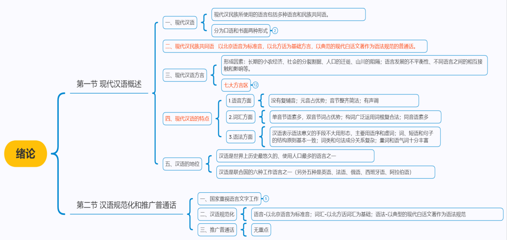

## 第一节 现代汉语概说

### 模块一：什么是现代汉语

• 汉语是汉民族的语言，现代汉语是现代汉民族所使用的语言。 

• 广义：现代汉语包括多种方言和民族共同语。

• 狭义：现代汉民族共同语就是以北京语音为标准音，以北方话为基础方言，以典范的现代白话文著作为语法规范的普通话。

语音、词汇、语法是语言的三要素。

- 从结构上说，语言是以语音为物质外壳（形式），以词汇为建筑材料，以语法为结构规律的一种音义结合的符号系统。

- 从功能上说，它可分以下三个方面。 

  - 1.就人与人的关系说，语言是人们最重要的交际工具，不分阶级一视同仁地为社会全体成员服务。

  - 2.就人与客观世界的关系看，语言是认知世界的工具。事物的类别和事物之间的关系都靠语言来表明。

  - 3.就人与文化的关系看，语言是文化的载体，人们利用语言积累知识、形成文化

现代汉语有口语和书面语两种不同形式。

- 口语是人们口头上应用的语言，具有口语的风格。
- 书面语是用文字记录下来的语言，是以口语为基础而形成的，具有与口语不同的风格。书面语趋于周密、严谨；结构完整，长句较多。
- 书面语的高级形式是文学语言。文学语言又称标准语，是现代汉民族语言中经过高度加工并符合规范化的语言。文学语言不仅包括优秀的、典范的文艺著作的语言，也包括社会科学和自然科学的语言。它比一般书面语更丰富、更具有表达力。

### 模块二：现代汉民族共同语

- 民族共同语，是一个民族全体成员通用的语言。 
- 方言，是某个民族内部局部地区的人们使用的语言。 
- 民族共同语是在一种方言的基础上形成的，作为民族共同语的基础的方言就叫做基础方言。 
- 什么方言能成为民族共同语的基础方言，要取决于这种方言在社会中所处的地位，取决于这个方言区的政治、经济、文化以至人口等条件。
- 现代汉民族共同语的形成和发展。现代汉民族共同语是在北方方言的基础上形成的

### 模块三：现代汉语方言

- 汉语方言俗称地方话，只通行于一定地域，是说汉语的局部地区使用的语言。
- 形成汉语方言的因素很多，有属于社会、历史、地理方面的因素。如，长期的小农经济、社会发生分裂割据、人口的迁徙，山川的阻隔等；也有属于语言本身的因素，如语言发展的不平衡性，不同语言之间的相互接触、相互影响等。
- 汉语各方言间的差异，语音最大，词汇次之，语法方面的差别最小。

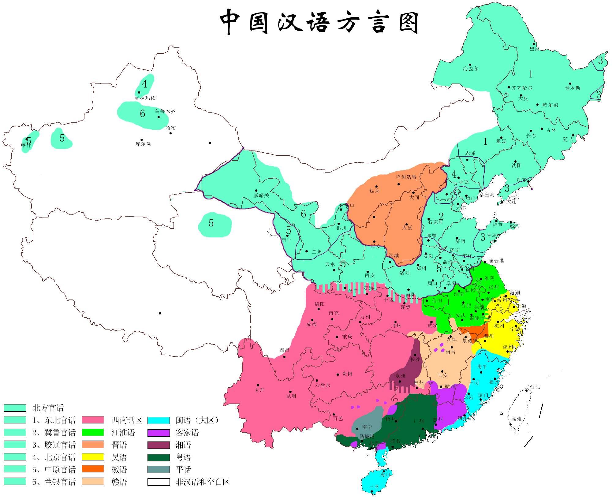

汉语各方言区简表

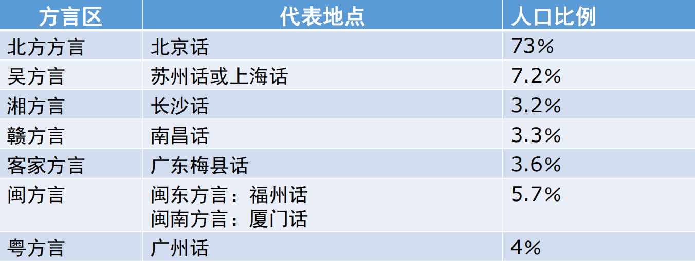

### 模块四：现代汉语的特点

（一） 语音方面

音节界限分明，乐音较多，噪音少，加上声调高低变化和语调的抑扬顿挫，因而具有音乐性强的特点。

具体表现如下：

（1） 没有复辅音

（2） 元音占优势

（3） 音节整齐简洁

（4） 有声调

（二） 词汇方面

（1）单音节语素多 双音节词占优势。汉语词形简短，古汉语单音词更多，发展到现代汉语，逐渐趋向双音节化。

（2）构词广泛运用词根复合法 汉语运用复合法，使用词根语素构成的合成词最多，用附加法使用词缀语素和词根语素构成的词特别少。

（3）同音语素多 因而用它造出的同音词也比较多。

（三） 语法方面

（1） 汉语表示语法意义的手段不大用形态，主要用语序和虚词。形态主要指表示语法意义的词形变化。

（2） 词、短语和句子的结构规则基本一致

（3） 词类和句法成分关系复杂

（4） 量词和语气词十分丰富

### 模块五：汉语的地位

- 汉语是世界上历史最悠久的、人口最多的语言之一。无论过去或现在，汉语在国内外都有很大的影响，具有很重要的地位。
- 汉语已经成了我国各民族间的交际语。
- 汉语、汉字在历史上对日本语、朝鲜语、越南语产生过重要影响。
- 汉语是联合国的六种工作语言之一（另外五种是英语、法语、俄语、西班牙语、阿拉伯语），在国际交往中，发挥着很重要的作用。
- 全球学习汉语的热潮正在不断升温。各国孔子学院发展很快。

## 第二节 汉语规范化和推广普通话

### 一、国家的重视语言文字工作

- 20 世纪50年代初就成立了中国文字改革委员会，国家有关部门于1955年召开了“全国文字改革会议”和“现代汉语规范问题学术会议”。**会议确定了现代汉民族共同语的含义和标准。**
- 会后国务院根据会议精神决定以“促进汉字改革、推广普通话、实现汉语规范化”为语言文字工作的三大任务。1956 年1 月国务院通过《关于推广普通话的指示》，同时决定成立中央推广普通话工作委员会。

- 2000年10 月，根据我国《宪法》制定的**《中华人民共和国国家通用语言文字法》**，经第九届全国人民代表大会通过，于2001年1月1日起施行。**这是我国历史上第一部关于语言文字的专门法**，它首次明确规定了普通话和规范汉字作为国家通用语言文字的法律地位，为加强语言文字应用的管理和促进语言文字的规范化、标准化提供了法律依据。

### 二、现代汉语规范化

- 语言规范化就是确定并推行某一语言的共同语及其内部一致的标准。现代汉语规范化就是确立现代汉民族共同语的明确的、一致的标准，并用这种标准消除语音、词汇、语法等方面存在的一些分歧，同时对它的书写符号———文字的形、音、义各个方面也要制定标准进行规范。 
- 现代汉语普通话的标准是“以北京语音为标准音，以北方话为基础方言，以典范的现代白话文著作为语法规范”。

- 现代汉语规范化工作，主要是根据汉语的历史发展规律，结合汉语结合汉语的习惯用法，对普通话内部（包括语音、词汇、语法各方面）所存在的少数分歧和混乱现象进行研究，选择其中的一些读法或用法作为规范，并加以推广；确定其中的另一些读法或用法是不规范的、应舍弃的，从而使汉语沿着健康和规范的道路向前发展，使人们在使用语言文字时有明确一致的标准。

### 三、推广普通话

- 普通话是现代汉民族的共同语。 《中华人民共和国宪法》第19条规定：“国家推广全国通用的普通话。” 
- 推广普通话十分必要。
- 20世纪50年代确定的推广普通话的工作方针是“大力提倡，重点推行，逐步普及”。

目前，推广普通话的方针是“大力推广，积极普及，逐步提高”。努力使普通话真正成为教学语言、宣传语言、工作语言、宣传语言。

- 1997年国务院决定，自1998年起，每年9月第三周为全国推广普通话宣传周。

# 现代汉语 - 语音

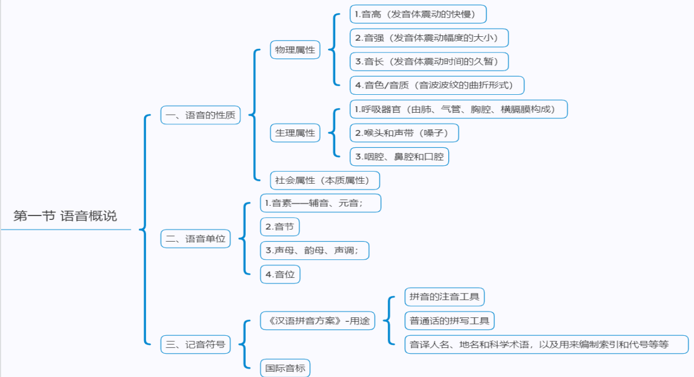

## 第一节 语音概说

## 

第一节 语音概说

• 一、语音的性质

• 什么是语音？语音是人类说话的声音，是语义的表达形式，是语言的物质外壳。

• （一）语音的物理属性

• 音波是由物体振动而产生的。周期性出现重复波形的音波叫乐音，不是周期性出现重复波形的音波叫噪音。

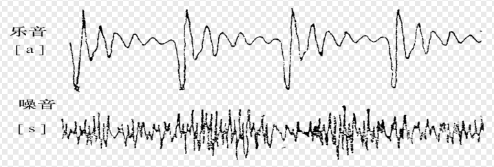

•1.音高

•音高指的是声音的高低，它决定于发音体振动的快慢

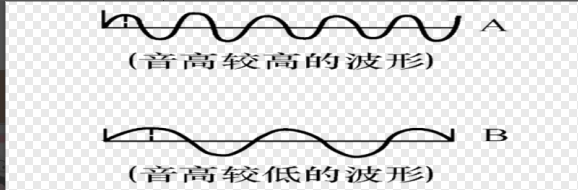

• 2.音强

•音强指的是声音的强弱，它与发音体振动幅度的大小有关。

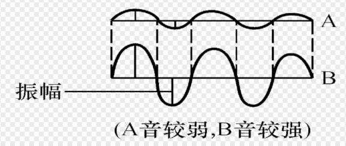

• 3.音长

•音长指的是声音的长短，它决定于发音体振动的时间的久暂。发音体振动时间持续久，声音就长，反之则短。语音也不例外。有的语言用音的长短来区别意义

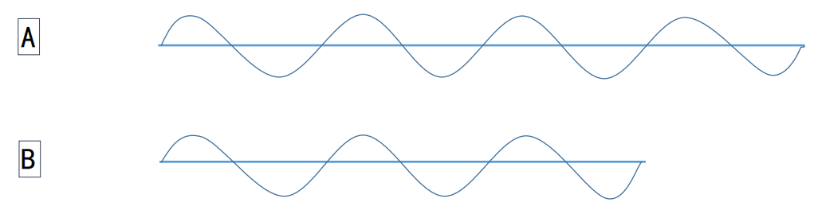

• 4.音色

• 音色又叫“音质”，指的是声音的特色。音色的差别主要决定于物体振动所形成的音波波纹的曲折形式不同。

• 造成不同音色的条件主要有以下三种：

• 第一，发音体不同。

• 第二，发音方法不同。

• 第三，发音时共鸣器形状不同。

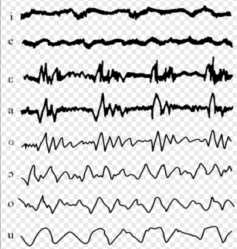

• （二） 语音的生理属性

• 语音是由人的发音器官发出来的，发音器官可分呼吸器官、喉头和声带、以及咽腔、口腔和鼻腔三大部分。 

• 1.呼吸器官

• 呼吸器官是由肺、气管、胸腔、横膈膜构成的。能呼出气流，气流是语音的动力。

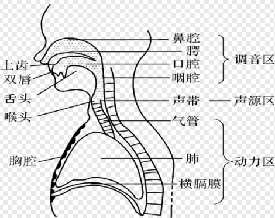

• 2.喉头和声带（嗓子）

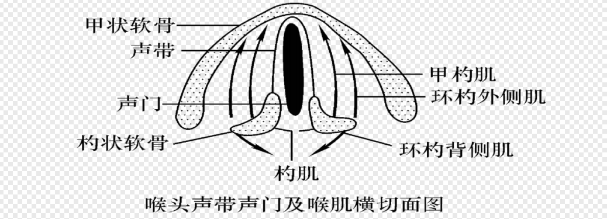

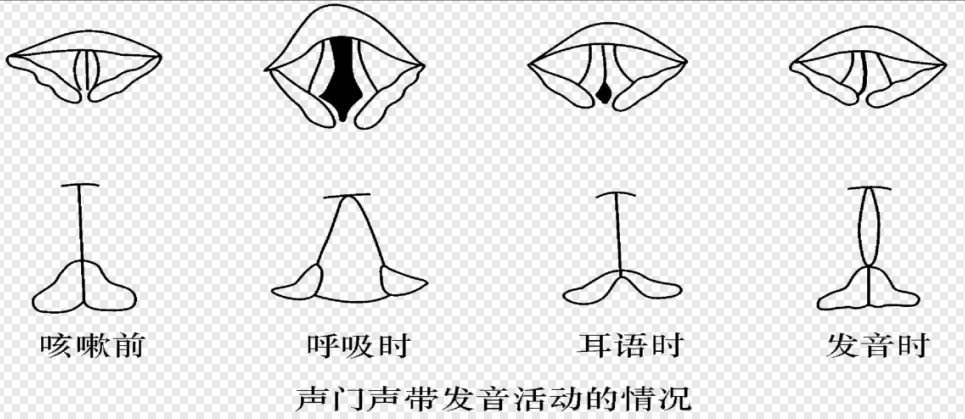

• 3.咽腔、鼻腔和口腔

•三者都能起共鸣器之扩大声音的作用。调节成多种多样的语音主要靠口腔内各器官起作用。

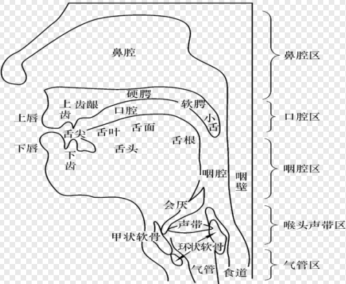

• （三） 语音的社会属性

• 语言是社会现象，作为语言的物质外壳，语音也是一种社会现象。这可从语音表示意义的社会性看出来。同样一个意义，比如“书”，在不同的语言或方言中就用不同的语音来表示。

• 用什么声音跟表示什么意义没有必然的联系，而是随着社会不同而不同，是由全体社会成员约定俗成的。同样的语音形式可以用来表示不同的意义

• 语音的社会属性还表现在语音的系统性上。不同的语言或方言有不同的语音系统，从物理和生理属性的角度看是不同的音，在语言中可能认为是相同的音。

二、语音单位

• （一） 音素———辅音、元音

• **音素是最小的语音单位。**它是从音色的角度划分出来的。一个音节，如果按音色的不同去进一步划分，就会得到一个个最小的各有特色的单位，这就是音素。

• 音素可以分为辅音和元音两大类：

• **辅音是气流经过口腔或咽头受阻碍而形成的音素，又叫子音。如b、m、f 、d、k、zh、s 等；**

• **元音是气流振动声带发出声音，经过口腔、咽头不受阻碍而形成的音素，又叫母音，如ɑ、o、e、i、u 等。**

• 请阅读教材，了解元音和辅音的区别。

• （二） 音节

• 音节由音素（或音位）构成的语音片断，是听话时自然感到的最小的语音单位。

• 每发一个音节时，发音器官的肌肉，特别是喉部的肌肉都明显地紧张一下。每一次肌肉的紧张度增而复减，就形成一个音节。几次紧张就有几个音节。一个音节可以只有一个音素，也可以是由几个音素合成。

• 一般说来，汉语一个音节用一个汉字来表示。例外是儿化音节，如“花儿”。

• （三） 声母、韵母、声调

• 按照汉语音韵学传统的字音分析方法，把一个字音分析成声母和韵母两段

，把贯通整个声韵结构的音高型式叫声调。

• 1.声母

• 位于音节前段，主要由辅音构成。例如，在“好”（hǎo）这个音节里，辅音h 就是它的辅音声母。

• 有的音节开头没有辅音，元音前头那部分是零，习惯上叫做“零声母”。就算是零声母音节。

• 例如“爱”（ài） 

• 声母和辅音不是一个概念。

• 2.韵母

• 位于音节的后段，由元音或元音加辅音构成。例如在“海”（hǎi）这个音节里，“ɑi”就是它的韵母。

• 零声母音节，例如“欧”（ōu），它的韵母就是零声母后面的“ou”。 

• 韵母和元音不相等。

• 3.声调

• 指的是依附在声韵结构中具有区别意义作用的音高型式。

• 例如“dǐ”（底）的音高，听起来先降到最低然后再升高上去，这种先降后升的音高变化格式就是音节“底”（dǐ）的声调。

• （四） 音位

• 音位是一个语音系统中能够区别意义的最小语音单位，也是按语音的辨义作用归纳出来的音类。

• 有同等使用价值的一组音素，可归并为一个音位。社会属性是决定音位的重要依据。

• 音位与音素的区别：

• 音素，是按语音的物理属性和生理属性划分出来的最小语音单位

• 音位，是按语音的社会属性划分出来的。

三、记音符号

• （一） 汉语拼音方案

• 1958 年2 月由第一届全国人民代表大会批准作为正式方案公布推行。

• 汉语拼音方案包括：字母表、声母表、韵母表、声调符号、隔音符号五部分内容。

• 汉语拼音方案有下列用途：

• 1.汉字的注音工具

• 2.普通话的拼写工具

• 此外，还可以用来作为我国各少数民族创制和改革文字的共同基础，用来帮助外国人学汉语，用来音译人名、地名和科学术语，以及用来编制索引和代号等等。

•（二） 国际音标

•国际音标是成立于英国伦敦的国际语音学会为了记录和研究人类语言的语音而制订的一套记音符号。它共有一百多个符号，符合“一个符号一个音素，一个音素一个符号”的原则，至今已经过多次修订。国际音标的最新版本是2005年发布的。

•由于符号简明，比较科学、细致，各国学者都用它记音。国际音标是语言教学和语言研究工作必备的工具。

>  华中师范大学 - 现代汉语（国家级精品课）- 曾常年、67863643、zengcai@sohu.com

av号：av63430594

# 现在汉语和现行汉字

## 为什么学习现代汉语?

> 为了更好，更自觉的了解和运用现代汉语。

1.《汉语拼音方案》

**（一）字母表：**共有26个：　Aa Bb Cc Dd Ee Ff Gg Hh Ii Jj Kk Ll Mm Nn Oo Pp Qq Rr Ss Tt Uu Vv Ww Xx Yy Zz 　其中v只用来拼写外来语，少数民族语言和方言。

**（二）声母表：**共有23个：b p m f，d t n l，g k h，j q x，zh ch sh r，z c s,y w 。
**（三）韵母表：**共24个：a o e， i u ü，ai ei ui， ao ou iu， ie üe er， an en in un ün， ang eng ing ong。

语言搭配受到文化的本位观念影响，并不是满足规则的就是可被接受的。

比如：女强人，女王可以，但是男强人，男王就一般不会这么说。因为这种强人，王的场景女生比较少，所以突出性别搭配。

## 现代汉语

### 定义

现代汉语：现代汉名族共同语、现代汉语语言。

语言：人类用于交际和思维最重要的符号系统。

人类要说出语言要满足条件：1.生理环境、2.语言环境

**对语言定义的解读：**

- 如果一个语言没有用于交际，可能就会"死亡",如果没记载的话。比如鲜卑语。
- 语言用于思维，可以分为：1.技术思维、2.形象思维、3.语言思维
- 语言是符号系统，比如字典几万个"有机"的"统一"的符号系统。
- 无必然联系的关系。

交际工具的分类:

- 听：**语言**、音乐
- 视：图画、手势、旗语、文字
- 触：握手、拥抱
- ...

从轻便型、无限性、精确性等方向考虑，语言是相对重要的符号系统。

- 为什么是相对的？因为语言也有词不达意的时候。

汉语传说从五帝时代就出现了,语言从古至今总共出现5K多种。

### 汉民族的语言分类

谱系分类：语言间亲属关系的亲疏。

九大语系：汉藏、印欧、、阿尔泰、乌拉尔、闪一含、伊亚-高加索、玛来-波利尼西亚、南亚、达罗毗荼。

汉藏语系：汉语、藏缅语族、苗瑶语族、壮侗语族。

### 现代汉民族的语言

原始汉语阶段：汉字产生以前

上古汉语阶段：先秦时代

中古汉语阶段：两汉至隋唐

近代汉语阶段：晚唐五代开始

现代汉语阶段：五四运动以后。

### 共同语和方言

共同语：一个语言社团共同使用的语言

方言：地域辩题，某一个读取的人民日常使用的交际工具。

> 共同语可能处于政治，文化，经济等方面考虑，选择一种方言，使其成为共同语。

现代汉语的方言从很早就有了。

秦始皇：车同轨书同文。

现代汉语共同语：普通鱼

现代汉语方言：七区：北方方言（官话）、吴、湘、客家、赣、粤。

形同义异

# 现代汉语语音

# 现代汉语语汇

# 现代汉语语法

# 现代汉语与运用

# 