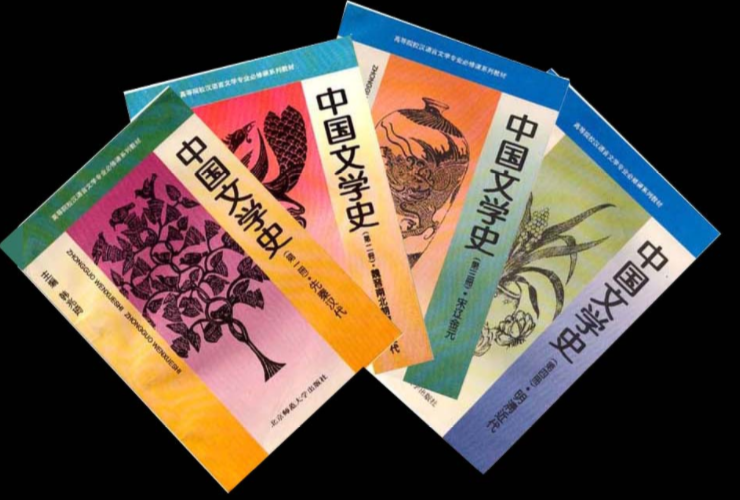
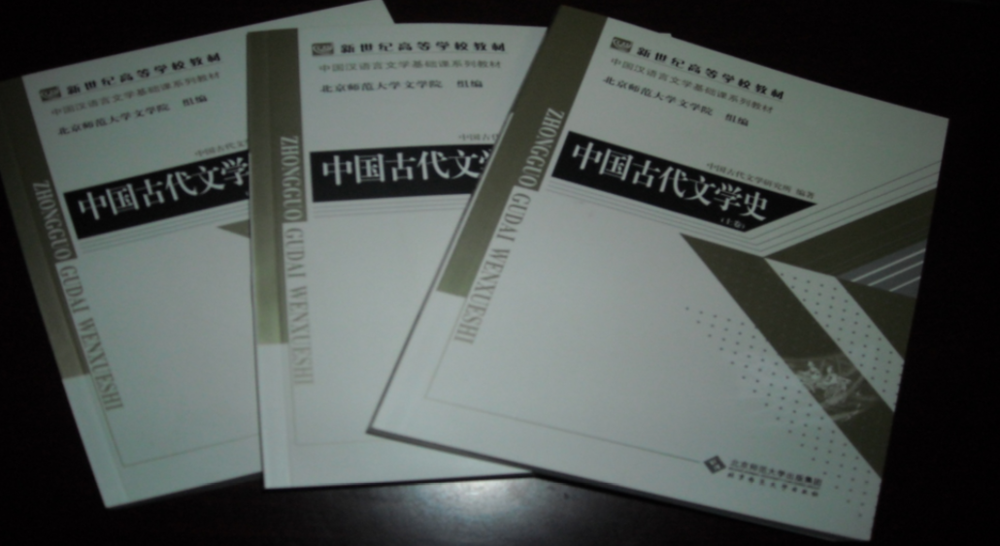
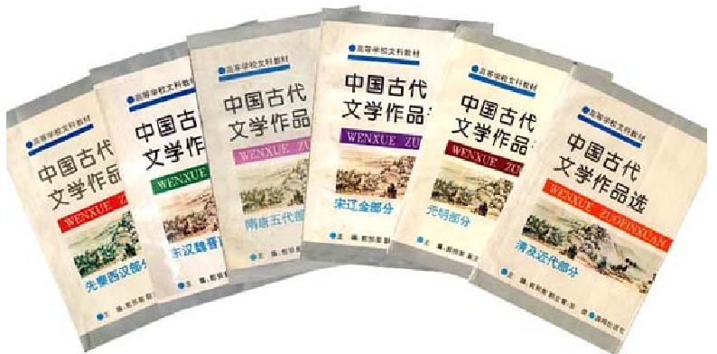
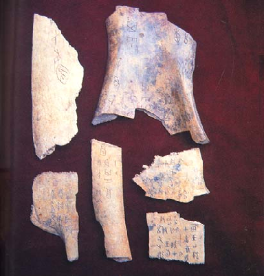
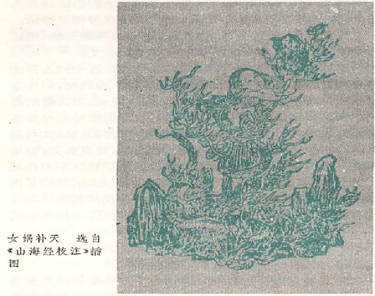
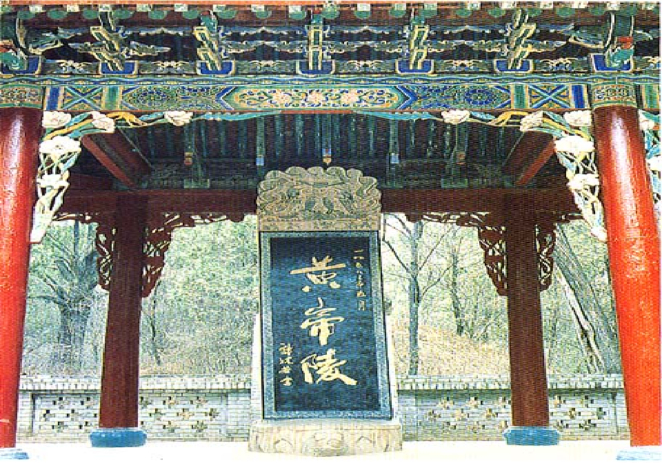
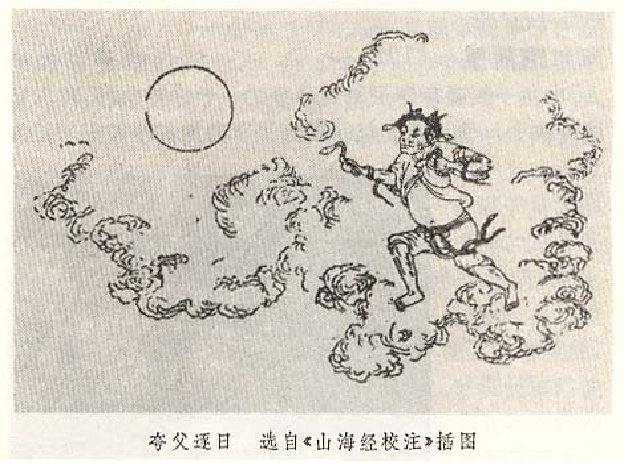
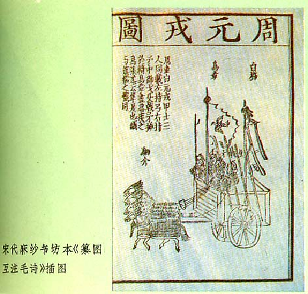
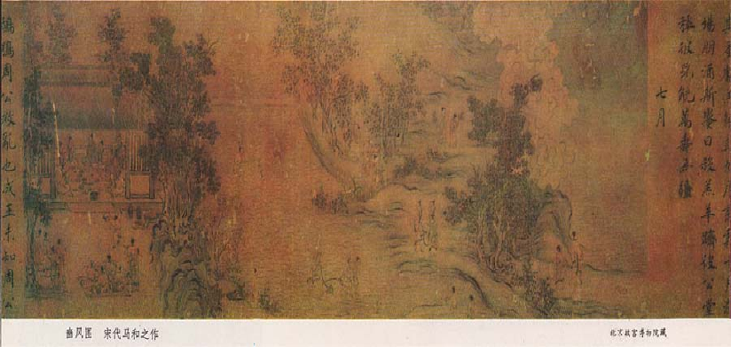

# 1 先秦部分

## 1-1 绪论

- 北京师范大学：中国古代文学史课程
  - b站： https://www.bilibili.com/video/BV1LU4y157fg?spm_id_from=333.337.search-card.all.click&vd_source=5086597142949c6b84ef0ce5afa9ecca
  - 爱课程：https://www.icourses.cn/sCourse/course_3822.html（带ppt）
- 课程资料整理：链接: https://pan.baidu.com/s/1ccPYD89eQ_7pSWdDsNSp7Q?pwd=1024 提取码: 1024

**课程名称：**

中国古代文学史（先秦两汉魏晋南北朝）主讲教师：尚学锋 工作单位：北京师范大学中文系

**课程简介:**

本课程是中国语言文学专业的一门基础课。它面向中文专业的本科生开设。这门课主要向学生讲授中国古代文学的发展过程及其在不同时期的创作成就和特点。

**具体内容:**

各个时代文学发展的概况、文学创作的主要成就、特点及其形成原因；历史上各种文学体裁发生、发展及变化的过程和原因；各个时期代表作家的创作成就、特点、地位及影响;各种文学流派的形成及其文学主张、创作成就、特点及影响。

**指定教材:**

**练习教材:**

**学前准备**

学习本课程前学生应当学过中学的历史课程，具备了比较完整的中国古代史的知识；应当学过文学概论课，能够掌握文学的基本原理和文学批评的基本术语；应当具有一定的古汉语阅读能力，能够借助注释读懂古代的文学作品。

### 第一节 先秦文学总论

#### 一、先秦文学的时间断限和主要样式

先秦文学是指从远古时代到秦代建立之前的文学。这个漫长的历史时期经历了原始社会、奴隶社会和封建社会初期三个发展阶段，文学的样式有神话、诗歌和散文。

#### 二、先秦文学的发展过程

原始社会时期的文学有歌谣和神话，它们都是集体的口头创作。由于当时文字还没有正式出现，这些作品都是后人根据传说记录下来的。

**夏朝的文学:**

《尚书》中的《夏书》是后人根据传说整理而成的。夏朝的诗歌有早期的歌谣《候人歌》和夏桀时的民谣。

**商朝的文学:**甲骨卜辞和铜器铭文是早期的文字记载

- **甲骨卜辞**

《卜辞通纂》第三七五片

癸卯卜，今日雨，其自西来雨，其自东来雨，其自南来雨，其自北来雨？

《卜辞通纂》第七三五片（手写）

- **铜器铭文：**《小臣邑斚铭》：

癸巳，王易小臣邑贝十朋，用作母癸

彝。惟王六祀，彡日，在三月。

> 商代的散文还有《尚书》中的《商书》以及《周易》中的《卦辞》和《爻辞》。

- **卦爻辞:**

羝羊触藩，不能退，不能遂。无攸利，艰则吉。（《大壮·上六》）

睽孤，见豕负涂，载鬼一车，先张之弧，后说之弧，匪寇，婚媾。（《睽·上九》）

枯杨生稊，老夫得其女妻，无不利。（《大过·九二》）

井渫不食，为我心恻，可用汲。王明，并受其福。（《井·九三》）

鸣鹤在阴，其子和之。我有好爵，吾与尔靡之。（《中孚·九二》）

**周朝的文学：**

历史散文空前地发展起来。《尚书》中的《周书》在记言记事方面都有了突出的进展，显示了古代散文在日益成熟。《周书》之外，诸侯国也各有国史。保留至今的《诗经》是周代乐官搜集和编定的乐歌，《诗经》成为我国诗歌史上辉煌的第一页。

**战国的文学：**

在百家争鸣中出现了诸子散文。历史散文的成就也非常引人注目。《左传》和《国语》的基本内容虽然是战国以前的史料，但它们的成书都在战国时期，而《战国策》的出现，更是把历史散文推向了新的高峰。在南方的楚地，出现了一种新的诗歌样式--楚辞。

战国文学是先秦文学的一个高潮。

#### 三、先秦文学的基本特征

1、应用性与现实性

先秦文学尚处在文学的初起阶段，这一时期，文学还没有同学术及其它艺术形式完全分离，形成独立的艺术门类，而是带有很强的应用性。先秦文学具有很强的现实性，作品的内容都与现实生活有关，其中总是大胆地表现对现实社会与人生的种种看法与感受，从来不回避现实问题。

2、独创性与典范性

先秦文学带有初创期的特点，这一时期，文学创作没有什么现成的模式可循，因此也就没有什么束缚创作的框框，不同的作者都力图在作品中自由地表现自己，作品带有鲜明的个性和独创性。不同的体式和风格互相争奇斗妍，各放异采。正是由于先秦文学的独创性，它成了后代文学的典范被人们所称道和取法。

3、鲜明的地域特征

《诗经》和儒家、墨家、法家的散文，产生于北方，表现了北方人民重实际而轻冥想的特点。屈原和宋玉的作品，想象丰富，文辞华丽，则是南方楚文化的产物。《庄子》的奇思遐想，除了受楚文化的影响，又与齐地有关海洋的传说有关。同是北方的文学，也由于地理环境和文化传统的差异而面貌不同，《诗经》中的十五国风，就表现出鲜明的地域文化的差别。

## 1-2 原始歌谣与神话

### 第二节 原始歌谣与神话

#### 一、原始歌谣

人类最早的文学样式是诗歌。最初的诗歌起源于人类早期的生活实践。原始人在生活实践中，产生了交往和抒发感情的需要，除了借助语言之外，他们还会发出一些抑扬顿挫的呼声。这种呼声就是歌唱的前身。当人们在有声无义的呼声中加入简单的语言，就形成了最简单的诗歌。

**《吴越春秋》中记载的《弹歌》：**

断竹，续竹，飞土，逐宍（肉）。

> 短短的四句八字，写出了人们砍削竹子，制造弹弓，射出弹丸，投击野兽的整个劳动过程，是一种质朴简略的原始猎歌。

**《吕氏春秋·古乐篇》的“葛天氏之乐”**

昔葛天氏之乐，三人操牛尾，投足以歌八阙：一曰载民，二曰玄鸟，三曰遂草木，四曰奋五谷，五曰敬天常，六曰达帝功，七曰依地德，八曰总禽兽之极。

**《礼记·郊特牲》中保存的相传为伊耆氏的《蜡辞》：**

土反其宅，水归其壑，昆虫毋作，草木归其泽。

**《山海经·大荒北经》中有一篇命令旱魃北行的诗：**

神，北行，先除水道，决通沟渎。

**《尚书·汤誓》中有一首夏桀时的民谣：**

时日曷丧，予及汝偕亡。

#### 二、上古神话

神话是古代人民对自然及社会的理解与想象的故事，是人类早期不自觉的艺术创作。神话的产生是用想象和幻想的方式征服自然，支配自然，把自然力加以形象化的结果。神话是早期人类的宇宙观，其中打上了原始社会生活的印记，也反映了原始思维的特点。

中国古代神话显得零碎而无系统。现存中国古代神话，主要散见于《山海经》、《穆天子传》、《庄子》、《楚辞》、《淮南子》、《列子》等古籍中。

##### 1、自然神话

A、关于太阳的神话：

东南海之外，甘水之间，有羲和之国。有女子名曰羲和，方浴日于甘渊。羲和者，帝俊之妻，生十日。（《山海经·大荒南经》）

汤谷上有扶桑，十日所浴，在黑齿北，居水中，有大木，九日居下枝，一日居上枝。（《山海经·海外东经》）

B、雷神：

雷泽中有雷神，龙身而人头，鼓其腹。在吴西。（《山海经·海内东经》）

C、风神飞廉：

飞廉，鹿身，头如雀，有角，而蛇尾豹文。（《楚辞补注》卷一洪兴祖注引晋灼曰）

##### 2、创世神话

A、天地混沌、宇宙开辟的盘古神话：

天地混沌如鸡子，盘古生其中。万八千岁，天地开辟，阳清为天，阴浊为地。盘古在其中，一日九变，神于天，圣于地。天日高一丈，地日厚一丈，盘古日长一丈。如此万八千岁，天数极高，地数极深，盘古极长，后乃有三皇。（《艺文类聚》卷一引徐整《三五历纪》）

昔盘古氏之死也，头为四岳，目为日月，脂膏为江海，毛发为草木。秦汉间俗说，盘古氏头为东岳，腹为中岳，右臂为北岳，足为西岳。先儒说，盘古氏泣为江河，气为风，声为雷，目瞳为电。古说，盘古氏喜为晴，怒为阴。（《述异记》卷上）

B、关于人类起源的神话：

俗说天地开辟，未有人民。女娲抟黄土作人，剧务，力不暇供，乃引绳絙于泥中，举以为人。故富贵者，黄土人也；贫贱凡庸者，絙人也。（《太平御览》卷七八引《风俗通》）

C、女娲补天的神话：

往古之时，四极废，九州裂，天不兼覆，地不周载，火（火监）炎而不灭，水浩洋而不息，猛兽食颛民，鸷鸟攫老弱。于是女娲炼五色石以补苍天，断鳌足以立四极，杀黑龙以济冀州，积芦灰以止淫水。苍天补，四极正，淫水涸，冀州平，狡虫死，颛民生。（《淮南子·览冥训》）

> T: 安利古代神话,杨利慧的课程/书籍

##### 3、英雄神话

A、“鲧禹治水”：

洪水滔天。鲧窃帝之息壤以堙洪水，不待帝命。帝令祝融杀鲧于羽郊。鲧复生禹。帝乃命禹卒布土以定九州。（《山海经·海内经》）

C、“黄帝杀蚩尤”：

蚩尤凿兵伐黄帝，黄帝乃令应龙攻之冀州之野。应龙蓄水，蚩尤请风伯、雨师，纵大风雨。黄帝乃下天女曰魃，雨止，遂杀蚩尤。（《山海经·大荒北经》）

B、“后羿射日”

逮至尧之时，十日并出，焦禾稼，杀草木，而民无所食。猰貐、凿齿、九婴、大风、封豨、脩蛇，皆为民害。尧乃使羿诛凿齿于畴华之野，杀九婴于凶水之上，缴大风于青丘之泽，上射十日而下杀猰貐，断脩蛇于洞庭，禽封豨于桑林。万民皆喜，置尧以为天子。（《淮南子·本经训》）

##### 4、传奇神话

《淮南子·地形训》所记的海外三十六国：

凡海外三十六国。自西北至西南方，有修股民、天民、肃慎民、白民、沃民、女子民、丈夫民、奇股民、一臂民、三身民。

自西南至东南方，结胸民、羽民、讙头国民、裸国民、三苗民、交股民、不死民、穿胸民、反舌民、豕喙民、凿齿民、三头民、修臂民。自东南至东北方，有大人国、君子国、黑齿民、玄股民、毛民、劳民。自东北至西北方，有跂踵民、句婴民、深目民、无肠民、柔利民、一目民、无继民。

#### 三、神话对后代文学的影响

1、创作方法：

神话的主要创作方法是幻想、拟人和夸张。在神话中，古代人民驰骋丰富的想象力，创造了许多奇异的形象和荒幻的故事，展现了超现实的神奇世界。

2、神话集中体现了古代人民的美好理想和英雄气概。

中国神话中的正面形象，大都具有不畏艰险，坚毅顽强，勇于斗争的特点，是牺牲自我，为民造福的英雄。这些形象，带有崇高的美学风格，给人以鼓舞和力量。

夸父逐日

3、神话是最早的叙事文学

在神话中，具有一定的故事情节，有各具特色的主人公形象，如果把散见于各书中的有关片断集中起来，可以看到，有些古时是相当曲折和生动的。古代神话中的形象、故事情节及叙事技巧对后代文学尤其是寓言和小说有重要影响。

## 1-3 诗经

### 第三节 《诗经》的结集与流传

#### 一、名称

《诗经》是我国第一部诗歌总集。它收录了西周至春秋中叶或稍后大约五、六百年间的三百零五篇诗歌。在先秦，它被称作《诗》或《诗三百》。汉代以后，它作为儒家经典的权威地位被确定下来，于是又有《诗经》之称。

#### 二、编排体例

《诗经》按《风》、《雅》、《颂》分类编排。《风》即“十五国风”，共160篇。《雅》分《小雅》、《大雅》，《小雅》74篇，《大雅》31篇，共105篇。《颂》包括《周颂》31篇，《鲁颂》4篇，《商颂》5篇，共40篇。目前绝大多数学者认为，风、雅、颂的区分与音乐有关。《诗经》中的作品都是可以配乐歌唱的，风、雅、颂分别代表了不同的音乐。

**“风”——乐调**

“大雅”《崧高》篇说：“吉甫作诵，其诗孔硕，其风肆好。”“风”即是指乐调。《左传》成公九年说：“钟仪……操南音。……范文子曰：‘……乐操土风……’”。“土风”就是指钟仪演奏的地方乐调。“十五国风”，就是用十五个地区的地方乐调演奏的乐歌。这些乐歌既代表了各国的音乐面貌，在内容上又一定程度地反映了该国的风土和风俗。

**“雅”——夏**

同时又与“夏”古字相通。“小雅”、“大雅”就是“小夏”、“大夏”。《墨子·天志下》引《诗经》“大雅”即作“大夏”。作为夏、商二朝统治的中心地区“夏”，当然就是正统，所产生的音乐就是正声。因此，“雅”就是代表王朝正统的西周京畿地区的乐歌。《雅》又分《小雅》、《大雅》。

**“颂”——“容”**

《汉书·儒林传》：“鲁徐生善为颂。”苏林注：“颂貌威仪。”颜师古注：“颂读与容同。”颂貌即容貌。又《唐韵》容字转声借之“羕”字，即现在的“样”字。清人阮元说：“所谓‘商颂’、‘周颂’、‘鲁颂’者。若曰‘商之样子’，‘周之样子’，‘鲁之样子’而已。……如三‘颂’各章，皆是舞容，故称之为‘颂’。”（《揅经室一集·释颂》）“颂”就是用于宗庙祭祀的舞曲。

#### 三、结集

**汉代学者有采诗的说法**

**班固说：**

“古有采诗之官，王者所以观风俗，知得失，自考正也。”（《汉书·艺文志》）

又说：

孟春之月，群居者将散，行人振木铎，徇于路以采诗，献之太师，比其音律，以闻于天子。（《汉书·食货志》）

**何休也说：**

男年六十，女年五十，无子者，官衣食之，使之民间求诗。乡移于邑，邑移于国，国以闻于天子。（《春秋公羊传》宣公十五年《解诂》）

**古代还有献诗的传说**

《国语·周语上》记载了西周厉王时召公的话：

天子听政，公卿至于列士献诗，瞽献曲，史献书，师箴瞍赋，矇诵，百宫谏，庶人传语，近臣尽规，亲戚补察，瞽史教诲，耆艾修之，而后王斟酌焉。

《国语·晋语六》记载了晋国范文子的话：

吾闻古之王者，政德既成，又听于民，于是乎使工诵谏于朝，在列者献诗使勿兜，风听胪言于市，辨妖祥于谣，考百事于朝，问谤誉于路，在邪而正之，尽戒之术也。

#### 四、《诗经》的年代

大致作于西周初年至春秋中叶（前11至前6世纪）约五百年间。《诗经》中最晚的作品，是讽刺陈灵公（前613--前599）与夏姬淫乱的《陈风·株林》。

#### 五、《诗经》的作者

只有少数作品留下了作者的名字。在那些不知名的作者中，绝大多数都是各级贵族以及朝廷乐官。即便有少量民谣，也经过朝廷乐官的润饰改编而失去其本来面目了。

#### 六、《诗经》的社会作用

《诗经》在周代作为礼乐的重要组成部分，被广泛地应用于祭祀、朝聘、婚礼、宾宴等各种典礼仪式，又是贵族学校中的一项教学内容。春秋时盛行赋诗言志，诗是重要的交际工具。孔子创立私人教育，仍然把《诗》作为主要传习对象。

孔子对弟子说：“小子何莫学夫《诗》？《诗》，可以兴，可以观，可以群，可以怨。迩之事父，远之事君；多识于鸟兽草木之名。”（《论语·阳货》）“兴”、“观”、“群”、“怨”，比较全面地概括了《诗》的社会作用，是儒家对《诗》的基本要求。

#### 七、《诗经》的流传

秦朝建立之后，实行文化专制政策，民间保存的《诗经》绝大部分被烧毁。西汉传《诗》的共有四家，其中鲁人申培所传的《鲁诗》、齐人辕固所传的《齐诗》和燕人韩婴所传的《韩诗》，是用汉代通行的隶书写成，称为“今文《诗》”。

另外一家《毛诗》，相传创始于鲁人毛亨，毛亨作《毛诗故训传》三十卷，授给赵人毛苌，其传本经文是用先秦古文字写成，称作“古文《诗》”。后来鲁、齐、韩三家诗逐渐亡佚（今仅存《韩诗外传》），只有《毛诗》流传至今。

> T: 方玉润 诗经原始、姚际恒 诗经通论

宋刻本《毛诗》

### 第四节 《诗经》的内容

《颂》用于庙堂祭祀，主要是颂赞之作。《雅》出自各级贵族之手，内容主要是颂赞和怨刺。《大雅》的作者地位较高，诗的内容多与重大历史事件有关，有些作品属于周朝的史诗。《小雅》的作者多为下层贵族，他们通过咏叹自己的生活，表达对王朝政治的看法。《国风》来自各个不同的地区，广泛地反映了不同地区，不同作者的生活和感情。

#### 1、颂赞诗

《周颂·维天之命》：

维天之命，於穆不已，於乎不显文王之德之纯。假以溢我？我其收之。骏惠我文王，曾孙笃之。

颂赞诗中有些作品具有较高的史料价值。《大雅》中的《生民》、《公刘》、《绵》、《皇矣》、《大明》和《商颂》中的《玄鸟》、《长发》等，分别记载了商、周两个民族的发展史。

大雅、文王

文王在上，於昭于天。周虽旧邦，其命维新……济济多士，文王以宁……商之孙子，其丽不亿。上帝既命，侯于周服。侯服于周，天命靡常……无念尔祖，聿修厥德。永言配命，自求多福。殷之未丧师，克配上帝。宜鉴于殷，骏命不易……上天之载，无声无臭。仪刑文王，万邦作孚。

#### 2、怨刺诗

《二雅》对现实的批评主要集中在朝政方面。诗人为国事而忧愤，对当权者提出激切的劝谏。如《大雅·瞻卬》、《大雅·荡》、《小雅·巧言》、《小雅·巷伯》。这些作品都敢于大胆地针砭时弊，带有浓厚的忧患意识和讽喻特色，它对后代文人诗歌影响很大。

《国风》中的怨刺诗反映社会下层的生活和思想感情。

诗人往往从自己的生活状况写起，抨击现实的不公，揭露当时严重的贫富对立。如《魏风·伐檀》、《魏风·硕鼠》。揭露和讽刺统治者的荒淫无耻是《国风》中怨刺诗的一项重要内容。如《邶风·新台》、《鄘风·墙有茨》、《齐风·南山》、《鄘风·相鼠》。《秦风·黄鸟》批判了秦穆公用人殉葬的残忍行为。

#### 3、征役诗

A、战争：如《小雅·采薇》、《小雅·出车》。

《秦风·无衣》表现秦国人民同仇敌忾，抗击戎狄：

岂曰无衣，与子同袍。王于兴师，修我戈矛，与子同仇。

岂曰无衣，与子同泽。王于兴师，修我矛戟，与子偕作。

岂曰无衣，与子同裳。王于兴师，修我甲兵，与子偕行。

B、《诗经》中很多作品表现征役之苦。

《唐风·鸨羽》、《邶风·式微》、《小雅·北山》、《卫风·伯兮》。

《王风·君子于役》：

君子于役，不知其期，曷至哉？鸡栖于埘，日之夕矣，羊牛下来。

君子于役，如之何勿思？君子于役，不日不月，曷其有佸？鸡栖于桀，日之夕矣，羊牛下括。君子于役，苟无饥渴。（《王风·君子于役》）

#### 4、婚恋诗

这些作品有的写恋人幽会的喜悦、男女不期而遇的欢乐。如《邶风·静女》、《郑风·野有蔓草》；

有的写相思的痛苦、失恋的愁怨，如《王风·采葛》、《郑风·狡童》；

也有的表现对爱情的坚贞，对家长的反抗。

如《鄘风·柏舟》：

泛彼柏舟，在彼中河。髧彼两髦，实维我仪。之死矢靡它！母也天只，不谅人只！

泛彼柏舟，在彼河侧。髧彼两髦，实维我特。之死矢靡慝！母也天只，不谅人只。

弃妇诗

如《邶风·谷风》、《卫风·氓》、《郑风·遵大路》等。它们描写主人公忠于爱情而被遗弃的命运，控诉了那个男女不平等的社会和不合理的婚姻制度。

《卫风·氓》：及尔偕老，老使我怨。淇则有岸，隰则有泮。总角之宴，言笑晏晏。信誓旦旦，不思其反。反是不思，亦已焉哉！

#### 5、农事诗

《雅》、《颂》中的这类作品往往和祭祀有关。《周颂》中的《臣工》、《噫嘻》、《丰年》、《载芟》、《良耜》，《小雅》中的《楚茨》、《大田》、《甫田》，是周代春夏祈谷、秋冬报成的乐歌，它们真实地再现了当时大规模的农业生产情况，是了解周代社会的极其珍贵的史料。

农事诗中最生动的诗篇当属《豳风·七月》

《诗经》中还有一些表现其它劳动生活的作品。

《周南·芣苢》是周代妇女采集芣苢时唱的歌，《召南·驺虞》、和《郑风·太叔于田》等是描写狩猎的作品，《小雅·无羊》再现了当时畜牧业的发达。这些作品都赞美了劳动的快乐和收获的喜悦，洋溢着浓郁的生活气息。

#### 6、礼俗诗

《周南·桃夭》是婚礼上的贺诗；《周南·葛覃》是女子归宁父母的诗；《周南·螽斯》是祝人多子的诗；《郑风·丰》和《齐风·著》是迎娶新娘的诗；《召南·采苹》写女子出嫁前的祭祀活动；《陈风·宛丘》写陈国的巫风歌舞。

《郑风·溱洧》写郑国三月上巳日在水滨“招魂续魄，祓除不祥”的春游社交场面：

溱与洧方涣涣兮，士与女方秉蕑兮。女曰“观乎？”士曰：“既且。”“且往观乎！洧之外洵訏且乐。”维士与士，伊其相谑，赠之以勺药。

溱与洧浏其清矣，士与女殷其盈矣。女曰“观乎？”士曰“既且。”“且往观乎！洧之外洵訏且乐。”维士与女，伊其将谑，赠之以勺药。

《小雅》中的礼俗诗往往表现周代上层社会的面貌和各级贵族的思想情趣。其中有的用于天子享诸侯之礼，如《蓼萧》、《湛露》、《彤弓》。更多的还是用于一般贵族聚会的乡饮酒礼。如《鹿鸣》、《伐木》、《鱼丽》、《宾之初筵》等。

呦呦鹿鸣，食野之萍。我有嘉宾，鼓瑟吹笙。吹笙鼓簧，承筐是将。人之好我，示我周行。

### 第五节 《诗经》的艺术成就和影响

#### 一、《诗经》的艺术成就

**1、鲜明的形象性**

《诗经》中大部分作品是抒情诗。这些诗不以刻划人物为主，但其中有了较为鲜明的主人公形象。诗人往往通过感情的直接倾诉，使人感受到他们的不同个性。有的作品在抒情中带有一些细节和行动描写，使主人公的情态宛然可见。有的作品运用了景物和环境描写来渲染气氛，烘托感情。

《小雅·采薇》：昔我往矣，杨柳依依。今我来思，雨雪霏霏。行道迟迟，载渴载饥。我心伤悲，莫知我哀。

《王风·君子于役》：君子于役，不知其期，曷至哉？鸡栖于树，日之夕矣，羊牛下来。君子于役，如于何勿思！

《陈风·月出》：月出皎兮，佼人僚兮。舒窈纠兮，劳心悄兮。

《秦风·蒹葭》

蒹葭苍苍，白露为霜。所谓伊人，在水一方。遡洄从之，道阻且长；遡游从之，宛在水中央。

蒹葭凄凄，白露未晞。所谓伊人，在水之湄。遡洄从之，道阻且跻；遡游从之，宛在水中坻。

蒹葭采采，白露未已。所谓伊人，在水之涘。遡洄从之，道阻且右；遡游从之，宛在水中沚。

**2、赋比兴手法的运用**

A、朱熹说：“赋者，铺陈其事而直言之也。”（《诗集传》）

赋就是直言其事，直抒其情。在《诗》中，它是一种积极修辞手段。诗人往往用这种手法对客观事物展开具体细致的描绘。

《小雅·无羊》

谁谓尔无羊？三百维群。谁谓尔无牛？九十其犉。尔羊来思，其角濈濈。尔牛来思，其耳湿湿。

或降与阿，或饮于池，或寝或讹。尔牧来思，何蓑何笠，或负其餱，三十维物，尔牲则具。

尔牧来思，以薪以蒸，以雌以雄。尔羊来思，矜矜兢兢，不骞不崩。麾之以肱，毕来既升。

……

用赋的手法来抒情

如《齐风·鸡鸣》：

鸡既鸣矣，朝既盈矣。匪鸡则鸣，苍蝇之声。

东方明矣，朝既昌矣。匪东方则明，月出之光。

虫飞薨薨，甘与子同梦。会且归矣，无庶予子憎。

B、朱熹说：“比者，以彼物比此物也。”

比就是比喻。有时，诗人运用博喻，把一连串比喻排列在一起，从不同角度突出事物的特征。如《卫风·硕人》中用“手如柔荑，肤如凝脂，领如蝤蛴，齿如瓠犀，螓首蛾眉”来刻划庄姜的美貌；《大雅·常武》中用“王旅啴啴，如飞如翰，如江如汉，如山之苞，如川之流”来显示周朝军队的强大气势，非常精彩传神。

《诗》中还有通篇用比的作品。如《豳风·鸱鸮》假托一只小鸟诉说其不幸遭遇，以比喻下层人民的生活惨况，是一首新颖别致的禽言诗。

C、朱熹说：“兴者，先言他物以引起所咏之词也。”

兴用于一篇或一章的发端，用以引出后面的句子。有的兴句与后面的内容没有内在的联系，只是起个引子的作用。。有些起兴的意象具有丰富的内涵，可在诗中产生多重艺术效果。

现代学者何定生认为：“兴的定义就是：歌谣上与本义没有干系的趁声。”

刘大白认为，“兴就是起一个头……这个起头，也许合下文似乎有关系，也许完全没有关系。”

朱自清则认为，“《毛传》‘兴也’的‘兴’有两个意义，一是发端，一是譬喻；这两个意义合在一块才是‘兴’。

《周南·桃夭》

桃之夭夭，灼灼其华。之子于归，宜其室家。

桃之夭夭，有  有实。之子于归，宜其家室。

桃之夭夭，其叶蓁蓁。之子于归，宜其家人。

《周南·关雎》

关关雎鸠，在河之洲。窈窕淑女，君子好逑。

参差荇菜，左右流之。窈窕淑女，寤寐求之。

求之不得，寤寐思服。悠哉悠哉，辗转反侧。

参差荇菜，左右采之。窈窕淑女，琴瑟友之。

参差荇菜，左右芼之。窈窕淑女，钟鼓乐之。

小雅.鹤鸣

鹤鸣于九皋，声闻于野。鱼潜在渊，或在于渚。乐彼之园，爰有树檀，其下为萚。它山之石，可以为错。

鹤鸣于九皋，声闻于天。鱼在于渚，或潜在渊。乐彼之园，爰有树檀，其下为榖。它山之石，可以攻玉。

比和兴的区别是什么？

一般来说，比是用一种事物比喻另一种事物，两种事物之间一定要有某种较为直观的相似性。而兴则是通过具体物象来感发意志，引起联想，物象与诗义之间不一定要有什么逻辑上的联系。凡是触景生情、托物言志、启发感悟、引申发挥等，都属于兴。比兴手法常常在结合在一起，引譬连类，含蕴无穷。

> 中国诗歌核心就是比兴的运用

**3、富于表现力的诗歌形式**

A、《诗经》语言的音乐性

《诗经》中主要是四言诗，每句二拍，每拍两字。但不少作品又突破了四言的格局采用从二言到八言不等的句式，形成了参差错落，灵活多变的诗体。

《诗》与音乐配合密切，普遍采用了回环复沓，重章叠唱的形式。

《周南·芣苢》

采采芣苢，薄言采之。采采夫苢，薄言有之。

采采芣苢，薄言掇之。采采夫苢，薄言捋之。

采采夫苢，薄言袺之。采采夫苢，薄言襭之。

清代方玉润称赞此诗说：“读者试平心静气涵泳此诗，恍听田家妇女三三五五，于平原绣野，风和日丽之中，群歌互答，余音袅袅，若远若近，忽断忽续，不知其情何以移而神之何以旷，则此诗可不必细绎而自得其妙焉。”

B、《诗经》的语言

《诗经》的语言是经过提炼加工的书面语，其特点是准确生动，丰富多彩，特别是动词和形容词运用得巧妙精当。《诗经》中还大量使用了双声、叠韵、叠字词语，增强了作品的形象感和音乐美。《诗经》中有很多词汇，如“瞻望”、“伫立”、“翱翔”、“颠沛”、“一日三秋”、“忧心如焚”、“赳赳武夫”、“如切如磋”、“如琢如磨”等，至今还为人们习用。

#### 二、《诗经》的影响

1、《诗经》的写实精神。其中很多作品是“饥者歌其食，劳者歌其事”的产物。诗人直抒胸臆，敢于大胆地反映现实，旗帜鲜明地颂美与怨刺。这种强烈的现实性是我国古代诗歌创作的一个优良传统。

2、《诗经》的赋比兴手法以及纯熟的创作技巧，被后代诗人大量借鉴。特别是比兴，在古代诗歌中已不单纯是表现手法，而是生动的形象与深厚的内容、蕴蓄无穷的风格的统一。它是我国诗歌史上最重要的创作原则。

3、《诗经》灵活多样的诗歌形式和生动丰富的语言也对后代各体文学产生了重要影响。

## 1-4 历史散文的形成于《尚书》

## 1-5 《春秋》《国语》

## 1-6 《左传》

## 1-7 《战国策》

## 1-8 诸子散文概说

## 1-9 《论语》

## 1-10 《墨子》

## 1-11 《老子》

## 1-12 《孟子》

## 1-13 《庄子》

## 1-14 《荀子》

## 1-15 《韩非子》与李斯散文

## 1-16 《楚辞》

