## 短篇小说介绍

### 为什么想学

很早很早，我就像成为一个小说家，但是渐渐的彷佛被生活磨平了棱角，再也提不起笔了。

突然有一天，我看到了短篇小说培训课程，我沉寂的心再次跳动了起来。

于是，在2023-07-27，我向自己许下了一个愿望，我希望自己可以自由的写故事。


### 为什么写短篇小说

> 市场决定的，如果想要钱，就迎合市场。

1.字数较少：短篇(1~3万，更好写) 长篇（十万字起步）

2.竞争压力小：短篇（模仿者少，不卷） 长篇 (平台成熟作者较多）

3.需求量大：短篇(市场稿件供不应求，更好中稿）

4.天花板高： 短篇(大小`版权`交易活跃，收益更高）

5.收益好：短篇（`稿费`千字百元左右） 长篇（千字数十元左右）

6.变现：短篇（短篇故事-签约变现-IP打造[影视、出版等]） 长篇（长篇连载-签约变现-IP打造[影视、出版等]）

### 为什么你也能轻松入局？

1. 短篇小说字数少、碎片化时间可做

短篇小说1-3万字即可，有的同学可能觉得自己没写过1-3万字看上去也很多不太好写，但是你只要掌握了构建故事的方法和框架的创作方法，在往里面填充内容，学过的同学都说根本停不下来

其次大家利用碎片化时间就可以做，像是《流浪地球》的作者刘慈欣，正职是工程师，利用业余时间写作，工作不忙的时候一天写三千到五千字，也有了今天的成就。

2. 零成本投入，有手机就能写，发展机会多

从入门门槛来说，文字内容创作是所有互联网平台创作的基础，不需要像短视频创作一样进行剪辑、拍摄等操作，相对实操门槛低一些。不限时间不限地点，你只要有想法就可以随时随地用手机进行想法的记录和创作。

> 疑问: 我从来没写过小说，我应该写什么呢？ 

写短篇小说能有多少收益呢？
• 平台那么多，我应该选择哪个平台去写呢？
• 我平时读书少，没有什么墨水，我能写吗？
• 写1万字小说需要花多久时间呀？

### 短篇小说的收益

#### 大小IP

- 大IP(版权)作品：影视版权费收入可达到百万元以上

推荐阅读：

- [ ] 暗黑桃花源：一场时间之外的梦境 （百万元以上的影视版权）
- [ ] 真实职场：进击的互联网人
- [ ] 花市街
- [ ] 《[洗铅华](https://www.zhihu.com/xen/market/remix/paid_column/1230857646238437376)》
- [ ] [七月荔](https://m.thepaper.cn/baijiahao_7766844)的盐选专栏《洗铅华:恶毒女配生存录》在4月共获得近40万元收入；
- [ ] 川戈的盐选专栏6w字的《暗黑桃花源》，售出百万元以上的影视版权。既有签约后的作品分成，也有影视、出版版权的收益~
- [ ] 《[监狱残酷物语](https://www.zhihu.com/xen/market/remix/paid_column/1234877614152089600@)》
- [ ] 《[请回到2008](https://www.zhihu.com/xen/market/remix/paid_column/1268595132682280960)》已出售影视版权
- [ ] 《姐姐的脸红日记》 闲得无聊的仙女 （ 收益: 3 篇稿子 (单篇 3w 字内) 挣出 2 套房，价值上百万）
- [ ] 《红高粱》为例，原著作者莫言的电视剧版权费用高达1000万元
- [ ] 《长安十二时辰》，马伯庸影视版权卖了1000万
- [ ] 《鬼吹灯》系列八部曲早在2007年，就被天下霸唱以216万元的价格卖给了起点中文网
- [ ] 《斗罗大陆》唐家三少，版权售价高达9000万
- [ ] 《鉴爱高手，年请20》
- 小IP（版权）作品（1-3w字）：影视版权费收入可达到五万元以上

#### 市场

长篇网文，动辄百万字的故事，而短篇小说一般来说字数在1万-3万字左右，是近些年崛起的一种文体

像是知乎盐选、百度文学、UC、微博、网易lofter、阿里文学、等等平台都早早加入短篇赛道，各自有自己的短篇故事业务；

2022 年 9 月，快手推出免费小说 app；
2023 年 4 月，抖音内测「抖音故事」；

- 短篇小说同样拥有强大的影视改编空间，6w字的《暗黑桃花源》售出百万元以上的影视版权，2w 字的流浪地球改编成 2 部史诗级电影

- 网文改编影视： 仅2022年，播放量前10、豆瓣口碑前10的国产剧中，由网络文学改编而成的就占了半数以上。其中，成绩比较显眼的剧集，如《风吹半夏》《开端》《苍兰诀》《星汉灿烂》都是由网文改编。
- 据第三方机构易观数据，2022年，主要网络文学平台营收规模超230亿元包括出版、游戏、影视、动漫、音乐、音频等在内的中国网络文学IP全版权运营市场整体影响规模超252亿元，预计到2025年将突破300亿元。

#### 变现

> 核心是浏览量

##### 【签约变现】

正是因为平台方有一定的需求量，所以当你具备了一定的内容创作能力，就可以投稿给到各个平台，平台觉得不错就会进行签约，签约后一般来说，就会按照平台的规则进行每月分成。

##### 【投稿变现】

 市面上有很多的文化机构，他们主要是生产优质的内容，所以也会开放投稿渠道，也有短篇故事的稿件需求，大部分是给到千字XX元稿费进行合作，有一些也会有分成合作。

##### 【版权交易】

相信大家都知道有很多长篇网文改编成的电视剧、电影，这个过程就会产生版权交易，也就是你把你的作品授予影视方，进行影视化改编，那么就会获得一份收益。
除了影视作品改编，像是出版成为纸质书，也会有版权的收益。

##### 【知乎盐选专栏】

什么是知乎短篇故事：具有`现实特色`，解决`实际问题`，也就是在一个个回答内去创造具备`思考性`、`逻辑性`的文章

知乎比较成功的故事案例：

- 情感故事：

```
古代言情，以架空历史为背景发生的爱情故事。因为没有现实背景的限制，古言的设定、剧情发展有更大的空间，可以三妻四妾、争权夺利、先婚后爱、青梅竹马等，可以衍生出非常吸引眼球的故事设定。
现代言情，有时代感和鲜活感。在不同的现实场景下，与不同职业的人谈恋爱。
世情故事，包括家庭婚姻、伦理纠纷、家长里短的故事，基于现实情感，不限于在爱情里做文章，而是把故事背景放在日常生活场景下，通过各种家庭关系产生的冲突故事。
```

- 真实故事：职业故事（有门槛，需要一定的专业性）；案件解析（有理有据，写人性的扭曲罪恶）
- **脑洞故事**：换个角度看世界，找到一个大众不常，用的角度来写

- 科幻故事：**有情感输出，是生活化的。**
- 悬疑故事：**重在推理，**逻辑严密。

写的题材内容尽量命中热点或者用户画像（18-30）的共鸣

> 故事本身就是对生活的记录，只是剔除了无聊的部分而已。

盐选专栏变现方式：

- 会员阅读：点击分成
- 盐选专栏：单购费用
- 版权：交易费用

推荐阅读：

- [ ] 完美谋杀
- [ ] 洗铅华
- [ ] 时空缉凶

### 短篇小说的类型

#### 悬疑小说

1. 阿瑟·柯南·道尔 (Arthur Conan Doyle) - 著名侦探小说家，创造了福尔摩斯。
2. 阿加莎·克里斯蒂 (Agatha Christie) - 世界著名侦探小说女作家，代表作《东方快车谋杀案》、《尼罗河上的惨案》等。
3. 雷蒙德·钱德勒 (Raymond Chandler) - 20世纪美国硬汉侦探小说的代表人物，创造了私家侦探菲利普·马洛。
4. 达什尔·哈米特 (Dashiel Hammett) - 硬汉侦探小说的重要代表，作品有《马尔特·费尔》、《大雨》等

#### 恐怖小说

1. 埃德加·爱伦·坡 (Edgar Allan Poe) - 恐怖文学的先驱，代表作《黑猫》、《压抑的欲望》等。
2. 斯蒂芬·金 (Stephen King) - 当代最著名的恐怖小说家，作品有《闪灵》、《看不见的人》等。
3. H.P.洛夫克拉夫特 (H.P. Lovecraft) - 喜欢用神秘、未知的元素创造恐怖氛围，作品有《克苏鲁神话》系列。
4. 莫里斯·勒布朗 (Maurice Leblanc) - 创造了法国版福尔摩斯阿森·吉尔。


如今比较受欢迎的主题：

- 职业主题（真实经历）
- 情感故事（甜、虐、撕）

```
古代言情、现代情感
男欢女爱、家长里短
人类永恒关心的话题
```

推荐阅读：

- [ ] 人间千百味：生活的酸甜苦辣咸
- [ ] 废墟里的向日葵

- 社会议题（结合热点）

### 好的开篇

开篇写不好、岁月催人老；杜绝废话多、杜绝段落长

#### 常见写作误区

##### 错误选择创作视角

故事的创作视角就是叙述视角，可以分为三类：第一人称视角“我”，第二人称视角“你”，第三人称视角，即全知全能的视角，也叫“上帝视角”

创作视角在故事中可以相互转换的，但不建议转换得过于频繁。

在一个较为简单的情节内，转换视角会造成理解成本的增加，所以建议写作者不要过多在作品中转换视角，最好选用同一种视角叙述故事。

假设我们一个男女之间吵架的场景：

    昨天下午，女朋友因为手机里一条暧昧短信，和我大吵了一架了。（安南视角）
    吵架这个事情，安南不知道，他的女朋友要比他心烦得多。（第三视角）
    安南不想道歉，因为他觉得那个信息没什么，主动道歉有失男人的身份。（第三视角）
    你跟别的女生聊得那么暧昧，我看手机这事儿没做错，我才不道歉。安南的女朋友也这么想。（女友视角）

这个场景原本非常容易理解，安南和女朋友吵架，互相谁也不肯道歉，但是四句话内视角切换了三次，过多的角色视线就会造成理解的成本的增加。

##### 不必要的描写过多

在写作中，很多创作者喜欢用心理或环境描写来凸显人物的性格、事件、情绪的变化。

但心理描写或环境描写过多，容易造成文章冗长，读者抓不到重点等问题，也是在众多作者中常见的一个写作误区。

需要肯定的是，创作离不开心理描写和环境描写，适当的描写可以更好地传达情感，烘托故事气氛。

但如果故事中做了过多的心理描写和环境描写，甚至还有大量的与情节无关的细节描写，这样会导致故事情节感被文字冲淡。

遇到这种情况时，一定要重读内容，提炼情节重点，将不必要的描写精简甚至删除。

##### 原文：

```
年华似水，一逝不在，人生之中的羁绊，总是魂牵梦绕，扣人心弦，青春年少，留不住一世情。
余生再长，终抵不过光阴飞逝，留念再久，敌不过世事变迁。

旭阳无情，划开一幕幕光影，可过去的记忆，依旧是心底的秘密，从不曾被人揭起。

雪花飘落，凉意不断的侵袭，这个时候，她最想做的就是睡个懒觉，捂的严严实实的，不想起床吧。

床头的手机响了起来，尽管是听到了，但还是没有睁开眼睛，手在不断的摸索着，直到拿在手里凭借着记忆将电话接了起来。

然后便是很柔和的的声音，说了一句：“喂，哪位？”
“还没有睡醒吗？”
她听到这个声音之后立即坐了起来，显的格外精神，道：“起床了，已经起了。”
“昨晚是不是熬夜了啊？”对她来说，极其温柔的声音，让她心里都是暖滋滋的。
“没有啊，”她连忙否定，还做着些小动作。“你那边还好吗？工作顺利吗？天冷了，你有没有加衣服啊？”
在一系列的问题之后对面平静的传来了一句话：
“我回来了。”
```

##### 改后：

```
凉意的侵袭的早晨，她最想做的就是睡个懒觉，捂的严严实实的，不想起床吧。

床头的手机突然响了起来，尽管是睁开眼睛，手在不断的摸索着，拿在手里凭借着记忆将电话接了起来。

然后便是很柔和的的声音，说了一句：“喂，哪位？”
“还没有睡醒吗？”
她听到这个声音之后立即坐了起来，显的格外精神，道：“起床了，已经起了。”
“昨晚是不是熬夜了啊？”
“没有啊，”她连忙否定，“你那边还好吗？工作顺利吗？天冷了，你有没有加衣服啊？”
在一系列的问题之后对面平静的传来了一句话：
“我回来了。”
```

在这个开篇里，作者要交代的情节是，在一个寒冷的早上，主角接到一个电话，电话对面的人说他要回来了。

这里的情感最浓烈的地方应凸显在「我回来了」这句话，因为对方可能是主角远在他乡的暗恋对象或者是异地恋人。

而前面过于冗长的背景铺陈，中间过多女主小动作、心情的细节描写，反而消减了情节中情感的冲击和起伏变化。

简单来说讲故事还是要以讲情节为主。我们要在心理描写和环境描写时把握适当的尺度，不做过多着墨，而把笔墨和精力更多地花在主要人物和主要事件上。

#### **废话多案例:**

天空有些灰，七楼的窗外纷飞着无声的雪

十天之后，我和丁婉云将举行婚礼。父亲人脉广，早定妥了二十台豪车，作为接亲车队。当天车队的行进路线、婚礼的各个流程 以及六十桌酒席的具体菜品，都已敲定

婚礼的准备工作基本就绪，除了一件事。

我们还没有拍婚纱照。

丁婉云迟迟不去，总说来得及。

**废话多:** **大量的环境描写，不知所云的感慨、情绪、内心独白，自以为展示文笔优美，但实际上让大量读者失去阅读兴趣。**

#### **段落长案例**

我喜欢一个人很久很久，久到我忘了是什么时候认识的，他叫零

他阳光帅气，是个开朗的大男孩，在学校很多人都认识他，包括我

他有女朋友，是个漂亮的女孩

青春萌芽，心里开始对美好的事物有了热爱

也是从那个时候开始暗恋零

我以为暗恋他，只有我自己知道

可是

当我为他挡下子弹，浑身是血的躺在他怀里时

他哭了

**段落长:节奏拖查，漫长的背景介绍，不断地介绍、解释时代、环境、天气、主人公的过去、现在、外貌、特征··.....**

#### **黄金三句**

导语的作用:第一秒把用户抓住，才有收益分成。导语是故事收益的起点，至关重要

推荐阅读：

- [ ] 无限黄昏 （爆火全网，收益过百万）
- [ ] 奇说妙语：20个猜得到开头，猜不到结尾的故事

你失明了，

突然有一天你恢复了视力，

脑海里却有一个声音说:

[ 别告诉他们你看得见。]

#### **三有一反原则**

> 利用三有一反原则达到黄金三句的效果

```
三有: 有内涵、有悬念、有情绪。
一反: 反常识
```

##### **反常识**

```
你失明了，

突然有一天你恢复了视力，(这是一件好事)

脑海里却有一个声音说:

[ 别告诉他们你看得见。] (为什么一件好事不能和他们分享? 他们又是谁呢? )
```

> 创作架构：
>
> 正常的情况+不正常的行为
>
> 不正常的情况+正常的行为

##### 有内涵

信息量大，细思极恐

推荐阅读：

- [ ] 《[治愈你、杀了你:心理医生催眠杀人事件](https://www.zhihu.com/xen/market/remix/paid_column/1191076245314633728)》（盐选爆款专栏，总收益100 万元+热度 32.7w）

```
我的爱人死了， (怎么死的? 哪天死的? 谁干的? )

那天死的，

我看见了。 （是自杀吗? 是他杀吗? 和我有关系吗?）
```

> 创作架构:
>
> 极致精炼的语言，只表达事件结果

##### 有悬念

- [ ] 《与百鬼夜行无惧，立众人之间惶恐》(盐选爆款专栏，总收益15 万元+，热度 10w)

```
过年前，我在业主群里抢到了大额红包.   (一件正常的小事)

半个小时后，发红包的业主索要无果，跳楼了他留下一句话:[你们真的不退吗?]  (一个不正常的极端结果)
```

> 创作架构：
>
> 普通事件+极端结果+无限可能

##### 有情绪

- [ ] 《生身母亲来袭》（盐选爆款专栏，总收益 80 万元+，热度20w）

```
我的父母在我两三岁时，就抛弃了我。 (情绪点: 同情，憎恶）

25年后，等我有房有车有好工作， (情绪点: 欣慰、快乐)

他们却找上门来了。 (情绪点: 惊讶、恼怒、疑惑)
```

> 创作架构：
>
> 每句至少带有一个不同的情绪点

#### 练习

任选一个故事题材，利用黄金三句原则创作一篇故事的导语

````
# 情感故事（甜、虐、撕）
我快死了
他十天后亲手掐死我，并对我说：
我爱你
````

##### 作业点评:

我怀孕了深夜醒来，

老公却不在身边

我走到客厅，刚想开灯，听见厕所里传来他的声音:[放心，孩子根本不是我的，我压根就没碰过她。

我一下子懵了。什么叫没碰过我?那之前和我在一起的人又是谁?

##### 作业优化：

我怀孕了。

深夜，客厅里传来老公的低语!

[放心，孩子根本不是我的。

###  推荐阅读

> 转变思维，从今天起，要从「挑剔的读者思维」变成「创作者、同行思维」

要学会拆解故事，还没有学会拆解故事的架构，所以这里只是主观的说下读下来的感觉。

- [x] 1.《[男友常来救火](https://www.zhihu.com/market/paid_column/1355560902612086784/section/1359826532928655361)》

```
感觉语言比较轻快，文中的表情包，让文章更加有趣。
```

`连大分析`：是盐选最热门的情感类故事，属于现代言情、甜文，文风比较活泼、轻松，很受欢迎

- [x] 2.《[活在真空里](https://www.zhihu.com/market/paid_column/1486805707345735680/section/1505567867630669824)》—— 点灯

```
先是告知读者这是一个不一般的故事，然后步步挖掘，处处设置悬念。引起好奇心。最后再来个故事收尾。整篇看下来挺流畅的，然后最后留了一个点给读者自己脑补。
```

`连大分析`：站内爆款作者哦，他这一篇属于现实类题材，是严肃故事，表达的主题很深刻，是去年知乎站内的大爆款，版权也被多家公司争抢

- [x] 3.《[末世里的100张小纸条：阿尔茨海默症](https://www.zhihu.com/question/355716897/answer/2549829142)》

```
末世丧失的场景用不是“主角”的视角一步步引出无限循环的男主，是一种不一样的脑洞体验。
```

`连大分析`：连大末世文，带有一点脑洞，给你看这篇，主要是想说，咱们写短篇故事，并不追求文字多华丽，就算是朴素的文字，只要故事内容好，一样能打动读者~

- [x] 4.《[〈开端〉原型案件：武汉「2.14」特大爆炸案](https://www.zhihu.com/market/paid_column/1476625478760538113/section/1482429801516851200)》

```
结合热点话题，挖掘背后的故事，用探案的视角逐步揭开谜底，引人深思。
```

`连大分析`：案件类真实故事啦，这种真实故事，不需要作者去从零开始虚构故事情节，而是需要花时间去选题、搜集素材，编排成起承转合的故事来。

> 试着简单分析一下短篇小说

```
1.先阅读全文：理解故事的整体架构和基本情节
2.确定故事要素：阅读时注意识别故事的要素，比如：主要角色、时间、地点、冲突和解决等
3.分析结构：将故事分为几个部分，比如：开头、发展、高潮、结构，了解每个部分在故事中扮演的角色
4.分析角色：审视每个角色的性格特点、动机和行动，分析他们在故事中的作用以及和其他角色的关系
5.分析主题：思考故事的主题或隐藏信息，寻找作者想要通过这个故事传达给读者的思想或观点。
6.解读语言风格：注意读者的用词、叙述方式和句式结构，分析这些语言和风格的选择对故事情节和意义的影响
7.总结主要内容：将以上分析整合起来，总结出故事的主要情节、角色、主题、和故事元素。
```


- [x] 5.《[逃生之夜：嘘！千万不要发出声音](https://www.zhihu.com/market/paid_column/1348590705925902337/section/1378297369411403776)》悬疑故事

```
开头反常识：盲人+走得快，读者就会产生好奇心。打斗的场景比较干净利落。
```


- [x] 6.《[曹操穿成武大郎](https://www.zhihu.com/market/paid_column/1446437545521967104/section/1469737421474967552)》脑洞故事

```
曹操一个枭雄穿越到卖炊饼的武大郎身上，能否避免惨死的命运，是一个比较好玩的切入点。
```


- [x] 7.《[抗痔恋爱笔记](https://www.zhihu.com/market/paid_column/1327668284255281152/section/1329416279028334592)》情感故事

```
这开头好容易引人遐想，比较内痔私密的问题结合手术的场景，着实有趣。
```

第二次分析：

```
故事情节：主要包括女主角（我），男主角（小王大夫）和女主角的闺蜜。故事发生在现代都市的医院。冲突是女主角内痔脱垂，以此和小王展开的一系列暧昧故事。高潮时解释误会确定关系。故事以女主父亲也做同样的手术，这一家子和小王大夫奇妙的缘分结束。

女主角内痔脱垂羞涩打针疼痛难忍
王大夫检查肛门女主角憋不住放屁
拿到微信发现是邻居闺蜜劝我撩他
小王大夫来我家检查肛门拍我屁股
公司同事误会我以为我做堕胎手术
我使用计谋约小王喝酒表白被拒绝
咸鱼美女和小王回家我误会他断联
小王主动上门跟我澄清误会定关系
我父尊肛门也内痔脱垂小王帮动刀

结构：
故事可以分为开头（女主角手术）->发展（女主角住院和发现男主角是邻居后的一系列暧昧故事）-> 高潮（男女主角澄清误会确定关系）->结尾（女主角父亲也做同样的手术）

角色：
女主角是一个细腻敏感却又在某些事上神经大条的女生，情感方面主动却又容易打退堂鼓。
男主角是闷骚的妇科大夫，有点腹黑，情感方面遇到挫折可以主动打破隔阂。

主题：
故事围绕面对困难和克服困难努力追求爱情的主题。喜欢就去大胆的追求。

语言风格：
语言显得轻松流畅，通过一系列简约的对话描述男女主啼笑皆非的爱情故事，以及作者通过女主角的内心独白传达角色的心理状态和情感。

主要总结：
抗痔恋爱笔记是一个努力追求爱情的故事，男女主通过不同的方式向对方靠近，最终走到一起，整个故事强调了恋爱中主动的重要性。
```

疑惑的点：

```
阅读时比较疑惑的点是，医生私下给病人看诊,而且女主还在自己家里接受了私密检查，这件事符合逻辑吗
```


- [x] 8.《[猫毛上的宇宙](https://www.zhihu.com/market/paid_column/1550844256226312192/section/1596196953683185664)》科幻故事

```
有问题的骰子，其实我们总觉得找不到灵感，但如果真的相似，总能发现一些有趣的概念可以去写的，人生概率被锁死了，从而引出薛定谔的猫和观测者。同时结尾的猫告诉大家原来，这个宇宙是这么的有趣。
```


- [x] 9.《[台湾荒诞杀妻案：一己私利](https://www.zhihu.com/market/paid_column/1335244061355855872/section/1335253556350111744)》真实故事

```
开头直接带给读者恐惧的情绪，但是又像继续往下去。都是恐怖小说恐怖，但是小说是基于现实加工的，人心才是最恐怖的。然后结尾又反转，科普了一下从众心理带来的危害。
```

### 作家访谈

- [x] 《[从故事爱好者到知乎盐选签约作者——理工女创作的逆袭之路](https://mp.weixin.qq.com/s/LVZSsoowWxppi-t4rjiwCw)》


- [x] 《[浙三爷：「废柴逆袭」的爽文人生](https://zhuanlan.zhihu.com/p/494367633)》

### 短篇小说作家

- 


## 创作故事的方法论

### 三要素

故事类型：情感故事

- 故事人物：
  -  女主——小镇做题家、扶弟魔、向往爱情
  -  男友——小镇青年、高穷帅
  -  土著男——务实、「普通北京土著」
  -  女主妈妈——重男轻女、势利、为了贴补儿子可以牺牲自己和女儿

- 故事情节：北漂女主和即将结婚的男友，因为生活的压力处处受困，爱情消磨殆尽。此刻，家境殷实的土著男向她示好。几番挣扎纠结之后，她做出了自己的选择。

- 故事结构：
  - 「起」开篇就是女主面临两难选择
  - 「承」发展是和十年男友的矛盾层层升级，难以解决
  - 「转」转折是最终分手，和土著男在一起
  - 「合」结局是最终去土著男家里过年，开始人生新阶段

- 故事细节：两个人恋爱十年，最终因为一盘车厘子而分手，对车厘子细节描写非常令人记忆深刻

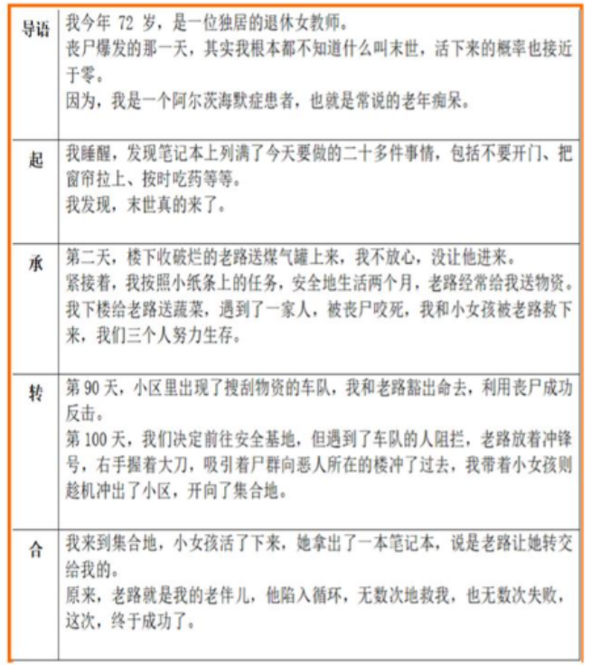

- 人物设计

```
人物设计
人设
人物三要素:
外表、心理、社会
我:胡舒予
外表:72岁，满头白发
心理:患有老年痴呆，但有强烈的求生意识社会:退休的女教师
老路:路淮州
人物设计要素
```

### 人物设计要素

#### 选题大纲

```
1.故事标题
2.故事类型
3.关键词/话题
4.人设
5.一句话概括
6.关键素材
```

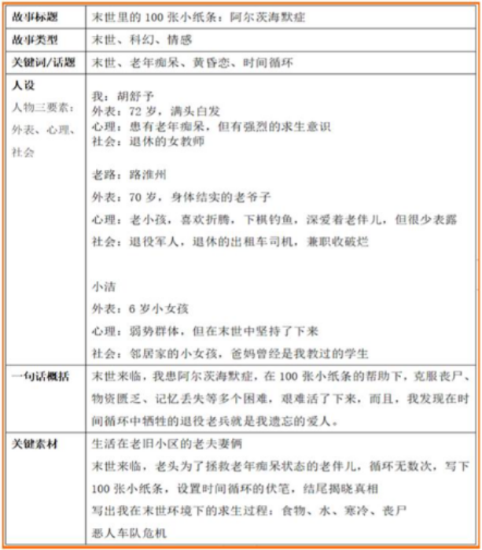

#### 人物设计

1.外表

2心理

3.社会

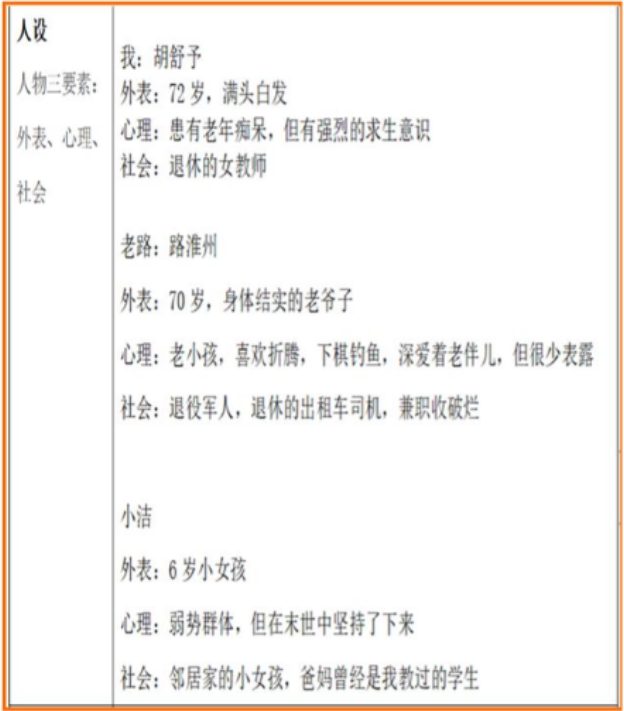

#### 故事架构

```
导语 起 承 转 合
```

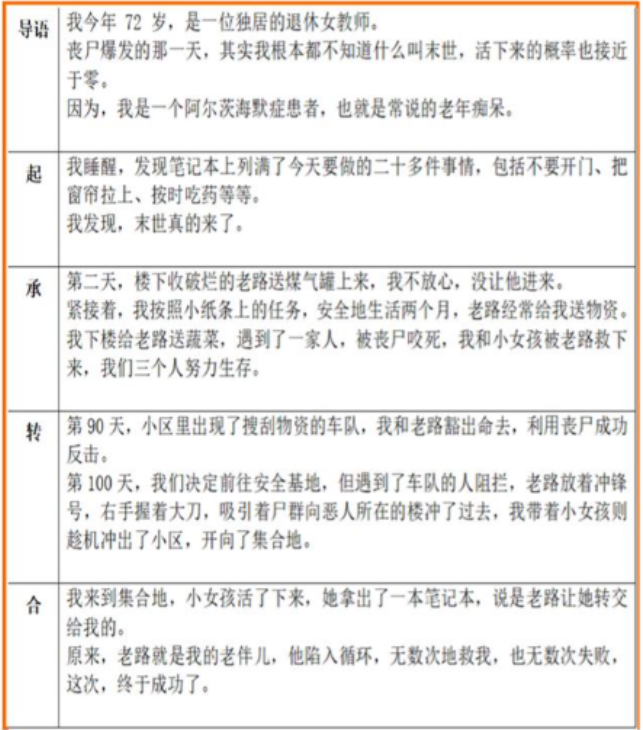

### 简短的步骤

写短篇小说是一种精简而有趣的文学形式，通常集中表达一个故事情节或情感主题。以下是一个简单的步骤指南，帮助你开始写短篇小说：

- 1.选择主题：首先，选择一个引人入胜的主题或故事情节。这可能是一个令人感动的经历、一个有趣的概念、一个突发奇想，或者一种情感体验。
- 2.塑造角色：创造有趣和立体的角色。你可以有一个主角和一些配角，但记得在短篇中保持角色数量适中，以便更好地发展他们。
- 3.设定背景：为故事设定一个背景和环境。这将有助于读者更好地融入故事情境，感受角色的情感和动机。
- 4.引入冲突：引入一个主要冲突，这是推动故事发展的核心。冲突可以是内部的（例如，角色内心的挣扎）或外部的（例如，与其他角色或环境之间的冲突）。
- 5.发展情节：按照故事的逻辑和节奏，逐步发展情节。在短篇中，情节发展应该紧凑而有力，不要有过多无关紧要的情节。
- 6.高潮和转折：在故事的高潮点引入戏剧性的转折。这可能是一个意想不到的事件，一个重大的决定，或者角色的内心转变。这样能为你的短篇增添吸引力。
- 7.突出主题：确保故事表达了你想要传达的主题或情感。短篇小说通常在结尾处或高潮点传递强烈的情感体验或启示。
- 8.结尾：给你的故事一个有力的结尾。可以是一个意味深长的对白，一种情感上的转变，或者留下一些悬念，让读者思考。
- 9.编辑和润色：完成初稿后，回顾并编辑你的作品。检查拼写、语法和句子结构，确保故事流畅且易于阅读。
- 10.分享和接受反馈：完成最终版本后，与朋友、家人或其他作者分享你的短篇小说，并接受他们的反馈。反馈有助于你改进和提高你的写作技巧。

最重要的是，写短篇小说需要**不断的练习和耐心。**不要担心一开始不够完美，写作是一个逐步成长的过程。享受写作的过程，保持灵感的积累，并继续提升自己的技巧。祝你写作愉快！


### 七步故事法

Seven-Point Story Structure —— Dan Wells

- 引子：介绍主角和故事起点，吸引读者注意力，对故事产生兴趣
- 转折1：引发故事主要冲突，将主角推向一个全新方向，改变他们的目标和情境

- 危机1：主角遇到一些挑战和障碍，强化故事的冲突和紧张感
- 中点：故事的中间阶段，通常是一个重要的转折点，然鬼故事进一步发展，主角获得信的理解或信息。
- 危机2：主角再次遇到挑战或逆境，增加紧张感，并推动故事向前发展。
- 转折2：一个关键性的转折点，改变主角的情况，目标或心态，将故事推向高潮
- 结局:故事的高潮和结局，解决会从图，展示主角的成长和变化，为故事画上圆满的句号。

强调故事的七个关键转折点。

举个实际例子：

> 1.目标 2.阻碍 3.努力 4.结果 5.意外 6.转弯 7.结局

```
# 1.目标
《三国演义》目标:
主角刘备想成就霸业，匡扶汉室
《水浒传》目标:
主角宋江想接受招安，发展仕途
《西游记》目标:
主角唐僧想去往西天，求取真经

2.阻碍 
《三国演义》阻碍
前期董卓吕布、后期曹操孙权
《水浒传》阻碍
外有奸臣阻拦，内有兄弟反目
《西游记》阻碍
九九八十一难。

3.努力
《三国演义》努力:
请卧龙，联孙权，抢地盘
《水浒传》努力:
收官军，打县城，走后门。
《西游记》努力:
收徒弟，打妖怪，搬救兵。

4.结果 5.意外 6.转弯 7.结局
《三国演义》结果:
三分天下，鼎足中原
《水浒传》结果：
接受招安，变匪为官。
《西游记》结果:
到达西天，拜见佛祖。

5.意外
《三国演义》意外:
失荆州，败夷陵
《水浒传》意外:
攻辽国，平田虎王庆，征方腊。
《西游记》意外:
无字真经。

6.转弯
《三国演义》转弯
六出祁山，九伐中原.
《水浒传》转弯梁山好汉，死伤无数。
《西游记》转弯:
掉河里，晒经书

7. 结局
《三国演义》结局
诸葛星陨，刘禅投降
《水浒传》结局:
梁山好汉，死伤无数。
西游记》结局
返回大唐，传经布道
```


### 英雄之旅

Hero's Journey —— Joseph Campbell，《千面英雄》The Hero with a Thousand Faces

它描述了主角从普通生活中接受召唤、穿越一系列考验和冒险，最终达到成长和成功的过程。

英雄之旅的故事结构通常包含以下几个主要阶段：

1. 世界的平凡：故事从一个普通世界开始，主角生活在日常生活中，还没有意识到他/她内在的英雄潜质。
2. 召唤：主角收到一个召唤或挑战，可能来自导师、神秘人物或特殊事件，邀请他们离开常规世界，踏上冒险之旅。
3. 拒绝召唤：主角往往因恐惧、责任或其他原因而拒绝召唤。他们可能对改变现状感到不安，但最终仍然接受了使命。
4. 导师和助手：主角通常会遇到导师或助手，提供指导、智慧和帮助，以便在冒险中取得成功。
5. 穿越阈限：主角最终决定踏出舒适区，进入未知的领域。这个阶段象征着主角从一个状态转变到另一个状态的重要时刻。
6. 考验和劫难：主角在冒险过程中面临各种考验和劫难，有时是对内心的挑战，有时是与反派的搏斗。
7. 领悟：在经历了一系列的考验后，主角开始领悟到自己内在的潜力和使命，更加了解自己。
8. 赢得奖赏：主角战胜困难后，获得宝贵的奖赏，这可能是物质财富、知识、智慧或内心的成长。
9. 回归：主角开始回归原来的世界，带着他们的收获和新的力量，可能改变了自己和周围的环境。
10. 奋斗和重生：主角必须再次经历一次死亡和重生的过程，从而完全转变并实现自我救赎。
11. 带来变革：主角回到日常生活，并利用他们的经验和成长，带来积极的变革，改善社区或世界。

英雄之旅的故事结构不仅在古代神话中出现，也广泛应用于当代文学、电影和其他艺术形式。它是一种激动人心且感人肺腑的故事模式，因为它与我们作为读者或观众的内心和愿望产生了共鸣。

### 三幕剧结构

Three-Act Structure

这是一种广泛应用于戏剧、电影和小说的故事结构方法。故事被分为三个主要部分：引入冲突和发展情节、达到高潮和紧张阶段、最后解决冲突并进行结局。

以下是三幕剧结构的主要部分：

第一幕（Act 1）：引入冲突和发展情节

- 引子（Exposition）：介绍主角、故事背景和常规世界。读者或观众了解主角的目标、愿望和动机。
- 触发事件（Inciting Incident）：主角面临一个挑战、问题或机遇，触发故事的主要冲突。
- 升高（Rising Action）：主角开始应对挑战，展开行动，并与故事的其他角色和情节线交织在一起。
- 高潮点1（First Plot Point）：在第一幕的结束，主角面临一个重要的决定或事件，改变了故事的方向，进入新的境地。

第二幕（Act 2）：达到高潮和紧张阶段

- 发展（Development）：主角在新的环境中经历一系列的考验、冲突和挑战，逐渐接近他们的目标。
- 危机点1（First Pinch Point）：在第二幕的中间，主角再次遇到挑战，强化故事的冲突和紧张感。
- 转折点（Midpoint）：故事的中间阶段，通常是一个重要的转折点，主角获得新的理解或信息，改变了故事的发展。
- 危机点2（Second Pinch Point）：在第二幕的后半部分，主角再次面临考验和逆境，加剧了故事的紧张氛围。
- 高潮点2（Second Plot Point）：在第二幕的结束，主角面临一个关键性的转折点，改变了他们的情况和目标，为故事进入最后阶段铺垫。

第三幕（Act 3）：解决冲突和进行结局

- 收束（Climax）：故事的高潮，主角与主要反派或冲突达到最终对决，决定故事的走向。
- 转折点（Climactic Turning Point）：在高潮之后，主角经历最后的转折，解决内心的问题，实现成长和变化。
- 结局（Denouement）：解决剩余的情节线，展示主角和其他角色的未来，为故事画上圆满的句号。

三幕剧结构是一种古老而有效的故事构建方法，被广泛用于各种类型的故事。它帮助作家规划和组织情节，确保故事具有合理的节奏和戏剧性。然而，值得注意的是，这并不是唯一的故事结构方法，作家们可以根据自己的需求和喜好选择适合自己的构建方法。

### 雪球式写作法

Snowflake Method —— Randy Ingermanson

通过逐步扩展故事概念，从一个简单的核心构想逐渐发展成复杂的故事结构。

1. 第一步：简单描述故事的核心构想。这可以是一个简短的故事概要，通常只有一两句话，概括整个故事的主题和基本情节。
2. 第二步：扩展核心构想。在这一步中，你将以一两个段落的篇幅，进一步展开故事概要，包括主要角色、主要情节线和故事的基本框架。
3. 第三步：深入主要角色。针对每个主要角色，写一个简短的角色简介，包括他们的目标、动机、性格特点等。
4. 第四步：绘制故事地图。在一张纸上画出故事的主要情节线，包括每个主要事件的发生顺序。
5. 第五步：细化角色和情节。对每个主要角色和情节线进行更详细的描述和扩展，逐步添加细节和背景信息。
6. 第六步：构建场景列表。列出故事中的所有场景，简要描述每个场景的内容和目的。
7. 第七步：写第一稿。在前面的步骤中，你已经对故事进行了详细的规划和构思，现在可以开始写第一稿了。
8. 第八步：反复修改和润色。写完第一稿后，反复修改和润色你的作品，直到达到你满意的程度。

雪球式写作法的主要思想是从简单到复杂，通过逐步扩展故事概念，使创作过程更有条理和系统性。这个方法有助于作家在写作前充分思考和规划故事的结构和要素，避免在写作过程中迷失方向。同时，这个方法也适用于任何类型的作家，无论是规划长篇小说还是写作短篇故事，都可以从雪球式写作法中受益。

### 故事板

Storyboard

这是一种用于可视化故事情节的方法，通常用于影视制作和漫画创作。故事板将故事分解为一系列画面，帮助作者规划和组织故事情节。

故事板通常包含以下要素：

1. 图像框（Panel）：每个图像框是故事板的一个单元，类似于一幅画。它们通常以方形或矩形排列，并根据故事需要按顺序排列。
2. 插图（Illustration）：每个图像框中有一个或多个插图，用来呈现具体的场景或情节。插图通常由艺术家根据剧本或故事情节绘制而成。
3. 文字说明（Caption）：在图像框旁边或下方，通常还有文字说明，用来解释或补充图像中无法表达的内容，比如对话、场景描述、动作等。

通过故事板，创作者可以在视觉上更好地理解故事情节的展开，包括场景切换、角色动作和摄影构图等。它可以帮助团队成员更好地协作，共同理解导演或创作者的意图，从而更高效地进行拍摄或制作工作。

在电影制作中，故事板经常被用来规划电影镜头、动作和特效，也可以作为预演和预览的工具。在动画和漫画领域，故事板则被用来规划画面序列和动作动态。

总体而言，故事板是一个非常强大的创作工具，它能够帮助创作者更好地组织和展现故事情节，让读者或观众更容易理解和沉浸在故事世界中。

### 自由写作

Freewriting

这是一种无限制地写作的方法，不受时间限制和文体要求，帮助作者释放创造力和想象力。

自由写作的步骤如下：

1. 设置计时器：找一个安静的地方，设定一个时间，通常为5分钟或更长，以便你在这段时间内专注于写作，不受任何干扰。
2. 写下任何想法：不论是什么想法，不要刻意去思考或编辑，只是将大脑中的想法不加选择地写下来。如果你不知道要写什么，可以开始描述你周围的环境、写下你的感受或者用一些简单的词句来形容你此刻的状态。
3. 不停止：不论你写出什么，不要停下来检查拼写、语法或句子结构，也不要纠结于写得是否好或是否有意义。让你的笔/键盘持续流动，保持写作状态。
4. 鼓励自由联想：如果你觉得你没有东西可写了，试着让思维自由联想，不断写下脑中闪现的任何词汇或想法。这有助于你重新找到写作的感觉。
5. 不加限制：在自由写作中，没有对错之分。你可以写下任何东西，无论它是多么荒诞或无意义。

自由写作的目的是让你的大脑解放，让创意无拘无束地流动。它可以帮助你跨越创作的阻碍，消除内心对写作的抵触感，以及打破完美主义的束缚。虽然自由写作的内容可能看起来有些混乱或杂乱无章，但它可以激发你内心深处的创意，为更有组织的写作奠定基础。

自由写作是一种非常有用的写作技巧，许多作家和创作者都用它来打开思路，找到灵感，并温习写作的基本技巧。它是一个非常私人和放松的过程，你可以根据自己的喜好和需要进行调整和使用。

### 角色驱动写作法

Character-Driven Writing

以角色为重点，通过深入探索角色的动机、情感和发展，来构建故事情节和冲突。

角色驱动写作法的主要特点包括：

1. 以角色为中心：在角色驱动写作法中，故事的起源和发展是由角色的个性、背景和心理驱动的。角色的动机、欲望和冲突推动着故事的发展，而非仅仅依赖于情节的推动。
2. 人物塑造至关重要：为了写出一个深刻的角色驱动故事，创作者需要花费时间和精力来塑造主角和配角。角色需要有独特的特质、目标、弱点和成长空间，让读者能够与他们产生情感共鸣。
3. 内心冲突：在角色驱动写作中，角色的内心冲突和发展往往比外部冲突更为重要。读者更容易与那些面临人性困境和情感挣扎的角色产生共鸣。
4. 角色驱动情节：情节在角色驱动写作中是由角色的决定和行动推动的，而非仅仅是由外部事件推动。角色的选择和行为塑造了故事的进程和结局。
5. 成长和变化：角色驱动的故事通常强调主角的成长和变化。故事情节是为了展现角色的成长历程和内心转变。

角色驱动写作法对于那些喜欢深入探索角色心理和人性的作家和读者来说，是一个非常有吸引力的方法。它可以创造出丰富、有血有肉、令人难忘的角色，使故事更加真实和引人入胜。角色驱动的故事往往强调情感和人物之间的关系，打动读者的心灵，并让他们对角色的命运产生深刻的共鸣。

### 情节驱动写作法

Plot-Driven Writing

以情节为重点，通过设定和发展复杂的情节和冲突，来推动故事的发展。

情节驱动写作法的主要特点包括：

1. 以情节为中心：在情节驱动写作法中，故事的主要焦点是情节的展开和发展。情节中的事件、转折和冲突推动着故事的发展，角色的行为往往是为了推动情节的进程。
2. 丰富多彩的情节：情节驱动写作法强调通过刺激和紧张的情节来吸引读者，让他们保持阅读兴趣。故事通常涉及到各种挑战、冒险和意想不到的转折。
3. 角色为情节服务：在情节驱动的故事中，角色的目标和行为通常是为了服务于情节的需要。角色的动机往往是为了推动故事的发展而设置的。
4. 快节奏：情节驱动的故事往往具有快节奏和高度紧张的情节线，以保持读者的兴趣和吸引力。
5. 意外和转折：情节驱动的故事通常包含许多意外和戏剧性的转折，让读者始终保持好奇心和紧张感。

情节驱动写作法对于那些喜欢紧凑、高度戏剧性和快节奏故事的作家和读者来说，是一个非常吸引人的方法。它强调故事情节的重要性，注重情节的逻辑性和连贯性，以及通过紧凑的情节线吸引读者的注意力。情节驱动的故事往往非常有趣和引人入胜，让读者愿意一直阅读下去，追求故事的发展和结局。

### 线性写作法

按照故事发生的时间顺序，逐步叙述事件和发展情节。

线性写作法的主要特点包括：

1. 时间顺序：故事按照时间顺序展开，事件和情节按照发生的顺序进行叙述。读者可以清楚地跟随故事的发展，了解故事中发生的先后顺序。
2. 逻辑连贯：线性写作法注重故事情节的逻辑连贯性，使故事的发展自然流畅，不会出现突兀或不合理的情节转折。
3. 着重情节推进：线性写作法强调情节的推进和发展，让故事情节具有紧凑和戏剧性。每个事件或情节都直接或间接地推动着故事向前发展。
4. 故事起伏：故事线性发展时，往往伴随着情节的起伏和高潮。情节的高潮通常出现在故事的顶点，然后逐渐走向结局。
5. 传统叙述方式：线性写作法是传统的叙述方式，在文学作品、小说、电影、电视剧等领域都有广泛应用。

线性写作法非常直接和易于理解，适用于各种类型的故事，特别适合用于较为传统的叙述风格。它对于一些需要按照时间顺序展开故事情节的作品非常合适，如历史小说、传记、日记体小说等。然而，也要注意，线性写作法并非适用于所有情况，有时候作家可能需要尝试其他的非线性叙事方式来增加故事的复杂性和吸引力。

### 非线性写作法

通过回忆、闪回、跳跃等手法，以非线性的方式展示故事情节。

非线性写作法的主要特点包括：

1. 非线性结构：故事情节不按照时间线索顺序展开，而是以跳跃式或回溯式的方式呈现。这意味着故事事件可能以非传统的方式排列，有时甚至是逆序呈现。
2. 异时空跳跃：非线性写作法可能涉及到不同时间点和空间的跳跃。故事情节可能在过去、现在和未来之间切换，让读者在不同的时间框架中理解故事。
3. 混合叙述方式：非线性写作法常常混合多种叙述方式，如回忆、闪回、抒情、日记、多角度叙述等，以增强故事的复杂性和吸引力。
4. 暗示和揭示：通过非线性叙事，作家可以巧妙地给读者暗示故事的发展，逐步揭示角色的秘密和情节的真相。
5. 读者参与感：非线性写作常让读者需要主动拼接故事碎片，参与到故事的解读和理解中，增强了读者的参与感和互动性。

非线性写作法适用于那些喜欢复杂和富有挑战性的故事结构的作家和读者。它可以创造出令人意想不到和深度感人的故事，同时增强读者对故事的好奇心和探索欲。这种写作方法常见于现代文学、电影和电视剧中，也用于探索人物内心世界和复杂的情感关系。然而，非线性写作法需要慎重使用，因为过度复杂的情节结构可能会导致读者困惑和难以理解。在运用非线性写作法时，作家需要确保故事仍然具有内在的逻辑和连贯性，使得故事的复杂性不会成为读者的障碍。


## 推荐书籍

- [ ] 《小说写作：叙事技巧指南》(创意写作书系)【美】伊丽莎白·斯：适合新手的讲解人物、情节、视角、背景的书，从创作冲动到最终定稿的全程指导

- 《风格的要素》斯特伦克（Strunk）和怀特（White）：怀特说它并不适合新手作家

- 《小说面面观》E.M.福斯特（E.M.Forster）：对于初学者太过抽象和深奥

- 《戏剧人生》埃里克·本特利（Eric Bentley）：情节营造方面的

心理学（学会共情）之类的书籍

## 小说专题分享

### 如何成为资深斜杠

《从破卷到破圈：如何成为资深斜杠？》Jimmy钱自严


改变三部曲

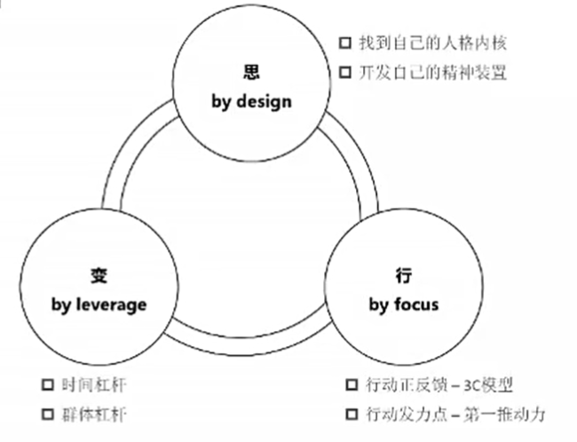

**从人格内核出发的自我设计**

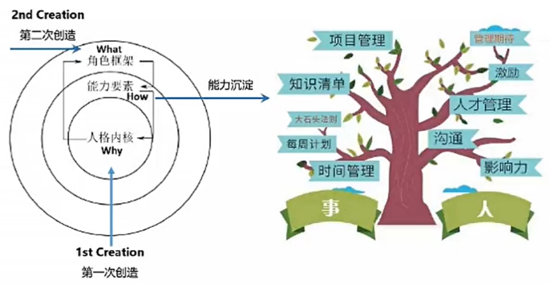

**人生最值得重仓投资的两个精神装置**

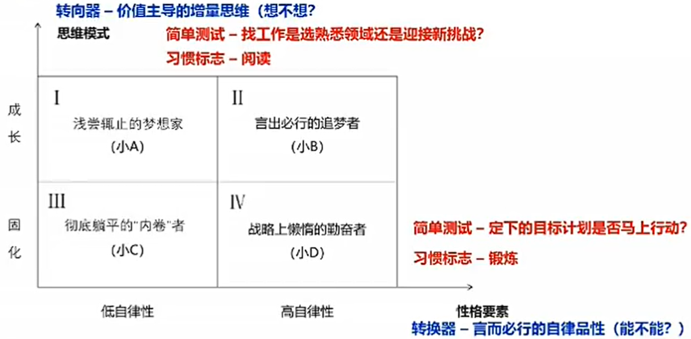

**成长型人格特征-不断升级自身短板**

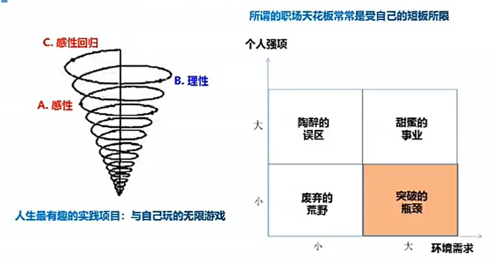

**行动正反馈-3c模型**

> 任务没有进入增强回路的动作都是盲动——梁宁

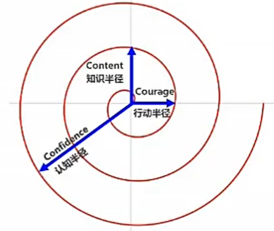

要有勇气向自己的短板叫板

**行动发力点——找到自己的第一推动力**

把事坐在体系里

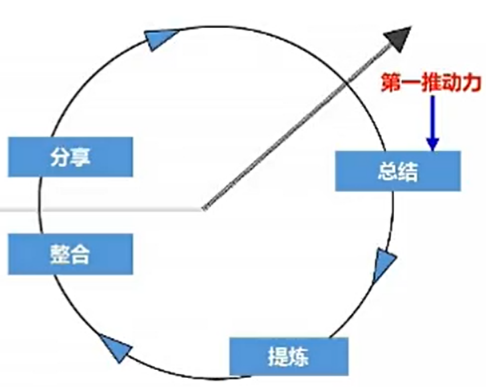

收获成功-用好自己的事件杠杆

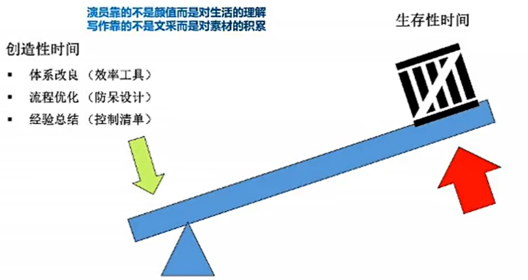

素材积累实操秘笈——书写知识清单

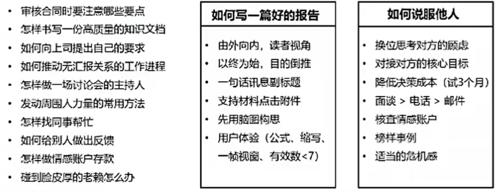

### 如何快速学习一门技能

超越你的同龄人

> 柴桑

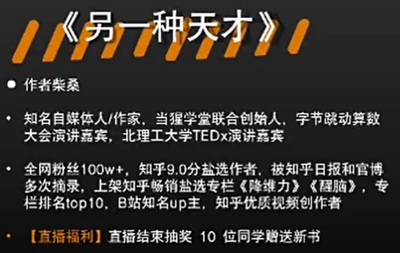

**用演化箱思维适应流体的世界**

只有认知的痛觉才能触达人的灵魂。

世界一直在变，很多人觉得大环境是稳定的，但是这个年代，很难预测，实际上是不稳定的。

比如ChatGPT出现前一天没有人关注，出现后直接出圈。

拥有演化思维：

1.情景理解（看清自己所处的环境）

 2.反脆弱生产（发展兴趣爱好）：planA 本职工作（程序员），planB 副业（写作）， planC 有潜力的兴趣爱好（ChatGPT）

掌握技能的流程图

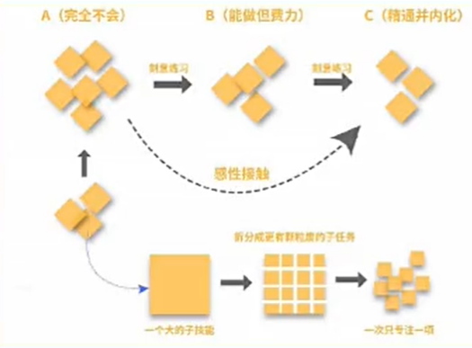

心流阅读法：——完全投入的阅读

非功利学习：——是为什么的心态

### 如何用ChatGPT加持写作

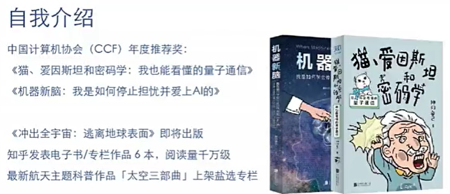

构思与判断：发挥【人脑】优势

提出好问题，追寻关键线索

### 爆款开篇导语仿写训练

第一，知乎站内的内容基本都是通过问答模式来传播的。都是问题和一个回答的前两行文字。

盐选专栏的故事，也是放在某个问题下的回答。不同的是，这些签约盐选专栏的故事，是付费才能看完。

一篇故事是否能有很多人看，第一和它回答的问题热度有关。一个热榜排名第一的问题和一个只有 10 个人关注的问题，当然榜一的问题有更多人看啦！

第二，和故事开头的两行【导语】内容强相关。知乎用户在浏览问题的时候，最多看到开头两行，判断要不要点进去看看的时间，不超过 3 秒钟。而由于每个故事并不能恰好回答这个问题，所以需加一段【导语】过渡下，让人感觉这篇文章就是为这个回答而生，越贴合，写得越有冲突和悬念越好。如果开头两行不能吸引用户，即便给到再多的流量扶持，你的故事也不会有太多人看。

来看三个非常不错的开篇，了解下什么样的开篇是我们可以借鉴模仿的。

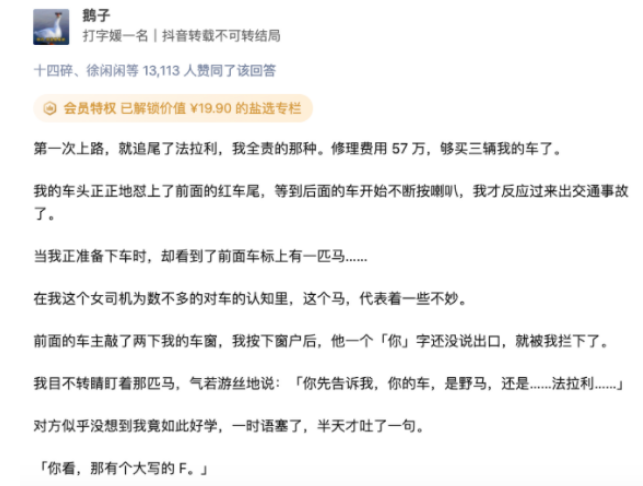

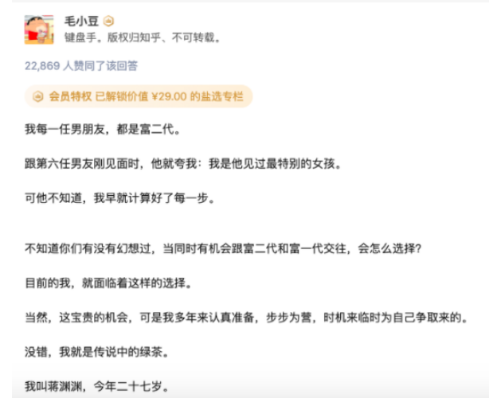

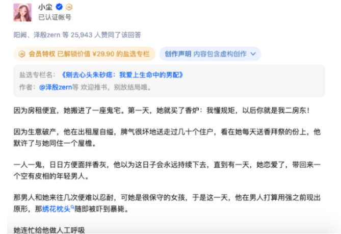

1.主角设定有趣：
女主分别是沙雕呆萌、心机绿茶、贫民窟女汉子
男主分别是法拉利霸总、未知富二代、苦命冤死鬼

2.场景设计有冲突感：
第一次开车上路就追尾法拉利，后续怎么办？
优秀履历的心机女孩，为了钓金龟婿挑普通单位
出租屋里的男冤魂 vs 天不怕地不怕的女穷鬼

**总结一下优点：**
1.人物特色强烈，有共鸣代入的部分
2.冲突/反常/奇异设定：

比如：

辞职边缘的女主突然回心转意了
长期吵架的合作方突然温顺了
坐过地铁站的女主意外邂逅……

**开篇仿写练习：**
在公司团建的农家乐里，我遇到了5年前冷暴力我的前男友
他正对我经理点头哈腰，求项目合作
而表面一本正经的经理，却在发微信问我：晚上一起喝酒？

到你啦！快开发你的脑洞，写出50—100字的故事开篇吧！

```
我死了
我看到了那双手
他写下了所有人的结局

1
有时候我会不由自主的往某个地方走去，
我喝着水，我搬着东西，我忙忙碌碌的挥洒着汗水，
我嘴角扬起的微笑，在阳光下特别的阳光
可我没有想笑，我也不想喝水。。。。。。
我 是谁？
```


## 故事创作技巧

### 如何让你的角色深入人心

一个好的人物会给故事加分，是故事的灵魂

#### 创作主人公——主角

- 找到原型

```
从身边、新闻、故事积累，观察有助于塑造成功的人物，观察他们共同的性格特征、习惯、情趣、身姿、动作、语言、信仰等。
```

**记录下看书、看剧甚至是社会新闻中让你触动的剧情（点、梗）（今日刷屏的事件：疫情流调观察，大的社会案件等）**

**好的作者都会随身携带本子或手机，随时记录生活细节的习惯。**

- 拆解分析-建构你的人物

人物三要素

```
外在因素：最直接最显眼的特点，一般指外貌、穿着、动作等外在特点
社会因素：角色的社会身份、社会地位、早期教育和经历、职业、个人关系状况等
心理因素：人物的性格、价值观、他是否有不能与外人说的秘密、心魔等
```

**大家在准备故事、思考人设时，首先需要弄清楚，故事面向的读者是哪类人群，不同群体和主题的故事里，需要有符合故事的人物出现，再从这个角度去思考人物三维，才会显得更合理。**

人物个性要层次分明：没有绝对的好人/坏人才能显得立体

当下流行的标志性动作：比如玩什么游戏/梗

创造一个有趣的人：反差、对比 （表象和内心真相）

- 真实感

能够让读者共情，人物要真实，要符合角色的人设

#### 人物关系——配角

配角的作用：推动故事情节发展；塑造主角形象

如果说主人公的确立是为作品指明大致方向，那配角的设置则是让框架立起来。

配角注意事项：最好不要超过3个，不然可能会让主角的戏份下降


比如《你好，李焕英》中的「李焕英」，故事精彩，但在过年的影院里让我决定连看两场同时哭湿了一包纸巾的离不开「李焕英」这个角色

一个好的人物也会让故事在人们心中的留存度更久，比如有的时候看到老人我就会想到那个身边跟着一头老黄牛的「福贵」，因为这个人，初中读的故事，现在还记得清楚

抒情的时刻结束，回到现实。我们怎样才能让我们故事中的角色也深入人心，甚至让读者忘不掉呢？我相信今天的课程会有大家寻找的答案！🏁

### 如何设置悬念和冲突

一篇盐选好故事，离不开「五巨头」：选题、人物、情节、结构、开篇。而如何让情节更吸引人？你必须学会设置悬念和冲突。咱们先说说「悬念」这件事

#### 1.悬念

悬念可不仅存在于悬疑故事中，任何故事类型都可以制造出悬念。

悬念是一种手段，比任何其他元素都更能影响一位读者在看你故事时的体验感。因为人类天生就有好奇心，相信大家也听说过《世界十大未解之谜》《UFO未解之谜》之类的书名吧，这些书有一阵子卖得可好了！

那么，如何在你自己的故事中制造悬念呢？

**方法一：给人物确定一个目标**

一旦角色有了目标，读者就会想知道他们能否实现目标。于是悬念自然而然就产生了。

目标可以是什么呢？我们拿情感故事来举例。女主的目标是追到男主，但是这个目标太浅显了，需要再让目标更具象化、更有门槛。

```
比如说，考研 300 分的女主，想要追到考研上了清华的男主。

男女主之间是有差距的，女主需要跨过一道槛。这就让目标的难度升级，让悬念变得更持久。女主怎么才能和男主产生更多交集、怎么才能让男主对自己产生感情呢？她可能准备明年二战清华，也可能直奔北京租房找男主，当然还可能去北大。
```

**方法二：制造危险**

```
主人公将会遇到危险，就是一种非常好用的制造悬念的技巧。

而当危险将要发生却还没有发生的时候，就是读者最心惊肉跳的时候。

所以我们在设计悬念的时候，就不要把炸弹放到离主人公一万米以外的地方了。一定让危险离主人公无限靠近。越靠近，就会越让人觉得可怕，也越能让读者对接下来的故事产生期待。
```

推荐阅读：

- [ ] 《[致命公寓](https://www.zhihu.com/market/paid_column/1352666426491138048/section/1367530007988936704)》

```
女主一次醉酒后发现自己怀孕，而参加酒局的全部都是她的同事，在报警后却没有找到任何有人侵犯她的证据。女主却收到了恐吓邮件，声称是孩子父亲，威胁女主不许打胎，还掌握了女主从小到大的资料，唆使他人杀掉女主的两个邻居。

毫无疑问，危险就来自她身边。到底孩子的父亲是谁？女主会生下孩子么？如果不生下孩子，女主会被杀死么？一系列的悬念接连而出，吸引读者继续读下去。
```

**方法三：设置倒计时增加紧迫感**

即将爆炸的炸弹，即将沉没的轮船，即将打响的考试铃声……你将设置一条时间的红线，在那之前如果你完成了什么，结局将会走向一个方向，而如果你没有完成什么，它便向全然相反的方向走去。

因此时针每分每秒的走动，都将牵动读者的心脏，而越迫近终点线的时刻，紧张感越强烈。
故事往往就在接近红线的生死一线中获得新生，而这时读者将会获得前所未有的爽感。

用到这一方法的故事还是很常见的，比如《名侦探柯南》之《引爆摩天楼》，最后柯南和小兰必须要决定剪断炸弹的一根线，剪错炸弹就会爆炸，而不剪的话，炸弹也会爆炸。

**其他方法：比如说未知因素**

读者和主人公都不知道将会面对什么；
比如无能为力，你的主人公明明知道事态要发生，但是他此时此刻却做不了什么，他将如何破局；
这些方式都可以帮助你设置悬念，无论你采取哪种方式，放置并延长悬念预期，你的故事总会抓住读者的心脏。

#### 2.冲突

很多人以为，洒狗血的剧情才能产生冲突，其实不然，我们生活中的每一次选择都会造成冲突。
你选择坐地铁还是坐公交，就会遇到不同的人，不同的事。

你选择化妆或者素颜，可能会因为素颜遇到心仪男子，而化妆了什么也没有遇到。

那么有什么制造冲突的方法呢？

**方法一：塑造自带反差的一组人物（人设）**

如果你塑造的人物自带反差，要产生冲突，你需要做的事情就是让他们相遇。比如帅气和尚和公主，洁癖精和邋遢鬼，白莲花和腹黑男等等。反差可能来自他们拥有财富的多少、性格、消费观念……

人物选好后，我们就可以想办法让他们相遇。比如帅气和尚进宫为皇后讲经遇到公主，洁癖精偏偏和邋遢鬼合租在同一个房子，白莲花假装发善心的时候被腹黑男「不小心」看到……

他们会产生怎样的冲突？我就不多说了，笔给你，接着编！

**方法二：强迫角色共处（场景）**

这有点像密室逃脱的感觉，就是强迫两个或多个人在一起待一段时间。比如最近一个综艺《单身即地狱》，6 男 6 女在孤岛上寻找对象，看对眼的两个人才能去豪华酒店共度一晚。6 个性格迥异的人，N 角的情感关系等等，这些都是可能产生的冲突。

每个人在这个孤岛上，都有选择的权利，也有被选择的方式，他们可能表面看起来一样，实际却是另一个面貌，只为了给心意对象留下好印象。

当然，强迫角色共处不一定要设置孤岛环境，看过金庸小说《天龙八部》的同学应该还记得，段誉和王语嫣确定关系，就是在一座枯井中。

**方法三：权力争夺（动机）**

对权力的争夺，属于人性的本质。对权力的推翻，是人们最期待的事。

但是推翻权力不应该无缘无故，而是要有一个由头，最常见的就是，拥有权力的人滥用权力。
这种滥用让读者产生愤怒，期待新的力量出现，推翻滥用权力的人。

比如《琅琊榜》中有着赤子之心的靖王，一步步打败了不顾百姓生命弄权的太子和誉王，继位登基。是不是看着很爽？这就是对权力的反杀。

### 如何写出把握人心的黄金结构

短篇比较短，万字左右，所以不宜设置太复杂的人物和线索。

因此要结构简单清晰，一条主线到底，多运用第一人称视角，着重刻画好两三个人物，就能讲好一个短篇故事。切记，线索不宜过多，**多用单线性叙事。**

> 我觉得可以暗插一些支线，将自己的所有文章串起来。布一个大局。

单线性叙事：聚焦，主需要在主线上反转推进故事。

也就是架构：**布局（起）、反应（承）、进攻（转）、解决（合）**

起：悬念、介绍主人公、危机、伏笔、开启故事

承：跟随剧情顺流而下，比如危机加重

转：主人公到了必须采取行动的地步，他的行动可能推向更大的危机

合：主人公化解危机，以胜利者的姿态凯旋。

联系：

⼀**句话故事** +**起承转合**⼤**纲（**1000**字左右）**

### 如何写出把握人心的黄金结构

快餐时代，开篇决定成败

反例：

- 废话太多、进入过慢（信息堆砌：风景描写、心情感慨；大段叙述：繁杂背景介绍）
- 该写的没写（抛出人物的欲望和人物）

正例：

- 写好一句话开篇（给观众一个看你的理由）

**展现比叙述要花更多篇幅和时间**

快速推进故事发展

- 设计情节
- 展现冲突

增强代入感

- 调动感官
- 关键细节：和故事主线有关的事，没有就没有办法理解故事

**冲突的信息量是最大的**

- **主人公是谁？**

- **他有什么典型特征？**
- **他的欲望是什么？**
- **又陷入了什么困境？**

**人物欲望 → 故事的主题是什么**

按照上面的解析：**生身母亲来袭**

```
主人公：我，一个两岁多的时候被亲生父母遗弃，在养父母的照顾下，长到25岁生活工作都还不错的女孩。
主人公陷入的困境：亲生母亲突如其来的，不怀好意的热情
主人公对立面是谁：突然到来的亲生父母和原生家庭。
主人公希望：摆脱原生家庭的控制，揭穿他们的真面孔。
```

简洁、耐看=>决定了小说的整体基调

强劲开头：

- 反常识
- 内涵深刻
- 引起情绪波动
- 有悬念


## 小说阅读方法

> 写小说之前要学会阅读小说，人非生而知之，任何事都是从观察和模仿开始的。

### 拆解爆款故事

#### 为什么要拆解爆款故事

> 通常情况下，热爱文艺的人都层自恃不同，然后他很快会发现，自己的与众不同往往就扎根在与所有人的相似之处

- 输入->输出：读爆款
- 了解市场方向：了解读者喜欢什么，避免孤芳自赏
- 学习故事写法：掌握规律，能被大多数读者认可的作品，是经过校验的

#### 如何识别爆款故事

- 会员页的盐选榜单：热门阅读
- 会员页的盐故事：垂直阅读
- 回答中的点赞收藏评论数高的故事：最直观的反馈（>1w点赞/收藏/评论）
- 一些官方账号：故事档案馆等等

#### 如何成为爆款故事

##### 大众关注的热点

```
# 年轻人关注的热点
大学室友关系话题
职场话题
异地恋话题
表白墙风云等
# 社会话题
有钱人的生活
高智商反差萌（智商高低）
房贷压力
女性成长话题等
```

##### 出人意料的设定

```
# 新奇的设定
夏洛特的烦恼：回忆青春爱恋（普通）+主角时空穿越(设定)=新奇
# 清晰流畅的主线
主线：唐僧带着4个徒弟经过九九八十一难，前往西天取经
# 拆解阶段性目标
怎么收徒？
八十一难经历了什么？
如何应对磨难
```

> 短篇篇幅短，一些适合长篇的话题（从平民到皇帝）是不适合在一万字的小说里阐述的。

##### 信息量爆炸的开篇

开篇决定多少人打开你的故事

##### 爆款要素

- 素材有话题
- 设定有特色
- 主线要清晰

#### 如何拆解爆款故事

##### 第一步：细读

心态：不盲目自信，不妄自菲薄

数字小节：（传达关键情节，更有逻辑，还有转场过度的效果）

特别关注：人物、情节点、感受以及高亮之处

```
# 模板
节
大意是什么
人物有哪些
情节有哪些（简练的情节概要）
你的感受（个人化的情绪体验）:也可以去看评论，看看别人的想法
高亮之处：（自己没有想到的思路）
```

##### 第二步：提炼

一句话概括：主角是谁、会遇到什么事、他将如何行动、结果如何

在梳理一句话的过程中你会知道：

```
主角的目标是什么？
他想完成目标的动机又是什么？
他的核心诉求又是什么？
阻碍主角行动的人是谁，做了什么？
主角是怎么对抗的？
主角有哪些成长？
故事里的人物关系是什么样的？
故事里有哪些悬念，这些悬念是怎么解开的？
故事里是否有伏笔，这些伏笔的作用是什么？
```

> 以创作者的姿态，沉下心去阅读，体验，感受

#### 拆解爆款故事示例 :star:

##### 【准备】

从以下故事中选择一篇：

- [ ] 情感故事：十四棋《[念念复年年](https://www.zhihu.com/market/paid_column/1549042090713190401/section/1549042467034533888)》
- [ ] 悬疑故事：点灯《[活在真空里](https://www.zhihu.com/market/paid_column/1486805707345735680/section/1505567867630669824)》
- [ ] 脑洞故事：施眠药《[误入海市蜃楼](https://www.zhihu.com/market/paid_column/1183089158909825024/section/1274402401450311680)》
- [ ] 科幻故事：张冉《[再见，老七](https://www.zhihu.com/market/paid_column/1405842162601275392/section/1405847317031788544)》
- [ ] 真实故事：眠眠《[〈开端〉原型案件：武汉「2.14」特大爆炸案](https://www.zhihu.com/market/paid_column/1476625478760538113/section/1482429801516851200)》

##### 【第一步】

细读故事，填写表格：

- 语言表达流畅，可以写完自己先读一读，理顺清楚
- 注意文字精简，千万不要长篇大论

| 节        | 大意是什么       | 人物有哪些     | 情节有哪些                                           | 你的感受 | 高亮之处 |
| --------- | ---------------- | -------------- | ---------------------------------------------------- | -------- | -------- |
| 0（导语） |                  | 我、张三、李四 | 我快死了，还是张三的好妻子，然后他惦记着白月光李四   |          |          |
| 1         | 张三对我漠不关心 | 我、张三、     | 拿到诊断书，纠结要不要告诉张三，然后他再忙自己的事情 | 委屈     |          |
| 2         |                  |                |                                                      |          |          |

【第一列】标注出故事分为多少个「小节」，先确定故事的整体框架，再进行阅读。

【第二列】写下这一「小节」的大意是什么，这一「小节」中主角遇到了什么，做了什么事，简单总结一些，不用写太多字。

【第三列】写下「人物有哪些」，谁出场了，谁是男主、女主、男配、女配，人物之间的关系是什么样，写下故事发生的场景。

想象你就是一个导演，人物有了，场景有了，你要让他们发生什么呢？

【第四列】写下「情节有哪些」，可以详细地写下人物之间做了哪些事情，不要写人物的情绪，人物的心理描写，一定是具体的事。比如说，你可以写，男主在雨天和女主表白了，你不可以写，女主被表白心里像有一百子兔子在跳。

【第五列】写下「你的感受」当你看到这些情节和人物的时候，有什么样的感受，感受可以是情绪上的，你看着开心生气，或者是有共鸣感动，也可以是疑惑不解，想知道为什么等等。是非常私人化的情绪体验，你都可以记录上。

【第六列】写下「高亮之处」，有哪些出乎意料的点让你哇塞，或者是眼前一亮，那么这就是整个故事最大的特色之处，你需要记录下来，或许可以成为你的故事素材。

##### 【第二步】

完成一句话概括，总结你刚刚拆解的这个故事，为你自己的创作做准备：

- 包括「**主角**是谁，遇到什么**事**，做了什么**行动**，**结果**如何」（**字数 100字以内**）

如果还是写不出来，可以问问自己：

- 主角的目标是什么？
- 他想完成目标的动机是什么？
- 他的核心诉求又是什么？
- 以及阻碍主角行动的人是谁，做了什么？
- 主角是怎么对抗的？
- 主角有哪些成长，一开始他是什么样的人，到故事的结尾他又变成了什么样，这前后有哪些变化，他为什么会这样。
- 故事里的人物关系是什么样的？
- 故事里有哪些悬念，这些悬念是怎么解开的？
- 故事里是否有伏笔，这些伏笔的作用是什么？

#### 拆解爆款故事实战

##### 拆解：《[念念复年年](https://www.zhihu.com/market/paid_column/1549042090713190401/section/1549042467034533888)》

| 节                | 大意是什么                         | 人物有哪些             | 情节有哪些                                                   | 你的感受                                         | 高亮之处                                                     |
| ----------------- | ---------------------------------- | ---------------------- | ------------------------------------------------------------ | ------------------------------------------------ | ------------------------------------------------------------ |
| 0（导语）         |                                    | 我、宋随、白月光       | 我得癌症快死了，宋随的白月光[*可望而不可及的人*]离婚回国，我扮演好宋随的妻子，并留下了一本日记。 | 期待日记内容                                     | 直接交代结局，而主角接下来的行动令读者好奇                   |
| 1                 | 我诊断得了癌症                     | 我、宋随、             | 我去医院诊断处癌症，打电话告诉宋随却没有说出来。             | 人和人的悲欢并不相通                             | 主角的纠结，犹豫，怅然描写的好                               |
| 2                 | 我知道宋随挂掉电话的原因           | 我、宋随、酥糖         | 我喜欢了十年宋随，刚要过上幸福生活，却得了癌症。宋随挂掉电话是去见酥糖 | 原来是个渣男                                     | 用很温和的言语叙述宋随需要一个妻子，而我刚才喜欢他。         |
| 3                 | 我深夜等宋随回家                   | 我、宋随、             | 我等宋随等到睡着，宋随回家我接过外套闻到了女人的花香味       | 要抱的多紧才能沾上花香味                         | 神态描写的很好，四目相对，愣了以下，眉头微蹙，看着他笑，面色平静 |
| 4                 | 我像往常一样给宋随做早餐           | 我、宋随、             | 宋随有胃病住院，我一直陪着照顾他，宋随今天起的比平时早       | 相敬如宾的爱情                                   | 通过以往的回忆，和今天的对比，留给读者想象的空间：为什么今天起得更早？ |
| 5                 | 我撞见宋随和酥糖交谈               | 我、宋随、酥糖         | 我给宋随送午餐，看到酥糖在吃我给宋随准备的早餐               | 委屈                                             | 面对上来一顿叭叭的女二，女主的心里吐槽很有趣。               |
| 6                 | 宋随给我买了首饰表示歉意           | 我、宋随、             | 宋随买首饰给我，我半夜睡不着。                               | 精神出轨也是出轨                                 | 语言是有力量的，我感受到了沉重的心情                         |
| 7                 | 宋随小时候保护我，让我爱上了他     | 我、宋随、酥糖         | 我小时候被霸凌，宋随保护我。我喜欢他并跟随他一起上了大学。宋随喜欢上我同父异母的姐姐酥糖 | 贵圈真小                                         | 这层关系没有想到                                             |
| 8                 | 我养了一条狗                       | 我、宋随、酥糖         | 宋随和酥糖一起回小区，路上被狗吓到，目睹了一切的我要养这条狗 | 哈哈，好玩                                       | 酥糖被狗吓到，而女主要养那条狗。这个冲突的场面刻画的很好玩。 |
| 9                 | 我跟宋随确认约定                   | 我、宋随、             | 我给小狗取名叫年年，睡觉时和宋随确认自己一直是他的妻子的约定。 | 你真是爱惨了这个男人                             | 有一次强调了男主不会出轨，但是也是在强调男主精神出轨         |
| 10                | 我不想成全宋随和酥糖               | 我、宋随、             | 我生日的时候初见酥糖，酥糖拥有父亲的宠爱，我不想成全她和宋随 | 你大可不必成全                                   | 先说想法，再通过交代背景时也解释原因                         |
| 11                | 我彷佛无事发生，将银行卡留给母亲   | 我、酥糖、母亲         | 我给酥糖的朋友圈点赞，我重新开始写日记，我去看望我的母亲并留下了银行卡 | 要报复了吗                                       |                                                              |
| 12                | 我病情加重，拒绝宋随的邀请         | 我、宋随、             | 我身体不适吐了血。宋随想带我去度假。宋随邀请我去晚宴被我拒绝。 | 女主有点腹黑，好喜欢                             | 神态的描写真的很细腻，值得学习                               |
| 13                | 我去晚宴确认了宋随出轨             | 我、宋随、             | 我瞒着宋随去了晚宴，看到宋随和酥糖亲密样子伤心离去           | 受不了一点                                       | 宋随很好找，我在他身后追了十几年；我知道他看见我了，因为他的脸色一下子就变了，很难看。这周写法很喜欢。 |
| 14                | 我伤心欲绝想要自杀                 | 我、                   | 我破坏家中的物件，我冲动的想自杀。                           | 原来前面只是猜测，如今才是证实，原来女主也不淡然 | 还不够。还不够。强烈的情感就在一瞬间喷涌而出。爱极了。       |
| 15                | 我给宋随台阶下                     | 我、宋随、             | 宋随想要解释，我主动给他台阶下。                             | 恶心                                             | 檀香味混着栀子花围绕，我硬生生克制住了想要吐的欲望。是花还是人，留给读者自己品味。 |
| 16                | 宋随让我系领带并且吻了我。         | 我、宋随、             | 宋随让我帮他系领带。宋随疯狂亲我。                           | 内心愧疚感作祟                                   | 我看着他，没有说话。我笑着道别。我喜欢这种描写。可我却说不出来为什么。 |
| 17                | 我和酥糖打了个赌                   | 我、酥糖               | 我约酥糖见面，并且打了她。最后和她定下赌约。                 | 突如其来的硬气，很爽快                           |                                                              |
| 18                | 我和宋随一起读故事                 | 我、宋随、             | 我和宋随一起读狗血故事，被影射到的宋随委屈                   | 这个男人心有愧疚 才会言语亲昵么                  | 狗血故事影射现实，男女主对称呼的改变也很有戏剧性。           |
| 19                | 宋随在结婚纪念日丢下我去找酥糖     | 我、宋随、酥糖         | 我和宋随一起过结婚纪念日。酥糖打电话让宋随过去。宋随丢下我去找酥糖。 | 突然的撕破脸有点不适应                           | 酥糖赌赢了，可我也没输。读的是什么？是悬念                   |
| 20                | 我要用日记惩罚宋随                 | 我、                   | 我写下了最后一次日记，我死了                                 | 辛苦了                                           | 食谱是个伏笔，会不会是下毒呢？读者这样想到。                 |
| 21                | 宋随结婚纪念日在医院陪着酥糖       | 宋随、酥糖             | 宋随送酥糖去医院，且没有回去。                               | 渣男                                             | 从这个节开始以男主的视角开始，这种手法很有趣。女主死了嘛，死之后的视角也只能男主来了。 |
| 22                | 宋随找不到岑念，一个月后得知她去世 | 宋随、岑念（我）       | 宋随回家找不到岑念，和岑念母亲打电话没有结果，一个月后，有人通知她岑念去世 | 这里不报警有点奇怪                               |                                                              |
| 23                | 宋随拿到了岑念的日记本             | 宋随、                 | 宋随去疗养院，岑念骨灰都已经扬了。冷漠护工交给宋随3本笔记本。 | 你到底爱不爱，不爱又那么难受，贱不贱             | 细节就是一张网，划破宋随的心脏。好凌厉的描写。               |
| 24-31             | 宋随读日记                         | 宋随、                 | 岑念就不怪酥糖，好似字里行间也没怪宋随。就是用平淡的预期在讲述生病的日常和住院的生活 | 我用最真诚的文字让你愧疚到死                     | 解密来了，隐去双方视角和心理活动的日记，暗藏女主的心思，让读者爽的不行 |
| 32 （后记）       | 赵棉                               | 赵棉（我的护工）、     | 赵棉不喜欢宋随，想不通岑念的心思。宋随想要和赵棉聊岑念被拒绝。 |                                                  | 用赵棉的视角感受以下男主的行为。镜头语言很足。               |
| 33                | 宋随要回了年年                     | 宋随、                 | 宋随天天去五大三粗的男人家门口要年年，男人听到是妻子的遗物将年年还给了宋随 |                                                  |                                                              |
| 34                | 宋随丢了年年，年年自己跑回来       | 宋随、年年（我的化身） | 宋随和年年过着平静的生活，年年趁宋随睡觉跑出门。宋随着急找，年年自己跑回家门口等他。 | 痛吗                                             | 她才不会怪我，她已经，不会愿意再见他了。这种写法很舒服。     |
| 35                | 公司的人议论宋随                   | 宋随、                 | 公司的人议论宋随和岑念，被宋随听见，宋随楞住了神。           | 痛吗                                             | 从公司的视角再感受一遍                                       |
| 36                | 宋随知晓年年每次出门的缘由         | 宋随、年年             | 年年每天都出门，宋随观察年年在干什么。得知是岑念每天在带年年散步。 | 痛吗                                             | 借助小女孩的口，说出缘由。                                   |
| 37                | 宋随得知日记的意思                 | 宋随、年年             | 年年叼出安眠药空瓶，宋随明白了日记意思。                     | 痛吗                                             |                                                              |
| 38                | 周煜探望宋随                       | 周煜（宋的好友）、宋随 | 酥糖联系不上宋随，让周煜帮忙探望宋随，发现他喝了很多酒       |                                                  | 从好友的视角看一遍男主的情况，是不是很惨                     |
| 39                | 宋随跟周煜说明事情缘由             | 宋随、周煜             | 宋随悔恨不已，告知周煜岑念已死，周煜独自离开。               | 现在后悔，晚了                                   |                                                              |
| 40                | 宋随辞职，陪着年年过日子           | 宋随、年年             | 宋随辞职，陪着年年，对着岑念的日记一直看，一直看。           |                                                  |                                                              |
| 41 （后记的后记） | 年年和宋随都死了                   | 宋随、年年             | 年年死了，宋随也死了                                         | 何必呢，用一生去赎罪，不要辜负喜欢你的女人。     | 完结，至于是老去的，还是食谱的问题，还是自杀的，我不想猜了   |

一句话概括：

主角岑念得了胰腺癌，她的丈夫却和白月光酥糖不清不楚，精神出轨，主角将自己生病的日常记录下来，最后和收养的狗狗年年去疗养院度过剩下的日子。岑念死后，丈夫宋随拿到了遗物日记本，知晓了一切，在悔恨愧疚中死去。


## 小说寻找素材

我们缺少一种习惯，就是在生活中积累素材

自己写不出来，别人看不下去

> 初学者的问题**并不在于**怎么找到令人惊艳的/了不起的创意。**而是在于**如何获得【让自己写作可以持续进行下去】的想法

### 如何触发/积累灵感素材

- 写自己：观察自己，记录下来

```
不同寻常的时刻，冲动，用来构思故事
训练：
马上开始写1000子，记录下来，每隔一段时间去整理修改他们。可能你对自己的生活太过熟悉，麻木，但是别人可能对你的生活感兴趣。
生活是最好的编剧！
```

- 审视生活

```
# 生活的各类角色，不同视角的理解
误区：
「真正的浪漫」、「真正的历险」、远方的人们、久远的年代。
事实：
哪里聚集的人群越多，哪里的故事素材也就越丰富。

# 把网上冲浪当成一次社会调查
这个事件发生在什么场景？
有哪些人物特质？
人们最关心的焦点又集中在哪里？
```

- 找梗

```
梗可以当成灵感的种子
```

**从生活中去挖掘提炼出自己有洞察有体会的「梗」<=>从梗发散，有目的地观察寻找生活，丰富自己的素材库**

- [ ] 【三十六种戏剧模式】
- [ ] **[有没有什么能把你虐哭的短篇小说？](https://www.zhihu.com/question/304049577/answer/691517572)** **-** **林朵的回答** **-** **知乎**
- [ ] **[请问甜文的内核是什么？](https://www.zhihu.com/question/323743458/answer/706168099)** **-** **林朵的回答** **-** **知乎**


### 如何构思你的故事

#### 共鸣感和笔力分配

> 从读者出发：心里想着读者，并不是迎合读者写作；而是将读者纳入思考的范畴，让自己的想法更好地被读者接受

为什么读者要看故事？**渴望获得深刻的感受，想要体验在现实生活中可能永远不会经历的冒险**

读者读故事：**「与我相关」，情感被调遣，心灵有触动。**

这个故事最打动你的点是什么?（共鸣感checkList）

```
这些片段有趣/有用吗？
能激起情感吗？
能让人感到意外吗？
能得到认同和慰藉吗？
能提出挑战吗？
能带来力量吗？
```

总结：

- 从读者的共鸣角度思考你的构思：找共鸣感

推荐阅读：

- [ ] **[装逼成功是种怎样的体验？](https://www.zhihu.com/question/37018823/answer/2003606560)** **-** **知乎**

- 裁剪故事的范围：分配好笔力，让故事聚焦名场面

- 选好人称，让自己的故事可以更好的被接受

#### 构思故事的模板 :star:

##### A 故事选题

| 故事标题                          | 尽可能有趣，有悬念，有反差感                                 |
| :-------------------------------- | :----------------------------------------------------------- |
| **故事类型**                      | 悬疑/脑洞/科幻/言情                                          |
| **关键词/话题**                   | 故事最大的亮点是什么?共鸣点?                                 |
| **人设** 三要素：外表、心里、社会 | 一般短篇故事的关键人物有3个左右。<br />确定你的第一视角，思考人物关系。<br />尽量不用形容词，展现具体细节：ta说了什么话，做了什么事？<br />为什么ta是这样的一个人？<br />这些性格特点在故事中发挥什么作用？<br />写人物，拒绝脸谱化！女里挖掘新鲜的细节<br />（如选择古代言情/仙侠故事，需要些人物小传） |
| **一句话概括**                    | **故事主线——思考主角爱的目标和阻碍**<br />**谁，相干什么，为啥像这么干，遇到了什么困难，最终结局如何？**<br />无法用一句话讲清楚，可能是你还没想明白，自己到底要讲什么？ |
| **关键素材**                      | 展示1-2个你计划在故事里描写的时间和场景<br />这个故事里，有什么细节/高能梗/特别的桥段？<br />比如，你想写一个悬疑故事，紧张的悬念时刻大概是什么样的？<br />如果是言情故事，两个人有哪些撒糖/虐点? |

##### B 起承转合大纲

建立故事框架，梳理情节点（起承转合每个部分，发生了什么事情？故事关键进展）

| 导语   | 不超过100字的开篇导语<br />寻找你故事情绪最强烈的情节，点亮前置<br />让更多人想要读下去 |
| :----- | :----------------------------------------------------------- |
| **起** | 避免堆砌背景介绍，直接切入故事主线 <br />用悬念/反差/冲突场景开篇<br />主角想干什么？<br />主要人物全部出场了吗? |
| **承** | 升温/蓄势/矛盾计划/危机加深<br />避免陈词滥调和俗套情节<br />你有什么新鲜的观察和设计？ |
| **转** | 故事的高潮核心<br />这部分是故事最紧张的节点<br />最关键的反转在这里爆发 |
| **合** | 开头主角的危机解决了吗？目标达成了吗？<br />给读者震撼的感觉<br />不要偷懒写开放式结局，认真构思，给出合理解释 |


## 小说基本结构

### **故事结构**

#### **故事弧线**

《故事力学》

1、引人入胜的预设 2、戏剧张力 3、节奏 4、主人公共鸣 5、替代性体验 6、叙述策略

优秀故事的要素：你的想法-> 立意+人物+主题+结构+场景设置+写作风格

### 人称视角

第一人称、第二人称、第三人称

① 第一人称（“我”）【盐选专栏】作者最常使用的视角，读者会产生很强的代入感，写作时也比较好掌控

② 第二人称（“你”）和读者实现直接对话；设置了读者如果是故事中的主角，会发生什么，能够让读者更深入和密切地融入到故事之中，但是要求作者对故事有很好的掌控能力

③ 第三人称（上帝视角）对于故事的叙述立场客观；对于故事的情节和人物展现比较全面；作者写作时受到的人物和场景限制也比较小，但是，读者的代入感没有那么强

至于故事到底要用什么叙述视角，还是要结合故事的构思和作者想要的效果，具体问题具体分析！当然，咱们盐选的短篇故事还是**推荐用第一人称视角叙述**~

## 科幻故事

> 科幻也能很感性、如何打造精妙的科幻故事? —— 郝景芳（童行书院创造人，折叠宇宙创造人）

**科幻创造难点：科幻创意弧线+人物故事弧线 怎么合二为一。**

科幻创意弧线：难解的科学问题——百转千回的寻找——出人意料的答案——震撼人心的想象。（三体2、三体3）

人物故事弧线: 内心或关系问题——人物内外冲突——至暗时刻挑战——情感或心理解决。（安娜·卡列尼娜、红与黑）

**不好的案例：**

科幻技术方案描写过多，读者读不下去生硬的文 或者 人物爱情故事描写过多，导致科幻只是背景

极端”世界线“故事：以”人类“为主要角色

极端”人物线“故事：情感故事和背景分离

**合二为一的好的案例：**

《阿凡达》

- 世界线：初始（公司采矿）->启动(公司派出卧底)->试炼(入侵和抵抗)->高潮(人类和纳威族大战)->尾声(人类被击退)
- 人物线：初始（主人腿瘸）->启动(主人公做卧底)->试炼(主人公的爱情和转变)->高潮(主人公领导大战)->尾声(主人公留下)

> 以人为本！才能获得大众的共鸣。人物线要写的经典

《星际穿越》

- 世界线：初始（全球粮食不足）->启动(需要穿越虫洞找家园)->试炼(分别到不同星球寻找)->高潮(进入黑洞传递信息)->尾声(解开方程找到新家园)
- 人物线：初始（主人公家中疑难）->启动(主人公离开做航天员)->试炼(主人公在星球的遭遇)->高潮(主人公给女儿信号)->尾声(主人公与女儿和解)

> 经典也是父女情

《流浪地球1》：也是科幻线+人物线（父子情）

《盗梦空间》

- 世界线：初始（盗梦失败）->启动(接受商业竞争新任务)->试炼(四层梦境挑战任务)->高潮(在迷失域完成任务)->尾声(是否回到现实?)
- 人物线：初始（主人公受通缉）->启动(主人公试图解除通缉)->试炼(主人公深入自我回忆)->高潮(主人公解开爱的死结)->尾声(主人公回家团聚)

> 好的科幻小说：将最硬的科技设定，用最软的人物情节讲出。
>
> 核心：也就是新颖硬核的科技线捕获科技爱好者受众，加上人物线捕获普罗大众

《索拉里斯星》：记忆星球；妻子的记忆

《安德的游戏》：让孩子左右战争

>好的 科幻作品具备力量：震撼人心、感动人心。写到宇宙尽头，人心深处。

**科幻的限制：**

要在现有科技的概念下，对已有的科幻难题做出假设，但是要在很科学的方式下进行推演。否则就是奇幻，魔幻

## 悬疑故事

### 悬念设计

> 潇潇老师

悬念要和主角息息相关，围绕悬念展开的一系列故事。

怪事就是悬念吗？不是的，比如：开头说了一个怪事，但是后续并没有围绕怪事展开。

```
听到诡异脚步声->发现背后人物是女主->男主助女主复仇->2人幸福牵手
```

改：

```
听到诡异脚步声,撞见杀人现场，被抓->想办法自救->阻碍反转->成功逃脱
```

**核心冲突要剧烈，**发声的怪事要和主角密切结合贯穿全文。

**主角的目标要明确，**且跟自己身相关。

**展示调查推理过程，**不能只写结果不写过程（大纲是罗列情节要点，核心逻辑，并不是还原全部细节）

案例拆解：

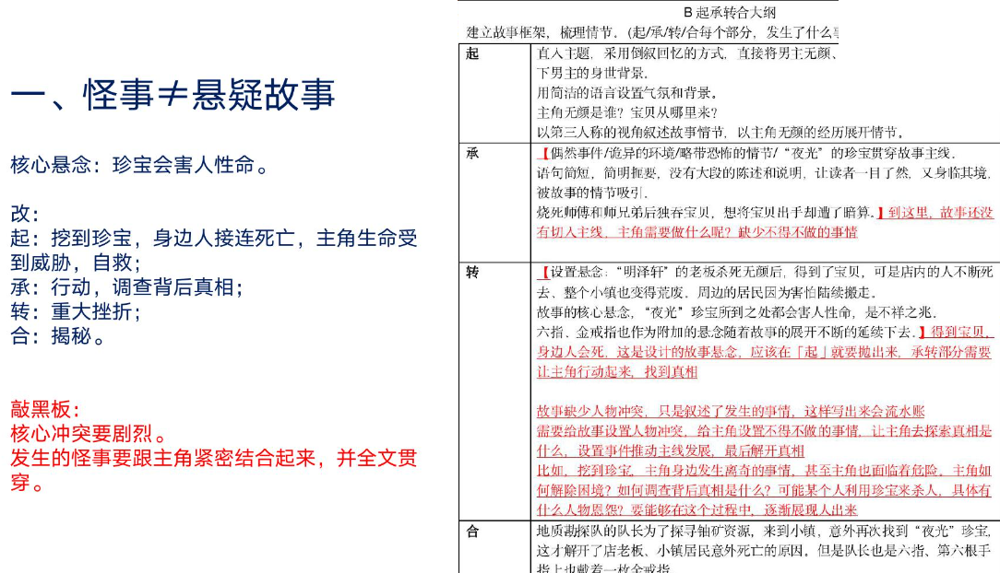

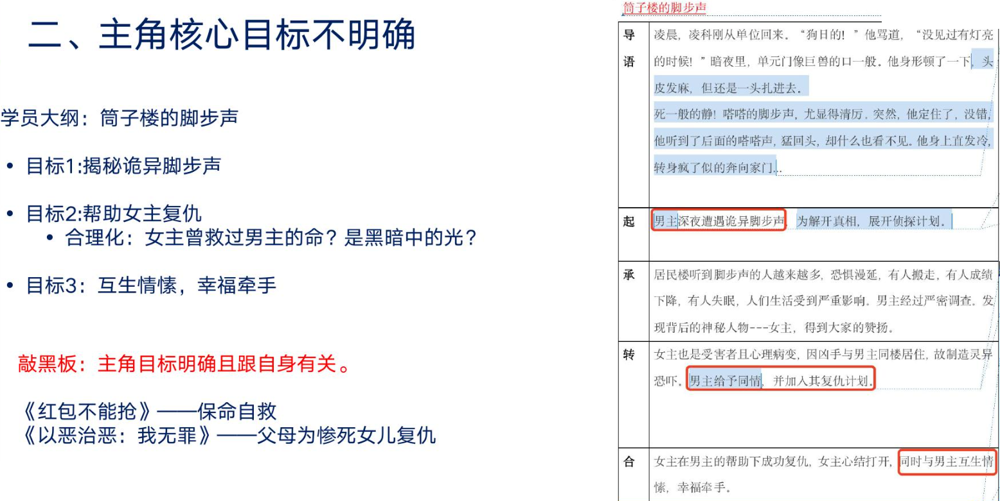

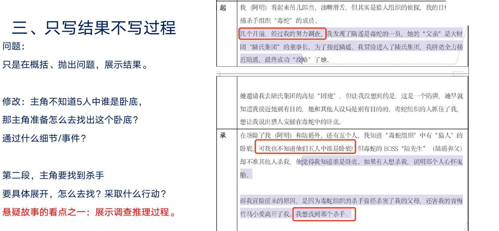

不建议没有专业相关背景、真实职业背景，去写刑侦故事，知乎读者对于编故事容忍度低。

如果要写，一定要研究知名案件、大案纪要；创作时，重悬念避事件，可以放在悬念本身。

### 悬念解析

> 大圣老师

悬疑故事中悬念特别重要

其他故事：知道因，去发展果

悬疑故事：知道果，去寻求因

比如言情中的悬念，像是创造。而悬疑中的悬念，更像是还原。

**设置悬念需要注意：**

- 单线设置：否则 太多，容易将读者绕晕
- 分清意外和悬念：意外是无迹可寻，而悬念是有迹可循的，有铺垫的。
- 节奏：小悬念/小悬念/中悬念/小悬念/大悬念/小悬念/超级悬念（前500字要有）
- 反转要足够强：有反转就有看点。

反转的设计

- 给错误的信息：通过调查排查A，排除B，以为是C，最后发现是D
- 隐藏重要的线索

设置悬念的技巧：信息差

- 主角知道读者不知道（读者失控）
- 读者知道主角不知道（主角失控）
- 读者和主角都不知道（都失控）

悬念练习：

- 场景练习
- 选择不同的阻碍加入情节中，体会差异

## 打卡日志

✍️打卡模版如下：
「第 x 次学习打卡」
「微信名」：
「课程第 x 课」
「学习笔记」：
「我的几点思考」：
连续打卡完本周的课程后，下周可以联系我领取课程思维导图哦~~

### 课程打卡

坚持写作56天！

> If you persist `:heavy_check_mark:`，If don't `:x:`

|       |        周一        |        周二        |        周三        | 周四 |        周五        | 周六 | 周日 |
| :---: | :----------------: | :----------------: | :----------------: | :--: | :----------------: | :--: | :--: |
| 第1周 | :heavy_check_mark: | :heavy_check_mark: | :heavy_check_mark: |      |                    |      |      |
| 第2周 |                    |                    |                    |      | :heavy_check_mark: |      |      |
| 第3周 |                    |                    |                    |      |                    |      |      |
| 第4周 |                    |                    |                    |      |                    |      |      |
| 第5周 |                    |                    |                    |      |                    |      |      |
| 第6周 |                    |                    |                    |      |                    |      |      |
| 第7周 |                    |                    |                    |      |                    |      |      |
| 第8周 |                    |                    |                    |      |                    |      |      |

#### 社群打卡

##### ✍️「第 1 次学习打卡」

「微信名」：给神明写首歌
「课程第 1 课」：如何靠写短篇小说变现
「学习笔记」：

盐选专栏创造收益（分成，版权）

热门故事+个人IP

「我的几点思考」：
你赚不到认知以外的钱，所以目前只有熟悉这个游戏规则，但行好事，莫问前程。

##### ✍️「第 2 次学习打卡」

「微信名」：给神明写首歌
「课程第 2 课」：如何拆解故事
「学习笔记」：

细读：先从整体拆，（可按数字小节）拆成小节。每个小节分析大意、人物、情节、感受、亮点

概括：一句话总结故事，包括主角是谁，遇到什么事，做了什么动作，最后结果怎么样**【拆解故事模板】**

「我的几点思考」：
或许写故事前，要先学会读故事

##### ✍️「第 3 次学习打卡」

「微信名」：给神明写首歌
「课程第 3 课」：如何在平淡的生活中寻找素材
「学习笔记」：

写自己：探索自我，探索的过程中，也能增加冲动，激发灵感

审视生活：从不同的视角多观察世界，体验社会种种现象

找梗：把它当成一个灵感的种子。

「我的几点思考」：
写作是长期的事，应当用有意识的心刻意观察这个世界，自然可以搜集到素材和散发灵感

##### ✍️「第 4 次学习打卡」

「微信名」：给神明写首歌
「课程第 4 课」：有哪些隐藏的爆款故事类型
「学习笔记」：

受众多的：情感、真实、脑洞、科幻、悬疑

~~不能触碰的或者受众少的：色情，宗教，政治，儿童书籍~~等

爆款之所以是爆款，大概是因为他们将很多人在写的主题写出新意。

「我的几点思考」：
如果是自嗨式写作，自然怎么写都行，但如果想要有读者，就要进行系统的学习。

##### ✍️「第 5次学习打卡」

「微信名」：给神明写首歌
「课程第 5 课」：如何构思你的故事
「学习笔记」：

从读者出发，找到共鸣感

着重描写名场面，省去无关紧要的笔力

拆解是对已有的故事刨根问底，而构思是让已有的灵感生根发芽**【故事选题模板+起承转合大纲】**

「我的几点思考」：
如何创造一个有趣的故事，这个是需要我们用心去梳理的，写作是一门工程，需要动手+打磨。

### 走进故事世界

#### 直播课：开营

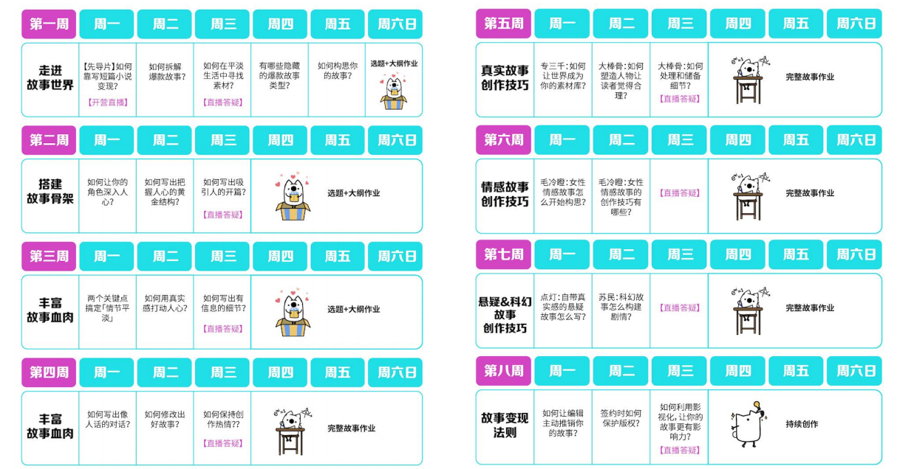

##### 目标+阻力+结局

> 故事的主角，都是有强烈的【目标】，同时也遇到了【阻力】，创作故事，就是要让主角突破困难，抵达【结局】

目标：人物面临什么困境，危机，要能够打乱主角原来生活，不能是可做可不做的事情。

:x:我发现门口有人影，调监控发现时外卖小哥送外卖

:heavy_check_mark:主播直播被人砍死，我就住在对门，凶手出门后再我家留下了记号。

阻碍：对手要强大，增大主角面临的困境，让读者关心主角后续发展。

:x:群里有人发红包，要要回我没统一，对手扬言要打我

:heavy_check_mark:群里有人发红包，事后说是老人误操作要返回，被群里的人讥讽，老人跳楼，领过红包的人逐一死亡，凶手却不见踪迹，我如何保命？（盐选：红包不能抢）

> 这个阶段心态很重要：但行好事，莫问前程

##### 福利

- 三篇用心创作的万字故事
- 盐选签约—成为盐选签约作者

```
S级（盐选）
1. 【语言】简洁准确，篇幅 1-2w 字
2. 【主旨】明确，有话题度，主角目标-阻力的冲突足够强烈，无冗余散乱支线
3. 【人物/剧情设定】有创新亮点，或细节代入感强、情绪足
4. 【情节】逻辑通顺，开篇 800 字有重要冲突场景，全篇有 2 处以上能引发共鸣的情节
收益：往期签约学员平均 2000，3 位学员月入 6w，有分成和买断两种模式
```

- 站外邀约——对接机构编辑

```
A/B级（站外）
1. 【语言】易读，篇幅 1-2w 字
2. 【主旨】明确，基本呈现出主角目标-阻力的冲突，轻微冗余散乱支线，有修改潜力
3. 【人物/剧情设定】有亮点，或有细节支撑
4. 【情节】逻辑无明显漏洞，开篇 1500 字有重要冲突场景，全篇有 1 处以上能引发共鸣的情节
收益：保底 300-1000，有分成和买断两种模式，有后续约稿机会

C级（站外）
1. 【语言】通顺，篇幅 1-2w 字
2. 【题材】符合作业要求，是一个完整故事，不触碰安全底线
3. 【人物/剧情设定】有一些亮点，对素材的观察捕捉到位，有一定的构思
4. 【情节】展现虽然存在问题，勤加练习有挖掘出亮眼情节的潜力
收益：保底100 元，有后续约稿机会（往期签约学员后续有变现 500）
```

- 毕业福利包
- 征文活动

> 课程认知+训练方法+老师反馈，2-6个月后签约

- 不是速成模板，而是可以长期自我训练的路径
- 对写作更深刻的认识，对自我和生活有了「创作者」的视角和思路

#### 拉片：抗痔恋爱笔记

>  手把手带大家拆解盐选专栏爆款故事的结构逻辑，同时总结故事创作的底层方法，给到大家一些「拿来就能用」的实用小技巧。

《[抗痔恋爱笔记](https://www.zhihu.com/market/paid_column/1327668284255281152/section/1329416279028334592)》: 专栏的热度高达355万，有5600+人评价，作者通过专栏的月收入超过80万

故事基本信息：

- 故事类型：现代言情故事
- 故事主线：母胎单身的痔疮女孩，去医院手术，遇到医生男主，非常喜欢，开启了一条追爱行动。
- 故事人设：沙雕女主 X 冷面医生
- 故事风格：口语化、接地气、流畅

##### 1.人设新鲜

男主是冷面肛肠科医生，女主是自带沙雕气质的职场白领。
这种医生类的设定，在当时的盐选专栏（2021年1月）还是很少的。
随之也掀起了一个医生文的小高潮。

从整个故事线来看，男主自带高冷，或者有点闷骚，在面对女主，他先是拒绝女主表白，又制造了夜半去陌生美女家的误会，然后又扭转剧情发展，和女主走到一起。

在男主身上，最大的特色就是他的职业，因为他医生职业的属性，让故事设定有了新的场景，才会有痔疮手术这样尴尬且自带喜感的事情发生。

**那么同理，还有哪些自带画面的人设呢？**

像是健身房里的健身教练，旅行空中偶遇的空姐，去银行取钱时遇到的柜台小哥，cosplay漫展上遇到的二次元小姐姐，大学球赛看台上的学霸，夜跑时遇到的遛狗小哥，闲鱼买二手货遇到的同城买家，在滑雪场的缆车上遇到理想型等，都是可以自带画面感的。

**那么在此基础上，可以延展出什么尴尬剧情呢?**

就拿偶遇来说：
健身房里，跑步机上的小姐姐，突然的加速，被摔下了跑步机，被一旁的健身教练捞起，开始一段爱情。
去往泰国的飞机上，被一个空姐深深吸引，加上微信后，发现原来是好友关系，但是她原来不长这样呀。
在比赛看台上，突然一个镜头摔过，要求亲吻身边的人，一边是暗恋的人，一边是帅哥，我亲了帅哥。
大家也可以根据自己的脑洞，想一些有意思的偶遇场景。

##### 2.情节简单

其实，这个故事的情节非常简单，本质就是一篇都市小甜文，高冷医生爱上痔疮女的故事。
但是结构非常清晰，情节主线明确，没有任何多余的支线。
连女配、男配都没有。
在这条主线上，情节层层递进，一波三折，接连推翻。

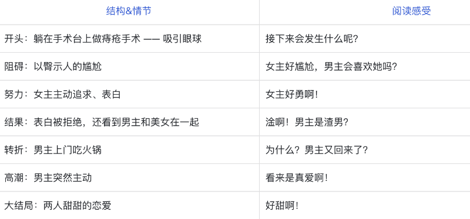

在这个故事结构中，读者的情绪会完全被调动起来。
爱情故事，天生自带悬疑感，也就是男主、女主能不能在一起。
关于爱情情节怎么写得对味，后续的课程中我们会仔细讲。

这次知识点分享，想告诉大家的是，这种简单的单线程叙事结构，是可以模仿的。

开头可以是男女主的偶遇。
中间是偶遇后主角的反应，可以是喜欢上男主的反应。
努力是主角为了心中目标，也就是把男主追到的决心。
结果是这次努力白费了，没得到理想的结果。
意外是故事开始转折的标志，是对前面剧情的一次推翻。
转弯是真正的转折降临，主角有了机会得到圆满机会。
结尾是满足读者期待，得到爽感，主角完成目标。

按照这样的结构，你的故事是不是也有的新的灵感呢？

##### 3.表达很细节

这篇故事的细节处理极具真实感，流行梗也很多，是很契合年轻人表达语境的。

比如，女主因为痔疮刚手了术，要注意一日三餐。
「中午点餐时，我否定了同事『成小』的提议，拒绝了『驴火』的邀请，不合群地点了份炖汤+白米饭，还不忘备注『不要味精』」。

再比如，女主是职场社畜，在她的表达体系中，回复“1”表示收到。
当她把一日三餐照片发给男主时，对方回复了个“1”，带了那么一丝冷淡的感觉，让女主情绪一下子低落了。
健身房里，跑步机上的小姐姐，突然的加速，被摔下了跑步机，被一旁的健身教练捞起，开始一段爱情。

像是缩写、特定表达，会让整个故事变得有真实感。
在细节的处理上，可以吸收一些当下的话语体系。
比如网络流行用语、日常消遣用语等。
像是“人生无常，真是大肠包小肠”“这就是俺的baby”“完啦，芭比Q啦”等。

让故事更接地气，更贴近生活。
当然，也要注意人设和语言表达的契合。
如果是个高雅名媛，多少有点不合适。
按照这样的结构，你的故事是不是也有的新的灵感呢？

#### 直播：找准角色本质：人设即故事

> 郑远

**人物设计**


**角色真相**

- 行动：行动揭示"人物真相"

角色的真实本质，在于面对事件时的`行动`

并不是作者说人物具备以下品质，读者就可以接受的，而是通过角色面对`事件`时的`行动`来体现人物的品质的

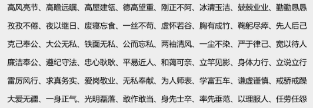

故事**情景**：设计人物时，其实也是在设计人物的情节。

- 人物弧线：人物本性的发展轨迹或变化

定义：优秀的作品不但揭示人物真相，而且还在讲述过程中。表现人物本质的发展轨迹或变化，无论变好还是变坏。

`成长`点： A->B（eg. 自私自利->大义奉献）

反英雄类人物的弧线：精神世界不断崩溃和异化的过程（小丑）

> 与其考虑立体的人物，不如考虑`立体的事件`，让人物在事件中碰撞价值观，展现起成长弧线。

- 人物真相：压力越大，揭示越深

只有当一个人压力之下做出选择时才能得到揭示——`压力越大，揭示越深`，该选择变`月真实地表达了人物的本性`

总结：

人物真相->从行动中展现，->给予事件让人物行动->行动中，压力越大，人物最真实的一面得以揭示。

事件设计和人物设计互成镜像，`没有事件设计人物就不可能得到深刻的表现`

结构的功能就是提供不断增强的压力，把人物逼向越来越困难的两难境地，迫使他们做出越来越艰难的冒险的抉择和行动，逐渐揭示出其真实的本性

行动必然带来：期望和结果之间的鸿沟（矛盾和冲突）

> 这里的难点，就是这么给人物设计对应的`情境`

**人设即故事**

一句话故事

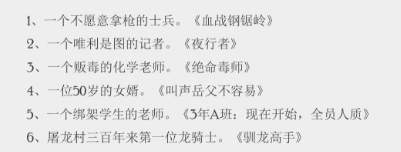

其他人的 ：

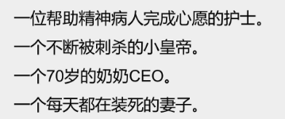

一句话故事相当于一个创意，是对故事和人设的高度概括。

核心原则：

1.想象空间

2.潜在行动

3.暗含主题

要点：

1.在读者常识范围内的用词

2.写人物行动/不描述人物一种状态或属性，比如残疾

3.落点在人物身上

给角色加定语： `一个___ 的___`。

`创意`并不是故事的第一步，`好的创意`才是。好的创意给角色提供了`戏剧性的行动舞台`。

人物需求和人设三项：

todo: 搜索*人物开发清单*

`动力源`(动机)：人物行动的动力源头，主角追逐目标的动机（也是所有不好看的戏主要问题）

三个遵循：

1.遵循人的`本性`（社会心理学）

2.遵循人的`个性`

3.遵循人的`困境`

二个特点：

1.动机越`具体`越好

2.动机越`感性`越好

马斯洛的动机与人格：

1.第一层次：生理上的需要

2.第二层次：安全上的需要

3.第三层次：情感和归属的需要

4.第四层次：尊重的需要

5.第五层次：自我实现的需要

> 我从不写那些没到穷途末路的人物——斯坦利·埃尔金
>
> 人生的极大痛苦时刻。

动力源=动机=`欲望->鸿沟<-现实`=冲突=戏剧性（具体落实到人物身上和具体操作）

思考人物设计的核心方法——人物需求

三大需求：1、主线目标  2、情感需求 3、 精神需求（内在冲突/成长点）

因人物三大需求而产生人物关系

主线目标：同伴、对手、蛇蝎......

情感需求：亲情、友情、爱情、爱国情怀......

精神需求：B故事人物

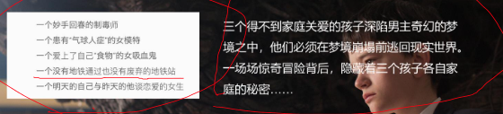

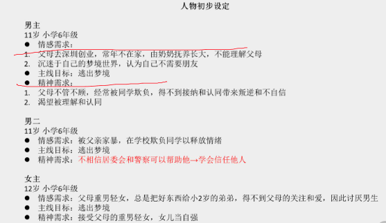

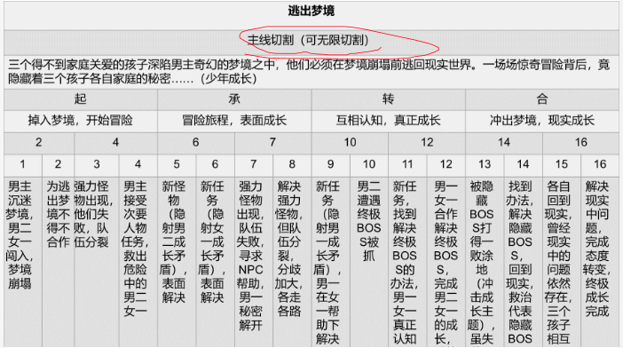

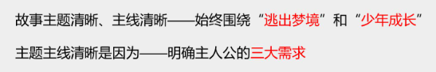

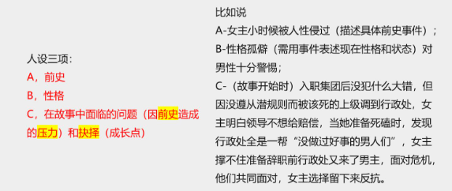

叙事结构

三幕体：

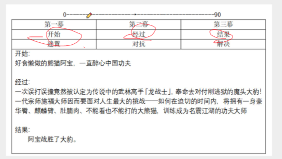

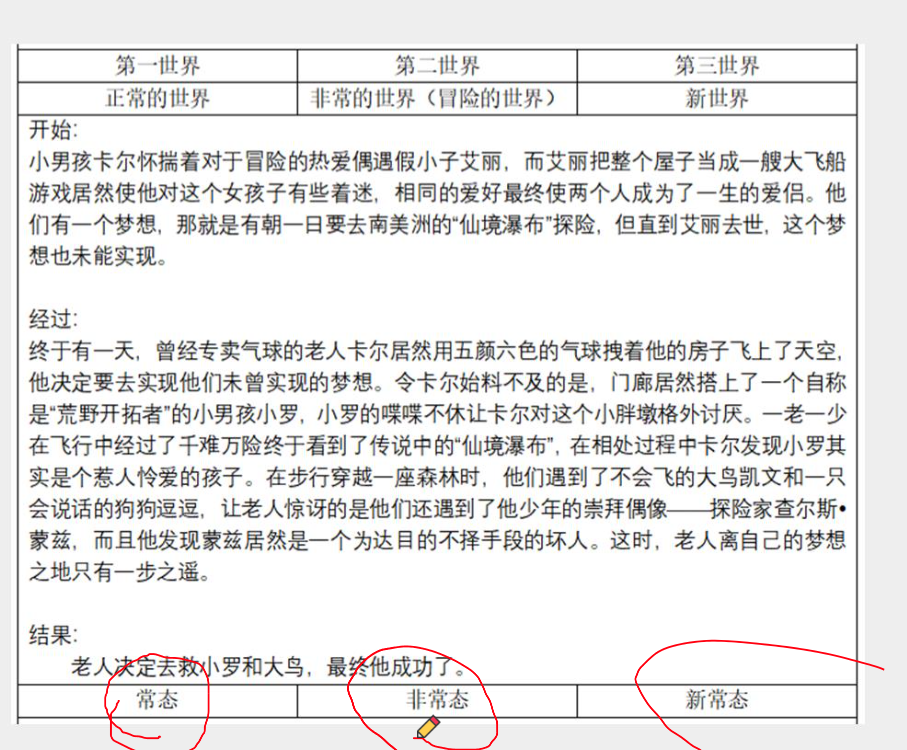

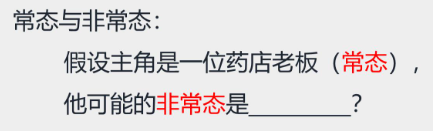

转折跟悬念

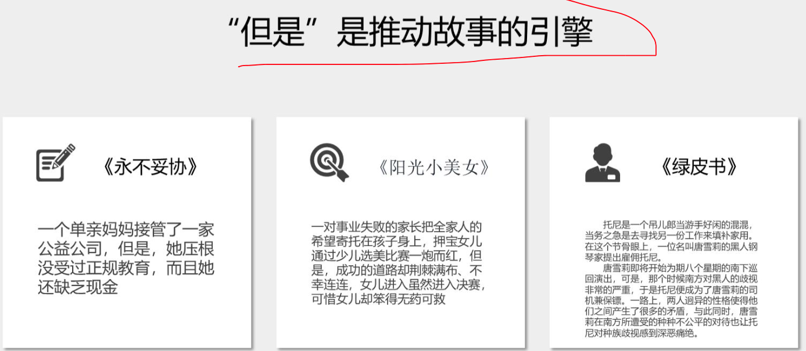


故事简介的写作方法：

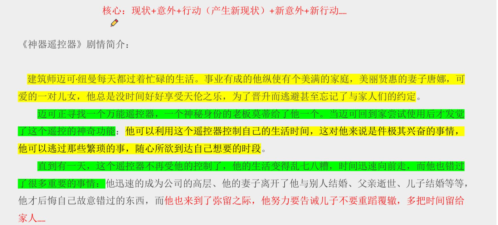


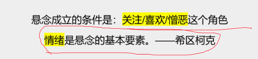

这里的情绪是指读者的情绪

制造悬念的9种方法

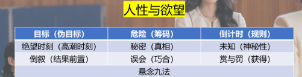


有效创作练习方法

素材积累：神话故事、新闻素材、阅读和阅片、专题研究

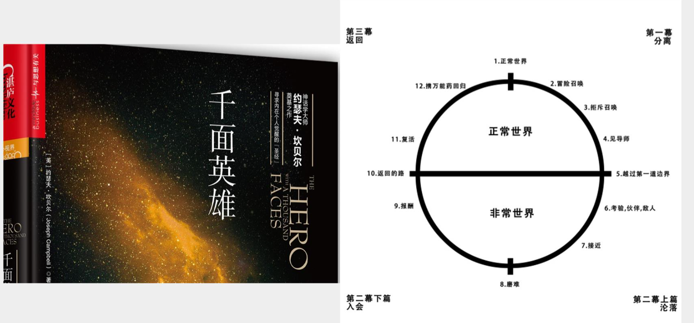

故事视角

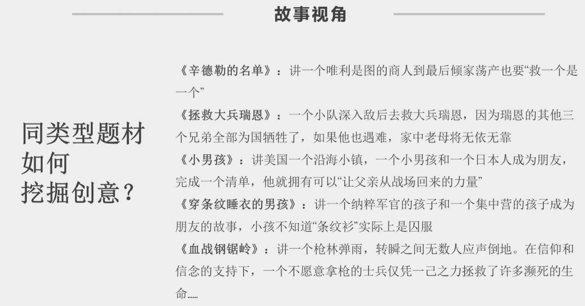

元素叠加练习

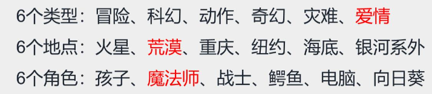

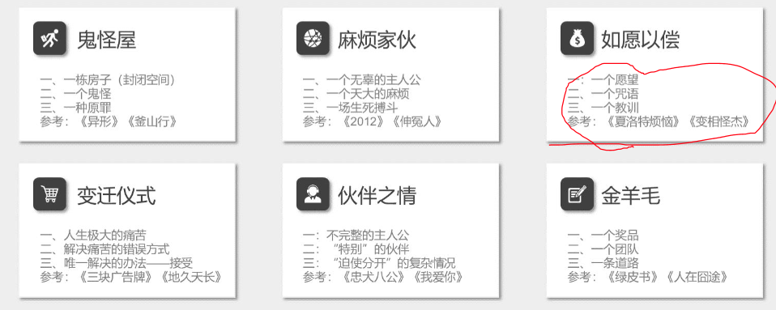

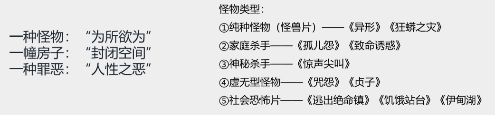

#### 如何靠写短篇小说变现

热点话题，打造IP，签约盐选专栏

#### 如何拆解故事

按照模板联系，细读，然后用一句话概括故事

#### 如何在平淡的生活中寻找素材

多观察这个世界，用有意识的心去体验种种事情。

#### 有哪些隐藏的爆款故事类型

情感、脑洞、真实、科幻、悬疑

#### 如何构思你的故事

从读者角度出发寻找共鸣感，且要着重雕刻名场面，以及略去无关紧要场面的冗余描述。

#### 选择+大纲作业

### 搭建故事骨架

#### 拉片：北漂原地过年

《[泰安情侣：北漂原地过年](https://www.zhihu.com/market/paid_column/1320010766825877504/section/1341694656506310657)》——《小城故事多，不只你与我》

#### 如何让你的角色深入人心

#### 如何写出把握人心的黄金结构

#### 如何写出吸引人的开篇

#### 选择+大纲作业

### 丰富故事血肉

#### 两个关键点搞定情节平淡

#### 如何修改处好故事

#### 如何保持创作热情

#### 完整故事作业

### 真实故事创作技巧

#### 如何让世界成为你的素材库

> 专三千

#### 如何塑造人物让读者觉得合理

> 大棒骨

#### 如何处理和储备细节

> 大棒骨

#### 完整故事作业

### 情感故事创作技巧

#### 女性情感故事怎么开始构思

> 毛冷瞳

#### 女性情感故事的创作技巧有哪些

> 毛冷瞳

#### 完整故事作业

### 科幻故事创作技巧

#### 自带真实感的悬疑故事怎么写

### 悬疑故事创作技巧

#### 科幻故事怎么构建剧情

#### 完整故事作业

### 故事变现发则

#### 如何让编辑主动推销你的故事

#### 签约时如何保护你的版权

#### 如何利用影视化，让你的故事更有影响力

> 持续创作

## 问题推荐

### 一、情感故事选题

如果一个男生在打游戏但秒回了一个女生的消息，这代表着什么？
https://www.zhihu.com/question/346024815

贫贱夫妻百事哀能哀到什么地步？
https://www.zhihu.com/question/363473759

什么才是真正的闺蜜？
https://www.zhihu.com/question/20958490

因琐事争端把男友论文及资料全删了，有挽回办法吗？怎么才能让男友消气？
https://www.zhihu.com/question/420935657

如果女生主动一点，男生会不会心动？
https://www.zhihu.com/question/432129590

### 二、脑洞故事选题

哪吒为什么打不过孙悟空？
https://www.zhihu.com/question/337227546

丧尸爆发了，你应该怎样生活？
https://www.zhihu.com/question/268471246

东方神话体系的神和西方神话体系的神，如果发生神战，哪边胜算大？
https://www.zhihu.com/question/32365936

如果古代皇帝想尝尝月亮的味道，而你是御厨，你怎么大开脑洞?
https://www.zhihu.com/question/38355887

如果神话传说都是真的，世界会变成什么样子？
https://www.zhihu.com/question/36260262

以“丧尸病毒”为背景写一篇囤物狂的小说?
https://www.zhihu.com/question/489203002

### 三、真实故事选题

有哪些拙劣但成功过的骗局？
https://www.zhihu.com/question/36858630
地铁司机是不是很有意思的职业？
www.zhihu.com/question/35603126
船员长期在海洋上工作是怎样的体验？
www.zhihu.com/question/29298020
把一副烂牌打好的人有哪些？
www.zhihu.com/question/267653832
眼看着所在行业日渐衰退是种怎样的体验？
www.zhihu.com/question/39957694
在你最穷的时候，是怎么翻身的？
https://www.zhihu.com/question/403275033
你见过命苦的人有多苦？
https://www.zhihu.com/question/284394314

### 四、科幻故事选题

宇宙中的高等文明会不会一直在用人类尚无法察觉的手段观察着人类？
https://www.zhihu.com/question/350091293

有没有比黑暗森林更黑暗的理论？
https://www.zhihu.com/question/418127358

有哪些有趣的「最弱异能」？
https://www.zhihu.com/question/24338075

如果有一个超能力，每天的第一百步必定踩到狗屎（因果律），你能用它干什么？
www.zhihu.com/question/515782115

如果给你一亿RMB让你余生都只能活在同一星期内你愿意吗？
www.zhihu.com/question/450684657

### 五、悬疑推理故事选题

大家身边有没有莫名其妙就失踪的人？
https://www.zhihu.com/question/24896460

如何以「我当时害怕极了」为开头写一个故事？
https://www.zhihu.com/question/430910051

不经意在室友床垫下发现了一把水果刀怎么办？
https://www.zhihu.com/question/350091132

如何以「车站里，有个男人死了」为开头写一篇悬疑故事？
www.zhihu.com/question/492411725

你听过小孩说的最可怕的话是什么？
www.zhihu.com/question/268009004

站内白金段位作者「叶小白」的爆款故事，名字是《真爱至上：决绝复仇、温馨脑洞和最纯的爱》中的《杀人回忆：不存在的凶手》（这个专栏的热度高达 270 万，有 3700+人评价，当之无愧的爆款文。）

https://www.zhihu.com/market/paid_column/1348590705925902337/section/1386643770109227009

## 日常拉片

### 《[杀人回忆：不存在的凶手](https://www.zhihu.com/market/paid_column/1348590705925902337/section/1386643770109227009)》

先交代故事基本信息：

• 故事类型：悬疑复仇故事

• 故事主线：我在成人自考中作弊被发现，「记者」陆羽追问的却是我策划的一桩命案，为了报复伤害了闺蜜的渣男，我杀死了他。最终，通过一个接一个的谎言，使他成为了帮我逃避惩罚的帮凶。

• 故事人设：腹黑女主，警察陆羽

• 故事特点：连续反转、情节紧凑、悬念迭起

《杀人回忆：不存在的凶手》是一篇结构比较精巧的短篇悬疑故事，它基本包含了悬疑故事需要具备的重要元素：一波三折的悬念设计，拍手称绝的反转以及准确运用的写作技巧。

第一：情节上一波三折、层层反转、悬念拉满

在悬疑故事中，「悬念」和「反转」是非常重要的故事元素。真相到来前情节应该是一波三折的，你埋下的所有线索，可以一直被建立又推翻，推翻又建立，直到最后一鼓作气，让它们跳出来，将故事全面反转。

这个故事里作者巧妙地设计了「三层谎言」，通过每一层谎言，构建悬念，在读者好像即将抓到真相的时候，跳出来说「哈哈，骗你的」，让情节像过山车般，接连反转。在「我」与「记者」陆羽的博弈这条故事线上，情节是层层展开的，作者不慌不忙地把同一个故事讲了三遍，三遍似乎相同，但又有新的线索加入，让事件出现变化，读者的情绪在一次一次的反复中被拉高。

从已知的结局反推，「我」与陆羽的谈话，其实是一场请君入瓮的戏耍。
「我」反复撒谎+坦白的过程使对方最终放下戒备。
「我」知道每一层谎言被揭穿，「我」就离自己想要达到的目的更进一步。
并且最终，「我」获得了胜利。

故事的反转点：

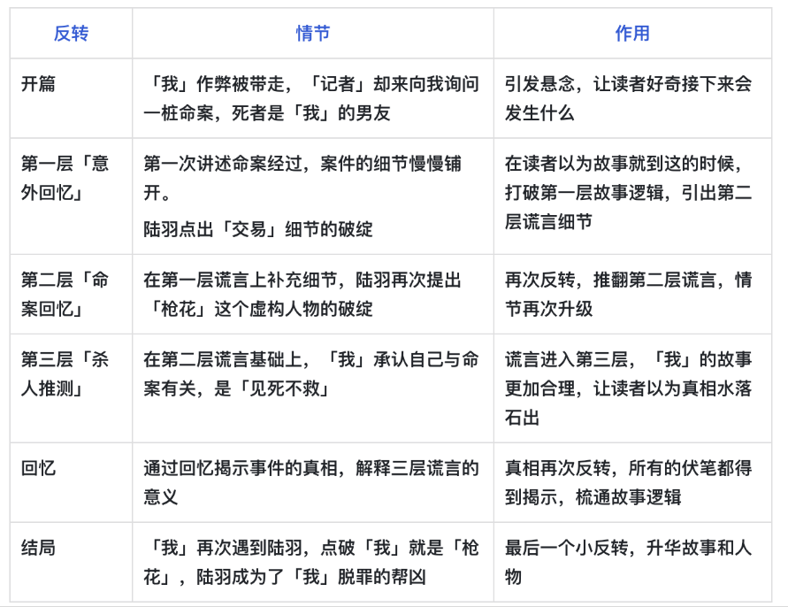

在写作中，要注意：你设计的每一次反转，有没有让情节升级？如果没有，就要考虑是否值得动笔写这个反转了。

第二：结构上紧扣主线、关键情节点饱满、细节铺垫丰富

1.主线清晰

故事的主线非常简单，「我」报复并杀死伤害了闺蜜的渣男，然后通过谎言，逃脱罪责。

主要情节在「我」和陆羽的谈话中推进，利用设计好三层的谎言，回答「记者」陆羽的追问，步步将他引入「我」设下的圈套，让他不知不觉成为替「我」掩盖杀人真相的帮凶。

故事的结构也非常巧妙，没有多余的支线，没有复杂的人物关系，所有的悬念设计都在已知的故事内。

第一层，「我」将它回忆成一场意外，我没有参与；第二层，「我」将它讲述成一场命案，而「我」也是命案间接受害者之一；第三层「杀人推测」，「我」有心杀人，但没有实际行动。

主角「我」在这三层故事里的参与度是逐渐加深的，符合人们对于真相的预期。「我」正是利用这一点，使陆羽相信了我的故事。

故事的人物（「我」、男友、记者、枪花、路人）、悬念元素（作弊、杀人、游泳等）都在第一层的故事里面出现，后面没有再加入新的人物和悬疑元素。依靠人物在三层故事中的身份变化，就完成了悬念和反转的构建。

2.关键情节点饱满

还记得前面课程讲到的黄金叙事结构吗？在三个关键情节点上，人物、情节都发生了巨大的转变。

第一情节点：「我」第一次讲述案发经过，陆羽抓住破绽，揭穿了「我」的第一层谎言。
（主角陷入巨大危机，让读者产生紧迫感）

中间点：「我」重讲了一次，把自己变成受害人，陆羽揭穿了「我」第二层谎言。此时，「我」知道他已经上套了。于是「我」给他讲了第三次案件经过，这次，他相信了。
（情节到这里渐落，但只是风暴前的平静，此刻，读者知道真相没那么简单，开始期待后面剧情，人物弧光显现）

第二情节点：刑满释放的「我」通过回忆揭露这个杀人事件的真相。
（真相揭露，情节反转）

3.丰富的细节铺垫
这些细节你有没有略过了？
1）「我」在这里利用环境作为预设，让陆羽相信自己的第二层「故事」。

```
我沉默，攥紧了拳头，眼神愠怒。
[你看看我的家。]
陆羽迟疑了一下。
老旧的家属楼。在这 2009 年，没有什么家电，就连厨房，烧的也是蜂窝煤我说:[我根本没有那么多钱。]
我出的价钱，是我自己。]
```

2）「枪花」这个人真的是虚构的吗？

```
坐在我的家里，我望着眼前的陆羽
陆羽的脸上，有些许不可思议，却不是对我的
[他们居然相信了一个虚构的人。]
是啊。
人们不相信不打自招
人们相信的，是暴露出来的线索，是吻合他们直觉的故事。
以及，他们经过努力。最后挖掘出的，[真相]。]
这就是全部故事了，陆警官。]
```

3）这里主角的感到轻松，读者是不是以为「我」是因为终于说出真相而感到轻松呢？
      这里恰恰是作者为后面大反转铺垫情绪。

```
走出老旧的家属楼，太阳已经开始下山了
不似那个傍晚，反而，很轻松。
```

第三：技巧上叙事诡计、利用视角盲点
这篇故事中，作者对于写作技巧的把控也是十分到位。

首先，故事通篇都是由「我」的第一视角出发，进行讲述。
这里要讲到的是第一视角叙事的时候，是可以利用信息差，也就是「视角盲点」来制造一些悬念。

第一视角会有更多主角在主观上对心理和细节的叙述，同时减少写「第三视角」（即「全知视角」）对于细节的观察和描述，可以人为制造一些「未知信息」，为对手设置一些迷雾。

故事从一开始都是由「我」的视角出发，剧情随着我的视角逐渐展开。读者很难发现，作者在这里埋伏了哪些伏笔，或者设计了哪些视角盲点。

而「陆羽」这个角色，就是来挑战这些视角盲点，逐步逼出真相。

然后，作者利用了一些叙事诡计，玩了一个「角色身份」的大反转，故事看起来更加高级。

作者是怎么用「叙事诡计」的呢？

```
在结尾的地方出现了「闺蜜」这个新角色
我们在之前的课程中讲过，第二情节点的时候不宜再出现新的人物
这是作者的失误吗？
并不是
请对照来看，「我」编造的第二层谎言。
```

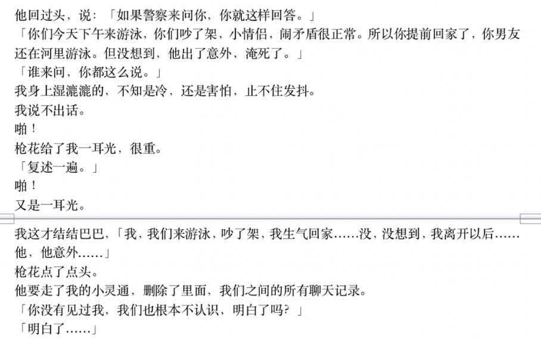

我」回忆的案发当天

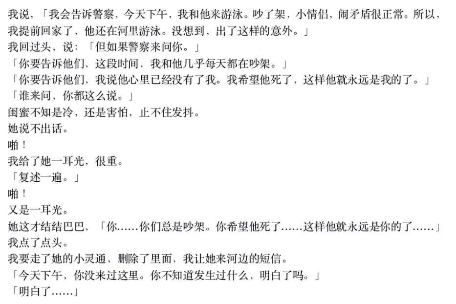

这两个情节，是不是有些熟悉？
这就是利用叙事诡计，改变了「我」在事件中的身份。
故事中，虽然陆羽没有完全相信，但是「我」让他认为「我」是想逃避责罚，所以说谎，从而获得了他更进一步的信任感。
在他最终追问出了第三层故事后，选择了相信「我」

通过叙事诡计，让真相相互嵌套，从结构上率先制造悬念感和紧张感，在最后给人恍然大悟之感。在这样的故事结构中，读者的情绪会完全被调动起来。

### 《[急诊见闻：生命抢救倒计时](https://www.zhihu.com/question/47205881/answer/2284732519)》

## 日常创作

场景1：

```
我家里比较穷，考上大学，爸妈打来电话，让我自己解决生活费
我努力了整整半年，期末熬夜复习。拿到成绩单，是全班第一，足够拿到奖学金
来找辅导员申请，看到平时总奚落我穿着打扮，从不看书的室友也在
她和辅导员谈笑风生，身边放着的爱马仕包包很闪亮
她看到我，挑衅似的斜了我一眼，继续和辅导员吹嘘自己的成绩
辅导员边听边笑连连点头，我知道奖学金不会属于我了
没几天，看到室友发朋友圈，又买了新包
我卡里的余额只有248.67了
```

场景2

```
我在一个晚上才营业的超市当收银员
每天来超市买东西的只有那么几个夜猫子
一个天天加班的25岁程序员，老实忠厚，下班来买烟
一个小区看门的保安，四五十岁，常来买啤酒
半夜三点固定出现的超市老板
还有一个打扮新潮，穿着清凉的年轻女孩，临近午夜常来买方便面
突然有一天，女孩死在了便利店后巷，
警方调查了她的男朋友、同事和有过纠纷的朋友，都有不在场证明
```


## 写作技巧

> 故事有「五巨头」指的是 选题+人物+情节+结构+开篇。

### 故事方法

#### 叙事诡计

叙事诡计是一个在推理、悬疑故事中非常好用的写作手法，在这里分享给大家一些常用的方法：

- 混淆关键事件的发生年代或发生地点，例如故事所有登场人物都是华人，但故事其实发生在美国的唐人街，而不是大中华地区。
- 混淆关键角色的身份、姓名或性别，例如被媒体称为“开膛手杰克，的凶嫌其实是女性。侦探 (第一主角)即为凶手
- 将倒叙或插叙伪装为顺叙（感知混淆与虚构）
- 中途将主角的视角切换为配角的视角，例如故事第一章和第二章都以第一人称我，叙述故事，但这两个我，是不同的人

#### 四段式结构

起承转合

##### 转

转折是剧情的关键阶段，它不是简单的反转或者给人物形象来一个 180° 大变化，而是改变「承」这个阶段中主角或委屈或迷糊的被动状态，让主角变得主动。
让你的主人公不断解决问题，从小问题到大问题，经历了压抑的主人公开始有了巨大的转变，开始觉醒，开始想办法解决问题，开始接触到问题的本质。

这就要决定让你的剧情往哪个方向走：

1. 你可以让故事的主人公 36 计踏上翻身之路。
2. 你也可以让故事的主人公慢慢解开故事真相。

「世情故事」《[我被学渣攻略了](https://www.zhihu.com/market/paid_column/1434488314221498368/section/1448980642649907200)》

```
开篇：女主我和后妈一家生活在一起
承：被后妈和后妈女儿欺负，有过反抗但失败了
转：高考前一大壶热水朝女主泼来，让女主决心高考后一定要离开这个家，也在酝酿着上大学后的转变
合：通过一系列手段，大仇得报

分析：在故事的转折部分，女主变得越来越厉害，懂得深思熟虑，不再像过去，遇到欺负当下就反抗，而是选择“君子报仇，十年不晚”，慢慢积蓄能量。并且利用人性的弱点，让仇人走入深渊。
```

「真实故事」《[科学看待狂犬病](https://www.zhihu.com/market/paid_column/1419263074604343296/section/1446502025302908928)》

```
开篇：一个年轻病人， 网恋奔现后开始发烧，担心是传染病，来急诊看病。
承：怀疑是呼吸道感染、怀疑是艾滋病，不停地检查寻找病因。
转：医生喝水的动作让患者惊恐，确认是狂犬病
合：解释患者得狂犬病的原因

分析：这是一个非常简单的单线程故事，转折部分的设计是为了解释悬念。前面的「承」承担了故事的推理过程，到了「转」，故事慢慢解开真相。
这里「转」的作用和复仇爽文是完全不同的，为读者带来的价值是解开谜团，放下心中疑问。
```

在「转」这个部分，主角要主动去解决问题，扫清障碍：

1.释放情绪：愤怒、怜悯、压抑、郁闷、疑问、爱意等

2.升华人物：人物从出场到转折，要有一定的变化，不能前后一致，要从弱到强、从装傻到高智商、从废材到大神、从一无所有到什么都有等

3.揭开悬念：故事走到转折的位置，要对上文有适当的解释，慢慢解开悬念，给读者一定的交代。


### 黄金开篇

#### 反例

1️⃣情节平淡，读起来没有曲折，看了开头就知道结尾；

2️⃣情节俗套，读者一看就觉得类似的故事看过几百遍；

3️⃣情节狗血，作者写得过瘾，读者尴尬到能用脚趾抠出一室三厅。

:four: 开篇冗长拖沓。这个是咱们学员写故事经常会犯的问题，开头洋洋洒洒写了一千字，迟迟不进入主题，要知道对于短篇故事，读者的耐心是有限的。给大家提个检测小技巧，可以测试故事开篇是否冗长，即「删掉你的第一章」，看是否影响故事情节走向。

#### 正例

1️⃣开头要引起情绪波动，或幽默好笑或愤怒或悲伤。给大家举几个例子哈

```
例子：给喜欢的男生收拾卧室的时候，不小心打翻了垃圾桶。一团粘腻的东西滚出来。被纸巾半包裹着，看上去没用多久，可能是昨晚，也可能是今早。——《暧昧失温》

例子：半夜在男朋友手机看到一条微信：「如果没有女朋友，你会喜欢我吗？」他回了一个字：「会。」——《分手失重》

例子：我觉得皇上是想杀了我。入宫后，从美人到贵妃，我只用了一年时间，几乎是被皇帝一路拖上贵妃的名分，我的名字在这一年之中，后宫里无人不知。——《独占》
```


### 剧情反转

> 怎么才能让读者防不胜防

**设置反转时的常见问题——小由老师**

反转的思路——葵葵老师

#### 错误反转

- 反转脱离人设，为了转而转

需要**明确主角的人设特点**，结合人设构思情节

**强化故事冲突**，把配角利用起来

就是角色的行动要符合人设，不然反转的剧情就会显得莫名其妙

- 反转的情节，没有解决核心矛盾

抓住故事核心矛盾，进口核心设计冲突

强化剧情的反差，增加冲突

反转的剧情要符合逻辑，不然无法说服读者

- 看似反转，实则另起一个故事

错误：剧情设计和主角目标割裂，主线模糊

需要开篇让主角在危机之下，明确目标

聚焦主线，主角行动，是为了目标的达成

#### 反转技巧

和原来想象的不一样

人不是你以为的那个人

事不适你以为的那个事

- 身份反转：先塑造一个A人物形象，等搭建都相信他就是这种人的时候，再揭示他的另一面。

好人变坏、坏人变好

多重身份/人格的揭露

假死/替身

> 注意反转不能人设太割裂，底色保持统一

- 真相反转：

解除误会/骗局

模糊显示和幻觉，读者以为时幻觉时真，揭露现实构成反转。

### 好的故事

#### 如何写出一波三折的故事

① 「悬念」

著名导演希区柯克对于悬念有这样的解释：「如果你要表现一群人围着一张桌子玩牌，然后突然一声爆炸，那么你便只能拍到一个十分呆板的炸后一惊的场面。

另一方面，虽然你是表现这同一场面，但是在打牌开始之前，先表现桌子下面的定时炸弹，那么你就造成了悬念，并牵动观众的心。」这就是悬念的魅力。

所以，大家在今后创作故事的时候，在开头可以制造一个大悬念吸引读者阅读兴趣，在大悬念中需要制造持续不断的小悬念，把读者紧紧勾住。

② 「冲突」

比如在电影《虎胆龙威》中，主角的对手是一群有组织有预谋杀人不眨眼的匪徒，而男主势单力薄一个人，但是男主如果不采取行动，他的妻子以及整栋楼的人都会被枪击。

**情节产生**

故事的主线和大纲是作者的意图，故事的情节是故事的拼图，情节是具有连锁反应的一个过程。

其实情节早已经有固定的套路了，我们要在固定的情节桥段上，加上自己的人物反映。《经典情节20种》

#### 如何用真实感打动人心

> 不能脱离主流价值观，事件需要基于我们的文化逻辑，但是情感可以让事件不符合逻辑

① 将经验作为真实的来源。并不是说没有经历过的事情就不能写，间接经验同样是我们认识世界、了解人物的重要方法。比如蒲松龄写的《聊斋志异》就是整理搜集得来，所以今后在听朋友讲八卦看新闻的时候，就可以把触动你情节记录下来，成为你的创作素材。

② 加入具有现实生活代表性的景物、动作和心理描写，给读者理解故事更多的支撑。比如让主角职业现代化，紧跟潮流，比如短视频up主、网红主播、外卖员、消防员等；爱好更年轻化，比如热衷医美、三坑（JK制服、洛丽塔、汉服）、二次元、打游；比如人物说话更贴近生活，能紧跟潮流就更好了。比如999色号、yyds（永远的神）、xswl（笑死我了）、996、凡尔赛、小号、掉马甲、我麻了等等。


#### 如何写出有信息量的细节

细节可以让人物更立体，细节是一些起关键作用的小事。

归位法训练（选熟悉的人物复原场景并对比），不断追问，写精确

#### 如何有写人物的对话

**对话要符合人设**

对话要制造冲突和矛盾，能推动剧情发展

多用潜台词

简约，不用堆砌华丽词藻

#### 如何修改出好故事？

改

一切初稿都是狗屎 —— 海明威

- 结构

分节，每节主旨是什么，需要重新归拢吗

是不是想讲的太多，导致故事平淡没有起伏

为了故事快速推进，有哪些不起眼的可以砍掉

- 语句

哪些地方拖沓墨迹，让人丧失耐心

每句话表述正确吗，用词清楚吗

节奏上是否有张有吃，是否给读者缓和调节的部分？

- 结尾

主人公在短时间内陷入了巨大危机了吗？

开篇篇幅是否过长，是不是花太多时间预热了？

结尾是否可以让故事得到合理解决？有没有逻辑不通的地方？


#### 如何保持创作的热情？

- 想象力爆棚

电影、电视剧、图书、社会新闻、拿到素材后

问问题，问某个情节上，如果XXX会怎么样？这个就是灵感的来源了。

- CLOSAT卡片

人物(charaters)、地点(location)、物件(object)、情景（situation）、动作(act)、主题（theme）

- 写日记、养成习惯

### 创造人物

#### 人物三要素

- 外在因素：生理维度：一般指外貌、穿着、动作特点等外在特点，比如你的人物的高矮胖瘦，他喜欢穿什么类型的服装，他的发型是怎么样的。
- 社会因素：角色的社会身份、社会地位、早期教育和经历、职业、个人关系状况等，例如你的人物他的职业是什么，警察还是医生，还是公司职员，他的受教育程度是怎样的等等;
- 心理因素：人物的性格、价值观、他是否有不能和外人说的秘密、心魔等等，例如他是一个自卑敏感的人，那他可能对事物的反情就会更趋向于消极的，进避的;又或者他曾遭受过暴力，导致他性格的扭曲等等。

#### 不会写人物怎么办

说实在的，一篇好故事，五巨头缺一不可。但非要说哪个要素最重要的话，我可能要选「人物」。毕竟，一篇故事总要有人物（或许是以动物的形象出现，但也是拟人化的，比如《动物庄园》）。

人物的重要性不在话下，可很多人在塑造故事人物时反而犯了难，有经验的创作者担心人物形象没有新意，没经验的担心人物立不起来，读者看完吐槽。应该怎么写，让人物「活」起来呢？今天我就带着大家一起实操下。

我们先想一个人物设定。我此时此刻想到的，是一个性格强硬、面对不公毫不妥协的女性
就给她起名叫「岳明明」吧

再来细化下她的形象，分别从以下五个维度展开：

```
感情上，她是单身。
生活上，她不拘小节，喜欢骑摩托车兜风。
形象上，她喜欢穿亮色的衣服，不喜欢穿裙子。
职场上，她飒爽，干脆果断，是个中层领导。
家庭上，她是北漂，父母在老家已经退休了，比较开明，不催婚不催生。
```

当我们脑海中有了人物的大概形象，接下来要怎么下笔去写呢？

千万不要在故事的一开头就写我的名字叫啥、我爱穿什么衣服、我的家庭背景等等。
没有情节，这些自我介绍，都是无效信息，没有读者会喜欢看这些。

我们必须要**把人物安插到具体的情节中**，让她去面对问题，用自己独有的方式。

因为女主的性格很飒爽，那么女主在**行动**上就会有鲜明的特色。

```
比如 ，当女主在公司被男客户咸猪手。她怎么可能忍受这样的欺负？
我们女主抬手就是一巴掌，男客户也不是省油的灯，
抬手反击回去，还把办公椅推到了，发出很大的声响，
女主本想再补上一脚，被闻声而来的同事拉住了。
最后合同也没签上，女主还被上司批评了一顿。
```

如果放到**对话**上，女主应该说什么样的话呢？

比如：

```
我（女主）被上司叫到了办公室。
上司：你知道这个单子对我们有多重要吗？
我：我是来工作的，不是服务人的。
上司：摸两下能死么？
我：能。
说完这话，我摔门就出了办公室。
```

正是因为女主飒爽的性格，她不会说出：

```
上司：你知道这个单子对我们有多重要吗？
我：是我的错老板。
上司：摸两下能死么？
我：不能，我下次注意。
```

对话是最能体现人物性格的，
正所谓什么样的人说什么样的话。
如果女主说出了违背人物性格的话，一定是有另外的原因，
而这个原因，也会成为情节的悬念点。

比如岳明明在硬刚过上司以后，又发生了职场x骚扰事件，而女主和上司的对话，却是这样的：

```
上司：你知道这个单子对我们有多重要吗？
我：我知道，所以我这次忍了，没有和客户当面吵起来。
```

这时，屏幕前的你我和故事里的上司，一定会感觉很奇怪：是什么事让她转了性呢？
可能是家中老人病重需要钱，可能是被其他领导单独教育过，可能是感情不顺心灰意冷……而这个原因，就会开启故事后续的新情节。

到现在为止，读者只看到了职场上的岳明明，这只是她的一个侧面。我们得想个办法让人物更丰满。有一个很好用的方法，就是体现人物的反差，有「反差萌」的人物，就不是纸片人了，而是立体的形象。

比如：

```
岳明明因为硬刚上司失业了，每天在家叫外卖，每次点餐都是同一位小哥来送。
这个小哥其实以前也给女主送过餐，只是女主因为沉迷工作没有注意过。
小哥原来见到的女主是雷厉风行的，但是失业后见到的女主变成了肥宅，
点的外卖从轻食沙拉变成烤串、麻辣烫、回锅肉……
还时不时哼哼唧唧地跟他抱怨外卖里面的肉越来越少了
外卖小哥意外看见了女主卸下伪装，小女孩的一面
```

职场中强硬的女主与失业后撒娇的女主，这两种状态让女主的形象立体起来。

每个人物都是会有两面性的，强硬和软萌是一个很常见的两面，还有单纯和腹黑、冷漠和温柔、嘴贱和善良、社恐和社牛……

每一面的体现，都需要结合到不同的场景中，或者针对不同的人。比如腹黑小奶狗只对漂亮姐姐表现得很单纯，冷漠霸道总裁对白月光温柔似水，嘴贱青梅竹马在我面前突然吞吞吐吐，社牛女大学生在竞赛第一的学长面前不敢大笑大闹……

这些例子只是我抛砖引玉哈，大家创作时只学方法即可，不要模仿「岳明明」的人设哦~

【练习】

至于人物创作方法，大家如果不记得了，建议回听下「如何让你的角色深入人心？」这节课讲得可全了~

最后，我再给大家一个人物创作的小方法，如果你是故事创作的新手，担心在写人物时容易出现人设矛盾的情况，不妨在开始写故事之前，先写一篇人物小传。在这个传记中，把你脑海中的角色信息完善好，按照「人物三要素」来完善就足够了。


