专注于输出，而不是点缀是它的信仰，黑白简约配色是永远滴神。

<!-- more-->

文档

- https://hexo.io/zh-cn/

- ~~https://theme-next.iissnan.com/getting-started.html(作者iissnan)~~
- ~~https://notes.iissnan.com/(作者iissnan)~~
- https://theme-next.js.org/docs/(next新维护者)

Git文档

- http://iissnan.com/progit/

仓库

- https://github.com/hexojs/hexo
- ~~https://github.com/iissnan/hexo-theme-next(不再维护)~~
- ~~https://github.com/theme-next/hexo-theme-next(不再维护)~~
- https://github.com/next-theme/hexo-theme-next （Next的新仓库）
- https://github.com/next-theme/awesome-next#comment (很多插件)
- https://hexo.io/plugins/ (插件库)

论坛

- https://gitter.im/hexo-next/community


# 安装

## 前提

node.js 16.15.0

git 2.35.1

cmder 

vscode

typora

## 安装hexo

安装hexo 6.2

```
$ npm install hexo-cli -g
```

## 测试初始化站点

### 初始化站点

```
$ hexo init blog
$ cd blog
```

### 启动站点

```
$ hexo server # --debug可以以调试模式启动
```

### 创建文章

```
$ hexo new "Hello Hexo"
```

### 生成静态文件

```
$ hexo generate
```

### 调试

```
hexo g --debug
```

### 本地一键启动

```
$ hexo clean && hexo g && hexo s
```


## next主题

### 安装

采用npm安装next8

```
$ cd hexo-site
$ npm install hexo-theme-next
```

### 更新主题

```
$ cd hexo-site
$ npm install hexo-theme-next@latest
```

## 启用主题

修改hexo的配置文件`_config.yml`启动主题

```
theme: next
```


# 部署

## 本地部署

1. 在本地修改文件。
2. 本地化测试：`hexo clean && hexo s`.
3. 部署：`hexo g -d`。

## 持续集成

- 直接在线编辑文件，立即生效
- 自动部署，同时部署到多个位置

其他部署方式：

- Netlify 部署
- Github  Action
- Travis CI
- Gitlab CI

## 部署到自己的服务器

- 买个服务器（备案）
- 买个域名（解析、HTTPS、SSL）

> Git钩子自动部署

- 服务器配置

1.安装 git nginx

```
yum -y update
yum install -y git nginx

安装完后，rpm -qa | grep nginx 查看
启动nginx：systemctl start nginx
加入开机启动：systemctl enable nginx
查看nginx的状态：systemctl status nginx
```

2.创建博客目录

```
mkdir -p /data/www/blog
chmod -R 755 /data/www/blog
```

3.配置nginx

```
vim /etc/nginx/nginx.conf
# vim 查找: /listen 80
	# 如果是root用户启动,则设置
	# user root
	server {
       listen 443 ssl;
        #填写绑定证书的域名
        server_name 域名(xxx.com);
        #证书文件名称
        ssl_certificate 域名(xxx.com)_bundle.crt;
        #私钥文件名称
        ssl_certificate_key 域名(xxx.com).key;
        ssl_session_timeout 5m;
        ssl_ciphers ECDHE-RSA-AES128-GCM-SHA256:ECDHE:ECDH:AES:HIGH:!NULL:!aNULL:!MD5:!ADH:!RC4;
        ssl_protocols TLSv1.2 TLSv1.3;
        ssl_prefer_server_ciphers on;
        location / {
                #网站主页路径。此路径仅供参考，具体请您按照实际目录操作。 
                #例如，您的网站运行目录在/etc/www下，则填写/etc/www。
            root /data/www/blog;
            index index.html index.htm;
        }
    }
    server {
        listen 80;
        #填写绑定证书的域名
        server_name 域名(xxx.com);
        #把http的域名请求转成https
        return 301 https://$host$request_uri;
    }

```

4.测试index.html

```
vim /data/www/blog/index.html

<!DOCTYPE html>
<html>
  <head>
    <title></title>
    <meta charset="UTF-8">
  </head>
  <body>
    <p>Nginx running</p>
  </body>
</html>
```

5.配置git

```
mkdir /data/git_repo
chmod -R 755 /data/git_repo
> 初始化裸库
cd /data/git_repo
git init --bare blog.git
> 创建 Git 钩子(hook)：用于指定 Git 的源代码 和 Git 配置文件
vim /data/git_repo/blog.git/hooks/post-receive

#!/bin/bash
git --work-tree=/data/www/blog --git-dir=/data/git_repo/blog.git checkout -f

# 指定分支：
git --work-tree=/data/www/blog --git-dir=/data/git_repo/public.git checkout main -f

> 保存并退出后, 给该文件添加可执行权限
chmod +x /data/git_repo/blog.git/hooks/post-receive
```

- 本地配置

```
git --version
node -v
npm -v

npm install hexo-deployer-git

# hexo配置文件配置
url: http://www.域名(xxx.com) //个人域名
......
# 一个是服务器
deploy:
  type: git
  repo: root@xx.xx.xx.xx:/data/git_repo/blog.git
  branch: master
  
# 一键部署
hexo clean && hexo g && hexo d
```

免密登录：

```
cd ~

mkdir .ssh

cd .ssh

vi authorized_keys

// 这个时候把公钥，也就是windows下的.ssh/id_rsa.pub文件内的文本内容复制粘贴到authorized_keys文件中

chmod 600 ~/.ssh/authorized_keys

chmod 700 ~/.ssh 
```


# 框架设置

## 网站资料

标题、副标题和邮箱等个人资料，请修改博客根目录的`_config.yml`

```yaml
title: 一个蹒跚学步的架构师
subtitle: '为何我身处人群,却时感孤独'
description: '学习是一被子的事，被子外只有学习两个字'
keywords: java,架构师
author: 一个蹒跚学步的架构师
language: zh-CN # deafult en
timezone: 'Asia/Shanghai'
```

## 网站链接设置

```
# URL 网站链接设置
## Set your site url here. For example, if you use GitHub Page, set url as 'https://username.github.io/project'
url: https://www.域名(xx.com)
permalink: :year/:month/:day/:title/
permalink_defaults:
pretty_urls:
  trailing_index: true # Set to false to remove trailing 'index.html' from permalinks
  trailing_html: true # Set to false to remove trailing '.html' from permalinks
```


# 主题设置

> 拷贝一份next theme下的`_config.yml`到hexo站点根目录下,重命名为`_config.next.yml`,主题的配置都在这个文件修改

## 缓存配置

```
# Allow to cache content generation. 允许缓存内容生成
cache:
  enable: true
```

## 最小化生成

```
# Remove unnecessary files after hexo generate. 允许最小化 Hexo 生成,hexo生成后删除不需要的文件
minify: false
```

## 主题风格

```
# Schemes Next支持的4种主题
scheme: Muse # 默认方案，这是 NextT 的初始版本。使用黑白色调，主要看起来干净。
# scheme: Mist # 更紧凑的 Muse 版本，具有整洁的单列视图
# scheme: Pisces # 双栏方案，新鲜如邻居的女儿。
# scheme: Gemini # 看起来像Pisces，但有明显的带有阴影的柱状块，看起来对视图更敏感。
```

## 黑暗模式

```
# Dark Mode 黑暗模式
darkmode: false
```

## 配置网站图标

- 图标生成器：https://realfavicongenerator.net/

在站点source目录下创建images目录放置网站图标

```
favicon: # 配置不同设备的网络图标
  small: /images/favicon-16x16.png
  medium: /images/favicon-32x32.png
  apple_touch_icon: /images/apple-touch-icon.png
  safari_pinned_tab: /images/logo.svg # 这里待替换
  #android_manifest: /manifest.json
```

## 自定义Logo图标

自定义LOGO,Mist风格不支持,可以是url

```
custom_logo:  /uploads/custom-logo.jpg
```


## 许可证书

- 选择许可协议：https://creativecommons.org/choose

```
# Creative Commons 4.0 International License. 许可协议
# See: https://creativecommons.org/about/cclicenses/
creative_commons:
  # Available values: by | by-nc | by-nc-nd | by-nc-sa | by-nd | by-sa | cc-zero
  license: by-nc-sa
  # Available values: big | small
  size: small
  sidebar: true # 表示是否显示在侧边栏
  post: true # 表示是否显示在侧边栏
  # You can set a language value if you prefer a translated version of CC license, e.g. deed.zh
  # CC licenses are available in 39 languages, you can find the specific and correct abbreviation you need on https://creativecommons.org
  language:  # 不用改,设置hexo配置文件的语言为中文就行了
```

## open_graph

todo: 啥作用?

分享的文章样式更丰富

```
# Open graph settings # 分享的卡片设置
# See: https://hexo.io/docs/helpers#open-graph
open_graph:
  enable: true
  options:
  	# type: blog
    # === 推特 id，网站,图片卡片等设置 ===
    #twitter_card: <twitter:card>
    #twitter_id: <twitter:creator>
    #twitter_site: <twitter:site>
    #twitter_image: <twitter:image>
    #google_plus: <g+:profile_link>
    # === 脸书 账号和appid ====
    #fb_admins: <fb:admin_id>
    #fb_app_id: <fb:app_id>
```


## 配置菜单

- Font Awesome: https://fontawesome.com/

```
# Usage: `Key: /link/ || icon`
# Key is the name of menu item. If the translation for this item is available, the translated text will be loaded, otherwise the Key name will be used. Key is case-sensitive.
# Value before `||` delimiter is the target link, value after `||` delimiter is the name of Font Awesome icon.
# External url should start with http:// or https://
menu: # 菜单设置
  home: / || fa fa-home
  about: /about/ || fa fa-user
  tags: /tags/ || fa fa-tags
  categories: /categories/ || fa fa-th
  archives: /archives/ || fa fa-archive
  schedule: /schedule/ || fa fa-calendar
  sitemap: /sitemap.xml || fa fa-sitemap
  commonweal: /404/ || fa fa-heartbeat
```

除了`home`和`archives`，`menu`下所有自定义页面都需要手动创建

还支持更复杂的菜单：

```
menu:
  Docs:
    default: /docs/ || fa fa-book
    Getting Started:
      default: /getting-started/ || fa fa-flag
      Installation: /installation.html || fa fa-download
      Configuration: /configuration.html || fa fa-wrench
    Third Party Services:
      default: /third-party-services/ || fa fa-puzzle-piece
      Math Equations: /math-equations.html || fa fa-square-root-alt
      Comment Systems: /comments.html || fa fa-comment-alt
```

菜单项其他配置:

```
# Enable / Disable menu icons / item badges.
menu_settings:
  icons: true # 菜单显示图标
  badges: false # 在菜单项中显示帖子/类别/标签的计数
```

## 侧边栏设置

```
sidebar:
  # Sidebar Position. 侧边栏位置
  position: left # 屏幕左侧
  #position: right #  放置在屏幕右侧

  # Manual define the sidebar width. If commented, will be default for:
  # Muse | Mist: 320
  # Pisces | Gemini: 240
  #width: 300 # 侧边栏宽度,注释掉的话每个风格有默认值

  # Sidebar Display (only for Muse | Mist), available values:
  #  - post    expand on posts automatically. Default. 仅在有索引的帖子中显示侧边栏
  #  - always  expand for all pages automatically. 在所有页面中显示侧边栏
  #  - hide    expand only when click on the sidebar toggle icon. 在所有页面中隐藏（但可以由用户手动打开）
  #  - remove  totally remove sidebar including sidebar toggle.完全删除侧边栏
  display: post

  # Sidebar padding in pixels.
  padding: 18 # 设置侧边栏内边距
  # Sidebar offset from top menubar in pixels (only for Pisces | Gemini).
  offset: 12 # 侧边栏到顶部菜单栏的偏移量（目前只有 Pisces / Gemini Schemes 支持offset在6.0.x或更高版本下设置。）

```

## 侧边栏头像设置

```
# Sidebar Avatar 
avatar: # 默认情况下，NexT 不会在侧边栏中显示头像
  # Replace the default image and set the url here.
  url: /uploads/avatar.jpg # 可以是gif动图 /images/avatar.gif,还可以是绝对路径URL http(s)://example.com/avatar.png
  # If true, the avatar will be displayed in circle.
  rounded: true # true:头像框是圆的, false 方的
  # If true, the avatar will be rotated with the cursor.
  rotated: true # true:鼠标放在头像上会旋转, false 不会旋转

```

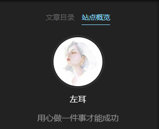

## 侧边栏显示数量

```
# Posts / Categories / Tags in sidebar.
site_state: true # 在侧边栏中显示帖子/类别/标签的类别和数量
```

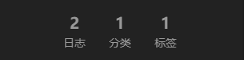

## 侧边栏社交链接

和菜单配置类似,只是url必须是完整的,可以访问的

```
# Social Links
# Usage: `Key: permalink || icon`
# Key is the link label showing to end users.
# Value before `||` delimiter is the target permalink, value after `||` delimiter is the name of Font Awesome icon.
social: # 侧边栏社交链接
  GitHub: https://github.com/yourname || fab fa-github
  E-Mail: mailto:yourname@gmail.com || fa fa-envelope
  # Weibo: https://weibo.com/yourname || fab fa-weibo
  # Google: https://plus.google.com/yourname || fab fa-google
  # Twitter: https://twitter.com/yourname || fab fa-twitter
  # FB Page: https://www.facebook.com/yourname || fab fa-facebook
  # StackOverflow: https://stackoverflow.com/yourname || fab fa-stack-overflow
  # YouTube: https://youtube.com/yourname || fab fa-youtube
  # Instagram: https://instagram.com/yourname || fab fa-instagram
  # Skype: skype:yourname?call|chat || fab fa-skype

social_icons:
  enable: true # 在侧边栏中显示社交链接的图标
  icons_only: true # true,只显示图标,false,图标和描述都有
  transition: true # 显示有过渡效果的图标

```


> TODO：集成公众号联系我！

## 侧边栏放置别人的网站链接

```
# Blog rolls 侧边栏防止的网站链接,可以是友链，或者是好玩的网站，随你高兴
links_settings:
  icon: fa fa-globe
  title: 网站 # 
  # Available values: block | inline
  layout: inline # 默认block按块展示,inline可以按行展示

links: # 具体放置的网站的名字和连接
  Title1: https://example1.com/
  Title2: https://example2.com/

```

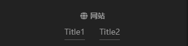

## 侧边栏目录设置

```
# Table of Contents in the Sidebar
# Front-matter variable (nonsupport wrap expand_all).
toc:
  enable: true # 文章目录会显示在侧边栏
  # Automatically add list number to toc.
  number: true # 将列表编号添加到 TOC
  # If true, all words will placed on next lines if header width longer then sidebar width.
  wrap: false # true: 标题宽度大于侧边栏宽度换行.false:不换行
  # If true, all level of TOC in a post will be displayed, rather than the activated part of it.
  expand_all: false # 是否展开所有菜单层级 
  # Maximum heading depth of generated toc.
  max_depth: 6 # 默认情况下，生成的 toc 的最大深度
```

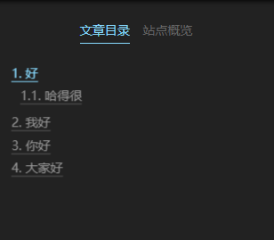

## 页脚设置站点时间

```
footer:
  # Specify the year when the site was setup. If not defined, current year will be used.
  since: 2022 # 设置了就不要动了,设置网站的开始时间

```


## 页脚设置网站图标

```
footer: 

  # Icon between year and copyright info.
  icon: # 时间和版权之间的图标设置
    # Icon name in Font Awesome. See: https://fontawesome.com/icons
    name: fa fa-heart # 图标 心
    # If you want to animate the icon, set it to true.
    animated: false # true开启动画
    # Change the color of icon, using Hex Code.
    color: "#ff0000" # 图标的颜色 
```


## 页脚设置版权信息

```
footer: 

  # If not defined, `author` from Hexo `_config.yml` will be used. 
  copyright: '左耳' # 定义的是页脚中的作者姓名,不设置默认取hexo配置文件`_config.yml`中的author 
```


## 页脚设置框架主题信息

```
footer:  
  # Powered by Hexo & NexT
  powered: false # 是否显示使用的框架和主题
```


## 页脚设置备案信息

- https://beian.miit.gov.cn/
- https://www.beian.gov.cn

```
  # Beian ICP and gongan information for Chinese users. See: https://beian.miit.gov.cn, http://www.beian.gov.cn
  beian: # 备案的信息
    enable: false # 展示备案信息
    icp: 闽ICP备2022007849号-1
    # The digit in the num of gongan beian.
    gongan_id: 
    # The full num of gongan beian.
    gongan_num: 
    # The icon for gongan beian. See: http://www.beian.gov.cn/portal/download
    gongan_icon_url: /uploads/beian.png

```


## 帖子摘要

显示文章摘要和**阅读更多**按钮

Hexo 推荐在你的文章中使用`<!-- more -->`手动控制文章的摘要

```
# true:如果文字front-matter存在description,则使用,不存在description，则使用全文当成摘要
# false: 就算文章设置了description,也不生效。依旧使用全文当成摘要
# Automatically excerpt description in homepage as preamble text.
excerpt_description: true

# Read more button
# If true, the read more button will be displayed in excerpt section.
read_more_btn: true # true,展示阅读更多按钮
```

> description显示在标题的下面,不加粗的字体样式，和正文不太一样


可以在post.md中设置

```
---
title: {{ title }}
date: {{ date }}
tags:
categories: 
---

请在此处补充摘要

<!-- more-->
```

这样每次都填充摘要区域就好了

## 帖子创建和修改日期及分类

```
# Post meta display settings 创建日期、帖子更新日期和帖子类别显示
post_meta:
  item_text: true # 显示文章的这些元信息
  created_at: true # 显示创建时间
  updated_at:
    enable: true # 显示帖子更新日期
    another_day: true # 创建时间和编辑时间不同天显示编辑，同一天只显示创建时间
  categories: true # 显示帖子类

```


## 帖子字数统计

```
$ npm install hexo-word-counter 
$ hexo clean
```

hexo的配置文件`_config.yml`

```
symbols_count_time: # 字数统计的默认行为,可以设置false来修改它
  symbols: true # 帖子显示字数统计
  time: true # 显示帖子的预计阅读时间
  total_symbols: true # 页脚部分显示所有帖子字数
  total_time: true # 页脚部分显示所有帖子的预计阅读时间
  awl: 4 # 平均字长
  wpm: 275 # 每分钟的平均字数

```

next的配置文件`_config.next.yml`

```
# Post wordcount display settings
# Dependencies: https://github.com/next-theme/hexo-word-counter
symbols_count_time:
  separated_meta: true # true:单独的行中显示字数和预计阅读时间,false在一行显示
  item_text_total: true # false: 不会在页脚部分显示字数和预计阅读时间的文字描述,只显示图标。true,显示文字描述和图标

```


## 帖子标签图标

```
# Use icon instead of the symbol # to indicate the tag at the bottom of the post
tag_icon: true # false: 帖子底部的标签在左侧有一个符号#。设置为true,用图标代替
```


## 帖子赞赏

```
# Donate (Sponsor) settings
# Front-matter variable (nonsupport animation).
reward_settings: # 赞赏功能
  # If true, a donate button will be displayed in every article by default.
  enable: true
  animation: false
  #comment: Buy me a coffee # 赞赏文字描述

reward: 
  wechatpay: /images/wechatpay.png
  alipay: /images/alipay.png
  #paypal: /images/paypal.png
  #bitcoin: /images/bitcoin.png
  #monero: /images/monero.png

```


## 帖子设置其他发布渠道

```
# Subscribe through Telegram Channel, Twitter, etc.
# Usage: `Key: permalink || icon` (Font Awesome)
follow_me: # 其它发布渠道设置
  #Zhihu: https://www.zhihu.com/people/chen-chen-71-52 || fab fa-zhihu
  #Twitter: https://twitter.com/username || fab fa-twitter
  #Telegram: https://t.me/channel_name || fab fa-telegram
  #WeChat: /images/wechat_channel.jpg || fab fa-weixin
  #RSS: /atom.xml || fa fa-rss
```

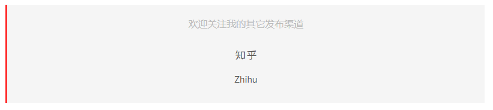

## ~~帖子相关热门帖子~~

- https://github.com/sergeyzwezdin/hexo-related-posts（hexo6不兼容,等作者修复依赖）

```
$ npm install hexo-related-posts 
$ hexo clean
```


- https://github.com/tea3/hexo-related-popular-posts （无效）

```
npm install hexo-related-popular-posts --save
```

> 扩展：npm 5.0.0 之前，有 --save 参数才会把模块写入到 packages.json。npm高版本已经是内置参数，不用额外写了。：：：

配置：

```
# Related popular posts
# Dependencies: https://github.com/sergeyzwezdin/hexo-related-posts
related_posts:
  enable: false # true：开启相关帖子
  title: '相关文章' # Custom header, leave empty to use the default one 默认使用"相关帖子",可以自定义标题
  display_in_home: false # true: 首页显示相关帖子
```


## 帖子在线编辑

支持帖子的编辑功能。通过启用此功能，用户可以在 GitHub 上快速浏览和修改博客的源代码

```
# Post edit
# Easily browse and edit blog source code online.
post_edit:
  enable: false
  url: https://github.com/user-name/repo-name/tree/branch-name/subdirectory-name/ # Link for view source
  #url: https://github.com/user-name/repo-name/edit/branch-name/subdirectory-name/ # Link for fork & edit

```


## 帖子上一篇下一篇

```
# Show previous post and next post in post footer if exists
# Available values: left | right | false
post_navigation: left
```

## 自定义页面支持

允许用户在菜单中添加自定义页面

用`hexo new page custom-name`创建新`custom-name`页面,生成`custom-name/index.md`

- 设置front-matter:https://hexo.io/docs/front-matter

然后在菜单中配置即可,比如about页面

```
menu:
  home: / || fa fa-home
  archives: /archives/ || fa fa-archive
  about: /about/ || fa fa-user
```


## 归档页面作为主页

hexo的配置文件`_config.yml`设置为：

```
archive_dir: /

index_generator:
  path: archives
  per_page: 10
  order_by: -date

```

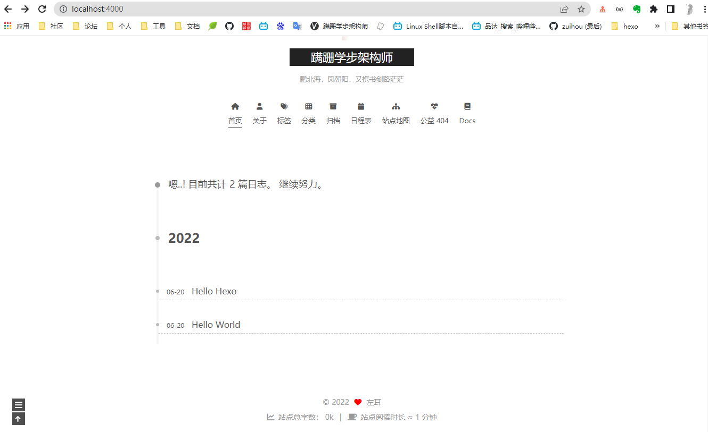

## 添加«标签»页面

```
$ cd hexo-site
$ hexo new page tags
```

配置front-matter

```
---
title: 标签
date: 2022-06-21 05:11:11
type: tags
comments: false
---
```

编辑菜单

```
menu:
  home: / || fa fa-home
  archives: /archives/ || fa fa-archive
  tags: /tags/ || fa fa-tags
```

设置hexo配置文件

```
tag_generator:
  enable_index_page: false
```

标签页面自带标签云效果，可以修改配置

```
# TagCloud settings for tags page.标签云页面
tagcloud: 
  min: 12 # Minimum font size in px 最小字体
  max: 30 # Maximum font size in px 最大字体
  amount: 200 # Total amount of tags 标签数量
  orderby: name # Order of tags 排序
  order: 1 # Sort order

```


## 添加«类别»页面


```
$ cd hexo-site
$ hexo new page categories
```

配置front-matter

```
---
title: 分类
date: 2022-06-21 05:16:02
type: categories
comments: false
---
```

编辑菜单

```
menu: # 菜单设置
  categories: /categories/ || fa fa-th
```


## **添加«关于我»页面**

`about` 页是用来展示**关于我和我的博客**信息的页面，如果在你的博客 `source` 目录下还没有 `about/index.md` 文件，那么你就需要新建一个，命令如下：

```bash
$ hexo new page "about"
```

编辑你刚刚新建的页面文件 `/source/about/index.md`，至少需要以下内容：

```text
---
title: about
date: 2018-09-30 17:25:30
type: "about"
layout: "about"
---
```

## 添加谷歌日历页面

- https://support.google.com/calendar/answer/37083

首先确保添加设置为公开的日历

查看Google日历ID：https://docs.simplecalendar.io/find-google-calendar-id/

创建项目,添加calendar API,获取开发者API KEY：https://console.cloud.google.com/flows/enableapi?apiid=calendar&pli=1


```
$ cd hexo-site
$ hexo new page schedule
```

配置front-matter

```
---
title: 日程表
date: 2022-06-21 05:16:02
type: schedule
comments: false
---
```

编辑菜单

```
menu: # 菜单设置
   schedule: /schedule/ || fa fa-calendar
```

日程表配置

```
# Google Calendar
# Share your recent schedule to others via calendar page.
calendar:
  calendar_id: <required> # Your Google account E-Mail
  api_key: <required>
  orderBy: startTime
  showLocation: false
  offsetMax: 72 # Time Range
  offsetMin: 4 # Time Range
  showDeleted: false
  singleEvents: true
  maxResults: 250
```

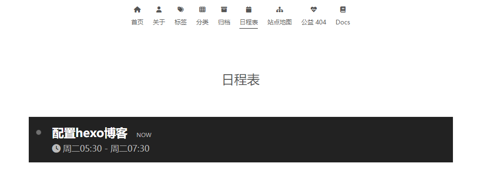

## 自定义404页面

```
$ cd hexo-site
$ hexo new page 404
```

确保hexo的配置文件`_config.yml`中`relative_link`为false。

用户是否可以重定向到 404 页面取决于网站托管服务或 Web 服务器的设置，而不是 Hexo。

例如，如果使用 Nginx 作为服务器，还需要在`nginx.conf`文件中配置 404 页面。

- 公益404页面

编辑`404/index.md`

```
---
title: '404'
date: 2022-06-21 05:43:11
comments: false
--- 
<script src="//qzonestyle.gtimg.cn/qzone/hybrid/app/404/search_children.js"
        charset="utf-8" homePageUrl="/" homePageName="Back to home">
</script>
```

菜单配置

```
menu:
	commonweal: /404/ || fa fa-heartbeat
```


## 字体和插件预连接

为字体和插件预连接 CDN。

```
# Preconnect CDN for fonts and plugins.
# For more information: https://www.w3.org/TR/resource-hints/#preconnect
preconnect: false
```


## 文本对齐

自定义文章/页面中的文本对齐方式

| 可选项         | 作用                                                         |
| -------------- | ------------------------------------------------------------ |
| `start`        | 就像`left`方向是从左到右和`right`方向是从右到左一样。        |
| `end`          | 就像`right`方向是从左到右和`left`方向是从右到左一样。        |
| `left`         | 内联内容与行框的左边缘对齐。                                 |
| `right`        | 内联内容与行框的右边缘对齐。                                 |
| `center`       | 内联内容在行框中居中。                                       |
| `justify`      | 内联内容是合理的。文本的间距应使其左右边缘与行框的左右边缘对齐，最后一行除外。 |
| `justify-all`  | 与 相同`justify`，但也强制最后一行对齐。                     |
| `match-parent` | 与 类似`inherit`，但值`start`和`end`是根据父级的方向计算的，并替换为适当的`left`or`right`值。 |

## 移动设备适配

```
# Reduce padding / margin indents on devices with narrow width.
mobile_layout_economy: false # true：减少宽度较窄的设备上的填充/边距缩进
```


## 顶部线的颜色

```
# Browser header panel color.
theme_color: # 标题面板颜色
  light: "#222" # 红色：#f00
  dark: "#222"
```

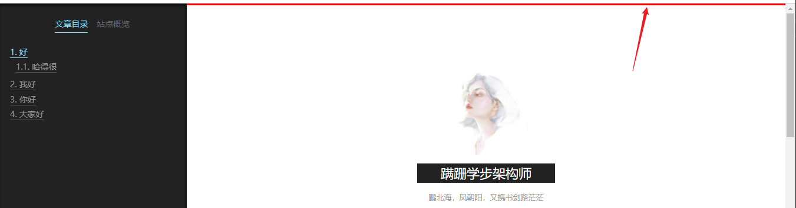

## 正文滚动条

没看出效果

```
# Override browsers' default behavior.
body_scrollbar: # 滚动条设置
  # Place the scrollbar over the content. 将滚动条放在内容上。
  overlay: false
  # Present the scrollbar even if the content is not overflowing. 即使内容没有溢出，也呈现滚动条。
  stable: false
```


## 代码块样式

- 高亮效果配置预览：https://theme-next.js.org/highlight/

```
codeblock:
  # Code Highlight theme
  # All available themes: https://theme-next.js.org/highlight/
  theme: # 亮模式和暗模式下的高亮配色
    light: default
    dark: stackoverflow-dark
  prism:
    light: prism
    dark: prism-dark
  # Add copy button on codeblock
  copy_button: # 复制按钮
    enable: true
    # Available values: default | flat | mac
    style: mac
```

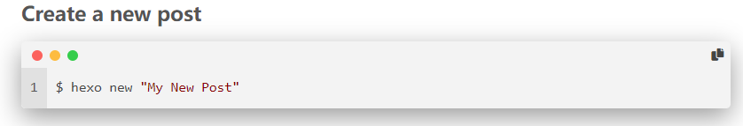

## 回到顶部

```
back2top: # 返回顶部按钮
  enable: true
  # Back to top in sidebar.
  sidebar: true # 在侧边栏中返回顶部
  # Scroll percent label in b2t button.
  scrollpercent: true # 按钮中滚动百分比标签

```

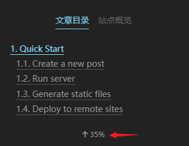

## 阅读进度条

```
# Reading progress bar
reading_progress: # 阅读进度条
  enable: true
  # Available values: left | right
  start_at: left # 开始方式
  # Available values: top | bottom
  position: top # 位置
  reversed: false # 反转
  color: "#37c6c0" # 颜色
  height: 3px # 高度

```

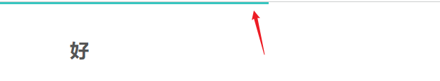

## 书签功能

```
# Bookmark Support
bookmark: # 阅读书签进度
  enable: false
  # Customize the color of the bookmark.
  color: "#222" # 书签颜色
  # If auto, save the reading progress when closing the page or clicking the bookmark-icon.
  # If manual, only save it by clicking the bookmark-icon.
  save: auto # auto: 自动保存进度,manual,用户点击书签图标手动保存进度

```

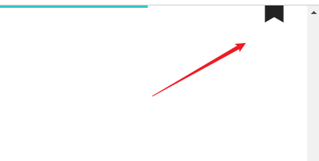

## GitHub 横幅

在右上角提供`Follow me on GitHub`横幅

```
# `Follow me on GitHub` banner in the top-right corner.
github_banner:
  enable: true
  permalink: https://github.com/Github用户名
  title: Follow me on GitHub

```

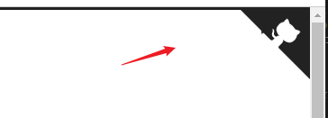

## 字体定制

你可以设置

- 全局字体：整个站点使用的字体。
- 标题字体：网站标题使用的字体。
- 标题字体：文章标题使用的字体（h1、h2、h3、h4、h5、h6）。
- 文章字体：文章使用的字体。
- 代码字体：文章中代码块使用的字体。

如果字体用不了，会有默认的字体

- 非代码字体：`"PingFang SC", "Microsoft YaHei", sans-serif`
- 代码字体：`consolas, Menlo, "PingFang SC", "Microsoft YaHei", monospace`

```
# ---------------------------------------------------------------
# Font Settings
# ---------------------------------------------------------------
# Find fonts on Google Fonts (https://fonts.google.com)
# All fonts set here will have the following styles:
#   light | light italic | normal | normal italic | bold | bold italic
# Be aware that setting too much fonts will cause site running slowly
# ---------------------------------------------------------------
# Web Safe fonts are recommended for `global` (and `title`):
# Arial | Tahoma | Helvetica | Times New Roman | Courier New | Verdana | Georgia | Palatino | Garamond | Comic Sans MS | Trebuchet MS
# ---------------------------------------------------------------
font: # 字体设置
  enable: true

  # Uri of fonts host, e.g. https://fonts.googleapis.com (Default).
  host: //fonts.loli.net

  # Font options:
  # `external: true` will load this font family from `host` above. 将从上面的`host` 加载这个字体系列
  # `family: Times New Roman`. Without any quotes.
  # `size: x.x`. Use `em` as unit. Default: 1 (16px)

  # Global font settings used for all elements inside <body>. 全局字体设置
  global:
    external: true
    family: Itim,Microsoft YaHei,sans-serif
    size: 

  # Font settings for site title (.site-title). 网站标题
  title: 
    external: true
    family: 
    size: 

  # Font settings for headlines (<h1> to <h6>). 文章标题 
  headings:
    external: true
    family:
    size:

  # Font settings for posts (.post-body).文章字体
  posts:
    external: true
    family: 

  # Font settings for <code> and code blocks. 代码字体
  codes:
    external: true
    family: 
```

- 样式中定制字体

在`source/_data/variables.styl`添加变量

```
// Title Font, set it to font family you want.
$font-family-headings = Georgia, sans

// Set it to font family you want.
$font-family-base = "Microsoft YaHei", Verdana, sans-serif

// Code Font.
$code-font-family = "Input Mono", "PT Mono", Consolas, Monaco, Menlo, monospace

// Font size of articles.
$font-size-base = 16px

// Font size of table and code.
$table-font-size = 13px

```

字体库替换

- https://u.sb/css-cdn/


## SEO搜索引擎优化

```
# If true, site-subtitle will be added to index page.
# Remember to set up your site-subtitle in Hexo `_config.yml` (e.g. subtitle: Subtitle)
index_with_subtitle: false # true,将子标题也加入索引,hexo配置文件记得添加subtitle
```

### Google 网站管理员工具

设置 [Google 网站站长工具](https://www.google.com/webmasters/tools)的验证字符串 用于提交站点地图。

登录到 Google 网站站长工具，然后转到验证方法并选择 `HTML Tag`，您将获得一些代码：

```markdown
<meta name="google-site-verification" content="XXXXXXXXXXXXXXXXXXXXXXX">
```

复制 `XXXXXXXXXXXXXXXXXXXXXXX` 的价值 `content` 的关键。
编辑主题配置文件并添加或更改 `google_site_verification` 部分：

```yaml
next/_config.ymlgoogle_site_verification: XXXXXXXXXXXXXXXXXXXXXXX
```

### Bing 网站管理员工具

设置 [Bing 网站管理员工具](https://www.bing.com/webmaster/)的验证字符串 用于提交站点地图。

登录到 Bing 网站管理员工具，然后转到验证方法并选择 `HTML Tag`，您将获得一些代码：

```markdown
<meta name="msvalidate.01" content="XXXXXXXXXXXXXXXXXXXXXXX">
```

复制 `XXXXXXXXXXXXXXXXXXXXXXX` 的价值 `content` 的关键。
编辑主题配置文件并添加或更改 `bing_site_verification` 部分：

```yaml
next/_config.ymlbing_site_verification: XXXXXXXXXXXXXXXXXXXXXXX
```

### Yandex 网站管理员工具

设置 [Yandex 网站管理员工具](https://webmaster.yandex.ru/)的验证字符串 用于提交站点地图。

登录到 Yandex 网站管理员工具，然后转到验证方法并选择 `Meta Tag`，您将获得一些代码：

```markdown
<meta name="yandex-verification" content="XXXXXXXXXXXXXXXXXXXXXXX">
```

复制 `XXXXXXXXXXXXXXXXXXXXXXX` 的价值 `content` 的关键。
编辑主题配置文件并添加或更改 `yandex_site_verification` 部分：

```yaml
next/_config.ymlyandex_site_verification: XXXXXXXXXXXXXXXXXXXXXXX
```

### 百度网站管理员工具

设置[百度网站管理员工具](https://ziyuan.baidu.com/site/)的验证字符串 用于提交站点地图。

登录百度网站管理员工具，转到验证方法并选择 `HTML Tag`，您将获得一些代码：

```markdown
<meta name="baidu-site-verification" content="XXXXXXXXXXXXXXXXXXXXXXX">
```

复制 `XXXXXXXXXXXXXXXXXXXXXXX` 的价值 `content` 的关键。
编辑主题配置文件并添加或更改 `baidu_site_verification` 部分：

```yaml
next/_config.ymlbaidu_site_verification: XXXXXXXXXXXXXXXXXXXXXXX
```

NexT 还支持百度推送，以便博客将 URL 自动推送到百度，这对于 SEO 非常有用。您可以通过将值设置 `baidu_push` 为 `true`in 来启用它主题配置文件。

```yaml
next/_config.ymlbaidu_push: true
```


## 百度sitemap

sitemap: [hexo-generator-sitemap](https://github.com/hexojs/hexo-generator-sitemap)

```
npm install hexo-generator-baidu-sitemap --save
```

生成静态文件

```
hexo g
```

此时在public目录下可见`baidusitemap.xml`，即已完成站点地图的生成。

用百度账号登录[百度搜索资源平台](https://ziyuan.baidu.com/)

点击普通收录，输入你博客的地址，将获取的验证code配置到配置文件,然后在平台验证即可

点击左侧边栏中的普通收录，资源提交选择sitemap选项卡，在数据文件地址中填入`https://username.github.io/baidusitemap.xml`，与前面生成的站点地图文件名称相同。

等待一段时间百度即会显示抓取成功！


## i18N多语言切换

- https://theme-next.js.org/docs/theme-settings/internationalization.html


# 第三方服务

## pjax

```
# Easily enable fast Ajax navigation on your website. 在您的网站上轻松启用快速 Ajax 导航。
# For more information: https://github.com/next-theme/pjax
pjax: false
```

## 数学公式

- https://theme-next.js.org/docs/third-party-services/math-equations.html

```
# Math Formulas Render Support
# Warning: Please install / uninstall the relevant renderer according to the documentation.
# See: https://theme-next.js.org/docs/third-party-services/math-equations
# Server-side plugin: https://github.com/next-theme/hexo-filter-mathjax
math: # 数学公式
  # Default (false) will load mathjax / katex script on demand.
  # That is it only render those page which has `mathjax: true` in front-matter.
  # If you set it to true, it will load mathjax / katex script EVERY PAGE.
  every_page: false # false: 如果front-matter设置了mathjax: true ,才会处理。true,设不设置都处理
 
  # 渲染引擎
  mathjax:
    enable: false
    # Available values: none | ams | all
    tags: none
  # 更快的渲染引擎,但是功能比mathjax少
  katex:
    enable: false
    # See: https://github.com/KaTeX/KaTeX/tree/master/contrib/copy-tex
    copy_tex: false
```


## 评论系统

- [Overview](https://theme-next.js.org/docs/third-party-services/comments.html#Overview)
- ~~[Disqus](https://theme-next.js.org/docs/third-party-services/comments.html#Disqus)~~：好用好配置，但国内访问不了（弃用原因）

- [DisqusJS](https://theme-next.js.org/docs/third-party-services/comments.html#DisqusJS)
- [Changyan (China)](https://theme-next.js.org/docs/third-party-services/comments.html#Changyan)
- [LiveRe](https://theme-next.js.org/docs/third-party-services/comments.html#LiveRe)
- [Gitalk](https://theme-next.js.org/docs/third-party-services/comments.html#Gitalk)
- [Utterances](https://theme-next.js.org/docs/third-party-services/comments.html#Utterances)
- [Isso](https://theme-next.js.org/docs/third-party-services/comments.html#Isso)
- ~~Valine~~: 好用好配置，但存在 [# 安全性问题](https://link.zhihu.com/?target=https%3A//segmentfault.com/a/1190000038175985),next 8已移除默认设置
- [waline](https://waline.js.org/)

### **vercel+leancloud部署waline**

1.**配置LeanCloud**:https://console.leancloud.cn/apps/1ilCM0QjYHpNVfi1RUMsI4-gzGzoHsz/settings/domains

创建完成后进入控制台的「设置」→「应用 Keys」界面。将 AppID、AppKey、MasterKey 这三个值记下来

2.配置Vercel：https://vercel.com/dashboard

首先是注册 Vercel 账户，用 GitHub 账户注册即可。然后使用开发者提供的[快速部署链接](https://vercel.com/import/project?template=https://github.com/lizheming/waline/tree/master/example)，直接将开发者的 Waline 仓库 Clone 到 Vercel 新创建的项目中。项目名称随意填写一个即可，我写的是 `blog-comment-waline`

```
blog-comment-waline-bgxxxxv3-Github用户名.vercel.app

https://blog-waline-comments-6xp0edv-Github用户名.vercel.app/
```

配置：https://github.com/walinejs/waline/tree/main/packages/hexo-next

然后在`_config.yml` 或`_config.next.yml` 文件中添加如下配置

```
# Waline
# For more information: https://waline.js.org, https://github.com/walinejs/waline
waline:
  enable: false
  serverURL: https://waline.vercel.app # Waline server address url # vercel部署的服务地址
  placeholder: Just go go # Comment box placeholder
  avatar: mm # Gravatar style
  meta: [nick, mail, link] # Custom comment header
  pageSize: 10 # Pagination size
  lang: # Language, available values: en, zh-cn
  # Warning: Do not enable both `waline.visitor` and `leancloud_visitors`.
  visitor: false # Article reading statistic
  comment_count: true # If false, comment count will only be displayed in post page, not in home page
  requiredFields: [] # Set required fields: [nick] | [nick, mail]
  libUrl: # Set custom library cdn url
```

> 根据官方文档,还支持一键部署到腾讯云

### docker部署

```
docker run -d \
  -e LEAN_ID=1xxxxxxxsI4-gzGzoHsz \
  -e LEAN_KEY=wxxxxxxx6OE1gs4 \
  -e LEAN_SERVER=https://comment.域名(xx.com) \
  -p 8360:8360 \
  lizheming/waline
```


## 分析

- [Google Analytics](https://theme-next.js.org/docs/third-party-services/statistics-and-analytics.html#Google-Analytics)

1. 创建一个帐户并登录[Google Analytics](https://analytics.google.com/). 在管理-数据流-数据收集下面

   ```
   google_analytics:
     tracking_id: # <app_id>
     # By default, NexT will load an external gtag.js script on your site.
     # If you only need the pageview feature, set the following option to true to get a better performance.
     only_pageview: false
   ```

- [Baidu Analytics (China)](https://theme-next.js.org/docs/third-party-services/statistics-and-analytics.html#Baidu-Analytics-China)

登录[百度分析](https://tongji.baidu.com/)并定位到站点代码获取页面。

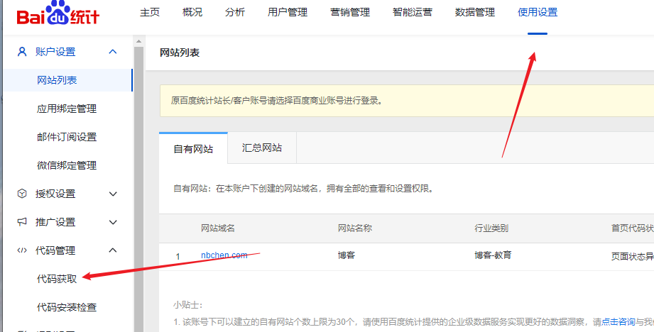

复制后面的脚本ID `hm.js?`，如下图：

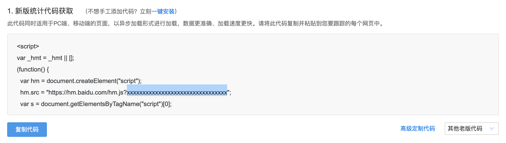

```
# Baidu Analytics
# See: https://tongji.baidu.com
baidu_analytics: xxxxxxxxx # <app_id>
```


- [Growingio Analytics](https://theme-next.js.org/docs/third-party-services/statistics-and-analytics.html#Growingio-Analytics)
- [Cloudflare Web Analytics](https://theme-next.js.org/docs/third-party-services/statistics-and-analytics.html#Cloudflare-Web-Analytics)
- [Microsoft Clarity Analytics](https://theme-next.js.org/docs/third-party-services/statistics-and-analytics.html#Microsoft-Clarity-Analytics)

## 统计

- [LeanCloud (China)](https://theme-next.js.org/docs/third-party-services/statistics-and-analytics.html#LeanCloud-China)
- [Firebase](https://theme-next.js.org/docs/third-party-services/statistics-and-analytics.html#Firebase)
- [Busuanzi Counting](https://theme-next.js.org/docs/third-party-services/statistics-and-analytics.html#Busuanzi-Counting-China)

不蒜子统计,修改主题配置文件

```
# Show Views / Visitors of the website / page with busuanzi.
# For more information: http://ibruce.info/2015/04/04/busuanzi/
busuanzi_count:
  enable: true
  total_visitors: true
  total_visitors_icon: fa fa-user
  total_views: true
  total_views_icon: fa fa-eye
  post_views: true
  post_views_icon: far fa-eye

```


## 文章小功能

- [Widgetpack Rating](https://theme-next.js.org/docs/third-party-services/post-widgets.html#Widgetpack-Rating)
- [AddThis](https://theme-next.js.org/docs/third-party-services/post-widgets.html#AddThis)

## 搜索服务

- [Algolia Search](https://theme-next.js.org/docs/third-party-services/search-services.html#Algolia-Search)
- [Local Search](https://theme-next.js.org/docs/third-party-services/search-services.html#Local-Search)

本地搜索,不需要外部服务,直接用就行了

```
$ npm install hexo-generator-searchdb
```


hexo config配置

```
search:
  path: search.xml
  field: post
  content: true
  format: html
```

next config 配置

```
# Local Search
# Dependencies: https://github.com/next-theme/hexo-generator-searchdb
local_search:
  enable: true
  # If auto, trigger search by changing input. 如果是自动，则通过更改输入触发搜索。
  # If manual, trigger search by pressing enter key or search button.如果是手动，则通过按回车键或搜索按钮触发搜索。
  trigger: auto
  # Show top n results per article, show all results by setting to -1
  top_n_per_article: 1 # 显示每篇文章的前 n 个结果
  # Unescape html strings to the readable one. true: 将 html 字符串转义为可读字符串
  unescape: false
  # Preload the search data when the page loads. true: 在页面加载时预加载搜索数据。
  preload: false
```

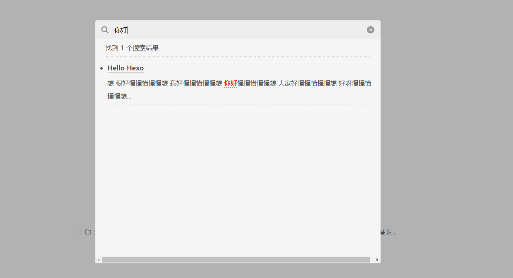

## 聊天服务

- [Chatra](https://theme-next.js.org/docs/third-party-services/chat-services.html#Chatra)
- [Tidio](https://theme-next.js.org/docs/third-party-services/chat-services.html#Tidio)
- [Gitter](https://theme-next.js.org/docs/third-party-services/chat-services.html#Gitter)

## 外部库

- [PJAX](https://theme-next.js.org/docs/third-party-services/external-libraries.html#PJAX)
- [Fancybox](https://theme-next.js.org/docs/third-party-services/external-libraries.html#Fancybox)
- [MediumZoom](https://theme-next.js.org/docs/third-party-services/external-libraries.html#Medium-Zoom)
- [Lazyload](https://theme-next.js.org/docs/third-party-services/external-libraries.html#Lazyload)
- [Pangu Autospace](https://theme-next.js.org/docs/third-party-services/external-libraries.html#Pangu-Autospace)
- [Quicklink](https://theme-next.js.org/docs/third-party-services/external-libraries.html#Quicklink)
- [Motion](https://theme-next.js.org/docs/third-party-services/external-libraries.html#Animation-Effect)
- [Progress bar](https://theme-next.js.org/docs/third-party-services/external-libraries.html#Progress-Bar)
- [Canvas Ribbon](https://theme-next.js.org/docs/third-party-services/external-libraries.html#Canvas-Ribbon)


# Next内置语法 ★★

> 仅在next中使用

## 居中文字引用块

单行文字下使用,比如文章之后之后的总结

```
用法：
{ % centerquote % }东西
缩写：
代码优雅，核心简单
```

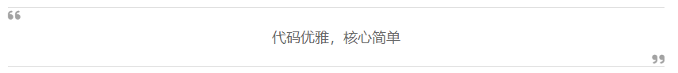

## 视频块

```
用法：

例子：
  => 网络的视频
			=> 本地的视频
```

## 按钮

```
用法：

缩写：

参数：
    url : URL 的绝对或相对路径。
    text ：按钮文字。如果未指定图标，则为必需。
    icon ：字体真棒图标名称。如果未指定文本，则为必需。
    [class]:可选参数。字体真棒类：fa-fw| fa-lg| fa-2x| fa-3x| fa-4x|fa-5x
    [title]:可选参数。鼠标悬停时的工具提示。
例子：


 



```

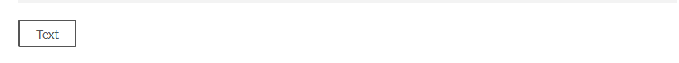

### 带图标的按钮

```






```


### 带图标文字的按钮

```



```

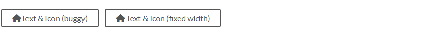

更大的图标：

```


```

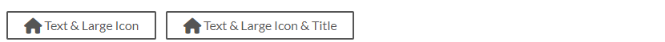

### 内联的图标

```
Lorem  ipsum dolor sit amet, consectetur adipiscing elit, sed do eiusmod tempor incididunt ut labore et dolore magna aliqua. Ut enim ad minim veniam, quis nostrud exercitation ullamco laboris nisi 
....
```

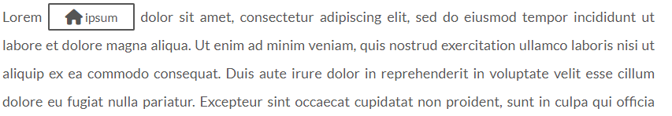


### 嵌套使用

在其他的语法中嵌套使用

```





[Link](#)

```

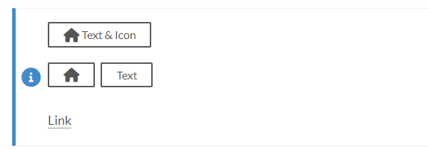

### 按钮组

```
<div class="text-center"><div></div>
<div></div>
<div></div></div>
```


### 按钮相对路径

```
<div class="text-center"> </div>

```


### 按钮绝对路径

```
<div class="text-center"></div>

```


## caniuse块

- https://caniuse.com/

搜索您想要的功能，然后单击搜索结果标题左侧的井号，您将获得此功能的唯一名称。

```
用法：

缩写：

例子：

参数：
[periods]:可选参数。选择要显示的浏览器版本。支持的值：past_1, past_2, past_3, past_4, past_5, current, future_3, future_2, future_1. 如果此值为空，current将使用默认值。
```

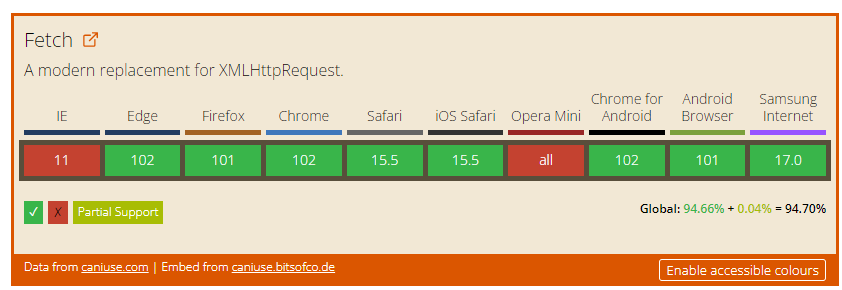

## 照片组

```
用法：


缩写：


参数：
[number]:可选参数。要添加到组图片中的图片总数。
[layout]:可选参数。布局的索引，可以根据下图得到。例如，如果要将第二个布局应用于 4 张图片，则使用{% endgrouppicture %
```

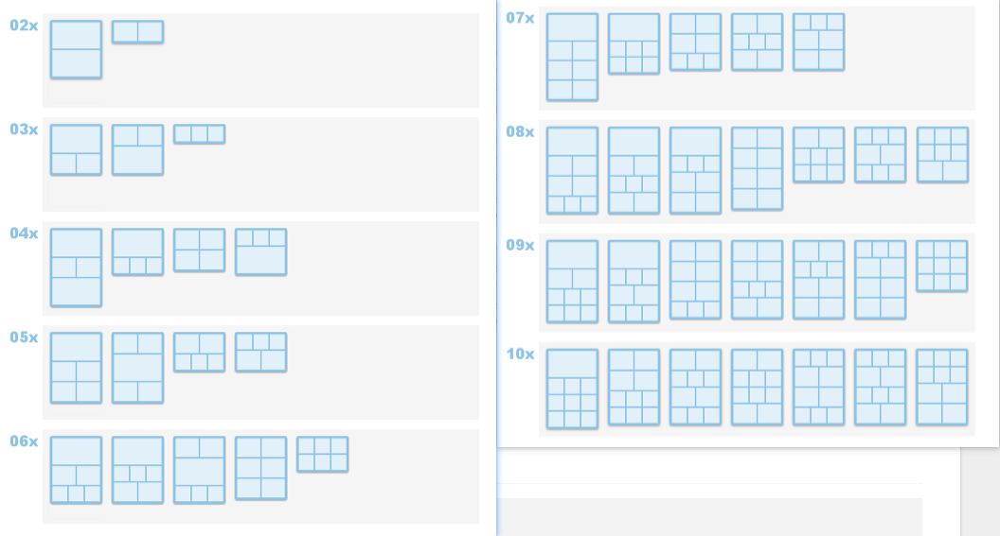

建议使用启用[Fancybox](https://theme-next.js.org/docs/third-party-services/external-libraries.html#Fancybox)的群组图片。

例子：

```




```


```




```


## 文字局部高亮

```
用法：

参数：
[class]:可选参数。支持的值：default| primary| success| info| warning| danger.
	如果不指定，将使用浏览器的默认样式，在不同的浏览器中可能会有所不同。
text :@text可以指定带或不带空格。例如 success @text是一样的success@text。
```

例子：

```
Lorem   amet, consectetur  sed  tempor incididunt ut labore et dolore magna aliqua。 

Ut enim *  * minim veniam, quis **  ** exercitation ullamco laboris nisi ut aliquip ex ea commodo consequat。

Duis aute irure dolor in reprehenderit in voluptate ~~  ~~ < mark > esse </ mark > cillum dolore eu fugiat nulla pariatur。Exceptioneur sint occaecat cupidatat non proident, sunt in culpa qui officia deserunt mollit anim id est labourum。
```

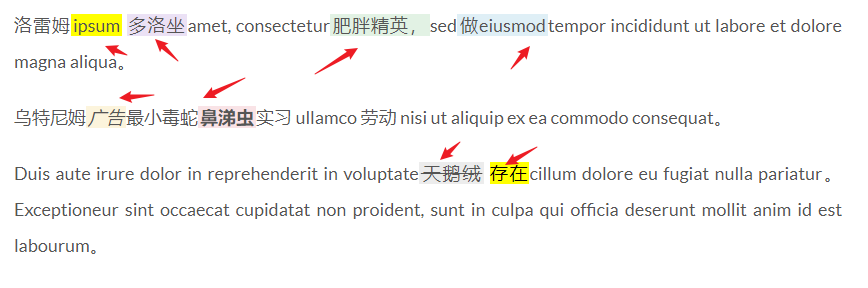

## 网站卡片

```
用法：




缩写：



参数：
[image] :可选参数。默认图片网址。
[delimiter]:可选参数。如果给出了可选的分隔符参数，则将其解释为每行中项目的分隔符。
[comment] :可选参数。如果给出了可选的注释参数，则将其解释为注释掉一行的符号。

例子：

Theme NexT | https://theme-next.js.org/ | Stay Simple. Stay NexT. | /images/apple-touch-icon-next.png
Theme NexT | https://theme-next.js.org/ | Stay Simple. Stay NexT. | /images/apple-touch-icon-next.png
Theme NexT | https://theme-next.js.org/ | Stay Simple. Stay NexT. | /images/apple-touch-icon-next.png
Theme NexT | https://theme-next.js.org/ | Stay Simple. Stay NexT. | /images/apple-touch-icon-next.png
% Theme NexT | https://theme-next.js.org/ | Stay Simple. Stay NexT. | /images/apple-touch-icon-next.png

```

会抖动,连接

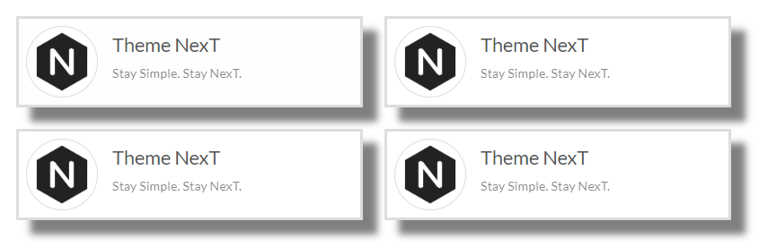

这样写也可以,效果一样

```

Theme NexT , https://theme-next.js.org/ , Stay Simple. Stay NexT. , /images/apple-touch-icon-next.png
Theme NexT , https://theme-next.js.org/ , Stay Simple. Stay NexT. , /images/apple-touch-icon-next.png
Theme NexT , https://theme-next.js.org/ , Stay Simple. Stay NexT. , /images/apple-touch-icon-next.png
% Theme NexT , https://theme-next.js.org/ , Stay Simple. Stay NexT. , /images/apple-touch-icon-next.png

```

## 图表

主题配置文件开启图表语法解析

```
# Mermaid tag
mermaid: # 开启图表语法解析
  enable: true
  # Available themes: default | dark | forest | neutral
  theme:
    light: default
    dark: dark

```

hexo的配置文件设置：

```
highlight:
  exclude_languages:
    - mermaid
```

用法

````
用法：


缩写：
```mermaid
type

```

````

- 资料：https://github.com/mermaid-js/mermaid
- 顺序图

```
例子：

A[Hard] -->|Text| B(Round)
B --> C{Decision}
C -->|One| D[Result 1]
C -->|Two| E[Result 2]

```

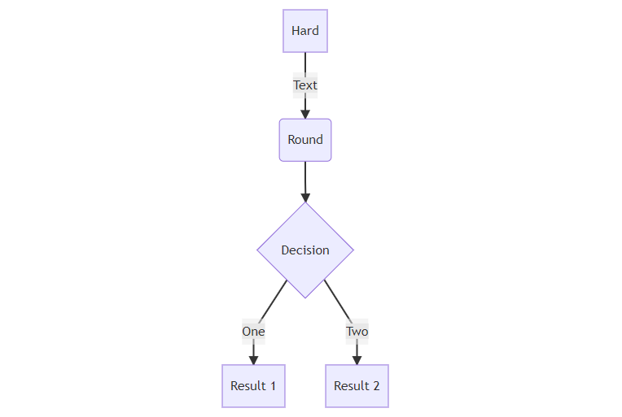

- 时序图

```

Alice->>John: Hello John, how are you?
loop Healthcheck
    John->>John: Fight against hypochondria
end
Note right of John: Rational thoughts!
John-->>Alice: Great!
John->>Bob: How about you?
Bob-->>John: Jolly good!

```

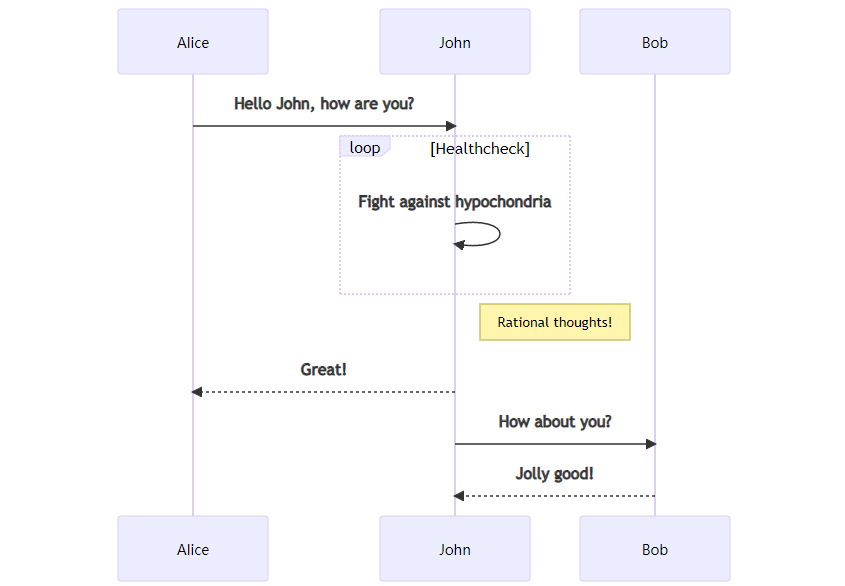

- 甘特图

```

dateFormat  YYYY-MM-DD
section Section
Completed :done,    des1, 2014-01-06,2014-01-08
Active        :active,  des2, 2014-01-07, 3d
Parallel 1   :         des3, after des1, 1d
Parallel 2   :         des4, after des1, 1d
Parallel 3   :         des5, after des3, 1d
Parallel 4   :         des6, after des4, 1d

```

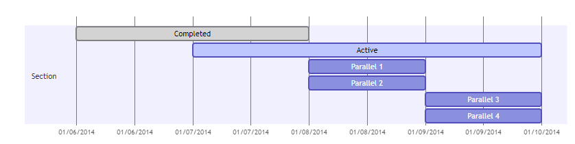

- 实体关系图

```

Class01 <|-- AveryLongClass : Cool
<<interface>> Class01
Class09 --> C2 : Where am i?
Class09 --* C3
Class09 --|> Class07
Class07 : equals()
Class07 : Object[] elementData
Class01 : size()
Class01 : int chimp
Class01 : int gorilla
class Class10 {
  <<service>>
  int id
  size()
}

```

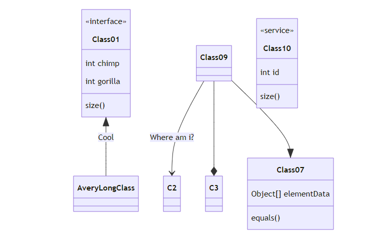

- 流程图

```

[*] --> Still
Still --> [*]
Still --> Moving
Moving --> Still
Moving --> Crash
Crash --> [*]

```

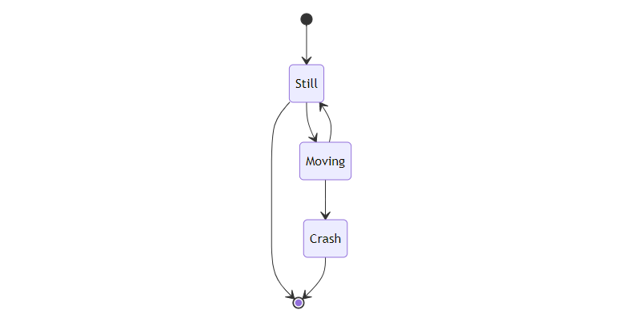

- 饼图

```

"Dogs" : 386
"Cats" : 85
"Rats" : 15

```

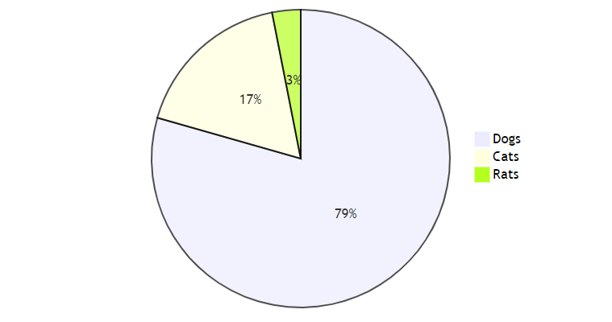

- 序列图

```

title My working day
section Go to work
  Make tea: 5: Me
  Go upstairs: 3: Me
  Do work: 1: Me, Cat
section Go home
  Go downstairs: 5: Me
  Sit down: 3: Me


```

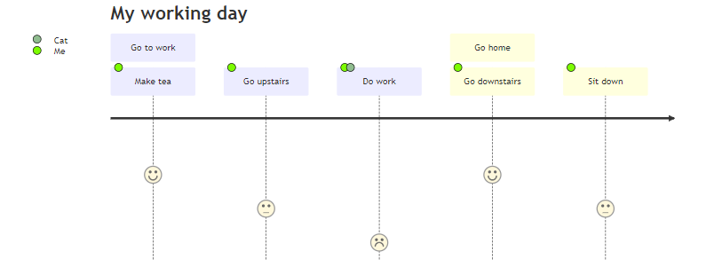

## 引用横幅块

主题配置：

```
# Note tag (bootstrap callout) 引用横幅块
note:
  # Note tag style values:
  #  - simple    bootstrap callout old alert style. Default.
  #  - modern    bootstrap callout new (v2-v3) alert style.
  #  - flat      flat callout style with background, like on Mozilla or StackOverflow.
  #  - disabled  disable all CSS styles import of note tag.
  style: simple
  icons: false
  # Offset lighter of background in % for modern and flat styles (modern: -12 | 12; flat: -18 | 6).
  # Offset also applied to label tag variables. This option can work with disabled note tag.
  light_bg_offset: 0

```

语法

```
用法：

Any content (support inline tags too).


参数：
[class] :可选参数。支持的值：默认 | 初级 | 成功| 信息 | 警告 | 危险。
[no-icon]:可选参数。禁用注释中的图标。
[summary]:可选参数。备注的可选摘要。
```

例子1

```

#### Header
(without define class style)

```

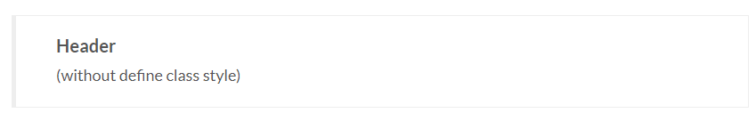

例子2

```

#### Default Header
Welcome to [Hexo!](https://hexo.io)

```

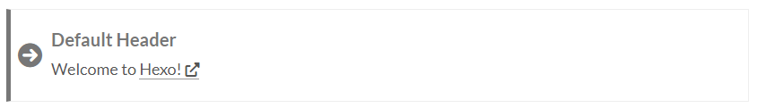

例子3

```

#### Primary Header
**Welcome** to [Hexo!](https://hexo.io)

```

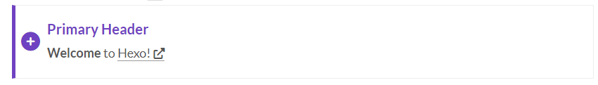

例子4

```

#### Info Header
**Welcome** to [Hexo!](https://hexo.io)

```

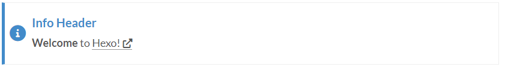

例子5

```

#### Success Header
**Welcome** to [Hexo!](https://hexo.io)

```

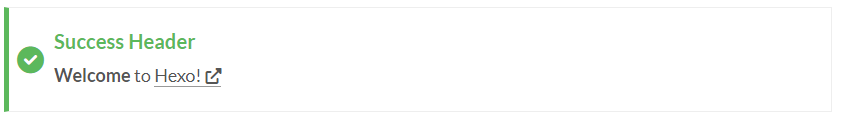

例子6 

```

#### Warning Header
**Welcome** to [Hexo!](https://hexo.io)

```

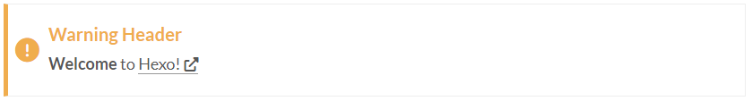

例子7

```

#### Danger Header
**Welcome** to [Hexo!](https://hexo.io)

```

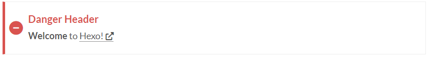

例子8

```

#### No icon note
Note **without** icon: `note info no-icon`

```

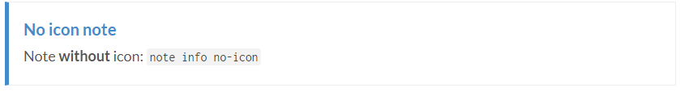

例子9

```

#### Details and summary
Note with summary: `note primary This is a summary`

```

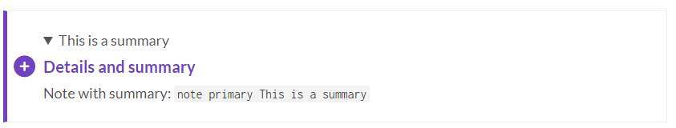

例子10 

```

#### Details and summary (No icon)
Note with summary: `note info no-icon This is a summary`

```

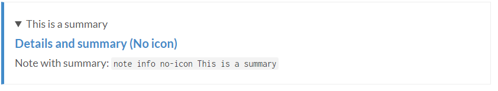

例子11

````

#### Codeblock in note

```
code block in note tag
code block in note tag
code block in note tag
```

````

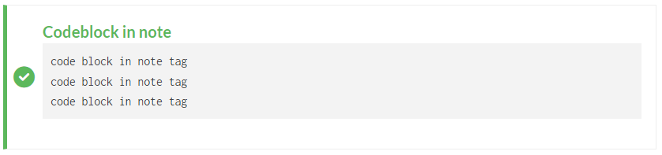

例子12

```

#### Lists in note
* ul
* ul
    * ul
    * ul
* ul

1. ol
2. ol
    1. ol
    2. ol
3. ol


```

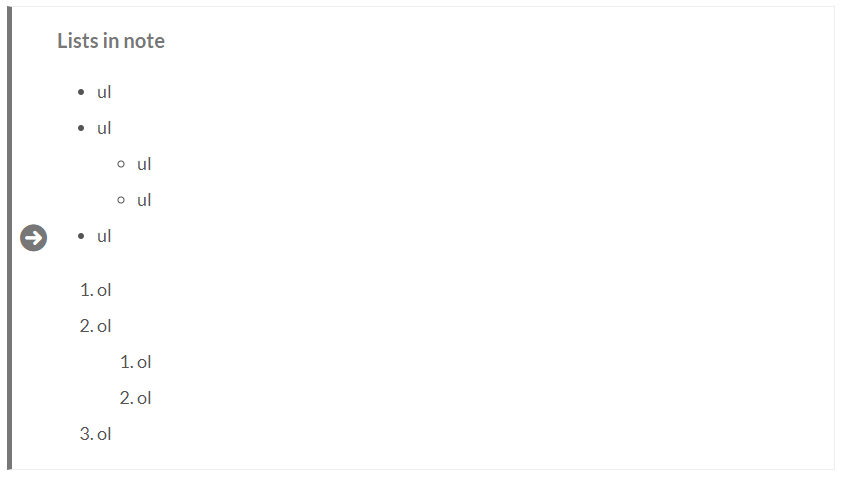

例子13

```
#### Table in Note

| 1 | 2 |
| - | - |
| 3 | 4 |
| 5 | 6 |
| 7 | 8 |


```

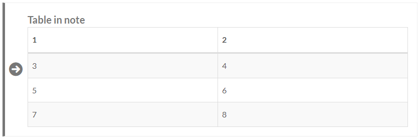


## pdf支持

主题配置

```
pdf:
  enable: true
  # Default height
  height: 500px
```

语法

```
用法：


参数：
url : PDF 文件的 URL（绝对路径）。
[height]:可选参数。PDF 显示元素的高度，例如 800 像素。

例子：



```

CORS 策略可能会阻止加载 pdf.js 或 pdf 文件。如果要从其他网站加载资源，请确保正确设置 Access-Control-Allow-Origin 标头。另请参阅[访问控制允许来源 - HTTP | MDN](https://developer.mozilla.org/en-US/docs/Web/HTTP/Headers/Access-Control-Allow-Origin).

## 多tab栏

主题配置

```
# Tabs tag
tabs: # 多tab栏
  # Make the nav bar of tabs with long content stick to the top. 使内容较长的标签的导航栏贴在顶部。
  sticky: false
  transition:
    tabs: false
    labels: true

```

语法

```
用法：

<!-- tab [Tab caption] [@icon] -->
Any content (support inline tags too).
<!-- endtab -->


参数：

Unique name ：标签块标签的唯一名称，不带逗号。
            将在#id 中用作每个选项卡及其索引号的前缀。
            如果名称中有空格，则生成#id 所有空格都将替换为破折号。
            仅对于帖子/页面的当前 url 必须是唯一的！
[index] ：活动标签的索引号。
            如果未指定，将选择第一个选项卡 (1)。
            如果 index 为 -1，则不会选择任何选项卡。这将是像剧透一样的东西。
            可选参数。
[Tab caption]：当前选项卡的标题。
            如果未指定标题，则带有标签索引后缀的唯一名称将用作标签的标题。
            如果未指定标题，但指定了图标，则标题将为空。
            可选参数。
[@icon] ：字体真棒图标名称。
            可以指定有或没有空格；例如，“标签标题@icon”与“标签标题@icon”相同。
            可选参数。
```

例子1

```

<!-- tab -->
 **这是 Tab 1.** 
<!-- endtab -->

<!-- tab -->
 **这是 Tab 2.** 
<!-- endtab -->

<!-- tab -->
 **这是 Tab 3.** 
<!-- endtab -->

```

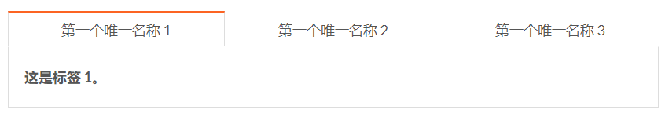

- 默认选择tab

```

<!-- tab -->
 **这是 Tab 1.** 
<!-- endtab -->

<!-- tab -->
 **这是 Tab 2.** 
<!-- endtab -->

<!-- tab -->
 **这是 Tab 3.** 
<!-- endtab -->

```

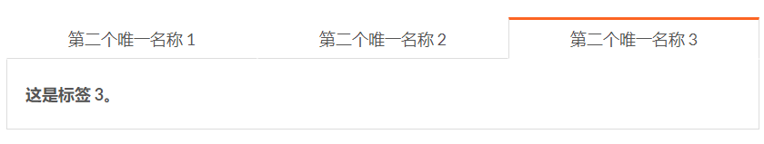

- 默认未选择tab

```

<!-- tab -->
 **这是 Tab 1.** 
<!-- endtab -->

<!-- tab -->
 **这是 Tab 2.** 
<!-- endtab -->

<!-- tab -->
 **这是 Tab 3.** 
<!-- endtab -->

```

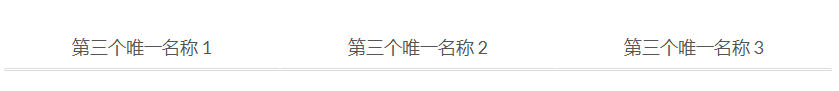

- 带有自定义标签的tab

```

<!-- tab 解决方案 1 -->
 **这是 Tab 1.** 
<!-- endtab -->

<!-- tab 解决方案 2 -->
 **这是 Tab 2.** 
<!-- endtab -->

<!-- tab 解决方案 3 -->
 **这是 Tab 3.** 
<!-- endtab -->

```

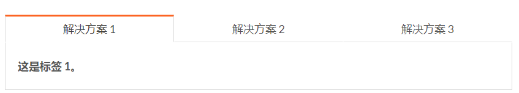

- 只带有图标的tab

```

<!-- tab @text-width -->
 **这是 Tab 1.** 
<!-- endtab -->

<!-- tab @font -->
 **这是 Tab 2.** 
<!-- endtab -->

<!-- tab @bold -->
 **这是 Tab 3.** 
<!-- endtab -->

```


- 图标+文字的tab

```

<!-- tab Solution 1@text-width -->
 **这是Tab 1.** 
<!-- endtab -->

<!-- tab Solution 2@font -->
 **这是Tab 2.** 
<!-- endtab -->

<!-- tab Solution 3@bold -->
 **这是 Tab 3.** 
<!-- endtab -->

```


- 连接跳转到tab

```
> [Tab one](#tab-one) 的永久链接。
> [Tab one 1](#tab-one-1) 的永久链接。
> [Tab one 2](#tab-one-2) 的永久链接。
> [Tab one 3](#tab-one-3) 的永久链接。

> [选项卡二](#tab-two) 的永久链接。
> [Tab two 1](#tab-two-1) 的永久链接。
> [Tab two 2](#tab-two-2) 的永久链接。
> [Tab two 3](#tab-two-3) 的永久链接。


<!-- tab -->
 **这是 Tab 1.** 
<!-- endtab -->

<!-- tab -->
 **这是 Tab 2.** 
<!-- endtab -->

<!-- tab -->
 **这是 Tab 3.** 
<!-- endtab -->



<!-- tab -->
 **这是 Tab 1.** 
<!-- endtab -->

<!-- tab -->
 **这是 Tab 2.** 
<!-- endtab -->

<!-- tab -->
 **这是 Tab 3.** 
<!-- endtab -->

```


- **tab里面可以放note,video，等等嵌套复杂的效果，tab还可以嵌套tab**


## 代码折叠

```css


code block in note tag
code block in note tag
code block in note tag


```


# 高级设置

> 不知道怎么修改的话不建议修改

## CDN设置

这可以使插件的静态资产加载更快。

```
# ---------------------------------------------------------------
# CDN Settings
# See: https://theme-next.js.org/docs/advanced-settings/vendors
# ---------------------------------------------------------------

vendors:
  # The CDN provider of NexT internal scripts.
  # Available values: local | jsdelivr | unpkg | cdnjs | custom
  # Warning: If you are using the latest master branch of NexT, please set `internal: local`
  internal: local
```

如果您的站点部署到任何免费托管服务（Github、Gitlab 等），建议内部脚本使用 CDN 链接。CDN 通常速度更快，没有流量限制。

如果您使用的是 NexT 最新的 master 分支，请设置`internal: local`.


## 第三方插件

`plugins: cdnjs`用于设置如何加载第三方插件，例如`anime.js`. 第三方插件从[CDNJS加载](https://cdnjs.com/)默认为 CDN。

我们还提供其他可选的 CDN，包括著名的[UNPKG](https://unpkg.com/)和[jsDelivr](https://www.jsdelivr.com/). 选择这些 CDN 提供商来交付我们的第三方插件是因为它们快速且可靠。设置`plugins`为`unpkg`或`cdnjs`从不同的 CDN 提供商加载它们。

特别是如果您是中国博主或大部分访问来自中国，请注意**CDNJS 在中国部分地区被封锁**，请勿将其用作您的 CDN 提供商。

如果您想从您的站点加载所有第三方插件，请设置`plugins`并`local`安装`@next-theme/plugins`包：[https ://github.com/next-theme/plugins](https://github.com/next-theme/plugins)
如果您的网站部署在局域网中，那么这将比 CDN 服务具有更快的加载速度。

## 自定义 CDN URL

有时您可能需要使用除`jsdelivr`、`unpkg`或之外的 CDN `cdnjs`。例如，用户可以使用jsDelivr的镜像站点在某些区域获得更快的加载速度。

要启用自定义 CDN URL，您需要在部分中设置`internal: custom`和/或，然后使用选项指定 CDN URL。`plugins: custom vendors custom_cdn_url`

在您的站点上启用 HTTPS 时，请记住使用 CDN 链接的 HTTPS 协议。

```
vendors: 
  # The default CDN provider of third-party plugins.
  # Available values: local | jsdelivr | unpkg | cdnjs | custom
  # Dependencies for `plugins: local`: https://github.com/next-theme/plugins
  plugins: cdnjs # 从不同的服务商加载js插件
```


## jsDelivr

- [https ://www.jsdelivr.com/features](https://www.jsdelivr.com/features)

jsDelivr 可以自动缩小 JS 和 CSS 文件，即使包所有者没有在 npm 上发布缩小版本。您只需要访问`*.min.js`and `*.min.css`，而不是`*.js`and `*.css`。

```
vendors:
  # Custom CDN URL
  # For example:
  # custom_cdn_url: https://cdn.jsdelivr.net/npm/${npm_name}@${version}/${minified}
  # custom_cdn_url: https://cdnjs.cloudflare.com/ajax/libs/${cdnjs_name}/${version}/${cdnjs_file}
  custom_cdn_url:
```

## 单独配置每个cdn

`vendors`此外，您可以在该部分中单独配置每个库的 CDN URL 。

配置格式为`libname: CDN URL`. 与文件中的`libname`相同`_vendors.yml`。将`CDN URL`覆盖默认值。

```
vendors:
  # ...
  # Some contents...
  # ...
  anime: //fastly.jsdelivr.net/gh/juliangarnier/anime@latest/lib/anime.min.js

```


## 自定义文件支持

hexo内置了inject注入的功能，可以通过不修改源码的情况下自定义内容，很优雅的实现方式。

可以将所有自定义布局或样式放置在特定位置（例如：`hexo/source/_data`）,并且放开配置文件中的注释即可生效

```
# Define custom file paths.
# Create your custom files in site directory `source/_data` and uncomment needed files below.
custom_file_path: # 自定义的文件
  #head: source/_data/head.njk
  #header: source/_data/header.njk
  #sidebar: source/_data/sidebar.njk
  #postMeta: source/_data/post-meta.njk
  #postBodyEnd: source/_data/post-body-end.njk
  #footer: source/_data/footer.njk
  #bodyEnd: source/_data/body-end.njk
  #variable: source/_data/variables.styl
  #mixin: source/_data/mixins.styl
  #style: source/_data/styles.styl
```


## 修改布局示例

### Live2d 小部件

创建和`source/_data/head.njk`编辑站点根目录并添加以下内容：

```
hexo/source/_data/head.njk
<script src="https://fastly.jsdelivr.net/gh/stevenjoezhang/live2d-widget@latest/autoload.js"></script>
```

然后在中的部分`head`下取消注释`custom_file_path`NextT 配置文件.

```
custom_file_path:
  head: source/_data/head.njk
```

### 侧边栏中的 Netlify 徽标

创建和`source/_data/sidebar.njk`编辑站点根目录并添加以下内容：

```
<div class="cc-license animated" itemprop="sponsor">
  <a href="https://www.netlify.com" class="cc-opacity" title="Deploy with Netlify → https://www.netlify.com" target="_blank"></a>
</div>
```

然后在中的部分`sidebar`下取消注释`custom_file_path`NextT 配置文件.

```
custom_file_path:
  sidebar: source/_data/sidebar.njk

```


## 修改样式示例

### 标签云颜色

创建和`source/_data/variables.styl`编辑站点根目录并添加变量：

```
$tag-cloud-start      = #aaa;
$tag-cloud-end        = #111;
$tag-cloud-start-dark = #555;
$tag-cloud-end-dark   = #eee;

```

然后在中的部分`variable`下取消注释`custom_file_path`NextT 配置文件.

```
custom_file_path:
  variable: source/_data/variables.styl
```

### 如何更改内容宽度

默认情况下，NextT 的内容宽度由以下变量控制：

- `$content-desktop`→ 当屏幕宽度 < 1200px。
- `$content-desktop-large`→ 当屏幕宽度 >= 1200 像素时。
- `$content-desktop-largest`→ 当屏幕宽度 >= 1600 像素时。
- 在移动/平板设备中，它将使用响应宽度。

`source/_data/variables.styl`您可以通过编辑来覆盖默认内容宽度站点根目录.

### 在移动设备上隐藏侧边栏

创建和`source/_data/styles.styl`编辑站点根目录并添加样式：

```
+tablet-mobile() {
  .sidebar-toggle, .sidebar {
    display: none;
  }
}
```

然后在中的部分`style`下取消注释`custom_file_path`NextT 配置文件.

```
custom_file_path:
  style: source/_data/styles.styl

```

### 在存档页面中隐藏“继续发布”

创建和`source/_data/styles.styl`编辑站点根目录并添加样式：

```
.archive .collection-title {
  display: none !important;
}
```

然后在中的部分`style`下取消注释`custom_file_path`NextT 配置文件.

```
custom_file_path:
  style: source/_data/styles.styl

```

## 注入inject


### 例子

**一：**加载自定义脚本。我们可以将其添加到`bodyEnd`.

```
hexo.extend.filter.register('theme_inject', function(injects) {
  injects.bodyEnd.raw('load-custom-js', '<script src="js-path-or-cdn.js"></script>', {}, {cache: true});
});
```

**二：**在侧边栏添加自定义`my-favourite-food.njk`。

Step1：您应该`my-favourite-food.njk`在任何路径（例如`source/_data/`）中创建如下。您可以从过滤器中获取`hexo`或`local`定义变量。

```

  <div>{{ food }}</div>

```

Step2：添加过滤器以加载它。

```
hexo.extend.filter.register('theme_inject', function(injects) {
  injects.sidebar.file('my-favourite-food', 'source/_data/my-favourite-food.njk', {
    foods: ['apple', 'orange']
  });
});
```

**三：**想有大头，放`big-header.styl`NexT。

当然，您需要先创建这个文件（例如`source/_data/big-header.styl`）。

```
h1 {
  font-size: 2rem;
}
```

然后将其添加到过滤器中。

```
hexo.extend.filter.register('theme_inject', function(injects) {
  injects.style.push('source/_data/big-header.styl');
});
```

### 插件扩展

支持 hexo 的插件系统，无需修改核心模块的源代码即可轻松扩展功能。你可以看到https://hexo.io/docs/plugins.html#Plugin学习如何创建插件。


## front-matter

### 设置及其默认值

| 环境              | 类型        | 描述                                                         | 默认                                   |
| ----------------- | ----------- | ------------------------------------------------------------ | -------------------------------------- |
| `author`          | `string`    | 帖子版权的作者姓名                                           | `author`在 Hexo 中`_config.yml`        |
| `post_link`       | `string`    | 发布链接                                                     | 没有任何                               |
| `description`     | `string`    | 文档[在这里](https://theme-next.js.org/docs/theme-settings/posts.html#Preamble-Text) | 没有任何                               |
| `direction`       | `string`    | 可用值：`rtl`                                                | 没有任何                               |
| `header`          | `boolean`   | 是否在索引页显示文章标题                                     | `true`                                 |
| `mathjax`         | `boolean`   | MathJax 支持                                                 | `math.every_page`在`_config.yml`       |
| `sidebar`         | `boolean`   | 是否显示侧边栏                                               | 取决于`sidebar.display`在`_config.yml` |
| `copyright`       | `boolean`   | 是否在帖子下方显示版权声明`theme.creative_commons.license`并`theme.creative_commons.post`启用 | `true`                                 |
| `sticky`          | `number`    | 将帖子固定到索引页面的顶部。[hexo-generator-index](https://github.com/hexojs/hexo-generator-index)需要插件 | 0                                      |
| `quicklink`       | `object`(1) | 快速链接支持                                                 | 从`_config.yml`                        |
| `reward_settings` | `object`(1) | 奖励设置                                                     | 从`_config.yml`                        |
| `toc`             | `object`(1) | 侧边栏中的目录                                               | 从`_config.yml`                        |

可以设置和`_config.yml`相同的配置项

比如：

```
toc:
  enable: true
  number: false # 单篇不生成目录序号
  max_depth: 3
reward_settings:
  enable: true
  comment: Buy me a coffee
quicklink:
  enable: true
  delay: true
  timeout: 3000
  priority: true
```

### 未记录的front-matter变量

以下变量在 Hexo 文档中没有提到，但是[hexo-theme-unit-test需要](https://github.com/hexojs/hexo-theme-unit-test).

| 环境     | 类型     | 例子                                                         |
| -------- | -------- | ------------------------------------------------------------ |
| `link`   | `string` | [链接帖子](https://github.com/hexojs/hexo-theme-unit-test/blob/master/source/_posts/link-post.md) |
| `photos` | `array`  | [画廊邮报](https://github.com/hexojs/hexo-theme-unit-test/blob/master/source/_posts/gallery-post.md) |


# ~~docker化~~

> 无他，唯折腾尔


## docker安装

1、yum 包更新到最新 

```shell
yum update
```

2、安装需要的软件包， yum‐util 提供yum‐config‐manager功能，另外两个是devicemapper驱动依赖的 

```shell
yum install -y yum‐utils device-mapper-persistent-data lvm2 
```

3、 设置yum源 

```shell
yum-config-manager --add-repo https://download.docker.com/linux/centos/docker-ce.repo
```

4、 安装docker，出现输入的界面都按 y 

```shell
yum install -y docker-ce  
```

5、 查看docker版本，验证是否验证成功 

```shell
docker -v
```

6.配置阿里云镜像加速

```shell
mkdir -p /etc/docker
vim /etc/docker/daemon.json 
{
	"registry-mirrors": ["https://xbmcwm0u.mirror.aliyuncs.com"]
}

systemctl daemon-reload
systemctl restart docker
```

7.启动停止docker服务

```shell
# 启动docker服务: （安装玩要启动一下）
systemctl start docker 
# 停止docker服务: 
systemctl stop docker 
# 重启docker服务: 
systemctl restart docker 
# 查看docker服务状态: 
systemctl status docker 
# 设置开机启动docker服务: 
systemctl enable docker
```

8. 查找下有哪些版本可以安装

```shell
yum list docker-ce --showduplicates | sort -r
```

 

## docker安装nginx

2.拉取nginx镜像

```shell
docker pull nginx
```

3.创建容器，设置端口映射、目录映射

```shell
# 在/root目录下创建nginx目录用于存储nginx数据信息
mkdir ~/nginx 
cd ~/nginx 
mkdir conf 
cd conf
# 在~/nginx/conf/下创建nginx.conf文件,粘贴下面内容 
vim nginx.conf
```

nginx.conf

```
user  root;
worker_processes  1;

#error_log  logs/error.log;
#error_log  logs/error.log  notice;
#error_log  logs/error.log  info;

#pid        logs/nginx.pid;


events {
    worker_connections  1024;
}


http {
    include       mime.types;
    default_type  application/octet-stream;

    #log_format  main  '$remote_addr - $remote_user [$time_local] "$request" '
    #                  '$status $body_bytes_sent "$http_referer" '
    #                  '"$http_user_agent" "$http_x_forwarded_for"';

    #access_log  logs/access.log  main;

    sendfile        on;
    #tcp_nopush     on;

    #keepalive_timeout  0;
    keepalive_timeout  65;

    #gzip  on;
	
	# 放到vhost下管理
	include vhosts/*.conf;
	
    server {
        listen       80;
        server_name  localhost;

        #charset koi8-r;

        #access_log  logs/host.access.log  main;

        location / {
            root   html;
            index  index.html index.htm;
        }

        #error_page  404              /404.html;

        # redirect server error pages to the static page /50x.html
        #
        error_page   500 502 503 504  /50x.html;
        location = /50x.html {
            root   html;
        }

        # proxy the PHP scripts to Apache listening on 127.0.0.1:80
        #
        #location ~ \.php$ {
        #    proxy_pass   http://127.0.0.1;
        #}

        # pass the PHP scripts to FastCGI server listening on 127.0.0.1:9000
        #
        #location ~ \.php$ {
        #    root           html;
        #    fastcgi_pass   127.0.0.1:9000;
        #    fastcgi_index  index.php;
        #    fastcgi_param  SCRIPT_FILENAME  /scripts$fastcgi_script_name;
        #    include        fastcgi_params;
        #}

        # deny access to .htaccess files, if Apache's document root
        # concurs with nginx's one
        #
        #location ~ /\.ht {
        #    deny  all;
        #}
    }


    # another virtual host using mix of IP-, name-, and port-based configuration
    #
    #server {
    #    listen       8000;
    #    listen       somename:8080;
    #    server_name  somename  alias  another.alias;

    #    location / {
    #        root   html;
    #        index  index.html index.htm;
    #    }
    #}


    # HTTPS server
    #
    #server {
    #    listen       443 ssl;
    #    server_name  localhost;

    #    ssl_certificate      cert.pem;
    #    ssl_certificate_key  cert.key;

    #    ssl_session_cache    shared:SSL:1m;
    #    ssl_session_timeout  5m;

    #    ssl_ciphers  HIGH:!aNULL:!MD5;
    #    ssl_prefer_server_ciphers  on;

    #    location / {
    #        root   html;
    #        index  index.html index.htm;
    #    }
    #}

}
```

4.启动容器

进到nginx目录

```
# 到nginx,不然$PWD受影响
cd ~/nginx
```

创建容器

```shell
docker run -id --name=blog_nginx \
-p 80:80 \
-v /root/nginx/conf/nginx.conf:/etc/nginx/nginx.conf \
-v /root/nginx/conf/cert:/etc/nginx/cert \
-v /root/nginx/conf/vhosts:/etc/nginx/vhosts \
-v /root/nginx/logs:/var/log/nginx \
-v /root/nginx/html:/usr/share/nginx/html \
nginx
```

参数说明：

```
-v /root/nginx/conf/cert 证书文件映射到 /etc/nginx
```


## docker安装mysql

2.拉取mysql镜像

```shell
docker pull mysql
```

3.创建容器，设置端口映射、目录映射

```shell
#在/root目录下创建mysql目录用于存储mysql数据信息 

mkdir ~/mysql 
cd ~/mysql
docker run -id \
-p 3306:3306 \
--name=blog_mysql \
-v /root/mysql/conf:/etc/mysql/conf.d \
-v /root/mysql/logs:/var/log/mysql \
-v /root/mysql/data:/var/lib/mysql \
-e MYSQL_ROOT_PASSWORD=root \
-d mysql \
--restart always \
--default-authentication-plugin=mysql_native_password \
--character-set-server=utf8mb4 --collation-server=utf8mb4_unicode_ci
```

7.创建数据库blog_waline，导入SQL：https://github.com/walinejs/waline/blob/main/assets/waline.sql

```
CREATE DATABASE blog_waline DEFAULT CHARACTER SET utf8mb4;

CREATE TABLE `wl_Comment` (
  `id` int(11) unsigned NOT NULL AUTO_INCREMENT,
  `user_id` int(11) DEFAULT NULL,
  `comment` text,
  `insertedAt` timestamp NULL DEFAULT CURRENT_TIMESTAMP,
  `ip` varchar(100) DEFAULT '',
  `link` varchar(255) DEFAULT NULL,
  `mail` varchar(255) DEFAULT NULL,
  `nick` varchar(255) DEFAULT NULL,
  `pid` int(11) DEFAULT NULL,
  `rid` int(11) DEFAULT NULL,
  `sticky` boolean DEFAULT NULL,
  `status` varchar(50) NOT NULL DEFAULT '',
  `like` int(11) DEFAULT NULL,
  `ua` text,
  `url` varchar(255) DEFAULT NULL,
  `createdAt` timestamp NULL DEFAULT CURRENT_TIMESTAMP,
  `updatedAt` timestamp NULL DEFAULT CURRENT_TIMESTAMP,
  PRIMARY KEY (`id`)
) ENGINE=InnoDB DEFAULT CHARSET=utf8mb4;


# Dump of table wl_Counter
# ------------------------------------------------------------

CREATE TABLE `wl_Counter` (
  `id` int(11) unsigned NOT NULL AUTO_INCREMENT,
  `time` int(11) DEFAULT NULL,
  `url` varchar(255) NOT NULL DEFAULT '',
  `createdAt` timestamp NULL DEFAULT CURRENT_TIMESTAMP,
  `updatedAt` timestamp NULL DEFAULT CURRENT_TIMESTAMP,
  PRIMARY KEY (`id`)
) ENGINE=InnoDB DEFAULT CHARSET=utf8mb4;


# Dump of table wl_Users
# ------------------------------------------------------------

CREATE TABLE `wl_Users` (
  `id` int(11) unsigned NOT NULL AUTO_INCREMENT,
  `display_name` varchar(255) NOT NULL DEFAULT '',
  `email` varchar(255) NOT NULL DEFAULT '',
  `password` varchar(255) NOT NULL DEFAULT '',
  `type` varchar(50) NOT NULL DEFAULT '',
  `label` varchar(255) DEFAULT NULL,
  `url` varchar(255) DEFAULT NULL,
  `avatar` varchar(255) DEFAULT NULL,
  `github` varchar(255) DEFAULT NULL,
  `twitter` varchar(255) DEFAULT NULL,
  `facebook` varchar(255) DEFAULT NULL,
  `google` varchar(255) DEFAULT NULL,
  `weibo` varchar(255) DEFAULT NULL,
  `qq` varchar(255) DEFAULT NULL,
  `2fa` varchar(32) DEFAULT NULL,
  `createdAt` timestamp NULL DEFAULT CURRENT_TIMESTAMP,
  `updatedAt` timestamp NULL DEFAULT CURRENT_TIMESTAMP,
  PRIMARY KEY (`id`)
) ENGINE=InnoDB DEFAULT CHARSET=utf8mb4;
```


## docker安装waline

1.拉取镜像

```
docker pull lizheming/waline:latest  #拉取镜像
```

2.运行容器

```
mkdir ~/waline 
cd ~/waline
docker run -d --name blog_waline -p 8360:8360 \
 -v /root/waline/data:/app/data \
 -e TZ="Asia/Shanghai" \
 -e MYSQL_HOST="公网IP" \
 -e MYSQL_DB="数据库名字" \
 -e MYSQL_USER="数据库用户" \
 -e MYSQL_PASSWORD="数据库密码" \
 -e AUTHOR_EMAIL="作者邮箱" \
 -e SITE_NAME="网站名字" \
 -e SENDER_NAME="发送人名字" \
 -e SITE_URL="网站地址" \
 -e SMTP_SERVICE="发送邮件的服务商" \
 -e SMTP_USER="QQ账号@qq.com" \
 -e SMTP_PASS="授权码" \
 -e SECURE_DOMAINS="安全域名" \
 -e DISABLE_USERAGENT="是否开启浏览器标识" \
 -e AVATAR_PROXY="头像加速镜像地址" \
 -e IPQPS="ip发言频率" \
 --restart always lizheming/waline:latest 
```

启动容器：

```shell
docker run -d --name blog_waline -p 8360:8360 \
 -v ${PWD}/data:/app/data \
 -e TZ="Asia/Shanghai" \
 -e MYSQL_HOST="xx.xx.xx.xx" \
 -e MYSQL_DB="blog_waline" \
 -e MYSQL_USER="root" \
 -e MYSQL_PASSWORD="root" \
 -e AUTHOR_EMAIL="QQ账号@qq.com" \
 -e SITE_NAME="蹒跚学步架构师" \
 -e SENDER_NAME="左耳" \
 -e SITE_URL="https://域名(xx.com)" \
 -e SMTP_SERVICE="QQ" \
 -e SMTP_USER="QQ账号@qq.com" \
 -e SMTP_PASS="SMTP授权码" \
 -e SECURE_DOMAINS="www.域名(xx.com)" \
 -e DISABLE_USERAGENT="false" \
 -e AVATAR_PROXY="" \
 -e IPQPS="30" \
 --restart always lizheming/waline:latest
```

访问 http://xx.xx.xx.xx:8360/ui/register,可以看到注册页面 

注册自己的waline的用户 


## 配置nginx反向代理

上面已经创建了vhost目录,新增blog.conf。配置80,443(SSL),8360

```
server {
  listen 443 ssl;
  #填写绑定证书的域名
  server_name www.域名(xx.com);
  #证书文件名称
  ssl_certificate cert/域名(xx.com)_bundle.crt;
  #私钥文件名称
  ssl_certificate_key cert/域名(xx.com).key;
  ssl_session_timeout 5m;
  ssl_ciphers ECDHE-RSA-AES128-GCM-SHA256:ECDHE:ECDH:AES:HIGH:!NULL:!aNULL:!MD5:!ADH:!RC4;
  ssl_protocols TLSv1.2 TLSv1.3;
  ssl_prefer_server_ciphers on;
  location / {
    #网站主页路径。此路径仅供参考，具体请您按照实际目录操作。 
    #例如，您的网站运行目录在/etc/www下，则填写/etc/www。
    root /usr/share/nginx/html;
    index index.html index.htm;
  }
}
server {
  listen 80;
  #listen [::]:80;
  #填写绑定证书的域名
  server_name www.域名(xx.com);
  #把http的域名请求转成https
  return 301 https://$host$request_uri;
}

```


参考：

- [Hexo之我的个人博客改用自己服务器搭建](https://blog.csdn.net/x851288986/article/details/102512949)
- [从零搭建Hexo博客并部署阿里云服务器（奶妈级教学）](https://blog.csdn.net/NoCortY/article/details/99631249?utm_medium=distribute.pc_relevant.none-task-blog-BlogCommendFromMachineLearnPai2-2.control&depth_1-utm_source=distribute.pc_relevant.none-task-blog-BlogCommendFromMachineLearnPai2-2.control)


# 更多技巧

## 创建多级目录

通过该命令 `hexo new post -p /后端/test.md` 执行后，会在post文件夹下创建子文件夹 “后端”，并创建一篇test.md博文。


比如：

```
 hexo new post -p 03_微服务/RPC/01_NIO/NIO.md
 hexo new post -p 03_微服务/RPC/02_RPC/RPC.md
```


## 文章永久短链接

```
npm install hexo-abbrlink --save
```

编辑配置文件`_config.yml`

```
#permalink: :year/:month/:day/:title/
#permalink_defaults:
permalink: posts/:abbrlink/
abbrlink:
  alg: crc32 #support crc16(default) and crc32
  rep: dec   #support dec(default) and hex
```

如果谋篇文章不想要数字的,也可以自己制定,比如：

```
abbrlink: /ms/rpc/zookeeper/
```

### 中文拼音链接

安装

```
npm i hexo-permalink-pinyin --save
```

配置

```
permalink: article/:title.html
permalink_pinyin:
  enable: true
  separator: '-' # default: '-'
permalink_defaults:
```

效果

```
https://[你的网站域名]/article/wo-de-ge-ren-bo-ke.html
```

### 自定义urlname

模板

```
title: {{ title }}
date: {{ date }}
# 增加urlname为标题名,免得新生成的文字忘记加了
urlname: {{ title }}
tags:
categories: 
```

配置

```
permalink: article/:urlname.html  # urlname值文章里必须填写，格式201905260105
permalink_defaults:
```

> 我用了这种，第一种我会重复！！不知道为啥，第二种拼音太长了，第三种自己写，只要记得就行

本地图片插入

- https://github.com/yiyungent/hexo-asset-img/blob/main/README_zh.md

> 一直用 VSCode 编辑 markdown，图片只能分成两边窗口预览，体验实在不好，更麻烦的是，发布时需要更改图片路径，一更改，Hexo图片显示出来了，本地又无法预览了，本文将 介绍
>
> - 使用Typora实时预览markdown
> - 配置图片路径
> - 开发 Hexo 插件解决 图片本地预览 与 发布时图片路径 不一致 问题

### 1. 下载安装 Typora

https://typora.io/

### 2. 配置 Typora 图片路径

[image-20201128093318078](https://moeci.com/posts/hexo-typora/image-20201128093318078.png)[image-20201128093433709](https://moeci.com/posts/hexo-typora/image-20201128093433709.png)

图片文件保存路径: `./${filename}` 即保存到与 当前正在编辑的文件名 相同的同级文件夹下

下面三项依次为

- 对本地位置的图片应用上述规则

- 对网络位置的图片应用上述规则

- 优先使用相对路径

  建议都勾选上，至少要勾选上第一项

> PS：使用 `Ctrl+V` 粘贴 即可复制图片到Typora图片文件夹

### 3. 配置 Hexo 图片文件夹

[image-20201128094048904](https://moeci.com/posts/hexo-typora/image-20201128094048904.png)

在 Hexo 根目录打开配置文件 `_config.yml`

搜索 `post_asset_folder`，`false` 改为 `true`

[image-20201128094140252](https://moeci.com/posts/hexo-typora/image-20201128094140252.png)

这样修改后，每次 'hexo new page' 生成新文章，都会在文章文件同级目录创建一个与文章文件名同名的文件夹，我们就在这里存放此文章的图片。

[image-20201128094645294](https://moeci.com/posts/hexo-typora/image-20201128094645294.png)

> PS: 这被称为 `文章资源文件夹`, 参考官方文档： https://hexo.io/zh-cn/docs/asset-folders

### 4. 开发 Hexo 转换图片路径 插件

现在，我们在 `Typora`下使用 ``引用图片，享受实时预览，但需发布到 `Hexo`，使之发布后能正确加载我们的图片，还需要做以下转换:

```
 --> 
```

而这个转换我们需要在文章编译为html之前，在编译过程中转换为 这样的标签``

> PS: [Hexo官方文档 - 相对路径引用的标签插件](https://hexo.io/zh-cn/docs/asset-folders#相对路径引用的标签插件)

#### 4.1 创建文件夹 `hexo-asset-img`，初始化npm包

```
mkdir hexo-asset-img
cd hexo-asset-img
npm init
```

[image-20201128103300470](https://moeci.com/posts/hexo-typora/image-20201128103300470.png)

#### 4.2 编写插件 `index.js`

创建 `index.js`，编写代码如下

```
const log = require('hexo-log')({ 'debug': false, 'slient': false });

/**
 * md文件返回 true
 * @param {*} data 
 */
function ignore(data) {
    // TODO: 好奇怪，试了一下, md返回true, 但却需要忽略 取反!
    var source = data.source;
    var ext = source.substring(source.lastIndexOf('.')).toLowerCase();
    return ['md',].indexOf(ext) > -1;
}

function action(data) {
    var reverseSource = data.source.split("").reverse().join("");
    var fileName = reverseSource.substring(3, reverseSource.indexOf("/")).split("").reverse().join("");

    //   -->  
    var regExp = RegExp("!\\[(.*?)\\]\\(" + fileName + '/(.+?)\\)', "g");
    // hexo g
    data.content = data.content.replace(regExp, "","g");

    // log.info(`hexo-asset-img: filename: ${fileName}, title: ${data.title.trim()}`);
    
    return data;
}

hexo.extend.filter.register('before_post_render',(data)=>{
    if(!ignore(data)){
        action(data)
    }
}, 0);
```

#### 4.3 本地测试插件

1. `Hexo`根目录下 `package.json` 中 `dependencies`添加一行 `"hexo-asset-img": "^1.0.0",`
2. 将 `hexo-asset-img`文件夹复制到 `Hexo`根目录下 `node_modules`文件夹下

> 注意：二者缺一不可，笔者试过不修改 `package.json` ，但没成功加载插件

重新生成文章

```
hexo clean
hexo g
hexo s # 本地预览
```

> PS：当然之后你还需要修正以前文章的图片路径

`public/posts` 生成结果如下图所示，成功

[image-20201128120229747](https://moeci.com/posts/hexo-typora/image-20201128120229747.png)

图片路径被转换成功

```

```

#### 4.4 发布插件

> 注意: 你需要先登录 `npm login`

```
npm publish --registry https://registry.npmjs.org
```

[image-20201128121054072](https://moeci.com/posts/hexo-typora/image-20201128121054072.png)

### 5. 使用插件

```
npm install hexo-asset-img --save
```

> 关联 GitHub
>
> [yiyungent/hexo-asset-img: Hexo插件: 转换 图片相对路径 为 asset_img](https://github.com/yiyungent/hexo-asset-img)
>
> https://github.com/yiyungent/hexo-asset-img

### 参考

感谢帮助！

- [Hexo+NexT（六）：手把手教你编写一个Hexo过滤器插件](https://www.cnblogs.com/guide2it/p/11111715.html)

## 自动清理未使用图片

- https://github.com/yiyungent/coo

## 创建TODOlist页面

1.设置hexo不渲染该文件

背景：因为这是一个单独html文件，不使用hexo来渲染，所以要设置属性。

```
skip_render: 
  - "todolist/**"
```

2.新建todolist页面

首先，在主题的 _configy.yml文件中设置 menu ：

```
menu:
	todolist: /todolist || fas
```

然后就会发现source中新建好了一个todolist文件夹,删除index.md文件,新建一个index.html文件

```html
<!DOCTYPE html>
<html lang="en">
<head>
    <meta charset="UTF-8">
    <title>Title</title>
    <script src="https://cdn.bootcss.com/vue/2.6.10/vue.min.js"></script>
    <style>
        body{
            margin:0;background-color:#fafafa;font:14px 'Helvetica Neue',Helvetica,Arial,sans-serif}
        h2{margin:0;font-size:12px}
        a{color:#000;text-decoration:none}
        input{outline:0}
        button{margin:0;padding:0;border:0;background:0;font-size:100%;vertical-align:baseline;font-family:inherit;font-weight:inherit;color:inherit;outline:0}
        ul{padding:0;margin:0;list-style:none}
        .page-top{width:100%;height:40px;background-color:#db4c3f}
        .page-content{width:50%;margin:0 auto}
        .page-content h2{line-height:40px;font-size:18px;color:#fff}
        .main{width:50%;margin:0 auto;box-sizing:border-box}
        .task-input{width:99%;height:30px;outline:0;border:1px solid #ccc}
        .task-count{display:flex;margin:10px 0}
        .task-count li{padding-left:10px;flex:1;color:#dd4b39}
        .task-count li:nth-child(1){padding:5px 0 0 10px}
        .action{text-align:center;display:flex}
        .action a{margin:0 10px;flex:1;padding:5px 0;color:#777}
        .action a:nth-child(3){margin-right:0}
        .active{border-bottom: 2px solid #629A9C}
        .tasks{background-color:#fff}.no-task-tip{padding:10px 0 10px 10px;display:block;border-bottom:1px solid #ededed;color:#777}.big-title{color:#222}.todo-list{margin:0;padding:0;list-style:none}
        .todo-list li{
            position:relative;
            font-size:16px;
            border-left: 5px solid #629A9C;
            box-shadow: 0 1px 2px rgba(0,0,0,0.07);
            margin-bottom: 16px;
        }
        .todo-list li:hover{background-color:#fafafa}
        .todo-list li.editing{border-bottom:0;padding:0;}
        .todo-list li.editing .edit{display:block;padding:13px 17px 12px 17px;margin:0 0 0 43px}
        .todo-list li.editing .view{display:none}
        .toggle{
            text-align:center;
            width:16px;
            height:16px;
            position:absolute;
            top:2px;
            left: 15px;
            bottom:0;
            margin:auto 0;
            cursor: pointer;
        }
        .todo-list li label{
            white-space:pre-line;
            word-break:break-all;
            padding:15px 60px 15px 15px;
            margin-left:45px;
            display:block;
            line-height:1.2;
            transition:color .4s
        }
        .todo-list li.completed label{
            color:#d9d9d9;
            text-decoration:line-through
        }
        .todo-list li .destroy{
            display:none;
            text-align:center;
            width:16px;
            height:16px;
            position:absolute;
            top:0;
            right:15px;
            bottom:10px;
            margin:auto 0;
            cursor: pointer;
            font-size:28px;
            color:#cc9a9a;
            transition:color .2s ease-out
        }
        .todo-list li .destroy:hover{color:#af5b5e}
        .todo-list li .destroy:after{content:'×'}
        .todo-list li:hover .destroy{display:block}
        .todo-list li .edit{display:none}
        .todo-list li.editing:last-child{margin-bottom:-1px}
    </style>
</head>
<body>
<div class="page-top">
    <div class="page-content">
        <h2>任务计划列表</h2>
    </div>
</div>
<div class="main">
    <h3 class="big-title">添加任务：</h3>
    <input
            placeholder="例如：吃饭睡觉打豆豆；  提示：+回车即可添加任务，双击列表标题即可编辑"
            class="task-input"
            type="text"
          v-on:keyup.enter="enterFn"
            v-model="todo"
    />
    <ul class="task-count">
        <li>{{unComplete}}个任务未完成</li>
        <li class="action">
            <a :class="{active:visibility!=='unCompleted'&&visibility!=='completed'}" href="#all">所有任务</a>
            <a :class="{active:visibility==='unCompleted'}" href="#unCompleted">未完成的任务</a>
            <a :class="{active:visibility==='completed'}" href="#completed">完成的任务</a>
        </li>
    </ul>
    <h3 class="big-title">任务列表：</h3>
    <div class="tasks">

        <span class="no-task-tip" v-show="!list.length">还没有添加任何任务</span>
        <ul class="todo-list" v-show="list.length">
            <li class="todo"
                v-for="item in filterData"
                v-bind:class="{completed:item.isComplete,editing:item===edtorTodos}"
            >
                <div class="view">
                    <input class="toggle"
                          type="checkbox"
                          v-model="item.isComplete"
                    />
                    <label @dblclick="edtorTodo(item)">{{item.title}}</label>
                    <button
                            class="destroy"
                            @click="delFn(item)"
                    ></button>
                </div>
                <input
                        class="edit"
                        type="text"
                        v-focus="edtorTodos===item"
                        v-model="item.title"
                        @blur="edtoEnd(item)"
                        @keyup.enter="edtoEnd(item)"
                        @keyup.esc="cancelEdit(item)"
                />
            </li>
        </ul>
    </div>
</div>
<script>
    //存取localStorage中的数据
var store = {
    save(key,value){
        window.localStorage.setItem(key,JSON.stringify(value));
    },
    fetch(key){
    return JSON.parse(window.localStorage.getItem(key))||[];
    }
}
//list取出所有的值
var list = store.fetch("storeData");

var vm = new Vue({
    el:".main",
    data:{
        list,
        todo:'',
        edtorTodos:'',//记录正在编辑的数据,
        beforeTitle:"",//记录正在编辑的数据的title
        visibility:"all"//通过这个属性值的变化对数据进行筛选
    },
    watch:{
        //下面的这种方法是浅监控
      /*list:function(){//监控list这个属性，当这个属性对应的值发生变化就会执行函数
          store.save("storeData",this.list);
      }*/
      //下面的是深度监控
        list:{
            handler:function(){
                store.save("storeData",this.list);
            },
            deep:true
        }

    },
    methods:{
        enterFn(ev){//添加任务
            //向list中添加一项任务
            //事件处理函数中的this指向的是当前这个根实例
            if(this.todo==""){return;}
                this.list.push({
                    title:this.todo,
                    isComplete:false
                });
                this.todo = "";
        },
        delFn(item){//删除任务
            var index = this.list.indexOf(item);
            this.list.splice(index,1)
        },
        edtorTodo(item){//编辑任务
            //编辑任务的时候记录编辑之前的值
            this.beforeTitle = item.title;
            this.edtorTodos = item;
        },
        edtoEnd(item){//编辑完成
            this.edtorTodos="";
            // this.cancelEdit = this.edtorTodos;
        },
        cancelEdit(item){//取消编辑
            item.title = this.beforeTitle;
            this.beforeTitle = '';
            this.edtorTodos='';
        }
    },
    directives:{
        "focus":{
            update(el,binding){
                if(binding.value){
                    el.focus();
                }
            }
        }
    },
    computed:{
        unComplete(){
        return  this.list.filter(item=>{
                return !item.isComplete
            }).length
        },
        filterData(){
            //过滤的时候有三种情况 all completed unCompleted
            var filter = {
                all:function(list){
                    return list;
                },
                completed:function(list){
                    return list.filter(item=>{
                        return item.isComplete;
                    })
                },
                unCompleted:function(list){
                    return list.filter(item=>{
                        return !item.isComplete;
                    })
                }
            }
            //如果找到了过滤函数，就返回过滤后的数据，如果没有找到就返回所有的数据
            return filter[this.visibility]?filter[this.visibility](list):list;
        }

    }
});
function hashFn(){
    var hash = window.location.hash.slice(1);
    vm.visibility = hash;
}
hashFn();
window.addEventListener('hashchange',hashFn);
</script>
</body>
</html>

```

## 草稿页front-matter预生成

修改scaffolds下的draft.md

```
---
title: {{ title }}
tags:
categories:
description:
date: {{ date }}
---
```

## 站点地图

站点地图的作用向搜索引擎提供你的网站的概要，给你的网站做 SEO。

首先安装下 npm 对应插件，然后在 hexo 和 next 主题中分别打开配置。

### 安装插件

```
npm install hexo-generator-sitemap --save
```

### Hexo 配置文件

在 hexo/_config.xml 中添加配置项：

```
# Extensions
## Plugins: https://hexo.io/plugins/
plugins: hexo-generator-sitemap
```

### Next 配置文件

修改 themes/next/_config.xml，将对应注释打开：

```
menu:
    sitemap: /sitemap.xml || sitemap
```

### 验证

执行命令重新生成源文件：

```
hexo clean && hexo g && hexo s
```

上述操作顺利的话，可以发现：

1. 首页左侧边栏多了一项站点地图，点进去可以看到以 xml 格式组织的你的所有文章的 url
2. 该站点地图路径应该为： [www.yoursite.com/sitemap.xml](http://www.yoursite.com/sitemap.xml)

然后，你可以向谷歌：https://search.google.com/search-console 提交的该站点地图 URL。

更多可以参考：http://lindaxiao-hust.github.io/2016/04/06/hexo-next-sitemap/


## 添加RSS


### 安装插件

RSS需要有一个Feed链接，而这个链接需要靠`hexo-generator-feed`插件来生成，所以第一步需要添加插件，在**Hexo根目录**执行安装指令：

```text
npm install hexo-generator-feed --save
```

### 配置feed信息

在**站点配置文件** 中追加如下代码：

```text
# Extensions
## Plugins: https://hexo.io/plugins/
plugins: 
  - hexo-generator-sitemap
  - hexo-generator-feed
  
  
# RSS配置
# feed:
#   type: rss2
#   path: rss2.xml
#   limit: 10
#   hub:
#   content: 'true'
feed:
  type: atom
  path: atom.xml
  limit: 20
  hub:
  content:
  content_limit: 140
  content_limit_delim: " "
  order_by: -date
  icon: /images/android-chrome-192x192.png

```

feed属性下的各个子属性的含义借用feed官方英文解释如下：

```text
type - Feed type. (atom/rss2)
path - Feed path. (Default: atom.xml/rss2.xml)
limit - Maximum number of posts in the feed (Use 0 or false to show all posts)
hub - URL of the PubSubHubbub hubs (Leave it empty if you don't use it)
content - (optional) set to 'true' to include the contents of the entire post in the feed.
```

### 修改主题配置文件添加RSS订阅入口

- 修改**social**节点，添加一行启用 RSS 图标

```
social:
    # 其他社交按钮
    RSS: /atom.xml || fa fa-rss
```

- 修改**follow_me**节点，开启 RSS 订阅入口

```
follow_me:
    # 其他社交按钮
    #RSS: /atom.xml || fa fa-rss
```


至此RSS功能大功告成，部署至远程后，会发现RSS已经自动出现，效果图如下：


### 手机端订阅图

手机端订阅效果展示：


## 📅本站记录

- [x] 购买域名
- [x] 购买服务器
- [x] 备案
- [x] 解析SSL
- [x] 安装hexo
- [x] 安装next主题
- [x] 服务器上安装Nginx，Git
- [x] 使用Git钩子执行hexo d后直接部署到服务器
- [x] 完成主题的配置（省略1W字，若干细节。。。）
- [x] 添加RSS
- [x] 添加站点地图
- [x] 修改字体，主英文字体Itim，好看的说
- [x] 2022-6-23 添加底部的访问量统计
- [ ] ~~添加文章的热度~~
- [ ] 添加一个好看的中文字体
- [x] 2022-6-23 调整为Gemini风格


## xmind标签插件

见：https://github.com/MaxChang3/hexo-markmap

```
npm install hexo-markmap
```

用法

```

```

参数

```
height：思维导图画布高度 
depth：可选，指定时，自动折叠级别大于深度的节点
```

例子

```

# 思维导图？
- 使用现有的插件或组件？
    - Mermaid：更偏向流程图
    - Kityminder
        - 现成hexo插件有些小问题。
        - 二次开发，失败
- 找寻相关项目？
- Markmap大法！
  - 直接弄，失败
  - 使用jsdom，失败
  - 寻找现成库，成功
- 咕咕咕咕咕咕咕咕咕咕咕咕
- 凑一下行数让版面好看点
- 现已支持 markdown/链接/等特性
  - [links](https://zhangmaimai.com)
  - **inline** ~~text~~ *styles*
  - multiline
    text
  - `inline code`
  - Katex - $x = {-b \pm \sqrt{b^2-4ac} \over 2a}$

```


## 菜单错乱

可能是因为菜单的层级跳着写了，比如h2后面直接更h4,就会有这样的现象


## 添加留言页面

### 添加留言本 page

进入到博客的根目录，运行命令：


```bash
hexo new page guestbook
```

### 留言本页面中添加多说访客代码

上一步中使用 hexo 命令新建了一个 page，进入到博客的`source`目录，里面会多了一个`gusetbook`文件夹，里面有一个`index.md`文件，打开该文件编辑：

```html
<div class="ds-recent-visitors" data-num-items="28" data-avatar-size="42" id="ds-recent-visitors"></div>
```

这段代码加到`index.md`底部就行。


然后要登录自己多说的站点，进入设置->自定义CSS，添加：

```css
#ds-reset .ds-avatar img,
#ds-recent-visitors .ds-avatar img {
    width: 54px;
    height: 54px;     /*設置圖像的長和寬，這裏要根據自己的評論框情況更改*/
    border-radius: 27px;     /*設置圖像圓角效果,在這裏我直接設置了超過width/2的像素，即為圓形了*/
    -webkit-border-radius: 27px;     /*圓角效果：兼容webkit瀏覽器*/
    -moz-border-radius: 27px;
    box-shadow: inset 0 -1px 0 #3333sf;     /*設置圖像陰影效果*/
    -webkit-box-shadow: inset 0 -1px 0 #3333sf;
}

#ds-recent-visitors .ds-avatar {
    float: left
}
/*隱藏多說底部版權*/
#ds-thread #ds-reset .ds-powered-by {
    display: none;
}
```

### 菜单设置中添加留言本

找到`NexT`主题设置的`_config.yml`文件里面的`menu`项

```yml
menu:
  home: /
  #about: /about
  archives: /archives
  tags: /tags
  categories: /categories
  guestbook: /guestbook
```

### 添加多语言文件的值

因为这里使用的是中文，找到`languages`文件夹里面的`zh-Hans.yml`文件，`menu`子项中添加留言：


```yml
menu:
  home: 首页
  archives: 归档
  categories: 分类
  tags: 标签
  about: 关于
  search: 搜索
  commonweal: 公益404
  guestbook: 留言
```

 

## 文章置顶

Hexo 本身并没有内置文章置顶功能，因此需要自行安装。不过 Hexo 本身有一个对文章排序的组件，也就是在站点配置文件内的 index_generator 选项，置顶功能其实就是每次排序的时候，把其中的置顶文章排在最前，本质上是一个排序组件，Hexo 默认的是 hexo-generator-index，所以先卸载再重新安装一个可以置顶的排序组件：

```
# 先卸载
npm uninstall --save hexo-generator-index

# 再安装
npm install --save hexo-generator-index-pin-top
```

从插件名字上就能看得出来支持置顶了。该插件的 GitHub 地址：hexo-generator-index-pin-top。插件安装完之后，只需要在文章头部信息栏内设置 top 属性即可：

```
---
title: Hexo博客文章置顶
date: 2020-03-31 07:31:04
top: true
---
```

这样这篇文章就具有置顶效果了。不过，仅仅只是这么做，文章虽然确实置顶了，但是从文章列表上来看，和普通的文章没什么不同。如果不特意去对比文章发布时间，可能会以为只是最新的文章而已。例如一些说明、通知之类的，

~~为了能有个比较突出的标志，可以在 next/layout/_macro/post.swig 文件中找到以下位置并添加代码：~~

打开：/blog/themes/next/layout/_macro `themes\hexo-theme-next\layout\_partials\post\post-meta.njk`文件，定位到div class="post-meta"标签下，插入如下代码：

不修改主题文件,自定义文件：https://theme-next.js.org/docs/advanced-settings/custom-files.html

```

  <span class="post-meta-item" title="置顶文章">
    <span class="post-meta-item-icon">
      <i class="fa fa-thumb-tack"></i>
    </span>
    <font color=7D26CD>置顶</font>
    <span>22k</span>
  </span>

```

这里的图标、文字、以及各自对应的颜色都可以自定义。完成后的效果就是：


## 隐藏文章

本 Hexo 插件可以在博客中隐藏指定的文章，并使它们仅可通过链接访问。

当一篇文章被设置为「隐藏」时，它不会出现在任何列表中（包括首页、存档、分类页面、标签页面、Feed、站点地图等），也不会被搜索引擎索引（前提是搜索引擎遵守 noindex 标签）。

只有知道文章链接的人才可以访问被隐藏的文章。

Github地址：https://github.com/printempw/hexo-hide-posts


### 安装

在站点根目录下执行`npm install hexo-hide-posts --save`

### 配置

在站点目录下的`_config.yml`中如下配置：

```yml
# hexo-hide-posts
hide_posts:
  # 可以改成其他你喜欢的名字
  filter: hidden
  # 指定你想要传递隐藏文章的位置，比如让所有隐藏文章在存档页面可见
  # 常见的位置有：index, tag, category, archive, sitemap, feed, etc.
  # 留空则默认全部隐藏
  public_generators: []
  # 为隐藏的文章添加 noindex meta 标签，阻止搜索引擎收录
  noindex: true
```

举个栗子：设置 `filter: secret` 之后，你就可以在 front-matter 中使用 `secret: true` 来隐藏文章了。

### 使用

在文章的属性中定义 `hidden: true` 即可隐藏文章。

```text
---
title: 'Hidden Post'
date: '2021/03/05 21:45:14'
hidden: true
---
```

虽然首页上被隐藏了，但你仍然可以通过 `https://hexo.test/lorem-ipsum/` 链接访问它。

你可以在命令行运行 `hexo hidden:list` 来获取当前所有的已隐藏文章列表。

插件也在 [Local Variables](https://hexo.io/api/locals) 中添加了 `all_posts` 和 `hidden_posts` 变量，供自定义主题使用。


如何修改页面效果=> 修改对应的njk文件

## 添加网站运行天数

`_config.next.yml`开启文件

```
custom_file_path: # 自定义的文件
  footer: source/_data/footer.njk
```

`_config.yml`添加配置

```
# 网站运行时间，格式形如：“本站已勉强运行了 12 天 11 小时 16 分 31 秒”
# Runing Time
running_time:
 enable: true
 create_time: '06/20/2022 12:38:12' #此处修改你的建站时间或者网站上线时间
```

自定义底部文件内容：（可以写html和脚本）

```
{# 添加网站运行时间 #} 

    <span id="timeDate">载入天数...</span>
    {# <span id="times">载入时分秒...</span> #}
    <script>
        function createtime() {
            var now = new Date();
            var grt= new Date("{{ config.running_time.create_time }}");
            now.setTime(now.getTime()+250);
            days = (now - grt ) / 1000 / 60 / 60 / 24; dnum = Math.floor(days);
            {# hours = (now - grt ) / 1000 / 60 / 60 - (24 * dnum); hnum = Math.floor(hours); #}
            {# if(String(hnum).length ==1 ){hnum = "0" + hnum;} minutes = (now - grt ) / 1000 /60 - (24 * 60 * dnum) - (60 * hnum); #}
            {# mnum = Math.floor(minutes); if(String(mnum).length ==1 ){mnum = "0" + mnum;} #}
            {# seconds = (now - grt ) / 1000 - (24 * 60 * 60 * dnum) - (60 * 60 * hnum) - (60 * mnum); #}
            {# snum = Math.round(seconds); if(String(snum).length ==1 ){snum = "0" + snum;} #}
            document.getElementById("timeDate").innerHTML = "本站已勉强运行了 "+dnum+" 天 ";
            {# document.getElementById("times").innerHTML = hnum + " 小时 " + mnum + " 分 " + snum + " 秒"; #}
        }
        setInterval("createtime()",250);
    </script>

{# 添加网站运行时间 #}
```

## 创建文章专栏

参考官网文档代码库里面的文件和路径的对应关系：https://github.com/next-theme/theme-next-docs/blob/master/source/docs/index.md


## 自定义文章路径

```
$ hexo new [layout] <title>
```

新建一篇文章。如果没有设置 `layout` 的话，默认使用 [_config.yml](https://hexo.io/zh-cn/docs/configuration) 中的 `default_layout` 参数代替。如果标题包含空格的话，请使用引号括起来。

```
$ hexo new "post title with whitespace"
```

| 参数              | 描述                                          |
| :---------------- | :-------------------------------------------- |
| `-p`, `--path`    | 自定义新文章的路径                            |
| `-r`, `--replace` | 如果存在同名文章，将其替换                    |
| `-s`, `--slug`    | 文章的 Slug，作为新文章的文件名和发布后的 URL |

默认情况下，Hexo 会使用文章的标题来决定文章文件的路径。对于独立页面来说，Hexo 会创建一个以标题为名字的目录，并在目录中放置一个 `index.md` 文件。你可以使用 `--path` 参数来覆盖上述行为、自行决定文件的目录：

`!!`

```
hexo new page --path about/me "About me"
```

以上命令会创建一个 `source/about/me.md` 文件，同时 Front Matter 中的 title 为 `"About me"`

注意！title 是必须指定的！如果你这么做并不能达到你的目的：

```
hexo new page --path about/me
```

此时 Hexo 会创建 `source/_posts/about/me.md`，同时 `me.md` 的 Front Matter 中的 title 为 `"page"`。这是因为在上述命令中，hexo-cli 将 `page` 视为指定文章的标题、并采用默认的 `layout`。


> 官方文档写的很不错，有时候可以参考上面的 效果
>
> 文档：https://theme-next.js.org/docs/getting-started/
>
> 源码：https://github.com/next-theme/theme-next-docs/blob/master/_config.next.yml


# 2022_07


> NexT8

## 增加页面

### 友链

```
hexo new page links
```

修改`~/source/links/index.md`

```
---
title: 友链
date: 2022-07-23 19:05:22
type: 'links'
---
```

配置`_config.next.yml`

```
links: /links/ || fa fa-link
```


## 修改样式

`_config.next.yml`下放开注释，然后在根目录`source/_data`下创建对应文件编写样式。比如变量文件`variables.styl`和css样式文件`styles.styl`

> styles.styl可以直接写样式
>
> variables.styl一般是调整存在的变量

```
custom_file_path:
  variable: source/_data/variables.styl
  style: source/_data/styles.styl
```

### 修改圆角

```
// 修改主题页面布局为圆角
$border-radius-inner = 15px 15px 15px 15px;
$border-radius = 15px;
```


### 设置背景

```css
//背景图片
body {
    background:url(https://pic.heson10.com/img/image-20200712231958010.png);
    background-repeat: no-repeat;
    background-attachment:fixed;
    background-size: cover;
    background-position:50% 50%;
}
```


### 设置半透明效果


找到元素,调试想要的透明度,复制到`styles.styl`里,比如

```css
.main-inner {
  opacity: 0.7;
}
```

### 首页顶部留白

```css
//首页顶部留白
.main{
    margin-top:10px;
}
```


# 2023-01

## 让next支持等号高亮

是hexo渲染的问题，hexo-renderer-markdown-it-plus中集成的markdown-it-mark插件，似乎可以自动将 `== markdown ==` 渲染成 `<mark>markdown</mark>`。但为了不换renderer省点事，我还是直接用markdown吧😃


## 高亮

- 在线调试网站：https://theme-next.js.org/highlight/

- 这个好像和vscode高亮一致，主题没集成：https://github.com/shikijs/shiki

## 链接颜色调整

功将[超链接样式](https://snowmoon.top/2021/02/21/next主题中超链接颜色的修改/)修改而不修改阅读全文的按钮

```css
.post a:not(.btn){
  color: #f89fa0;
  border-bottom: none;
  &:hover {
    color: #ff7a7a;
    font-weight: bold;
    text-decoration: underline;
  }
}
```


## 首页隐藏

前两种方式如果你的源码仓库闭源的话，是完全隐藏的，只有你知道，但是有时候我们只想在首页隐藏部分文章，而不是不公开文章，我们需要更换首页生成插件，执行以下命令

```
$ npm uninstall hexo-generator-index
$ npm install hexo-generator-indexed
```

隐藏文章 ，在文章的 Front-matter 中增加一个 hide 参数用来隐藏

```
---
hide: true
---
```

隐藏特定分类中的文章，在 Hexo 的 `_config.yml` 中可以通过 `hide_categories` 选项设置隐藏某个分类下的文章，例如：
YAML
hide_categories:

  - categorie1
  - categorie2 

> 置顶失效了，感觉是2个插件有冲突。

## 置顶+隐藏

使用`hexo-generator-index-custom`

github : https://github.com/im0o/hexo-generator-index-custom

### 使用方法

```
$ npm uninstall hexo-generator-index
$ npm uninstall hexo-generator-index-pin-top

$ npm install hexo-generator-index-custom --save 
```

在文章开头的配置中添加 `sticky` 或 `top` 参数，可以置顶文章。

`sticky` 的优先级比 `top` 高，故所有使用 `sticky` 都会排在 `top` 之前。

其值可以是 `true` 或数字，数字越大，文章排在越前面。

```
---
title: Hello World
date: 2013/7/13 20:46:25
sticky: 100
---

---
title: Hello World
date: 2013/7/13 20:46:25
top: 100
---
```

在文章开头的配置中添加 `hide` 参数，可以隐藏文章。

```
---
title: Hello World
date: 2013/7/13 20:46:25
hide: true
---
```


### 历史故事

#### hexo-generator-index-pin-top

在官方版本的 [hexo-generator-index](https://github.com/hexojs/hexo-generator-index) 的 [PR #51](https://github.com/hexojs/hexo-generator-index/pull/51) 前，大多数人置顶文章的方法是使用 `hexo-generator-index-pin-top` 插件。

hexo-generator-index-pin-top 插件支持置顶文章，但是**不支持隐藏文章**。

- [x] 置顶文章
- [ ] 隐藏文章

在翻源码的时候还发现了 **该插件无法更改文章排序方式，排序方式固定为文章更新时间倒序**。

#### hexo-generator-index2

在国内可以搜索到的大多数隐藏文章的教程是通过修改主题的渲染方式来实现的。

- [Hexo的Butterfly下如何隐藏部分文章不在首页显示 - 张洪Heo](https://blog.zhheo.com/p/451ff5e9.html)

这个方法有一个缺点，**隐藏掉的文章也会占用页面的渲染个数，如果隐藏的文章过多，会影响第一页的观感**。

hexo-generator-index2 **支持隐藏指定 tag/categories 的文章，但是不支持直接置顶文章**。

- [issues #12](https://github.com/Jamling/hexo-generator-index2/issues/12) 中提到的置顶方法较为繁琐

- [ ] 置顶文章
- [x] 隐藏文章
- [x] 显示指定的文章

#### hexo-generator-index

官方提供的 hexo-generator-index 支持置顶文章（[PR #51](https://github.com/hexojs/hexo-generator-index/pull/51) 版本后），**但是不支持隐藏文章**。

且官方的置顶方式为：在文章配置中添加 sticky 属性，而大多数主题渲染置顶标签的方式是读取文章中的 top 属性。

使用 hexo-generator-index-pin-top 的用户也是使用的 top 属性控制置顶。

- [x] 置顶文章（但是不支持 top）
- [ ] 隐藏文章

> 可恶，不折腾了，自己写一个插件吧。

## 自定义生成插件

### 需求

```
front-matter
添加sticky/top: 数字/true,可以置顶文章
添加hidden: true，可以隐藏文章
config.yml
添加hide_categories： 可以按分类隐藏文章
```

### 基础环境

- npm 
- git

### 开发

```
1. 在node_modules新建插件文件夹hexo-generator-top-hidden # hexo-开头 hexo开会加载
2. npm init 生成  package.json
3. 编写功能
```

### 登录

```
npm login
```

### 发布

```
npm publish
```

### 更新包

```
修改功能点。。。。
更改版本号。。。
重新发布包。。
```

### 引用方

```
引用： npm install xxxx包 --save
更新： npm update xxxxx包
```

### **在npm上删除npm包**

```
npm unpublish --force
```


# 2023-01-09 博客性能优化

> 页面加载和响应速度往往都要10s甚至30s，严重影响用户体验。

## CDN加速

在阅读下文之前，如果你还不知道 CDN 是什么，请先移步[百度百科：CDN词条](https://baike.baidu.com/item/CDN) 进行一些了解。
在所有静态资源中，对加载速度影响较大且存在大幅优化空间的主要还是「JavaScript 第三方库」脚本，设定成合适的 CDN 地址，此特性可以加速静态资源的加载。
对于我 Hexo 博客来说，NexT 主题已经做好了配置，只需添加 CDN 加载源，将其改为从公共 CDN 加载即可。
在 主题配置文件 _config.yml 中修改`vendors`：

`themes/next/_config.yml`

```yaml
# Example:
# jquery: //cdn.jsdelivr.net/npm/jquery@2/dist/jquery.min.js
# jquery: //cdnjs.cloudflare.com/ajax/libs/jquery/2.1.3/jquery.min.js
jquery: //cdn.jsdelivr.net/npm/jquery@2.1.3/dist/jquery.min.js

...  
```

比较常用的开源项目 CDN 服务商主要有 unpkg、bootcdn、 cdnjs、jsdelivr 和 cloudflare，本站主要使用 jsdelivr 提供的 CDN 加速服务。

## 上云

国内的 CDN服务 要求网站必须备案，但是有些服务商是不支持备案的，于是云主机就是我们需要的了，可以一键备案直接上云。

研究了一下各个云服务的价格，1核1G的云主机一年大概都是500+，不过阿里云针对新用户都有很给力的活动：

| 产品名称 | 性能             | 配置                    | 时长 | 原价  | 现价 | 折扣 |
| -------- | ---------------- | ----------------------- | ---- | ----- | ---- | ---- |
| 阿里云t5 | **+20%突发性能** | 1核2G内存1M带宽         | 一年 | 992   | 89   | 9%   |
| 阿里云t6 | **+10%突发性能** | 2核1G内存1M带宽         | 一年 | 745   | 99   | 13%  |
| 阿里云t5 | **+20%突发性能** | 1核2G内存1M带宽         | 三年 | 2977  | 229  | 7%   |
| 阿里云n4 | 100%性能         | 2核4G内存3M带宽         | 一年 | 3389  | 399  | 12%  |
| 阿里云n4 | 100%性能         | 2核4G内存3M带宽         | 两年 | 6766  | 469  | 7%   |
| 阿里云n4 | 100%性能         | 2核4G内存3M带宽         | 三年 | 10148 | 799  | 8%   |
| 阿里云t5 | **+20%突发性能** | 2核4G内存1M带宽         | 三年 | 7236  | 639  | 9%   |
| 阿里云t5 | **+20%突发性能** | 1核1G内存1M带宽（香港） | 一年 | 972   | 119  | 12%  |

看起来的话 [阿里云1核2G的云主机](https://www.aliyun.com/minisite/goods?userCode=wdpvvh4p&share_source=copy_link) 三年只要229 ，简直太白菜价了。建议一次性买三年的，新用户优惠可是只有这一次。

Tips：香港主机的优势在于无需备案，且可以访问墙外的网络，要注意正规建站用途。

## Nginx压缩、缓存

Nginx 是一个高性能的 Web 服务器，可以适当地分配流量（负载均衡器）、流媒体、动态调整图像大小、缓存内容等等，合理配置可以有效提高网站的响应速度。

### 开启gzip

gzip压缩页面需要浏览器和服务器双方都支持，实际上就是服务器端压缩，传到浏览器后浏览器解压并解析。
修改nginx.conf，在http模块中增加gzip配置：

```nginx
#开启gzip压缩;
gzip  on;

#设置允许压缩的页面最小字节数;
gzip_min_length 1k;

#设置压缩缓冲区大小，此处设置为4个16K内存作为压缩结果流缓存
gzip_buffers 4 16k;

#压缩版本
gzip_http_version 1.1;

#设置压缩比率，最小为1，处理速度快，传输速度慢；9为最大压缩比，处理速度慢，传输速度快;级别越高，压缩就越小
gzip_comp_level 6;

#制定压缩的类型
gzip_types text/plain application/x-javascript text/css application/xml text/javascript application/javascript application/json image/svg+xml application/x-font-ttf font/opentype image/x-icon;

#配置禁用gzip条件，支持正则。此处表示ie6及以下不启用gzip（因为ie低版本不支持）
gzip_disable "MSIE [1-6]\.";

#选择支持vary header；改选项可以让前端的缓存服务器缓存经过gzip压缩的页面; 这个可以不写
gzip_vary on;
```

### 开启缓存

修改nginx.conf，在server中配置缓存和失效时间：

```nginx
location ~* ^.+\.(ico|gif|jpg|jpeg|png)$ {
    access_log off;
    expires 30d;
}

location ~* ^.+\.(css|js|txt|xml|swf|wav)$ {
    access_log off;
    expires 24h;
}

location ~* ^.+\.(html|htm)$ {
     expires 1h;
}
```


## 图床

> 目前各大云服务商都提供了对象存储服务，如七牛云 QINIU、又拍云 USS、腾讯云 COS、阿里云 OSS 等。我们可以使用这些服务器来存储图片信息，并将其称为图床。

使用图床的好处：

- 可以减轻服务器的存储压力；
- 减轻应为图片带来的额外的流量消耗；
- 图床一般都是具有cdn加速的，可以让你的网页变得更快。

我主要是看中了cdn加速这点，这个对网站的性能提升太重要了。

常用的云存储服务费用对比：

| 限定符       | 免费存储空间 | 免费下载流量 | 免费请求                 | 免费时间 | HTTPS | CDN  |
| ------------ | ------------ | ------------ | ------------------------ | -------- | ----- | ---- |
| 微博图床     | 无限         | 无限         | 无限                     | 永久     |       | √    |
| 七牛云       | 10G          | 10G          | PUT: 10万次 GET: 100万次 | 永久     | √     | √    |
| 青云QingStor | 30G          | 11G          | PUT: 10万次 GET: 100万次 | 12个月   | √     | √    |
| 又拍云USS    | 10G          | 15G          | 无限                     | 12个月   | √     | √    |
| 阿里云OSS    | 无           | 无           | 无                       | 无       | √     | √    |
| 腾讯云COS    | 50G          | 无           | 无                       | 6个月    | √     | √    |
| Github       | 100G         | 无限         | 无限                     | 永久     | √     |      |

- 七牛云是专业云服务商，提供比较完备的服务，**且免费额度足够个人博客使用**。
- 七牛云的定位就是 CDN，让你在浏览网页的时候最快的接收到页面中的图片、音频等文件，所以非常适合**个人**、企业用户用来储存站点资源，**且CDN加速也不会产生太多的费用**。对于个人博主来说，你可以把博客中的图片、音频、视频等媒体上传到七牛，在博客中引用；也可以将站点需要加载的CSS、JS等文件上传到七牛，以加速网站
- 微博图床是匿名图床，如果有一天禁止外链访问的话，图片将全部丢失。想着辛辛苦苦制作的图片有丢失的风险，马上就放弃了。【2019年4月微博图床开启了防盗链，对图片 CDN 添加了引用来源`Referer`检测，对于非微博站内引用的请求统统拒绝访问】
- GitHub 看起来是个不错的选择，但是网络访问速度不是很理想，随即放弃了。
- 阿里云OSS也是个不错的选择，有个9元包年40G存储空间，无限流量。

## 七牛云

综合比较之后：我选择了七牛云的对象存储作为图床(高效、快速、有保障)。


### 注册账号并实名认证

注册 [七牛开发者平台](https://portal.qiniu.com/signup?code=1hjtnnywndb9u) 账号，并前往 **个人中心** -> **个人信息** 实名认证。

### 新建存储空间

- 进入控制台，打开 **对象存储** -> **新建存储空间**， 即可创建新的Bucket。
  【存储区域】：建议选择一个离你较近的CDN
  【访问控制】：这里必须选择“公开空间”，因为设置为私有空间，图片的外链是无法访问的。


- 进入新创建的存储空间，在 **空间概览**里点击 **自定义域名** 为空间绑定融合cdn加速域名。详细的参数解释可以参考 [官方域名接入文档](https://developer.qiniu.com/fusion/manual/4939/the-domain-name-to-access) 。


【域名类型】：如果没有特殊需求，选择普通域名即可。
【加速域名】：建议填写的是，您未在使用的二级或三级域名等，请勿轻易绑定www域名避免影响您的源站服务。

```
打开创建好的空间，需要添加「CDN 加速域名」，域名的格式为「cdn.+自己注册的域名」，接着需要配置右侧的「CNAME」，将鼠标移动到 CNAME 上方，它会给出配置 CNAME 的指导。
```

【源站配置】：当您为存储空间绑定自定义域名的时候，源站配置默认为七牛云存储空间即可。

- 配置CNAME
  创建加速域名成功后，七牛云会提供CNAME地址，需要在域名服务提供商处将加速域名指向分配的CNAME地址，配置生效后，即可享受CDN加速服务。根据控制台的引导文档并参考 [官方配置域名CNAME文档](https://developer.qiniu.com/fusion/kb/1322/how-to-configure-cname-domain-name) 。

### 上传自有证书开启https访问

虽然七牛云存储也提供免费SSL证书申请，但我就喜欢用其他平台申请的，于是在腾讯云申请了免费SSL证书，正准备在七牛上传，弹出的界面却让我傻了眼，如下图所示：

腾讯免费SSL证书提供了不同服务器环境的版本，有Apache、Nginx、IIS等，其中Apache是三个文件：

1_root_bundle.crt

2_www.beizigen.com.crt

3_www.beizigen.com.key

Nginx的是两个文件：

1_www.beizigen.com_bundle.crt

2_www.beizigen.com.key

在七牛云存储SSL证书上传界面：

证书备注名：填写你的域名；

证书内容：填写Nginx版本的1_www.beizigen.com_bundle.crt文件内容；

证书私钥：填写Nginx版本的2_www.beizigen.com.key文件内容。

需要注意，七牛云存储绑定域名开启https后，该域名无论使用http还是https访问都会计入https流量中，赠送的流量不再有用，包括邀请好友注册赠送的永久免费流量也不适用于https访问。


### 上传文件

进入新创建的存储空间，在 **内容管理** 中上传、下载、访问、修改资源，这样就可以使用资源的外链了。
上传图片文件以后，复制外链连接就可以利用这个链接访问这个图片了。

## 上传工具

如果每次都需要在web端点击上传图片，然后复制外链的操作就比较麻烦了，使用工具可以让我们更加方便地上传资源。
Mac平台上有多款图床工具，找到了几个优秀的工具，做了个对比：

| 名称        | 收费标准 | 优点                                             | 缺点                                  | 推荐指数 | 下载链接                                                     |
| ----------- | -------- | ------------------------------------------------ | ------------------------------------- | -------- | ------------------------------------------------------------ |
| ipic        | 60元/年  | 剪贴板、压缩、拖拽上传，功能强大，支持多种云服务 | 免费版只支持微博图床                  | ☆        | [Mac App Store](https://itunes.apple.com/cn/app/ipic-markdown-图床-文件上传工具/id1101244278?mt=12) |
| PicGo       | 免费     | 链接上传，支持相册管理                           | 不支持清除上传历史                    | ☆☆       | [PicGo.dmg](https://github.com/Molunerfinn/PicGo/releases)   |
| PicUploader | 免费     | 压缩上传，多文件、文件夹同时上传                 | 不支持顶部菜单                        | ☆☆       | [PicUploader.zip](https://github.com/xiebruce/PicUploader/releases) |
| 云存储管理  | 免费     | 链接上传，可视化相册管理                         | 上传速度太慢，会卡死（不能忍受(°⌓°;） | ☆☆☆      | [云存储管理客户端](https://github.com/willnewii/qiniuClient) |
| cuImage     | 免费     | 剪贴板、压缩、拖拽上传，与ipic类似               | 仅支持七牛云 不支持链接上传           | ☆☆☆☆     | [Mac App Store](https://github.com/hulizhen/cuImage/releases) |

如果是使用七牛云图床我推荐cuImage，它的功能完善，使用剪贴板、拖曳、甚至是快捷键都可以直接将图片上传到云存储，并直接生成Markdown外链，操作十分简便。

1、AccessKey和SecretKey：可以在七牛云控制台，秘钥管理页面找到你的配置

2、存储空间名：填写前面创建的空间名称

3、访问地址：对应前面提交的测试域名

4、存储区域：七牛云的存储区域（华东 z0，华北 z1，华南 z2，北美 na0，东南亚 as0 ），根据你空间所在的区域，填对应的代码


# 关于博客的一些思考

你的工作模式是否是这样的：

本地博客目录->typora编辑文章->CI一键发布->浏览博客

在使用的时候遇到了痛点：

本地博客使用typora编辑，一篇博客里的图片我会存储在当前目录/文件名/下。然后导入图片用相对路径。

发布的时候，通过hexo-assets-img插件，将Markdown里面的图片写法转为hexo中识别的语法。

这样解决了图片的问题。

但是发布到线上后，由于大量本地图片，导致打开速度非常慢。检测时间更是达到30s。

一个好的博客，应该让用户在1s内得到响应


