很精美的一款主题

<!-- more-->

> 操作基于：
>
> hexo: 6.2.0 
>
> hexo-theme-butterfly: 4.2.1

# 环境安装

## 安装前提

安装git

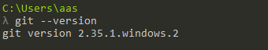

安装nodejs

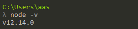


## 安装hexo

安装hexo-cli

```
npm install hexo-cli -g
```

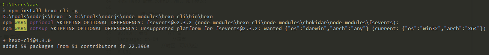

## 初始化博客

安装完成后, 在本地初始化博客站点搭建

```
hexo init ~/myBlog # ~/myBlog 即本地存放路径
```

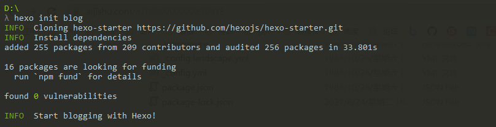

指定主题

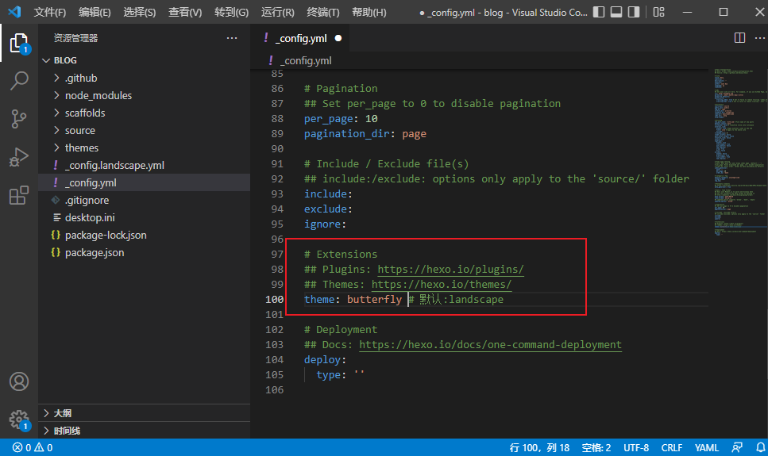


命令

**一键本地启动**：`hexo clean && hexo g && hexo s`

**一键部署**：`hexo clean && hexo g && hexo d`


## 安装butterfly

### git方式安装

```
git clone -b master https://github.com/jerryc127/hexo-theme-butterfly.git themes/butterfly
```

比较新的开发分支

```
git clone -b dev https://github.com/jerryc127/hexo-theme-butterfly.git themes/butterfly
```


### npm方式安装

```
npm i hexo-theme-butterfly
```

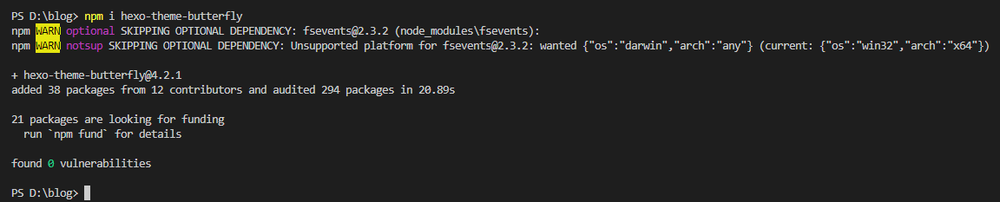

## 启用主题

主题目录下的`_config.yml`

```
theme: butterfly
```

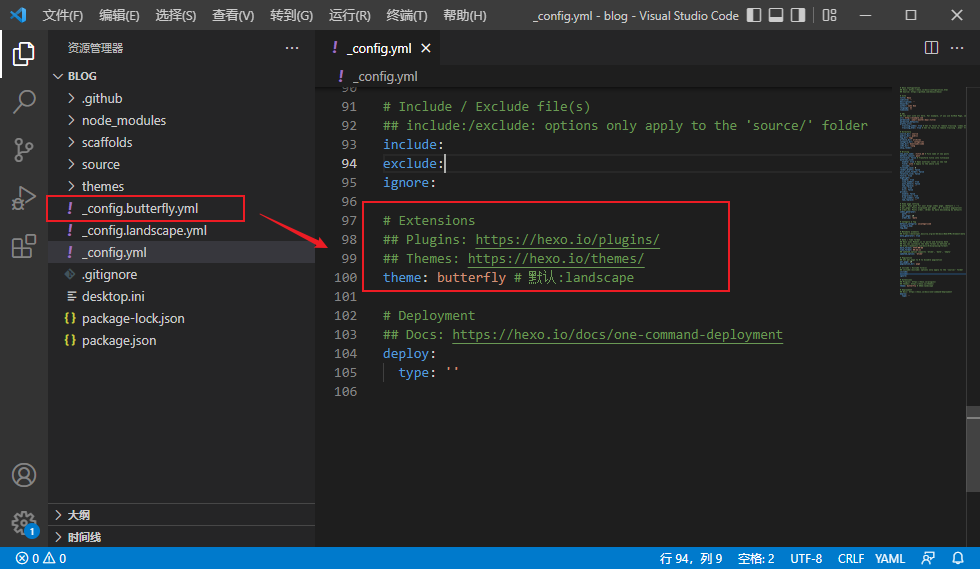

> 2024年4月26日15:06:26 报错：
>
> extends includes/layout.pug block content include includes/recent-posts.pug include includes/partial

解决方案：

```
npm install --save hexo-renderer-jade hexo-generator-feed hexo-generator-sitemap hexo-browsersync hexo-generator-archive
```


## 升级主题

```
npm update hexo-theme-butterfly
```

> 升级最佳实践：
>
> 拷贝主题目录下的 _config.yml 到根目录下,命名为 config.butterfly.yml


# 环境安装-docker

> 1. 首先在Github或者GitLab上编辑文章（或者本地`git push`)
> 2. 然后会触发`webhook`，自动将git上的md文件拉取到 `/opt/hexo/source/_posts` 文件夹
> 3. 接着自动执行`hexo g`操作，生成静态文件。
> 4. 最后通过网址访问，结束。

## 前置准备

- 有一个域名

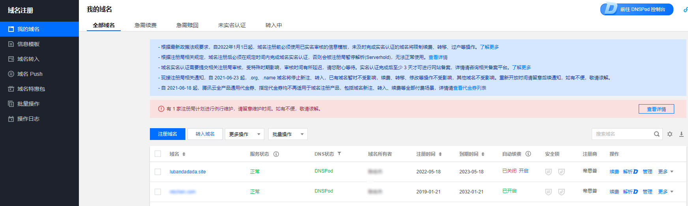

- 有一个服务器

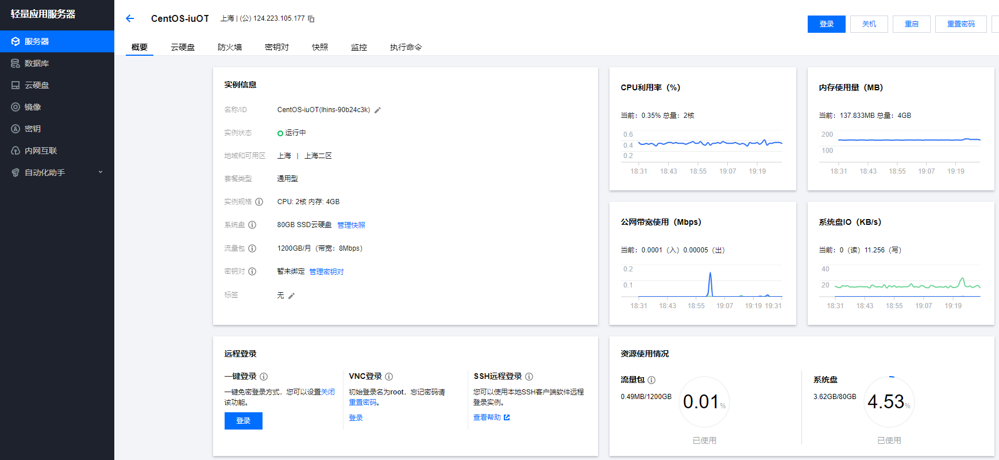

- 重装系统,腾讯云可以初始化带docker和docker compose

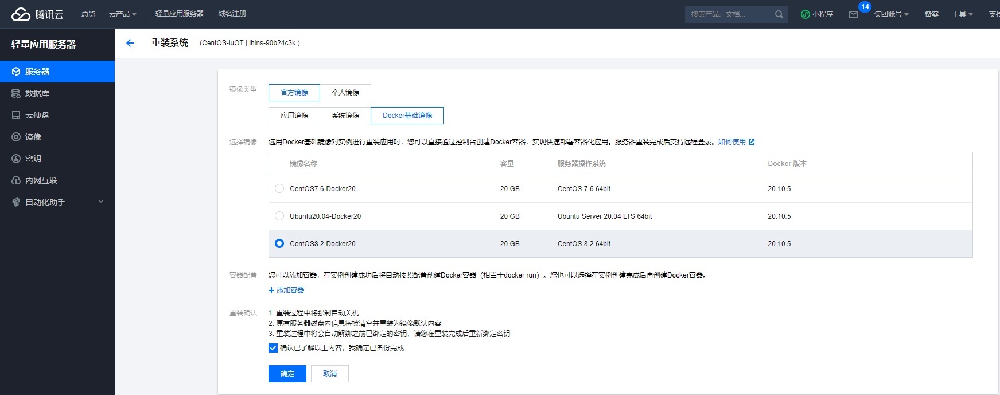

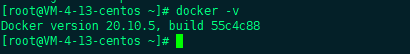

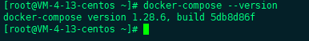

镜像也默认配置好了

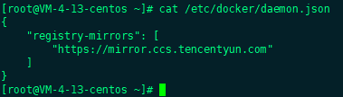

自带的,就略过了安装docker和docker compose的过程

## 创建Dockerfile

```dockerfile
# 创建 Dockerfile 文件
vi ~/dockerfile/Dockerfile

# 文件内容如下
# 基础镜像信息，我们需要一个 node 环境的镜像
FROM node:latest
# 维护者信息
MAINTAINER Martin <QQ账号@qq.com>
# 镜像操作指令。我们这里安装有关 Hexo 的环境
RUN npm install
# install hexo
RUN npm install hexo-cli -g 
RUN npm install hexo-deployer-git
# 构建镜像时，指定镜像的工作目录，之后的命令都是基于此工作目录，如果不存在，则会创建目录。
# 这里我们将工作目录设为镜像中的 /root/blog。之后我们的博客文件也正是放在这个文件夹里。
WORKDIR /root/blog
```

然后执行 Dockerfile 文件，创建我们的 Hexo 镜像。

```shell
docker build -t hexo-blog-image .
```


# 主题页面

## Page Front-matter

```markdown
---
title:
date:
type: （tags,link,categories这三个页面需要配置）
comments: (是否需要显示评论，默认true)
description:
top_img: (设置顶部图)
mathjax:
katex:
---
```

## Post Front-matter

```markdown
---
title:
date:
tags:
categories:
keywords:
description:
top_img: （除非特定需要，可以不写）
comments  是否显示评论（除非设置false,可以不写）
cover:  缩略图
toc:  是否显示toc （除非特定文章设置，可以不写）
toc_number: 是否显示toc数字 （除非特定文章设置，可以不写）
copyright: 是否显示版权 （除非特定文章设置，可以不写）
mathjax:
katex:
hide:
---
```


## 标签页

```
hexo new page tags

# source/tags/index.md增加type

---
title: 标签
date: 2022-05-13 21:20:45
layout: tags
type: "tags"
top_img: https://cdn.jsdelivr.net/gh/jerryc127/CDN@latest/Photo/tags.jpg
comments: false
--- 
```


## 分类页

```
hexo new page categories

# source/categories/index.md增加type

---
title: 分类
date: 2022-05-13 23:15:35
layout: "categories"
type: "categories"
top_img: https://cdn.jsdelivr.net/gh/jerryc127/CDN@latest/Photo/categories.jpg
comments: false
---

```


## 友情链接

### 添加页面

```
hexo new page link

# source/categories/index.md增加type

---
title: 友链
date: 2022-05-13 23:28:05
type: "link"
top_img: https://cdn.jsdelivr.net/gh/jerryc127/CDN@latest/Photo/friends.jpg
comments: true
--- 

如果你想添加自己的博客到`友链`页面,请提供

	yaml
     - name: 博客名
       link: 博客地址
       avatar: 博客頭像
       descr: 博客描述
```

### 添加友链

在hexo博客根目录创建source/_data/link.yml

```yaml
# 1. 確保你使用 Butterfly 主題
# 2. 確保你的網站是 https
# 3. 修改 source/_data/link.yml
# 4. 按要求新增內容
#     - name: 博客名
#       link: 博客地址
#       avatar: 博客頭像
#       descr: 博客描述
# 5. 發起 Pull requests ，合併到 butterfly.js.org 倉庫

- class_name: '<i class="fas fa-check-double" style="color: #FF6666;padding-right: 0.4rem"></i>網站'
  class_desc: '<span style="font-style: italic;">重要的事情説一遍</span>'
  link_list:
    - name: MYW
      link: https://crazywong.com/
      avatar: https://crazywong.com/img/avatar.png
      descr: 今日事,今日畢
    - name: Hexo
      link: https://hexo.io/zh-tw/
      avatar: https://d33wubrfki0l68.cloudfront.net/6657ba50e702d84afb32fe846bed54fba1a77add/827ae/logo.svg
      descr: 快速、簡單且強大的網誌框架
    - name: Butterfly
      link: https://github.com/jerryc127/hexo-theme-butterfly
      avatar: https://cdn.jsdelivr.net/gh/jerryc127/CDN/img/butterfly-github-avatar.png
      descr: '🦋 A Hexo Theme: Butterfly'

- class_name: '<i class="fas fa-fan" style="color:#00cccc;padding-right: 0.4rem"></i>示例'
  class_desc: '<span style="font-style: italic;">最可愛的朋友在這裏</span>'
  link_list:
    - name: 更多示例
      link: https://github.com/jerryc127/hexo-theme-butterfly/issues/76
      avatar: https://cdn.jsdelivr.net/gh/jerryc127/CDN/img/more-butterfly-demo-avatar.png
      descr: 更多使用 Butterfly 的網站
    - name: pai233の小窝
      link: https://blog.pai233.top/
      descr: Write Down My Life.
      avatar: https://blog.pai233.top/img/avatar.jpg  
    - name: GuKaifeng
      link: https://gukaifeng.cn/
      avatar: https://gukaifeng.cn/img/avatar.png
      descr: 客官，来呀，不看会后悔的哦！
```


## 音乐界面

- 参考：https://github.com/MoePlayer/hexo-tag-aplayer/blob/master/docs/README-zh_cn.md

```

```

这个会被`hexo-tag-aplayer`插件渲染为HTML格式:

```html
<div id="aplayer-uxAIfEUs" class="aplayer aplayer-tag-marker meting-tag-marker" data-id="000PeZCQ1i4XVs" data-server="tencent" data-type="artist" data-mode="circulation" data-autoplay="false" data-mutex="true" data-listmaxheight="340px" data-preload="auto" data-theme="#3F51B5"></div> 
```

我们如果不使用插件,就需要html格式编写+同时把主题配置文件中的aplayerInject开启

```html
<div class="aplayer" data-id="000PeZCQ1i4XVs" data-server="tencent" data-type="artist" data-mutex="true" data-preload="auto" data-theme="#3F51B5"></div> 
```

这样我们就可以不用使用多一个插件。怎么用随你自己

### 关闭 `asset_inject`

由于需要全局都插入 aplayer 和 meting 资源，为了防止插入重复的资源，需要把 asset_inject 设为 false

在 Hexo 的配置文件中

```yaml
aplayer:
  meting: true
  asset_inject: false
```


### 开启主题的 `aplayerInject`

在主题的配置文件中，enable 设为 true 和 per_page 设为 true

```yaml
# Inject the css and script (aplayer/meting)
aplayerInject:
  enable: true
  per_page: true
```


### 插入 Aplayer html

为了适配 hexo-tag-aplayer，主题内置的 Meting js 仍为 1.2 版本，并非最新的 2.x 版本。

Aplayer html 例子：

```html
<div class="aplayer no-destroy" data-id="60198" data-server="netease" data-type="playlist" data-fixed="true" data-autoplay="true"> </div>
```

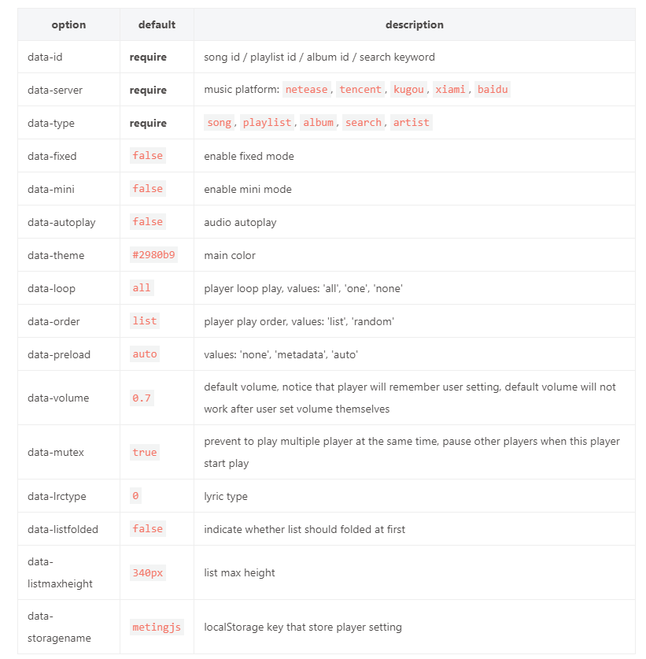

有关 `` 的选项列表如下:

| 选项          | 默认值     | 描述                                                        |
| ------------- | ---------- | ----------------------------------------------------------- |
| id            | **必须值** | 歌曲 id / 播放列表 id / 相册 id / 搜索关键字                |
| server        | **必须值** | 音乐平台: `netease`, `tencent`, `kugou`, `xiami`, `baidu`   |
| type          | **必须值** | `song`, `playlist`, `album`, `search`, `artist`             |
| fixed         | `false`    | 开启固定模式                                                |
| mini          | `false`    | 开启迷你模式                                                |
| loop          | `all`      | 列表循环模式：`all`, `one`,`none`                           |
| order         | `list`     | 列表播放模式： `list`, `random`                             |
| volume        | 0.7        | 播放器音量                                                  |
| lrctype       | 0          | 歌词格式类型                                                |
| listfolded    | `false`    | 指定音乐播放列表是否折叠                                    |
| storagename   | `metingjs` | LocalStorage 中存储播放器设定的键名                         |
| autoplay      | `true`     | 自动播放，移动端浏览器暂时不支持此功能                      |
| mutex         | `true`     | 该选项开启时，如果同页面有其他 aplayer 播放，该播放器会暂停 |
| listmaxheight | `340px`    | 播放列表的最大长度                                          |
| preload       | `auto`     | 音乐文件预载入模式，可选项： `none`, `metadata`, `auto`     |
| theme         | `#ad7a86`  | 播放器风格色彩设置                                          |


> require 代表着这些参数是必须要使用的，其它的参数则可以根据自己需要配置。

> 配置全局吸底，data-fixed 和 data-mini 也必须配置，配置为 true

> 如果使用 Pjax，则在 class 里需添加 no-destroy，这样防止切换页面时 Aplayer 被销毁

把 aplayer代码 插入到主题配置文件的 inject.bottom 去

```yaml
inject: 
  bottom: 
    - <div class="aplayer no-destroy" data-id="60198" data-server="netease" data-type="playlist" data-fixed="true" data-autoplay="true"> </div>

```

运行 Hexo 就可以看到网页左下角出现了 Aplayer

最后，如果你想切换页面时，音乐不会中断。请把主题配置文件的 pjax 设为 true


## 电影

- 豆瓣插件：整合参考：https://github.com/mythsman/hexo-douban

> 16年加入豆瓣,,,6年就登录了寥寥数次,就不整合了


## 图库

```
hexo new page photo

---
title: photo
date: 2022-05-15 01:53:32
comments: false
reward: false
description: 图片
aside: false
top_img: https://cdn.jsdelivr.net/gh/jerryc127/CDN/Photo/photo.jpg
---





# 创建 wallpaper/index.md
```

```
---
title: 壁紙
date: 2022-05-15 02:01:32
comments: false
description:
top_img: https://i.loli.net/2019/11/10/T7Mu8Aod3egmC4Q.png
type: galleryGroup
---




```

> 手动创建 /photo/wallpaper/index.md,或者用命令创建 new page wallpaper,然后将目录移动到photo目录下

## 404页面

主题内置了一个简单的404页面，可在设置中开启

本地预览时，访问出错的网站是不会跳到404页面的。

如需本地预览，请访问http://localhost:4000/404.html

```
# 一个简单的404页面
error_404:
  enable: true
  subtitle: "页面没有找到"
  background: 
```


# 主题配置

## 站点设置

### 语言

站点配置文件 `_config.yml`

```
language: zh-CN # deafult en
```

### 网站资料

标题、副标题和邮箱等个人资料，请修改博客根目录的`_config.yml`

```yaml
title: 一个蹒跚学步的架构师
subtitle: '为何我身处人群,却时感孤独'
description: '学习是一被子的事，被子外只有学习两个字'
keywords: java,架构师
author: 一个蹒跚学步的架构师
language: zh-CN # deafult en
timezone: 'Asia/Shanghai'
```

### 导航菜单

```yaml
menu:
  首页: / || fas fa-home
  归档: /archives/ || fas fa-archive
  标签: /tags/ || fas fa-tags
  分类: /categories/ || fas fa-folder-open
  照片: /photo/ || fa-solid fa-image
  # 娱乐||fas fa-list:
    # 音乐: /music/ || fas fa-music
    # 照片: /photo/ || fa-solid fa-image
    # 电影: /movies/ || fas fa-video
  友链: /link/ || fas fa-link
  闲言: /write/ || fa-solid fa-feather-pointed
  留言: /talk2me/ || fas fa-comment-dots
  关于: /about/ || fas fa-heart
  # 留言板: /messageboard/ || fas fa-comment-dots
  # 文檔||fas fa-book:
  #   🚀 快速開始: /posts/21cfbf15/
# 必须是 /xxx/，后面 || 分开，然后写图标名。菜单名称可自己修改
```

### 代码高亮

主题配置文件:

```yaml
highlight_theme: light # 代码高亮主题 darker / pale night / light / ocean / mac / mac light / false
highlight_copy: true # 代码是否启用复制功能
highlight_lang: true # show the code language
highlight_shrink: false # true代码框不展开，需点击 '>' 打开 false展开 none不显示'>'按钮，代码块展开
highlight_height_limit: false # unit: px 代码高度,超出会隐藏并显示展开按钮
code_word_wrap: false # 配置代码是否自动化行,默认false,设置为true,将换行,不会有横向滚动条
```

如果`code_word_wrap` 设置为 `true`,要自动换行,则要同步更改`_config.yml`

```yaml
highlight:
  enable: true
  line_number: true # 如果不要自动换行,这里要改成false
  auto_detect: false
  tab_replace: ''
  wrap: true
  hljs: false
```


## 图片

在source/下创建img目录,可以放置图片,比如avatar.png

然后在主题配置中可以使用/img/avatar.png设置头像


## npm插件

- 统计字数：npm i --save hexo-wordcount


## 社交图标

```yaml
social:
  # fab fa-github: https://github.com/xxxxx || Github
  # fas fa-envelope: mailto:xxxxxx@gmail.com || Email
  # fas fa-envelope: mailto:my@crazywong.com || Email
  # fas fa-rss: /atom.xml || RSS

```


## 文章


### 主页文章节选 (自动节选和文章页 description)

```yaml
# 主页文章节选只支持自动节选和文章页description。
# description： 只显示description
# both： 优先选择description，如果没有配置description，则显示自动节选的内容
# auto_excerpt：只显示自动节选
# false： 不显示文章内容
index_post_content:
  method: 3
  length: 500 # if you set method to 2 or 3, the length need to config

```

### 顶部图

- page 

```

```

- post

### 文章信息

创建时间、修改时间、标签、分类等

```yaml
post_meta:
  page:
    date_type: both # created or updated or both 主页文章日期是创建日或者更新日或都显示
    date_format: date # date/relative 显示日期还是相对日期
    categories: true # true or false 主页是否显示分类
    tags: true # true or false 主页是否显示标籤
    label: true # true or false 显示描述性文字
  post:
    date_type: both # created or updated or both 文章页日期是创建日或者更新日或都显示
    date_format: date # date/relative 显示日期还是相对日期
    categories: true # true or false 文章页是否显示分类
    tags: true # true or false 文章页是否显示标籤
    label: true # true or false 显示描述性文字
```

### 文章版权

```yaml
post_copyright:
  enable: true
  decode: false
  author_href:
  license: CC BY-NC-SA 4.0
  license_url: https://creativecommons.org/licenses/by-nc-sa/4.0/
```

### 文章打赏

```yaml
# Sponsor/reward
reward:
  enable: true
  QR_code:
    - img: /img/wechat.jpg
      link:
      text: wechat
    - img: /img/alipay.jpg
      link:
      text: alipay
```


### 文章封面

文章的 markdown 文档上，Front-matter 添加 `cover`, 并填上要显示的图片地址。如果不配置 `cover`, 可以设置显示默认的 `cover`.

```yaml
cover:
  # 是否显示文章封面
  index_enable: true
  aside_enable: true
  archives_enable: true
  # 封面显示的位置
  # 三个值可配置 left , right , both
  position: right
  # 当没有设置cover时，默认的封面显示
  default_cover:  
    - https://cdn.jsdelivr.net/gh/jerryc127/CDN@latest/cover/default_bg.png
    - https://cdn.jsdelivr.net/gh/jerryc127/CDN@latest/cover/default_bg2.png
    - https://cdn.jsdelivr.net/gh/jerryc127/CDN@latest/cover/default_bg3.png
    # - https://i.loli.net/2020/05/01/gkihqEjXxJ5UZ1C.jpg
```


### 文章隐藏

- https://github.com/printempw/hexo-hide-posts/blob/master/README_ZH.md

在文章的 Front-matter 添加

```markdown
hide: true
```

### 文章目录TOC

```yaml
# toc (目录)
toc:
  post: true
  page: false
  number: true
  expand: false
  style_simple: false # for post

```


### 相关文章

```yaml
# 相关文章推荐
# 原理: 根据文章tags的比重来推荐
related_post:
  enable: true
  limit: 6 # Number of posts displayed
  date_type: created # or created or updated 文章日期顯示創建日或者更新日

```


## 头像

```yaml
# Avatar (头像)
avatar:
  # img: https://i.loli.net/2021/02/24/5O1day2nriDzjSu.png
  # 也可以是相对路径
  img: /img/avatar.jpg
  effect: false
```


## Footer设置

### 博客年份

```yaml
footer:
  owner:
    enable: true
    since: 2022
```


### 页脚自定义文字

在页脚自定义文本的选项。通常你可以在这里写声明文本等。支持 HTML。

```html
custom_text: 欢迎访问小站 <a href="https://www.域名(xx.com)/">本站</a>! # 用来在页脚自定义文本的选项。通常你可以在这里写声明文本等。支持 HTML
  # custom_text也可以放ICP
  # <a href="icp链接"><span>备案号：xxxxxx</span></a>
```

### 右下角按鈕-简繁体

```yaml
# 简体繁体互换 
translate:
  enable: false
  # 默认按钮显示文字(网站是简体，应设置为'default: 繁')
  default: 繁
  #网站默认语言，1: 繁体中文, 2: 简体中文
  defaultEncoding: 2
  #延迟时间,若不在前, 要设定延迟翻译时间, 如100表示100ms,默认为0
  translateDelay: 0
  #当文字是简体时，按钮显示的文字
  msgToTraditionalChinese: "繁"
  #当文字是繁体时，按钮显示的文字
  msgToSimplifiedChinese: "简"
```

### 夜间模式

```yaml
# 夜间模式
darkmode:
  enable: true
  # dark mode和 light mode切换按钮
  button: true
  # Switch dark/light mode automatically (自動切換 dark mode和 light mode)
  # autoChangeMode: 1  Following System Settings, if the system doesn't support dark mode, it will switch dark mode between 6 pm to 6 am
  # autoChangeMode: 2  Switch dark mode between 6 pm to 6 am
  # autoChangeMode: false
  autoChangeMode: false
```

### 阅读模式

```yaml
# Read Mode (阅读模式)
# 閲读模式下会去掉除文章外的内容，避免干扰閲读。
readmode: true

```

## 侧边栏设置

### 访问人数

```yaml
# aside (侧边排版)
# 可自行决定哪个项目需要显示，可决定位置，也可以设置不显示侧边栏。
# --------------------------------------
aside:
  enable: true
  hide: false
  button: true
  mobile: true # 手机页面（ 显示宽度 < 768px ）是否显示aside内容
  position: right # left or right
  archives: true
  card_author:
    enable: true
    description:
    button:
      enable: false # github 按钮
      icon: fab fa-github
      text: GitHub
      link: https://github.com/Github账号
  # ======================= 公告卡片 =====================
  card_announcement:
    enable: true
    content: This is my Blog # 可以是html内容
      # 如果你在使用中遇到問題，請到 <a href="https://github.com/jerryc127/hexo-theme-butterfly/issues" style="color:#49b1f5">Github Issues</a> 或者 <a href="/messageboard/" style="color:#49b1f5">留言板</a> 進行反饋，你也可以加入 QQ 群（由於 QQ 群只能有 500 人，會定時清理潛水的人，不要同時申請 2 个 QQ 群）<div class="social-button">
      # <a class="button--animated" href="https://jq.qq.com/?_wv=1027&k=KU9105XR" target="_blank">QQ 1 群 👍</a>
      # <a class="button--animated" href="https://jq.qq.com/?_wv=1027&k=r1nK0DQz" target="_blank">QQ 2 群 👍</a>
      # <a class="button--animated" href="https://t.me/bu2fly" target="_blank">Telegram 👍</a>
      # </div>
  # ======================= 最新文章卡片 =====================
  card_recent_post:
    enable: true
    limit: 5 # if set 0 will show all
    sort: date # date or updated
    sort_order: # Don't modify the setting unless you know how it works
  # ======================= 分类卡片 =====================
  card_categories:
    enable: true
    limit: 0 # if set 0 will show all
    expand: false # none/true/false
    sort_order: # Don't modify the setting unless you know how it works
  # ======================= 标签卡片 =====================
  card_tags:
    enable: true
    limit: 40 # if set 0 will show all
    color: false
    sort_order: # Don't modify the setting unless you know how it works
  # ======================= 归档卡片 =====================
  card_archives:
    enable: true
    type: monthly # yearly or monthly
    format: YYYY年MM月 # MMMM YYYY # eg: YYYY年MM月
    order: -1 # Sort of order. 1, asc for ascending; -1, desc for descending
    limit: 8 # if set 0 will show all
    sort_order: # Don't modify the setting unless you know how it works
  # ======================= 网站信息卡片 =====================
  card_webinfo:
    enable: true
    post_count: true
    last_push_date: true
    sort_order: # Don't modify the setting unless you know how it works

```

### 网站运行时间

```yaml
# Time difference between publish date and now (网站运行时间)
# Formal: Month/Day/Year Time or Year/Month/Day Time
runtimeshow:
  enable: false
  publish_date: 2022/05/12 23:46:05
  ##网页开通时间
  #格式: 月/日/年 时间
  #也可以写成 年/月/日 时间

```

## 评论

### 选型

#### ~~Disqus~~

优点

- 功能强大

致命缺点

- 需要科学上网

#### ~~Gitment~~

Gitment 是第一款利用 GitHub Issues 的评论系统

作者弃坑了

#### ~~Gitalk~~

需要 GitHub OAuth

#### ~~Valine~~

- 从v1.4.0后暂停更新=开始闭源
- 结合LeanCloud 

#### Waline

从 Valine 衍生的带后端评论系统

部署

- LeanCloud国际版数据库+Vercel
- CloudBase云开发
- 自备服务器独立部署

```
# docker 部署
## 拉取MySQL镜像
docker pull mysql:5.7
## 创建实例容器并运行
docker run -p 3306:3306 --name mysql \
 --restart=always \
-e TZ=Asia/Shanghai \
-v /mydocker/mysql/conf:/etc/mysql/conf.d \
-v /mydocker/mysql/logs:/var/log/mysql \
-v /mydocker/mysql/data:/var/lib/mysql \
-e MYSQL_ROOT_PASSWORD=[password] \
-d mysql:5.7 --character-set-server=utf8mb4 --collation-server=utf8mb4_unicode_ci
## 在本地连接数据库
// 创建新的数据库并设置其编码
mysql>CREATE DATABASE 数据库名字 DEFAULT CHARSET=utf8 DEFAULT COLLATE utf8_unicode_ci;

// 创建新用户并设置密码
mysql>CREATE USER '用户名'@'服务器IP' IDENTIFIED BY '密码';

// 将新建的数据库管理权限赋予新建的用户
mysql>GRANT ALL PRIVILEGES ON '数据库名字' TO '用户名'@'%';

// 刷新权限
mysql>FLUSH PRIVILEGES;
## 导入waline.sql
## 构建waline镜像
git clone https://github.com/walinejs/waline.git
cd waline
docker build -t lizheming/waline -f packages/server/Dockerfile .
## 创建实例容器并运行
docker run -d --name waline -p 8360:8360 \
  -v /mydocker/waline/data:/app/data \
  -e TZ="Asia/Shanghai" \
  -e MYSQL_HOST="你的IP地址" \
  -e MYSQL_DB="数据库名" \
  -e MYSQL_USER="用户名" \
  -e MYSQL_PASSWORD="密码" \
  --restart always \
  lizheming/waline
## 本地访问
通过浏览器访问http://IP:8360/ui/register，便能看到注册界面
注册的第一个用户会成为后台管理员。

## 踩坑经历
如果你的Waline没有正常运行，无法注册，可以通过以下指令查看日志：
docker logs -f --tail 20 waline

## 反向代理
可以通过Nginx配置反代
```

- [waline.sql](https://github.com/walinejs/waline/blob/main/assets/waline.sql)

由于部署Waline的服务器没有绑定域名，所以也没办法通过HTTPS访问，解决办法如下：

1. 给服务器备案（如果你的服务器不在大陆那就不需要了）并绑定域名，配置SSL证书后即可通过HTTPS协议访问。
2. ~~部署在CLoudbase或者类似的云服务上，这些服务自带域名。~~
3. ~~换用Valine，Valine没有服务端，数据库可以放在LeanCloud上，所以没有这个问题。~~

#### ~~畅言~~

- 国内搜狐

缺点：

- 没有强制 `https` 跳转
- 自行给你插广告且占位很大
- 用户还须绑定手机号。

#### ~~LiveRe来必力~~

- 韩国
- 支持QQ、微信、GitHub、百度、微博、豆瓣、Twitter 等等登录
- **不**需要科学上网
- 用户少

#### ~~utterances~~

- 基于 GitHub Issues 的评论

此前一直挂着梯子没注意，实际上 utterances 需要请求 GitHub 的 API，所以不开梯子也很难成功加载。

#### Giscus 

- 国内似乎尚未被墙，国内也可以正常加载评论
- 它受到了 [utterances](https://utteranc.es/) 的启发，但相比有着更好的权限划分，以及 Discussions 本就是为了讨论而生，因此可以直接回复对应内容，且使用 reactions （各式各样的图标反馈）。

#### twikoo


| 第三方评论系统 | 开源         | 速度 | 国内是否可直接访问 | 可否实现 PJAX                                    | 数据可靠性                               |
| -------------- | ------------ | ---- | ------------------ | ------------------------------------------------ | ---------------------------------------- |
| Disqus         | ❌            | 慢   | ❌                  | ✔️                                                | 市场占有率高，可靠                       |
| Gitalk         | ✔️            | 中等 | ✔️                  | [❌](https://github.com/gitalk/gitalk/issues/205) | GitHub 还在一天，就永远不用担心          |
| LiveRe         | ❌            | 较慢 | ✔️                  | ❌                                                | 存疑                                     |
| Valine         | 薛定谔的开源 | 快   | ✔️                  | ✔️                                                | 取决于 LeanCloud（看你是不是付费用户了） |
| Waline         | ✔️            | 快   | ✔️                  | ✔️                                                | 同上，等价于带后端的 Valine              |

以下是同一个页面加载不同评论系统时 `Dev Tools -> Network` 的信息。（None 为不加载评论系统）

> Gitalk 懒得配置了，速度应该在 LiveRe 与 Valine 之间，影响不大。

| name   | request | transferred | resources | Finish  | DOMCOntentLoaded | Load   |
| ------ | ------- | ----------- | --------- | ------- | ---------------- | ------ |
| None   | 35      | 315 kB      | 850 kB    | 1.53 s  | 672 ms           | 1.52s  |
| Disqus | 94      | 1.9 MB      | 4.0 MB    | 16.51 s | 1.38 s           | 2.24 s |
| LiveRe | 60      | 1.1 MB      | 3.2 MB    | 13.06 s | 1.14 s           | 1.98 s |
| Valine | 43      | 408 kB      | 1.1 MB    | 5.66 s  | 1.29 s           | 1.83 s |

简而言之，Disqus 最重最慢，Valine 最轻最快。与之对应的自然是功能强弱。

## 分享

默认的sharejs就行

## 搜索

- 本地搜索：npm i --save hexo-generator-search

```yaml
# Local search ，需要安装  hexo-generator-search
local_search:
  enable: true
  preload: false # 预加载，开启后，进入网页后会自动加载搜索文件。关闭时，只有点击搜索按钮后，才会加载搜索文件
  CDN:
```


## 网页收录

如果需要搜索引擎收录网站，可能需要登录对应搜索引擎的管理平台进行提交。
各自的验证码可从各自管理平台拿到

```yaml
site_verification:
  # - name: google-site-verification
  #   content: NdIUXAOVyGnnBhcrip0ksCawbdAzT0hlBZDE9u4jx6k
  # - name: msvalidate.01
  #   content: 567E47D75E8DCF1282B9623AD914701E
  # - name: baidu-site-verification
  #   content: code-pE5rnuxcfD
  # - name: google-site-verification
  #   content: xxxxxx
  # - name: baidu-site-verification
  #   content: xxxxxxx
```


## 分析统计

```yaml
# Analysis（分析）
# --------------------------------------

# Baidu Analytics
# https://tongji.baidu.com/web/welcome/login
baidu_analytics:

# Google Analytics
# https://analytics.google.com/analytics/web/
google_analytics:

# CNZZ Analytics
# https://www.umeng.com/
cnzz_analytics:

# Cloudflare Analytics
# https://www.cloudflare.com/zh-tw/web-analytics/
cloudflare_analytics:

# Microsoft Clarity
# https://clarity.microsoft.com/
microsoft_clarity:
```


## 广告

```yaml
# Google Adsense (谷歌广告)
google_adsense:
  enable: false
  auto_ads: true
  js: https://pagead2.googlesyndication.com/pagead/js/adsbygoogle.js
  client:
  enable_page_level_ads: true

# Insert ads manually (手動插入廣告)
# ad:
#   index:
#   aside:
#   post:
# ad:
#   index: <ins class="adsbygoogle" style="display:block" data-ad-format="fluid" data-ad-layout-key="-fb+5w+4e-db+86" data-ad-client="ca-pub-8919908724705274" data-ad-slot="1538867630"></ins><script>(adsbygoogle=window.adsbygoogle||[]).push({})</script>
#   aside: <ins class="adsbygoogle" style="display:block" data-ad-client="ca-pub-8919908724705274" data-ad-slot="8108145410" data-ad-format="auto" data-full-width-responsive="true"></ins><script>(adsbygoogle=window.adsbygoogle||[]).push({})</script>
#   post: <ins class="adsbygoogle" style="display:block" data-ad-format="fluid" data-ad-layout-key="-fb+5w+4e-db+86" data-ad-client="ca-pub-8919908724705274" data-ad-slot="5978969231"></ins><script>(adsbygoogle=window.adsbygoogle||[]).push({})</script>


```

# 主题美化


## 主题颜色

```yaml
# 可以修改大部分UI颜色
# Theme color for customize
# Notice: color value must in double quotes like "#000" or may cause error!

# theme_color:
#   enable: true
#   main: "#49B1F5"
#   paginator: "#00c4b6"
#   button_hover: "#FF7242"
#   text_selection: "#00c4b6"
#   link_color: "#99a9bf"
#   meta_color: "#858585"
#   hr_color: "#A4D8FA"
#   code_foreground: "#F47466"
#   code_background: "rgba(27, 31, 35, .05)"
#   toc_color: "#00c4b6"
#   blockquote_padding_color: "#49b1f5"
#   blockquote_background_color: "#49b1f5"
#   scrollbar_color: "#49b1f5"
#   meta_theme_color_light: "ffffff"
#   meta_theme_color_dark: "#0d0d0d"
```


## 网站背景

```yaml
# 网站背景
# 默认显示白色，可设置图片或者颜色
# 图片格式 url(http://xxxxxx.com/xxx.jpg)
# 颜色（HEX值/RGB值/顔色单词/渐变色)
# 留空 不显示背景
# 留意: 如果你的网站根目录不是'/',使用本地图片时，需加上你的根目录。
# 例如：网站是 https://yoursite.com/blog,引用一张img/xx.png图片，则设置background为 `url(/blog/img/xx.png)
# background:'#49B202'
# background: url(https://i.loli.net/2019/09/09/5oDRkWVKctx2b6A.png)
background:

```

## footer 背景

footer 的背景会与 `top_img` 的一致，当设置 false 时，将与主题色一致。


```yaml
# footer是否显示图片背景(与top_img一致)
# 留空/false 显示默认的顔色
# img链接    图片的链接，显示所配置的图片
# 顔色(
#   HEX值 - #0000FF
#   RGB值 - rgb(0,0,255)
#   顔色单词 - orange
#   渐变色 - linear-gradient( 135deg, #E2B0FF 10%, #9F44D3 100%)
# ）
# true 显示跟 top_img 一样
footer_bg: false 
```

## 打字效果

```yaml
# Typewriter Effect (打字效果)
# https://github.com/disjukr/activate-power-mode
activate_power_mode:
  enable: false
  colorful: true # open particle animation (冒光特效)
  shake: true #  open shake (抖动特效)
  mobile: false
```

### 彩带

### 鼠标点击效果

```yaml
# Mouse click effects: fireworks (鼠标点击效果: 烟火特效)
fireworks:
  enable: false
  zIndex: 9999 # -1 or 9999
  mobile: false

# Mouse click effects: Heart symbol (鼠标点击效果: 爱心)
click_heart:
  enable: false
  mobile: false

# Mouse click effects: words (鼠标点击效果: 文字)
ClickShowText:
  enable: false
  text:
    # - I
    # - LOVE
    # - YOU
  fontSize: 15px
  random: false
  mobile: false
```

## 标题级别美化

会改变 ol、ul、h1-h5 的样式

```yaml
# Beautify (美化页面显示)
beautify:
  enable: true
  field: post # site/post
  title-prefix-icon: '\f0c1' # '\f0c1'
  title-prefix-icon-color: '#F47466' # '#F47466'
```

## 自定义字体

```yaml
# 自定义字体和字体大小
# Don't modify the following settings unless you know how they work (非必要不要修改)
font:
  global-font-size:
  code-font-size:
  font-family: -apple-system, BlinkMacSystemFont, "Segoe UI", "Helvetica Neue", Lato, Roboto, "PingFang SC", "Microsoft JhengHei", "Microsoft YaHei", sans-serif
  code-font-family: consolas, Menlo, "PingFang SC", "Microsoft JhengHei", "Microsoft YaHei", sans-serif
 
```

## 网站副标题

```yaml
# the subtitle on homepage (主页subtitle)
# 可设置主页中显示的网站副标题或者喜欢的座右铭。
subtitle:
  enable: true
  # Typewriter Effect (打字效果)
  effect: true
  # loop (循環打字)
  loop: true
  # source 調用第三方服務
  # source: false 關閉調用
  # source: 1  調用一言網的一句話（簡體） https://hitokoto.cn/
  # source: 2  調用一句網（簡體） http://yijuzhan.com/
  # source: 3  調用今日詩詞（簡體） https://www.jinrishici.com/
  # subtitle 會先顯示 source , 再顯示 sub 的內容
  source: false
  # 如果關閉打字效果，subtitle 只會顯示 sub 的第一行文字
  sub:
    - 鹏北海&#44;凤朝阳&#44;又携书剑路茫茫
    - 明年此日青云去&#44;却笑人间举子忙
```

## 主页文章 cover 位置

```yaml
# 主页top_img显示大小
# The top_img settings of home page
# default: top img - full screen, site info - middle (默認top_img全屏，site_info在中間)
# The position of site info, eg: 300px/300em/300rem/10% (主頁標題距離頂部距離)
index_site_info_top:
# The height of top_img, eg: 300px/300em/300rem (主頁top_img高度)
index_top_img_height:
```

## 字数统计

```yaml
# wordcount (字数统计)
# see https://butterfly.js.org/posts/ceeb73f/#字數統計
wordcount:
  enable: true
  post_wordcount: true
  min2read: true
  total_wordcount: true
```

### 文章置顶

```javascript
npm uninstall hexo-generator-index --save 
npm install hexo-generator-index-pin-top --save
```

要在文章的 `front-matter` 区域里添加 `top: True` 属性来把这篇文章置顶。

## 放大查看模式

```yaml
# Lightbox (图片放大查看模式)
# --------------------------------------
# You can only choose one, or neither (只能選擇一個 或者 兩個都不選)

# medium-zoom
# https://github.com/francoischalifour/medium-zoom
medium_zoom: false

# fancybox
# http://fancyapps.com/fancybox/3/
fancybox: true
```

## snackbar弹窗

```yaml
# Snackbar (Toast Notification 彈窗)
# https://github.com/polonel/SnackBar
# position 彈窗位置
# 可選 top-left / top-center / top-right / bottom-left / bottom-center / bottom-right
# 开启后操作会在制定的位置弹窗出现,比如复制成功
snackbar:
  enable: false
  position: bottom-left
  bg_light: '#49b1f5' # The background color of Toast Notification in light mode
  bg_dark: '#121212' # '#1f1f1f' # The background color of Toast Notification in dark mode
```


# 部署

## 部署到自己的服务器

安装 git nginx

```
yum -y update
yum install -y git nginx
```

配置启动nginx

```
# 配置nginx
安装完后，rpm -qa | grep nginx 查看
启动nginx：systemctl start nginx
加入开机启动：systemctl enable nginx
查看nginx的状态：systemctl status nginx

mkdir -p /data/www/hexo
chmod -R 755 /data/www/hexo

vim /etc/nginx/nginx.conf
# vim 查找: /listen 80

......
server {
      listen       80 default_server;
      listen       [::]:80 default_server;
      server_name  www.mynamcoder.com; # 填写个人域名
      root         /data/www/hexo;
  }
......
```


测试index.html

```
# 测试index.html
vim /data/www/hexo/index.html

<!DOCTYPE html>
<html>
  <head>
    <title></title>
    <meta charset="UTF-8">
  </head>
  <body>
    <p>Nginx running</p>
  </body>
</html>
```

配置git

```
# 配置git
mkdir /data/GitLibrary
chmod -R 755 /data/GitLibrary
> 初始化裸库
cd /data/GitLibrary
git init --bare hexo.git
> 创建 Git 钩子(hook)：用于指定 Git 的源代码 和 Git 配置文件
vim /data/GitLibrary/hexo.git/hooks/post-receive

#!/bin/bash
git --work-tree=/data/www/hexo --git-dir=/data/GitLibrary/hexo.git checkout -f

> 保存并退出后, 给该文件添加可执行权限
chmod +x /data/GitLibrary/hexo.git/hooks/post-receive
```

本地配置

```
============================== 本地配置 ===============================
git --version
node -v
npm -v
npm install hexo-deployer-git --save

url: http://www.域名(xx.com)      //个人域名
......
# 一个是服务器
deploy:
- type: git
  repo: root@xx.xx.xx.xx:/data/GitLibrary/hexo.git
  branch: master
```

部署

```
======================== 部署 ===================================
> 清除缓存
hexo clean
> 生成静态页面:
hexo generate
> 将本地静态页面目录部署到云服务器
hexo deploy
===> 完成 Hexo 个人博客网站搭建, 通过服务器 IP 或者域名即可访问（验证:默认有些样式）


hexo clean && hexo g && hexo s
hexo clean && hexo g && hexo d
```

## 部署到github pages

```
安装插件：
npm install hexo-deployer-git --save

项目配置文件：

deploy:
    type: git
    repo: git@github.com:<username>/<username>.github.io.git #<username>填写你的github username
    branch: main

创建github仓库：
<username>.github.io
settings -> pages -> 配置域名和强制https

部署：
hexo clean && hexo g && hexo d
```


# 快捷使用

## 标题

```
# H1
## H2
### H3
#### H4
##### H5
###### H6

除了井号风格,也支持下划线风格(只能1级和2级)

Alt-H1
======

Alt-H2
------
```

## 强调

```
强调，也就是斜体，带有 *星号* 或 _下划线_。
加粗强调，又名粗体，带有**星号**或__下划线__。
加粗强调下划线斜体结合：**星号和_下划线_**。
~~删除线.~~ 
```

## 列表

```
1. 有序列表

2. 有序列表

   * 无序列表

3. 有序列表

   1. 有序列表

4. 有序列表

   段落可以和列表对齐
也可以用加号和减号缩进   
+ 列表加号
+ 列表加号
  + 列表减号
  - 列表减号
- 列表减号
```

## 内嵌HTML

```html
<p>比如段落标签加上键盘效果 <kbd>ctrl</kbd>+<kbd>alt</kbd>+<kbd>del</kbd>.</p>
```

## 定义列表

```html
<dl>
    <dt>有序列表头</dt>
    <dd>有序列表体</dd>
    <dt>有序列表头</dt>
    <dd>有序列表体</dd>
</dl>
```

## 链接

```
[我是个连接](https://www.baidu.com)

[我是个连接，悬浮可以看到标题](https://www.baidu.com "我是链接标题")

[我是引用链接,需要配合下面的注引使用][任意不区分大小写的参考文本]

[我是相对路径引用](../blob/master/LICENSE)

[您可以使用数字作为参考样式的链接定义,指向下方的数字注引][1]

或者留空,[直接使用文字本身作为关联注引的]

# 以下为注引,指向上面的连接

[任意不区分大小写的参考文本]: https://www.baidu.com
[1]: https://www.baidu.com
[直接使用文字本身作为关联注引的]: https://www.baidu.com
```

## 图片

```
悬浮可以看到文字

内联写法：


引用文本:
![图片文字][这个指向图片注引]

# 以下是注引

[这个指向图片注引]: https://hexo.io/icon/favicon-196x196.png "悬浮可以看到图片上的文字"
```

## 代码高亮

javascript

```javascript
function $initHighlight(block, cls) {
  try {
    if (cls.search(/\bno\-highlight\b/) != -1)
      return process(block, true, 0x0F) +
             ` class="${cls}"`;
  } catch (e) {
    /* handle exception */
  }
  for (var i = 0 / 2; i < classes.length; i++) {
    if (checkCondition(classes[i]) === undefined)
      console.log('undefined');
  }

  return (
    <div>
      <web-component>{block}</web-component>
    </div>
  )
}

export $initHighlight; 
```

python

```python
@requires_authorization
def somefunc(param1='', param2=0):
    r'''A docstring'''
    if param1 > param2: # interesting
        print 'Gre\'ater'
    return (param2 - param1 + 1 + 0b10l) or None

class SomeClass:
    pass

>>> message = '''interpreter
... prompt''' 
```

没有指定语言

```
没有指明语言，所以没有语法高亮。 但是让我们加入一个<b>标签</b>。
```

rust

```rust
#[derive(Debug)]
pub enum State {
    Start,
    Transient,
    Closed,
}

impl From<&'a str> for State {
    fn from(s: &'a str) -> Self {
        match s {
            "start" => State::Start,
            "closed" => State::Closed,
            _ => unreachable!(),
        }
    }
} 
```

json

```json
[
  {
    "title": "apples",
    "count": [12000, 20000],
    "description": {"text": "...", "sensitive": false}
  },
  {
    "title": "oranges",
    "count": [17500, null],
    "description": {"text": "...", "sensitive": false}
  }
] 
```

html

```html
<!DOCTYPE html>
<title>Title</title>

<style>body {width: 500px;}</style>

<script type="application/javascript">
  function $init() {return true;}
</script>

<body>
  <p checked class="title" id='title'>Title</p>
  <!-- here goes the rest of the page -->
</body> 
```

cpp

```cpp
#include <iostream>

int main(int argc, char *argv[]) {

  /* An annoying "Hello World" example */
  for (auto i = 0; i < 0xFFFF; i++)
    cout << "Hello, World!" << endl;

  char c = '\n';
  unordered_map <string, vector<string> > m;
  m["key"] = "\\\\"; // this is an error

  return -2e3 + 12l;
}
```

sql

```sql
CREATE TABLE "topic" (
    "id" serial NOT NULL PRIMARY KEY,
    "forum_id" integer NOT NULL,
    "subject" varchar(255) NOT NULL
);
ALTER TABLE "topic"
ADD CONSTRAINT forum_id FOREIGN KEY ("forum_id")
REFERENCES "forum" ("id");

-- Initials
insert into "topic" ("forum_id", "subject")
values (2, 'D''artagnian'); 
```

java

```java
/**
 * @author John Smith <john.smith@example.com>
*/
package l2f.gameserver.model;

public abstract class L2Char extends L2Object {
  public static final Short ERROR = 0x0001;

  public void moveTo(int x, int y, int z) {
    _ai = null;
    log("Should not be called");
    if (1 > 5) { // wtf!?
      return;
    }
  }
}
```

css

```css
@font-face {
  font-family: Chunkfive; src: url('Chunkfive.otf');
}

body, .usertext {
  color: #F0F0F0; background: #600;
  font-family: Chunkfive, sans;
}

@import url(print.css);
@media print {
  a[href^=http]::after {
    content: attr(href)
  }
} 
```

bash

```bash
#!/bin/bash

###### CONFIG
ACCEPTED_HOSTS="/root/.hag_accepted.conf"
BE_VERBOSE=false

if [ "$UID" -ne 0 ]
then
  echo "Superuser rights required"
  exit 2
fi

genApacheConf(){
  echo -e "# Host ${HOME_DIR}$1/$2 :"
} 
```

ini

```ini
; boilerplate
[package]
name = "some_name"
authors = ["Author"]
description = "This is \
a description"

[[lib]]
name = ${NAME}
default = True
auto = no
counter = 1_000 
```


## 表格

```
|                |ASCII                          |HTML                         |
|----------------|-------------------------------|-----------------------------|
|单引号		   |`'Isn't this fun?'`            |'Isn't this fun?'            |
|双引号           |`"Isn't this fun?"`            |"Isn't this fun?"            |
|破折号           |`-- is en-dash, --- is em-dash`|-- is en-dash, --- is em-dash|
```

冒号可用于对齐列

```
| 默认左对齐     | 居中           | 右对齐  |
| ------------- |:-------------:| -----:|
| 文本      		| 文本		   |	文本	|
| 文本     		| 文本      		|   文本 	|
| 文本	 		| 文本      		|   文本 	|
```

外部的竖号不写也可以

```
Markdown | Less 	 | Pretty
--- 	 | --- 		 | ---
*Still*  | `renders` | **nicely**
1 		 | 2 		 | 3
```

html的表格

<table>
    <tr>
        <td>笨蛋</td>
    </tr>
</table>


## 块引用

markdown语法

```
> 这是一段块引用

> 这是一个很长的行，当它换行时仍然会被正确引用。哦，男孩，让我们继续写，以确保它足够长，可以真正为每个人包装。哦，你可以_把_ **Markdown ** 放到一个块引用中。
```

## 水平线

```
# 连字符
---

# 星号
***

# 下划线
___
```

## Youtube 视频

不能直接播放耶...

```html
# html语法
<a href="https://www.youtube.com/watch?feature=player_embedded&v=ARted4RniaU
" target="_blank"></a>

# markdowny语法
[](https://www.youtube.com/watch?v=ARted4RniaU) 
```


## **==以下是辅助标签==**

> 标籤外挂是Hexo独有的功能，并不是标準的Markdown格式。

## Tabs

强大的多tab插件,并列tab,还可以嵌套

```

-------------------------------------- 第1个tab -------------------------------------------------
<!-- tab 出師表 -->
臣亮言：先帝創業未半而中道崩殂，今天下三分，益州疲弊，此誠危急存亡之秋也。然侍衞之臣不懈於內，忠志之士忘身於外者，蓋追先帝之殊遇，欲報之於陛下也。誠宜開張聖聽，以光先帝遺德，恢弘志士之氣，不宜妄自菲薄，引喻失義，以塞忠諫之路也。
宮中府中，俱為一體；陟罰臧否，不宜異同：若有作奸犯科及為忠善者，宜付有司論其刑賞，以昭陛下平明之理；不宜偏私，使內外異法也。
侍中、侍郎郭攸之、費禕、董允等，此皆良實，志慮忠純，是以先帝簡拔以遺陛下：愚以為宮中之事，事無大小，悉以諮之，然後施行，必能裨補闕漏，有所廣益。
將軍向寵，性行淑均，曉暢軍事，試用於昔日，先帝稱之曰“能”，是以眾議舉寵為督：愚以為營中之事，悉以諮之，必能使行陣和睦，優劣得所。
親賢臣，遠小人，此先漢所以興隆也；親小人，遠賢臣，此後漢所以傾頹也。先帝在時，每與臣論此事，未嘗不歎息痛恨於桓、靈也。侍中、尚書、長史、參軍，此悉貞良死節之臣，願陛下親之、信之，則漢室之隆，可計日而待也。
臣本布衣，躬耕於南陽，苟全性命於亂世，不求聞達於諸侯。先帝不以臣卑鄙，猥自枉屈，三顧臣於草廬之中，諮臣以當世之事，由是感激，遂許先帝以驅馳。後值傾覆，受任於敗軍之際，奉命於危難之間：爾來二十有一年矣。
先帝知臣謹慎，故臨崩寄臣以大事也。受命以來，夙夜憂歎，恐託付不效，以傷先帝之明；故五月渡瀘，深入不毛。今南方已定，兵甲已足，當獎率三軍，北定中原，庶竭駑鈍，攘除奸兇，興復漢室，還於舊都。此臣所以報先帝而忠陛下之職分也。至於斟酌損益，進盡忠言，則攸之、禕、允之任也。
願陛下託臣以討賊興復之效，不效，則治臣之罪，以告先帝之靈。若無興德之言，則責攸之、禕、允等之慢，以彰其咎；陛下亦宜自謀，以諮諏善道，察納雅言，深追先帝遺詔。臣不勝受恩感激。
今當遠離，臨表涕零，不知所言。
<!-- endtab -->

-------------------------------------- 第2个tab -------------------------------------------------
<!-- tab 圖庫 -->




<!-- endtab -->

-------------------------------------- 第3个tab -------------------------------------------------
<!-- tab 李白 -->
李白（701年5月19日－762年11月30日），字太白，號青蓮居士，中國唐朝詩人，自言祖籍隴西成紀（今甘肅省天水市秦安縣），先世西涼武昭王李暠之後，與李唐皇室同宗。幼時內遷，寄籍劍南道綿州（今四川省江油市青蓮鎮）。另外，郭沫若研究認為李白出生於吉爾吉斯碎葉河上的碎葉城，屬唐安西都護府（今楚河州托克馬克市），該説有一定影響。有「詩仙」、「詩俠」、「酒仙」、「謫仙人」等稱呼，活躍於盛唐，為傑出的浪漫主義詩人。與杜甫合稱「李杜」。被賀知章驚呼為「天上謫仙」。


-------------------------------------- 第3个tab 中的 第1个子tab -------------------------------------
<!-- tab 行路難-->
金樽清酒鬥十千，玉盤珍羞值萬錢。
停杯投箸不能食，拔劍四顧心茫然。
欲渡黃河冰塞川，將登太行雪暗天。
閒來垂釣碧溪上，忽復乘舟夢日邊。
行路難，行路難，多歧路，今安在？
長風破浪會有時，直掛雲帆濟滄海。
大道如青天，我獨不得出。
羞逐長安社中兒，赤雞白狗賭梨慄。
彈劍作歌奏苦聲，曳裾王門不稱情。
淮陰市井笑韓信，漢朝公卿忌賈生。
君不見昔時燕家重郭隗，擁篲折節無嫌猜。
劇辛樂毅感恩分，輸肝剖膽效英才。
昭王白骨縈蔓草，誰人更掃黃金台？
行路難，歸去來！
有耳莫洗潁川水，有口莫食首陽蕨。
含光混世貴無名，何用孤高比雲月？
吾觀自古賢達人，功成不退皆殞身。
子胥既棄吳江上，屈原終投湘水濱。
陸機雄才豈自保，李斯税駕苦不早。
華亭鶴唳詎可聞，上蔡蒼鷹何足道。
君不見吳中張翰稱達生，秋風忽憶江東行。
且樂生前一杯酒，何須身後千載名！
<!-- endtab -->

-------------------------------------- 第3个tab 中的 第2个子tab -------------------------------------
<!-- tab 將進酒 -->
君不見，黃河之水天上來，
奔流到海不復回？
君不見，高堂明鏡悲白髮，
朝如青絲暮成雪？
人生得意須盡歡，
莫使金樽空對月。
天生我材必有用，
千金散盡還復來。
烹羊宰牛且為樂，
會須一飲三百杯。
岑夫子，丹丘生，
將進酒，君莫停。
與君歌一曲，
請君為我側耳聽：
鐘鼓饌玉不足貴，
但願長醉不願醒。
古來聖賢皆寂寞，
惟有飲者留其名。
陳王昔時宴平樂，
斗酒十千恣歡謔。
主人何為言小錢？
徑須沽取對君酌。
五花馬，千金裘。
呼兒將出換美酒，
與爾同銷萬古愁。
<!-- endtab -->

-------------------------------------- 第3个tab 中的 第3个子tab -------------------------------------
<!-- tab 清平調 -->
《清平調詞三首》是唐代大詩人李白的組詩作品，共三首七言樂府詩。第一首從空間角度寫，以牡丹花比楊貴妃的美豔；第二首從時間角度寫，表現楊貴妃的受寵幸；第三首總承一、二兩首，把牡丹和楊貴妃與君王糅合，融為一體。全詩構思精巧，辭藻豔麗，將花與人渾融在一起寫，描繪出人花交映、迷離恍惚的景象，顯示了詩人高超的藝術功力。


-------------------------------------- 第3个tab 中的 第3个子tab 中的 第1个子子tab --------------------
<!-- tab 清平調(一) -->
雲想衣裳花想容，春風拂檻露華濃；
　
若非羣玉山頭見，會向瑤台月下逢。
<!-- endtab -->

-------------------------------------- 第3个tab 中的 第3个子tab 中的 第2个子子tab --------------------
<!-- tab 清平調(二) -->
一枝紅豔露凝香，雲雨巫山空斷腸。
　
借問漢宮誰得似？可憐飛燕倚新粧。
<!-- endtab -->

-------------------------------------- 第3个tab 中的 第3个子tab 中的 第3个子子tab --------------------
<!-- tab 清平調(三) -->
名花傾國兩相歡，常得君王帶笑看。
　
解識春風無限恨，沉香亨北倚闌千。
<!-- endtab -->


<!-- endtab -->


<!-- endtab -->


# tabs 名字可以加图标 李白@@fas fa-bom
```

效果图：

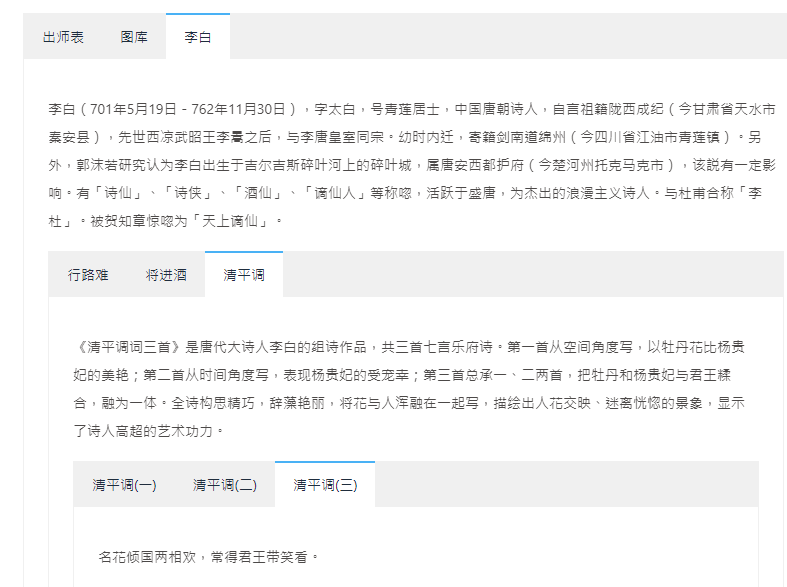

## 按钮

### Inline

```markdown
这是个网站,点击按钮跳转 
这是个网站,点击按钮跳转 
```

效果：

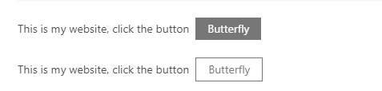

### Block

```markdown
这是个网站,点击按钮跳转 
这是个网站,点击按钮跳转 
这是个网站,点击按钮跳转 
```

效果：

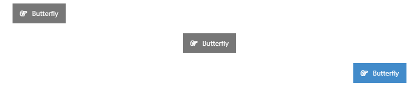

### option

```markdown
<div class="btn-center">







</div>
```

效果：

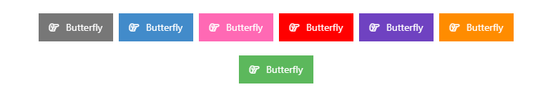


```markdown
<div class="btn-center">







</div>
```

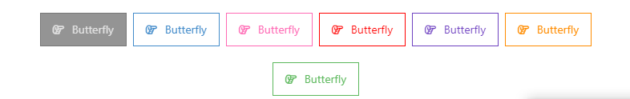

## 内联图片

> 主题中的图片都是默认以块级元素显示，如果你想以内联元素显示，可以使用这个标签外挂。

```


[src]      :    图片链接
[height]   ：   图片高度限制【可选】
```

比如：

```
你看我长得漂亮不


我觉得很漂亮 
```

效果：


## label

> 高亮所需的文字

```

text	文字
color	【可选】背景颜色，默认为 default default/blue/pink/red/purple/orange/green
```

比如：

```
臣亮言：创业未半，而。今天下三分，，此诚也！然侍衞之臣，不懈于内；，忘身于外者，盖追先帝之殊遇，欲报之于陛下也。诚宜开张圣听，以光先帝遗德，恢弘志士之气；不宜妄自菲薄，引喻失义，以塞忠谏之路也。
宫中、府中，俱为一体；陟罚臧否，不宜异同。若有、，及为忠善者，宜付有司，论其刑赏，以昭陛下平明之治；不宜偏私，使内外异法也。 
```

效果：

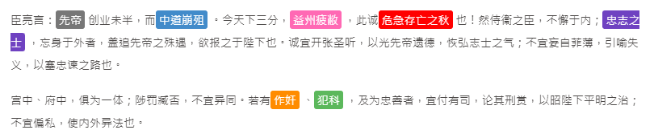

## 时间线

```

<!-- timeline title -->
xxxxx
<!-- endtimeline -->
<!-- timeline title -->
xxxxx
<!-- endtimeline -->


title	标题/时间线
color	timeline 颜色 default(留空) / blue / pink / red / purple / orange / green
```

比如：

```

<!-- timeline 01-02 -->
这是测试页面
<!-- endtimeline -->

```

效果：

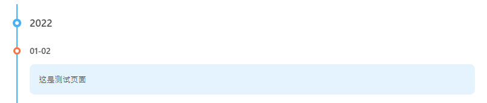

带上颜色

```

<!-- timeline 01-02 -->
这是测试页面
<!-- endtimeline -->

```

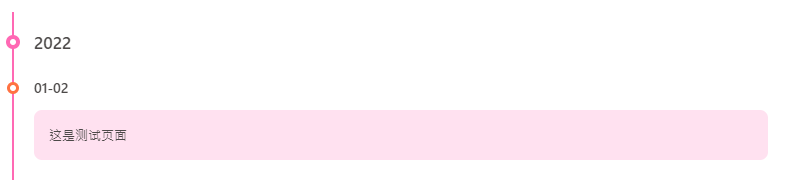

## flink

> 可在任何界面插入类似友情链接列表效果,内容格式与友情链接界面一样，支持 yml 格式

```

xxxxxx

```

比如：

```yaml

- class_name: 友情链接
  class_desc: 那些人，那些事
  link_list:
    - name: JerryC
      link: https://jerryc.me/
      avatar: https://jerryc.me/img/avatar.png
      descr: 今日事,今日毕
    - name: Hexo
      link: https://hexo.io/zh-tw/
      avatar: https://d33wubrfki0l68.cloudfront.net/6657ba50e702d84afb32fe846bed54fba1a77add/827ae/logo.svg
      descr: 快速、简单且强大的网誌框架

- class_name: 网站
  class_desc: 值得推荐的网站
  link_list:
    - name: Youtube
      link: https://www.youtube.com/
      avatar: https://i.loli.net/2020/05/14/9ZkGg8v3azHJfM1.png
      descr: 视频网站
    - name: Weibo
      link: https://www.weibo.com/
      avatar: https://i.loli.net/2020/05/14/TLJBum386vcnI1P.png
      descr: 中国最大社交分享平台
    - name: Twitter
      link: https://twitter.com/
      avatar: https://i.loli.net/2020/05/14/5VyHPQqR6LWF39a.png
      descr: 社交分享平台
 
```

效果：

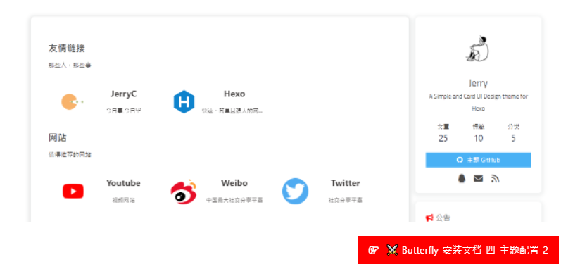

## mermaid

```

pie
    title Key elements in Product X
    "Calcium" : 42.96
    "Potassium" : 50.05
    "Magnesium" : 10.01
    "Iron" :  5

```

效果图

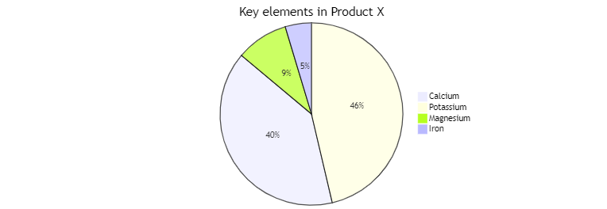

```

gantt
    title A Gantt Diagram
    dateFormat  YYYY-MM-DD
    section Section
    A task           :a1, 2014-01-01, 30d
    Another task     :after a1  , 20d
    section Another
    Task in sec      :2014-01-12  , 12d
    another task      : 24d

```

效果图：

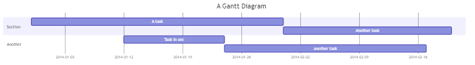

```

gantt
    title A Gantt Diagram
    dateFormat  YYYY-MM-DD
    section Section
    A task           :a1, 2014-01-01, 30d
    Another task     :after a1  , 20d
    section Another
    Task in sec      :2014-01-12  , 12d
    another task      : 24d

```

效果：

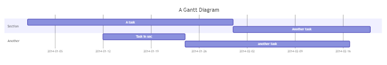

## Note (Bootstrap Callout)

### 方法一

> simple

```markdown

默认 提示块标签



default 提示块标签



primary 提示块标签



success 提示块标签



info 提示块标签



warning 提示块标签



danger 提示块标签

```

效果：

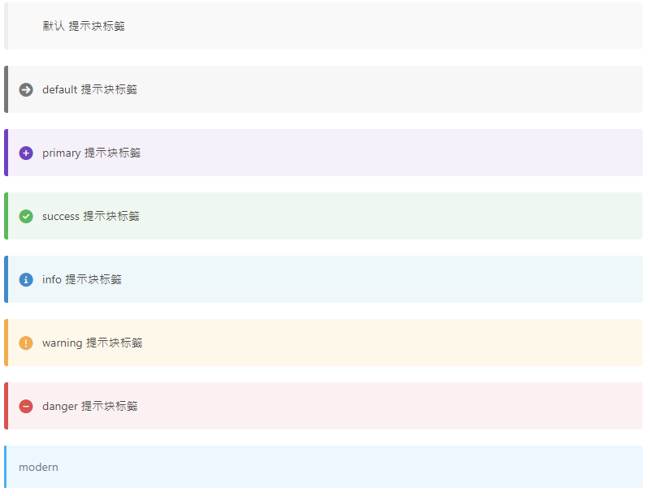

> modern

```markdown

默認 提示块标签



default 提示块标签



primary 提示块标签



success 提示块标签



info 提示块标签



warning 提示块标签



danger 提示块标签

```

效果：

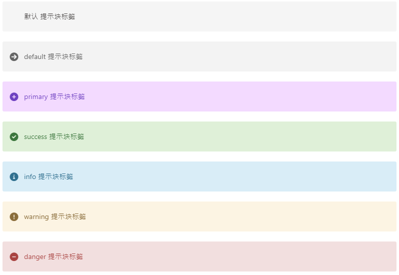

> flat

```markdown

默認 提示块标签



default 提示块标签



primary 提示块标签



success 提示块标签



info 提示块标签



warning 提示块标签



danger 提示块标签

```

 效果：

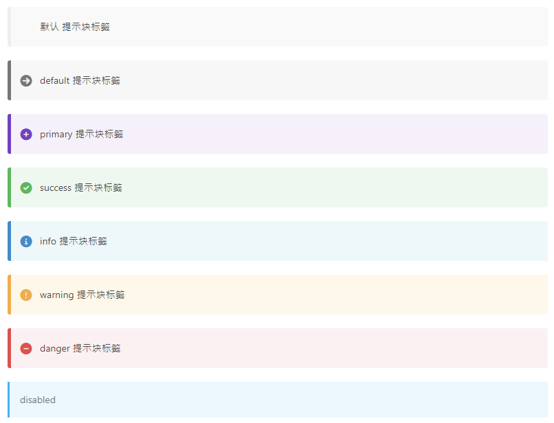

> disabled

```markdown

默認 提示块标签



default 提示块标签



primary 提示块标签



success 提示块标签



info 提示块标签



warning 提示块标签



danger 提示块标签

```

 效果：

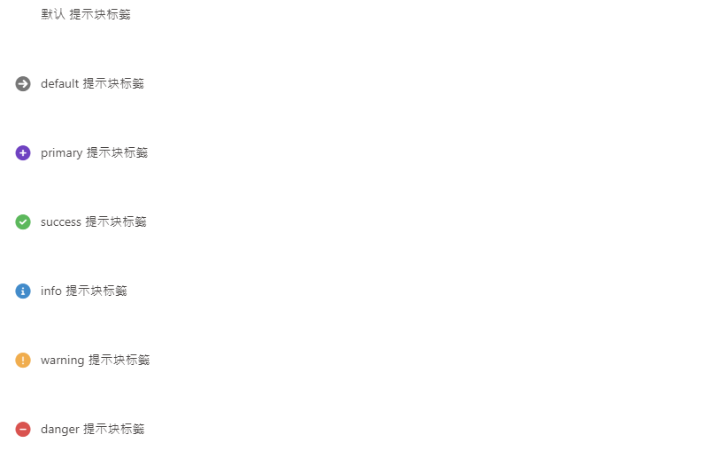

> no-icon

```markdown

默認 提示块标签



default 提示块标签



primary 提示块标签



success 提示块标签



info 提示块标签



warning 提示块标签



danger 提示块标签

```

效果：

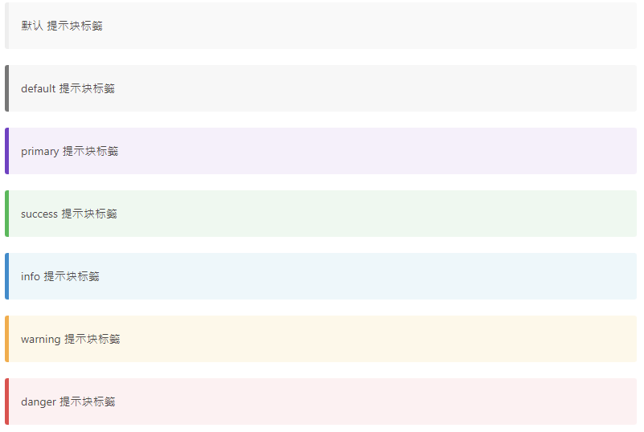

### 方法二

> simple

```markdown

你是刷 Visa 還是 UnionPay


2021年快到了....


小心開車 安全至上


這是三片呢？還是四片？


你是刷 Visa 還是 UnionPay


剪刀石頭布


前端最討厭的瀏覽器

```

效果：

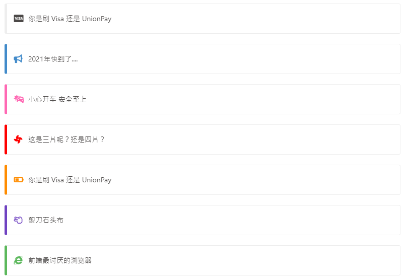

> modern

```markdown

你是刷 Visa 還是 UnionPay


2021年快到了....


小心開車 安全至上


這是三片呢？還是四片？


你是刷 Visa 還是 UnionPay


剪刀石頭布


前端最討厭的瀏覽器

```

效果：

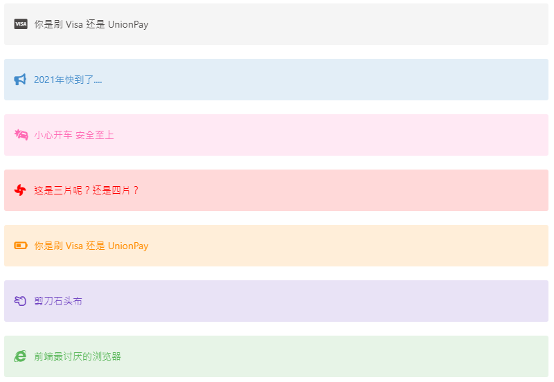

> flat

```markdown

你是刷 Visa 還是 UnionPay


2021年快到了....


小心開車 安全至上


這是三片呢？還是四片？


你是刷 Visa 還是 UnionPay


剪刀石頭布


前端最討厭的瀏覽器

```

效果：

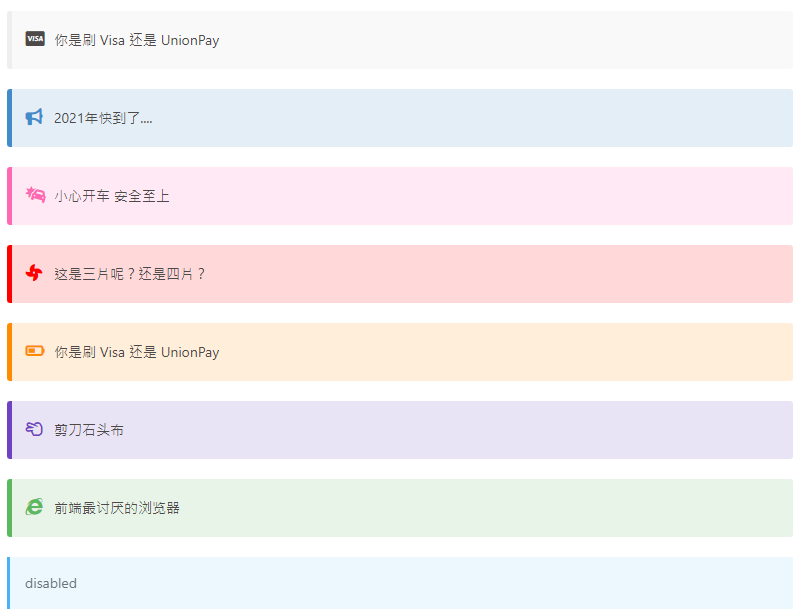

> disabled

```markdown

你是刷 Visa 還是 UnionPay


2021年快到了....


小心開車 安全至上


這是三片呢？還是四片？


你是刷 Visa 還是 UnionPay


剪刀石頭布


前端最討厭的瀏覽器

```

效果：


> no-icon

```markdown

你是刷 Visa 還是 UnionPay


2021年快到了....


小心開車 安全至上


這是三片呢？還是四片？


你是刷 Visa 還是 UnionPay


剪刀石頭布


前端最討厭的瀏覽器

```

效果：

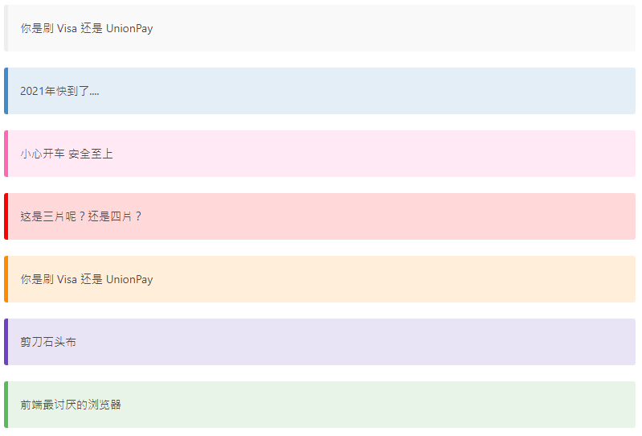


## Gallery 相册图库

```html
<div class="gallery-group-main">



</div>
```


效果：


## Gallery 相册

```




```

效果：


## tag-hide

隐藏文字，点击显示文章

> 请注意，tag-hide内的标签外挂content内都不建议有h1 - h6 等标题。因为Toc会把隐藏内容标题也显示出来，而且当滚动屏幕时，如果隐藏内容没有显示出来，会导致Toc的滚动出现异常。
>
> ( content不能包含英文逗号，可用&sbquo;)

### hide-inline

```
哪个英文字母最酷？ 

门里站着一个人? 
```

效果：


### hide-block

```
美女






```

效果：


### hide-toggle

````

在你的博客根目錄裏

```git
git clone -b master https://github.com/jerryc127/hexo-theme-butterfly.git themes/Butterfly
```

如果想要安裝比較新的dev分支，可以

```git
git clone -b dev https://github.com/jerryc127/hexo-theme-butterfly.git themes/Butterfly
```







````

效果：

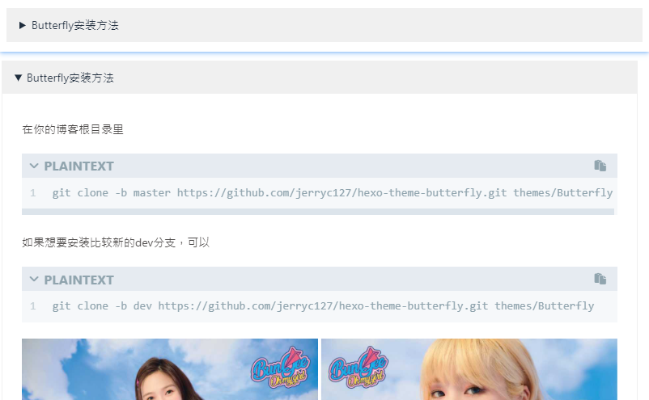


Tag plugins are different from post tags. They are ported from Octopress and provide a useful way for you to quickly add specific content to your posts.

## ==以下是内置的标签==

## Block Quote

非常适合在您的帖子中添加引号，并带有可选的作者、来源和标题信息

```

content

```

**No arguments. Plain blockquote.**

```

Lorem ipsum dolor sit amet, consectetur adipiscing elit. Pellentesque hendrerit lacus ut purus iaculis feugiat. Sed nec tempor elit, quis aliquam neque. Curabitur sed diam eget dolor fermentum semper at eu lorem.

```

效果：

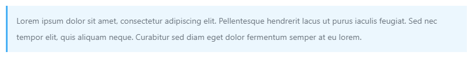

**Quote from a book**

```

Do not just seek happiness for yourself. Seek happiness for all. Through kindness. Through mercy.

```

效果：

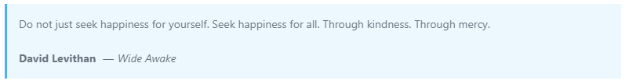

**Quote from Twitter**

```

NEW: DevDocs now comes with syntax highlighting. http://devdocs.io

```

效果：

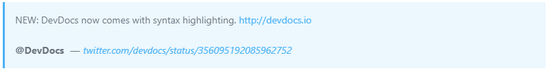

**Quote from an article on the web**

```

Every interaction is both precious and an opportunity to delight.

```

效果：

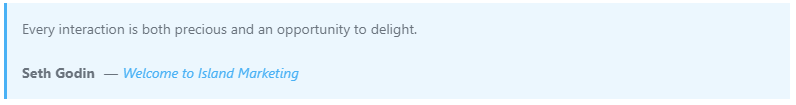

## Code Block

```

code snippet

```

| Extra Options | Description                                                  | Default |
| ------------- | ------------------------------------------------------------ | ------- |
| `line_number` | 显示行号                                                     | `true`  |
| `highlight`   | 启用代码突出显示                                             | `true`  |
| `first_line`  | 指定第一行号                                                 | `1`     |
| `mark`        | 行突出显示特定行，每个值用逗号分隔。使用破折号指定数字范围<br/>例如：`mark:1,4-7,10` 会标记 1, 4 to 7 和 10 行。 |         |
| `wrap`        | 代码块用 [`<table>`](https://developer.mozilla.org/en-US/docs/Web/HTML/Element/table) 包裹。 | `true`  |

**A plain code block**

```

alert('Hello World!');

```

效果：

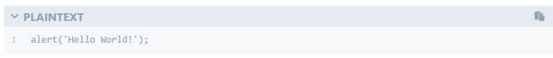

**Specifying the language**

```

[rectangle setX: 10 y: 10 width: 20 height: 20];

```

效果：

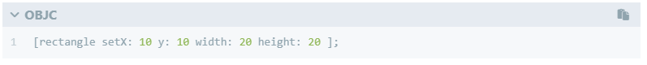

**Adding a caption to the code block**

```

array.map(callback[, thisArg])

```

效果:

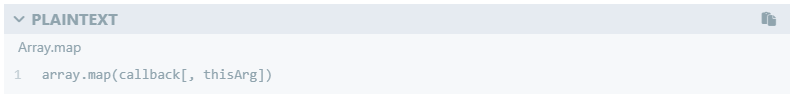

**Adding a caption and a URL**

```

_.compact([0, 1, false, 2, '', 3]);
=> [1, 2, 3]

```

效果：

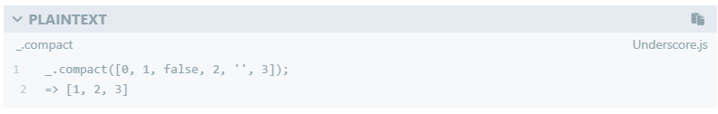

## Backtick Code Block

这与使用代码块相同，但使用三个反引号来分隔代码块。

```

&#96`` [language] [title] [url] [link text]
code snippet
&#96;``

```

效果：

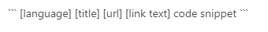

## Pull Quote

To add pull quotes to your posts:

```

content

```

### Left

```

Lorem ipsum dolor sit amet, consectetur adipiscing elit.

```

效果：

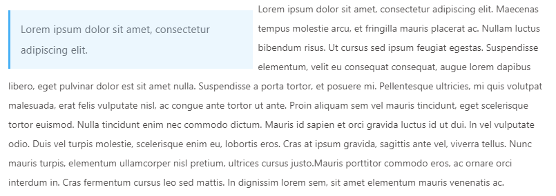

### Right

```

Lorem ipsum dolor sit amet, consectetur adipiscing elit.

```

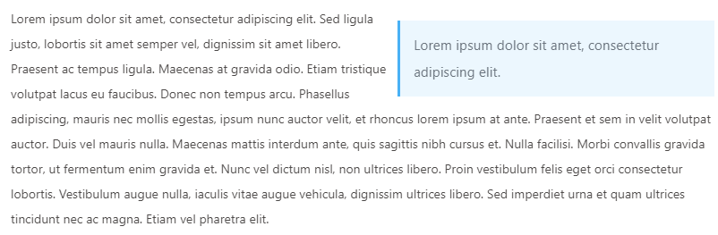

## jsFiddle

```


```

效果：

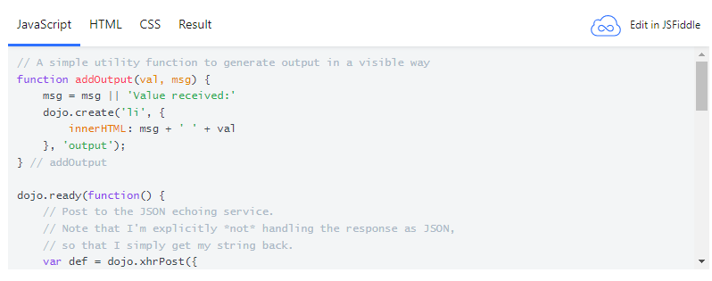

## Gist

To embed a Gist snippet:

```


```

效果：

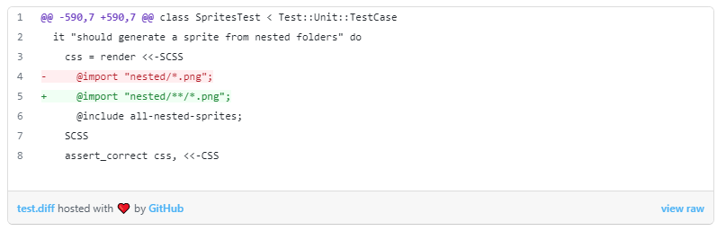

## iframe

嵌入页面,注意这里是嵌入页面,可以是动态的,是可以用的网站

```

{% iframe 'https://butterfly.js.org/' 100% 300px %}
```

效果：


## Image

插入指定大小的图片

```


```


## Link

Inserts a link with `target="_blank"` attribute.

```


```

效果：

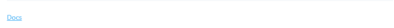

## Include Code

在 `source/downloads/code` 文件夹中插入代码片段。可以通过配置中的 code_dir 选项指定文件夹位置。

```

```

**嵌入 test.js 的全部内容**

```

```

**仅嵌入第 3 行**

```

```

**嵌入 5 到 8 行**

```

```

**从第5行开始嵌入**

```

```

**将第 5 行嵌入到文件末尾**

```

```

## YouTube

插入 YouTube 视频,可以播放

```

```

```

```

效果：


## Vimeo

插入响应式或指定大小的 Vimeo 视频。

```

```

```

```

效果:


## Include Posts

Include links to other posts.

```


```

使用此标签时，您可以忽略永久链接和文件夹信息，例如语言和日期.

比如： ``.

只要帖子的文件名是 `how-to-bake-a-cake.md`, 即使帖子位于 `source/posts/2015-02-my-family-holiday` 并且有固定链接 `2018/en/how-to-bake-a-cake`.也能起作用

您可以自定义要显示的文本，而不是显示帖子的标题。不支持在 Markdown 语法 `[]()` 中使用 post_path。

帖子的标题和自定义文本默认转义。您可以使用转义选项来禁用转义。

例如：

**Display title of the post.**

```

```

```

```


**Display custom text.**

```

```

```

```


**Escape title.**

```

```

```

```


**Do not escape title.**

```

```

```

```


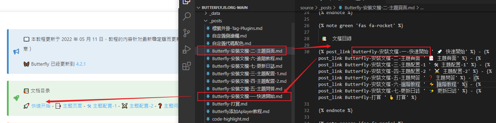

## Include Assets

包括帖子资产

```



```

## Raw

如果某些内容导致您的帖子出现处理问题，请使用原始标签将其包装起来以避免呈现错误。

```

content

```


## Page Front-matter

> 用于页面配置

```markdown
---
title:
date:
updated:
type:
comments:
description:
keywords:
top_img:
mathjax:
katex:
aside:
aplayer:
highlight_shrink:
---
```

| 寫法             | 解釋                                                         |
| ---------------- | ------------------------------------------------------------ |
| title            | 【必需】頁面標題                                             |
| date             | 【必需】頁面創建日期                                         |
| type             | 【必需】標籤、分類和友情鏈接三個頁面需要配置                 |
| updated          | 【可选】頁面更新日期                                         |
| description      | 【可选】頁面描述                                             |
| keywords         | 【可选】頁面關鍵字                                           |
| comments         | 【可选】顯示頁面評論模塊(默認 true)                          |
| top_img          | 【可选】頁面頂部圖片                                         |
| mathjax          | 【可选】顯示mathjax(當設置mathjax的per_page: false時，才需要配置，默認 false) |
| katex            | 【可选】顯示katex(當設置katex的per_page: false時，才需要配置，默認 false) |
| aside            | 【可选】顯示側邊欄 (默認 true)                               |
| aplayer          | 【可选】在需要的頁面加載aplayer的js和css,請參考文章下面的`音樂` 配置 |
| highlight_shrink | 【可选】配置代碼框是否展開(true/false)(默認為設置中highlight_shrink的配置) |

## Post Front-matter

> 用于文章页配置

```markdown
---
title:
date:
updated:
tags:
categories:
keywords:
description:
top_img:
comments:
cover:
toc:
toc_number:
toc_style_simple:
copyright:
copyright_author:
copyright_author_href:
copyright_url:
copyright_info:
mathjax:
katex:
aplayer:
highlight_shrink:
aside:
---
```

| 寫法                  | 解釋                                                         |
| :-------------------- | ------------------------------------------------------------ |
| title                 | 【必需】文章標題                                             |
| date                  | 【必需】文章創建日期                                         |
| updated               | 【可选】文章更新日期                                         |
| tags                  | 【可选】文章標籤                                             |
| categories            | 【可选】文章分類                                             |
| keywords              | 【可选】文章關鍵字                                           |
| description           | 【可选】文章描述                                             |
| top_img               | 【可选】文章頂部圖片                                         |
| cover                 | 【可选】文章縮略圖(如果沒有設置top_img,文章頁頂部將顯示縮略圖，可設為false/圖片地址/留空) |
| comments              | 【可选】顯示文章評論模塊(默認 true)                          |
| toc                   | 【可选】顯示文章TOC(默認為設置中toc的enable配置)             |
| toc_number            | 【可选】显示toc_number(默认为设置中toc的number配置)          |
| toc_style_simple      | 【可选】顯示 toc 簡潔模式                                    |
| copyright             | 【可选】顯示文章版权模块(默認為設置中post_copyright的enable配置) |
| copyright_author      | 【可选】文章版权模块的`文章作者`                             |
| copyright_author_href | 【可选】文章版权模块的`文章作者`鏈接                         |
| copyright_url         | 【可选】文章版权模块的`文章連結`鏈接                         |
| copyright_info        | 【可选】文章版权模块的`版權聲明`文字                         |
| mathjax               | 【可选】顯示mathjax(當設置mathjax的per_page: false時，才需要配置，默認 false) |
| katex                 | 【可选】顯示katex(當設置katex的per_page: false時，才需要配置，默認 false) |
| aplayer               | 【可选】在需要的頁面加載aplayer的js和css,請參考文章下面的`音樂` 配置 |
| highlight_shrink      | [可选]配置代码是否展开(true/false)(默認為設置中highlight_shrink的配置) |
| aside                 | 【可选】顯示側邊欄 (默認 true)                               |
| sticky                | 1属性来把这篇文章置顶。数值越大，置顶的优先级越大,需要hexo-generator-index>=2.0.0 |

