阅读本篇文章，你可以收获什么?

- 至少把环境跑起来吧。。。不然我写这个有啥意义啊喂:weary:
- en，你还可以对halo工程搭建有一丢丢的了解
- 还可以对主题开发有一丢丢的了解，虽然了解了也没啥用:laughing:
- 还可以get一丢丢的~~美化~~技巧:leopard:
- 以及我的一些心路历程。。。专注技术吧少年，博客够用就行，千万别陷进去。~~虽然我说了你也不一定会听:ear::~~ear:

<!-- more-->


# hao主题食用记录

## halo链接

- 官网：https://halo.run/
- 文档：https://docs.halo.run/
- 社区：https://bbs.halo.run/
- github仓库：https://github.com/halo-dev/halo
- awesome-halo2.0推荐主题、插件清单:https://github.com/halo-sigs/awesome-halo 

- hao主题：https://github.com/liuzhihang/halo-theme-hao

- 在线体验：https://demo.halo.run/console `demo/P@ssw0rd123..`
- Telegram频道：https://t.me/halo_dev

其他连接

- nginx proxy manager官网：https://nginxproxymanager.com/
- 1Panel安装: https://1panel.cn/docs/installation/online_installation/

> 挑一种最优雅的方式搭建部署

## Docker环境安装（可行）

> 选个干净的环境，最好时重装玩一下=.=

- Docker 安装文档：https://docs.docker.com/engine/install/
- Docker Compose 安装文档：https://docs.docker.com/compose/install/
- Docker compose 命令：https://www.cnblogs.com/lucky9322/p/13648252.html

> 安装docker的时候一起安装docker compose 就行

1、卸载旧版本

```shell
yum remove docker \
                  docker-client \
                  docker-client-latest \
                  docker-common \
                  docker-latest \
                  docker-latest-logrotate \
                  docker-logrotate \
                  docker-engine
```

2、设置存储库

```shell
yum install -y yum-utils
yum-config-manager \
    --add-repo \
    https://download.docker.com/linux/centos/docker-ce.repo
```

3、安装引擎

```shell
yum install docker-ce docker-ce-cli containerd.io docker-buildx-plugin docker-compose-plugin
```

4、启动docker

```
systemctl start docker
```

5、验证docker 安装是否成功

```
docker run hello-world # 当容器运行时，它会打印一条确认消息并退出。
```

6、验证docker compose 安装是否成功

```
docker compose version
```

> 如果要升级，卸载重装就行


## 使用1Panel管理服务器（可行）

> 挺方便的，可以看docker容器等，还有应用商店

```
curl -sSL https://resource.fit2cloud.com/1panel/package/quick_start.sh -o quick_start.sh && sh quick_start.sh

# 安装成功得到如下信息
[1Panel Log]: 请用浏览器访问面板: 
[1Panel Log]: http://$LOCAL_IP:40304 
[1Panel Log]:  
[1Panel Log]: 项目官网: https://1panel.cn 
[1Panel Log]: 项目文档: https://1panel.cn/docs 
[1Panel Log]: 代码仓库: https://github.com/1Panel-dev/1Panel 
[1Panel Log]: 快速安装: https://github.com/1Panel-dev/1Panel/releases/latest 

记得开火墙
```

- 安装MySQL
- 安装halo
- 安装OpenResty

- 腾讯云dnspod创建访问token，1Panel创建网站和证书
- 访问到后台：http://ip:8090/console 做初始化
- 搞定

可以设置为域名访问

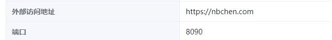

## 用Nginx Proxy Manager做反向代理

- 官网：https://nginxproxymanager.com/
- 快速安装：https://nginxproxymanager.com/guide/#quick-setup

> 我们要用域名而不是IP+端口的方式来访问我们的服务！

### 安装

我们还是用compose创建我们的docker npm服务 (简称npm)

创建存放compose文件的目录

```
mkdir ~/npm && cd ~/npm
 

vim docker-compose.yml
```

配置文件具体内容：

```yaml
version: '3'
services:
  app:
    image: 'jc21/nginx-proxy-manager:latest'
    restart: unless-stopped
    ports:
      - '80:80'              # 不建议修改端口
      - '81:81'              # 可以把冒号左边的 81 端口修改成你服务器上没有被占用的端口
      - '443:443'            # 不建议修改端口
    volumes:
      - ./data:/data         # 点号表示当前文件夹，冒号左边的意思是在当前文件夹下创建一个 data 目录，用于存放数据，如果不存在的话，会自动创建
      - ./letsencrypt:/etc/letsencrypt  # 点号表示当前文件夹，冒号左边的意思是在当前文件夹下创建一个 letsencrypt 目录，用于存放证书，如果不存在的话，会自动创建
```

> 防火墙要放开

启动npm

```
docker-compose up -d     # -d 表示后台运行

docker compose up -d     # 如果你用的是 docker-compose-plugin 的话，用这条命令
```

用docker命令也可以看到安装好的容器

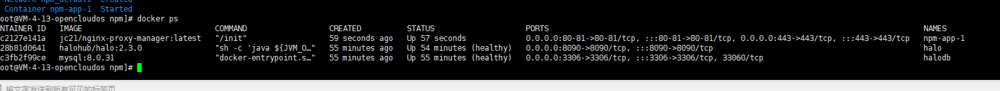

报错：

```
nginx: [emerg] bind() to 0.0.0.0:80 failed (13: Permission denied)

```

登录代理管理界面

```
http://127.0.0.1:81

默认用户：
Email:    admin@example.com
Password: changeme
```

### 反向代理

接着我们就可以来给 Halo 来添加一个反向代理了。

点击 `Proxy Hosts`，

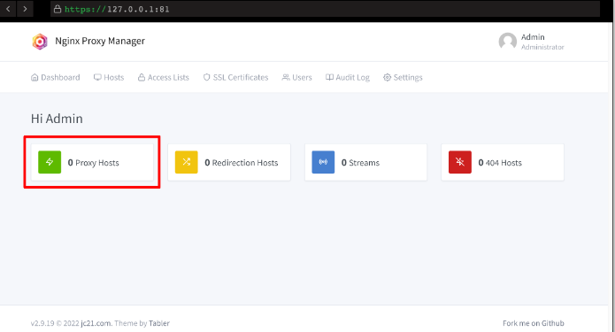

接着点击 `Add Proxy Host`，弹出如下对话框：

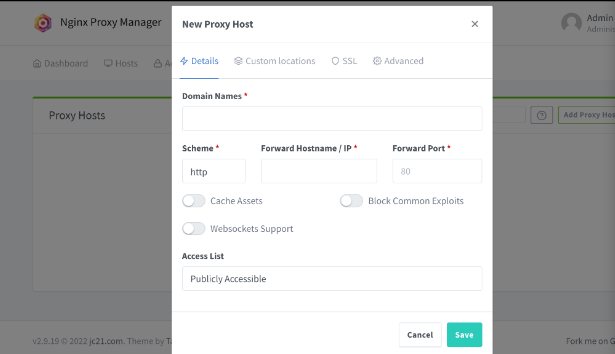

看起来都是英文，很复杂，但是其实很简单，我们只要用到其中的几个功能即可，这边稍微解释一下：

- `Domain Names` ：填我们 Halo 网站的域名，首先记得做好 DNS 解析，把域名绑定到我们的服务器的 IP 上
- `Scheme` ：默认 `http` 即可，除非你有自签名证书
- `Forward Hostname/IP` ：填入服务器的 IP，或者 Docker 容器内部的 IP（如果 NPM 和 Halo 搭建在同一台服务器上的话）
- `Forward Port`：填入 Halo 映射出的端口，这边默认是 `8090`
- `Cache Assets` ：缓存，可以选择打开
- `Block Common Exploits`： 阻止常见的漏洞，可以选择打开
- `Websockets Support` ：WS 支持，可以选择打开
- `Access List`： 这个是 NPM 自带的一个限制访问功能，这边我们不管，后续可以自行研究。

以下是一个样列：
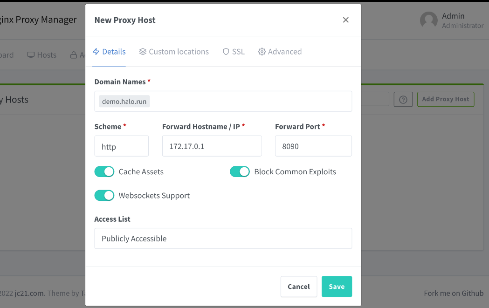

因为样例的 NPM 和 Halo 搭建在同一台 VPS 上，所以这边的 IP，图中填的是 `172.17.0.1`，**为 Docker 容器内部的 IP 地址**，

可以通过下面的命令查询：

`ip addr show docker0`

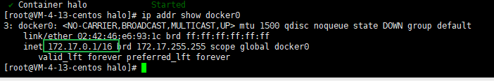

这边的 IP 是 `172.17.0.1`，填入这个 IP，可以不用打开防火墙的 `8090` 端口。

当然，如果你的 NPM 和 Halo 不在同一台服务上，你需要在 IP 部分填入 **你的 Halo 所在的服务器的 IP**，并在服务商（部分服务商如腾讯、阿里）的后台打开 `8090` 端口。

我的是这样：

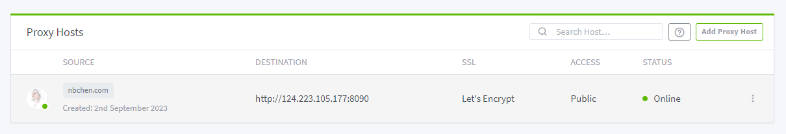

### SSL

一键申请 SSL 证书:接着我们来申请一张 SSL 证书，让我们的网站支持 `https` 访问。

编辑上面的hosts

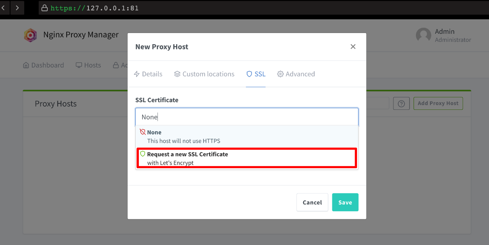

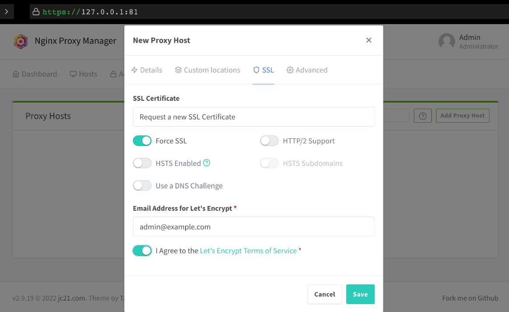

如图所示，记得打开强制 SSL，其他四个的功能请自行研究，这边不多做讨论。

1. 申请证书需要你提前将域名解析到 NPM 所在的服务器的 IP 上；
2. 如果你使用的是国内的服务器，默认 `80` 和 `443` 端口是关闭的，你需要备案之后才能使用；
3. 如果你使用了 CloudFlare 的 DNS 服务，记得把小黄云关闭（即不开启 CDN）。

不出意外，你将成功申请到 SSL 证书，证书会三个月自动续期。

再次点开配置，查看一下，将强制 SSL 打开。

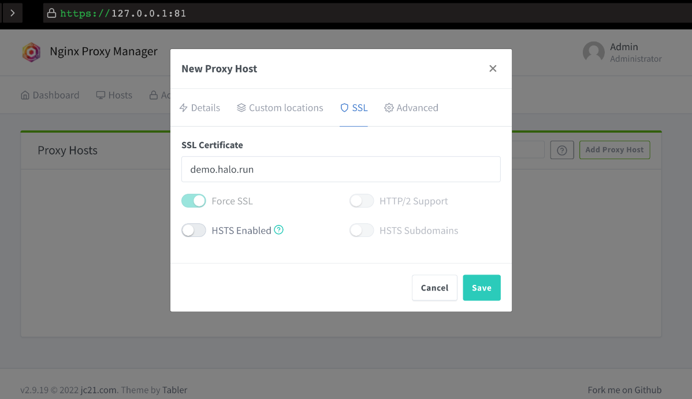

至此，你已经成功完成了 Halo 的反向代理，快尝试使用域名访问一下看看吧！

> 同样的，举一反三，试试把你的 NPM 也用一个域名来反向代理一下吧。(小提示：你需要再解析一个域名（可以是二级域名）到 NPM 所在的服务器上，反代页面需要填的 IP 可以填 docker 容器内的 IP 也可以填服务器的 IP，端口填 `81` 即可）

### npm代理

腾讯云配置解析

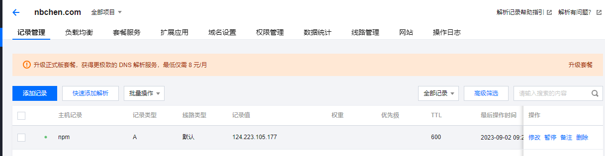

npm配置代理

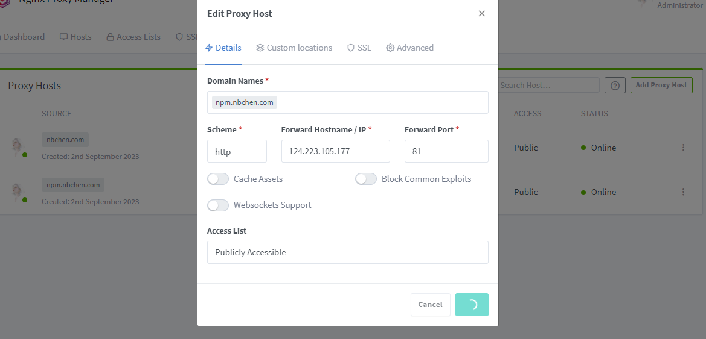

然后就可以用域名访问了

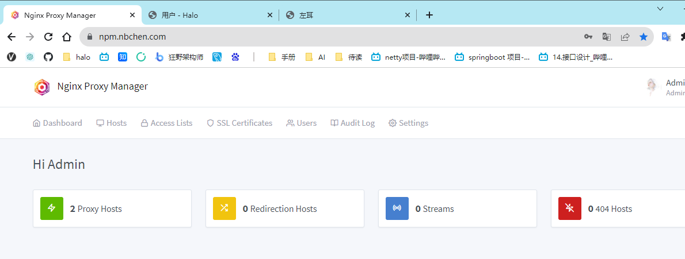

## Docker compose + MySQL

### 1、创建数据保存目录

```
mkdir ~/halo && cd ~/halo
```

### 2、创建compose文件

创建文件:`vim docker-compose.yaml`

配置内容:

```yaml
version: "3"

services:
  halo:
    image: halohub/halo:2.9
    container_name: halo
    restart: on-failure:3
    depends_on:
      halodb:
        condition: service_healthy
    networks:
      halo_network:
    volumes:
      - ./:/root/.halo2
    ports:
      - "8090:8090"
    healthcheck:
      test: ["CMD", "curl", "-f", "http://localhost:8090/actuator/health/readiness"]
      interval: 30s
      timeout: 5s
      retries: 5
      start_period: 30s
    command:
      # 数据库连接地址
      - --spring.r2dbc.url=r2dbc:pool:mysql://halodb:3306/halo
      # 数据库用户名
      - --spring.r2dbc.username=root
      # 数据库密码，请保证与下方 halodb 配置的 MYSQL_ROOT_PASSWORD 的变量值一致。
      - --spring.r2dbc.password=asd741520.+
      # 数据库类型
      - --spring.sql.init.platform=mysql
      # 外部访问地址（本地链接或者域名）
      # - --halo.external-url=http://localhost:8090/
      - --halo.external-url=http://nbchen.com
      # 初始化的超级管理员用户名
      # - --halo.security.initializer.superadminusername=zuoer
      # 初始化的超级管理员密码
      # - --halo.security.initializer.superadminpassword=asd741520.+

  halodb:
    image: mysql:8.0.31
    container_name: halodb
    restart: on-failure:3
    networks:
      halo_network:
    command: 
      - --default-authentication-plugin=mysql_native_password
      - --character-set-server=utf8mb4
      - --collation-server=utf8mb4_general_ci
      - --explicit_defaults_for_timestamp=true
    volumes:
      - ./mysql:/var/lib/mysql
      - ./mysqlBackup:/data/mysqlBackup
    ports:
      - "3306:3306"
    healthcheck:
      test: ["CMD", "mysqladmin", "ping", "-h", "127.0.0.1", "--silent"]
      interval: 3s
      retries: 5
      start_period: 30s
    environment:
      # 请修改此密码，并对应修改上方 Halo 服务的 SPRING_R2DBC_PASSWORD 变量值
      - MYSQL_ROOT_PASSWORD=asd741520.+
      - MYSQL_DATABASE=halo
networks:
  halo_network:
```

### twikoo

```yaml
# https://docs.docker.com/compose/compose-file/compose-file-v3/
version: '3'
services:
  twikoo-service:
    image: imaegoo/twikoo
    container_name: twikoo
    restart: unless-stopped
    ports:
      - 8080:8080
    environment:
      TWIKOO_THROTTLE: 250
      TZ: Asia/Shanghai
    volumes:
      - ./data:/app/data
```


### umami

```yaml
---
version: '3'
services:
  umami:
    image: ghcr.io/umami-software/umami:postgresql-latest
    ports:
      - "3000:3000"
    environment:
      DATABASE_URL: postgresql://umami:umami@db:5432/umami
      DATABASE_TYPE: postgresql
      APP_SECRET: replace-me-with-a-random-string
    depends_on:
      db:
        condition: service_healthy
    restart: always
  db:
    image: postgres:15-alpine
    environment:
      POSTGRES_DB: umami
      POSTGRES_USER: umami
      POSTGRES_PASSWORD: umami
    volumes:
      - umami-db-data:/var/lib/postgresql/data
    restart: always
    healthcheck:
      test: ["CMD-SHELL", "pg_isready -U $${POSTGRES_USER} -d $${POSTGRES_DB}"]
      interval: 5s
      timeout: 5s
      retries: 5
volumes:
  umami-db-data:
```


### 3、启动 Halo 服务

```
docker-compose up -d

# 如果你用的是 docker-compose-plugin 的话，用这条命令
docker compose up -d
```

### 4、实时查看日志

```
docker-compose logs -f

# # 如果你用的是 docker-compose-plugin 的话，用这条命令
docker compose logs -f
```

### 5、访问初始化地址

```
配置好反向代理后再通过域名初始化
访问到后台做初始化
http://124.223.105.177:8090/
```

### 6、更新容器 ♥

修改 docker-compose.yaml 中配置的镜像版本，重新拉取构建即可

```
1、停止运行中的容器组
cd ~/halo && docker-compose down
# 如果你用的是 docker-compose-plugin 的话，用这条命令
cd ~/halo && docker compose down
2、备份数据（重要）
cp -r ~/halo ~/halo.bak
3、更新 Halo 服务
services:
  halo:
    image: halohub/halo:2.3.0
    container_name: halo
4、更新命令
docker-compose pull
docker-compose up -d
# 如果你用的是 docker-compose-plugin 的话，用这条命令
docker compose up -d
```


## 主题

- 安装

```
下载zip包上传启用
```

- 更新

```
点击升级按钮上传新的包，重载主题配置加载新版本的设置项
```

## 开始使用

```
配色
#F30213
#53B9C8
#BEFBFF
#448089

主色用在网站的重要位置。使用这些明亮、鲜艳的颜色来吸引用户的注意力，并且促使他们采取行动。CTA按钮、标题、图标、下载表格和其他重要信息都应该使用主色突出显示。
辅助色用于突出显示网站上不太重要的信息，例如次要按钮、副标题、活动菜单、背景、常见问题和客户推荐等等。
中性色大多用于文字和背景，但在网站色彩特别丰富的区域也可以派上用场，只是为了帮助调和色调，重新聚焦视线。
```

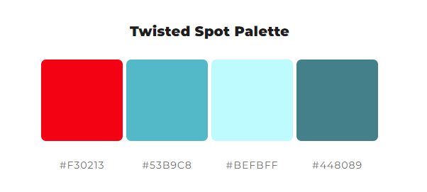

- 导航-标题

```css
左耳<i class="iconfont" style="font-size: 1rem;color:#f30213;">&#xf1cf;</i>
```

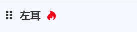

- 顶部-banner大标题

```css
<span style="color:#f30213;font-size: 22px;">鹏北海，凤朝阳，又携书剑路茫茫<span>
```


- 顶部-banner小标题

```css
<span style="color:#53B9C8;font-size:16px;font-weight:bold">微服务，分布式，蹒跚学步架构师</b>
```


- 侧栏-个人卡片

```css
<p>我本是槐花院落闲散的人</p>
<p>满襟酒气</p>
<div class="bounce">
	<span class="letter">小</span>
	<span class="letter">池</span>
	<span class="letter">塘</span>
	<span class="letter">边</span>
	<span class="letter">跌</span>
	<span class="letter">坐</span>
    <span class="letter">看</span>
    <span class="letter">鱼</span>
</div> 
<p>眉挑烟火过一生</p>
<style>
.bounce {
  display: flex;
  align-items: center;
  justify-content: center;
  width: 100%;
  color: white;
  height: 100%;
  font: normal bold 1.5rem "Product Sans", sans-serif;
  white-space: nowrap;
}

.letter {
  animation: bounce 0.75s cubic-bezier(0.05, 0, 0.2, 1) infinite alternate;
  display: inline-block;
  transform: translate3d(0, 0, 0);
  margin-top: 0.5em;
  text-shadow: rgba(255, 255, 255, 0.4) 0 0 0.05em;
  font: normal 500 1rem 'Varela Round', sans-serif;
}
.letter:nth-child(1) {
  animation-delay: 0s;
}
.letter:nth-child(2) {
  animation-delay: 0.1423333333s;
  color:#FF0000;
}
.letter:nth-child(3) {
  animation-delay: 0.2843333333s;
  color:#FF7F00;
}
.letter:nth-child(4) {
  animation-delay: 0.4263333333s;
  color:#FFFF00;
}
.letter:nth-child(5) {
  animation-delay: 0.5683333333s;
  color:#00FF00;
}
.letter:nth-child(6) {
  animation-delay: 0.7103333333s;
  color:#00FFFF;
}
.letter:nth-child(7) {
  animation-delay: 0.8523333333s;
  color:#0000FF;
}
.letter:nth-child(8) {
  animation-delay: 0.9993333333s;
  color:#8B00FF;
}

@keyframes bounce {
  0% {
    transform: translate3d(0, 0, 0);
    text-shadow: rgba(255, 255, 255, 0.4) 0 0 0.05em;
  }
  100% {
    transform: translate3d(0, -1em, 0);
    text-shadow: rgba(255, 255, 255, 0.4) 0 1em 0.35em;
  }
}
</style>
```

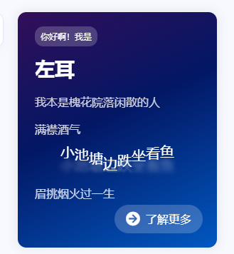

- 公众号正反面图片可以公众号平台下载，然后上传到网站附件即可使用

```css
/*公众号图片模糊处理*/
.face {
	transform:scale(1.05);
}
.back .face {
	transform:scale(1.05);
}
#flip-wrapper:hover #flip-content {
    transform:rotateY(180deg) scale(1.05);
}
```

- 添加菜单

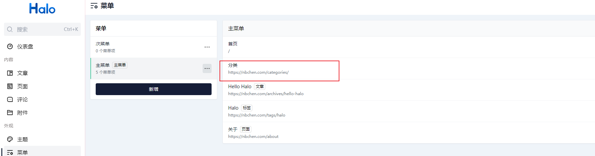


## 逛逛

- https://blog.laoda.de/archives/docker-compose-install-halo-version-2?cid=7183 (hao主题)
- https://im.casecori.top/  （imsyy主题：https://www.imsyy.top/）
- https://ono.ee/

# halo 入门

友情提示看完halo入门就可以了

> 安装halo，快速入手，后面还是要用好看的主题~
>
> 以下篇幅不会面面俱到，用于自己回顾。

## 环境

```shell
腾讯云服务器,2C4G8M
Centos7
重装了,干净的
```

## 防火墙

```shell
# 开放80端口
给nginx用
# 开放3306端口
给MySQL用
# 开放8090端口
访问后台初始化用,如果还没开通域名做反向代理的话
```

## OpenJRE11 安装

```shell
# 安装OpenJRE 11
sudo yum install java-11-openjdk -y
# 检查版本
java -version
```

## Halo 安装

```shell
# 创建用户,并强制生成halo家目录
useradd -m halo 
# 赋予sudo权限(新建用户,追加到wheel用户组,而不是直接用root)
usermod -aG wheel halo 
passwd halo 
输入密码
su - halo
# 创建目录
mkdir ~/app && cd ~/app
# 下载jar包(网不行下到本地上传也是可以的)
wget https://d1.halo.run/release/halo-1.4.17.jar -O halo.jar
# 启动(测试没有问题就停掉,后面要注册为服务使用)
cd ~/app && java -jar halo.jar

# 作为服务开机启动,(root用户)下载修改USER和YOUR_JAR_PATH并上传配置文件
wget https://dl.halo.run/config/halo.service -O /etc/systemd/system/halo.service
# 重新加载配置
systemctl daemon-reload
# 启动服务
systemctl start halo
# 查看服务状态
systemctl status halo
# 开机启动
systemctl enable halo
# 查看日志(如果报错,lvalue,注释掉StandOutput也行,但是应该不影响启动)
journalctl -n 20 -u halo

# 下载配置文件到./halo(修改这里的配置,会覆盖jar包里面的,具体查SpringBoot配置文件优先级)
(halo用户)
cd ~/.halo
wget https://dl.halo.run/config/application-template.yaml -O ./application.yaml
```

## halo 升级

```shell
# 停止正在运行的服务
service halo stop
# 备份数据以及旧的运行包（重要）
cp -r ~/.halo ~/.halo.1.4.16
cd ~/app && mv halo.jar halo.jar.1.4.16
# 下载最新版本的运行包
cd ~/app && wget https://dl.halo.run/release/halo-1.4.17.jar -O halo.jar
# 启动测试
java -jar halo.jar
# 如测试启动正常，请继续下一步。使用 CTRL+C 停止运行测试进程。
# 重启服务
service halo start
```

## halo 备份

**数据导出：**halo -> 系统 -> 小工具 -> 数据导出

> 这个备份的json，只在站点初始化的时候导入使用

**整站备份:** 备份`~/.halo`目录(包括主题,附件,h2数据库)

> 使用MySQL数据库的话要另外备份mysql数据

总结：

如果要迁移服务器的话，我们要把**工作目录的备份文件上传到新服务器的用户目录下解压**，然后重新安装halo即可。用MySQL数据库的话，要将MySQL备份数据导入到新服务器的mysql中

## mysql 安装

```shell
# 下载MySQL仓库并安装
wget -i -c  https://repo.mysql.com//mysql80-community-release-el7-3.noarch.rpm
yum -y install mysql80-community-release-el7-3.noarch.rpm
# 安装MySQL数据库
# yum -y install mysql-community-server
yum -y install mysql-community-server --nogpgcheck # 开源问题,用这个
# 开启mysql服务
systemctl start mysqld.service
# 查看mysql默认密码并登陆 
cat /var/log/mysqld.log | grep password
# 修改密码(设置大写+小写+数据+特殊符号,避免要修改其他东西)
mysql -uroot -p
ALTER USER 'root'@'localhost' IDENTIFIED BY 'your password'; 
# 设置远程连接(前提：开放3306端口)
use mysql
update user set host = '%' where user = 'root';
flush privileges;             # 刷新权限 权限更新后刷新才会起作用 
```

**安装好了,我们在 halo 中使用mysql**

```yaml
# 创建数据库
create database halodb character set utf8mb4 collate utf8mb4_bin;
exit
切换到halo用户
cd ~/.halo
vim application.yaml
# 将h2注释掉,放开mysql配置
spring:
  datasource:

    # H2 database configuration.
    #driver-class-name: org.h2.Driver
    #url: jdbc:h2:file:~/.halo/db/halo
    #username: admin
    #password: 123456

    # MySQL database configuration.
     driver-class-name: com.mysql.cj.jdbc.Driver
     url: jdbc:mysql://127.0.0.1:3306/halodb?characterEncoding=utf8&useSSL=false&serverTimezone=Asia/Shanghai&allowPublicKeyRetrieval=true
     username: root
     password: root
     
  # H2 database console configuration.
  #h2:
  #  console:
  #    settings:
  #      web-allow-others: false
  #    path: /h2-console
  #    enabled: false
```

如果mysql数据库里面没有表,root用户`systemctl restart halo`,重新识别一下.初始化一下.就有了


## 安装主题

每个主题都点了一遍,相对活跃已经功能完善的：

- Sakura@LIlGG
- Xue@xzhuz
- 寒山@hshanx

最终选择了[sakura](https://github.com/LIlGG/halo-theme-sakura/issues),~~提问题的最多~~

去github下载包,上传到后台主题,启用就行了。还有一堆个性化设置。

[怎么配置主题->Sakura食用说明](https://lixingyong.com/2021/01/05/halo%E4%B8%BB%E9%A2%98sakura%E9%A3%9F%E7%94%A8%E8%AF%B4%E6%98%8E)

很简单，很详细了。


## jsdelivr+github

```shell
# 创建一个仓库 CDN
git  git clone 一键复制的仓库地址

# 克隆到本地
git status                    //查看状态
git add .                     //添加所有文件到暂存区
git commit -m '第一次提交'      //把文件提交到仓库
git push                      //推送至远程仓库
# 打标签
git tag v1.0
git push origin v1.0 # 推送tag

# 发布仓库
选择tag,创建一个releases

# 使用
https://cdn.jsdelivr.net/gh/你的用户名/你的仓库名@发布的版本号/文件路径
例如：
https://cdn.jsdelivr.net/gh/nbchen/CDN@1.0/peach-0002.jpg
```

> jsdelivr被玩坏了(2022.1)


## 域名解析反向代理

> 做nginx反向代理,可以域名访问。没有的话就先用ip吧

安装nginx

```
# 安装nginx(root用户)
yum install -y nginx
# 启动nginx
systemctl start nginx
```

halo提供的配置

```
wget https://dl.halo.run/config/nginx.conf -O /etc/nginx/conf.d/halo.conf
```

要放到`/etc/nginx/conf.d/`下,应该`/etc/nginx/nginx.conf`中设置了默认加载conf.d目录下的所有.conf文件

- halo.conf

~~~nginx
# 反向代理 - nginx
upstream halo {
  # 8090是halo的运行端口
  server 127.0.0.1:8090;
}
server {
  listen 80;
  listen [::]:80;
  server_name www.yourdomain.com;
  # 默认1m,上传文件限制
  client_max_body_size 1024m;
  location / {
    proxy_pass http://halo;
    proxy_set_header HOST $host;
    proxy_set_header X-Forwarded-Proto $scheme;
    proxy_set_header X-Real-IP $remote_addr;
    proxy_set_header X-Forwarded-For $proxy_add_x_forwarded_for;
  }
  
  location ~ .*\.(gif|jpg|jpeg|png|bmp|swf|flv|mp4|ico)$
  {
      proxy_pass http://halo;
      expires      30d;
      error_log /dev/null;
      access_log off;
  }

  location ~ .*\.(js|css)?$
  {
      proxy_pass http://halo;
      # 过期时间
      expires      7h;
      error_log /dev/null;
      access_log off; 
  }
  
  location ~ /(\.user\.ini|\.ht|\.git|\.svn|\.project|LICENSE|README\.md) {
    deny all;
  }
}

# 删除php不必要的配置
location ~ [^/]\.php(/|$) {
  #fastcgi_pass remote_php_ip:9000;
  fastcgi_pass unix:/dev/shm/php-cgi.sock;
  fastcgi_index index.php;
  include fastcgi.conf;
}
~~~

安装路径: `/usr/local/nginx`

验证nginx: `nginx -t`

重载nginx: `nginx -s reload`

**还可以多域名，执行探索nginx玩法:**

```
就是通过nginx反向代理
域名：demo.halo.run
配置：/usr/local/nginx/conf/vhost/demo.halo.run.conf
目录：/data/wwwroot/demo.halo.run
```


## SSL配置+强制跳转https

在[腾讯云](https://cloud.tencent.com/document/product/400/35244)/阿里云后台下载nginx证书上传到服务器

```
cloud.tencent.com_bundle.crt 证书文件 公钥
cloud.tencent.com_bundle.pem 证书文件 
cloud.tencent.com.key 私钥文件 私钥
cloud.tencent.com.csr CSR 文件

将crt和key放到服务器/etc/nginx/cert下

修改halo.conf,在server中添加以下内容：
		#SSL 访问端口号为 443
        listen 443 ssl; 
        #填写绑定证书的域名
        server_name cloud.tencent.com; 
        #证书文件名称
        ssl_certificate cloud.tencent.com_bundle.crt; 
        #私钥文件名称
        ssl_certificate_key cloud.tencent.com.key; 
        ssl_session_timeout 5m;
        #请按照以下协议配置
        ssl_protocols TLSv1.2 TLSv1.3; 
        #请按照以下套件配置，配置加密套件，写法遵循 openssl 标准。
        ssl_ciphers ECDHE-RSA-AES128-GCM-SHA256:HIGH:!aNULL:!MD5:!RC4:!DHE; 
        ssl_prefer_server_ciphers on;
```

记得：

安装路径: `/usr/local/nginx`

验证nginx: `nginx -t`

重载nginx: `nginx -s reload`

> ps: 我之前www.域名可以访问,直接访问顶级域名不行，就是因为SSL没有配置

设置跳转(nginx高版本)

```
    #把http的域名请求转成https
    return 301 https://$server_name$request_uri;  
```

完整配置如下：

```nginx
# 反向代理 - nginx
upstream halo {
  # 8090是halo的运行端口
  server 127.0.0.1:8090;
} 
server {
    listen 443 ssl;
    #填写绑定证书的域名
    server_name 你的域名.com;
    #证书文件名称
    ssl_certificate /etc/nginx/cert/你的域名.com_bundle.crt; 
    #私钥文件名称
    ssl_certificate_key /etc/nginx/cert/你的域名.com.key; 
    ssl_session_timeout 5m;
    ssl_ciphers ECDHE-RSA-AES128-GCM-SHA256:ECDHE:ECDH:AES:HIGH:!NULL:!aNULL:!MD5:!ADH:!RC4;
    ssl_protocols TLSv1.2 TLSv1.3;
    ssl_prefer_server_ciphers on; 
    
    # 默认1m,上传文件限制
    client_max_body_size 1024m;

    location / {
      proxy_pass http://halo;
      proxy_set_header HOST $host;
      proxy_set_header X-Forwarded-Proto $scheme;
      proxy_set_header X-Real-IP $remote_addr;
      proxy_set_header X-Forwarded-For $proxy_add_x_forwarded_for;
    }
    
    location ~ .*\.(gif|jpg|jpeg|png|bmp|swf|flv|mp4|ico)$
    {
        proxy_pass http://halo;
        expires      30d;
        error_log /dev/null;
        access_log off;
    }

    location ~ .*\.(js|css)?$
    {
        proxy_pass http://halo;
        # 过期时间
        expires      7h;
        error_log /dev/null;
        access_log off; 
    }
    
    location ~ /(\.user\.ini|\.ht|\.git|\.svn|\.project|LICENSE|README\.md) {
      deny all;
    }
 
}

server {
  
    listen 80;
    listen [::]:80;
    
    #填写绑定证书的域名
    server_name 你的域名.com;
    #证书文件名称
     
    #把http的域名请求转成https
    return 301 https://$server_name$request_uri;  
 
}
```


## 又拍云+typora+PicGo=图床

...带图片简直折磨，

看：写好图文，复制到halo后台，图片失效，将本地图片上传到halo附件库，一个一个替换。(更致命的是，我并不想把文章里面那些图片放到附件库里)

[picGo](https://molunerfinn.com/PicGo/)


又拍云绑定子域名`assets.xxx.com`,指向又拍云的域名

```
assets	CNAME xxxx.b0.xxx.com.
```

又拍云软件设置：一定要带上http或者https，别问我为什么,说多了都是泪

- 后台可以设置强制https，需要添加自由证书
- 访问控制-ip访问限制-添加限制规则

- 超出设定的访问频率，直接禁止 IP 访问

```
限制策略：/*
访问频率   时间(S)
200-300  60
300-500	 180
500以上	300
```

- cc防护

```
url规则：/*
访问频率 200次/分
```

## 百度收录

搜索引擎： http://www.baidu.com/search/url_submit.html

header.ftl增加meta

```
<meta name="baidu-site-verification" content="code-xxxx" />
```


# Halo开发(开发篇)

> 要参与halo开发吗?

## 环境搭建(后台工程)

目标：本地启动Halo后台环境

### 基础环境

git+idea+gradle+jdk11

### 安装gradle

下载：https://services.gradle.org/distributions/

解压、将gradle的bin目录配置到`GRADLE_HOME`并添加到`Path`

验证: `gradle -v`

idea 配置 gradle，

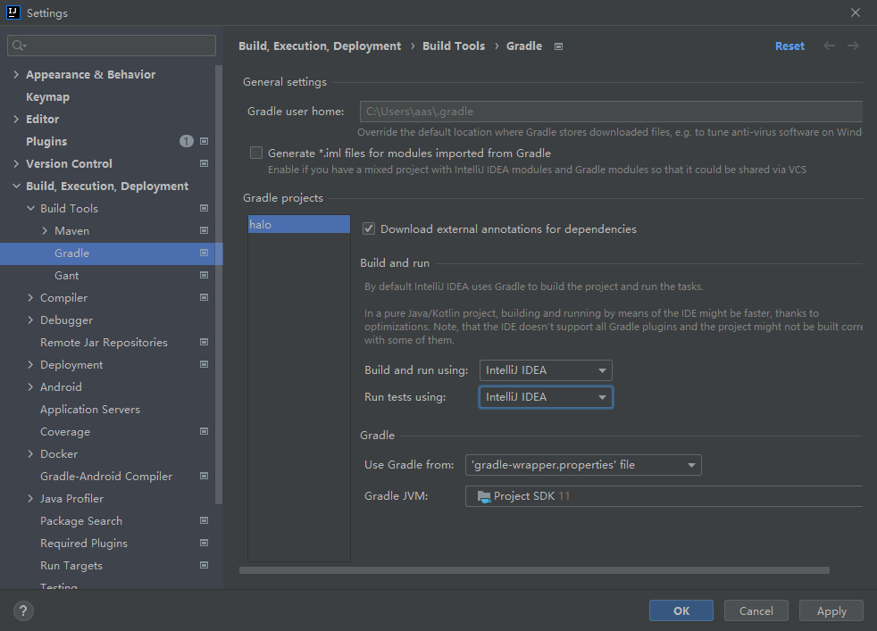


### 克隆项目

fork[源项目](https://github.com/halo-dev/halo)，克隆项目

```shell
git clone --recursive git@github.com:nbchen/halo.git
```

### 导入项目

设置auto import

idea选择Gradle方式导入

### 代码风格

安装`CheckStyle-IDEA`插件,

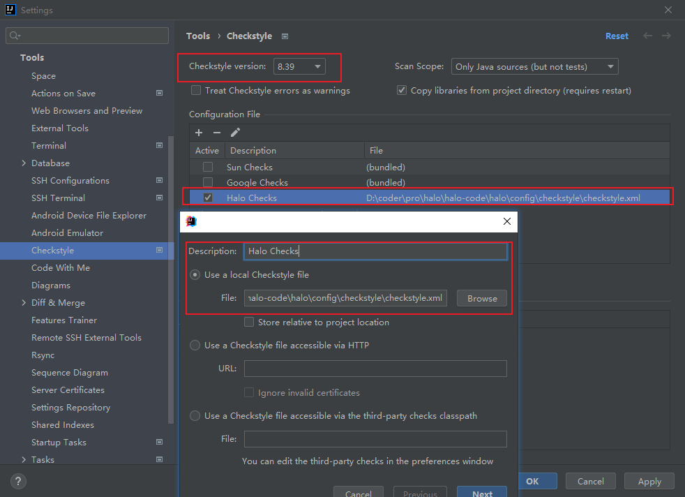

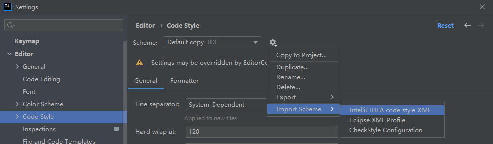


### 启动项目

设置vm参数:

```shell
-Dspring.profiles.active=dev
-Dhalo.auth-enabled=false
-Dhalo.production-env=false

# 如果运行报错：Command line is too long,则修改.idea\workspace.xml
  <component name="PropertiesComponent">
  ...
	<property name="dynamic.classpath" value="true" />
  </component>
```

修改`build.gradle`

```
plugins {
    id "org.springframework.boot" version "2.5.8"
    id "io.spring.dependency-management" version "1.0.11.RELEASE"
    id "checkstyle"
    id "java"
    id "com.github.johnrengelman.shadow" version "7.1.2"
}
shadowJar {
    manifest {
        attributes ('Main-Class': 'run.halo.app.Application')
    }
}
```

开发环境配置`application-dev.yaml`中H2注释掉,设置本地的MySQL

```yaml
server:
  port: 8090
  forward-headers-strategy: native
  compression:
    enabled: true
spring:
  jackson:
    date-format: yyyy-MM-dd HH:mm:ss
  output:
    ansi:
      enabled: always
  devtools:
    restart:
      eanbled: true
  datasource:
    type: com.zaxxer.hikari.HikariDataSource

    # H2 database configuration.
#    driver-class-name: org.h2.Driver
#    url: jdbc:h2:file:~/halo-dev/db/halo;AUTO_SERVER=TRUE
#    username: admin
#    password: 123456

    # MySQL database configuration.
    driver-class-name: com.mysql.cj.jdbc.Driver
    url: jdbc:mysql://127.0.0.1:3306/halo_dev?characterEncoding=utf8&useSSL=false&serverTimezone=Asia/Shanghai&allowPublicKeyRetrieval=true
    username: root
    password: 123456

#  h2:
#    console:
#      settings:
#        web-allow-others: true
#      path: /h2-console
#      enabled: true
  jpa:
    hibernate:
      ddl-auto: update
    show-sql: true
    open-in-view: false
  flyway:
    enabled: false
  servlet:
    multipart:
      max-file-size: 10240MB
      max-request-size: 10240MB
  cache:
    type: none
management:
  endpoints:
    web:
      base-path: /api/admin/actuator
      exposure:
        include: [ 'httptrace', 'metrics','env','logfile','health' ]
logging:
  level:
    run.halo.app: DEBUG
    org.hibernate: INFO
    org.hibernate.type.descriptor.sql.BasicBinder: INFO
    org.hibernate.type.descriptor.sql.BasicExtractor: INFO
  file:
    path: ${halo.work-dir}/logs

springfox:
  documentation:
    enabled: true

halo:
  auth-enabled: true
  mode: development
  workDir: ${user.home}/halo-dev/
  cache: memory
```

创建数据库

```shell
# 创建数据库
create database halo-dev character set utf8mb4 collate utf8mb4_bin;
```

启动application

会自动创建表，以及生成`C:\Users\aas\halo-dev`目录

> 这样我们就把本地halo后台工程搭建起来了。


## 环境搭建(jar包形式)

> 不启动后台工程,通过jar包方式(缺点是不能用mysql数据库，以及不能调试后台代码。)

从[halo-github](https://github.com/halo-dev/halo/releases)下载最新的包,改名为`halo.jar`，执行`halo-dev.bat`

halo-dev.bat

```bash
@echo off
java -jar halo.jar --spring.profiles.active=dev
```

- 如果运行报错,尝试配置环境变量更换jdk11

```java
run/halo/app/Application has been compiled by a more recent version of the Java Runtime (class file version 55.0), this version of the Java Runtime only recognizes class file versions up to 52.0
```

会在用户目录下生成`halo-dev`目录，`C:\Users\aas\halo-dev`

我们要开发的主题就在`halo-dev/templates/themes`下


## 提交代码

### 0. 提交 issue

任何新功能或者功能改进建议都先提交 issue 讨论一下再进行开发，bug 修复可以直接提交 pull request。

### 1. Fork 此仓库

点击右上角的 `fork` 按钮即可。

### 2. Clone 仓库到本地 

```bash
git clone https://github.com/{YOUR_USERNAME}/halo

git submodule init

git submodule update
```

### 3. 创建新的开发分支


```bash
git checkout -b {BRANCH_NAME}
```

### 4. 提交代码

```bash
git push origin {BRANCH_NAME}
```


### 5. 提交 pull request

回到自己的仓库页面，选择 `New pull request` 按钮，创建 `Pull request` 到原仓库的 `master` 分支。

然后等待我们 Review 即可，如有 `Change Request`，再本地修改之后再次提交即可。

### 6. 更新主仓库代码到自己的仓库

```bash
git remote add upstream git@github.com:halo-dev/halo.git
# clone下来代码后要执行
git pull upstream master
git push
```

请确保所有代码格式化之后再提交。


# 主题开发(开发篇)

> 要参与主题开发吗？

> 不论你选[哪种方式](#Halo开发),最终我们要在halo-dev下工作

## 开发约定

- `theme.yaml`（主题描述文件），`settings.yaml`（主题配置文件）要有 (用快速入手模板默认就有)
- 开源的话仓库名为 `halo-theme-主题名`，并设置仓库的 `topic` 为 `halo` 和 `halo-theme`，方便用户搜寻
- 模板后缀用.ftl,freeMark的
- 主题目录需要有个screenshot.png的预览图片.给后台展示用

## 基础环境

vscode

可以装个`Halo theme develop Snippets`插件

**仓库：**

- 在github创建了一个[CDN仓库](https://github.com/nbchen/CDN)
- 在github床架了一个[主题仓库](https://github.com/nbchen/halo-theme-poet)


## 新建主题

在halo-dev/templates/themes下新建一个文件夹(`用户名+主题名`),这个文件夹就是你的主题

你可以自己从0写，也可以参考[快速入手模板](https://github.com/halo-dev/halo-theme-quick-starter)，或者在其他大佬的模板上二次修改个性化定制

推荐把模板文件拉过来改叭改叭。


## 引用主题

访问`http://localhost:8090/`进入后台，初始化本地数据到mysql数据库。


## 推荐目录

```markdown
├── module                      // 公共模板目录
│   ├── comment.ftl             // 比如：评论模板
│   ├── layout.ftl              // 比如：布局模板
├── source                      // 静态资源目录
│   ├── css                     // 样式目录
│   ├── images                  // 图片目录
│   ├── js                      // JS 脚本目录
│   └── plugins                 // 前端库目录
├── index.ftl                   // 首页
├── post.ftl                    // 文章页
├── post_xxx.ftl                    // 自定义文章模板，如：post_diary.ftl。可在后台发布文章时选择。
├── sheet.ftl                   // 自定义页面
├── sheet_xxx.ftl               // 自定义模板，如：sheet_search.ftl、sheet_author.ftl。可在后台发布页面时选择。
├── archives.ftl                // 归档页
├── categories.ftl              // 分类目录页
├── category.ftl                // 单个分类的所属文章页
├── tags.ftl                    // 标签页面
├── tag.ftl                     // 单个标签的所属文章页
├── search.ftl                  // 搜索结果页
├── links.ftl                   // 内置页面：友情链接
├── photos.ftl                  // 内置页面：图库
├── journals.ftl                // 内置页面：日志
├── 404.ftl                     // 404 页
├── 500.ftl                     // 500 页
├── README.md                   // README，一般用于主题介绍或说明
├── screenshot.png              // 主题预览图
├── settings.yaml               // 主题选项配置文件
└── theme.yaml                  // 主题描述文件
```


## `theme.yaml`

> 这里是给主要的说明用的

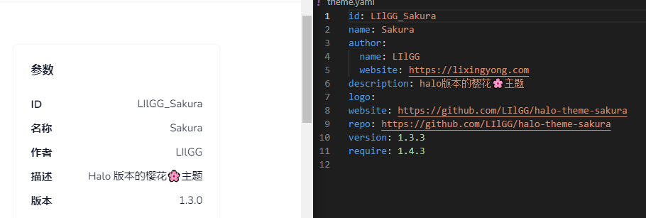

```yaml
# 主题描述文件

# 配置详情请参考：https://docs.halo.run/zh/developer-guide/theme/config-files

id: nbchen_poet # 主题id，唯一，不能与其他主题一样。我们建议设置为 `作者名_主题名称`
name: poet # 
author:
  name: nbchen # 作者名称
  website: https://nbchen.com # 作者网址
description: 侠之大者，武侠古诗风格 # 主题描述
logo: https://cdn.jsdelivr.net/gh/nbchen/CDN@1.0/nbchen_blog.svg # 主题 Logo 地址
website: https://github.com/nbchen/halo-theme-poet # 主题地址，可填写为 git 仓库地址
repo: https://github.com/nbchen/halo-theme-poet # 主题 git 仓库地址，如有填写，后台可在线更新
version: 1.0.0 # 版本号
require: 1.4.17 # 最低支持的 Halo 版本，如：1.3.0，那么如果用户的版本为 1.3.0 以下，则无法安装

postMetaField:              # 文章自定义 meta 变量
  - meta_key  
  - music_url # 假设在文章页面需要播放背景音乐，用户可以自己填写音乐地址。
  - download_url # 假设在文章页有一个下载按钮，那么用户也可以自己填写加载地址。

sheetMetaField:
  - meta_key                # 页面自定义 meta 变量
```

- 自定义的meta变量,预设后，用户可以在后台看到预先设置的值，然后填写对应的值就行了。这是halo后台工程帮我们做的事情。

## `settings.yaml`

> 这里的配置主要是给主题设置用的

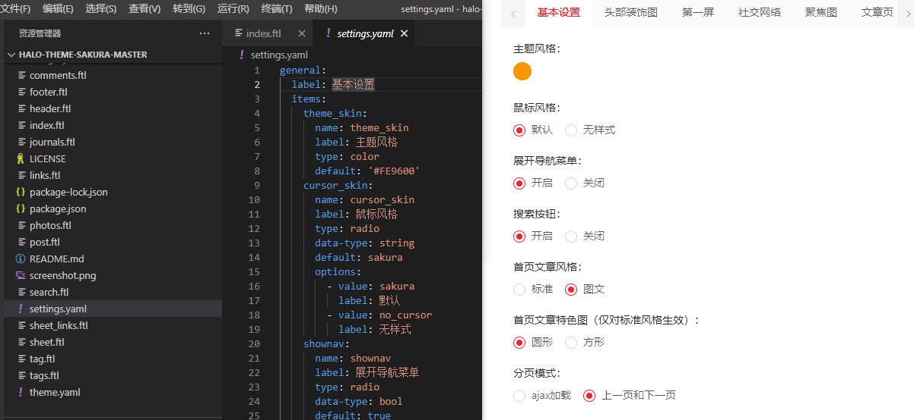

```yaml
# 主题选项配置文件

# 配置详情请参考：https://docs.halo.run/zh/developer-guide/theme/config-files


genernal:
  label: 基本设置
  items:
    index_notice:
      name: index_notice
      label: 首页公告
      type: textarea
      default: '欢迎来到我的博客'


# Tab 节点
group1:
  label: 第一个 Tab 名称
  # 表单项
  items:
    # 省略
group2:
  label: 第二个 Tab 名称
  # 表单项
  items:
    # 普通文本框
    item1:
      name: item1               # 设置项的 name 值，在页面可通过 ${settings.item1!} 获取值。
      label: item1              # 表单项的 label
      type: text                # 表单项类型：普通文本框
      placeholder: ''           # 表单项的 placeholder，一般给用户提示
      default: ''               # 表单项的默认值
      description: ''           # 描述，一般用于说明该设置的具体用途
      
    # 颜色选择框
    item1:
      name: item1               # 设置项的 name 值，在页面可通过 ${settings.item1!} 获取值。
      label: item1              # 表单项的 label
      type: color               # 表单项类型：颜色选择框
      placeholder: ''           # 表单项的 placeholder，一般给用户提示
      default: ''               # 表单项的默认值
      description: ''           # 描述，一般用于说明该设置的具体用途
    
    # 附件选择框
    item1:
      name: item1               # 设置项的 name 值，在页面可通过 ${settings.item1!} 获取值。
      label: item1              # 表单项的 label
      type: attachment               # 表单项类型：颜色选择框
      placeholder: ''           # 表单项的 placeholder，一般给用户提示
      default: ''               # 表单项的默认值
      description: ''           # 描述，一般用于说明该设置的具体用途
      
    # 多行文本框
    item2:                      # 设置项的 name 值，在页面可通过 ${settings.item2!} 获取值。
      name: item2
      label: item2              # 同上
      type: textarea            # 表单项类型：多行文本框
      placeholder: ''           # 同上
      default: ''               # 同上
      description: ''           # 描述，一般用于说明该设置的具体用途

    # 单选框
    item3:
      name: item3               # 同上
      label: item3_label        # 同上
      type: radio               # 表单项类型：单选框
      data-type: bool           # 数据类型：bool，string，long，double
      default: value1           # 同上
      description: ''           # 描述，一般用于说明该设置的具体用途
      options:                  # 选项
        - value: value1         # 值
          label: label1         # 说明
        - value: value2
          label: label2

    # 下拉框
    item4:
      name: item4               # 同上
      label: item4              # 同上
      type: select              # 表单项类型：下拉框
      data-type: bool           # 数据类型：bool，string，long，double
      default: value1           # 同上
      description: ''           # 描述，一般用于说明该设置的具体用途
      options:                  # 选项
        - value: value1         # 值
          label: label1         # 说明
        - value: value2
          label: label2
```

比如示例：

```yaml
# 主题选项配置文件

# 配置详情请参考：https://docs.halo.run/zh/developer-guide/theme/config-files


genernal:
  label: 基本设置 # 单页设置tab的名称
  items: # 一页表单
    index_notice: # 一个表单项
      name: index_notice        # 设置项的 name 值，在页面可通过 ${settings.index_notice!} 获取值。
      label: 首页公告            # 表单项的 label
      type: textarea            # 表单项类型：普通文本框
      # 普通文本框 text
      # 颜色选择框 color
      # 颜色选择框 attachment
      # 多行文本框 textarea
      # 单选框 radio 
      # 下拉框 select 
      placeholder: ''           # 表单项的 placeholder，一般给用户提示
      default: '欢迎来到我的博客' # 表单项的默认值
      description: ''           # 描述，一般用于说明该设置的具体用途
    index_title:
      name: index_title           
      label: 首页标题
      type: text 
      description: '注意：将覆盖博客标题'
    background_cover:
      name: background_cover
      label: 首页背景图
      type: attachment
      default: '/casper/assets/images/blog-cover.jpg'
      description: '设置首页的背景图，你可以点击右边的选择按钮选择图片。'
    background_color:
      name: background_color
      label: 首页背景颜色
      type: color
      default: '#fff'
    music_enabled:
      name: music_enabled
      label: 背景音乐
      type: radio
      data-type: bool           # 数据类型：bool，string，long，double
      default: false
      description: '是否开启背景音乐，默认为 false'
      options:                  # 选项
        - value: true         # 值
          label: 开启         # 说明
        - value: false
          label: 关闭
    code_pretty:
      name: code_pretty
      label: 文章代码高亮主题
      type: select
      default: Default
      options:
        - value: Default
          label: Default
        - value: Coy
          label: Coy
        - value: Dark
          label: Dark
        - value: Okaidia
          label: Okaidia
        - value: Solarized Light
          label: Solarized Light
        - value: Tomorrow Night
          label: Tomorrow Night
        - value: Twilight
          label: Twilight
```

然后在页面取到设置的值，逻辑可以参考下面的代码写

```javascript
// 获取首页标题

<#if settings.index_title?? && settings.index_title != ''>
    <h1>${settings.index_title!}</h1>
</#if>

// 获取背景图片

<#if settings.background_cover?? && settings.background_cover != ''>
    
</#if>

// 获取背景颜色

<style>
    body{
        <#if settings.background_color?? && settings.background_color != ''>
            background-color: ${settings.background_color!}
        <#else>
            background-color: #fff
        </#if>
    }
</style>

或者

<style>
    body{
        background-color: ${settings.background_color!'#fff'}
    }
</style>


// 判断是否开启背景音乐

<#if settings.music_enabled!false>
    do something...
</#if>

// 获取代码高亮主题

<link rel="stylesheet" type="text/css" href="${theme_base!}/assets/prism/css/prism-${settings.code_pretty!'Default'}.css" />
<script type="text/javascript" src="${theme_base!}/assets/prism/js/prism.js"></script>

```

[更详细的示例](https://github.com/halo-dev/halo-theme-material/blob/master/settings.yaml)


## 加载自己的主题

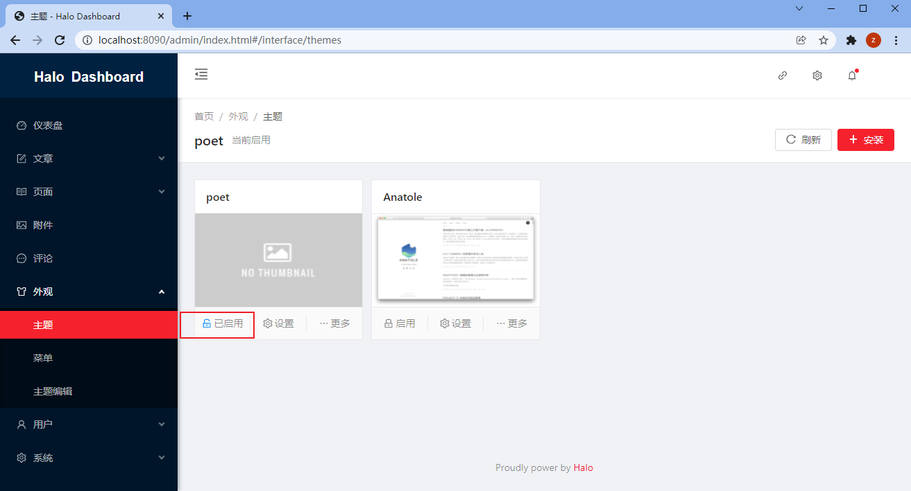

> 看吧看吧，看图是不是更加清楚的知道这些配置在做什么？

将`screenshot.png`放到`C:\Users\aas\halo-dev\templates\themes\nbchen_poet`下，这样halo后台-外观-主题设置可以显示这张图片，look，look


## freeMark

> 网站中往往有通用的布局，比如导航、底部等等，这些页面中共用的部分，就需要放在母版页（Layout）里面。
> 这样每个页面只用关注本页面要完成的功能/内容即可。提高了开发效率，也降低了公共部分的维护成本。

### macro母版页layout

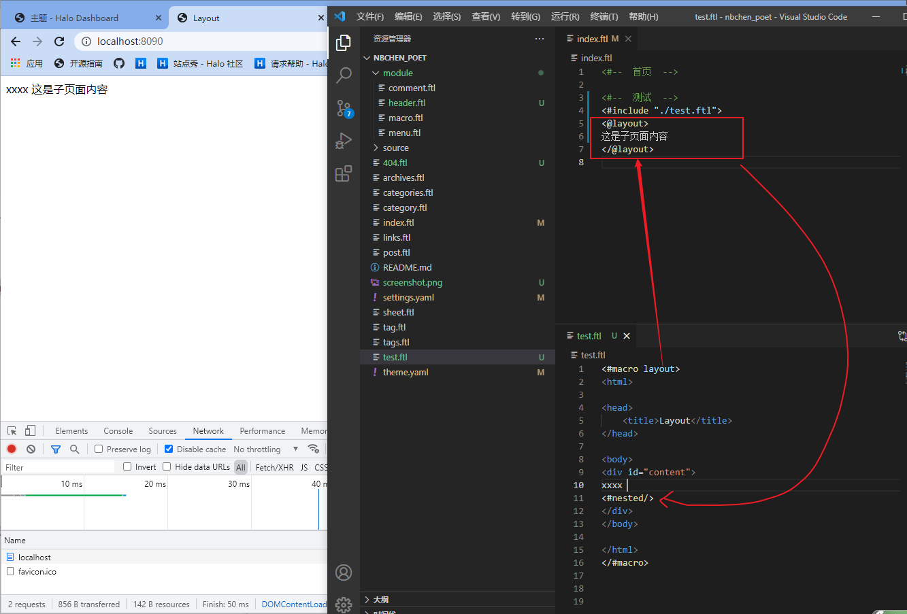

图片解读：母版页定义macro（id=layout）并在macro中定义 `<#nested />`标签，子页面引用该模板时，就可以定义macroid同名标签，将内容填充在`<#nested />`所在位置

| 语法/标签       | 说明                                                         |
| --------------- | ------------------------------------------------------------ |
| macro           | 宏，用于包装Freemarker语句块/片段，可以被引用，在引用页，或者当前页都可以引用 |
| <#macro layout> | 指定macroid = layout                                         |
| <#nested />     | 嵌套，在macro标签内部使用，引用该macro时，`<@macroid>`标签包裹的内容会填充在<#nested />所在的位置 |
| include         | 引用Freemarker模板文件                                       |
| `<@macroid>`    | 引用macro，例如：`<@macroid>`，`<@macroid>内容</@macroid>`   |


`macro layout title`带参数怎么理解？

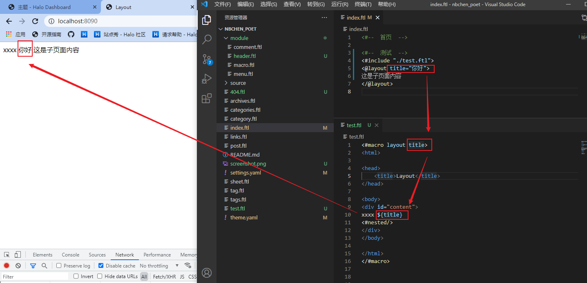


> 相当于占位符，layout设置同名参数，从外部传给macro，作为局部变量使用

### yaml参数和ftl模板使用

> 我怎么使用halo的全局变量?

> 我在settings中设置了参数,怎么在freeMark中使用?

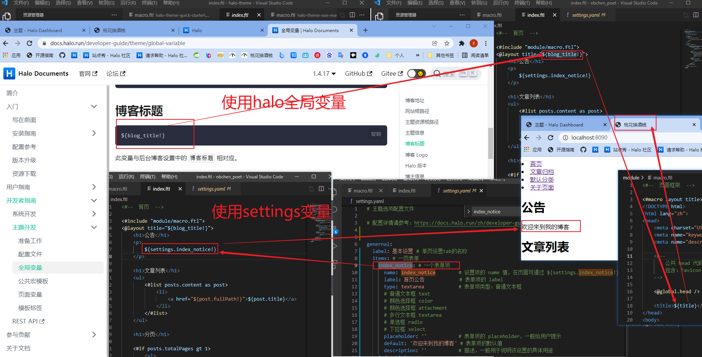


> 可以看到,就是这样使用的.懂了吧


### 全局变量meta_description和meta_keywords

```
	<meta name="description" content="${meta_description!}"/>
	<meta name="keywords" content="${meta_keywords!}"/>
```

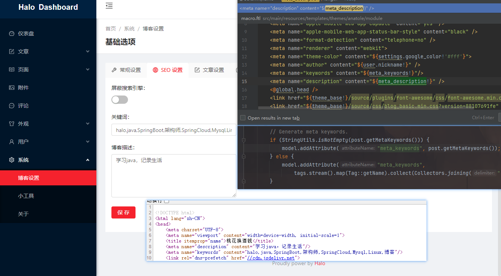

> 实际上就是halo后台seo设置的值，在工程代码里也可以看到一些赋值的地方。

> 打断施法...直接去学习freemark语法吧。20年后见~

我爱学习

学习使我快乐

学习学习

...

> 我回来了，我已精通freemark...[单词的拼写,详见demo/demo_freemark](git@github.com:nbchen/demo.git)，谢谢


~~通过上面,你可以干嘛?可以搭建一个本地的环境调试环境~~


> 搁置，我应该专注技术，而不是工具。悟了悟了


# Halo食用记录

彩蛋篇

[一些隐藏功能](https://halo.run/archives/use-hidden-features.html#%E5%BC%80%E5%8F%91%E8%80%85%E9%80%89%E9%A1%B9)

规划篇

- [功能期待](https://github.com/halo-dev/halo/milestone/9)

问题篇

- [Halo 使用中的常见问题](https://bbs.halo.run/d/17-halo)

优化篇

- [优雅的让 Halo 支持 webp 图片输出](https://halo.run/archives/halo-and-webp.html)

交友篇

- https://bbs.halo.run/d/1481
- https://bbs.halo.run/d/1415
- https://bbs.halo.run/d/1269
- https://bbs.halo.run/d/914/4
- https://bbs.halo.run/d/870/8


# Sakura食用记录

## 图标

1. [图标库](http://www.fontawesome.com.cn/cheatsheet/)
2. [动画效果](https://www.51qianduan.com/article/view/4111.html)

配合使用

```
fa-fort-awesome faa-horizontal
# 前者是图标,后者是动画效果
```

## 自定义样式

```css
 主题设置 - 基本设置 - 自定义 CSS 样式，然后根据自己的喜好，编写对应的 css 代码。
 比如引用对应的 class 为 blockquote、blockquote:before 及 blockquote:after。(F12查看,就是写CSS)
```

## 从后台主题设置定义css样式

```css
/* 引用块 start */
.entry-content blockquote:before,
.entry-content blockquote:after {
	content: ""!important;
}
.entry-content blockquote {
	margin: 0;
	/*color: ;*/
	border-radius: 2px;
	padding: 10px 16px;
    /*引用块颜色*/ 
	background-color: #fff;
	position: relative;
	border-left: none;
}

.entry-content blockquote:before {
	display: block;
	position: absolute;
    content: ""!important;
	width: 4px;
	left: 0;
	top: 0;
	height: 100%;
	/*引用条颜色*/
	background-color: #fe9600;   
	border-radius: 2px;
}

.entry-content blockquote p {
	margin: 5px 0;
}
/* 引用块 end */
/*二级标题后缀引用去除*/
.serif .entry-content h2:after {
    content: ""!important;
}
/*搜索图标小点*/
i.iconfont.js-toggle-search.iconsearch {
    font-size: 16px;
}
/*隐藏盒子*/
div.top-social_v2 {
    display: none;
}
```


# 导航页面

将[github-demo-webstack](https://github.com/nbchen/demo)拷贝到主题根目录下（覆盖/home/halo/.halo/templates/themes/LIlGG_Sakura）


>  注意版本!,当前Sakura版本,1.3.3(版本不对要对比header和footer自行修改！)


创建模板的时候选择portal即可。

设置菜单,添加自定义的页面


# TODO需求清单(划掉)

- [x] 引用样式自定义修改
- [x] N级标题后面的井号样式自定义修改
- [x] gravatar头像加载不出来,更换
- [ ] 增加一个代办页面,用于规划整理启动项目
- [ ] 增加一个歌单页面,用于分享好听的歌/自己快速听歌~~(虽然很大的概率在手机上听)~~
- [x] 增加一个友链页面,用于快速跳转到大佬的博客
  - [ ] 有个开往功能，我记得，待研究
- [ ] 增加一个导航功能,用于快速跳转到需要的站点
- [ ] 首页打字可以改成打字机效果吗?直接多行,或者打完删掉重打。
- [x] 搜索太大了，改小点
- [ ] 首页的社交链接风格不同意，暗色调github图标直接糊了
- [ ] 更换吊绳为火箭返回顶部
- [ ] 侧边栏拉动加宽，不好拉到，~~太细了，还是粗点好~~
- [ ] 右下角的切换主题移除掉。我不需要夜间模式。背景的话我觉得页面头部图片已经够了，整体背景太花哨了
- [ ] 底部删除powered和引用主题等
- [ ] 评论的每个块高度太高了，不够紧凑
- [ ] [人生倒计时组件](https://github.com/qinhua/halo-theme-joe2.0)
- [ ] SSL配置
- [ ] 域名配置
- [ ] 单页面的顶部图片怎么设置偏移量?显示一半被遮挡了。或者用什么格式的比较合适
- [ ] markdown 使用技巧


# 附录资料

> 站在巨人的肩膀上

- [halo-github](https://github.com/halo-dev/halo)
- [halo-doc](https://halo.run/)
- [halo-jar](https://github.com/halo-dev/halo/releases)
- [halo-config](https://github.com/halo-dev/halo-common)
- [halo-diy-theme](https://github.com/halo-dev/halo-theme-quick-starter)
- [halo-bbs](https://bbs.halo.run)
- [Sakura-源](https://2heng.xin/theme-sakura/)
- [Sakura-君](https://lixingyong.com/)
- [Sakura-库](https://github.com/LIlGG/halo-theme-sakura)
- [Spring Boot入门教程3-1、使用Spring Boot+Freemarker模板引擎开发Web应用](https://ken.io/note/springboot-course-basic-freemarker-quickstart)
- [Freemarker使用技巧：使用自定义宏（Macro）实现母板页（Layout）功能](https://ken.io/note/freemarker-skill-layout)
- [freeMark手册](http://www.kerneler.com/freemarker2.3.23/ref_directive_macro.html)
- [freeMark中文手册-从语法手册更深入了解语法](http://freemarker.foofun.cn/toc.html)
- [halo 博客深度定制与美化教程](https://bestzuo.cn/posts/halo-beauty.html)
- [vscode连接远程服务器开发](https://zhuanlan.zhihu.com/p/141205262)
- 等等等等...


# 怎么使用插件

添加插件后找不到菜单？

是不是npm开启了缓存，要关掉！

## twikoo评论

docker  compose 部署到自己的节点

```
version: '3'
services:
  twikoo:
    image: imaegoo/twikoo
    container_name: twikoo
    restart: unless-stopped
    ports:
      - 8080:8080
    environment:
      TWIKOO_THROTTLE: 1000
    volumes:
      - ./data:/app/data
```


