重量级选手

<!-- more-->


# wordpress

## 需求

我需要一个网站

- 访问速度块
- 支持文字，图片，视频
- 配色要好看，编辑要方便
- SEO靠前
- 支持搜索，精准
- 需要首页，分类、标签、时间轴，关于我，数据统计
- 需要支持多站点，分技术(blog.site.com)，生活(life.site.com)等站点

## 仿站

> 不开VPN,他的网站打开的速度很块,搜索在前列,如果做个类似的,我觉得会挺不错的.

[奶爸建站笔记](https://blog.naibabiji.com)的网站配置：

主题：Astra Pro

服务器: 腾讯云, 2核4G5M,活动时3年1200

静态资源CDN: 又拍云,腾讯云,七牛,百度

关于插件: 15-20个(服务器配置不行才会觉得插件多了卡...有多少人因为"插件多了卡"这个原因弃坑?苦百毒久矣)

- [AddQuicktag](https://blog.naibabiji.com/files/addquicktag.html)
- [AMP](https://blog.naibabiji.com/files/wordpress-amp-plugins.html)
- [Astra Pro](https://blog.naibabiji.com/astra-theme/astra-licenses.html)
- [BackWPup](https://blog.naibabiji.com/tutorial/backwpup.html)
- [Elementor](https://elementor.com/?ref=8446)
- [LuckyWP Table of Contents](https://blog.naibabiji.com/files/wordpress-contents.html)
- [Rank Math SEO](https://blog.naibabiji.com/tutorial/rank-math.html)
- [WP Rocket](https://blog.naibabiji.com/files/wp-rocket-xia-zai.html)
- [WP SMTP](https://blog.naibabiji.com/tutorial/wordpress-smtp-cha-jian.html)
- [百度搜索推送管理WP插件Pro版本](https://www.wbolt.com/plugins/bsl-pro?invite=316)
- [付费阅读插件](https://blog.naibabiji.com/skill/wp-vk.html)

> 关于优惠，我看知乎上也有腾讯云2核4G8M74元/年,3年才222；阿里云也有2核4G5M99元/年....总之,货比三家,多找找.

## 服务器推荐

> 国外的不考虑了，不备案的话，放国外服务器访问速度肯定受影响，而且正规个人博文，备案有益无害。

- 阿里云(套路多,活动经常老用户和狗不得参与)
- 腾讯云(套路少,活动实在,推荐)
- 华为云(实力有目共睹)

> 关于虚拟主机,这玩意你可以理解为一台服务器分多个人一起用,高流量,高访问的体验相对差写，(相当于一台服务器D盘多个文件夹,群租房)
>
> 关于VPS(Virtual Private Server),性能比前者好,环境要自己搞(相当于不同的虚拟机,独立空间,独立公寓)
>
> 如果一般的网站或只有一个网站,用VPS浪费成本和空间资源,不如考虑稍大些的虚拟主机。

多说一句

> 虚拟注解相当于出租房(基本装修),vps相当于(清水),宝塔面板相当于装修队(基础功能免费的,高级功能收费)


### 到底需要多大空间和数据库?

主机空间：虚拟主机->VPS->服务器

**对于新手或个人博客而言，倡萌推荐先购买虚拟主机，因为建站初期（一年内）你网站的流量都不会很大，一个200M左右的虚拟主机就完全够一个普通博客使用一年以上了。**

购买Linux主机，通常都还有一个参数，就是每个月的流量，如果博文**配图不多，每天的访问量在 300 IP 以内，一般 6-10GB一个月**的流量就可以了。而Linux主机的MySQL数据库一般是和主机空间一起用的，也就是MySQL数据库的大小已经包含在虚拟主机里，不需要单独购买。**通常一年内，一个博客的MySQL数据库的大小不会达到 10M**。

所以，搭建博客的初期，你可以购买一个 200M大小，每月 6-10G 流量的Linux主机即可，这样的国外主机价格一般在 80-200元/年不等。再加上一个域名60元，**一般 150-200元左右就可以搭建你的独立博客啦！**

## 硬件要求

- PHP7.4+

- MySQL5.6+

- nginx/apache

- wordpress

- vps

- 内存>1G

- 宝塔面板

  - 内存：>512M,推荐768M,纯面板占系统60M内存

  - 硬盘：300M以上可用硬盘空间（纯面板约占20M磁盘空间）

  - 系统：CentOS 7.1+ (Ubuntu16.04+.、Debian9.0+)，**确保是干净的操作系统，**没有安装过其它环境带的Apache/Nginx/php/MySQL/pgsql/gitlab/java**（已有环境不可安装）**

  - 架构：x86_64（主流服务器均是此架构），ARM不完整兼容（面板环境安装慢，部分软件可能安装不上）

  - **宝塔Linux面板7.8.0版本是基于Centos/Debian/Ubuntu开发的，为了最好的兼容性，请使用以上系统**

    系统兼容性顺序：

    Centos7.x > Debian10 > Ubuntu 20.04 > Cenots8.x > Ubuntu 18.04 > 其它系统

## 安装步骤

- [ ] money: 0~1000/Year
- [x] 买个域名，实名认证、备案、解析
- [x] 买个服务器,vps/虚拟主机
- [x] xshell连接服务器
- [x] 安装[宝塔面板](https://www.bt.cn/)/[LNMP](https://lnmp.org/)/[OneinStack](https://oneinstack.com/)/[LAMP](https://lamp.sh/)
- [x] 下载上传[wordpress安装包](https://cn.wordpress.org/latest-zh_CN.zip)/一键安装wordpress
- [ ] 创建数据库
- [ ] 系统设置
- [ ] 挑选主题
- [ ] 发表文章

## 环境安装 | LNMP(不推荐)

> 搭建的教程真的太多了,比如[阿里云的文档](https://help.aliyun.com/document_detail/63819.html)

### CentOS8搭建LNMP环境

- 前提

阿里云账号，实名认证，ECS实例开放80/22端口

```
服务端要求（wordpress5.7.2）
PHP 7.4 或更高版本
MySQL 5.6 或 MariaDB 10.1 或更高版本
HTTPS支持
```

- 步骤一：准备编译环境

```
1.关闭防火墙
查看状态：systemctl status firewalld
临时关闭：systemctl stop firewalld
永久关闭：systemctl disable firewalld
2.关闭SELinux
查看状态：getenforce
临时关闭：setenforce 0
永久关闭：
    vim /etc/selinux/config 
    SELINUX=enforcing修改为SELINUX=disabled
```

- 步骤二：安装Nginx(1.20.1)

```
dnf -y install http://nginx.org/packages/centos/8/x86_64/RPMS/nginx-1.20.1-1.el8.ngx.x86_64.rpm 
```

- 步骤三：安装MySQL(8.0.21)

```
dnf -y install @mysql
```

- 步骤四：安装PHP

```
# php:7.4
# 安装remi源
dnf -y install https://rpms.remirepo.net/enterprise/remi-release-8.rpm
# 运行以下命令添加并更新epel源。
dnf -y install epel-release
dnf update epel-release
# 运行以下命令删除缓存的无用软件包并更新软件源。
dnf clean all
dnf makecache
# 启用php:7.4模块
dnf module enable php:7.4
# 运行以下命令安装PHP相应的模块。
dnf install php php-curl php-dom php-exif php-fileinfo php-fpm php-gd php-hash php-json php-mbstring php-mysqli php-openssl php-pcre php-xml libsodium
```

- 步骤五：配置Nginx

```
# 查看Nginx配置文件的默认路径。
cat /etc/nginx/nginx.conf
=> include /etc/nginx/conf.d/*.conf;
# 备份默认配置文件
cd /etc/nginx/conf.d
cp default.conf default.conf.bak
# 修改默认配置文件
vi default.conf
location / {
    #将该路径替换为您的网站根目录。
    root   /usr/share/nginx/html;
    #添加默认首页信息index.php。
    index  index.html index.htm index.php;
}
# 去掉被注释的location ~ \.php$大括号内容前的#，并修改大括号的内容。修改完成如下所示。
location ~ \.php$ {
    #将该路径替换为您的网站根目录。
    root           /usr/share/nginx/html;
    #Nginx通过unix套接字与PHP-FPM建立联系，该配置与/etc/php-fpm.d/www.conf文件内的listen配置一致。
    fastcgi_pass   unix:/run/php-fpm/www.sock;
    fastcgi_index  index.php;
    #将/scripts$fastcgi_script_name修改为$document_root$fastcgi_script_name。
    fastcgi_param  SCRIPT_FILENAME  $document_root$fastcgi_script_name;
    #Nginx调用fastcgi接口处理PHP请求。
    include        fastcgi_params;
}
# 运行以下命令启动Nginx服务。
systemctl start nginx
# 运行以下命令设置Nginx服务开机自启动。
systemctl enable nginx
```

- 步骤六：配置MySQL

```
# 运行以下命令启动MySQL，并设置为开机自启动。
systemctl enable --now mysqld
# 运行以下命令查看MySQL是否已启动。
systemctl status mysqld
# 查看返回结果中Active: active (running)表示已启动。
# 运行以下命令执行MySQL安全性操作并设置密码。
mysql_secure_installation
```

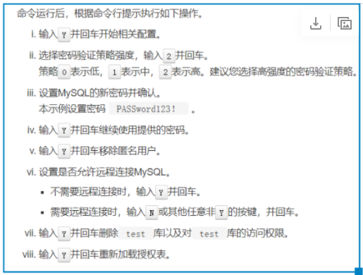

```
#配置可以远程访问root用户
#创建账户
create user 'root'@'%' identified by 'Axxx+';
#赋予权限，with grant option这个选项表示该用户可以将自己拥有的权限授权给别人
grant all privileges on *.* to 'root'@'%' with grant option;
#改密码&授权超用户，flush privileges 命令本质上的作用是将当前user和privilige表中的用户信息/权限设置从mysql库(MySQL数据库的内置库)中提取到内存里
flush privileges;
```

- 步骤七：配置PHP

```
vi /etc/php-fpm.d/www.conf
找到user = apache和group = apache，将apache修改为nginx。

# 新建phpinfo.php文件，用于展示PHP信息。
vim <网站根目录>/phpinfo.php  #将<网站根目录>替换为您配置的网站根目录。
网站根目录是您在nginx.conf文件中location ~ .php$大括号内配置的root值

vim /usr/share/nginx/html/phpinfo.php
键入内容：<?php echo phpinfo(); ?>

# 启动PHP-FPM。
systemctl start php-fpm
# 设置PHP-FPM开机自启动。
systemctl enable php-fpm
```

- 步骤八：测试访问LNMP平台

```
http://<ECS实例公网IP地址>/phpinfo.php
```

- 后续步骤

```
# 测试访问LNMP平台成功后，建议您运行以下命令将phpinfo.php文件删除，消除安全隐患。
rm -rf <网站根目录>/phpinfo.php  
#将<网站根目录>替换为您在nginx.conf中配置的网站根目录 
rm -rf /usr/share/nginx/html/phpinfo.php
```

- 为什么要删除?：[PHPInfo()信息泄漏漏洞利用及提权](https://blog.csdn.net/weixin_44023460/article/details/84898533)

### CentOS8搭建WordPress

> 上面我们创建了LNMP环境,按步骤,搭建一下wordpress

```
实例规格：ecs.n4.small
操作系统：CentOS 8.3 64位
Nginx版本：1.20.1
MySQL版本：8.0.21
PHP版本：7.4.6
WordPress版本：5.7.2
```

- 搭建WordPress网站

```
1.配置WordPress数据库
create database wordpress;
create user 'user'@'localhost' identified by 'PASSword123.'
grant all privileges on wordpress.* to 'user'@'localhost';
flush privileges;
--> 我直接用root了，懒得建立用户
2.下载并解压WordPress，然后移动至网站根目录、
cd /usr/share/nginx/html
# 下载
wget https://wordpress.org/wordpress-5.7.2.zip
# 解压
unzip wordpress-5.7.2.zip
# 备份配置文件
cd /usr/share/nginx/html/wordpress
cp wp-config-sample.php wp-config.php
vim wp-config.php
// ** MySQL 设置 - 具体信息来自您正在使用的主机 ** ///** WordPress数据库的名称 */
define('DB_NAME', 'wordpress');
/** MySQL数据库用户名 */
define('DB_USER', 'root');
/** MySQL数据库密码 */
define('DB_PASSWORD', 'A.......A');
/** MySQL主机 */
define('DB_HOST', 'localhost');
3.修改Nginx配置文件
vim /etc/nginx/conf.d/default.conf
```

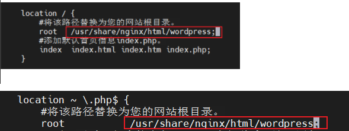

```
# 重启nginx服务
systemctl restart nginx
4.安装并登录WordPress网站。
http://xx.xx.xx.xx/wp-login.php
# 填写网站基本信息，然后单击安装WordPress。
站点标题：WordPress网站的名称。例如：demowp。
用户名：用户登录WordPress时使用的用户名，请注意安全性。例如：testwp。
密码：建议用户设置安全性高的密码。例如：Wp.123456。
您的电子邮件：用于接收通知的电子邮件。例如：1234567890@aliyun.com。
```

- 解析WordPress网站域名

```
注册域名、备案、解析、
mysql -uroot -p
use wordpress;
# 将实例公网IP替换为新域名。
update wp_options set option_value = replace(option_value, 'http://xx.xx.xx.xx', 'http://www.域名(xx.com)') where option_name = 'home' OR option_name = 'siteurl';
```

### wordpress后台设置

后台设置: http://xx.xx.xx.xx/wp-admin/

- 关于更新

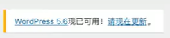

不要点现在更新，他的系统的PHP版本跟不上wordpress的版本

- 设置域名

- 设置：settings

- - 常规

  - - 修改为中文

- - - 修改URL为域名访问

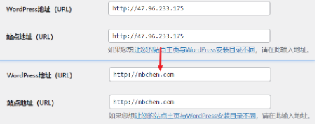

- - - 固定链接

**固定链接的设置是非常重要的，一般网站上线以后，不要随便再修改，否者不仅会影响收录，处理不当，还可能导致搜索引擎直接K站！**

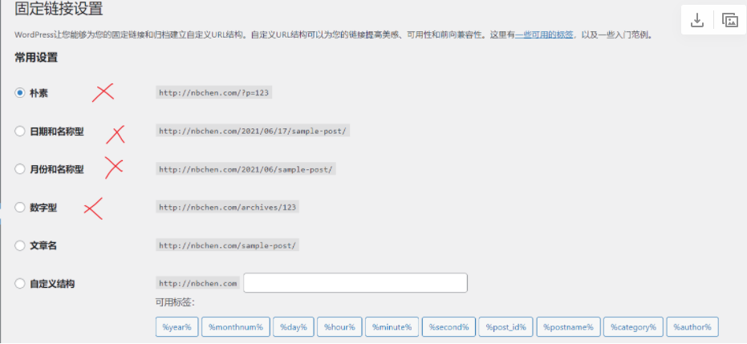

一般用后面2种

- ①自定义结构为 /%post_id% （直接以文章ID结尾），显示结果类似 http://demo.wpdaxue.info/**321**
- ②自定义结构为 /%post_id%.html （ID.html）,显示结果类似 http://demo.wpdaxue.info**/321.html**
- ③ 选择第 5 种“文章名”也就是 /%postname%/ （后面的斜杆 / 可以不要），显示结果类似 http://demo.wpdaxue.info/**文章标题/**
- ④ 自定义结构为 /%postname%.html ，显示结果类似 http://demo.wpdaxue.info/**文章标题.html**
- 其中，①和②很简短，自动生成，但是有些人比较在乎的是**文章ID不连续**，比如第一篇文章的id为 3，第二篇竟然为 13，这是由WordPress本身的标志规则和自动保存等原因造成的；
- ③和④直接以文章标题为链接，语义明确，别人一看链接就大概知道你这篇文章是说什么的，也有利于SEO。对于英文等语系来说，这是很方便的，但是中文标题做链接**，中文可能会显示为长长的乱码，**或者可能造成链接无法打开的情况。针对这个情况，你可以安装自动翻译为拼音或者英文的插件，但如果文章标题很长，翻译后的链接也是很长的，所以你可以在发布文章时，手动删减一下，或者干脆向倡萌一样，不安装翻译插件，直接手动填写。

总的来说，层级结构简单，方便你操作即可，要记住一点，**网站上线后，不要轻易再修改固定链接样式！**

- - - 媒体

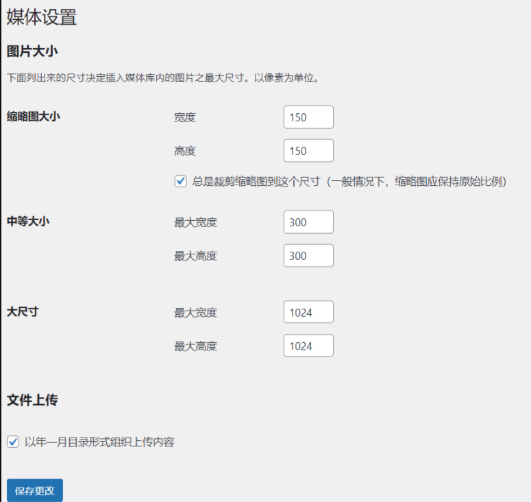

默认情况下，每一张上传的图片都会生成上面几种规格的图片（看图中文字介绍），如果不需要生成多种规格占用空间，可以全部设置为零，保存即可。

主题的设置优先级会高于这里的全局设置。

### 配置SSL

> 如何给网站配置SSL证书（https） 访问安全的需求和大众的趋势使得我们该考虑给网站加ssl了，给网站加上ssl并不难，只要申请一个免费的ssl证书，**在服务器端配置好ssl，wordpress稍加修改就可以实现https访问了。**

如今免费的ssl证书申请机构不少，对于个人站长来说使用一个免费的DV SSL就可以

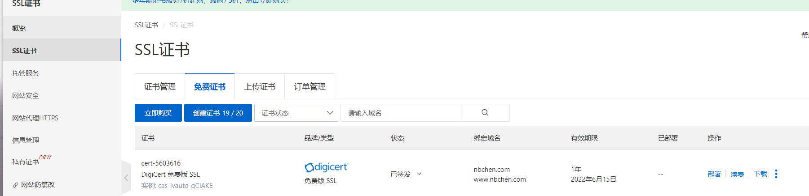

- 下载证书，得到2个文件，部署到服务器,放到`/etc/nginx/cert`

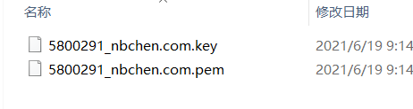

```
cd /etc/nginx/conf.d
vim default.conf

#以下属性中，以ssl开头的属性表示与证书配置有关。
server {
    listen 443 ssl;
    #配置HTTPS的默认访问端口为443。
    #如果未在此处配置HTTPS的默认访问端口，可能会造成Nginx无法启动。
    #如果您使用Nginx 1.15.0及以上版本，请使用listen 443 ssl代替listen 443和ssl on。
    server_name 域名(xx.com); #需要将yourdomain.com替换成证书绑定的域名。
    root html;
    index index.html index.htm;
    ssl_certificate cert/5800291_域名(xx.com).pem;  #需要将cert-file-name.pem替换成已上传的证书文件的名称。
    ssl_certificate_key cert/5800291_域名(xx.com).key; #需要将cert-file-name.key替换成已上传的证书密钥文件的名称。
    ssl_session_timeout 5m;
    ssl_ciphers ECDHE-RSA-AES128-GCM-SHA256:ECDHE:ECDH:AES:HIGH:!NULL:!aNULL:!MD5:!ADH:!RC4;
    #表示使用的加密套件的类型。
    ssl_protocols TLSv1 TLSv1.1 TLSv1.2; #表示使用的TLS协议的类型。
    ssl_prefer_server_ciphers on;
    location / {
        root html;  #站点目录。
        index index.html index.htm;
    }
}
# systemctl restart nginx重启nginx服务
```

- 修改后台为https

```
如果进不去后台，
修改wp-config.php临时生效一下
```

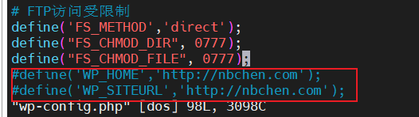

- 进入后台后，将上面注释掉。然后修改https

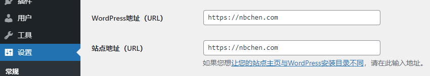

改完后就有锁了！！！

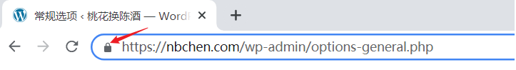

- 设置HTTP请求自动跳转HTTPS

```
# 如果您希望所有的HTTP访问自动跳转到HTTPS页面，则可以在需要跳转的HTTP站点下添加以下rewrite语句。使用示例代码前，请注意将yourdomain.com替换成证书绑定的域名。
server {
    listen 80;
    server_name yourdomain.com; #需要将yourdomain.com替换成证书绑定的域名。
    rewrite ^(.*)$ https://$host$1; #将所有HTTP请求通过rewrite指令重定向到HTTPS。
    location / {
        index index.html index.htm;
    }
}
```

- 配置了自动跳转，wordpress后台进不去了，手动修改数据为https

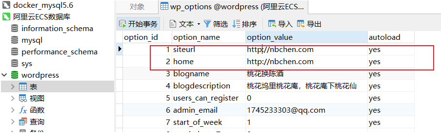

- 注意事项

```
警告 如果您使用的是阿里云ECS服务器，必须在ECS管理控制台的安全组页面，配置放行80端口和443端口，否则网站访问可能出现异常。关于如何配置安全组，请参见添加安全组规则。
```

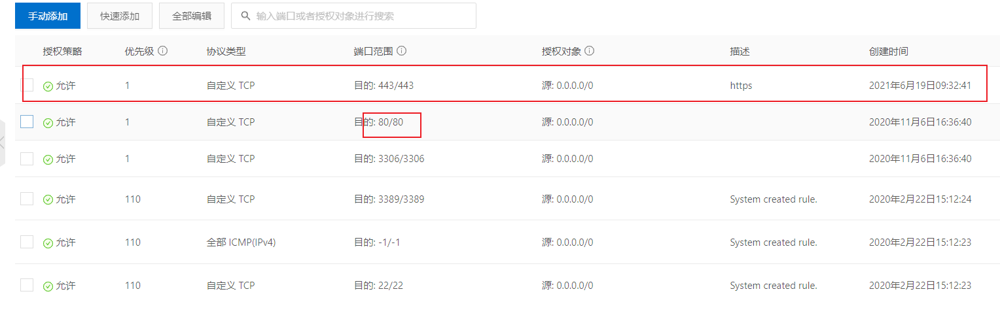

- [SSL证书服务](https://help.aliyun.com/product/28533.html) ：https://help.aliyun.com/document_detail/98728.html?spm=5176.b6927164.0.0.136256a7DxWOSz

### 安装Blocksy

> 安装的过程十分艰辛。。。FTP折腾了半天。

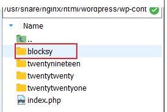

- 文档：https://creativethemes.com/blocksy/docs/integrations/page-scroll-to-id/

- - stackable ：https://docs.wpstackable.com/

- 视频：

- - b站视频:https://www.bilibili.com/video/BV1rX4y1K7yP?from=search&seid=11551451154820629218
  - youtube:https://www.youtube.com/watch?v=wzeLxEDDKoQ

- 论坛：https://wordpress.org/support/topic/translate-string-7/

- 怎么翻译blocksy中配套的文本文字：https://www.youtube.com/watch?v=MRDu6BH22aA&t=3s

```
需要下载blocksy的配套插件：loco translate。
插件的使用......稍等，我下载一个。

拓展：
POT是主题与外挂的语言模板（Language Template ），也就是在主题及外挂载入WordPress时显示的语言来源; PO是网站后端中我们所编辑的档案，MO则是网站在载入内容语言时所使用的档案。
因此Loco Translate 的编译顺序就是1.抓取主题与外挂的POT → 2. 根据POT 产生可翻译对照文字的PO 档→ 3.将翻译完成的PO 档转换为MO 档
```

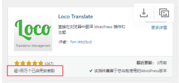

可以看到，大佬已经都翻译完了。

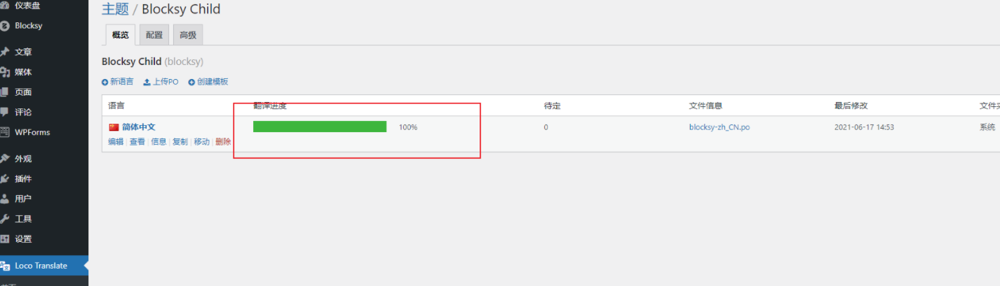

当然，你要是想自定义文字，就自行编辑即可

**关于配置文件的位置**

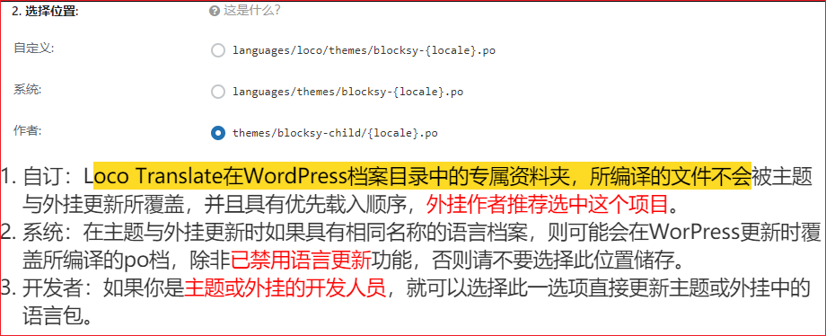

我复制了一个中文模板，然后同步，更新了字符串。就行了

- 添加账号登录注册

先开通让所有人都可以注册

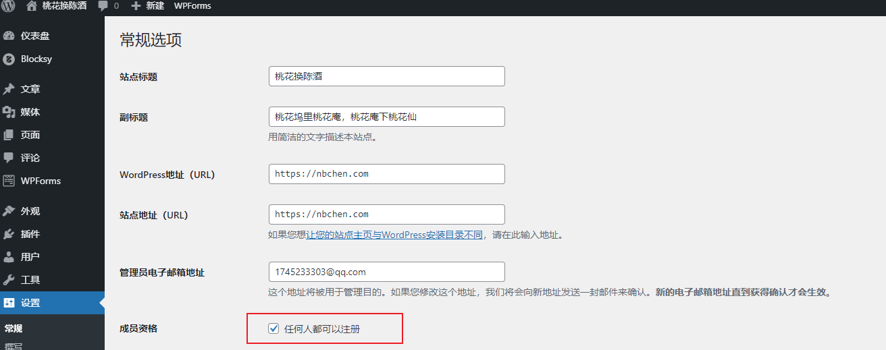

添加账号按钮

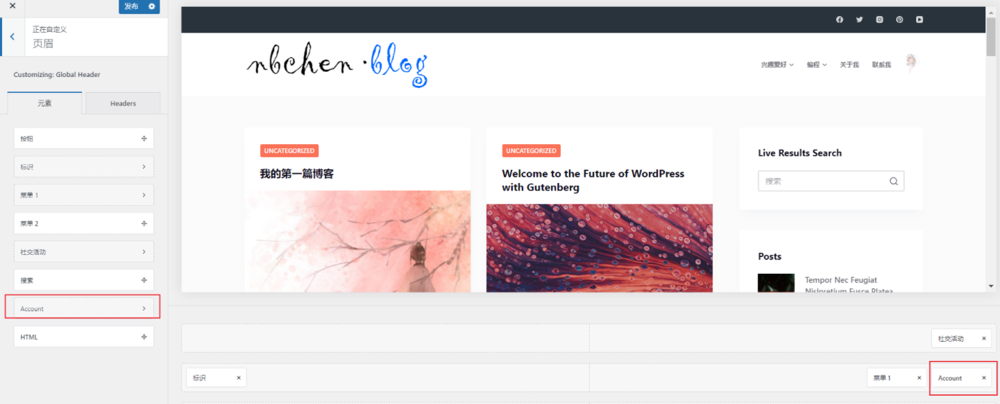

设置账号，我这里选择点击头像跳转到关于我页面。而不是到默认的后台。

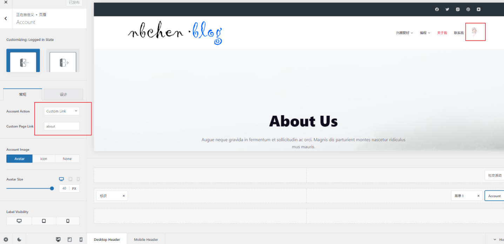

很多通过loca改不了的，要在blocksy的编辑器中修改，tilte什么的。


## 环境安装 | 宝塔(推荐)

> 域名有了，服务器有了,打算宝塔面板 + wordpress搭建一下环境,
>
> 在这里详细记录,免得后续忘了。(把ECS重置了,干净的环境,重新搭建,并记录一遍...)

### [宝塔面板安装](https://www.bt.cn/bbs/thread-19376-1-1.html)

开放安全组(80、22、3306、3389、8888、443)

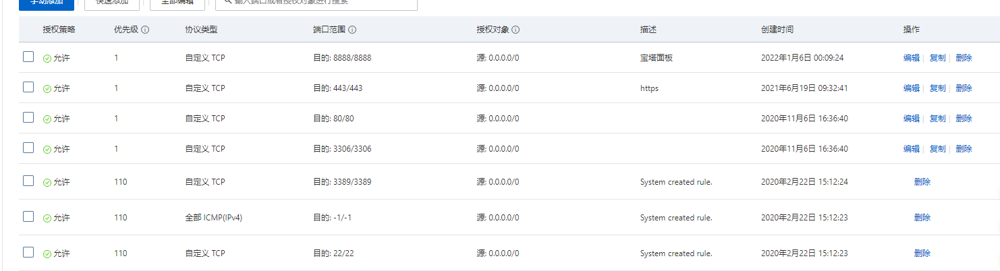

> 太香了.别折腾了.用起来吧

先注册,然后根据官网命令直接安装

```
yum install -y wget && wget -O install.sh http://download.bt.cn/install/install_6.0.sh && sh install.sh ed8484bec


Do you want to install Bt-Panel to the /www directory now?(y/n) y

Congratulations! Installed successfully!

# 安装后会提示你的宝塔面板管理地址、管理账号和管理密码,自行记录
```

> 或者可以重装那个系统的时候选择宝塔面板安装

然后一键安装LNMP包,版本自己选择

我这里选了：nginx1.20+mysql7+php8.0+pureftpd-1.0

### wordpress安装

然后软件商店: 一键部署wordpress

> 一键部署可能不是最新版本的，如果想要体验最新版本，可以自己下载，然后通过宝塔面板上传上去，具体见：[教程](https://blog.naibabiji.com/tutorial/bao-ta-an-zhuang-wordpress.html)
>
> 或者一件安装后再升级，一样的

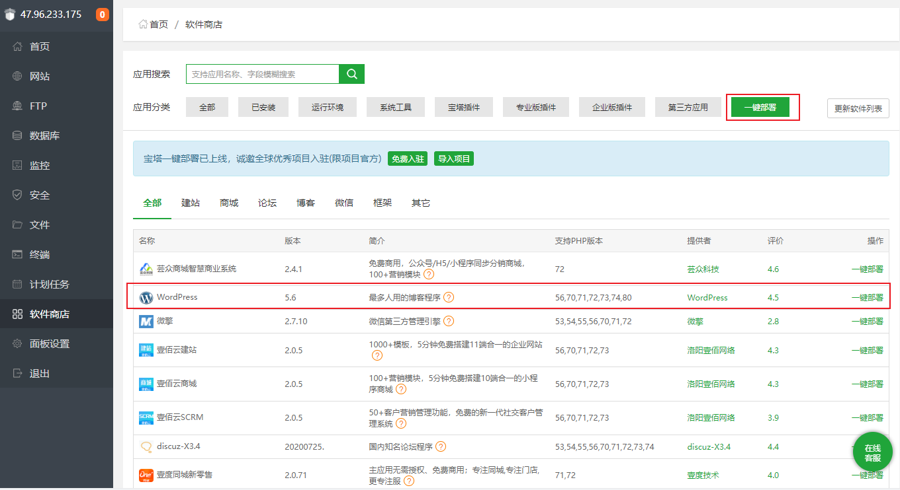


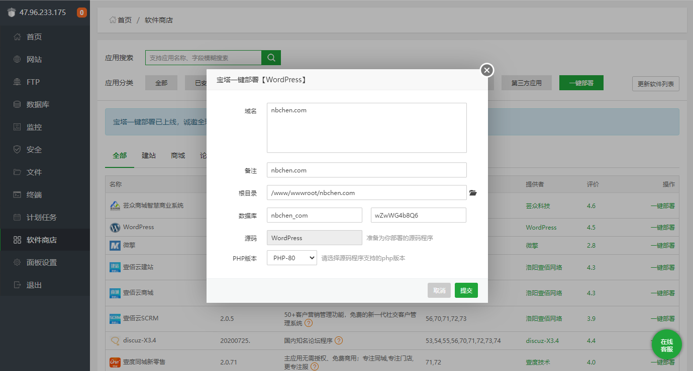

部署后返回用户名+密码+访问站点(访问wordpress配置页面,eg:https://域名(xx.com)/index.php)

进入wordpress后台前的一些设置(数据库名,数据库用户,wordpress管理后台用户名,密码,标题,电子邮件等等)

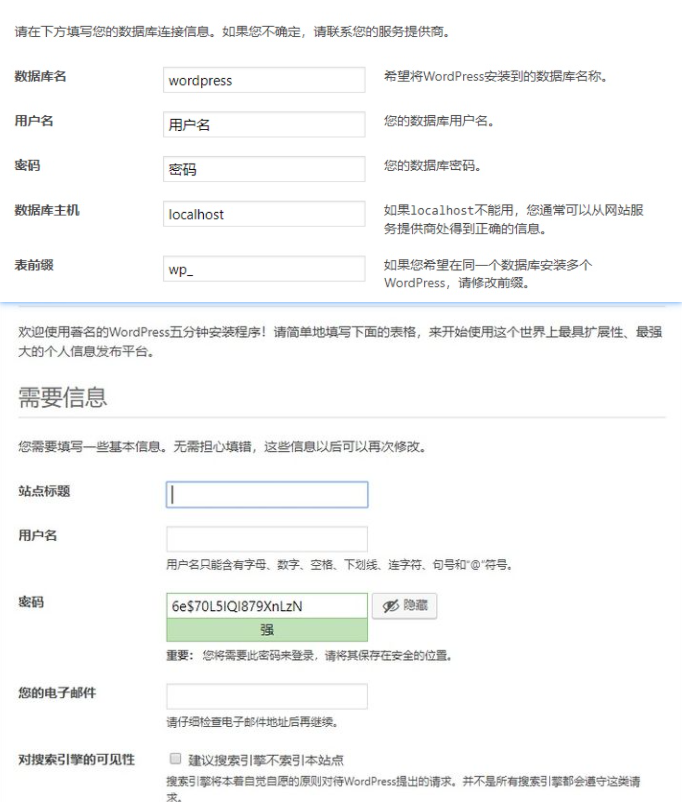

配置后如果遇到cookie报错:

```
Cookies被阻止或者您的浏览器不支持。要使用WordPress，您必须[启用cookies]
```

设置一下浏览器cookie,就行了.chrome->设置,添加cookie(自己的域名)

然后进入后台：

http://域名(xx.com)/wp-admin/

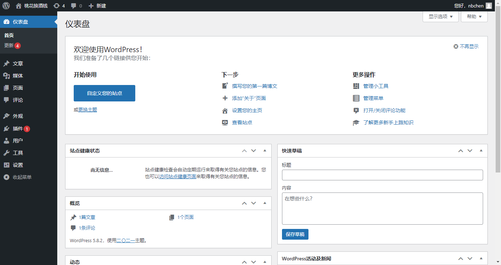

> 开启wordpress之旅吧

## wordpress后台配置

### 固定连接

```
添加后缀.html：在后台外观-主题选项-页面添加.html后缀。
固定链接设置：在后台设置-固定链接-自定义结构一栏修改链接结构。
/%category%/%postname%.html
```

这时候访问文章会404的,还需要在宝塔面板->网站->设置->伪静态

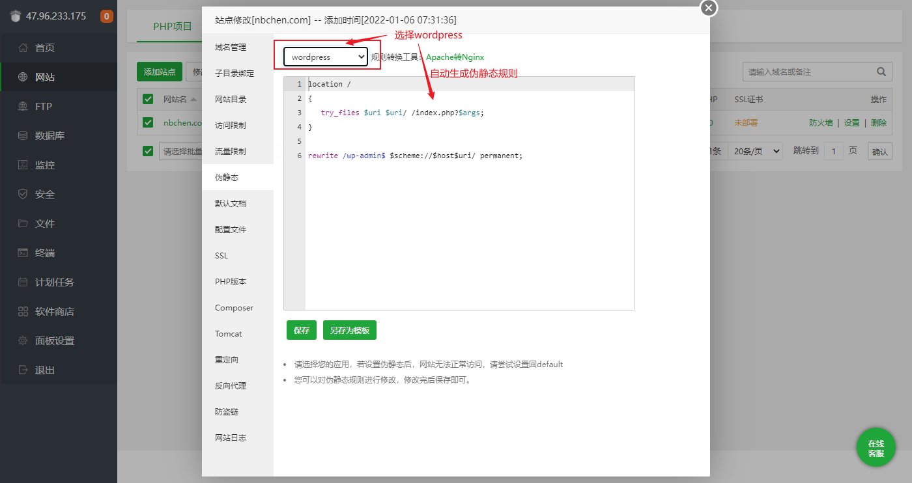

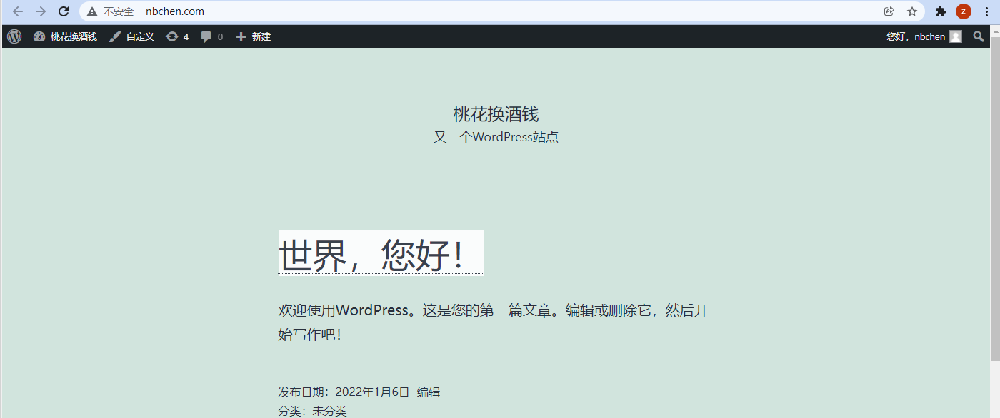

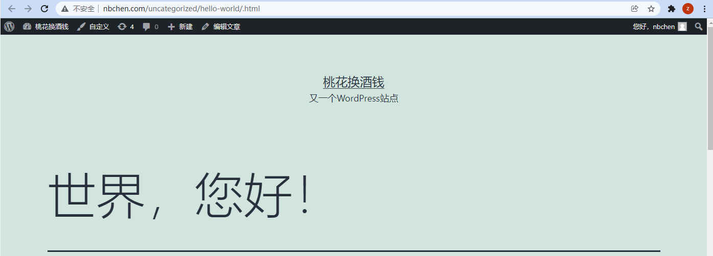

### 配置SSL

> 网站有个锁,看着舒服些

下载key和pem

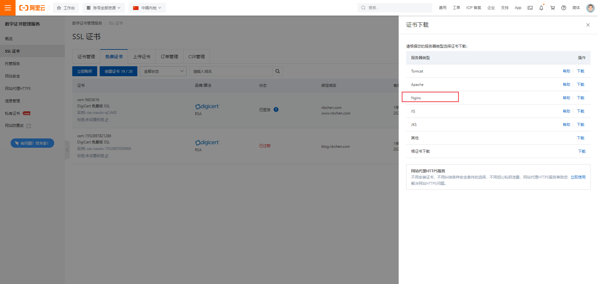

在宝塔后台配置SSL

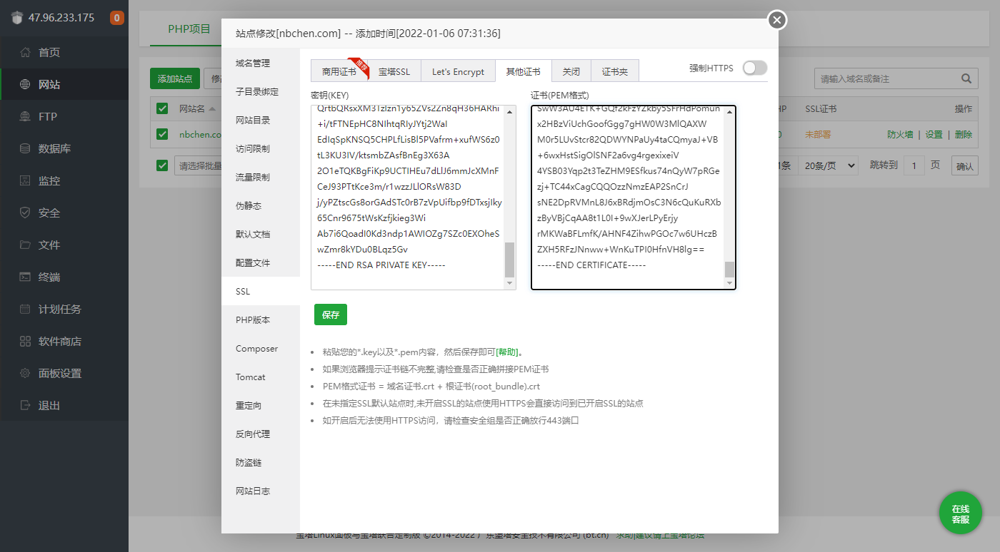

> 用默认的Let's Encrypt也可以,会自动续签

### 网站标题、副标题

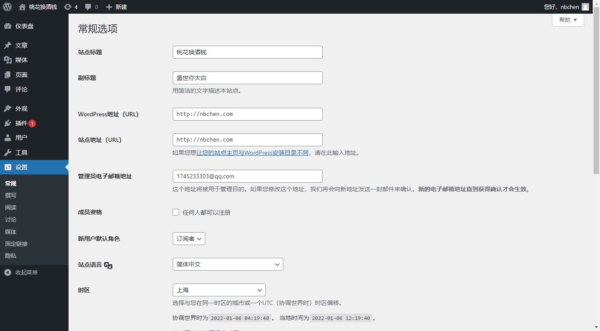

### 时间格式

我喜欢2022-01-06 19:47:00这样的格式 

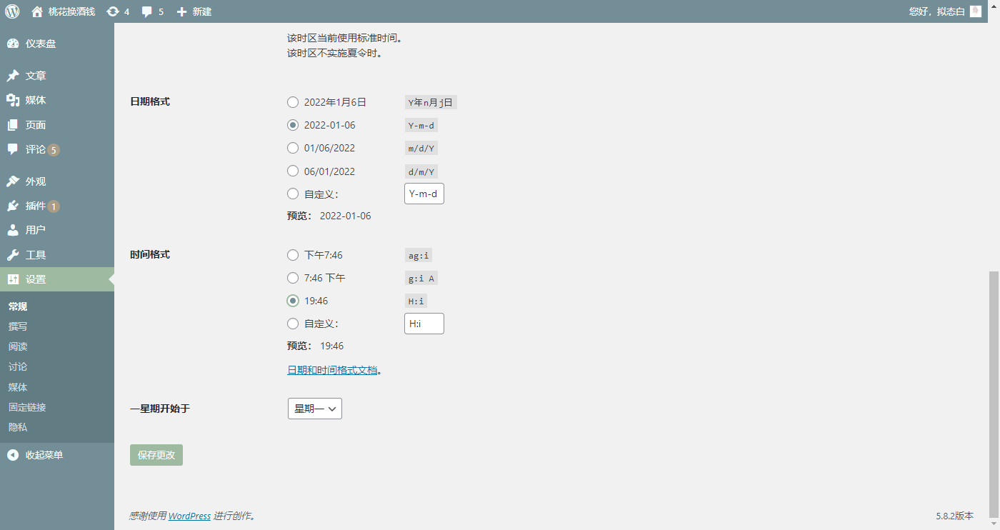

### 设置昵称、头像

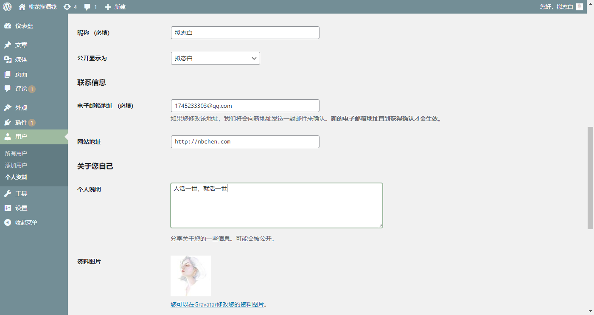

### 禁用媒体图片生成

> wordpress默认会给你上传的图片生成额外的三种尺寸的图片。会占用空间，看个人取舍吧。

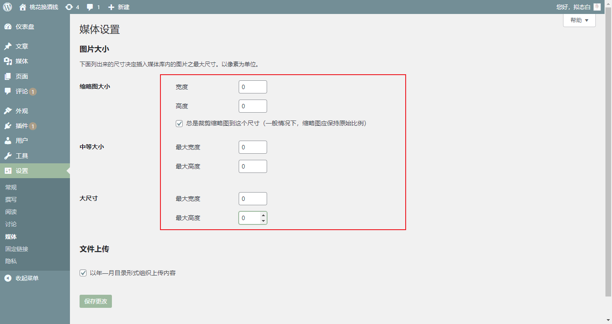

理想的尺寸

```
1200 x 630 像素 – 博客文章图像大小
1048 x 250 像素 – 横幅尺寸
1200 x 900 像素 – 横向
900 x 1200 像素 – 纵向
1920 x 1080 像素 – WordPress 背景图片大小
200 x 100 像素 – 徽标图像大小
150 x 150 像素 – 缩略图大小
```

支持的图片类型

```
.jpg 
.jpeg 是照片的最佳选择
.png 是图形的首选
.gif
.ico
```

**除了大照片 – WordPress 图像大小不应大于 150kb** =>不用解释了应该,请求,图片大就慢

> 后期可以考虑下压缩图片

### 设置https地址

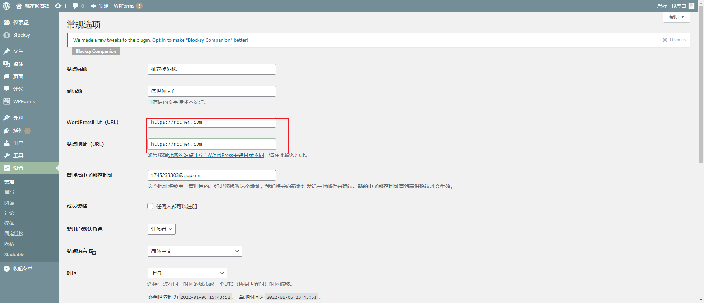


## 主题安装 - blocksy

> 简单的说一下吧，
>
> 这款主题长在我的审美上了，很精致，免费的功能已经比一些收费的还好了一大截了

- [问题工单支持](https://creativethemes.com/blocksy/support/)：尝试了一次,太给力了.5分钟之内答复了。

### [安装blocksy](https://www.youtube.com/watch?v=6464vA9RN_A)

在`外观`->`主题`搜索blocksy->`安装`就行了

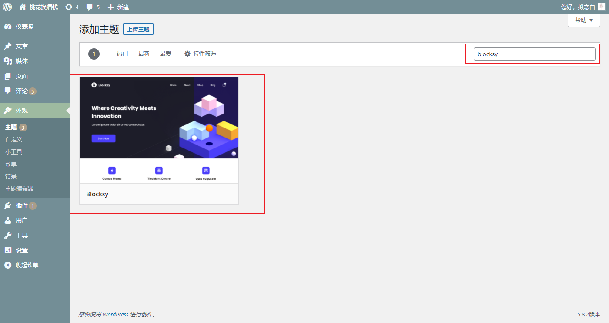

点击启用即可成功激活blocksy,并且外观菜单下会有blocksy子菜单

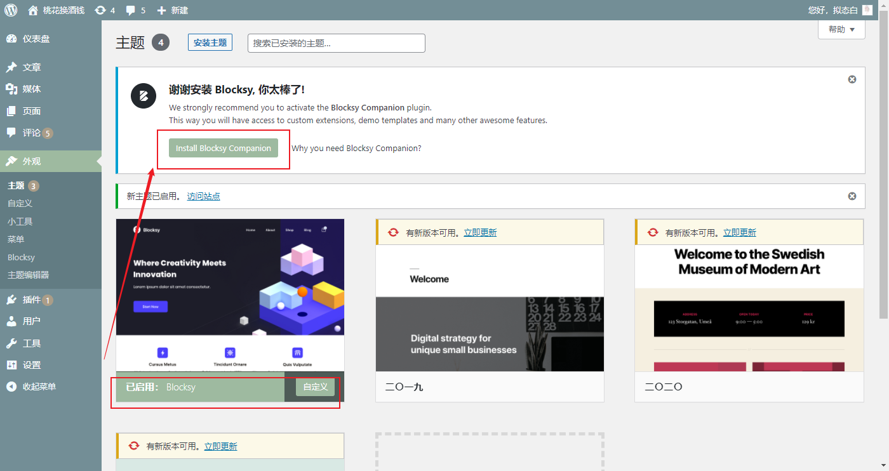

> 默认主题可以删除了(点击主题详情,右下角有删除按钮),占地方 >.<

同时官方强烈推荐你安装[blocksy companion](https://creativethemes.com/blocksy/companion/),ok安装~安装后要激活一下哈

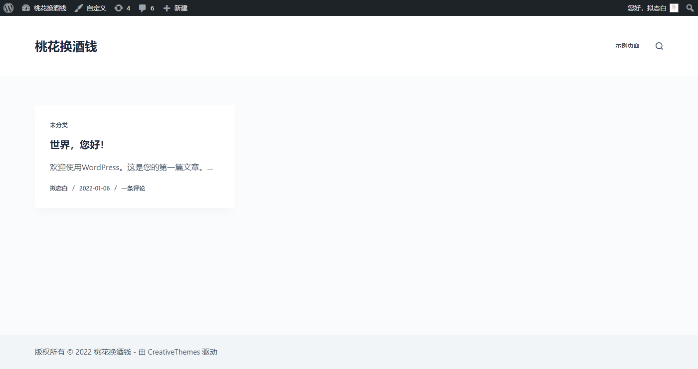

### [安装blocksy child](https://creativethemes.com/blocksy/docs/general/child-theme/)

因为我们需要对主题做很多自己的个性化设置。如果系统/主题更新,会影响到。所以一般还要安装子主题blocksy child。

> 除了style.css外,假设你修改了PHP,JS,CSS文件，你更新了blocksy主题的时候,
>
> 假设你在blocksy child修改了 single.php ,然后更新了blocksy,并且blocksy的single.php有更新,如果你child不包含blocksy的更新内容，那会报错。

您可以在[此处](https://creativethemes.com/downloads/blocksy-child.zip)下载子主题并按照以下步骤进行安装：

1. 前往WordPress 仪表板中的**外观**→**主题**
2. 单击“**添加新”**按钮，然后单击“**上传主题”**按钮
3. 选择`blocksy-child.zip` 您之前下载的 文件，然后单击“**立即安装”**按钮
4. 安装过程完成后，点击**激活**按钮

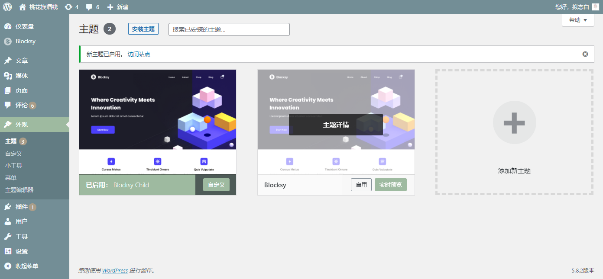

现在您已经激活了子主题，您可以开始将自定义 css 添加到子主题 `style.css` 文件中。

默认不会加载子主题的style.css,如果你需要的话可以在子主题blocksy child的`functions.php`中添加`style.css`

```
add_action( 'wp_enqueue_scripts', function () {
	wp_enqueue_style('blocksy-child-style', get_stylesheet_uri());
});
```

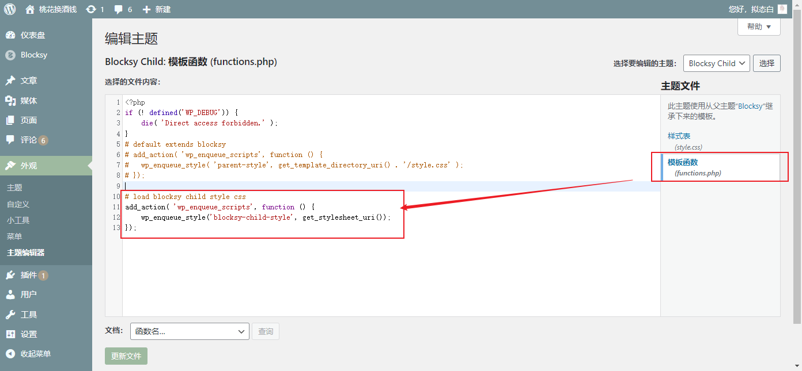


### 挑选starter Sites

> 打勾的是我觉得比较适合国内技术博客的demo

- [ ] Garderobe
- [ ] Petsy
- [ ] Justice
- [ ] Wedding
- [x] Web Agency:Gutenber
- [ ] Persona
- [x] Yogi:Gutenberg
- [x] Homi:Gutenberg、Brizy、Elementor
- [ ] Tasty
- [x] Business:Gutenberg、Brizy、Elementor
- [ ] Product Reviews
- [ ] Charity
- [ ] Travel
- [ ] App
- [ ] Modern Shop
- [x] Blocksy News:Gutenberg
- [ ] ... 持续增加中 ...

> 我选择了Blocksy News

### 导入Blocksy News

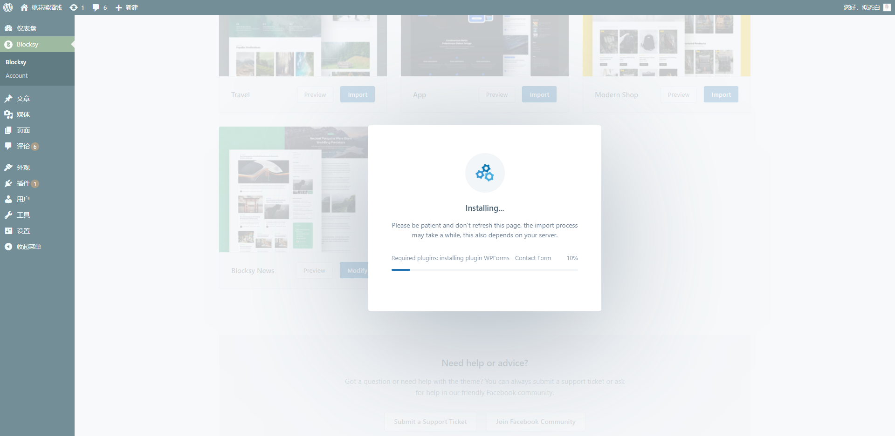

> 问题：卡在42%了

宝塔面板,修改php.ini

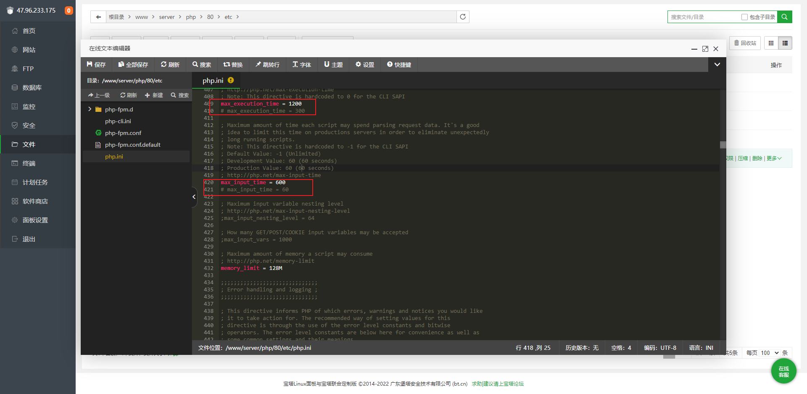

重载配置/重启PHP

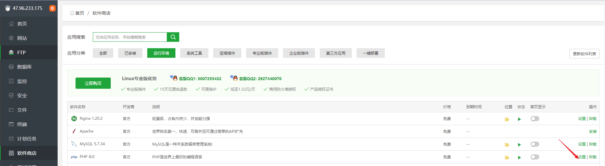

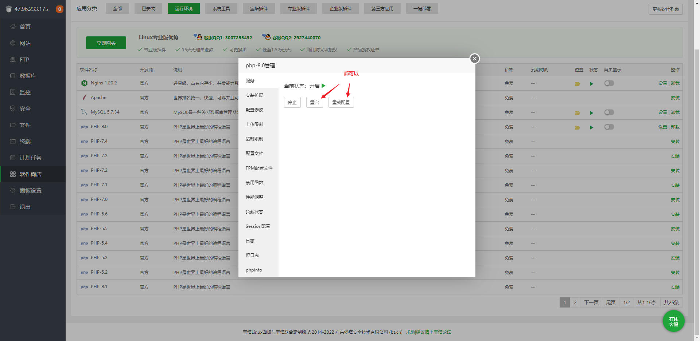

可以看到修改生效

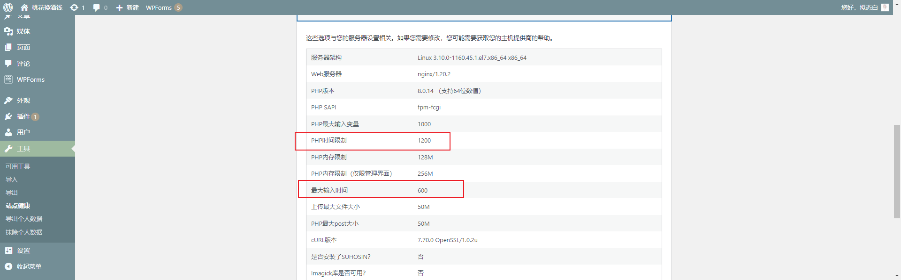

重新安装,虽然慢...但是下载成功了。

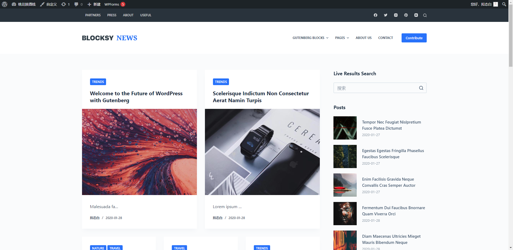

> 开启你的blocksy之旅吧 >.<

## blocksy主题配置

设置之前我把语言改为英文的，因为中文的把主题里面的一些选项也汉化了。看不懂了...

更改语言：

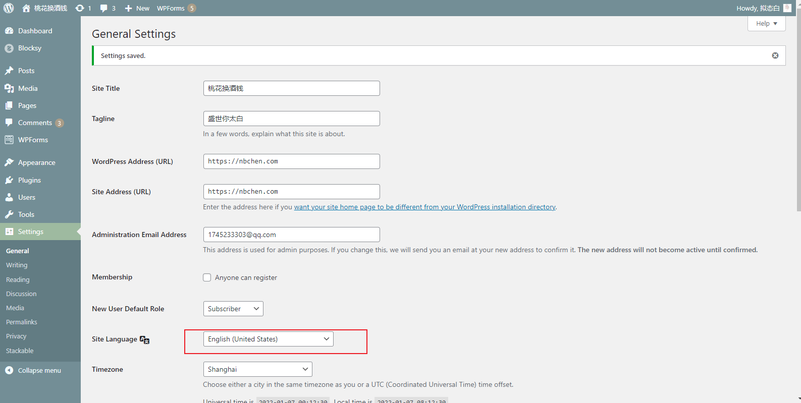

> 下面的修改点会比较零散

### 公共/通用设置

#### 返回顶部

适合长文

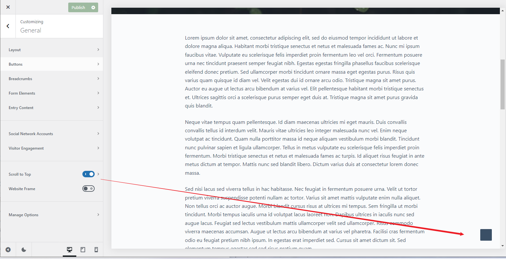

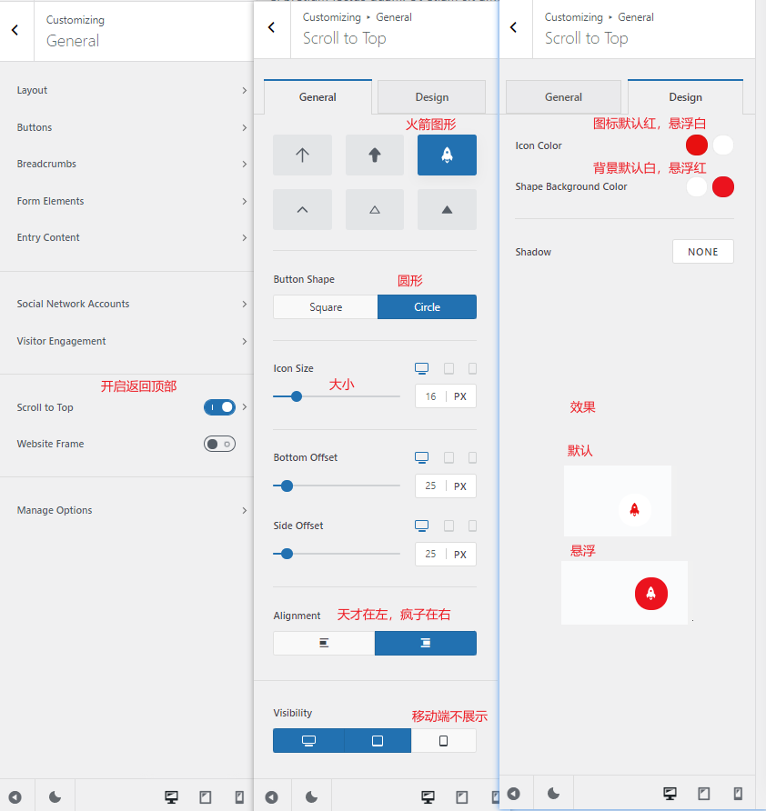

### 头部header设置

#### logo设置

Header>Logo

图标设计：[找个好看的字体](https://www.dafontfree.net/gigi-regular/f64840.htm)-GiGi -> PS 修改文字 -> Adobe Illustrator 创建SVG

> 无力吐槽,创建一个SVG,折腾了一圈,下载了Gigi字体(发现系统自带 t-t)->下载了inkscape(用不来 >.<)->下载了Adobe_Photoshop_2021(没有导出SVG QAQ)->下载了Adobe_Illustrator_2021(呜呜呜,终于可以了...)

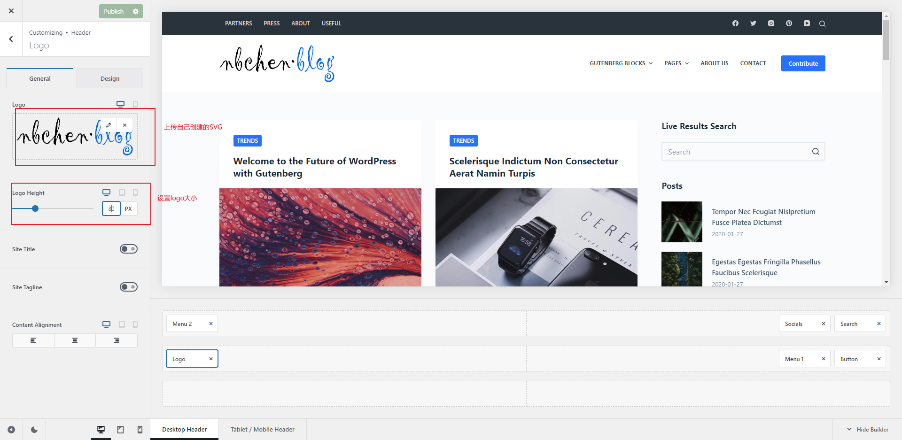

补充：下面Site Title和Site Tagline可以设置网站标题和副标题

### 侧边栏sidebar设置


#### 设置侧边栏标题为中文

在小工具下面设置


### 文章post设置

#### 文章布局

我喜欢横着的卡片展示，cards Reveal Effect开启卡片展示效果


#### 设置图片悬浮扩大


### 文章详情设置


### 分类设置


### 底部footer设置

页脚很大一块，国外的大致都是这样的，我不太喜欢这种的


> 插一句,这些块在这里定义的,你也可以自定义一个块,然后引入


#### [热门帖子](https://creativethemes.com/blocksy/docs/extensions/trending-posts/)修改


#### 设置底部copyright


#### 自动更新版权年份(todo)


### wordpress 布景主题

页首页尾

网站一致性:同一颜色、字体、字大小

页面预设的样子

文章预设的样子

汇总页面:分类、tag、搜索结果

404页面

自定义local font css


> 核心中的menu、widgets、homepage settings建议不在blocksy中改，而是回到wordpress中改


### 联系我设置


更多技巧：https://wordpress.com/zh-cn/support/wordpress-editor/blocks/archives-block/


### 图片添加文字


如果文字有样式,可以在外面写完,然后添加到可重用区块,然后插入

### 添加轮播图

[参考官方文档](https://creativethemes.com/blocksy/docs/developers-general-developers/flexy-slider-shortcode/)


### 菜单设置

#### 创建一个新的菜单并且设置展示位置


#### 添加关于我页面


#### 自定义链接跳转到首页


#### 添加架构师菜单

创建一个架构师分类


设置菜单


### 关于分类和标签

分类是大方向上的，如：生活，架构师，建站，音乐，游戏，影视...

标签是小方向上的，如：NIO、Netty、王者荣耀、决战平安京...

我会这样划分

#### 添加标签


### 讨论设置

可以设置评论相关，以及评论头像等


## 小技巧

### 自定义一个页面模板

创建页面/usr/share/nginx/html/wordpress/wp\-content/themes/blocksy\-child/page/page\-test.php

```
<?php
/* template name: Test页面 */
get_header();
?>
恭喜你，成功了
<?php get_footer();
```

查资料想要在主题中加载模板页面需要在function.php增加下面代码（试了可行）。但是blocksy主题好像会直接识别，所以我这里就不用添加了。加了会有2个重复的模板。

```
//添加页面模板
//从特定页加载模板
add_filter( 'page_template', 'wpa3396_page_template' );
function wpa3396_page_template( $page_template ){
	if ( get_page_template_slug() == 'page-test.php' ) {
		$page_template = dirname( __FILE__ ) . '/page/page-test.php';
	}
	return $page_template;
}
/**
* 将“自定义”模板添加到页面属性模板部分。
*/
add_filter( 'theme_page_templates', 'wpse_288589_add_template_to_select', 10, 4 );
function wpse_288589_add_template_to_select( $post_templates, $wp_theme, $post, $post_type ) {
	// 添加自定义模板到页面选择下拉列表
	$post_templates['page-test.php'] = __('Test页面');
	return $post_templates;
}
```

在wordpress后台新建页面\-\>页面模板处可以看到名为Test页面的模板

创建页面可以看到效果


可以直接查看的HTML树形菜单页面

```
<!DOCTYPE html>
<html>
<head>
<meta name="viewport" content="width=device-width, initial-scale=1">
<style>
ul, #myUL {
  list-style-type: none;
}

#myUL {
  margin: 0;
  padding: 0;
}

.caret {
  cursor: pointer;
  -webkit-user-select: none; /* Safari 3.1+ */
  -moz-user-select: none; /* Firefox 2+ */
  -ms-user-select: none; /* IE 10+ */
  user-select: none;
}

.caret::before {
  content: "\25B6";
  color: black;
  display: inline-block;
  margin-right: 6px;
}

.caret-down::before {
  -ms-transform: rotate(90deg); /* IE 9 */
  -webkit-transform: rotate(90deg); /* Safari */'
  transform: rotate(90deg);  
}

.nested {
  display: none;
}

.active {
  display: block;
}
</style>
</head>
<body>

<h2>Tree View</h2>
<p>A tree view represents a hierarchical view of information, where each item can have a number of subitems.</p>
<p>Click on the arrow(s) to open or close the tree branches.</p>

<ul id="myUL">
  <li><span class="caret">Beverages</span>
    <ul class="nested">
      <li>Water</li>
      <li>Coffee</li>
      <li><span class="caret">Tea</span>
        <ul class="nested">
          <li>Black Tea</li>
          <li>White Tea</li>
          <li><span class="caret">Green Tea</span>
            <ul class="nested">
              <li>Sencha</li>
              <li>Gyokuro</li>
              <li>Matcha</li>
              <li>Pi Lo Chun</li>
            </ul>
          </li>
        </ul>
      </li>  
    </ul>
  </li>
</ul>

<script>
var toggler = document.getElementsByClassName("caret");
var i;

for (i = 0; i < toggler.length; i++) {
  toggler[i].addEventListener("click", function() {
    this.parentElement.querySelector(".nested").classList.toggle("active");
    this.classList.toggle("caret-down");
  });
}
</script>

</body>
</html>
```

### 创建独立友链页面

创建page\-links.php,复制主题中的单页面模板single.php


### 文章分页

```
我们可能会碰到这样一种情况：发布的文章或页面太长，想要把一篇文章分成好几页，有的时候是为了方便用户阅读，有的时候可以说是为了SEO，到底为了什么目的，那是你的事儿了，我们在这里只是告诉你如何实现Wordpress的文章分页功能。
WordPress系统是内置分页功能的，要实现它极其简单，只需要在你想要分页的地方加入下面的代码即可(注意，是在文本编辑模式下)：
<!--nextpage-->
但还有一个问题．要让这个代码真正能够实现其分页功能，还需要你所使用的Wordpress主题支持，Wordpress的默认主题是支持的，如果你的主题不支持，那解决方法也很简单，找到你主题文件内的single.php里的下面这行代码：
<?php the_content(); ?>

在这段代码下面加上：
<?php wp_link_pages('before=<div id="page-links">&after=</div>'); ?>
即可。

如果你想了解更多，请查阅 wp_link_pages()
如果你不想每次都切换到文本编辑模式，那你可以 在 WordPress 编辑器添加“下一页”分页按钮
```

### 修改历史

小技巧 | 修改历史

* 删除WordPress修订版数据

```
WordPress默认并没有对修订版做数量显示，随着时间的推移，可能会保存了很多修订版数据 ，会占用了大量的数据库存储空间，你可以使用 WP-Sweep 或 WP-Optimize 插件删除现有的修订版数据 。
```

* 限制WordPress修订版本数

```
我们可以通过修改WordPress修订版本的数量来避免一篇文章存在太多的修订版，实现方法很简单，只需要将下面的代码添加到网站根目录的 wp-config.php 即可：
// 120秒保存一次，根据需要修改数字即可
define('AUTOSAVE_INTERVAL', 120);
//保存 10 个版本，，根据需要修改数字即可
define('WP_POST_REVISIONS', 10);
```

* 禁用WordPress修订版功能

```
一般来说，我们不推荐禁用WordPress修订版功能，毕竟这个功能还是有些用处的，当然了， 如果您一定要禁用，那也是非常方便的，将下面的代码添加到网站根目录的 wp-config.php 即可：
//一个版本都不保存（即禁用自动保存功能）
define('WP_POST_REVISIONS', false);
```

### 在WordPress菜单中添加无链接的菜单

小技巧 | 在WordPress菜单中添加无链接的菜单

* 1.后台 \> 外观 \> 菜单，通过“自定义链接”面板添加一个菜单项，如下图，填写一个任意的“URL”和“标签”，点击“添加至菜单”


* 2.然后再展开该菜单项，删除“URL”，保存菜单 即可。


**弊端**：在输出的HTML代码中，仍旧使用了\<a\>标签包裹菜单项：\<a\>无链接菜单\</a\>

扩展：url处写上 javascript:void\(0\)，应该也可以

## 插件安装

- SEO插件

Rank Math:https://blog.naibabiji.com/tutorial/rank-math.html

- 缓存插件

免费:[WP Super Cache](https://blog.naibabiji.com/skill/wp-super-cache.html)，

付费:[WP Rocket](https://blog.naibabiji.com/files/wp-rocket-xia-zai.html)；

- 网页效果

[Elementor Pro](https://blog.naibabiji.com/files/elementor-pro.html)

- Fakerpress : 帮我们生成模拟的文章,一般用于网站初期搭建样式的时候做测试用的

### 插件-wordpress loco 翻译

wordpress 最新版后台已经是汉化了的。blocksy 主题需要我们手动设置一下

比如下一个改为下一页


### 插件-wordpress Akismet过滤垃圾评论

默认有，启用就行了

会让你登录拿到一个token，费用选0美元就行


全是垃圾评论 >.<


### markdown 插件

#### WP Githuber MD 编辑器

安装：


#### Enlighter

#### Code Prettify


### markdown目录插件

更多插件：

* 文本目录


```
文本目录：http://www.wpdaxue.com/content-index-for-wordpress.html
```

* WordPress侧边栏插件，可增强侧边栏
* Elementor Pro /主题生成器

```
Elementor Pro可通过两种主要方式帮助您使用侧边栏。
首先，主题生成器非常适合让您在不需要任何编码知识的情况下添加，移动或删除侧边栏区域。正如我们在上面显示的那样，您可以轻松创建自己的主题模板，其中包括零个、一个、两个（或更多）侧边栏。更好的是，您可以通过可视化的拖放界面来完成所有这些操作。
其次，Elementor Pro还允许您为侧边栏创建自定义设计。您可以使用可视界面创建选择加入的表单，CTA等。然后，您可以通过保存模板并使用Elementor Library小工具轻松地将它们添加到任何侧边栏中。
```

- Content Aware Sidebars

```
我们还在上面提供了Content Aware Sidebars，可以轻松地有条件地将默认侧边栏替换为不同侧边栏的不同内容。通过让您将边栏内容个性化为访问者正在查看的确切内容，可以帮助您优化侧边栏的使用方式。
```

- WordPress Popular Posts

```
WordPress Popular Posts是一个有用的插件，可让您在边栏中显示最受欢迎的内容。您可以通过不同的指标来显示热门内容，例如历史访问量，上周的访问量，评论等等。
它还适用于自定义文章类型。例如，您可以使用它在电子商务商店中显示最受欢迎的WooCommerce产品。
```

- Recent Posts Widget With Thumbnails

```
Recent Posts Widget With Thumbnails为您提供了另一个在侧边栏中显示内容的选项。只有这次，它才是您的最新内容，而不是您以前的插件那样最受欢迎的内容。
尽管WordPress确实带有一个默认的小工具来显示您最近的文章，但是此插件的优点是它为您提供了更大的灵活性，包括可以选择在帖子列表中包含精选图片缩略图。
```

-  Q2W3 Fixed Widget for WordPress

```
Q2W3 Fixed Widget for WordPress可让您在侧边栏中使某些小工具“粘滞”。也就是说，即使用户向下滚动经过小部件，该小工具也将“粘在”侧边栏并始终可见。
这是突出显示关键小部工具的一种好方法，也是许多网站用来显示粘性广告的一种策略。
```

- Advanced Sidebar Menu

```
如果要使用侧边栏来帮助访问者浏览您的网站，则Advanced Sidebar Menu可通过考虑页面和类别的父/子关系来帮助您为页面或类别创建更优化的导航部分。
例如，您可以自动缩进子类别，选择要显示的“级别”以及更多。
```

- Ad Inserter

```
如果您想在侧边栏中（或网站上的其他任何地方）显示广告，则Ad Inserter是一个超级有用的插件。它可以帮助您管理广告，自动将其注入到小工具中，并根据广告执行许多其他有用的操作。
```

- Widget Options

```
Widget Options类似于Content Aware Sidebars。但是，您不必根据各种条件显示完全不同的侧边栏，而是可以根据您设置的条件显示/隐藏单个小工具。
基本上，如果您不需要Content Aware Sidebars的全部灵活性，则此插件可以让您使用各个小工具，从而为您提供了更具针对性的方法
```


## SEO

### 网站统计

> 你可能对每个到访的朋友感激并好奇
>
> 你可能对每天有多少人/IP访问自己的网站, >.< 

百度统计

### 提交网站到搜索引擎

> 新的网站收录需要时间,你可以毛遂自荐

创建要给sitemap.xml,提交到搜索引擎站长平台

- 生成sitemap插件

```
Yoast SEO
谷歌 XML 站点地图
All in One SEO Pack
Rank Math
```

感觉保持一致比较好，用Rank Math

> 访问https://域名(xx.com)/robots.txt可以查看robots
>
> 访问https://域名(xx.com)/wp-sitemap.xml可以查看Sitemap

- 关于robots: 只是告诉搜索引擎请勿打扰,并不能保护一些恶意探寻隐私的行为

- 关于sitemap：告诉蜘蛛怎么爬取网站的页面。更方便收录。


解读：1.禁止抓取/wp-admin/下面的目录 2.允许抓取/wp-admin/admin-ajax.php文件

一个例子：

```
User-agent: *
Disallow: /wp-admin/
Disallow: /wp-content/plugins/
Disallow: /?s=*
Allow: /wp-admin/admin-ajax.php

User-agent: YandexBot
Disallow: /

User-agent: DotBot
Disallow: /

User-agent: BLEXBot
Disallow: /

User-agent: YaK
Disallow: /

Sitemap: https://blog.naibabiji.com/sitemap_index.xml
```

检测robots是否生效：

- [百度检测](https://ziyuan.baidu.com/robots/index) 不支持https

- [爱站检测](https://tools.aizhan.com/robots/blog.naibabiji.com/) 支持https

### 加速百度收录

- 在百度搜索自己的网站,然后点`提交网址`提交网站给百度
- 网站备案,申请新站保护,可以有效加快收录
- 使用百度服务
- 找大站做友链
- 百度推动代码
  - 多合一搜索自动推送管理插件
- 保持文章更新(有价值,原创的文章)

> 独立博客不容易, 你的鼓励是我坚持的最大动力 >.< 
>
> 一周至少一篇优质文章，坚持下去

### 各大搜索引擎提交入口

```
百度提交入口：https://ziyuan.baidu.com/linksubmit/url

360搜索提交入口：http://zhanzhang.so.com/?m=PageInclude&a=index

搜狗搜索提交入口：http://zhanzhang.sogou.com/index.php/urlSubmit/index

神马搜索提交入口：http://zhanzhang.sm.cn/

Google搜索提交入口：https://www.google.com/webmasters/tools/submit-url?pli=1（谷歌搜索控制台工具）

必应搜索提交入口：https://www.bing.com/toolbox/webmaster/

头条搜索提交入口：https://om.toutiao.com
```

### SEO优化

> 有些点上面有提及了，这里做个汇总归纳

- 确定好是否使用带www的域名

> 域名(xx.com)是主域名,www.域名(xx.com)是子域名

做国内SEO优化，建议使用带有www的域名

我这边解析的时候,www设置可以跳转到主域名.应该也算可以

- 添加SSL证书

- 站点标题优化

站点标题通常都是你网站的名称，而副标题就是介绍你网站整体内容的一小段话。而这段话里面最好包含你网站要做SEO的关键词信息，

- SEO插件

Rank Math,Yoast SEO

- 设置友好的固定连接

- 文章带有关键字

- 取个好的文章标题（标题党 >.<）
- 编辑元数据(description)

不影响收录,但是自动截断的可能不吸引人,额外编辑的关键描述可能会吸引到默写读者。

每篇都写也麻烦,你可以选择重要的文章写一写

- 合理使用标题标签

```
网页标题用H1
副标题用H2
其他的依次递减
```

- 长文章使用目录

这个主要是为了方便读者阅读

- 图片添加ALT标签

- 合理命名图片

```
不要使用中文名图片
不要使用无意义的命名
建议使用和内容相关的英文词来命名
单词之间包含连字符分开
文章特色图片名称包含关键词
```

好像挺麻烦的，看到时候有没有插件吧，不然还是随机命名了 

- 文章写作技巧

一般第一段要有核心关键词，这个也是倾向于留住读者

- 长文章排名会不错

当然要适合长文章,比如技术类的文章。单篇长文+目录就不错。

- 合理使用nofollow链接

默认就是,防止评论的垃圾链接降低你的网站排名

- 做好内链

网站内的文章链接

- 做好外链

其他人的网站链接

- 设置网站地图
- 向搜索引擎提交网站
- 研究研究关键字
- 使用结构化标签Schema
- 重要文章保持更新
- 优化网站速度

研究显示，一个页面超过4秒还没有打开，那么四分之一的访客会选择放弃该网站。

实际上3s我可能就等不了了,除非是他的标题太吸引我了

- 死链检测

会影响抓取、降低用户体验

- 移动端适配

实际上,技术类博文还是偏向PC端。

而且,就我自己来说,一般都是搜索特定类型。浏览器那些乱七八糟的文章现在都不看的。

[移动端检测工具](https://search.google.com/test/mobile-friendly)

- 安装统计代码

一定程度上拖慢网站速度,但是分析数据是SEO优化的工作。同时我觉得也是给自己继续做的动力

Google Analytics（分析）

- 跟踪关键词排名

就是用户搜索 XXX 关键词,你的网站会不会在第一条

- 高质量图片

会降低速度，可以使用CDN服务.

主要是为了更好的Google图片搜索排名

- 增加用户会话时长

字面意思,就是内容要优质,吸引住读者

对应：**网站跳出率**

- 删除无意义文章
- 删除重复内容
- 创建关于页面
- 删除垃圾评论
- 添加面包屑导航
- 使用出站链接

意思就是文章适当的时候应该插入一些外部网站的链接。

## 网站统计

访客主要在国内的话，推荐用百度统计或者CNZZ；访客主要在国外的话，推荐用Google Analytics。

## 网站速度

做缓存、删插件、备份数据库等

* 主机

```
1.你的域名和你的主机最好在一个IDC哪儿，如果不是的话，建议你采用口碑良好的DNS服务商，让域名以最快的速度解析到主机上。
2.你的服务器/主机空间应该够快，怎么才能够快呢？
    CPU的配置、CPU的使用率、物理内存的大小、磁盘类型以及磁盘的I/O性能（包括Mysql数据库服务器所用磁盘）、Mysql响应速度以及Mysql并发数等等，都会影响到网站的快与不快，并且是物理性的影响。
```

* 主题

```
直观来看，包含尽量少的php、js、css和字体（字体或图标字体）文件的主题性能会好些。
从代码来看，编码合理并在正确的页面载入正确的文件的主题会好些。
```

* 缓存插件

```
W3 Total Cache 或者 WP Super Cache
页面缓存、HTML压缩、对象缓存、数据库缓存、客户端浏览器缓存、以及CDN。 
```

* CDN

```
国外的话，CloudFlare不错；国内的话，加速乐不错。 
```

* Gzip

```
如果服务器支持，就启用Gzip,上述缓存插件W3 Total Cache就支持你启用这个。 
```

* 插件

```
并非所有插件的代码都是编码良好，当你从Wordpress插件目录安装一个3星以下的插件的时候，你应该仔细了解下它的代码情况了！
怎么了解呢？Plugin Performance Profiler 这个插件会帮上忙的！
```

* 数据库

```
WP-Optimize  或者 WP-DBManager 之类的插件来优化自己的数据库，这些插件能够删除那些未经审核的垃圾评论，那些回收站中的文章，那些自动保存的草稿或者文章的回滚版本等。
当然了，最好的方式是你能自己访问你的数据库并执行SQL语句来进行这些操作，如果你觉得自己对SQL和Wordpress都够熟悉的话。
```

    * 删除文章的回滚版本

```
严格来说，这属于上述第8条的一部分，这里再次提一下，推荐使用免费插件Revision Control 。
```

* 图片

```
你要上传一张图，这张图所在的最大容器宽度是948px，这张图本身的宽度是1600px，你应该处理下这张图，让它的最大宽度是948px就行，这样能显著提高该图所在网页的载入速度，缩短载入时间并节约服务器资源和带宽。

你上传的图的最大宽度和你所用改图的最大容器的宽度一致，这种情形下，建议你用Smush.it 以及基于它的Wordpress插件来处理一下上传的图片，当然了，你也可以使用类似于 无损图片压缩大师 之类的桌面软件（图片压缩软件推荐）或jpegmini 之类的在线网站来压缩你的图片。
```

* 能用HTML的地方，就别用PHP

```
例如：网站的favicon、Logo、以及在页面头部和尾部载入的css、js等文件的链接通常会使用到
get_template_directory_uri()
要是你能费点儿时间将这些函数返回的链接改为较为直接的链接，例如：
http://wpdaxue.com/wp-content/themes/your-theme-directory
这样会更快些。
```

* 使用Akismet来防止垃圾评论

```
垃圾评论的确很垃圾，Wordpress自带的Akismet是一把防止垃圾评论的利剑，但是要有一个免费的KEY才能使用，获取这个免费的KEY只需要有一个Wordpress.com账户，但是Wordpress.com又"可耻"的在大Qiang之外。不过，我觉得获取一个KEY对你来说不应该成为难事儿。

有垃圾评论，说明你的网站是受欢迎的。为啥有垃圾评论？那些人是想赚个链接，提高个曝光率之类的。
如何应对？免费插件Disable Comments是个不错的选择，对于Wordpress使用者来说。
```

* 禁用Trackbacks 和 Pingbacks

```
Trackbacks & Pingbacks不利于网站载入速度的提升。在Wordpress中，你可以在后台左侧菜单-->设置-->讨论中取消选中
```


```
为已经发布的文章禁用Trackbacks 和 Pingbacks

UPDATE wp_posts SET ping_status='closed' WHERE post_status = 'publish' AND post_type = 'post';
UPDATE wp_posts SET ping_status='closed' WHERE post_status = 'publish' AND post_type = 'page';

你可以使用 No Self Pings 这个插件来仿制站内Ping，虽然已经超过2年没有更新了，但是依然好使，能多少有些用处。
```

* CSS Sprites或者字体图标

```
如果你使用的Wordpress主题有很多小的布局用的图片，而你又不想更换主题，那么，你可以使用CSS Sprites了，不过我觉得字体图标应该是更好的选择，特别建议你使用Wordpress内置的dashicons图标字体，不够用？那就别在前台用，就去自己定制一套：百度一下 Fontello ，你会了解更多！
```

* 使用网页为响应式设计的（Resposive）主题

```
尽量为不同的浏览器载入不同的文件，以让网站更快！
```

* 让CSS再head中载入，让js在\</body\>前载入

```
尽量让css都在head中载入，这样，浏览器在不用再二次渲染了，因为大多数js与页面布局关系不大，所以，尽量让js文件在</body>前紧靠着它载入。
```

## 网站收益

### 网站推广

Google SEO 搜搜引擎推广,其他搜索引擎也可以做

还有站外推广(社交媒体,资源互换,广告推广,线下推广等)

### 网站盈利

太多了，自行百度

我倾向记录分享


## 问题

### 宝塔面板+wordpress插件安装失败

```
安装失败： 502 Bad Gateway 502 Bad Gateway nginx <!-- a padding to disable MSIE and Chrome friendly error page --> <!-- a padding to disable MSIE and Chrome friendly error page --> <!-- a padding to disable MSIE and Chrome friendly error page --> <!-- a padding to disable MSIE and Chrome friendly error page --> <!-- a padding to disable MSIE and Chrome friendly error page --> <!-- a padding to disable MSIE and Chrome friendly error page -->
```


### 安装WordPress主题或插件导致网站崩溃了该怎么办？

原因：

- 这个主题或插件的代码存在错误（一般是某些PHP语法错误）

- 主题或插件的代码没有问题，但是和你安装的其他插件或主题冲突（可能是两者的某些功能重复，导致冲突）
- 这个主题或插件和WordPress自身冲突（多半是因为插件许久没有更新，出现较大的不兼容）


解决：

- 如果可以访问WordPress后台，就直接禁用导致错误的主题或插件
- 如果没办法访问WordPress后台，可以通过 FTP 删除 导致错误的主题或插件
- 如果以上方法都不行，那就是比较严重了，一般情况下，应该会出现一些错误提示，你可以通过Google搜索 错误信息，通常都会有相关的说明和解决办法。

预防：

- 在进行安装主题或插件前，备份好你的数据库。
- 避免使用长期没有更新的插件或主题，所谓的破解主题或插件。
- 安装主题前，请禁用所有插件。


### WordPress无法在线更新，需要填写FTP信息，怎么办？

```
WordPress中更新版本、上传主题或插件时，提示需要FTP登录凭证或无法创建目录。出现这个问题的原因，一般为你的网站所在目录的用户组或读写权限过于严格。将文件的目录权限修改为755
=> 已经时755了，还是要输入FTP信息
```

```
vim /usr/share/nginx/html/wordpress/wp-config.php
define("FS_METHOD","direct");
define("FS_CHMOD_DIR", 0777);
define("FS_CHMOD_FILE", 0777);
# 返回WordPress仪表盘，刷新页面，可解决需要FTP登录凭证的问题。
# 如果仍存在无法创建目录的问题，需再次返回ECS实例，运行以下命令，将网站根目录的权限用户更新为Nginx对应的用户，本示例环境中为nginx用户。
chown -R nginx /usr/share/nginx/html/wordpress
```

* 未能连接到FTP服务器[www.nbchen.com:21](http://www.nbchen.com:21/)


* 解决方案

```
vim /usr/share/nginx/html/wordpress/wp-config.php
打开wp-config.php文件vim /usr/share/wordpress/wp-config.php,在最后面加上
define('FS_METHOD', "direct");
```


* 解决wordpress下载插件，安装失败，无法创建目录问题

```
在wp-config.php中再添加
define("FS_CHMOD_DIR", 0777);
define("FS_CHMOD_FILE", 0777);
文件夹权限改成777是很危险的方法！！！！
```

```
cat /etc/nginx/nginx.conf
```


```
cat /etc/php-fpm.d/www.conf
```


```
可以看到,nginx用户为user,wordpress输入root用户组。
chown -R nginx:nginx /usr/share/nginx/html/wordpress
```


```
还是不行
```

修改下php\-fpm的权限

```
chown nginx:nginx ./php-fpm.pid
chown nginx:nginx ./www.sock
# 重启php-fpm  
systemctl restart php-fpm
```

终于可以了。。。。。。

参考：

* [用nginx\+WordPress搭建个人博客全流程](https://segmentfault.com/a/1190000018964702)
* [chmod 777 到底有什么危险](https://www.v2ex.com/t/271064?p=1)

### WordPress中设置固定链接后，跳转页面无法访问。

```
网站设置伪静态有利于搜索引擎收录网站。您在对WordPress站点设置固定链接前，需要先在Nginx服务器中设置伪静态规则。操作步骤如下：

vi /etc/nginx/conf.d/default.conf
# 在location /大括号内，添加如下代码。
if (-f $request_filename/index.html){
rewrite (.*) $1/index.html break;
}
if (-f $request_filename/index.php){
rewrite (.*) $1/index.php;
}
if (!-f $request_filename){
rewrite (.*) /index.php;
}
# 重启nginx服务
systemctl restart nginx
```

#### 伪静态规则

* 为什么用伪静态?

```
    为什么搜索引擎会不收录带问号的网址?因为搜索引擎怕由于问号而进入死循环,所以很多时候带问号的地址是不会进去的,伪静态对于搜索引擎来说,其实就是静态,因为地址中没有带问号,所以没有真静态比伪静态收录得多的说法。
    目的就是为了SEO，提高网站的收录效率
几点建议：
1.使用真静态的方法可以直接排除了,因为无论怎么生成,对硬盘来说都是很伤的. 　　
2.既然真伪静态的效果一样,我们就可以选择伪静态了. 　　
3.但是伪静态大量使用会造成CPU超负荷. 　　
4.所以我们只要不大量使用就可以了. 　　
5.既然静态只是给SEO看的,我们只需要伪静态给SEO就行了,不需要给用户使用. 　　
6.所以我们只要在专门提供给SEO爬的Archiver中使用伪静态就可以了 
```

* 伪静态的弊端

```
    "如果流量稍大一些使用伪静态就出现CPU使用超负荷，我的同时在线300多人就挂了，而不使用伪静态的时候同时 在线超500人都不挂，我的ISS数是1000" 　　
    确实是这样的,由于伪静态是用正则判断而不是真实地址,分辨到底显示哪个页面的责任也由直接指定转 由CPU来判断了,所以CPU占有量的上升,确实是伪静态最大的弊病. 
```

* 检测主机是否支持伪静态的方法：

```
在WP后台 > 设置 > 固定链接，设置为 非默认带?的那种结构，然后访问任何一篇文章，如果出现 404 错误，说明你的主机当前不支持 WordPress 伪静态。
```


* Nginx伪静态规则

```
Nginx环境一般是Linux 主机 VPS或服务器用户用的比较多，这些用户一般都会自己配置Nginx，或者有专门的人帮你配置，打开 nginx.conf 或者某个站点的配置环境，比如 wpdaxue.com.conf（不同人配置的不一样）
server   {
    ....
    location / {
        try_files $uri $uri/ /index.php?$args;
    }
    # Add trailing slash to */wp-admin requests.
    rewrite /wp-admin$ $scheme://$host$uri/ permanent;
    ....
}
保存，重启 Nginx 即可。
```

关于链接的一些思路

* 1.不要让日期出现在链接里面

```
有三个方面的考虑。
一是如果日期出现在固定链接里面，等于提醒搜索引擎，这是很旧的内容了，没必要再爬一遍了。
另外一个原因是，假如你要修改文章的日期重新发布的话，链接地址就变了，也就是意味着你的反向链接，PR 等等都没有了。
还有一个日期有月日再加上文章标题，层次太深，权重太低。 
```

- 2.分类的链接可以不出现在链接里面

```
这个可以根据你的思路，如果站点比较复杂也是需要一些分类链接来引导蜘蛛。
但是分类出现在链接里面有两个缺陷：
一是一篇文章如果选择了多个分类的话，则会出现多个链接地址，这很容易造成因为重复内容而被搜索引擎惩罚;
二是有可能会造成关键词堆砌而被搜索引擎惩罚
```

- 3、链接扁平化

```
这一点经常看到。很多wordpress 用户的固定链接是年/月/日/分类名/文章名。这种过于深的固定链接对搜索引擎是非常不友好的。
```

- 4、中文字符最好不出现在固定链接里面

```
虽然现在的搜索引擎已经能识别URL地址里面的中文字符，但无论是从美观上，还是从wordpress 优化的角度来看，都是非常差的。
```

* wordpress固定链接设置的一些具体办法和参数：

```
%year%：基于文章发布的年份，比如2010;
%monthnum%：基于文章发布的月份，比如01;
%day%：基于文章发布当日，比如06;
%hour%：基于文章发布小时数，比如23;
%minute%：基于文章发布分钟数，比如43;
%second%：基于文章发布秒数，比如33;
%postname%：基于文章的postname，其值为撰写时指定的缩略名，不指定缩略名时是文章标题;
%post_id%：基于文章post_id，比如48;
%category%：基于文章分类，子分类会处理成“分类/子分类”这种形式;
%author%：基于文章作者名。
将上述参数进行组合，即可得到wordpress的固定链接形式。
网上常见的几种设置方法：
•/%year%/%monthnum%/%day%/%postname%/
•/%year%/%monthnum%/%postname%/
•/%year%/%monthnum%/%day%/%postname%.html
•/%year%/%monthnum%/%postname%.html
•/%category%/%postname%.html
•/%post_id%.html

陈长风博客的固定链接是按%post_id%来设置的，目前的网站情况，觉得这种思路对于seo最有利，大家也可以多尝试一下。通过实际操作，数据统计和分析才能得出最合适的办法。
```

* 实践

```
我用的这种•/%post_id%.html，访问404了
修改nginx配置文件,service{}添加这段代码。重启nginx
location / {  
    index index.html index.php;   
    if (-f $request_filename/index.html){   
        rewrite (.*) $1/index.html break;   
    }   
    if (-f $request_filename/index.php){   
        rewrite (.*) $1/index.php;   
    }   
    if (!-f $request_filename){   
        rewrite (.*) /index.php;   
    }   
}   
  
rewrite /wp-admin$ $scheme://$host$uri/ permanent;  
```


### 安装的版本不能切换中文语言


```
从中文网站下载包：https://cn.wordpress.org/download/releases/
将wp-content/languages包传到服务器上
```


### WordPress头像gravatar头像缓存本地教程

说起[WordPress](https://www.cnzzzj.com/tag/47)网站速度优化，一直以来都有一个小小的问题，那就是Gravatar头像，这个东西加载时快时慢，某一时候加载不正常延迟非常高，十分拖累网站加载速度，而网上很多之前的加速接口好像也都已失效。今天来讲下[gravatar头像缓存本地](https://www.cnzzzj.com/tag/1223)的方法，下次加载直接使用本地链接。放在自己这里稳定高效。

#### **创建缓存目录**

在你的WordPress根目录创建一个avatar 的文件夹，权限调整为755

#### 设置默认头像

并不是所有人都设置了Gravatar头像，我们给那些没有头像的设置一个默认图片，没有头像就显示这个图片。

在avatar文件夹放入一张名称为default.jpg的图片，默认没有头像即使用这个图片。


#### **将下边的代码放到 functions.php**

把下边的代码放到你主题的functions.php内，默认14天刷新一下本地头像缓存，可根据自己的需要自定义time。

```
//Gravatar 头像本地化加速
function my_avatar($avatar) {
$tmp = strpos($avatar, 'http');
$g = substr($avatar, $tmp, strpos($avatar, "'", $tmp) - $tmp);
$tmp = strpos($g, 'avatar/') + 7;
$f = substr($g, $tmp, strpos($g, "?", $tmp) - $tmp);
$w = get_bloginfo('wpurl');
$e = ABSPATH .'avatar/'. $f .'.jpg';
$t = 1209600; //14天刷新一次缓存, 单位:秒
if ( !is_file($e) || (time() - filemtime($e)) > $t ) { //当头像不存在或文件超过14天才更新
copy(htmlspecialchars_decode($g), $e);
} else $avatar = strtr($avatar, array($g => $w.'/avatar/'.$f.'.jpg'));
if (filesize($e) < 500) copy($w.'/avatar/default.jpg', $e);
return $avatar;
}
add_filter('get_avatar', 'my_avatar');
```

OK刷新缓存看看。

需要注意的是有些主题可能不是在functions.php里，比如我的主题就是在coingfunctions.php里这个需要你们自己注意一下。

到这里[gravatar头像设置教程](https://www.cnzzzj.com/tag/1224)就完了！

我用上面这种纯代码方式报错了。

试下插件：  Simple Local Avatars

```
插件安装位置：wp-content/plugins/
启用插件之后：后台——用户——我的个人资料”面板会显示Avatar项：
```


## 域名解析

### 域名备案

国内的需要实名认证、备案，然后再解析。

### 域名解析

即将域名指向服务器IP地址。如将域名examle.com 映射到 ip地址1.1.1.1（网站服务器）。后续访问就直接访问域名,比访问IP更好记一些。

云解析支持的记录类型包含：

#### A记录

使用场景：添加 A 记录可实现将域名指向 IP 地址。

> 比如想要访问example.com可以访问到1.1.1.1(网站服务器)的内容，就可以这样配置.


- 记录类型：选择 **A**
- 主机记录：一般指子域名的前缀（如需创建子域名为www.dns-example.com, 主机记录输入 **www**；如需实现dns-example.com，主机记录输入 **@**）。
- 解析线路：选择 **默认** （默认为必选项，如未设置会导致部分用户无法访问 )。
- 记录值：记录值为 IP 地址，填写 IPv4 地址。
- TTL：为缓存时间，数值越小，修改记录各地生效时间越快，默认为10分钟。

#### CNAME记录

**使用场景**：当需要将域名指向另一个域名，再由另一个域名提供 IP 地址，就需要添加 CNAME 记录，最常用到 CNAME 的场景包括做 CDN、企业邮箱、全局流量管理等。

> 比如将www.example.com指向example.com,就可以这么配置


**设置方法**

- 记录类型：选择 **CNAME**
- 主机记录：一般是指子域名的前缀（如需创建子域名为www.dns-example.com的解析, 主机记录输入**“ www”**；如需实现dns-example.com的解析，主机记录输入“@”）
- 解析线路：默认为必填项，否则会导致部分用户无法解析。
- 记录值：记录值为 CNAME 指向的域名，只可以填写域名。
- TTL：为缓存时间，数值越小，修改记录各地生效时间越快，默认为10分钟。

还有下面这些类型,详细配置可以访问[阿里云-添加解析记录](https://help.aliyun.com/document_detail/29725.htm?spm=a2c4g.11186623.0.0.61df6e0bE6Nfls#topic-2035899) :point_right: 太详细了

- MX记录
- AAAA记录
- TXT记录
- URL显性/隐性转发
- NS记录
- SRV记录
- CAA记录
- PTR记录

## 网站备份

为什么要备份？主机商也会出问题的啊，特别是数据库服务器（可能是因为磁盘读写量更大）

网站备份要备什么？简单来说：

**你的FTP中域名所绑定目录下的wp-content下的全部文件和文件夹再加上数据库备份**（不要偷懒使用Wordpress后台提供的导出功能，要知道Wordpress自带的导出功能导出的xml只是数据库中的一部分而已）

可用的Wordpress备份插件：

免费插件：BackUpWordPress、BackWPup Free 之类；

付费插件:BackUp Buddy之类

> 导出数据库


# 定制

## 自定义说说页面

1.在functions.php添加


```
//说说
add_action('init', 'my_custom_init'); 
function my_custom_init() { 
	$labels = array( 
		'name' => '说说', 
		'singular_name' => 'singularname',
		'add_new' => '发表说说', 
		'add_new_item' => '发表说说', 
		'edit_item' => '编辑说说', 
		'new_item' => '新说说', 
		'view_item' => '查看说说', 
		'search_items' => '搜索说说', 
		'not_found' => '暂无说说', 
		'not_found_in_trash' => '没有已遗弃的说说',
		'parent_item_colon' => '', 
		'menu_name' => '说说'
	);
	$args = array( 
		'labels' => $labels, 
		'public' => true, 
		'publicly_queryable' => true, 
		'show_ui' => true, 
		'show_in_menu' => true,
		'query_var' => true, 
		'rewrite' => true, 
		'capability_type' => 'post', 
		'has_archive' => true, 
		'hierarchical' => false, 
		'menu_position' => null,
		'supports' => array('title','editor','author') 
	);
	register_post_type('shuoshuo',$args); 
}
```

2.创建shuoshuo.php防止到functions.php同级目录

```html
<?php 
/*
Template Name: 说说
author: 左耳
url: https://nbchen.com/
*/
get_header(); ?>
<style type="text/css">
    #shuoshuo_content {
        background-color: #fff;
        padding: 10px;
        min-height: 500px;
        /* 窄 */
        width: 60%;
        margin: 0 auto;
    }
    /* shuo */
    body.theme-dark .cbp_tmtimeline::before {
        background: RGBA(255, 255, 255, 0.06);
    }
    ul.cbp_tmtimeline {
        padding: 0;
    }
    div class.cdp_tmlabel > li .cbp_tmlabel {
        margin-bottom: 0;
    }
    .cbp_tmtimeline {
        margin: 30px 0 0 0;
        padding: 0;
        list-style: none;
        position: relative;
    }
    /* The line */
    .cbp_tmtimeline:before {
        content: '';
        position: absolute;
        top: 0;
        bottom: 0;
        width: 4px;
        background: RGBA(0, 0, 0, 0.02);
        left: 80px;
        margin-left: 10px;
    }
    /* The date/time */
    .cbp_tmtimeline > li .cbp_tmtime {
        display: block;
        /* width: 29%; */
        /* padding-right: 110px; */
        max-width: 70px;
        position: absolute;
    }
    .cbp_tmtimeline > li .cbp_tmtime span {
        display: block;
        text-align: right;
    }
    .cbp_tmtimeline > li .cbp_tmtime span:first-child {
        font-size: 0.9em;
        color: #bdd0db;
    }
    .cbp_tmtimeline > li .cbp_tmtime span:last-child {
        font-size: 1.2em;
        color: #9BCD9B;
    }
    .cbp_tmtimeline > li:nth-child(odd) .cbp_tmtime span:last-child {
        color: RGBA(255, 125, 73, 0.75);
    }
    div.cbp_tmlabel > p {
        margin-bottom: 0;
    }
    /* Right content */
    .cbp_tmtimeline > li .cbp_tmlabel {
        margin: 0 0 45px 65px;
        background: #9BCD9B;
        color: #fff;
        padding: .8em 1.2em .4em 1.2em;
        /* font-size: 1.2em; */
        font-weight: 300;
        line-height: 1.4;
        position: relative;
        border-radius: 5px;
        transition: all 0.3s ease 0s;
        box-shadow: 0 1px 2px rgba(0, 0, 0, 0.15);
        cursor: pointer;
        display: block;
    }
    .cbp_tmlabel:hover {
        /* transform:scale(1.05); */
        transform: translateY(-3px);
        z-index: 1;
        -webkit-box-shadow: 0 15px 32px rgba(0, 0, 0, 0.15) !important
    }
    .cbp_tmtimeline > li:nth-child(odd) .cbp_tmlabel {
        background: RGBA(255, 125, 73, 0.75);
    }
    /* The triangle */
    .cbp_tmtimeline > li .cbp_tmlabel:after {
        right: 100%;
        border: solid transparent;
        content: " ";
        height: 0;
        width: 0;
        position: absolute;
        pointer-events: none;
        border-right-color: #9BCD9B;
        border-width: 10px;
        top: 4px;
    }
    .cbp_tmtimeline > li:nth-child(odd) .cbp_tmlabel:after {
        border-right-color: RGBA(255, 125, 73, 0.75);
    }
    p.shuoshuo_time {
        margin-top: 10px;
        border-top: 1px dashed #fff;
        padding-top: 5px;
    }
    /* Media */
    @media screen and (max-width: 65.375em) {
        .cbp_tmtimeline > li .cbp_tmtime span:last-child {
            font-size: 1.2em;
        }
    }
    .shuoshuo_author_img img {
        border: 1px solid #ddd;
        padding: 2px;
        float: left;
        border-radius: 64px;
        transition: all 1.0s;
    }
    .avatar {
        -webkit-border-radius: 100% !important;
        -moz-border-radius: 100% !important;
        box-shadow: inset 0 -1px 0 #3333sf;
        -webkit-box-shadow: inset 0 -1px 0 #3333sf;
        -webkit-transition: 0.4s;
        -webkit-transition: -webkit-transform 0.4s ease-out;
        transition: transform 0.4s ease-out;
        -moz-transition: -moz-transform 0.4s ease-out;
    }
    .zhuan {
        transform: rotateZ(720deg);
        -webkit-transform: rotateZ(720deg);
        -moz-transform: rotateZ(720deg);
    }
    /* end */
</style>
</head>
<body>
<div id="primary" class="content-area" style="">
    <main id="main" class="site-main" role="main">
        <div id="shuoshuo_content">
            <ul class="cbp_tmtimeline">
                <?php query_posts("post_type=shuoshuo&post_status=publish&posts_per_page=-1");if (have_posts()) : while (have_posts()) : the_post(); ?>
                <li> <span class="shuoshuo_author_img"></span>
                    <a class="cbp_tmlabel" href="javascript:void(0)">
                        <p></p>
                        <p><?php the_content(); ?></p>
                        <p></p>
                        <p class="shuoshuo_time"><i class="fa fa-clock-o"></i>
                            <?php the_time('Y年n月j日G:i'); ?>
                        </p>
                    </a>
                    <?php endwhile;endif; ?>
                </li>
            </ul>
        </div>
    </main>
    <!-- .site-main -->
</div>
<script type="text/javascript">
    $(function () {
        var oldClass = "";
        var Obj = "";
        $(".cbp_tmtimeline li").hover(function () {
            Obj = $(this).children(".shuoshuo_author_img");
            Obj = Obj.children("img");
            oldClass = Obj.attr("class");
            var newClass = oldClass + " zhuan";
            Obj.attr("class", newClass);
        }, function () {
            Obj.attr("class", oldClass);
        })
    })
</script>
<?php get_sidebar(); ?>
<?php get_footer();?>
```

> 如果用root上传,需要修改权限，邮件修改为755,然后文件所有者调整为www,chown www:www ./shuoshuo.php

3.配置单页面菜单


4.在后台发表说说即可


5.效果如下：


## 添加其他联系方式

第一步：将以下的代码放到自己用的Wordpress模板的模板函数文件functions.php里面；

```php
// 添加其他联系方式
add_filter('user_contactmethods', 'suren_user_contactmethods');

function suren_user_contactmethods($contactmethods)
{
        $contactmethods['qq'] = 'QQ';
        $contactmethods['weixin'] = 'WeiXin';
        $contactmethods['phone'] = 'Phone';
                                   
        return $contactmethods;    
}
//设置个人资料相关选项https://www.xuewangzhan.net/
function my_profile( $contactmethods ) {
$contactmethods['tellphone'] = '电话号码'; //增加
$contactmethods['qqhao'] = 'QQ号';
$contactmethods['weixinhao'] = '微信号';
unset($contactmethods['aim']); //删除
unset($contactmethods['yim']);
unset($contactmethods['jabber']);
return $contactmethods;
}
add_filter('user_contactmethods','my_profile');
```

第二步：将functions.php保存，保存后，后台用户资料就会多出这些信息填写项了。

第三步：在模板文件里调用。如果你想把这些信息显示在网站前台，可以使用以下的代码进行调用。

```
微信号：<?php the_author_meta('weixinhao'); ?>
```

也可以用下面的代码来调用信息：

```
<br>电话号码: <?php echo $current_user->tellphone; ?>，
<br>Q Q号码: <?php echo $current_user->qqhao; ?>，
<br>微信号码: <?php echo $current_user->weixinhao; ?>，
```

第四步：判断输出，判断当前用户是否填写了些项数据，如果填写了就输出，如果没有填写就不输出。

```
<?php if (get_the_author_meta('weixinhao')!=""){ ?>
<?php echo "微信号：" . get_the_author_meta('weixinhao') ; ?>
<?php } ?>
```

补充，除了以上的代码来调用用户信息之外，还可以使用WordPress 获取当前/指定用户资料信息。

还可以使用以下的代码来添加用户资料自定义项。

```php
/**
* WordPress 个人资料添加额外的字段
*/
add_action( 'show_user_profile', 'extra_user_profile_fields' );
add_action( 'edit_user_profile', 'extra_user_profile_fields' );

function extra_user_profile_fields( $user ) { ?>
<h3><?php _e("用户信息", "blank"); ?></h3>

<table class="form-table">
<tr>
<th><label for="weibo"><?php _e("weibo URL"); ?></label></th>
<td>
<input type="text" name="weibo" id="weibo" value="<?php echo esc_attr( get_the_author_meta( 'weibo', $user->ID ) ); ?>" class="regular-text" /><br />
<span class="description"><?php _e("请输入您的 weibo 地址"); ?></span>
</td>
</tr>
<tr>
<th><label for="twitter"><?php _e("Twitter"); ?></label></th>
<td>
<input type="text" name="twitter" id="twitter" value="<?php echo esc_attr( get_the_author_meta( 'twitter', $user->ID ) ); ?>" class="regular-text" /><br />
<span class="description"><?php _e("请输入您的 Twitter 用户名"); ?></span>
</td>
</tr>
</table>
<?php }

add_action( 'personal_options_update', 'save_extra_user_profile_fields' );
add_action( 'edit_user_profile_update', 'save_extra_user_profile_fields' );

function save_extra_user_profile_fields( $user_id ) {

if ( !current_user_can( 'edit_user', $user_id ) ) { return false; }

update_usermeta( $user_id, 'weibo', $_POST['weibo'] );
update_usermeta( $user_id, 'twitter', $_POST['twitter'] );
}
```

## 支付宝和微信支付

**Wenprise Alipay Payment Gateway For WooCommerce**


## 媒体管理

1、FileBird – WordPress Media Library Folders
2、WordPress Real Media Library
3、Media Library Assistant（免费）
4、Mediabay
5、Media File Renamer
6、Folders（免费）
7、Mediamatic
8、FileBase
9、Media Library Categories
10、Filester – File Manager Pro（免费）


## 画廊插件

1. NextGEN Gallery (https://wordpress.org/plugins/nextgen-gallery/) - 这是一个功能强大的插件，它可以帮助您轻松地创建和管理画廊。它提供了多种显示选项和布局，包括缩略图、幻灯片和瀑布流等。
2. Envira Gallery Lite (https://wordpress.org/plugins/envira-gallery-lite/) - 这是一个简单易用的插件，它提供了快速创建和发布画廊的功能。它支持多种图像大小和布局选项，并且可以轻松地嵌入到文章或页面中。
3. FooGallery (https://wordpress.org/plugins/foogallery/) - 这是一个直观易用的插件，它提供了多种布局和风格选项，可以帮助您创建各种类型的画廊，包括网格、幻灯片和瀑布流等。
4. Photo Gallery by 10Web (https://wordpress.org/plugins/photo-gallery/) - 这是一个功能齐全的插件，它提供了多种布局和风格选项，并支持各种图像格式。它还包括一个快速的图片压缩功能，可以帮助您快速优化您的图片。
5. Gmedia Gallery (https://wordpress.org/plugins/grand-media/) - 这是一个多功能的插件，可以帮助您创建图像、音频和视频画廊。它支持多种布局和显示选项，并且提供了许多强大的管理和编辑功能。


> 我这里选2

安装好插件之后，使用 Envira Gallery Lite 插件创建一个新画廊的步骤如下：

1. 进入 WordPress 管理后台，点击左侧菜单中的 Envira Gallery 选项。
2. 点击 Add New 按钮创建一个新画廊。
3. 给画廊命名并选择需要添加到画廊中的图片。
4. 在画廊设置选项中，选择画廊的布局、风格、大小等选项。
5. 在显示选项中选择画廊显示的位置，比如添加到页面、帖子、侧边栏等位置。
6. 保存画廊并在前台页面预览效果。

如果需要在页面中显示已创建的画廊，可以按照以下步骤进行操作：

1. 进入 WordPress 后台，找到需要添加画廊的页面或文章。
2. 在页面或文章编辑器中，点击 Add Envira Gallery 按钮。
3. 选择需要添加的画廊，然后插入画廊短代码。
4. 保存页面或文章并在前台页面预览效果。

需要注意的是，具体使用方法可能因插件版本、WordPress 版本和主题不同而有所不同。如果您遇到任何问题，可以查阅插件文档或插件官网，或者寻求插件作者或社区的帮助。


# 其他主题

- zibll主题：https://zhuanlan.zhihu.com/p/619203742


- corepress pro主题

文档：https://www.yuque.com/applek/corepress/buy


- justnews


- Sakurairo

https://docs.fuukei.org/Sakurairo/About-Theme/


- Sakura

https://github.com/mashirozx/Sakura


# 日主题-ripro-v2

## 破解


操作方法：
1、搭建一个网站，绑定ritheme.com域名（**注意：这里的域名是TM的你自己的域名**），并开启SSL 【最好是你有域名，然后SSL配置好了】

2、通过下面的链接，下载ripro-api【这是生成key用的】
https://mega.nz/file/pQcSCIqa#EW5X4n6QmStnXySi1Add65T4GWnocyYJBMZcf2eYnD0

3、上传到服务器【注意TM的是上传到和wp目录相同的目录下】

```
ripro-api/keygen.php 上传到 /www/wwwroot/你的网站(域名)下
ripro-api\wp-content\plugins\ripro-v2-auth\api 上传到 /www/wwwroot/你的网站(域名)/wp-content/plugins/下
```


> 通过WP上传插件方式理论也可以，可以试一下

4、修改Linux hosts指向该服务器IP，修改/etc/hosts，加上一行
127.0.0.1 ritheme.com

> 修改服务器的hosts到它的域名。
>
> 这样你访问它的域名，就相当于本地访问。


5、访问刚才源码中的keygen.php，用于生成授权码和token

【这里TM的就是访问https://你的域名/keygen.php】


6、然后下载他的主题包(ripro-v2-4.6.0)，通过wp后台上传主题


7、然后将RIPRO_THEME_TOKEN填写到它的主题文件里

```
/www/wwwroot/你的域名/wp-content/themes/ripro-v2-4.6.0/inc/codestar-framework/classes/init.class.php
```


8、wp点击启用主题会到这个页面


9、按照上图、下载扩展文件，并上传到目录下

```
/www/server/php/80/lib/php/extensions/no-debug-non-zts-20200930
```


10、修改php.ini

```
/www/server/php/80/etc
```

重启php

11、要到后台/wp-admin/主题设置菜单激活


> 大功告成。。。花了我2个小时。。。！！！ 按照时薪来算，我特么亏了

## 使用

- 官网示例：https://ripro.rizhuti.com/

- 文档：https://www.kancloud.cn/rizhuti/ripro-v2/2294892
- 常见问题：https://ritheme.com/document/category/ripro-v2
- 去授权及网站设置：https://www.bilibili.com/video/BV1f24y1M73G/?vd_source=5086597142949c6b84ef0ce5afa9ecca
- ripro-v2美化：https://www.yiluxb.cn/post/176.html


# 图片插件

## Media Library Assistant

### 安装与介绍

#### 安装


#### 介绍


安装外挂之后，左侧多三个选项，选单部份也多出【选择分类】【条件搜寻】

### 操作教学

#### 选择Att. Category


#### 输入分类名称、选择上层分类


方式与文章分类、Media Library Categories 一模一样，事先有做好可直接套用

#### 选择Att. Tag


#### 输入标签名称


方式也是与文章标签一模一样，事先有做好可直接套用

#### 选择Assistant


#### 点选编辑方式


- Edit：进行图片各细项编辑
- Quick Edit：快速编辑图片
- Delete Permanently：立即删除图片
- Download：下载图片
- View：观看图片

#### 选择Edit 进行图片各细项编辑


#### 选择Quick Edit 快速编辑图片


#### 图片分类编辑完成


# 附录


- 主题：New Blog Jr

演示站点：https://www.postmagthemes.com/demonewblogjr

- 主题：blossom-pinit

演示站点：https://blossomthemes.com/theme-demo/?theme=blossom-pinit

- 博客工具
  - 桌面客户端：https://wordpress.org/support/article/weblog-client/
  - RSS订阅： FluentReader
- 文档
  - 阿里云ECS建站教程：https://help.aliyun.com/document_detail/31711.html?spm=a2c4g.11186623.3.3.cb491af7UF8G1a
  - WordPress可以搭建哪些类型的网站:https://www.wpdaxue.com/what-types-of-websites-can-wordpress-create.html
- 博客主题：
  - https://www.wpdaxue.com/tag/%e5%8d%9a%e5%ae%a2%e4%b8%bb%e9%a2%98
  - https://www.wpdaxue.com/shop/tag/%e5%8d%9a%e5%ae%a2%e4%b8%bb%e9%a2%98


