# 安装

## 安装前准备


子比主题是一款基于Wordpress的资讯类主题模板，使用子比主题需要先安装好Wordpress。当然为了您的网站配置子比主题搭配出最好的效果，在这里推荐您安装子比主题之前，先做几点准备

### 必要的Wordpress设置

- 设置网站伪静态及固定链接【后台-设置-固定连接-设置为自定义结构】[有助于SEO优化][【查看教程】](https://www.zibll.com/3025.html)

搭建好WordPress网站之后我个人建议首先要做的就是设置好固定链接，WordPress的固定链接也就是网站各个页面的链接格式，默认的方式不太符合现代化网站，推荐使用自定义的方案。

既然涉及到网站链接，为了今后的方便以及SEO优化，所以这一步一定要在建站的已开始就做好。同时子比主题部分功能也依赖于固定链接，例如[第三方登录](https://www.zibll.com/zibll_word/user-function)。简约的链接格式也更加有利于SEO！

设置固定链接之前，一定要先配置好网站的伪静态，如果伪静态为设置好，就设置了固定链接，那么就会出现404错误！

接下来我们就按照先设置伪静态再设置固定链接的流程，手把手的图文教程带给大家！

> 如果您的网站是通过宝塔安装的，那么伪静态设置就十分简单了

进入宝塔，选择您的网站，点击设置->伪静态->选择WP2或者WordPress，保存即可！

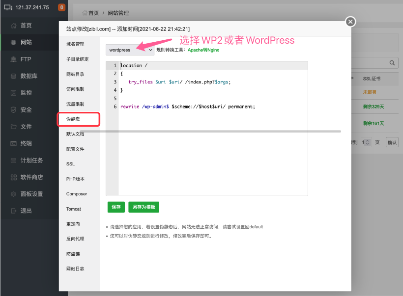

当我们设置好了伪静态之后，我们再次设置固定链接就不会有404的错误了
进入WordPress后台->设置->固定链接，根据您的需要设置为非朴素即可
这里根据SEO和大家的经验，我们推荐将固定链接设置为`自定义`，内容为：`/%post_id%.html`
这样的格式可以使链接更加简介，并且有益于SEO
如图所示：

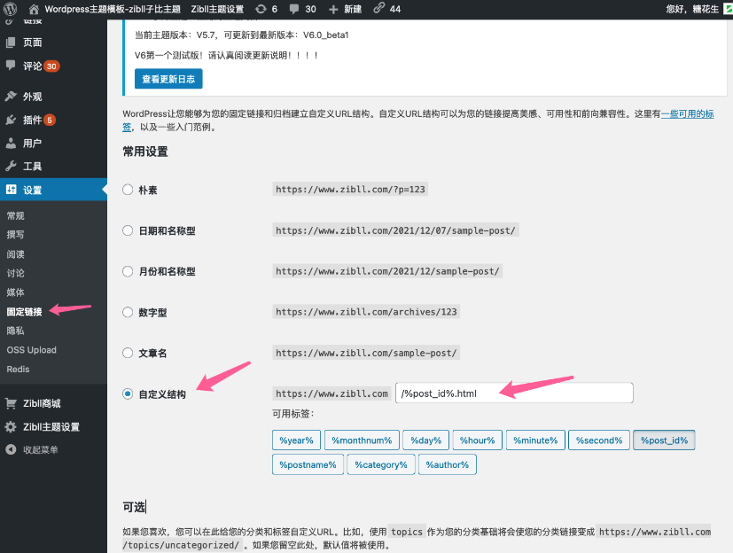

最会需要注意一下的是，如果您先设置好了固定链接，然后再设置的伪静态，那么伪静态设置好了之后一定要再次进入固定链接设置页面，点一下保存设置！

修改主题的部分功能（和链接有关的），也需要重新保存固定链接，也就是进入固定链接设置页面，点一下保存设置，具体哪些设置需要此操作，主题设置中都有详细说明，稍微留意一下即可！

- 设置缩略图尺寸【后台-媒体-图像大小】建议将中尺寸设置为800×540

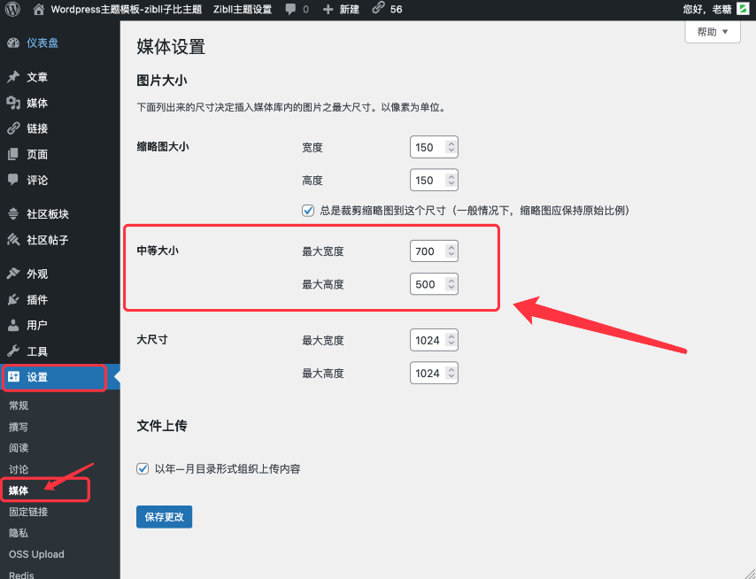

- 开启评论分页显示以及评论显示顺序【后台-讨论】

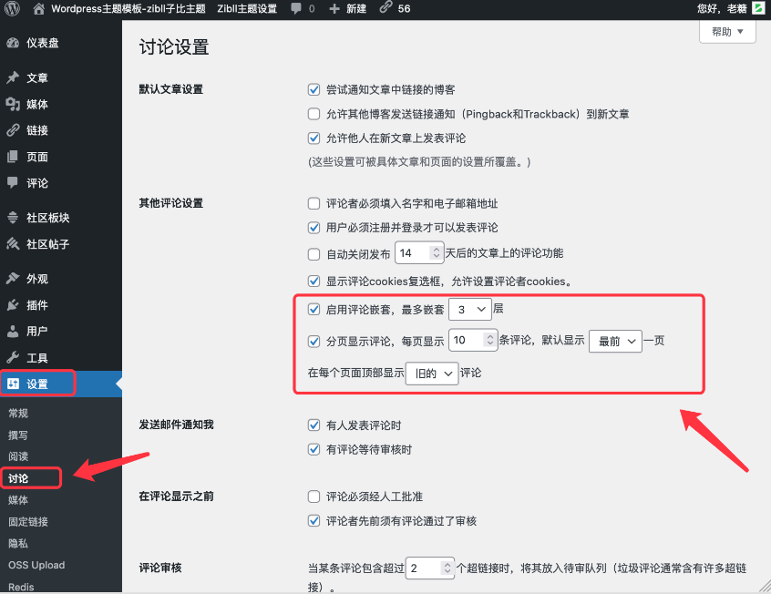

### 获取主题安装包

在官网[购买主题页面](https://www.zibll.com/pay-zibll)购买后，转至[用户中心-授权管理](https://www.zibll.com/user/product)：下载主题压缩包

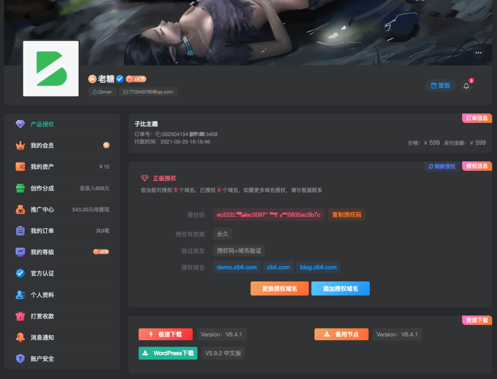

## 安装教程

安装子比主题推荐使用Wordpress后台上传安装的方式！当然您也可以用FTP上传等方式来安装都是可以的

WordPress后台安装子比主题流程

1. 准备好已经获取的主题.zib格式文件
2. 进入 WordPress后台 – 外观 – 主题 – 点击添加主题
3. 点击上传主题，选择准备好的 主题.zib格式文件
4. 等待上传完毕之后-点击启用子比主题

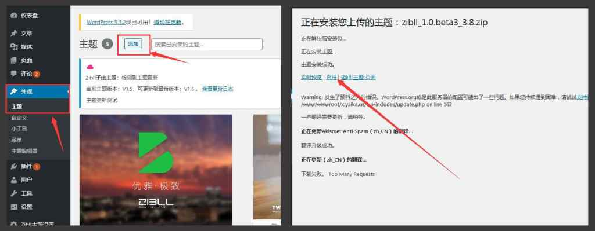

## 首次配置指引

主题启用之后先别急，部分功能还未生效呢！接下来推荐您按照这几点一步一步的熟悉这个强大的主题

### 1.完成主题授权

首次安装主题后，系统会自动进行授权验证，如果自动授权验证失败，请进入主题设置->主题授权，点击授权即可！

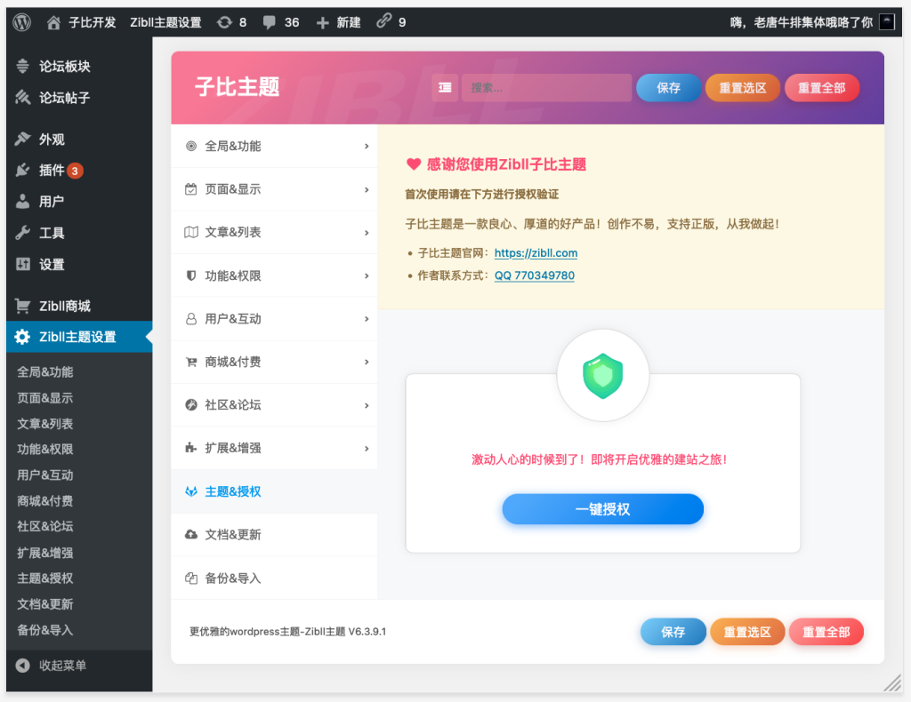

#### 授权验证注意事项

1. 主题提供本地测试免授权功能，在本地测试时无需授权
2. 授权验证需授权码与授权域名匹配才能验证成功
3. 如果遇到授权出错，请与客服联系

### 2.必要的主题设置

主题授权验证通过之后，就可以进行主题设置以及模块配置了，主题的功能十分强大，但是配置起来也是十分简单的。

主题配置主要分为三大部分：后台设置、界面配置、文章配置

详细配置教程请查看主题文档，这里推荐您必做的几个设置

#### 设置导航菜单

新主题启用之后是没有导航菜单的，页面最顶部也就会空空的。您可以点击前端页面顶部的[添加导航菜单](javascript:;)按钮，也可以在后台-外观-菜单，添加菜单

主题提供PC端菜单和移动端菜单独立设置功能（也可以只设置一个），你可以按需进行设置！为了达到更好的效果，设置菜单有一下几点请注意：

1. PC端菜单的一级菜单不要太多，太多会导致换行显示出错
2. 移动端菜单最多只支持二级菜单，如果添加了三级菜单则不会显示
3. PC端菜单支持多级显示，但建议不要超过二级
4. 菜单支持插入Font Awesome图标以及自定义Class样式[【查看教程】](https://www.zibll.com/529.html)

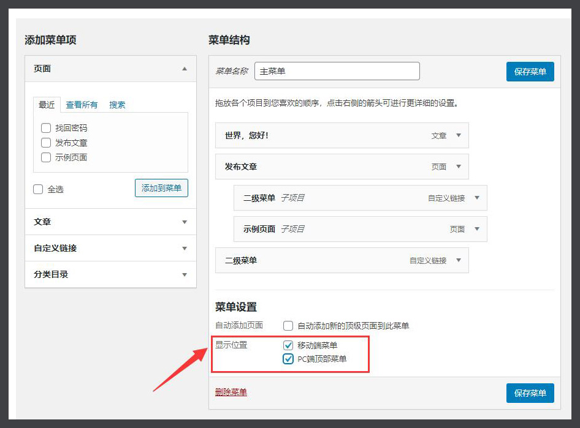添加菜单

#### 主题设置

子比主题的开发理念就是高度自由化，所以主题可设置内容就太多了，首次使用主题可能会感觉有点复杂，那么建议您先做以下的一些必要设置，其它的保持默认即可，然后再慢慢熟悉吧

- 设置必要的图像：LOGO、图标
- 设置核心的SEO内容
- 设置页脚内容以及联系方式
- 设置首页多栏目内容
- 设置分页标签页的AJAX菜单内容

另外呢，如果您的网站是一个全新的网站，建议先新建文章分类、文章标签、文章专题，如果没有的话，部分关联的主题设置将会没有选项喔

#### 界面定制：模块配置

子比主题最大的功能莫过于UI模块化配置了，使用模块可以搭配出各种各样的页面效果，从而实现高度自由化

模块配置其实也很简单，你简单的理解为将任意`模块`插入任意`位置`，所以这个功能主要就是模块和位置

页面的布局位置主要分为：顶部全宽度、顶部内容区域、底部内容区域、底部全宽度、侧边栏

这些页面布局位置每一个页面类型均可`单独插入不同`模块

当然还有其它扩展位置：底部页脚内部、移动端弹出菜单内部

你可以通过以下文章，查看详细的模块化布局配置教程


## 主题更新

### 在线自动更新

使用Wordpress的朋友可能都有这样的同感：功能强大，但是太麻烦了….

如果你已经看了V5的更新日志，可能你就会发现，在很多细节上子比主题都在思考着如何让站长更方便，让主题使用更容易！我觉得这个很重要！

当您使用子比主题V5之后，那么今后就再也不用繁琐的上传主题、替换文件来更新主题了！

**一键在线更新，优雅的升级体验**

- 主题默认会每周自动检测一次更新，如果有更新会在后台显示有更新的通知
- 当然你懒得更新，也可点击忽略此次更新
- 后台一键在线更新，30秒左右即可完成主题升级
- 不用担心更新服务器像wp一样连接不上，子比主题每一版都会有3个以上不同下载服务器，一个下载失败自动切换另一个
- 更新过程显示进度条，告别枯燥的等待过程

截图预览：

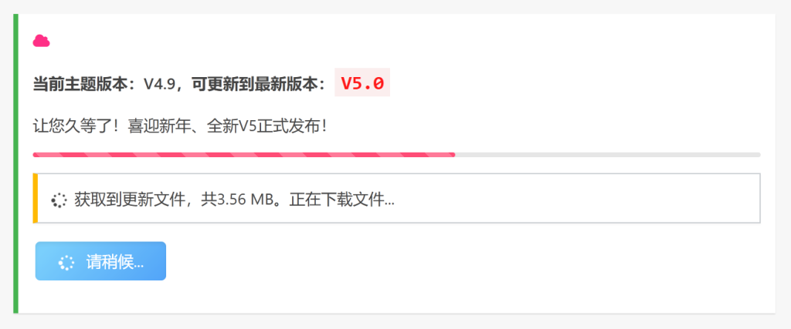

#### 常见问题解答

在线更新在使用的过程中，可能会因为一些环境不同，而导致失败，如果在线更新失败，您仍然可以通过下载安装包手动更新！

在这里我们汇总一些常见的错误及解决方案，如果您也出现了类似的问题，也许能帮到您！

如果您出现了此处未提及的错误，欢迎您在下方留言！我们第一时间帮助您解决问题

**为什么官网已经发布新版，而我的后台没有显示有更新呢？**

**为什么我后台提示的更新版本和官网发布的不一致呢？**

可能是由于您长时间未登录后台或者其它时间差导致的版本不一致
您可以在主题设置-文档更新：先忽略此次更新->在点击检测更新，以同步最新可更新版本

**主题显示更新成功，刷新页面之后怎么还是之前的版本呢？**

有些站长为了一些功能可能会修改部分主题源文件。那么需要注意的时，主题路径文件夹和主题信息文件是不能修改的，否则会出现因信息判断出错，而导致的失败！

**在线更新的时候，下载了一半，就报错50x错误，是什么原因？**

50x错误主要指主动断开链接，一般出现此问题多数是在套有CDN的服务器上，因为更新过程大约需要30到60秒，而一般的CDN服务商都将源站链接超时 (回源超时) 时间设置在10秒左右，以防止源服务器响应超时。相当于更新过程还未结束，而CDN服务器就断开了与源站的链接，从而出现此类错误！

解决的方法就是将CDN源站链接超时(部分CDN服务商叫法可能不同)时间设置为60秒以上！

同时也请检查php设置的最长运行时间，最少60秒以上！

以下截图为设置示例

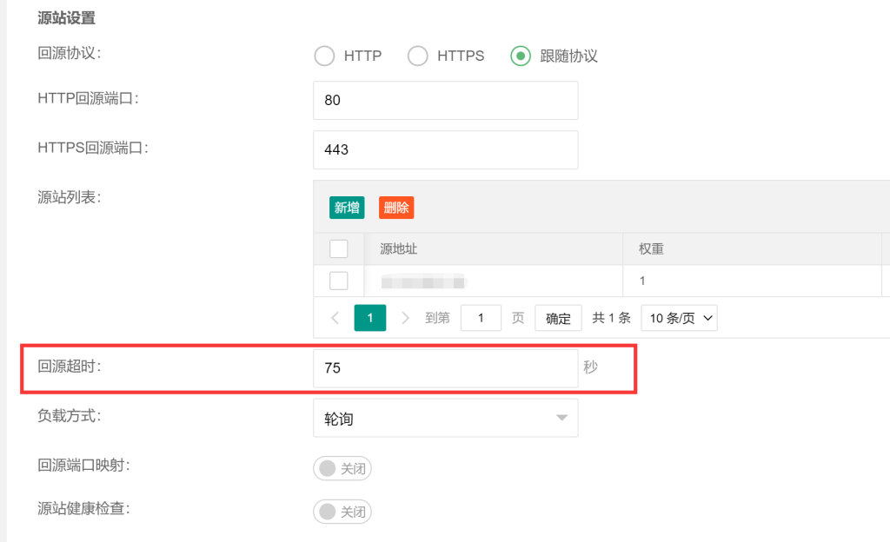

**为什么明明发布了新版，但是我点击检测更新仍然提醒没有更新呢？**

刚发布新版的时候可能会出现大量用户检测更新，这时候可能会因为网络拥堵而导致未检测成功，如果多次检测都没有，就建议手动更新或者等一段时间再试试哦

**还有没有其它可能的原因导致在线更新失败呢？**

1. 部分插件可能会有冲突或者保护机制，所以禁用插件排除一下是不是插件冲突
2. 网络问题，有时候网络太慢，或者有些国外服务器可能会出现此情况
3. 文件/文件夹权限问题导致更新文件写入失败！请确保权限和所有者都正常[【查看权限错误示例】](javascript:;)


最后，如果您还是不能使用在线更新，那就只有手动更新了，也十分简单哦！

### 手动更新主题

#### WordPress后台更新

1. 进入Wordpress后台-外观-主题
2. 切换到其它任意主题
3. 删除现有的子比主题
4. 上传新版的子比主题.zip压缩文件
5. 启用新主题

使用此方法更新主题，不会造成任何配置数据丢失！
**但是如果您修改过主题源码文件，那么必须先保存您修改的内容！**

#### 文件覆盖更新

1. 使用FTP等文件管理器进入Wordpress主题存放目录：`.../wp-content/themes/`
2. 用新版主题文件解压缩后覆盖`zibll`文件夹内容

**如果您修改过主题源码文件，请自行备份！**


# 布局

建设一个wordpress网站，网站的布局肯定是最重要的。美观漂亮且易于阅读又能突出网站重点的布局设计更容易吸引力用户浏览网站。对于站长来说，网站布局也是最让人头疼的一件事儿了。zibll子比主题为了解决这个问题，采用模块化配置，将页面分为多种容器，再将不同的内容做成不同的模块，站长可自由的将任意模块放置到任意位置容器中，从而实现高度自由化，轻松的实现多种布局样式！

## 熟悉布局概念

**首先我们了解，什么是布局容器？**
我们将一个空白的页面，分为多个不同位置的方块，每一个方块里面都可以放置任意的模块，同时这些方块可以自由的删除、清空，方块里面的内容也就是模块也可以随意的添加、删除、更换、排序。那么我们就把这样可以放置模块的方块叫为容器。

如果你还不明白，那么看一下这一样图，子比主题是如何设计布局容器的。

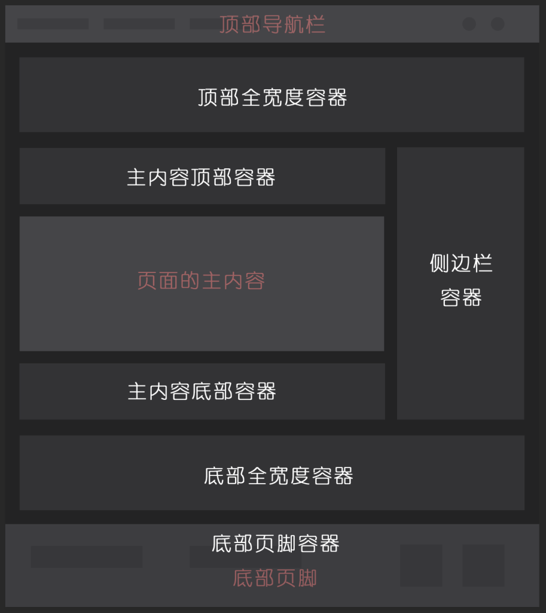

通过上面的图片可以看出来，一个页面的固定内容有：顶部导航、页面主内容、底部页面。那么除此之外，其它位置都是可放置模块的容器，换句话说就是默认是没有内容的，只有你在容器内添加了模块那么该容器位置才会显示内容！

**了解了布局容器之后，还有一个重要的布局要素也是：页面区分。**
为了实现在不同类型的页面能组合不同的布局内容，比如我们需要在首页的顶部全宽度显示一个幻灯片模块，但是其它类型页面不显示。那么子比主题在设计容器的时候，每一个不同类型的页面都有该页面类型单独的容器：
例如：顶部全宽度容器，那么对应的就有：
首页-顶部全宽度、文章页-顶部全宽度、分类页顶部全宽度、用户页-顶部全宽度、搜索页顶部全宽度、其它页面-顶部全宽度

另外请注意，所有页面的侧边栏都是可以单独开启或者关闭的，那么如果在没有开启侧边栏页面中，全宽度容器和主内容容器其实是一样的效果！如图所示：

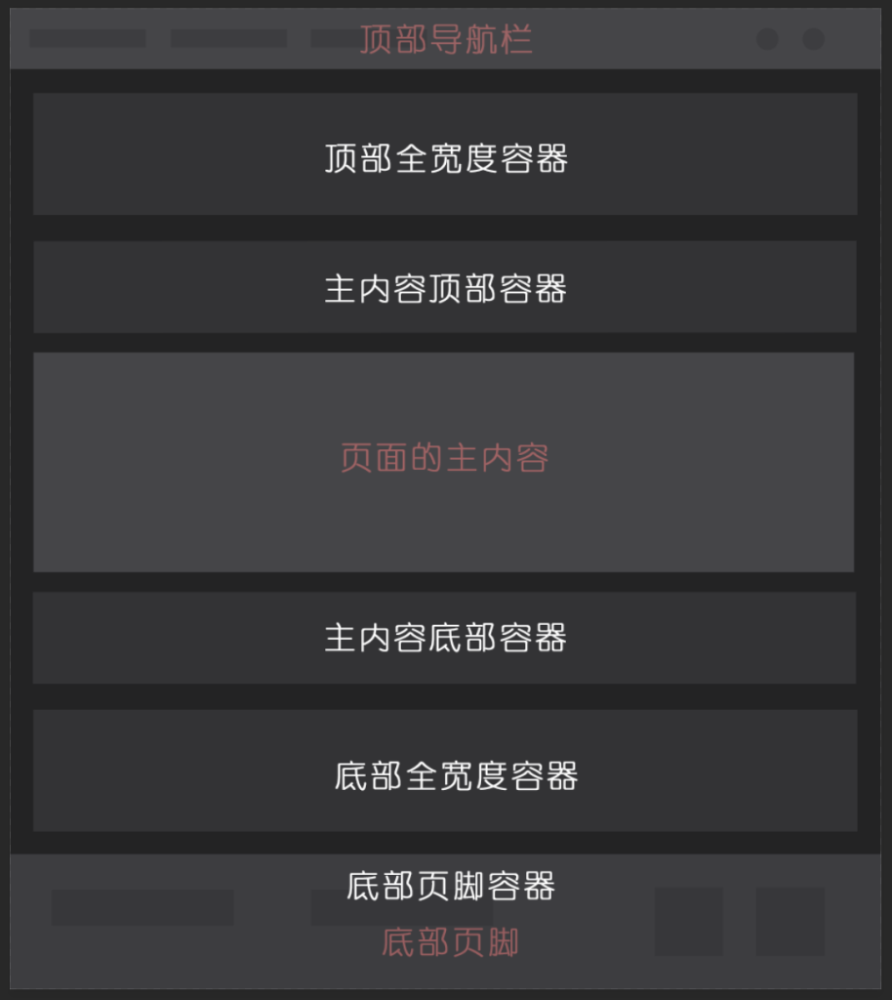

**最后，出了上图之外的容器，还有没有其它位置的容器呢？**
答案是有的！除了页面主要位置之外，子比主题还设计了一个在移动端弹出菜单内的容器，方便将模块添加到此处。

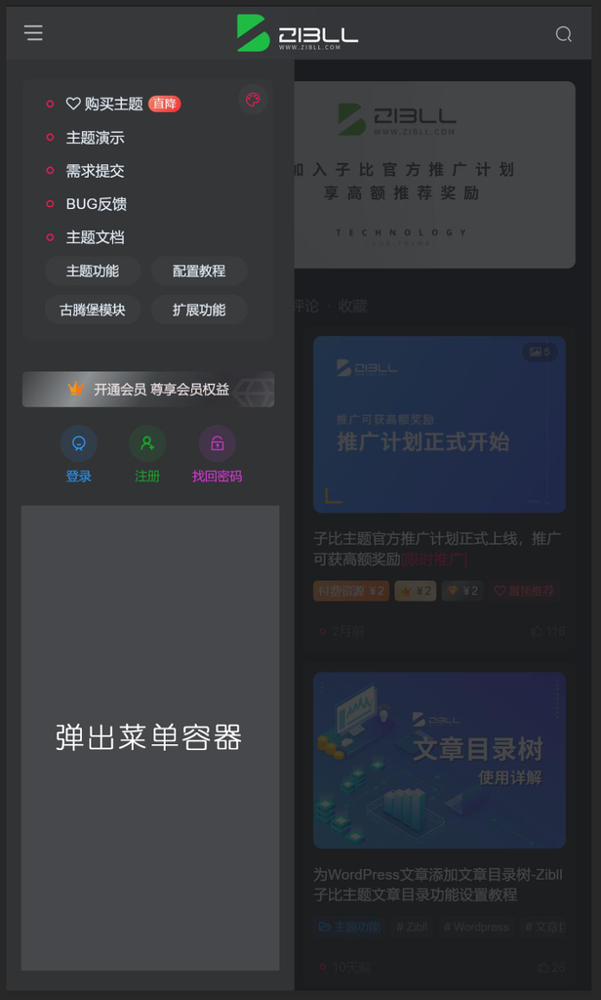

## 开始配置

熟悉了模块容器之后我们开始配置布局，整个布局配置流程大概分为：
1.必要的主题设置 2.页面的布局设置 3.添加模块

### 必要的设置

**我们按照从页面的顶部到底部的流程进行设置，首先我们来设置顶部导航栏的样式。**

顶部导航栏分为PC端样式和移动端样式，设置的方法都在主题设置-页面显示-顶部导航
具体方法请查看以下文章：

- 主题导航菜单设置


**接下来就是最主要的侧边栏设置，针对不同页面选择是否开启侧边栏，以及设置侧边栏靠左还是靠右**

进入主题设置-全局&功能-页面&显示

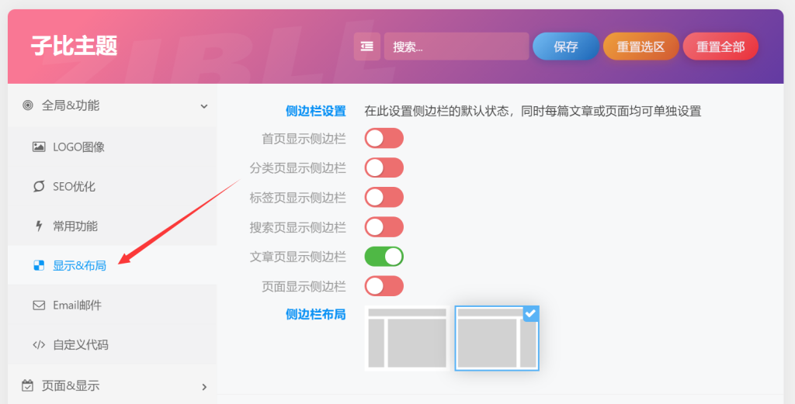

同时每一篇文章、页面都可以单独的设置侧边栏功能。编辑文章或页面时候， 在右下角的扩展功能处进行设置

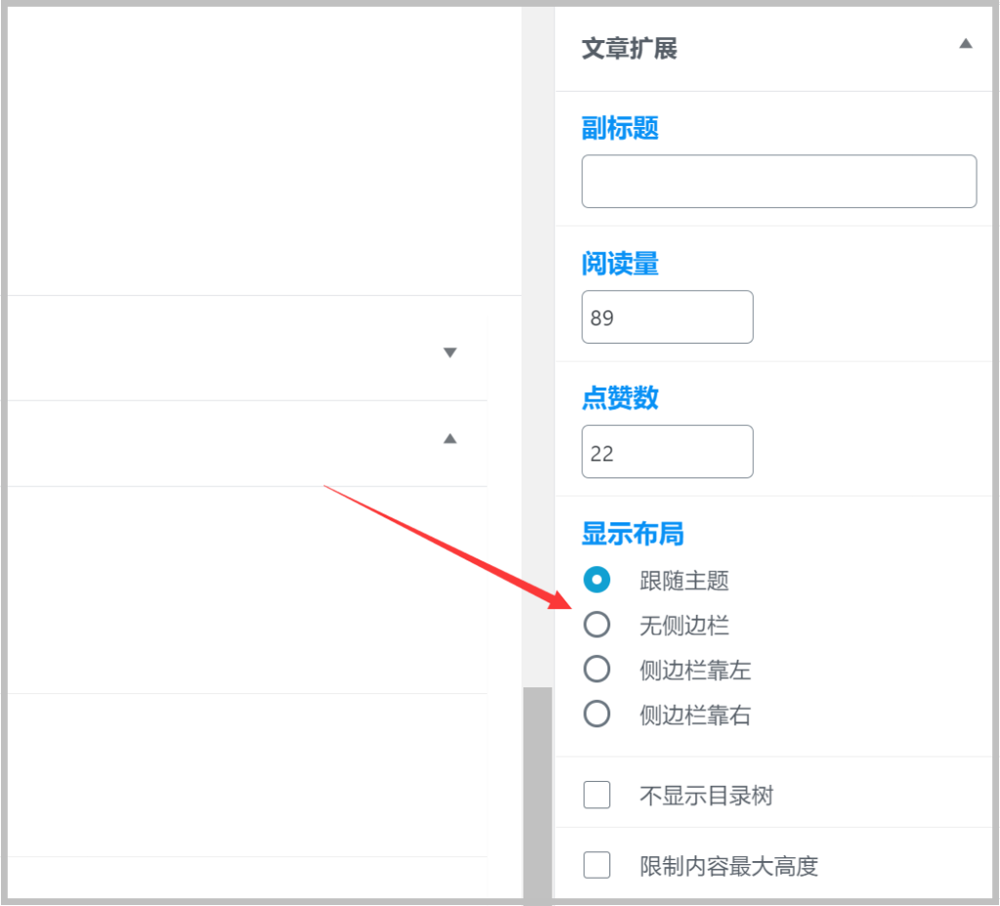

**最后我们设置页面底部**

进入主题设置-页面显示-底部页脚

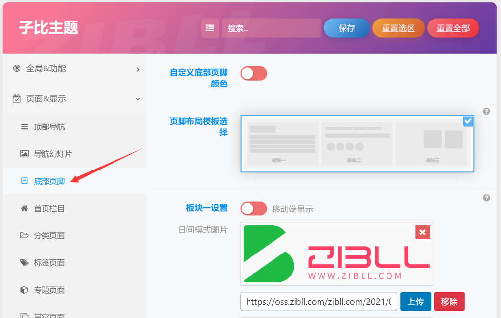

### 添加模块

一些必要的设置完成之后，我们就可以开始添加模块了。在上面的内容中，我们了解了不同页面的各个位置为容器，那么接下来我们需要把模块添加到对应的容器中，实现我们想要的布局效果。

添加模块支持可视化配置的，每一次修改都可以实时预览，自己每一次的添加、修改都一目了然，推荐刚刚接触模块配置的新用户使用！
进入方式：1.前台管理员登录后，点击模块配置 2.wp后台-外观-小工具-使用实时预览管理

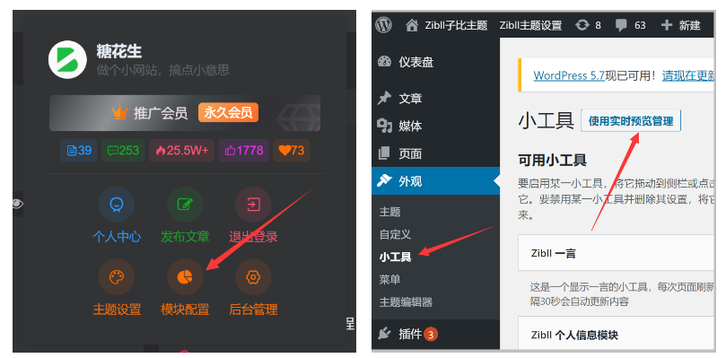

**对于已经很熟悉容器位置的老用来说，可以直接在wp后台-外观-小工具处进行配置，可以更加快速的添加、修改模块，同时加载速度更快**

注意：使用实时预览管理，不会显示全部位置容器，只会显示当前页面存在的容器，进入之后默认是在首页，那么只会显示在首页的容器，如果你想在文章页面添加模块，需要先在右侧页面点击进入任意文章页。

### 模块明细

进入模块配置之后，就可以选择添加模块了。在这里你就可以看到十分丰富的模块了，将不同的模块添加到需要的位置，同时支持拖动排序。目前子比主题支持以下模块，同时还在不断的更新中！

- 幻灯片模块(功能超级强大)[【查看教程】](https://www.zibll.com/1246.html)
- 一言模块：显示精彩一言
- 个人信息模块： 未登录时候显示登录注册按钮，登录后显示用户的个人信息 [【查看截图】](javascript:;)
- 分类专题图文模块： 将分类、专题显示为图文卡片 [【查看截图】](javascript:;)
- 文章列表模块：根据设置显示文章列表
- 文章mini模块：样式小一点的文章列表 [【查看截图】](javascript:;)
- 多栏目文章模块：一个模块显示多个栏目的文章
- 多栏目mini模块：样式小一点的多栏目文章 [【查看截图】](javascript:;)
- 搜索框模块：多功能的搜索模块 [【查看截图】](javascript:;)
- 文章目录树模块：显示在文章页的文章目录树[【查看教程】](https://www.zibll.com/1717.html)
- 评论模块：显示最近评论的模块 [【查看截图】](javascript:;)
- 标签云模块：根据设置显示网站的的标签 [【查看截图】](javascript:;)
- 公告模块：添加多个公告滚动显示 [【查看截图】](javascript:;)
- 用户列表模块：根据设置显示用户列表
- 链接列表模块：实现友情链接、合作伙伴等链接列表功能
- 图像模块：显示图片
- 画廊模块：显示多张图片
- 超级视频模块(V5.2)：支持更多格式的视频 [【查看截图】](javascript:;)
- 超级嵌入模块 (V5.2) ：可以嵌入任意在线播放器或任意在线内容 [【查看截图】](javascript:;)
- 图文封面模块 (V5.2) ：显示图片和文字封面的模块 [【查看截图】](javascript:;)
- 分类专题聚合模块 (V5.2) ：显示分类或专题内容及文章的聚合模块 [【查看截图】](javascript:;)
- 付费购买模块(V5.2)：显示付费文章的购买卡片 [【查看截图】](javascript:;)
- 图标卡片 (V5.2) ：显示图标和文字的卡片 [【查看截图】](javascript:;)
- 更多模块正在添加中….

## 其它配置

根据上面的教程，我们配置了整体页面的布局，为了更好的效果，我们还需要配置一些其他设置。

如果需要调整文章列表的显示效果，请查看以下文章：


最后提醒一下：使用模块配置，可以将任意模块添加到任意位置的容器。但是！并不是所有模块都适合添加到任意位置！请根据实际效果合理调整！


## TAB栏目教程

使用WordPress建站，如何轻松简单的写出漂亮的文章？zibll子比主题可以说是操碎了心，使用子比主题你会发现这一切都是如此的简单，子比主题自带丰富的编辑器扩展，可视化模块，让写文章变得极其简单！

更新V5.5之后，zibll子比主题再次为古腾堡编辑器增加了一个`TAB栏目`模块，让我们来看一下实际效果吧

### 效果示例

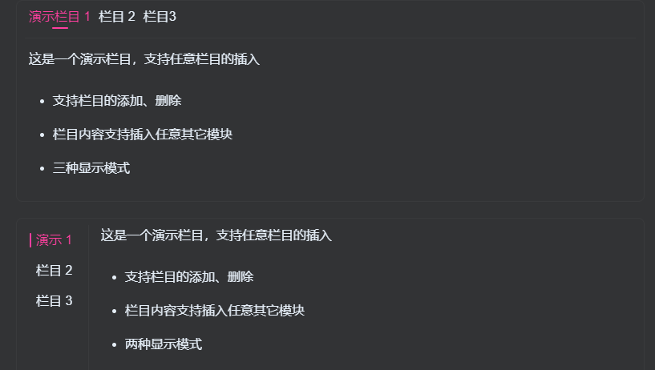

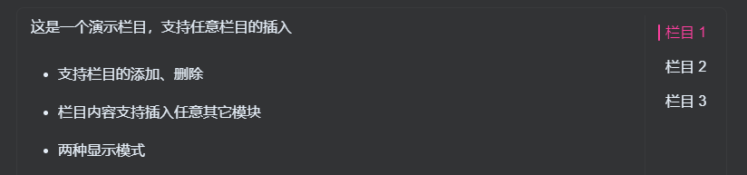

### 使用教程

如果您还未使用过古腾堡编辑器，推荐您先看一下古腾堡编辑器的基础教程：

[Zibll子比主题-编辑器增强-古腾堡编辑器块详解[入门详解\]](https://www.zibll.com/689.html)

解析下来我们开始教程：

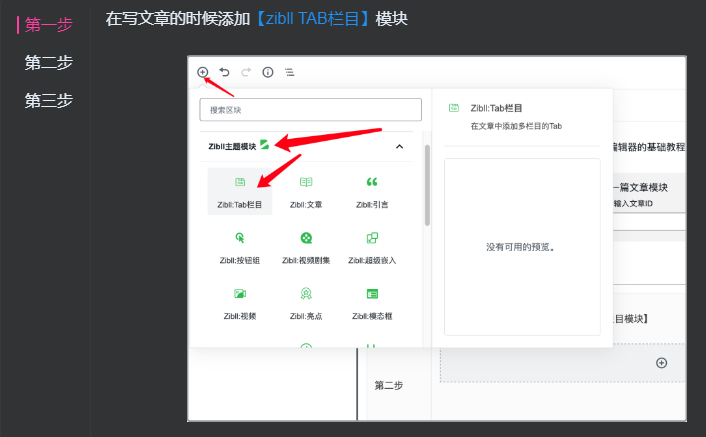

简单三步，教程结束，是不是超级简单啊


# 图片

## 幻灯片功能

主题的幻灯片功能一直都是很强大的，不仅功能丰富，还可以以模块的方式添加在任意位置。

升级子比主题V5之后，幻灯片功能也变得更加强大了！

首先v5幻灯片的几个变化：

- 取消了之前的首页幻灯片功能（用模块代替）
- 增加了导航栏幻灯片功能
- 新增一个幻灯片模块
- 增加若干幻灯片配置项
- 增加幻灯片图层功能

### 显示幻灯片

**在导航栏显示幻灯片：主题设置-页面显示-导航栏幻灯片：开启需要显示的位置**

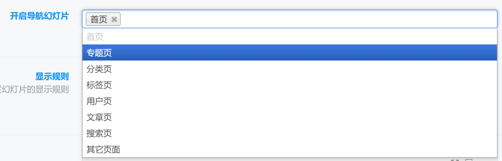

**在其他位置显示幻灯片：模块配置->对应位置->添加zibll幻灯片**

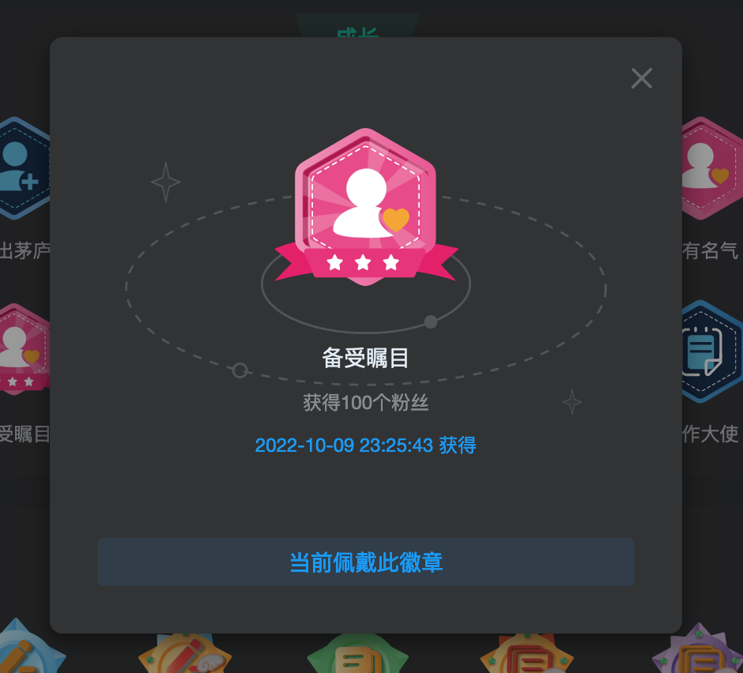

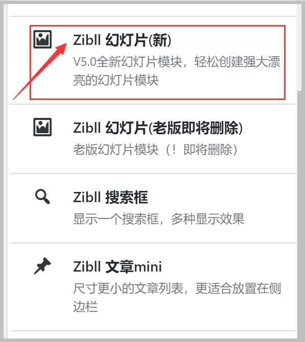

### 幻灯片内容

每一张幻灯片内容主要包括背景图、链接、图层、文字几个部分，添加一张幻灯片，配置一下试试吧

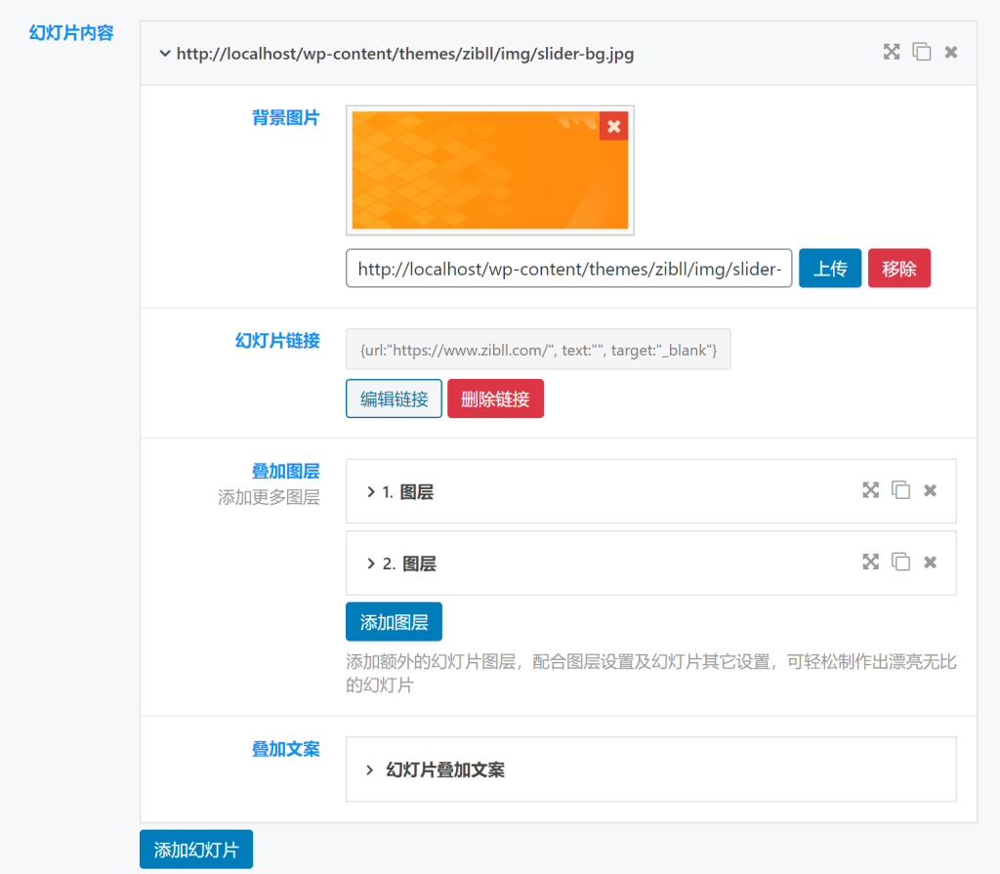

背景图片是必填项目！但是如果你的设计不需要背景图，那么你可以用一张全透明的图片作为背景图即可！

图层功能就是叠加在背景之上的图片，可以随意添加，但是不宜过多！

如果叠加图层还不能满足你的需求，还可以是使用叠加文案。支持两行文案叠加，支持HTML代码，拥有更高的自由度！

#### 图层配置

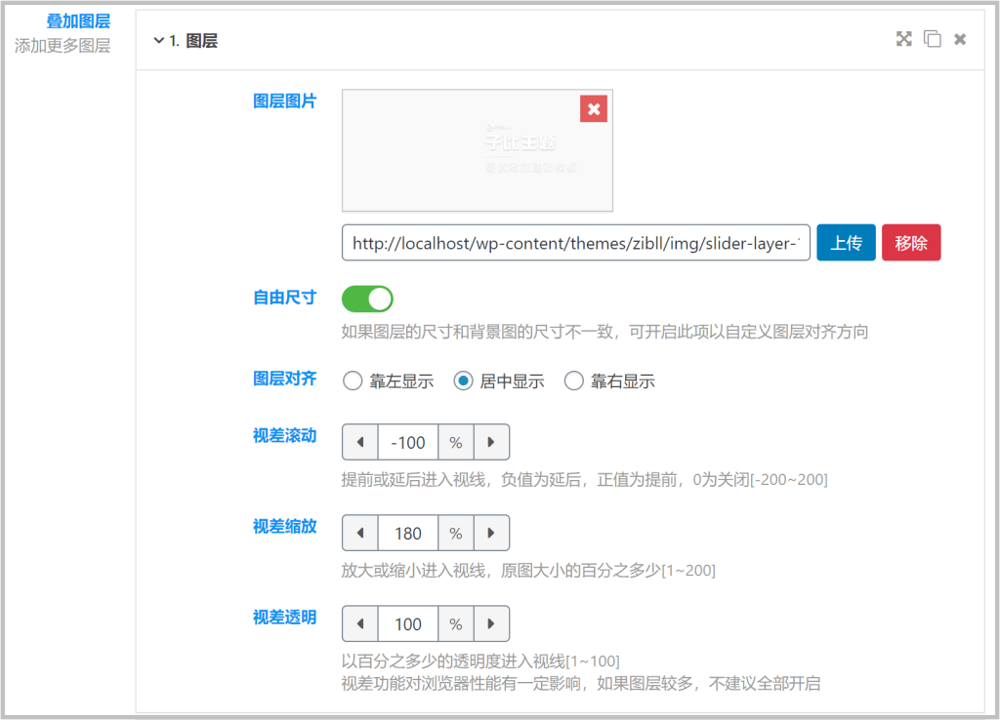

我们可以看到，每一张图层都有几个重要设置，建议都尝试一下。通过这些设置，可以搭配出无数的幻灯片效果！

#### 文案配置

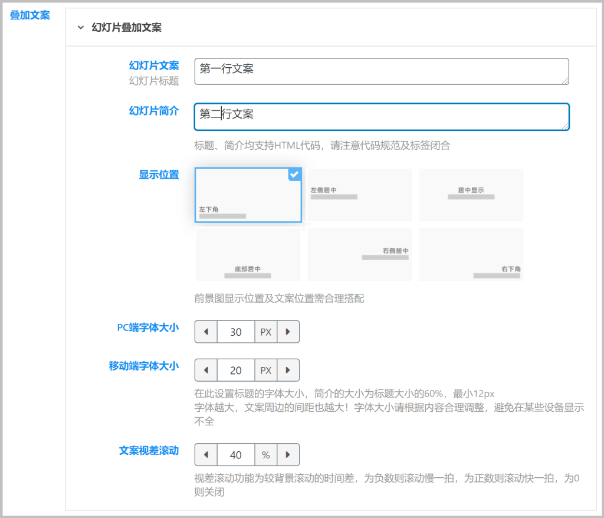

叠加文案的配置大致和图层是一致的，需要注意的是文案是支持HTML代码的，这样丰富了它的扩展性，但是如果不懂HTML代码的朋友还是建议使用图层功能。

### 幻灯片设置

大家不要混淆了，幻灯片设置和幻灯片内容设置是不同的！

添加了幻灯片内容之后，我们就可以对整个幻灯片进行一些参数设置！

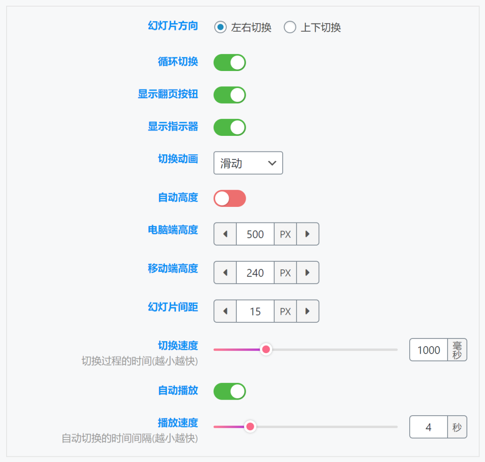


## 图片灯箱

使用wordpress建图片站的站长可以说非常多的，zibll子比主题是一款多功能的阅读类主题，说到阅读，那肯定少不了图片。如何让图片布局灵活、漂亮！又如何让用户易于图片浏览、图片操作，这些都是子比主题重要的开发项目，越是看似简单的时候，我们越会做的认真。

首先主题才用模块化布局，同时文章也基于wordpress的古腾堡编辑器才用模块化编辑文章，那么使用子比主题就能很轻松的用模块的方式将图片添加到您的网站。

特别是在文章中插入图片，不急支持最基础的图片插入，还支持多宫格布局，图片蒙版，图片幻灯片，图片异步加载等功能，方便每一位站长简单轻松的实现漂亮的文章图片插入！
将文章中的图片布局完成之后，我们需要考虑的就是用户查看图片的体验如何？所以子比主题开发了强大的图片灯箱功能，点击图片即可弹出图片灯箱查看原图，支持缩放、切换等功能，整个过程行如流水、丝丝顺滑！


本文部分功能需升级zibll子比主题V5.3及以上版本！

### 特色简介

本篇教程我们主要讲解图片灯箱功能，这个功能很简单，仅仅是点击图片即可，那么我们首先介绍一下子比主题的图片灯箱有哪些特点：

- 两种模式可设置：单图模式和幻灯片模式
- 支持缩略图导航功能
- 支持下载原图功能
- 支持自动播放功能
- 支持双击放大、缩小
- 支持下滑关闭
- 支持移动端双指触摸放大、缩小
- 支持键盘左右键切换图片
- 采用硬件加速的动画引擎，整个切换、缩放过程丝丝顺滑
- 未使用第三方JS插件，自行开发仅6KB大小文件
- 对应的js文件动态按需加载
- 灯箱内图片自动获取原图且异步加载，有效提高页面加载速度

### 选项配置

此功能建议保持默认即可，如需配置可以进入：
主题设置->文章&列表->文章功能：图片灯箱

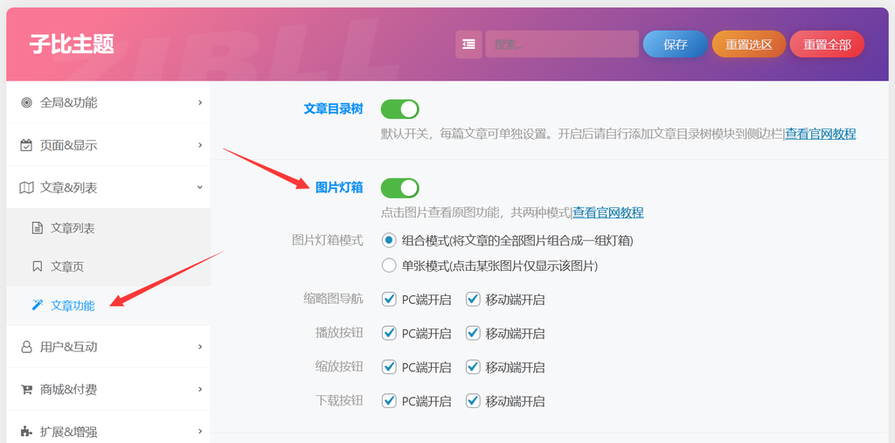

配置项目十分简单，根据选项按需配置即可

### 功能体验

那么我们简单的放几张图片供大家体验一下，记得要分别在PC端和移动端都体验喔！

首先是单张图片，可设置左中右对齐及大小。可设置图片简介。

如果你有很多图片，你可以考虑使用画廊排列显示，可以自由设置单行显示数量，移动端自动适配


当然还有更厉害的幻灯片功能


# 视频

## 视频剧集

zibll子比主题更新V5.3之后，对视频功能进行了较大的优化，增加了付费视频、视频模块、视频封面等视频解决方案，更新V5.5之后，再一次丰富了视频剧集功能，这片文章我们详细的讲解如何通过zibll子比主题古腾堡块，轻松简单的在文章内插入剧集视频。

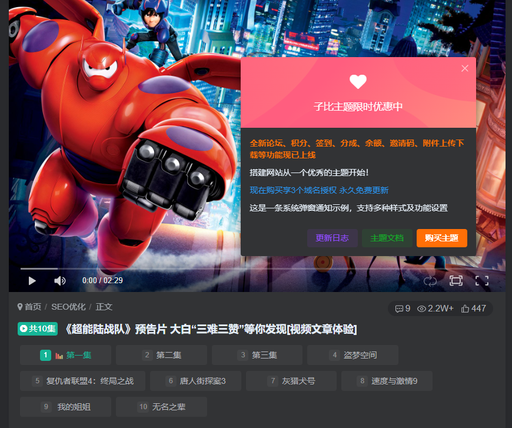

### 教程开始

如果您还未使用过古腾堡编辑器，推荐您先看一下古腾堡编辑器的基础教程：

[Zibll子比主题-编辑器增强-古腾堡编辑器块详解[入门详解\]](https://www.zibll.com/689.html)

接下来我们开始教程：

1.在写文章的时候，添加【zibll 视频剧集】模块
2.选择或者上传视频，或者直接输入视频地址（支持多中流媒体格式）
3.输入剧集的标题
4.在右侧模块设置-配置相关选项

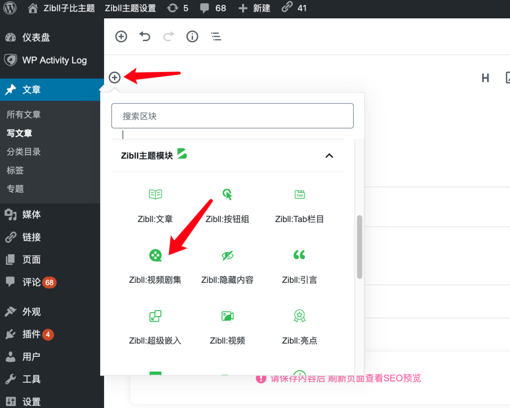

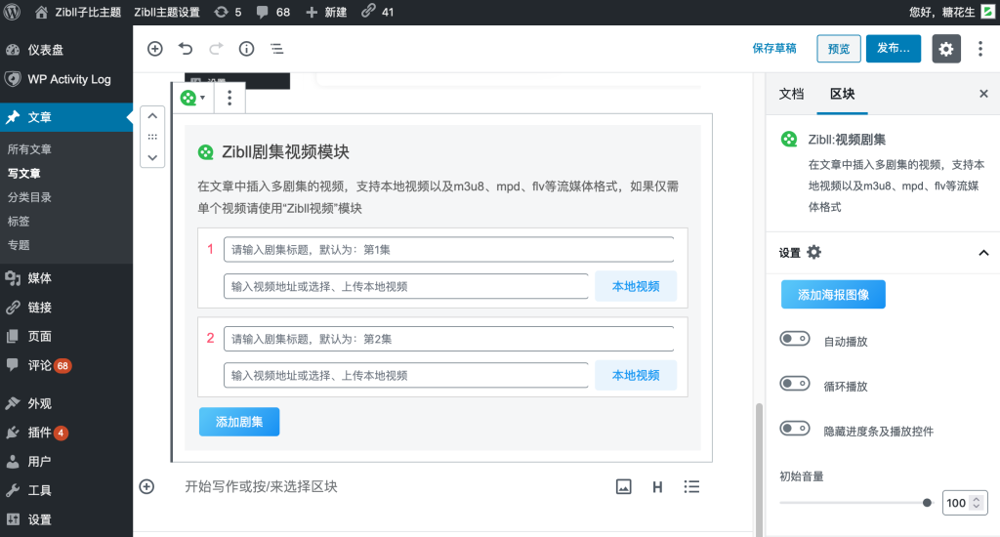

教程结束，是不是超级简单？

如果你还需了解其它视频功能相关教程，可以查看以下文章：

[为文章添加多剧集的视频封面教程[视频剧集功能详解\]](https://www.zibll.com/2183.html)


对于做视频的站长来说，通过wordpress配合主题能很好的实现视频类网站。zibll子比主题一直重于阅读体验，在更新V5.2之后，我们又对视频功能进行了进一步的增强：兼容更多格式、增加视频封面、添加超级视频、超级嵌入模块等，接下来我就详细的讲解一下视频功能的使用


## 文章内添加视频

wordpress古腾堡编辑器原生支持视频模块和嵌入模块，但是支持的格式比较少，不支持流媒体格式。
所以推荐使用子比主题的`zibll视频模块`添加视频：

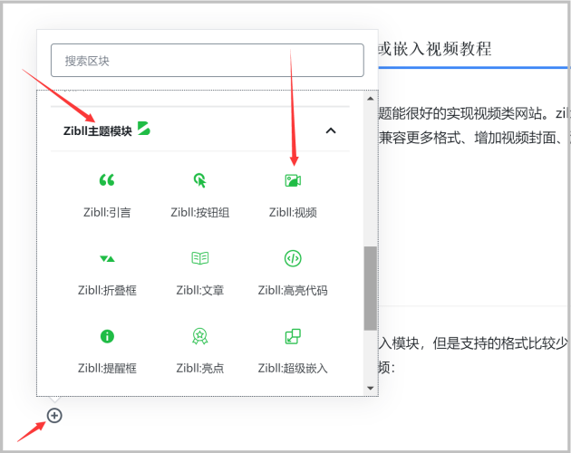

添加古腾堡块：zibll视频模块

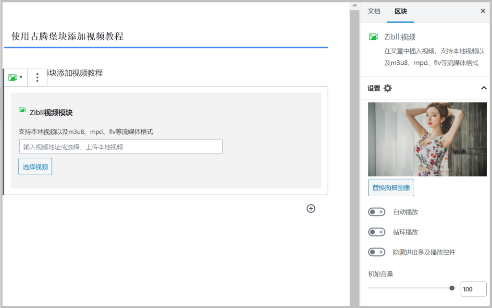

添加视频并设置视频海报

是不是很简单啊，添加视频的时候可以上传（选择）本地视频，同时也可以直接输入视频地址，支持m3u8、mpd、flv等流媒体格式。同时支持添加视频的封面，以及播放器参数设置。

重点提一下的就是关于此功能的动态加载JS文件，同样的所需要的前端js文件都是采用动态加载，为了支持不同的流媒体格式，除了播放器js文件之外，每种流媒体格式均有一个js扩展文件，一共4个js文件，每个文件大概150kb，全部采用动态识别、**按需加载**。有效的提高前端加载速度！

### 超级嵌入模块

主题的视频模块已经很强大了，几乎可以满足插入视频的需要了。但是有点站长为了节约服务器资源或者其它规划，可能还需要直接添加其它视频网站的内容，比如添加优酷视频、腾讯视频等等
那么主题还有一个超级嵌入模块，顾名思义就是嵌入其它在线播放器。当然为什么叫超级呢，还是因为wordpress本来自带了很多的嵌入模块，但是兼容性太差了，很多地址都嵌入不了。而子比主题的嵌入模块可以嵌入任意在线内容！比如视频播放器、音乐播放器、天气模块甚至直接嵌入其它网页都可以！

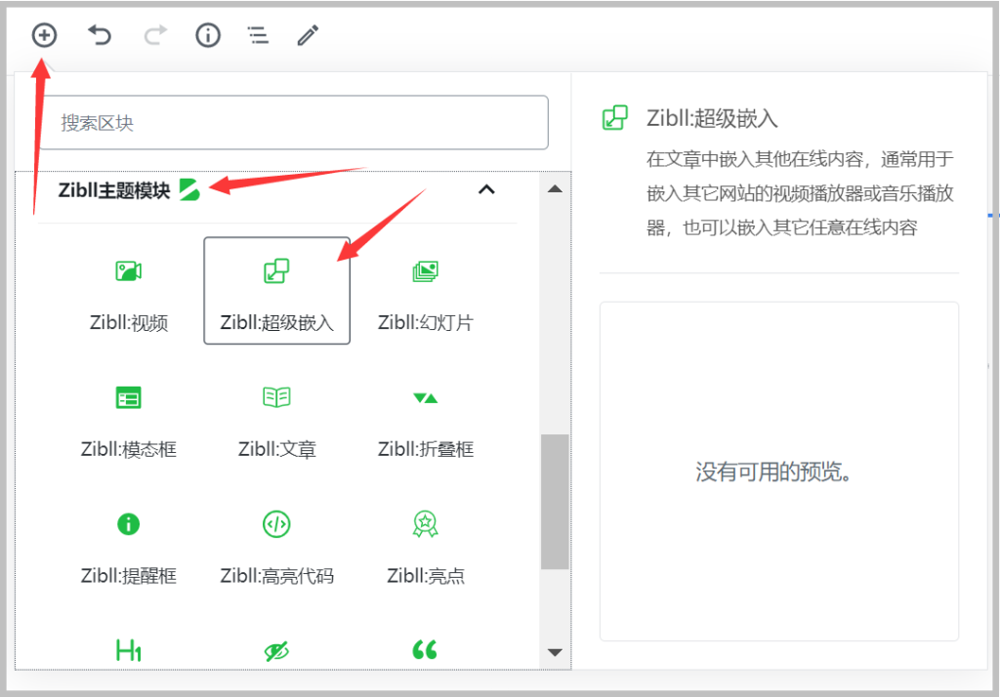添加古腾堡块：超级嵌入模块

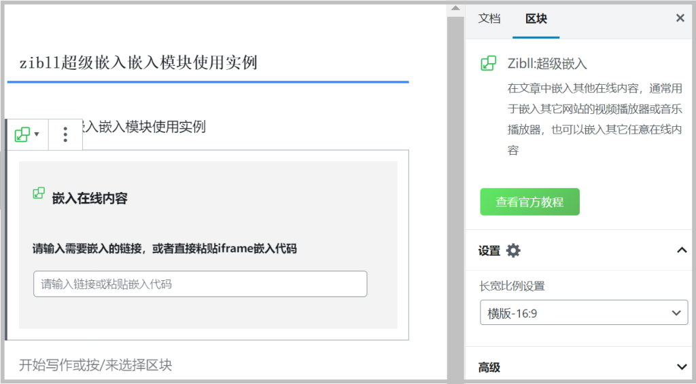输入嵌入代码并设置长宽比例

超级嵌入可以直接输入需要嵌入的地址，也可以直接粘贴 `<iframe src=""></iframe>` 这样的格式的嵌入代码，模块会自动转换为嵌入链接。

嵌入代码怎么找呢？我们列举一二：

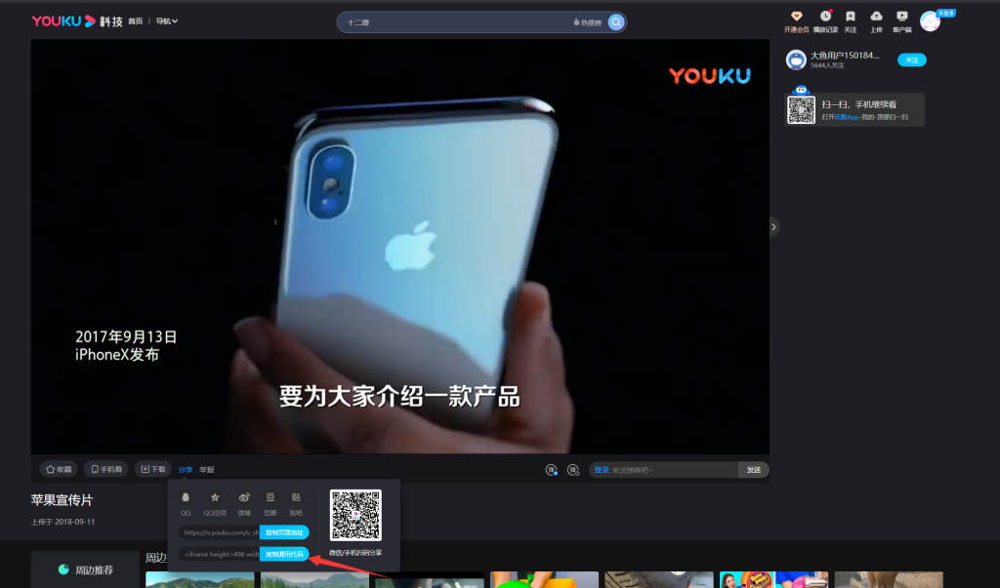进入播放页面-分享-复制嵌入代码

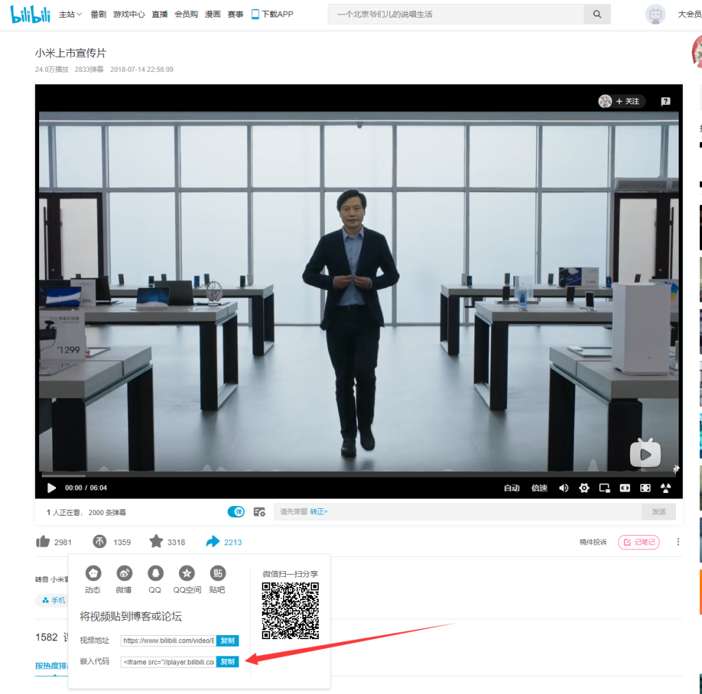

所有的嵌入代码都是 `<iframe src=""></iframe>` 这样的格式，直接复制过来粘贴即可

嵌入的本质就是将一个网页嵌入到我们网站中，如果你在使用此功能的过程中遇到问题，你可以**直接将嵌入链接在浏览器中打开**以排查问题所在。如果在浏览器中不能显示，那么嵌入之后也是肯定不显示的。

提醒一下，这个可不仅仅只能嵌入视频哦，可以嵌入任意在线内容，例如视频播放器，音乐播放器、在线天气、在线股市等等

### 在页面其它位置添加

上面我们讲了如何在文章内添加视频，已经两个模块的使用教程。
如过还需要在页面的其它位置添加，那么就需要子比主题强大的模块化配置了，如果你还不了解子比模块化配置，请认真查看以下文章 

进入模块配置之后，选择zibll视频模块或者zibll超级嵌入模块即可添加对应内容

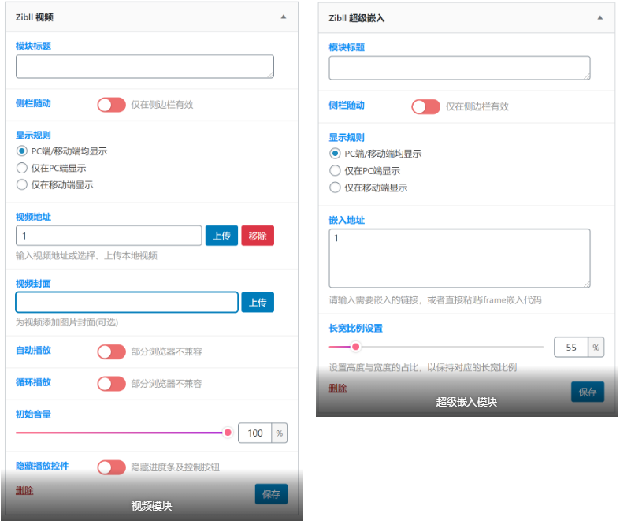

这两个模块设置的方式和上面一模一样，就不在另外说明了。

# 邮件

## SMTP发邮件功能


网站已经做好了，但是怎么不能发送邮件呢？这是主题的bug吗？还是wordpress的bug?

其实都不是，最大的bug可能就是你的主机了，一般主机都不支持默认都不支持邮件发送的

但是还好，可以使用SMTP来发送邮件。子比主题有很多功能也是需要发送邮件的，比如找回密码、下单通知、邮箱验证码等等。所以一个网站发送邮件的功能是必不可少的！

子比主题已经内置了SMTP功能，所以其他同类型插件可以删除了！

首先我们看一下子比主题的邮件推送功能明细截图：

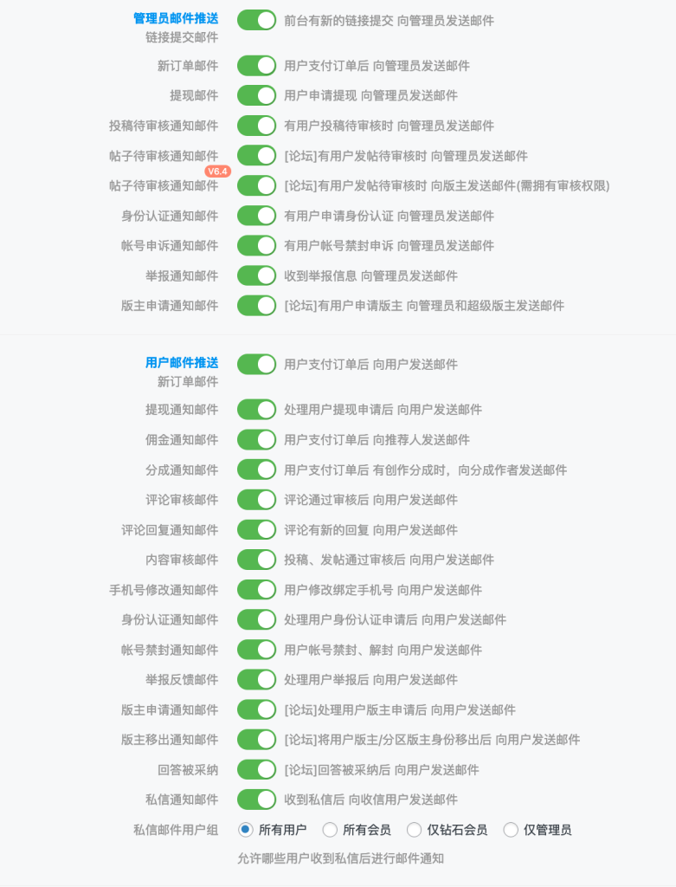

## 使用教程

**使用 SMTP功能 需要以下几个参数：**

1. 发件人邮箱帐号（就是你的邮箱号）
2. 邮件服务器地址
3. SMTP服务器端口号
4. SMTP服务器邮箱密码
5. 可选设置：加密方式和SMTPAuth服务

获取以上参数，大多数的邮箱服务商都差不多，接下来我以国内使用较多的QQ邮箱为例一步一步的教大家使用 **SMTP** 功能

## 获取参数

在浏览器登录QQ邮箱，找到邮箱设置-账户设置-开启SMTP服务

- [![图片[2\]-wordpress使用SMTP发邮件教程-解决邮件发送问题-Wordpress主题模板-zibll子比主题](https://oss.zibll.com/zibll.com/2020/04/image-18.png)](javascript:;)
- [![图片[3\]-wordpress使用SMTP发邮件教程-解决邮件发送问题-Wordpress主题模板-zibll子比主题](https://oss.zibll.com/zibll.com/2020/04/image-19.png)](javascript:;)

接下来点击下方的生成授权码，获取邮箱密码（需要验证短信）

- [![图片[4\]-wordpress使用SMTP发邮件教程-解决邮件发送问题-Wordpress主题模板-zibll子比主题](https://oss.zibll.com/zibll.com/2020/04/image-21.png)](javascript:;)

ok，我们所需要的设置以及密码都全部准备好了。那么还有服务器地址、端口号又是什么呢？

服务器地址、端口号 、加密方式百度一搜就有了。相同邮件服务商都是一样的，以QQ为例：

- **邮件服务器地址** ：smtp.qq.com
- **邮件服务器端口** ：465
- **加密方式**：ssl

## 子比主题设置

进入后台-主题设置-全局功能-Email邮件：将我们刚刚获取的信息填入对应的地方保存即可

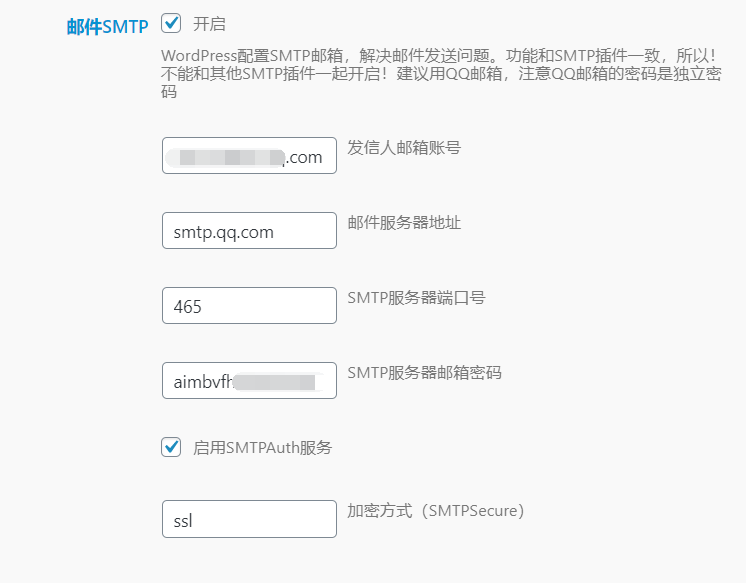

愉快的结束教程吧


# 广告

有不少的新用户都问过这样的问题：子比主题怎么没找到广告位啊？

这个问题我相信即使不用解答，只要您稍微用几天就明白了。所以这篇文章就是一篇水文，老用户可以离开了，新用户一看也就明白了！

首先我想想一般来说会有哪些类型的广告呢？

- 最基础的图片广告，就是一张图片
- 多张图片组成的幻灯片广告，看上去效果更好
- 文字广告，就是文字
- javascript代码广告，这种代码一般是广告供应商给的
- 全局弹窗的 javascript代码广告，有些Google广告就是这样的
- 自定义HTML代码
- 视频广告，这种比较少

我大概总结了以上几项，分一下类也就是：`图片广告`和`代码广告`

那么问题来了，广告位到底在哪里呢？

子比主题采用`模块化配置`，模块化配置你细品一下，是不是明白了
使用模块化配置，你可以将`任意模块`放置在页面的`任意位置`，那么你可以将您的广告通过图片模块、幻灯片模块、自定义代码模块等放置在页面的任意位置！

换句话说，子比主题的广告位无处不在！

还不明白，就看图吧

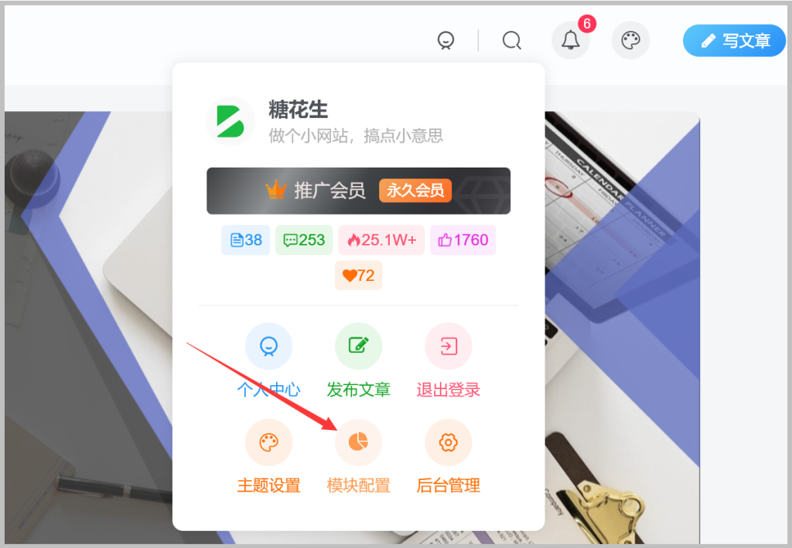管理员登录后进入模块配置

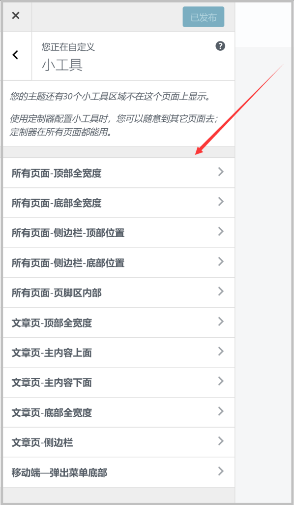进入你想要添加的页面及位置

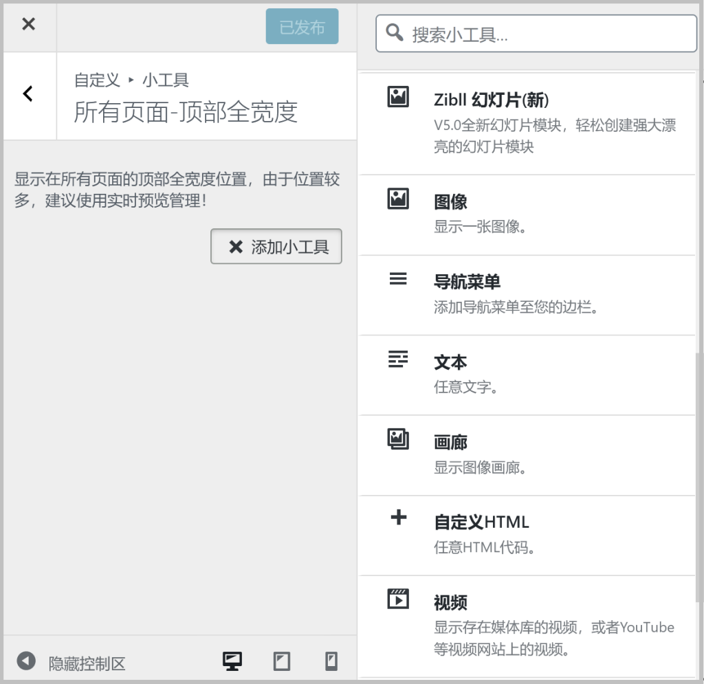根据的广告类型添加对应模块即可

一般图片广告，就添加`图片模块`即可，也可以使用`幻灯片模块`。其它只要是代码类型的广告都可以使用`自定义HTML模块`
添加模块支持拖动排序、复制等操作，就自己熟悉熟悉吧！注意：如果您想添加模块到特定页面，那就需要先进入此页面后再选择位置

最后如果你还想在文章内容前面或文章内容后面添加广告内容，那么你可以进入主题设置-文章&列表-文章页-> 在文章内容前（后）-插入您的广告内容 。
另外，如果您的广告是全局弹窗广告，或者是无需放置在特定位置的广告代码。那么推荐您将此类代码保存在主题设置-全局功能-自定义代码

如果你需要插入视频广告，那正好子比主题还有强大的视频模块！


# 论坛


如何使用WordPress搭建一个社区论坛网站？或者实现一个圈子功能？再或者需要一个问答系统？

zibll子比主题V6，全新的高级社区论坛系统，将轻松的实现这些功能。

## 特色介绍

### 快！再快

- 全新的开发规范，利用静态逻辑、优化执行流程、加载函数缓存、重复执行预判断等多种方式再次提高了函数整体执行效率约15%左右（对比之前的版本）
- 再次深入扩展缓存机制，优化了全局的缓存逻辑和流程，再次减少了10%-20%的SQL查询，同时实现重要数据实时自动刷新缓存，让SQL实现个位数查询成为可能[【查看教程】](https://www.zibll.com/1997.html)
- 大量的AJAX懒加载功能，需要的时候要再加载（例如分享、创建板块、创建话题、TAB页面等等，用户需要的时候再AJAX加载），提高速度20%左右

备注：新的开发规范暂未在之前的文章系统使用，后面更新会逐步更新的到文章系统（毕竟代码量挺大的，一下也改不完）

### 高度自由化

- 整个系统的显示名称全部支持自定义，例如你可以把板块设置为圈子，可以把版主设置为主理人等等
- 整个系统的所有功能都支持高级权限管理，你可细分的设置哪一个功能允许哪一个用户角色使用[【查看用户权限教程】](https://www.zibll.com/3090.html)
- UI界面同样采用模块化配置，你想怎么组合就怎么组合[【查看布局教程】](https://www.zibll.com/1816.html)
- 论坛所有内容数据完全独立，可以让您的网站只做论坛，也可以将论坛系统作为一个网站功能使用

通过名称显示定义的功能再搭配权限功能设置，你可以轻松的实现以下效果：

- 完整的全功能论坛系统
- 只要部分功能的圈子系统
- 只要问答功能的问答系统
- 甚至只需要一个板块来做一个信息收集系统
- 或者将论坛首页设置为网站首页，也就是网站只做社区论坛了
- 等等

### 优雅的UI设计

采用最新、最现代化的UI设计，与传统论坛系统拉开距离，UI布局更加符合现代化网站，甚至每一个细节都值得考究。

同时本次更新对移动端做了大量的交互优化，让人机交互更加自然、人性化，看上去更加接近于APP的操作体验
如果您还未购买主题，推荐您使用手机体验本站以及[演示站](https://demo.zibll.com/)

注意：将移动端的交互体验做的像APP一样并不容易，我相信zibll主题是业内领先的，优雅的交互体验更容易让用户爱上你的网站。但是呢，部分功能对手机的性能有一定的要求，比如背景高斯模糊，全屏TAB滑动，那么在部分性能较差的旧手机上可能会出现不流畅的现象。我们特地为这些有性能要求的功能做了选项开关，您可以在主题设置选择是否开启。

### 强大的功能

zibll子比主题的社区论坛有哪些功能呢？首先你能想到的，我们都有！你想到的，我们没有的，我也知道，因为我们后续会逐步更新，例如：付费查看，付费加入，积分，视频等等（论坛的第一版总不可能就王炸吧）

功能比较多，就不一一详说了，请参考其它教程！

## 功能配置

首先我们进入主题设置->社区&论坛，根据需要开启此功能后并做一些基础设置：

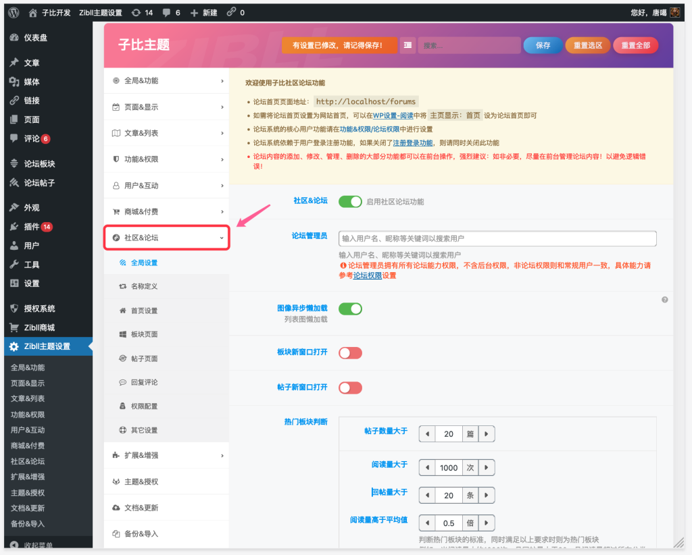全局配置

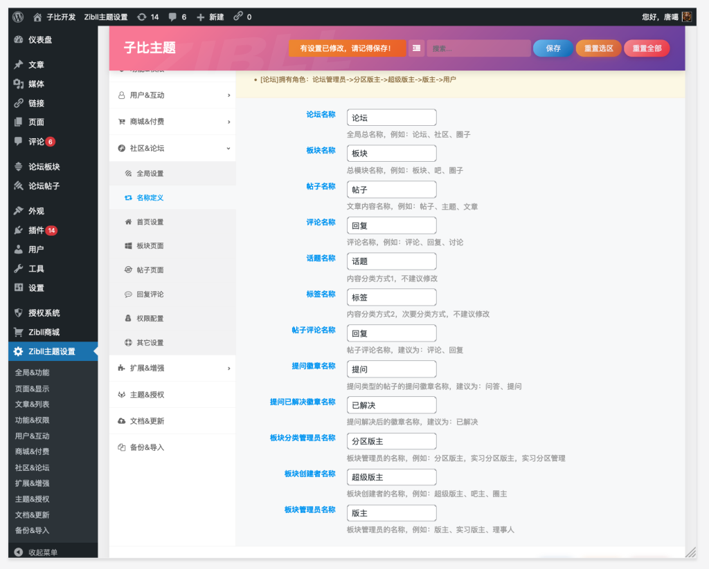名称定义

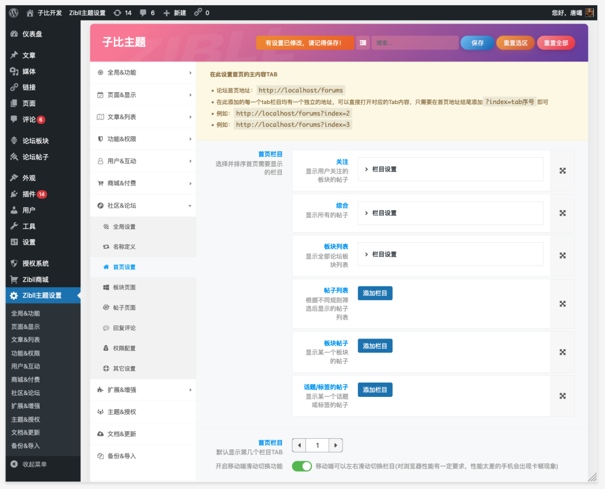首页栏目设置

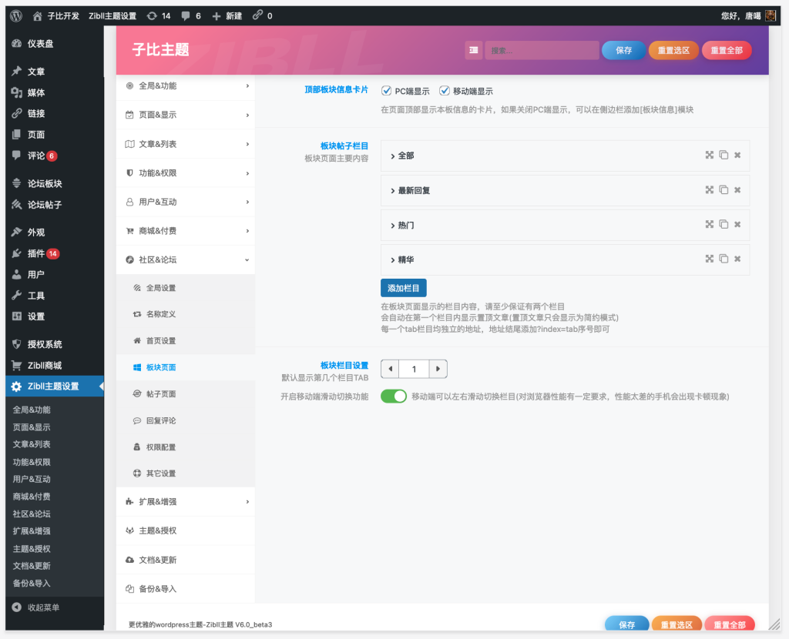

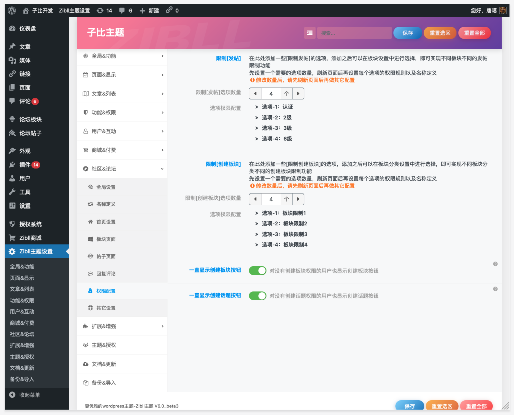

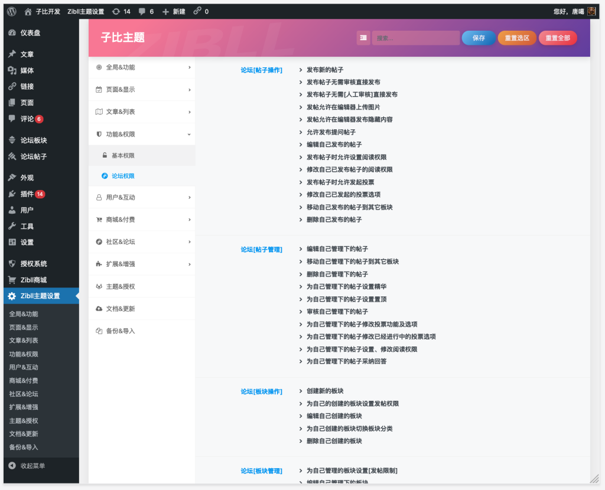


# 登录


使用WordPress建站，那么第三方登录肯定是必不可少的，子比主题支持丰富的社交帐号登录，当然少不了现在最常用的微信登录了，但是大家都知道，使用微信公众号登录需要认证的服务号，认证需要花费300元每年，而部分站长并没有服务号的需求，所以这个功能就不能使用了！

但是！现在子比主题已支持订阅号、未认证的公众号进行扫码登录了！

## 微信公众号登录

### 效果预览

首先我看一下微信公众号的登录页面预览：

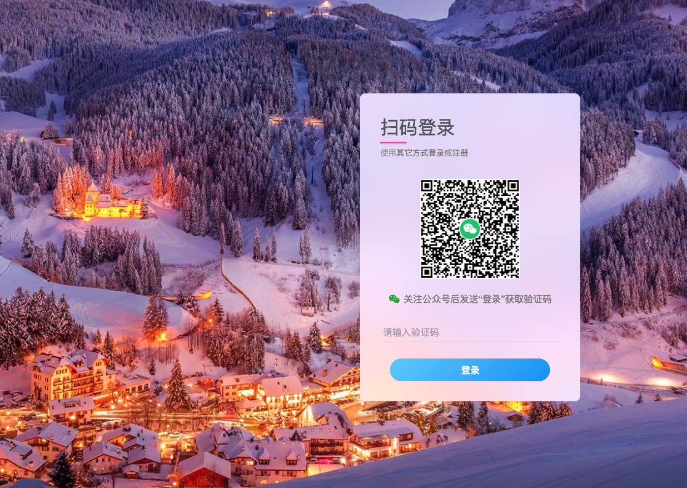


此功能需升级zibll子比主题至V6.8及以上版本

**功能简介：**

- 订阅号以及未认证的公众号接口权限缺少很多，我们通过公众号获取验证码的方式进行登录接入
- 用户登录流程为：点击微信登录，扫码关注公众号，公众号会自动回复一个验证码，用户输入验证码登录
- 已经关注的用户可以发送”登录“，重新获取验证码进行登录
- 发送的关键词以及自动回复模板都支持自定义

### 接入教程

接下来我们就一步一步的开始接入教程，首先我们整理一下，大致为以下流程：

1. 申请并开通微信公众号，无需认证，订阅号也可以
2. 获取AppID和AppSecret并填入主题设置
3. **添加微信公众号IP白名单**
4. **设置微信公众号的服务器URL配置**

申请微信公众号以及认证百度已经有很多教程了，按照流程一步一步来就行了，这里就不在阐述了。

接下来针对已经申请并认证成功的微信公众号做详细的接入教程。

如果您有已经认证的服务号需要接入，请查看以下教程：

#### 获取AppID和AppSecret

登录[微信公众号平台](https://www.zibll.com/?golink=aHR0cHM6Ly9tcC53ZWl4aW4ucXEuY29t)，进入设置与开发->开发->基本配置

1.获取AppID和AppSecret并填入主题设置->用户&互动->社交登录->微信登录(公众号模式)

2.点击配置IP白名单，将网站服务器的IP地址加入到白名单


#### 微信公众号的服务器URL配置

首先进入主题设置->用户&互动->社交登录->微信登录(公众号模式)：复制`服务器接口URL`，并设置一个Token并保存！
然后进入公众号平台->设置与开发->开发->基本配置->服务器配置：点击修改，填写复制的`接口URL`以及Token
保存成功之后，记得点击启用


注意事项：

- token可以随意填写，主题设置和微信平台保持一致即可
- 必须先设置主题设置的token并保存，然后再去微信公众号平台提交服务器配置，顺序反了则会失败
- 消息加解密方式必须选择明文模式
- 提交成功之后记得启用服务器配置

### 其他配置

最后我们还需要上传我们公众号的二维码，同时根据需要设置验证码回复模板即可

## 微信公众号登录后自定义菜单

微信公众号登录是一个优质WordPress网站必不可少的第三方的登录方式，zibll子比主题支持PC端扫码登录，微信APP内无感登录，体验十分优雅。
使用微信公众号登录，需要启用服务器配置，启用服务器配置之后，微信公号号平台的自定义菜单设置和自动回复功能就失效了。zibll子比主题为了解决这个问题，在V6版本中特新加入了自定义菜单和关键词自动回复功能。

本篇教程将用两种不同的方式详细的教大家如何在启用微信公共号登录后设置自定义菜单功能！

**第一种方法，使用zibll子比主题的自定义菜单功能。(需zibll子比主题V6及以上版本)**

1.进入主题设置->用户功能->第三方登录->微信公众号登录
当启用公众号登录之后，就能看到自定义菜单配置啦


2.填写自定义菜单的json配置后点击设定即可

那么问题来了，在哪里获取`自定义菜单的json配置`呢？

第一种方法：进入微信公众号平台，先临时关闭服务器配置，再进入自定义菜单配置，设置好你想要的菜单，生成JSON数据（部分用户可能会没有此功能）

第二种方法：进入网站：[https://wei.jiept.com/](https://www.zibll.com/?golink=aHR0cHM6Ly93ZWkuamllcHQuY29tLw==)，根据需求配置好菜单，复制下方的JSON数据


是不是十分简单呢？自定义菜单这个功能呢也不是一个经常需要修改的功能，所以主题也就没有做详细的配置项目了。
使用此功能还是有几点需要注意的：

- 设置自定义菜单前，请先设置好公众好登录功能，确保登录功能没问题
- 设置好成功后会有几分钟的延迟才能生效，请耐心等待
- 设置失败，下方会显示微信返回的原因和错误代码，虽然是英文的，百度依然可以解决

**第二种方法，可以通过其它第三方授权进行设置**

这种第三方微信公众号助手就太多了，有免费的，有收费的，我就拿凡科微信公众号助手来示例一下：

[凡科公众号助手](https://www.zibll.com/?golink=aHR0cHM6Ly9pLmZrdy5jb20v)有免费功能也有付费功能，设置自定义菜单功能是免费的，具体流程如下：

1. 注册并登录[凡科公众号助手](https://www.zibll.com/?golink=aHR0cHM6Ly9pLmZrdy5jb20v)
2. 扫码授权你的微信公众号
3. 最后进入自定义菜单设置就可以了


教程结束，[点击这里](https://www.zibll.com/zibll_word/user-function)可以了解更多的子比主题第三方登录的相关教程，也可以在下方查看微信公众号登录教程


## 邀请码

使用wordpress建站的站长们，对邀请码功能需求还是很大的，邀请码注册可以有效的增加网站用户活跃度和质量。合理运用邀请码功能还可实现多种功能，也增加了网站的扩展性。

zibll子比主题的用户功能可以说十分强大了，不仅支持手机、邮件、第三方登录等功能，还拥有完善的用户管理系统，接下来那么我们老看看本次更新的邀请码功能

### 功能简介

- 支持单独开启或关闭此功能
- 支持设置为必须使用邀请码才能注册
- 支持设置使用邀请码注册的用户可以赠送会员、积分、余额、经验值等奖励
- 每一个邀请码都可以单独定义奖励方式
- 支持批量自动创建邀请码
- 支持批量导入邀请码
- 支持导出卡密为Excel文档或txt文档

### 预览截图


### 配置教程

进入主题设置->用户功能->登录注册：开启邀请码注册


### 邀请码管理

进入用户->邀请码管理：即可查看邀请码列表，也可以添加或导出邀请码


### 创建邀请码

点击添加邀请码，可以选择自动生成邀请码，或导入邀请码。同时可以配置邀请码的使用奖励


### 导出邀请码

点击导出邀请码，即可导出为Excel文档或txt文档


更多用户功能介绍及教程请[点此查看](https://www.zibll.com/zibll_word/user-function)


## QQ登录


子比主题自带第三方社交帐号登录功能，QQ登录是非常常见的第三方登录，使用方便，申请比较简单，也不需要费用，但是需要你的域名已经备案。
本篇教程将详细的教你如何申请 QQ登录 以及设置子比主题！

### 提交申请

首先在[QQ互联平台](https://www.zibll.com/?golink=aHR0cHM6Ly9jb25uZWN0LnFxLmNvbS8=)登录你的QQ, 注册成为QQ互联平台开发者

**在右上角头像处点击进入授权管理**


然后在应用管理->创建应用->创建网站应用


填写好相关资料->提交


接下来就是网站信息，需要准确的填写：
注意回调地址在：主题设置-社交登录-QQ登录 复制过去


接下来就是等待3-7个工作日的审核了，一般几个小时就审核了，看情况吧

### 获取ID和Key


审核通过之后，点击查看

先确保应用接口中的 登录 和 unionid 均已获取

然后记录 **`APP ID`** 和 **`APP Key`**


### 主题配置

进入Wordpress后台-主题设置-社交登录-QQ登录
开启QQ登陆
对应填入 **`APP ID`** 和 **`APP Key`**


保存之后就可以在前台登录界面看到QQ登录的按钮啦
主题接入的第三方登录非常多，根据你网站的接入数量，可以调整 主题设置-社交登录-最下方按钮样式，以达到最好的显示效果喔！


## Github登录

Github登录不像QQ、微信、微博需要审核，还需要备案，简单几个步骤就可以接入。

但是Github国内的访问可能会出现问题，比较适合技术网站使用，毕竟技术宅都是有Github帐号的

### 创建开发者应用


首先你得有一个Github的帐号，没有的话就注册一个吧。邮箱注册也很简单！<br>但是如果你不能正常访问Github网站，那么也是正常的，自己百度解决吧

1.登录[Github](https://www.zibll.com/?golink=aHR0cHM6Ly9naXRodWIuY29tLw==)后，点击进入设置


2. 进入开发配置(Developer settings)


3. 创建OAuth Apps，填写一些必要的信息


回调地址在主题设置-社交登录获取

4.记录 `Client ID` 和 `Client Secret`


5. 将`Client ID` 和 `Client Secret` 保存到主题设置


保存之后，就可以在前端看到Github的登录按钮了

## 阿里云手机短信登录注册

升级V5.1之后，主题支持了短信注册、短信登录、手机号绑定等功能了！同时支持多种短信平台！
本文就详细的介绍接入阿里短信的详细教程！

阿里云短信毫无疑问是接入首选了，大平台可靠性高，价格也不贵！同时支持按量计费，灵活性也很高！
网友测试，无需备案也可接入

需要子比主题V5.1及以上版本

### 参考文档

[阿里云短信官网](https://www.zibll.com/?golink=aHR0cHM6Ly93d3cuYWxpeXVuLmNvbS9wcm9kdWN0L3Ntcz91c2VyQ29kZT1xeXRoOXcycQ==)
[阿里云短信控制台](https://www.zibll.com/?golink=aHR0cHM6Ly9keXNtcy5jb25zb2xlLmFsaXl1bi5jb20vZHlzbXMuaHRtP3NwbT1hMmM0Zy4xMTE4NjYyMy4yLjE4LjY4Nzc2OTE1a3M2NnNqIy9vdmVydmlldw==)
[阿里云短信定价明细表](https://www.zibll.com/?golink=aHR0cHM6Ly9oZWxwLmFsaXl1bi5jb20vZG9jdW1lbnRfZGV0YWlsLzQ0MzUwLmh0bWw/c3BtPTUxNzYuODE5NTkzNC4xMjgzOTE4LjYuMTVmMDZhN2R6Tkc5eXE=)
[返回错误码对照表](https://www.zibll.com/?golink=aHR0cHM6Ly9oZWxwLmFsaXl1bi5jb20vZG9jdW1lbnRfZGV0YWlsLzEwMTM0Ny5odG1sP3NwbT01MTc2LjgxOTU5MzQuMTI4MzkxOC44LjE1ZjA2YTdkek5HOXlx)
[阿里云短信防盗刷指南](https://www.zibll.com/?golink=aHR0cHM6Ly9oZWxwLmFsaXl1bi5jb20vZG9jdW1lbnRfZGV0YWlsLzEwOTEwMi5odG1sP3NwbT1hMmM0Zy4xMTE4NjYyMy42LjYwNy42ODc3NjkxNWtzNjZzag==)

### 教程概览

其实申请十分简单，大致就以下几个步骤！

1. 注册阿里云帐号并完成实名认证
2. 开通短信服务
3. 获取AccessKey ID和AccessKey Secret并填入主题设置
4. 创建签名和模板等待审核通过
5. 测试发送，结束

其实整个步骤主要是第三步和第四步，主题设置需要的参数也只有4个：`AccessKey Id` `AccessKey Secret` `签名` `模板CODE`

### 获取AccessKey ID和AccessKey Secret

AccessKey ID和AccessKey Secret是用于授权阿里API用户标识和秘钥，用于短信接口验证

操作步骤:

- 使用云账号登录[RAM控制台](https://www.zibll.com/?golink=aHR0cHM6Ly9yYW0uY29uc29sZS5hbGl5dW4uY29tLw==)。
- 在左侧导航栏的人员管理菜单下，单击用户。
- 在用户登录名称/显示名称列表下，单击目标RAM用户名称。
- 在用户AccessKey区域下，单击创建AccessKey （ 首次创建时需填写手机验证码）
- 记录 AccessKey ID和AccessKey Secret 并保存到主题设置


### 创建短信签名和模板

首先您需要[开通短信业务](https://www.zibll.com/?golink=aHR0cHM6Ly9keXNtcy5jb25zb2xlLmFsaXl1bi5jb20vZHlzbXMuaHRtP3NwbT1hMmM0Zy4xMTE4NjYyMy4yLjI2LjdhNWE0NjNhWGF0REliIy8=)，首次开通需要实名认证。开通之后，进入[短信控制台](https://www.zibll.com/?golink=aHR0cHM6Ly9keXNtcy5jb25zb2xlLmFsaXl1bi5jb20vZHlzbXMuaHRtP3NwbT1hMmM0Zy4xMTE4NjYyMy4yLjI3LjdhNWE0NjNhWGF0REliIy9hY2NvdW50)，申请短信签名以及短信模板！
然后将签名和短信模板的ID填入主题设置，等待审核通过之后就可以使用了！
一般审核就是一两个小时，还是很快的，如果半天没处理，可以点击催审，或者联系在线客服


短信签名已经短信模板均需要符合审核标准，一般只要没有商业信息都没有问题。短信模板建议在常用模板库添加，这样审核很快!
如有其它疑问，可以参看阿里官方教程:

1. 创建签名前查看短信规则和审核规则：[短信业务规则](https://www.zibll.com/?golink=aHR0cHM6Ly9oZWxwLmFsaXl1bi5jb20vZG9jdW1lbnRfZGV0YWlsLzU1MzIyLmh0bWw/c3BtPTUxNzYuZG9jNTU3NjQuNi41NzkuVWxjQnBl)，[审核规则](https://www.zibll.com/?golink=aHR0cHM6Ly9oZWxwLmFsaXl1bi5jb20vZG9jdW1lbnRfZGV0YWlsLzU1MzI0Lmh0bWw/c3BtPTUxNzYuZG9jNTU0OTEuNi41NzMuUUc5ZWl5)
2. 创建短信签名：点击查看[创建短信签名](https://www.zibll.com/?golink=aHR0cHM6Ly9oZWxwLmFsaXl1bi5jb20vZG9jdW1lbnRfZGV0YWlsLzEwODA3Mi5odG1s)
3. 创建短信模版：点击查看[创建短信模版](https://www.zibll.com/?golink=aHR0cHM6Ly9oZWxwLmFsaXl1bi5jb20vZG9jdW1lbnRfZGV0YWlsLzEwODA4Ni5odG1s)

**最后我们将申请通过的短信签名和短信模板CODE填入主题设置：**


### 防盗刷指南

你可以在短信控制台，开启防盗刷监控，同时可以设置发送频率限制等，以防止盗刷


接入阿里云短信的的全部教程就结束了！配置好之后您就可以在主题设置测试短信发送！如果发送失败会返回对应的错误码和错误原因！
最后，当短信能正常发送之后，请记得在主题设置-用户互动-登录注册：开启手机登录、手机注册、手机绑定等功能哦！


## 腾讯云手机短信登录注册

升级V5.1之后，主题支持了短信注册、短信登录、手机号绑定等功能了！同时支持多种短信平台！
本文就详细的介绍接入腾讯云短信的详细教程！

腾讯云短信沉淀腾讯十多年短信服务技术和经验，为 QQ、微信等亿级平台和10万+客户提供国内短信和国际/港澳台短信服务。国内短信验证秒级触达，99%到达率； 稳定可靠，价格不贵，注册即送200条短信
需要备案才能接入

需要子比主题V5.1及以上版本

### 参考文档

[腾讯云短信官网](https://www.zibll.com/?golink=aHR0cHM6Ly9jbG91ZC50ZW5jZW50LmNvbS9wcm9kdWN0L3Ntcw==)
[腾讯云短信计费明细](https://www.zibll.com/?golink=aHR0cHM6Ly9jbG91ZC50ZW5jZW50LmNvbS9wcm9kdWN0L3Ntcy9wcmljaW5n)
[腾讯云短信快速入门](https://www.zibll.com/?golink=aHR0cHM6Ly9jbG91ZC50ZW5jZW50LmNvbS9kb2N1bWVudC9wcm9kdWN0LzM4Mi8zNzc0NQ==)

### 教程概览

- 开通短信服务
- 获取SDK AppID和AppKey并填入主题设置
- 申请短信签名和短信模板等待审核

### 开通腾讯云短信

如果您还没有腾讯云账号，您需要 [注册腾讯云](https://www.zibll.com/?golink=aHR0cHM6Ly9jbG91ZC50ZW5jZW50LmNvbS9kb2N1bWVudC9wcm9kdWN0LzM3OC8xNzk4NQ==) 账号，并完成 [企业实名认证](https://www.zibll.com/?golink=aHR0cHM6Ly9jbG91ZC50ZW5jZW50LmNvbS9kb2N1bWVudC9wcm9kdWN0LzM3OC8xMDQ5Ng==)。

如果您已有实名认证的腾讯云账号，直接登录 [短信控制台](https://www.zibll.com/?golink=aHR0cHM6Ly9jb25zb2xlLmNsb3VkLnRlbmNlbnQuY29tL3Ntc3Yy)，即可开通

### 获取SDK AppID和AppKey

登录 [短信控制台](https://www.zibll.com/?golink=aHR0cHM6Ly9jb25zb2xlLmNsb3VkLnRlbmNlbnQuY29tL3Ntc3Yy) ，在左侧找到[应用列表](https://www.zibll.com/?golink=aHR0cHM6Ly9jb25zb2xlLmNsb3VkLnRlbmNlbnQuY29tL3Ntc3YyL2FwcC1tYW5hZ2U=)，你可以选择创建应用或直接使用默认应用。
点击应用后，即可看到 `SDK AppID` 和 `App Key `，复制填入主题设置即可！


### 申请签名及模板

在短信控制台-国内短信-签名管理和正文模板管理申请签名和模板，建议使用标准模板，使用标准模板可提高审核效率和成功率


**注意：**申请模板的时候，一定要申请有两个变量的模板，否则会出错！如图所示：


然后将您申请的签名和短信模板的ID填入主题设置


### 防盗刷建议

你可以在短信控制台，设置发送频率限制，以防止盗刷。


教程结束！配置好之后您就可以在主题设置测试短信发送！如果发送失败会返回对应的错误码和错误原因！
最后，当短信能正常发送之后，请记得在主题设置-用户互动-登录注册：开启手机登录、手机注册、手机绑定等功能哦！


## 登录注册等配置

主题自带功能强大的用户系统，包含前端用户中心、前端独立登录注册、用户消息系统、用户私信系统、用户付费会员系统等等，这些功能都能有效的提高网站的互动性，也是一个合格的阅读类网站的基本操作！

这篇教程详细的讲解一下用户入口端功能的配置教程，主要包含：登录、注册、找回密码、手机验证码、邮箱验证码、账户绑定、登录页面美化、登录卡片美化等教程

### 登录界面

进入WP后台-主题设置-用户互动-登录注册，即可看到相关的配置项

登录界面一共有两种显示方式：

1. 弹窗登录：点击登录、注册弹出一个窗口进行操作
2. 跳转页面登录：点击登录、注册后跳转到登录页进行操作

**同时请注意：**

1. 不管你设置哪一种显示方式，主题的登录、注册页都是可以使用的，方便集成到其它插件或者功能中！
2. 可以开启使用主题的登录/注册页面代替WP自带的登录注册页面以美化后台登录页面

我们先来看看两种模式的截图预览：

- [![图片[1\]-登录/注册/找回密码/手机验证/绑定邮箱/人机验证等用户功能配置教程-Wordpress主题模板-zibll子比主题](https://oss.zibll.com/zibll.com/2021/01/%E5%9B%BE%E7%89%87-17.png?x-oss-process=image%2Fquality,q_50%2Fresize,m_fill,w_1024,h_650)](javascript:;)登录页面
- [![图片[2\]-登录/注册/找回密码/手机验证/绑定邮箱/人机验证等用户功能配置教程-Wordpress主题模板-zibll子比主题](https://oss.zibll.com/zibll.com/2021/01/%E5%9B%BE%E7%89%87-16.png?x-oss-process=image%2Fquality,q_50%2Fresize,m_fill,w_1024,h_742)](javascript:;)弹出卡片

这两种界面模式都有一些可以选项可以进行设置，以美化实际效果

- [![图片[3\]-登录/注册/找回密码/手机验证/绑定邮箱/人机验证等用户功能配置教程-Wordpress主题模板-zibll子比主题](https://oss.zibll.com/zibll.com/2021/01/%E5%9B%BE%E7%89%87-19.png?x-oss-process=image%2Fquality,q_50%2Fresize,m_fill,w_1024,h_820)](javascript:;)
- [![图片[4\]-登录/注册/找回密码/手机验证/绑定邮箱/人机验证等用户功能配置教程-Wordpress主题模板-zibll子比主题](https://oss.zibll.com/zibll.com/2021/01/%E5%9B%BE%E7%89%87-18.png?x-oss-process=image%2Fquality,q_50%2Fresize,m_fill,w_1024,h_882)](javascript:;)

### 登录功能配置

登录功能主要分为几种：

- 基本的帐号密码登录
- 验证码免密登录
- 社交帐号登录

要想能使用全部的登录方式那么就涉及到几个问题了！

1. 邮件发送功能正常[[查看邮件配置教程\]](https://www.zibll.com/720.html)
2. 手机短信接口正常[[查看短信接入教程\]](https://www.zibll.com/?s=短信)
3. 接入社交帐号登录[[查看第三方社交帐号登录接入教程\]](https://www.zibll.com/?s=第三方登录)

子比主题提供了多种强大的登录方式，当然也并不是非要全部使用，根据您的需求开启即可！


### 注册功能配置

说了登录功能，其实注册功能大致是一样的，根据您的邮件、短信的接入情况按需开启对应功能即可！


### 找回密码配置

和上面一样，主要是设置找回密码的验证方式：


### 绑定邮箱/手机配置

原理和上面的基本一致，根据短信、邮件功能的情况开启对应的绑定功能
同时可以设置`强制绑定`以及`提醒绑定`功能：


### 其它功能配置

1. 关闭登录注册功能：如果您的网站无需用户交互，可以关闭登录注册功能，不会影响后台管理员登录
2. 两种人机验证方式：图形验证码和滑动验证功能
3. 显示用户协议和隐私声明功能
4. 用户昵称限制功能，防止用户设置违禁词为昵称


登录注册相关的用户入口功能的全部教程就结束了，需要提醒的就是：如果您的短信已接入可以正常发送短信了，那么请记得开启短信登录、注册、绑定、找回密码的开关，别漏掉了


# 消息

## 站内消息

站内消息是增加用户互动的实用性功能，能方便的传递一些重要消息，以及通知等！子比主题自带完善的消息系统，支持系统自动消息、管理员手动推送、用户私信等一系列功能！本篇文章将详细的介绍此功能以及使用方法！

需更新子比主题V5及以上版本

### 支持的功能

- 支持全局开关此功能
- 多种消息类型均可自定义开关
- 支持用户私信功能
- 用户可自行设置消息接收类型
- 支持后台推送消息
- 支持后台管理用户消息
- 私信支持上传图片、添加表情、添加代码，并支持设置是否允许
- 私信支持黑名单功能
- 消息列表功能AJAX加载

### 功能设置

进入WP后台-主题设置-用户&互动-消息通知


### 后台管理及推送

进入WP后台-用户-管理消息-添加推送消息


### 管理用户消息

进入WP后台-用户-所有用户：选择需要管理消息的用户->点击管理用户消息


### 前台预览


# 性能

相信建站的朋友都十分关心网站速度问题了，子比主题一直在强调极速优化这次词语，同时在之前的很多文章中我也简单的介绍了子比主题的关于速度优化的一些原理。理论上来讲使用子比主题搭配一个不是太差的服务器，那么就已经很快了，如果你想让你的网站变得更快，那么看了这篇文章，我相信完全够了。


**子比主题V6.9更新**：在这一版本我们再次优化了数据库逻辑，为数据增加索引，同时将查询逻辑进行前置处理，然后提前缓存。那么最终的效果就是：
1.使用Redis、并使用最新的WP 6.1版本，整体SQL数据查询再次**减半**！最低实现2次查询，平均都能都在10次以内，真正实现个位数sql查询。
2.当文章数量超过2万以上时有明显的速度提升，至少提升50%。数据不多一样有提升，当然数据不多的时候由400毫秒提升到350毫秒就感知不大而已。


**子比主题V6.7更新：**随着主题更新，增加了不少了新功能。大家都知道功能越多相对来说速度也会慢一点，因为php需要处理的函数也会增加，没错理论上是这样的。但是我们再次首创AJAX后台处理功能，将一些比较消耗时间且必要的处理单独剔出来并转换为：页面加载完成后通过admin-ajax请求来后台处理这一部分。所以我们不仅没有变慢，反而再次将页面加载速度提升了50%以上！


**子比主题V6更新：**全新V6论坛系统采用了更加先进的缓存逻辑或函数规范，相比之前版本性能再次提升2-5倍以上！我们强烈建议按照此教程进行优化，v6版本配合此教程优化后可实现SQL查询个位数！性能直接起飞！
SQL数据及页面加载数据查看方法在此文章最底部！

## 主题优化介绍

为了让大家了解什么是极速优化，首先我必须的得再次介绍一下主题是如何做的。

简单的说一个网站打开的流程：wordpress使用PHP为后端服务，由PHP进行html内容渲染，然后传入用户浏览器。
那么这里我们从速度优化上来讲主要需要重视的两个过程：`后台渲染速度`和`前台网页加载速度`

- `后台渲染速度`主要由PHP负责，由php查询数据库，生成html内容再返回给浏览器
- `前台网页加载速度` 主要取决于用户与服务器之间的网速以及请求的内容大小

那么这里我们先说前台加载速度，这一部分最简单易懂，简单的说就是网速快不快，内容大不大。
子比主题在前台加载速度优化上做了哪些优化呢？

- 全局所有js文件，css文件动态按需加载，注意这个按需加载并不是你开启了这个功能就加载对应的文件，而是说这个页面有这个功能，才会加载这个文件。举例说明：主题V5.2开启自带了视频播放器功能，为了让视频播放器支持不同的流媒体格式，那么这个功能一共有4个JS文件组成（1个视频播放器主文件，3个流媒体格式支持文件），每个文件大约160KB。如果我们直接加载这四个文件，那就会有600多kb的内容了，如果你页面没有视频的话，这600kb的内容无疑就是浪费了！主题的动态按需加载就是为了解决这个问题，不管你是否开启此功能，主题会按照当前页面自动检测是否有视频，有的话的就加载对应的JS文件，同时自动分析支持的格式加载对应的格式支持js文件，不需要的文件一律不加载！同理，其它js和css均采用此原来动态按需加载。
- 全局所有JS，CSS文件均采用UglifyJS标准进行压缩使用，同时保留了未压缩文件，方便有需要的用户进行修改！
- 全局所有图片均支持异步懒加载，图片可以说是一个网站最占流量的内容了，开启图片懒加载之后，在用户进入网页的时候不会加载任何图片以提高页面打开速度，然后当用户浏览页面的时候，根据需要，用户看哪里的就加载哪里的图片，当然是提前加载，不会影响用户体验
- 部分JS，CSS内容延迟加载。有一部分的功能可能不会是用户最需要的，或者不是打开页面立即就会使用的，那么这样的功能所需要的文件，我们将它放置在页面全部加载完成之后再进行加载。比如海报分享功能、一言功能、文章目录等功能：使用率较低，并且一般打开页面用户也不会立即使用此功能。
- 大量的AJAX不刷新加载功能，AJAX就是不刷新加载内容，比如AJAX下一页，ajax tab等，有效的减少请求内容，提高页面加载速度，主题的AJAX功能全部使用在不影响SEO的内容中！
- 框架内容支持CDN加速，这个一般适用于海外服务器，国内访问较慢的话可以在主题设置开启。

除了以上部分其实还有很多的细节，这是在开发的过程中就一直放在重心的内容。当然除了加载速度，同时主题也在用户浏览体验上做了很多的优化，主题90%的动画效果均采用基于硬件加速的动画参数，确保所有动画效果思思顺滑不掉帧，比如幻灯片、图片灯箱等。同时在js函数和CSS函数编写的时候均采用高效的执行逻辑，避免重复、避免使用高负荷函数等。

后台主要采用php以及数据库进行页面渲染，主题开发中保持良好的开发逻辑，并且使用WP官方Object Cache对象缓存机制，确保函数的高效执行，有效的提高渲染速度
**本篇文章我们也重点说一说如何优化后台的渲染速度**

## 优化措施

首先分享一下我的建议以及可以优化速度的有效措施

- 前台优化：使用CDN加速
- 前台优化：图片使用OSS/COS等第三方储存，减少服务器带宽压力
- 后台优化：不建议使用全静态缓存，会导致很多交互功能不能用
- 后台优化：推荐使用Redis或Memcached缓存功能，不会有任何负面影响
- 后台优化：推荐使用opcache进行PHP加速优化

## Redis缓存教程

php在执行函数最消耗时间的就是查询SQL数据库了，一般来讲一个页面的数据库查询大概在120到260次左右，使用Redis或者Memcached缓存，原理就是将php查询过的数据库缓存下来，下一次相同内容就不再查询数据库了，直接从缓存获取，极大的提高php执行效率。

WordPress官方采用 Object Cache对象缓存，同时主题的也遵循此机制，配合Redis或者Memcached缓存，能将数据库查询降低80%，有效的提高了渲染速度！
Redis和Memcached原理是一样的，我们只需要二选一安装使用即可，优化加速的效果也差不多。我就以宝塔环境安装 Redis为例，进行详细的图文教程。

**教程一共分为三步：**

1. 安装PHP的 Redis 扩展
2. 宝塔安装 Redis 程序
3. wordpress安装 Redis 缓存插件并开启

### 安装PHP：Redis扩展

进入宝塔，选择到我们目前在使用的PHP程序（推荐使用PHP7.4），进入安装扩展找到Redis并安装：


等待安装完成之后，记得重启一下php服务：


### 安装Redis程序

进入宝塔的软件商店，搜索 Redis ，然后安装即可，安装完成之后无需做任何设置。


### 安装WP插件

最后一步就是在Wordpress安装 Redis 缓存插件了，支持 Redis 缓存 的插件有很多，我这里以 `Redis Object Cache` 这款插件为例进行安装

1. 直接在插件中心搜索 `Redis Object Cache` ，安装即可
2. 启用插件
3. 开启缓存

搜索安装插件

启用缓存功能

这个功能十分简单，不要觉得是英文插件有会影响使用，开启之后看到如下界面就说明成功了。如果没有开启成功，请按照上面的步骤检测php扩展和Redis程序是否安装成功


### 重要提醒

**如果您的服务器有多个网站，并且又要使用Redis，那么，一定要为网站设置不同的数据库前缀！不然数据会乱窜**

## Opcache加速教程

根据PHP的执行逻辑，每一个php函数在执行的时候php会先把此函数进行编译解析。Opcache是PHP官方公司开发的一款PHP优化加速扩展，它的原理把PHP函数编译解析后的内容进行缓存，从而提高PHP的执行速度！根据测试，能有效的提高2到5倍左右的执行效率。

安装Opcache就十分简单了，直接安装 Opcache 扩展，再重启PHP服务即可！


使用宝塔安装 Opcache 之后会自动配置好扩展参数，如需适当修改，进入配置文件，搜索`;opcache`，即可看到配置参数：


对应的配置解释：

```
opcache.enable=1 (default "1")

;OPcache打开/关闭开关


opcache.memory_consumption=128 (default "64")

;OPcache共享内存存储大小。用于存储预编译的opcode（以MB为单位）。


opcache.interned_strings_buffer=8 (default "4")

;OPcache字符串驻留大小，（以MB为单位）


opcache.max_accelerated_files=80000 (default "2000")

;OPcache控制内存中最多可以缓存多少个PHP文件，建议设置大一点，大于你的项目中的所有PHP文件的总和


opcache.revalidate_freq=3 (default "2")

;OPcache设置缓存的过期时间（单位是秒）；几秒内内容不会刷新，如果需要实时更新可以设置为 0


opcache.fast_shutdown=1（default  “0”）

;OPcache更快速清理内存的机制，实际效果视环境而异
```

## 查看及分析

缓存安装好了之后，怎么查看效果呢？之前就有网友叫我加一个显示sql查询数量以及php渲染时间的功能，其实这个一直都是有的，使用火狐浏览器或者Chrome浏览器按F12进入浏览器控制台Console就能看到了。你可以测试一下，未开缓存以及开启缓存的实际效果。


**最后温馨提醒：**

- 主题更新或者更新重要内容请记得刷新缓存！
- 使用缓存之后，部分不太重要的数据就不会实时更新，主题会自动判断！这种不重要的内容无需关注
- 适当优化，如果未优化就能低于500毫秒那就不建议再做优化了
- 同一个服务器有多个网站，并且又要使用Redis，那么一定要为网站设置不同的数据库前缀！不然数据会乱窜
- 关于PHP版本，我个人实测php7.2性能优于php7.4，不知道是不是个例，大家可以试试

最后多说几句，如果通过此教程优化后，页面生成时间还是比较慢，那么可以从以下几点来分析了：

1. 你网站的数量有多少？如果数据量巨大，那肯定会再稍微慢一点是正常的，这个数据仅供参考：2万文章以为400-600毫秒，5万文章800-1000毫秒，10万文章以上1.2-1.5秒左右。（包含文章加帖子）
2. 服务器性能问题，并且请勿认为配置=性能，很多站长认为我用的8核16G服务器性能应该很强，但实际上很多小公司的8核16G的性能还比不上大公司的2核4G，主要是因为部分小厂虚标严重，且CPU比较老。所以我们推荐使用阿里、腾讯、华为、百度等大公司服务器。官网使用的是华为云2核4G5M的C6S服务器，大约1500一年，仅供参考
3. 还有很重要的一点就是网站的数据来源，如果你的文章或其他数据不是通过网站正常发布的，例如：采集的、数据库导入的等，那么这种数据会极大的影响速度！要问为什么？我们就需要了解发布内容的流程逻辑了，我们在网站正常发布一篇文章，系统会有很多依赖数据会进行判断并更新写入，如果你是采集的内容，那么这些依赖数据多数都会缺失，这就会导致查询数据的时候多走弯路，从而导致加载速度变慢！我知道有些采集软件可以补充部分依赖的Meta数据，但是很多关联的依赖数据是无法写入的，举个例子：发文章系统会更新的依赖数据：该文章所有分类、标签的总文章数、总阅读数，该文章作者的热度、能获得多少积分、经验值等，文章内的图片数据查询等等、文章相关数据缓存的储存等等。当然也不是说不能采集，只是说非正常发布的内容越多，对速度影响越大！
4. 海外服务器，这一点主要影响的是网络速度，毕竟是海外网络速度肯定没有国内稳定可靠，如果确实要用海外的服务器，建议首选大厂的香港、台湾


# 菜单


## 手机端底部TAB导航

一个现代化WordPress网站，移动端体验才是最重要的开发方向。相信使用过子比主题的用户都知道，zibll子比主题一直都十分注重移动端的功能开发和用户交互体验，我们希望通过一款主题，让您的网站拥有堪比优质APP的移动端体验，强大而又丝丝顺滑！

### 功能介绍

首先我们简单的介绍一个移动端底部TAB的功能以及特色
`移动端底部TAB`也就是显示在手机上，页面底部的按钮，让手机端更加方便操作和跳转

- 按钮数量随意添加、删除、排序
- 每个按钮支持自定义图标、自定义文字、自定义尺寸
- 主题预置了漂亮的多彩SVG图标
- 按钮支持添加标签显示
- 文章页、帖子页支持自动显示文章功能按钮
- 支持页面滚动时隐藏功能
- 漂亮的UI设计，颜色、背景、间距、尺寸都精心设计
- 细节完美！例如：适配所有手机，不会被全屏手机的底部横条遮挡
- 首页按钮支持自动切换为返回顶部按钮
- 消息按钮支持自动显示未读消息数量
- 添加按钮支持投稿、发帖、创建板块、创建话题
- 文章内容页面自动显示当前内容的评论、点赞、收藏、评分、分享、购买按钮

### 功能设置

进入主题设置->全局&功能->手机底部TAB


在这里你可以开启此功能、添加按钮、根据需要设置功能


当我们添加一个按钮的时候，我们可以选择默认图标，或者自定义图标，也可以添加文章或徽章。不同的按钮类型有不同的功能

### 案例展示

这个功能使用设置都是十分简单的，主题默认是一套5键的按钮，那么我们接下来展示几个设置案例，供大家参考一下

- 
- 
- 
- 
- 
- 
- 
- ![图片[10]-WordPress网站为手机端底部添加TAB导航按钮详细教程-Wordpress主题模板-zibll子比主题](./../../../../../工作台/笔记/00_建站指北/zibll/zibll/图片-22.jpg)
- 
- 

zibll子比主题V6.3新增付费内容页面，自动显示购买按钮

- 
- 

最后，如需使用自定义HTML图标，可以参考以下教程：阿里云图标库使用


## 导航菜单

主题菜单分为PC端顶部导航和移动端菜单两个部分，可单独设置

### 导航菜单样式设置

进入主题设置-顶部导航

#### 电脑端样式

电脑端顶部导航有三种布局可选择，同时您可以设置是否固定在顶部


实际显示效果：


#### 手机端样式

移动端顶部导航有两种布局选择，弹出菜单有可选择弹出方向


截图展示：


顶部导航支持自定义背景色和前景色，如需了解请点击下方按钮

[截图预览](javascript:;)[设置教程](https://www.zibll.com/498.html#wznav_5)

### 添加菜单及设置

进入Wordpress后台-外观-菜单

在这里你可以新建菜单-并分别设置移动端和PC端的菜单


主题提供PC端菜单和移动端菜单独立设置功能（也可以只设置一个），你可以按需进行设置！为了达到更好的效果，设置菜单有一下几点请注意：

1. PC端菜单的一级菜单不要太多，太多会导致换行显示错位
2. 移动端菜单最多只支持二级菜单，如果添加了三级菜单则不会显示
3. PC端菜单支持多级显示，但建议不要超过二级

### 菜单使用图标

主题自带了Font Awesome 4.7 图标，你可以在菜单插入任意的 Font Awesome 4.7 图标而无需安装任何插件

**第一步：找到你想要插入的图标代码，并复制**

你可以使用[此网站](https://www.zibll.com/?golink=aHR0cDovL3d3dy5mb250YXdlc29tZS5jb20uY24vZmFpY29ucy8=)找到全部的图标代码，选择一个图标并复制图标代码：


**第二步：粘贴在菜单名称内**


**搞定，保存看看效果吧**！


同时除了主题自带的 Font Awesome 图标之外，您也可以插入其它图标，例如[Iconfont-阿里巴巴矢量图标](https://www.zibll.com/?golink=aHR0cHM6Ly93d3cuaWNvbmZvbnQuY24vaGVscC9kZXRhaWw/c3BtPWEzMTN4Ljc3ODEwNjkuMTk5ODkxMDQxOS4xNiZhbXA7aGVscHR5cGU9Y29kZQ==)，当然这就需要安装对应的插件或者插入一些自定义代码了。

#### 插入Iconfont图标教程

插入Iconfont图标是十分简单的，阿里巴巴也给出了十分详细的教程。如果您需要在导航菜单中也插入插入Iconfont图标，请点击查看一下教程！

[子比主题全站使用阿里巴巴Iconfont图标详细图文教程](https://www.zibll.com/547.html)


以上添加图标的教程可不仅仅适用于菜单喔！全站任何地方可以使用，同时大部分非子比主题网站也是可以使用的！例如下方的截图

- 
- 


## 导航菜单自定义徽章

子比主题的菜单显示其实是支持自定义Html代码的，那么就有很多的扩展性了！之前我们详细的讲解过如何在导航菜单添加图标的教程，如果不会添加图标的朋友可以复习一下下方文章！

- [Zibll子比主题-主题导航菜单设置教程](https://www.zibll.com/529.html)
- [Zibll子比主题-全站使用阿里巴巴Iconfont图标详细图文教程](https://www.zibll.com/547.html)

本篇文章属于扩展功能，高级教程。需要有点点的Html基础，如果一点都不会，那也没关系。本篇教程会很详细，有基础的朋友一看就懂，没基础的朋友就一步一步对照着来，也能做出好看的效果！

>  以下功能需要升级Zibll子比主题V4.1版本以上！

### 效果预览


### 添加徽章

**进入Wordpress后台-外观-菜单->修改导航标签**


首先我们将上面预览图的相对应的HTML代码附上！

```html
<!-- badge标签即为徽章 支持多项Class -->

主题购买<badge>折扣</badge>

网站建设<badge class="jb-yellow">NEW</badge>

最新优惠<badge class="badge-bw jb-vip2"><i>VIP</i></badge>

特惠资源<badge class="c-blue-2">NEW</badge>

示例页面<badge class="jb-red badge-bw">99</badge>

发布文章<badge class="b-blue"></badge>

友情链接<badge class="jb-green">+1</badge>

<!-- 徽章内也支持图标代码 -->
```

根据代码就很容易理解了，`badge` 便签也就是徽章了。如何控制标签的样式、颜色，也就是`class`来处理了！


**子比主题官方支持的 `class` 列表**

|   class    |    样式    | **class**  |  **样式**  |  **class**  |   **样式**   |
| :--------: | :--------: | :--------: | :--------: | :---------: | :----------: |
|  *c-red*   |  红色文字  | *b-theme*  | 主题背景色 |  *jb-red*   | 渐变红色背景 |
| *c-yellow* |  橙色文字  |  *b-red*   |  红色背景  | *jb-yellow* | 渐变橙色背景 |
|  *c-blue*  |  蓝色文字  | *b-yellow* |  橙色背景  |  *jb-blue*  | 渐变蓝色背景 |
| *c-blue-2* | 深蓝色文字 |  *b-blue*  |  蓝色背景  | *jb-green*  | 渐变绿色背景 |
| *c-green*  |  绿色文字  | *b-green*  | 深蓝色背景 | *jb-purple* | 渐变紫色背景 |
| *c-purple* |  紫色文字  | *b-purple* |  紫色背景  |  *jb-vip1*  | 渐变金色背景 |
|            |            |            |            |  *jb-vip2*  | 渐变黑色背景 |

当然如果这些class的样式还满足不了你，你还可以直接添加`style`代码哦！

同时 badge 徽章的内容也是支持自定义图标的，例如 你可以试试这句代码：

```html
<!-- 图标徽章示例 -->

特惠资源<badge class="c-blue-2"><i class="fa fa-bolt"></i></badge>
```

### 按钮样式

按照上面的方法举一反三，菜单还可以显示为按钮风格样式，先看看效果图吧！


对应的Html代码如下：

```html
<!-- 按钮风格的菜单 -->

<span class="but jb-red">主题购买</span>

<span class="but c-blue">网站建设</span>

<span class="but c-yellow">科技资讯</span>

<span class="but b-purple radius">最新优惠</span><badge><i>VIP</i></badge>

<span class="but jb-vip2 radius">特惠资源</span><badge class="jb-red"><i class="fa fa-bolt"></i></badge>
```

我相信，细心的朋友已经完全看明白了！简单讲解一下：

1. 将菜单的文字用`span`标签包围
2. `class`仍然可以使用上面表格中的颜色、背景色class
3. 最重要的就是class多了一个`but`，没错，这个就是代表按钮的 class
4. class再增加一个`radius`，即可显示为两边圆角

到这里，整个教程就结束了！赶紧试一试，让您的网站导航菜单也变得丰富多彩吧！

**温馨提示：**
以上的class以及badge徽章是可以运用在整个网站的自定义代码位置的，比如主题设置的很多地方都是支持自定义代码的
另外，使用自定义Html代码请一定要注意标签闭合！代码使用不当还会引起网站显示错误！


# 图标

## 底部徽章

```
https://img.shields.io/badge/any_text-you_like-blue

</img>
<a href="https://nbchen.com"></img></a> 
<span id="runDays"></span >
</img>
<a href="https://beian.miit.gov.cn/" target="_blank"></img></a>
```


## 卡片图标


```
灵感来源<badge class="ml6 jb-yellow">NEW</badge>
```


```
系统工具 <badge class="ml6 jb-blue">GO <span class="fa fa-angle-right em12"></span></badge>
```


## 阿里巴巴矢量图标

子比主题已经集成了Font Awesome 图标，您可以在全站使用Font Awesome图标而无需任何插件。

要使用Font Awesome图标教程十分简单，如图所示，仅需两步：


具体方法请参看：[在菜单插入图标教程](https://www.zibll.com/529.html)


Iconfont-阿里巴巴矢量图标是国内功能很强大且图标内容很丰富的矢量图标库，提供矢量图标下载、在线存储、格式转换等功能。可以使用GitHub帐号登录，数百万的图标免费使用，官方也提供了详细的教程

### 一、新建Iconfont项目

接下来我们就一步一步的教大家如何在使用阿里巴巴Iconfont图标

Iconfont 支持GitHub帐号登录，登录之后你就可以寻找自己需要的图标啦

首先呢，寻找自己的需要的图标，通通点进购物车！


再把购物车的图标加入到项目，如果还未创建项目，那就新建一个就是了


### 二、网站集成

使用 Iconfont图标 图标官方也有详细的教程，同时官网提供三种集成方式：Unicode、class、Symbol。这三种集成方式各有优劣势，具体请查看[官方教程](https://www.zibll.com/?golink=aHR0cHM6Ly93d3cuaWNvbmZvbnQuY24vaGVscC9kZXRhaWw/c3BtPWEzMTN4Ljc3ODEwNjkuMTk5ODkxMDQxOS4xNiZhbXA7aGVscHR5cGU9Y29kZQ==)

这里我推荐使用 Symbol 的方式集成到网站中，当然你也按照官方的教程使用其它方式集成

**第一步：将刚刚新建的项目生成 Symbol 接入链接，并复制**


**第二步：将代码保存到主题设置**

将以下代码中的链接替换为您刚刚复制的链接，然后 进入 主题设置-自定义代码-自定义底部代码 ，粘贴后保存主题设置

```javascript
<script src="//at.alicdn.com/t/font_1706672_oa811wlg9gl.js"></script>
```


简单吧！网站集成 Iconfont图标 就已经全部搞定了！接下来就是使用 Iconfont图标 了！

提醒：请勿直接将代码写入到主题源码，已更新就没了。

### 三、使用 Iconfont图标

在已经添加到你项目中查找图标并复制图标代码，然后按照下面的格式替换`href="#iconxxx"`中的图标代码，将代码插入到你需要显示图标的地方！

```html
<svg class="icon" aria-hidden="true"><use xlink:href="#iconxxx"></use></svg>
```

还是按照在导航菜单中添加图标为例：

复制图标代码

在导航菜单中插入

**最后我们看看效果吧！**


**是不是很简单啊，接下来我我们再试试在文章中插入**

使用古腾堡编辑器需要将内容转换为HTML编辑，然后再复制图标代码：

先转换为HTML编辑

然后再将代码复制到所需位置

使用经典编辑器也是需要先转为HTML编辑，再将图标代码复制到所需位置：


主题设置中的部分内容也是支持的喔！例如在`加载更多`的文案中插入


## 用户徽章

用户徽章功能是现在很多社交类网站和app必不可少的功能了，能有效的增加网站交互的趣味性。

zibll子比主题V6.7就更新了用户徽章功能，接下来我们就来了解一下这个功能。

### 功能介绍

首先我们简单的了解一下用户徽章功能的特色

- 支持添加并排序任意数量的徽章分类、徽章
- 所有的徽章均可自定义名称、简介、图标以及获取方式
- 用户自定义设置主要佩戴徽章（默认佩戴最新获取的）
- 支持手动赋予用户徽章功能，方便实现限定徽章、活动徽章等功能
- 系统支持10多种自动判断达标获取徽章的类型设置
- 主题自带了一套徽章参数，覆盖了常用徽章，包含30个徽章图标，减低站长首次配置的难度，特别是绘图

### 截图预览

以下截图使用默认参数、图标。


![图片[4]-为wordpress网站主题添加用户徽章功能详细教程-Wordpress主题模板-zibll子比主题](file://D:/%E5%B7%A5%E4%BD%9C%E5%8F%B0/%E7%AC%94%E8%AE%B0/00_%E5%BB%BA%E7%AB%99%E6%8C%87%E5%8C%97/zibll/zibll/%E5%9B%BE%E7%89%87-8.jpg?lastModify=1695882462)

### 配置教程

进入主题设置->用户功能->用户徽章:启用并配置参数


首先添加徽章分类，点击展开分类后，再添加徽章，输入徽章的名称、简介和图标，并设置获取方式


### 注意事项

- 徽章参数建议设定好之后就不建议再修改，以免出现错误
- 修改徽章参数后，可能部分用户的数据会与配置项不匹配，可以使用**重置全部用户徽章数据**
- 启用或重置后，用户登录网站则会自动获取达到条件的徽章，需要注意的是如果老用户一直未登录则不会获取徽章


# 编辑

## 文章目录功能

经常写文章的站长可能明白，文章目录树是多么的重要了。 文章目录对于长篇幅的文章非常有必要，合理使用文章目录功能，可以帮助用户浏览时快速了解文章的内容结构。 同时，养成良好的写作习惯，更容易表达良好的逻辑思路。

很多使用wordpress的站长都在苦苦的寻找这样的插件，使用插件很难实现完美，要么功能不合适，要么外观太丑或与主题不匹配。

Zibll子比主题自带了这样的文章目录树功能，全自动生成，自动分级，让您专注于写作！


### 几个特点

- 无需任何设置文章目录全自动生成
- 根据文章标题共分为4级目录，自动识别
- 此功能随意开关，每一篇文章可独立设置是否开启
- 文章目录通过模块配置，显示位置自由化
- 内容描点双向同步，你看哪里目录高亮哪里
- 自动判断是否显示，仅在文章页且文章内标题超过2个的时候才会显示
- 移动端会自动显示在弹出菜单内

### 如何设置

首先在主题设置-文章&列表-文章功能中可以全局开关此功能


其次每一篇文章均可独立关闭此功能


#### 添加模块

最重要的一步来了，将文章目录树模块添加到你需要显示的位置，一般我们添加在侧边栏
进入小工具设置、或模块配置。将`Zibll文章目录树`模块添加到侧边栏，根据需要进行标题或随动设置。
这里推荐添加到`所有页面-侧边栏顶部`位置，这个功能是自动识别的，不会在非文章页显示。


提醒：移动端由于不显示侧边栏，那么在移动端会自动显示在弹出菜单内，无需添加模块


#### 添加标题

到这里，所有需要设置的事情就已经全部完成了，接下来你只需要专注于写作。

在写文章的时候合理使用标题，**一篇文章的标题超过3个就会显示目录树**！好了，一起试试吧


## 代码高亮

有很多技术类型的站长在使用WordPress建站的时候，代码高亮的功能是必不可少的了。zibll子比主题自带了了强大的代码高亮功能，支持多种代码语言，同时深度适配主题的日间、夜间显示模式，让整体代码高亮效果更加的美观、已读

### 特色简介

- 多种代码语言，几乎包含全部常用语言
- 自动识别代码语言，或者手动设置
- 多种显示主题，支持日间、夜间模式单独设置高亮主题
- 支持复制代码、新窗口打开等扩展功能
- 支持显示行号、单独高亮行号功能
- 文章中使用古腾堡模块化插入，使用简单、配置丰富
- 评论、私信均支持代码高亮显示

### 效果预览

我们简单的预览以下部分代码高亮效果


### 选项设置

我们可以进入主题设置->全局&功能->常用功能：设置代码高亮的默认参数及功能：


注意：这里设置的是全局的默认参数，在文章中添加代码高亮时候，可以针对每一个块进行单独设置

### 使用古腾堡块在文章中插入

在文章中插入代码高亮的功能就是十分简单了，使用古腾堡块`【zibll 高亮代码模块】`
粘贴代码后可在右侧设置相关参数


### 在评论中使用高亮代码

主题默认开启评论中插入代码高亮功能，如需关闭或者重新开启，请在主题设置->用户&互动->评论设置：设置是否开启代码高亮


### 在私信中使用高亮代码

主题默认开启私信中插入代码高亮功能，如需关闭或者重新开启，请在主题设置->用户&互动->消息通知：设置是否开启私信代码高亮


子比主题采用模块化的开发理念，让页面更加的自由化。页面布局可使用小工具模块，那么文章内则使用古腾堡块。

古腾堡编辑器是Wordpress5.0版本开始引入使用的一个全新编辑器，这个编辑器岂止于强大，当然呢也有很多习惯了经典编辑的朋友再使用古腾堡编辑器觉得很不顺手，没错我刚开始使用古腾堡编辑器时候也是这样的。但是这个编辑用了你就会后悔，后悔没有早点用！

这片文章就带大家熟悉古腾堡编辑器，以及主题的编辑器扩展

## 熟悉古腾堡编辑器

使用Wordpress 5.0及以上版本，新建文章、页面的编辑器就是古腾堡编辑器了，

左上角可以添加块功能-右侧则是选中块的设置项


古腾堡自带模块已经很丰富了，能实现大部分的文章编写功能，建议每一个都试一下，这样慢慢就熟悉了

### 子比主题模块

在添加模块的时候，划到最下方就能看到子比主题的块了，每一个模块都有相应的介绍。选中某个模块之后，屏幕右侧则会出现该模块的设置选项


一样的推荐您每一个模块都是试一下，看看是什么效果，下面我也对子比主题的模块做一个展示

### 模块展示

**首先是标题模块：支持自定义颜色**


### 亮点块

亮点块用户图标和文字显示，用于展示亮点，建议4个一组使用


### 按钮块

通过按钮块快速添加各种样式的按钮。一共15种样式，每个样式可以选择是否圆角


### 引言块


### 提醒框


### 文章块

这个功能很简单，使用频率很高，在文章中插入其他文章的卡片。通常我们只能以链接的方式插入其他文章的链接，但是这样的显示效果太太太普通了！使用子比主题，搭配古腾堡编辑器，仅需一步即可插入漂亮的文章卡片！

**使用方法：**

简单一步：选择古腾堡`zibll-文章块`，输入文章的ID，搞定！


那么，问题来了，可能有些小伙伴不知道ID是什么。。。。 很简单，在编辑文章的时候，查看链接你就明白了！


**最后，来看一下效果吧**


**扩展使用：**

可能还一部分小伙伴没有使用古腾堡编辑器，所以此功能也支持使用短代码的方式使用，但是不推荐哦

使用方法如图：


### 隐藏内容模块


### 幻灯片模块


子比主题使用模块可以在任何位置插入幻灯片，那么如果要在文章内插入幻灯片怎么办呢？

对于文章内插入幻灯片一直都是Wordpress的难题，但是使用了子比主题，再搭配古腾堡编辑器，这就十分简单啦

#### 1.找到主题的幻灯片块

在编辑文章或者页面时候，点击插入块-选择最下方的zibll块分类-选择幻灯片块


#### 2.选择画廊图片插入

选择并插入图片就很简单了，就不截图了

#### 3.设置幻灯片参数

点击幻灯片块右上角的设置图标，右侧即可出现幻灯片的设置选项


幻灯片支持5种动画显示，同时可以设置切换时间和其它设置

为了保证幻灯片图片的尺寸显示效果良好，建议调整长款比例实现最佳显示

#### 4.显示灯箱

文章中所有图片点击都会弹出图片灯箱，如果您需要弹出的灯箱支持幻灯片，请将图片链接到**媒体文件**

提醒：所有文章图片均可这样设置以实现高级灯箱功能


### TAB栏目模块


[TAB栏目模块详细使用教程](https://www.zibll.com/2195.html)

### 折叠框模块


### 代码高亮模块


### 模态框模块


### 文件下载块


## 扩展功能

最后提一下小细节，也是我觉得古腾堡唯一不方便的地方。那就是居然不支持选择部分文字设置颜色….

所以主题也就有了这个功能……


主题对古藤堡编辑器的扩展还远不止这些，建议大家都试试，相信大家使用后，就能感受到真正的强大与方便！

# 评论

## ip显示

使用wordpress搭建网站的站长们估计已经对这个功能很熟悉了，包括现在主流的软件都有显示ip归属地的功能了，使用zibll子比主题，仅需简单两步即可实现评论显示ip归属地以及用户中心显示用户ip归属地。


使用此功能需升级zibll子比主题V7.2及以上版本

### 截图示例


### 配置教程

这个功能的配置就十分简单了，仅需在主题设置开启此功能即可。

同时主题自带了免费的太平洋公共查询接口，但是免费的公共接口可靠性不太高，那么子比主题还接入了腾讯和高德接口，相对更为可靠！

同时主题支持多接口轮流查询，一个接口未查询到地址，自动切换另一个接口进行查询，再次提高了可靠性！

首先我们进入主题设置，开启对应的显示：


**完成以上操作以后，就直接可以使用此功能了，但是以下几点需要注意一下：**

- 如果您的服务器使用了代理功能，主题已做针对性优化，也能正常获取IP。但是，如果是本地局域网搭建，则无法获取IP，并且也有部分用户可能会通过某些技术手段来隐藏IP，那么也可能无法正确的获取IP，故此功能并非100%可靠
- 同理，因为是需要通过接口查询IP归属地址，接口查询也无法做到100%可靠，推荐同事使用腾讯和高德的接口，并使用轮询查询功能，可靠性更高
- 重要提醒：评论显示IP归属地，是在用户评论的时候进行获取，所以已评论的内容不会再显示
- 用户显示IP归属地，是在用户登录的时候进行获取，已注册的用户需要下一次登录的时候才会显示

### 接口配置

上面我们已经说过了，主题自带免费的查询接口，无需任何配置即可使用，但是如果您需要更可靠的使用，我们建议自己申请腾讯或者高德的接口进行使用。

首先我们进入主题设置，选择我们需要使用的接口，并把相应的接口参数填上即可：


### 腾讯接口申请教程

申请地址：[点击跳转](https://www.zibll.com/?golink=aHR0cHM6Ly9sYnMucXEuY29tL2Rldi9jb25zb2xlL2FwcGxpY2F0aW9uL21pbmU=)

如图所示，创建应用后，将参数填入主题设置即可


### 高德接口申请教程

申请地址：[点击跳转](https://www.zibll.com/?golink=aHR0cHM6Ly9jb25zb2xlLmFtYXAuY29tL2Rldi9rZXkvYXBw)

如图所示，创建KEY，选择web服务，提交后将参数填入主题设置即可


over！教程结束


# 上传

## 上传图片、视频

众所周知，普通用户在前台发布文章和发布帖子使用的编辑器不是[古藤堡编辑器](https://www.zibll.com/zibll_word/古腾堡编辑器)，这主要的原因是因为权限问题，[古藤堡编辑器](https://www.zibll.com/zibll_word/古腾堡编辑器)拥有的功能十分强大，但同时使用的权限也很多。对于普通用户来说，很多权限是不能给到的！又特别是对于图片和视频的上传功能，图片和视频都是十分占用服务器资源的，大多数站长也希望此功能仅开放给部分用户！

zibll子比主题拥有强大的[用户权限管理系统](https://www.zibll.com/3090.html)，通过用户权限管理系统可以细致化的设置哪些用户可以在投稿、发帖的时候允许上传图片、上传视频。

例如：我们仅允许会员才能上传视频，等级达到3级才能上传图片等等


上传视频功能需主题版本V6.2及以上版本，上传图片功能需主题版本V6.1及以上版本

### 设置教程

我相信已经熟悉zibll子比用户权限管理系统的朋友们已经明白这个功能怎么开启了，如果还不明白权限管理系统，建议先看一下这一篇文章

[zibll子比主题用户权限管理系统简介及教程[V6新功能\]](https://www.zibll.com/3090.html)

进入主题设置->功能&权限：找到对应的权限根据需要开启即可


进入主题设置->扩展&增强：分别设置上传图片、上传视频的最大上传大小


设置方式十分简单，却又超级强大！设置完成后，拥有权限的用户就可以看到上传图片、上传视频的按钮啦


最后温馨提醒：上传图片、视频都是特别消耗服务器资源和性能的，特别是视频，十分占用内存。在上传的时候又特别占用带宽，甚至如果您的服务器带宽不够，还会出现上传失败的现象！
**所以，此功能请根据自身服务器条件酌情开启！**


## 文件上传限制

zibll子比主题更新V7.0以后，新增了用户上传文件的功能，用户可以直接在前台发布文章、发布帖子的时候上传并插入附件下载，更好的扩展了交互功能。同时也新增了前台设置付费下载功能，同样支持上传文件进行设置

提到上传文件，那么很重要的就是允许上传哪些格式的文件呢？又允许上传多大的文件呢？

zibll子比主题拥有强大的用户权限管理系统，借助这个系统，我们可以轻松的配置不同类型的用户允许上传不同的文件格式，接下来我们开始教程。


使用此功能需升级zibll子比主题V7及以上版本

### 教程准备

教程开始之前，如果您还未了解过子比用户权限管理系统，强烈建议您看一下以下教程

- [zibll子比主题用户权限管理系统简介及教程[V6新功能\]](https://www.zibll.com/3090.html)

### 文件大小上传限制

进入主题设置->功能&权限->扩展权限：添加哪些用户，允许上传多大的文件


配置十分简单且清晰一目了然，需要注意的是：


设置上传大小，请考虑服务器负荷，以及服务器最大能支持的范围！上传文件最大大小，不能超过php.ini的配置。如果使用了cdn还需考虑cdn支持的最大上传大小！
同时上传**大文件**十分消耗服务器网络性能，文件越大越越占用带宽，当带宽不够或者服务器性能不足时候，则会出现上传失败的现象

## 上传格式限制

进入主题设置->功能&权限->扩展权限：添加哪些用户，允许或禁止上传的文件格式


注意事项：

- WordPress已经默认允许了常用文件格式的上传，则无需再添加。如需禁止再禁止即可
- 禁止的优先级大于允许
- 请添加文件的扩展名和MIME类型，用英文逗号分割。格式示例：`mp3=audio/mpeg,jpg=image/jpg`
- 郑重提示：请勿允许上传php、sh、exe等可执行文件，会极大的增加服务器被入侵攻击的风险

### 附常用文件MIME对应明细

最后我们附上常见文件格式的mime对应明细，约1200多个，十分全面了。不好找的建议使用浏览搜索功能，找到后点击即可复制


自行百度

# 下载

文件上传，文件下载是一个wordpress网站常用的功能，zibll子比主题更新V7以后新增了文件上传管理以及文件下载模块的功能，可以很方便的通过古腾堡编辑器或者经典编辑器插入此模块，让用户更加直观的下载附件。

## 预览


## 功能特色简介

- 后台使用古腾堡编辑器的`附件下载`块
- 前台使用此功能支持用户权限管理，可细分的设置哪些用户可以使用此功能
- 支持上传文件、支持手动属于附件下载地址
- 上传的本地文件自动隐藏真实下载地址，防止文件被刷
- 支持与隐藏模块配合使用，实现评论可见、会员可见、付费可见
- 同时支持文章和论坛帖子

## 使用教程

### 后台使用

后台我们直接使用古腾堡编辑器的`附件下载`块即可

如果您还未了解过强大的古腾堡编辑器，建议您查看以下教程：

[Zibll子比主题-编辑器增强-古腾堡编辑器块详解[入门详解\]](https://www.zibll.com/689.html)


古藤堡块额外支持单独配置文件图标，添加文件属性。

### 前台使用

用户在前台投稿或者在前台发布帖子使用此功能，支持用户权限管理，我们可以细分的设置哪些用户可以使用此功能。

如果您未了解过zibll子比主题强大的用户权限管理系统，强烈建议先查看此教程：

[zibll子比主题用户权限管理系统简介及教程[V6新功能\]](https://www.zibll.com/3090.html)

**配置方法：**

进入主题设置->功能&权限：分别配置投稿、发帖允许上传文件及插入附件下载的权限


**然后务必配置好允许用户上传文件的大小和格式限制，具体教程请查看以下文章：**

[zibll子比主题配置不同类型用户文件上传格式、上传大小限制教程[V7新功能\]](https://www.zibll.com/13972.html)

全部配置完成后，拥有此功能权限的用户就可以在编辑器插入附件下载功能了


## 配合隐藏模块使用

当然此模块是可以配置隐藏模块使用的，无论是前台还是后台的古藤堡编辑器都是可以配合隐藏模块使用，实现付费可见、会员可见、评论可见。

前台使用


# 签到

zibll子比主题作为一款wordpress社区论坛商城主题，拥有丰富的[虚拟商城](https://www.zibll.com/zibll_word/商城功能)功能，同时也拥有强大的[社区论坛](https://www.zibll.com/zibll_word/社区论坛)功能。在配合强大的[用户权限系统](https://www.zibll.com/3090.html)和[用户等级系统](https://www.zibll.com/2976.html)，可以使站长轻松的搭建一个高品质的交互形网站，也能更加快速的让网站变得活跃，从而提高网站收入。

之前我们详解了[用户等级](https://www.zibll.com/2976.html)功能，用户可以通过做任务获取经验值来提高等级获取更多的网站特权。zibll子比主题更新V6.3之后我们带来了全新的[用户积分](https://www.zibll.com/7349.html)和签到功能，用户获取的积分可直接用于网站积分商品的消费。每日签到可免费获取积分和升级经验值。签到功能再一次的提高了网站的互动性!

## 功能简介

我们先简单的介绍一下此功能的特点

- 支持后台单独开启或关闭此功能
- 支持配置签到获得的积分和经验值数额
- 支持配置连续签到获取的积分和经验值数额
- 漂亮的UI及交互设计


此功能需升级zibll子比主题V6.3及以上版本

## 配置教程

进入主题设置->用户&功能->签到奖励：开启此功能并做相关配置


## 前台展示

配置完成之后就可以在前台进行签到了


# 安全

网站安全一直是大家最关心的话题，使用人机验证可以有效的提高网站的安全性，防止网站接口被机器程序盗刷。比如被刷短信、被刷邮件、被刷评论等等。

使用wordpress建站默认是没有人机验证功能的，使用zibll子比主题我们自带了图片验证码和滑动验证，体验优雅也有较好的安全性。

同时zibll子比主题升级V6.3之后，我们再次优化了人机验证的逻辑，增加了token和加密数据，有效的提高了人机验证的安全性。同时除了之前的登录、注册、短信、邮件会人机验证之外，我们还增加了评论、发文章、发帖、提交链接的人机验证功能及选项。

当然，只要是程序，那么就有可能会被破解，所以我们又增加了腾讯验证码和[极验行为验4.0](https://www.zibll.com/7304.html)这两个第三方的人机验证接口。我相信这两个接口目前来说还没有人能轻松破解吧

## 腾讯验证码

### 功能预览

腾讯验证码也就是之前的腾讯防水墙的升级版，安全性和可靠性都不用说，唯一的缺点就是目前售价有点高了。如果想使用免费的可以试试[极验行为验](https://www.zibll.com/7304.html)。


### 配置教程

教程十分简单，大致分为以下几点：

- 登录腾讯云，[开通验证码功能](https://www.zibll.com/?golink=aHR0cHM6Ly9jbG91ZC50ZW5jZW50LmNvbS9sb2dpbj9zX3VybD1odHRwcyUzQSUyRiUyRmNvbnNvbGUuY2xvdWQudGVuY2VudC5jb20lMkZjYXB0Y2hhJTJGZ3JhcGhpY2Fs)(首次开通可免费试用7天)
- 获取腾讯验证码的CaptchaAppId和AppSecretKey
- 获取腾讯云的**API密钥**的SecretId和SecretKey
- 将获取到的参数保存到主题设置


需要郑重提醒的是：
请看上图的”登录人机验证排除账号“，这里必填。因为当你选择了第三方人机验证，假如出现参数错误等异常那么会导致用户无法登录，所以需要在此设置一个管理员登录的账号用户名，避免管理员都无法登录进入后台修改配置了！

## 极验行为验4.0

网站安全一直是大家最关心的话题，使用人机验证可以有效的提高网站的安全性，防止网站接口被机器程序盗刷。比如被刷短信、被刷邮件、被刷评论等等。

使用wordpress建站默认是没有人机验证功能的，使用zibll子比主题我们自带了图片验证码和滑动验证，体验优雅也有较好的安全性。

同时zibll子比主题升级V6.3之后，我们再次优化了人机验证的逻辑，增加了token和加密数据，有效的提高了人机验证的安全性。同时除了之前的登录、注册、短信、邮件会人机验证之外，我们还增加了评论、发文章、发帖、提交链接的人机验证功能及选项。

当然，只要是程序，那么就有可能会被破解，所以我们又增加了[腾讯验证码](https://www.zibll.com/7310.html)和极验行为验4.0这两个第三方的人机验证接口。我相信这两个接口目前来说还没有人能轻松破解吧

### 功能预览

极验公司是专注于安全验证的一家公司，服务于很多大型企业和政府，全新升级的行为验4.0安全系数更高，ui设计也十分精美。同时对比腾讯云验证来说，还可以申请免费使用！更多详情可以进[极验官网](https://www.zibll.com/?golink=aHR0cHM6Ly93d3cuZ2VldGVzdC5jb20=)了解详情。


### 配置教程

教程配置十分简单，在[极验官网](https://www.zibll.com/?golink=aHR0cHM6Ly93d3cuZ2VldGVzdC5jb20=)注册账号之后，开通`行为验4.0`，将获取的ID和KEY填入主题设置即可

**进入主题设置->扩展增强->网站安全：选择极验行为验并填上参数**


需要郑重提醒的是：
请看上图的”登录人机验证排除账号“，这里必填。因为当你选择了第三方人机验证，假如出现参数错误等异常那么会导致用户无法登录，所以需要在此设置一个管理员登录的账号用户名，避免管理员都无法登录进入后台修改配置了！

## 百度API内容自动审核接入

做网站审核内容一直是比较消耗精力的事情，例如评论审核，投稿审核等等。使用zibll子比主题搭建的WordPress网站，有拥有很多的交互功能，特别是更新V6之后，又增加了全新的论坛系统，随着网站用户增多，那需要审核的内容也就越来越多了，全部依靠人工审核，那可就有的忙了！这时候zibll子比主题的API智能内容审核功能就能大显身手了！

通过接入百度内容审核，实现网站所有用户提交内容进行api审核，极大的简化人工审核流程！如果您开启了论坛系统，网站交互也比较多，那么建议开启此功能！


此功能需要zibll子比主题V6或以上版本

### 功能介绍

首先我们简单的介绍一下内容审核功能以及特色：

- 支持文本审核包含：用户名、用户签名、发帖、投稿、评论、创建板块、话题等
- 支持前台所有的图片上传审核
- 配合用户权限功能，可实现免人工审核功能(api审核通过后直接发布)
- 前台AJAX方式审核，响应更快且不影响页面加载速度
- 各个功能是否审核可独立开关

由于不同厂商接入方式以及返回方式都有较大的差异，很难统一接口，所以主题暂时仅接入了百度内容审核，后期可能会继续添加其它接口

百度API审核特点：

- 价格便宜，首次使用还能免费领取5万次文本，1万次图片审核(21年12月)
- 自带全面的审核库，内容匹配精准
- 支持自定义审核策略，配置灵活且简单易用

### 百度内容审核接入教程

接下来我们一步一步的申请并接入百度内容审核

#### 注册并登录

首先进入[https://ai.baidu.com/solution/censoring](https://www.zibll.com/?golink=aHR0cHM6Ly9haS5iYWlkdS5jb20vc29sdXRpb24vY2Vuc29yaW5n)，注册并登录

登录后点击立即使用


#### 创建应用

点击创建应用


再次点击创建应用，先免费领取审核次数


然后根据需求填写好相对应的需求点击立刻创建


#### 获取App Key和Secret Key

应用创建完成之后，我们就可以开始使用了，进入应用详情，复制App Key和Secret Key


### 主题设置

进入主题设置->扩展功能->api内容审核：将刚刚获取的App Key和Secret Key保存到主题设置中


然后根据需要，开启需要审核的功能


### 免人工审核设置

接入API审核并开启之后，如果用户在提交的时候有违禁词会直接提示错误。如果需要api审核通过后就直接发布，那么请在用户权限中开启免人工审核功能。


### 注意事项

- 此功能仅对前台操作有效，wp后台操作不审核
- 此功能不会审核管理员操作的内容
- 此功能不会在前台显示接入错误信息，前台使用时只有接入成功并且返回不合规时候才会向用户提示。所以此功能配置完成后请在主题设置最下方进行测试
- 此功能需要连接API接口，需要额外耗费一定时间，为了避免出现长时间无响应，此功能最长响应时间为12秒，如果您的服务器网络很慢，可能会无法正确审核
- 百度api的默认规则不一定适合每一个网站，如果出现了误报，请自行调整策略
- 建议关闭违禁词的模糊匹配，开启后会很容易误报，如图所示


# 悼念

明天是个特殊日子，今天很多朋友在讨论这个网站变灰的方法，甚至还用到了插件….

使用子比主题仅需简单一步！请看图


以下代码修复了部分bug，22年12月5日更新

网站全局变灰代码如下：

```css
body > .header,
body > .container,
body > .footer
{
    -webkit-filter: grayscale(100%);
            filter: grayscale(100%);
}
```

仅首页变灰代码如下：

```css
html .home>.header,
html .home>.container,
html .home>.footer
{
    -webkit-filter: grayscale(100%);
            filter: grayscale(100%);
}
```

结束！


# 付费

期待已久的文章付费功能已经来了。作为一款资讯阅读类的优质主题，付费阅读、付费下载、付费VIP等功能是必不可少的，子比主题本次更新则带来了付费相关的新功能。现在无需任何插件，开心的建站收钱吧

## 简单介绍

- 支持付费阅读功能
- 支持付费下载功能
- 支持付费查看相册功能
- 支持付费查看视频功能
- 支持免登陆购买
- 移动端支持支付宝APP跳转购买
- 支持微信内购买
- 完全自定义购买卡片的文案
- 后台统计数据、订单明细显示
- 用户中心统计数据、订单明细显示
- 支持付费VIP会员功能，会员免费、会员特权等[【查看教程】](https://www.zibll.com/767.html)
- 支持余额充值、余额消费功能[【查看教程】](https://www.zibll.com/7342.html)
- 支持用户发布付费内容参与收入分成功能[【查看教程】](https://www.zibll.com/7327.html)
- 支持推广返佣的分销功能[【查看教程】](https://www.zibll.com/1071.html)
- 支持积分商品、积分支付功能[【查看教程】](https://www.zibll.com/7349.html)
- 支持社区论坛付费查看帖子、支付积分查看帖子的功能[【查看演示】](https://www.zibll.com/forum/3492.html)
- 支持前台设置付费阅读、付费下载
- 付费下载支持设置点击复制内容、演示地址、商品属性、自定义下载按钮等功能

**目前已接入的收款方式：**

- 虎皮椒（无需营业执照，申请方便）
- 码支付
- 支付宝官方、支付宝当面付
- 微信官方（微信企业支付）
- 讯虎支付(虎皮椒v4)
- PayJs
- 易支付(v5.3)
- V免签支付(v5.5)

## 部分后台功能设置截图


## 使用教程

### 收款设置

进入后台-主题设置-商城&付费-收款接口

在这里设置一些基本功能，以及设置接入方式，并填写相关的ID和秘钥

请注意`收款接口设置`，在这里分别选择微信和支付宝的收款方式，也可以关闭对应的收款方式
比如你只想用支付宝，那么把微信的接口关闭就行了

### V免签接入

v免签是一款开源的支付接口，任何人均可免费搭建使用，采用软件挂机监控的方式实现支付回调，支持微信、支付宝扫码支付，搭建简单，安全可靠。但是，由于需要搭建和软件监控，流程想对复杂一点，需要一定的技术能力，不建议新手使用

开源地址: https://github.com/szvone/vmqphp

### PayJS接入

PAYJS支持微信、支付宝收款，个人可申请，申请方便，有一定费用微信、支付宝，支持PC端扫码支付，微信支持微信内支付、APP跳转支付（H5支付），支持支付宝扫码支付，支付宝H5支付

开通PayJS:https://pay.xunhuweb.com/

### 讯虎PAY(虎皮椒V4)

迅虎PAY又叫虎皮椒V4，是迅虎网络打造的一个全新的个人收款平台，申请简单，适合个人站长
支持微信、支付宝支持PC端扫码，支付微信支持微信内支付、APP跳转支付（H5支付）支付宝APP跳转支付（H5支付）

接入方式：在讯虎PAY官网签约之后-将对应的商户号mchid和秘钥key填入对应的设置-保存
设置`收款接口`为讯虎PAY

开通讯虎Pay:https://pay.xunhuweb.com/

### 虎皮椒V3接入

虎皮椒是讯虎旗下的支付接口，主要特色就是无需营业执照，无需企业，申请十分简单！
支持扫码支付、JSAPI支付、小程序支付，同时无需挂机，无需提现，收款T+1直接到银行卡
缺点呢就很纯粹了，要收费！借用虎皮椒官方的话： 这世上最贵的就是免费，请珍惜你宝贵的时间。。

接入方式：在虎皮椒官网签约之后-将对应的APPID和秘钥填入对应的设置-保存
设置`收款接口`为虎皮椒

开通虎皮椒:https://admin.xunhupay.com/sign-up/12207.html

### 码支付接入

码支付也是无需营业执照就，个人就能申请的支付方式，接入方便

接入方式：在码支付官网设置完成之后-将对应的码支付ID、通讯秘钥和 Token 填入对应的设置-保存
设置`收款接口`为码支付

开通码支付:https://codepay.fateqq.com/i/490017

### 支付宝官方支付、当面付

支付宝当面付个人可申请，企业支付需要企业资质，申请的流程以及接入流程请参考以下文章

#### 注意事项：

1.选 公钥 时一定要选支付宝公钥！支付宝公钥！支付宝公钥！

2.APPID在左边！在左边！在左边！

3.其他没用到的请不要填写以免出现BUG


#### 1.打开[支付宝开放平台](https://www.zibll.com/?golink=aHR0cHM6Ly9vd29haS5jbi93cC1jb250ZW50L3RoZW1lcy96aWJsbC9nby5waHA/dXJsPWFIUjBjSE02THk5dmNHVnVMbUZzYVhCaGVTNWpiMjB2Y0d4aGRHWnZjbTB2YUc5dFpTNW9kRzA9)并登陆


#### 2.点击开发者中心


#### 3.选择网页&移动应用后点创建应用，选择应用类型选的是支付接入


4.接下来随便填即可

5.选择你创建的应用选择当面付并签约，审核很快一般也就2-3分钟。（签约需要提供营业执照照片以及门店招牌/门店照片随便在网上照一张就可以了）[

](javascript:;)

#### 4：设置接口加签方式（也就是支付密钥和公钥）

首先，我们先下载支付宝开发工具并安装：

##### 1、安装后打开开发工具并选择生成密钥。（如图所示）


##### 2.生成好的密钥

生成密钥后，就可以在应用的开发配置页面进行配置。点击 **设置** 后，复制上一步生成的公钥，点击 **保存设置**，即可完成公钥的设置，如下图所示。

  注意：

**一定要选下面的公匙**


#### 5.填写应用APP-ID以及在开发者工具生成的—应用私钥、应用公钥。（填写到对应的框内即可）

进入主题设置-商城设置-填写对应的信息即可


文章转载自： [子比主题设置支付宝当面付及注意事项！——咕咕工作室](https://www.zibll.com/?golink=aHR0cHM6Ly9vd29haS5jbi8yMzgyLmh0bWw=)

## 资源设置

你可以在后台编辑文章的最下方找到`付费功能`设置

### 付费阅读

1. 勾选付费模式为`付费阅读`
2. 设置付费价格以及其它信息(非必填项可以不用填)
3. **在文章中插入 `付费隐藏内容`**

**使用古腾堡编辑器插入`付费阅读内容`**

推荐使用古腾堡编辑器插入，选择 `隐藏内容（新版）` 模块，并将隐藏模式设置为：`付费阅读`


**使用经典编辑器插入 `付费隐藏内容`**


V6以下版本使用可使用以下段代码方式：


### 付费下载


**前台投稿设置付费下载：**（更新V7.0及以上版本后支持）


如果您使用的是V5.0及以下版本的主题，请参考下发说明设置资源下载

**V5.0及以下版本设置方法**

### 付费图片

1. 勾选付费模式为`付费图片`
2. 添加付费图片资源，设置免费查看数量


### 付费视频

1. 勾选付费模式为`付费视频`
2. 添加付费图片资源，设置免费查看数量


### 其它设置

**销量浮动**： 为真实销量增加或减少的数量

**标题**：可选项，单独设置付费内容的标题，支持HTML代码，默认显示当前文章为标题

**简介**：可选项，单独设置付费内容的简介，支持HTML代码，默认显示付费类型的介绍

**更多详情**：可选项，显示在付费卡片下方的内容，可插入版权信息、下载提示等内容，支持HTML代码

**额外隐藏内容**：可选项，购买后显示在付费卡片下方的内容，可插入解压密码等隐藏内容，支持HTML代码

**建议**：以上可选项均可使用HTML代码，如果您你懂HTML代码，可以直接填文字就行，留空效果也佳

## 订单统计


教程就到此结束了，是不是十分简单啊！另外细心的你可能已经发现了，后台还有有详细的订单统计功能。方便快速查看订单情况已经收款情况哦

## 卡密

有一些老站长可能会卡密充值的功能了解比较多，使用wordpress建站的站长很多时候不方便接入收款方式，但是有需要销售商品，这时候就可以通过卡密充值的方式充值到余额，然后用户就可以通过余额购买商品了。
同时卡密功能可以用于其他的一些用户活动，例如把赠送卡密给客户等等。

zibll子比主题V6.5更新就带来了全新的卡密充值功能，首先我们简单的介绍一下。


此功能需升级zibll子比主题V6.5及以上版本

### 功能简介

- 精美设计的UI，简单漂亮
- 支持单独开启或关闭，支持自定义说明简介
- 支持批量移动生成卡密
- 支持批量导入卡密
- 支持导出卡密为Excel文档或txt文档

### 截图预览


### 配置教程

进入主题设置->付费商城->余额充值：开启卡密支付


### 卡密管理

进入zibll商城->充值卡密，即可看到卡密列表，支持批量删除。以及导入导出


### 导入卡密

点击添加卡密，可选择自动生成卡密或导入卡密


### 导出卡密

如果您需要将卡密放在其他平台进行销售，或有其他用途，都可以导出卡密


教程结束，使用十分简单，此功能需要配个余额功能使用，可以查看以下文章了解余额功能


# 隐藏付费

在这个知识付费的年代，使用Wordpress建站的站长可以说非常需要这样的功能。将文章中的一部分内容隐藏，然后设置某种方式可阅读，例如：付费阅读、评论后查看、会员可见、登录可见或者关注公众号获取查看密码等效果。

在子比主题V3.1版本更新后，带来了全新的`隐藏内容`古腾堡模块，轻松就能实现上述功能。

## 支持的功能

- 付费阅读可见
- 登录可见
- 评论回复可见
- 一级会员可见
- 二级会员可见
- 输入密码可见(类似于关注公众号获取密码引流的功能)(V5.3版本新功能)

## 使用教程

**使用十分简单，一共三步**

1. 选择 隐藏内容（新版）块
2. 插入需要隐藏的内容，支持插入任意内容和其他模块
3. 设置隐藏可见模式

**如图所示：**


**如果选择输入密码可见，请继续设置密码以及提醒文案和提醒图片：**


**注意事项：**

- 选择付费阅读，则必须和文章的付费阅读功能配合使用
- 选择会员可见，则必须和网站的会员功能配合使用


**如果你还不熟悉古腾堡编辑器，建议您[点击此处查看更多古腾堡编辑器相关教程](https://www.zibll.com/zibll_word/古腾堡编辑器)**

## 扩展使用

此功能其实还支持短代码的，但是不推荐使用。

如果需要请按照以下格式使用段代码：


支付宝支付


# 友链

Zibll子比主题V3.0更新之后，增加了一个“链接列表”的页面模板，通过这个模板可以创建友情链接页面，或者其他的链接列表页面。同时还支持前台用户自助提交，使用非常方便！

同时V3.0还增加了全新的前端配置，很多刚刚更新的朋友却不知道怎么使用，看了这篇教程你就明白啦

## 创建页面

1. 首先在Wordpress后台新建页面
2. 在页面属性选择“Zibll-链接列表”模板
3. 根据需要编写页面内容（或者空白）
4. 根据需要修改页面的特色图片（也就是封面图）


## 配置页面

发布文章进入页面，就可以看到效果了，但是有可能和你想象中的不一样… 所以我们还需配置一下

在当面页面的右下角找到前端配置的按钮，点击一下就可以看到丰富的设置项目啦


好的，让我们看一下有哪些配置项目呢？、


- 页面布局、标题、标题样式、评论是所有页面都可以配置的内容。不同的显示效果建议都尝试一下哦
- 三种标题样式，其中图文模式调用的是页面特色图像
- 显示页面内容及显示位置的功能就强大了，你想要的内容都可以通过主题[强大的编辑器](https://www.zibll.com/zibll_word/古腾堡编辑器)来随意添加了
- 链接分类、链接排序、链接数量都是可以设置的
- 最重要的就是提交链接的模块，勾选即可，还可以自定义该模块的内容


## 链接管理

进入Wordpress后台-链接，在这里你可以新建、管理你的链接
同时前台提交的链接也会此显示、未审核的链接将显示为‘私密链接’，是不会直接在前台显示的


教程结束，是不是特别简单。

主题今后的很多功能都逐渐会移动到前端配置，主要还是为了让使用更加简单。

想要和子比官网交换友链的，请在下方链接提交喔！


# 分类页面 

**1、进入子比主题目录—>pages这个目录下创建PHP文件，然后把下面的代码添加进去。**

```php
<?php

/**
 * Template name: 清风-热门标签页面
 * Description:   清风- Hot_Tags
 */

// 获取链接列表
get_header();
$header_style = zib_get_page_header_style();
?>
<main class="container">
    <div class="content-wrap">
        <div class="content-layout">
            <?php while (have_posts()) : the_post(); ?>
                <?php if ($header_style != 1) {
                    echo zib_get_page_header();
                } ?>
                <div class="box-body theme-box radius8 main-bg main-shadow">
                    <?php if ($header_style == 1) {
                        echo zib_get_page_header();
                    } ?>
                    <div class="tagslist tags-page wrapper">
                        <ul>
                          <?php 
                            $tags_count = 60;
                            $tagslist = get_tags('orderby=count&order=DESC&number='.$tags_count);
                            foreach($tagslist as $tag) {
                              echo '<li style="list-style-type:none;"><a class="name box b2-radius b2-mg" href="'.get_tag_link($tag).'"><h2>'. $tag->name .'</h2><small></br><p>共'. $tag->count .'篇文章</p></a></li>';} 
                          ?>
                        </ul>
                    </div>
                    <?php wp_link_pages('link_before=<span>&link_after=</span>&before=<div class="article-paging">&after=</div>&next_or_number=number'); ?>
                <?php endwhile;  ?>
                </div>
                <?php comments_template('/template/comments.php', true); ?>
        </div>
    </div>
    <?php get_sidebar(); ?>
<!--CSS样式-->
  <style type="text/css">
 .wrapper{/*width: 1142px; max-width: 100%;*/ margin: 0 auto; padding: 0;} .b2-mg{margin: 16px;} .b2-radius{border-radius: 5px;} .box,.side-fixed{background-color: #fff;-webkit-transition: all .2s cubic-bezier(.455,.03,.515,.955); -webkit-box-shadow: 0 0 22px -12px rgba(0,36,100,.3);-moz-box-shadow:0 0 22px -12px rgba(0,36,100,.3);box-shadow: 0 0 22px -12px rgba(0,36,100,.3)box-shadow: 0 0 0 1px #ebebed;box-shadow: 0 1px 3px rgba(26,26,26,.1);box-shadow: 0px 5px 40px -1px rgba(2, 10, 18, 0.1);}/*标签页面*/.tags-page ul{display: flex; flex-flow: wrap;}.tags-page ul li{width: 16.66667%;}.tags-page ul li a{display: block; padding: 20px 10px; text-align: center; border-radius: 10px;}.tags-page ul li a{background-color: #FF6666; border: 2px solid rgba(255, 255, 255, 0);}.tags-page ul li a:hover{box-shadow: 0 3px 10px #ccc; border: 2px solid #fff;}.tags-page ul li:nth-child(7n + 2) a{background-color: #FF9900;}.tags-page ul li:nth-child(7n + 3) a{background-color: #339966;}.tags-page ul li:nth-child(7n + 4) a{background-color: #339999;}.tags-page ul li:nth-child(7n + 5) a{background-color: #6699CC;}.tags-page ul li:nth-child(7n + 6) a{background-color: #8f82bc;}.tags-page ul li:nth-child(7n + 7) a{background-color: #FF99CC;}.tags-page ul li h2{display: -webkit-box; -webkit-box-orient: vertical; -webkit-line-clamp: 1; height: 25px; overflow: hidden; margin-bottom: -20px; font-weight: 700; font-size: 17px; color: #fff;}.tags-page ul li p{font-size: 12px; color: rgba(255, 255, 255, 0.63);}.tags-page h1{font-size: 28px; text-align: center; margin: 30px 0;}@media screen and (max-width: 768px){.tags-page ul li{width: 50%;} .tags-page h1{margin: 20px 0;} .tags-page ul li a{padding: 10px 5px;}}.b2-radius:not(article){transition: all 0.3s;}.b2-radius:not(article):hover{transform: translateY(-10px);}
  </style>
</main>
<?php
get_footer();
```

2、把上面的代码添加进行保存后，进入到后台—>页面—>新建页面—->选择热门标签页面即可使用。 3、如果懒得创建添加PHP文件的话，可以下载下面我创建好的PHP文件，上传到子比主题的pages这个目录下，然后按照第2点进行创建页面就好了。

