## 文章编写流程

### 发表新文章

```markdown
hugo new hello-world.md
hugo new posts/hello-world.md # 自定义目录,需在配置文件配置
```

### 启动本地服务预览

```markdown
hugo server
```

### 生成静态文件+部署到服务器

~~hugo -> dugo deploy~~

```bash
双击deploy.cmd
```


## 网站准备相关

### 公安备案

### ICP备案

### 域名备案

### 服务器备案


## 站点搭建相关

> 以本地windows系统为例

### 参考文档

- hugo 文档： [https://gohugo.io/getting-started/quick-start/](https://gohugo.io/getting-started/quick-start/)
- hugo next 仓库：[https://github.com/hugo-next/hugo-theme-next/discussions](https://github.com/hugo-next/hugo-theme-next/discussions)

### 准备工作

#### Hugo 下载安装

- 打开 Hugo 官方 GitHub 的 [**Releases** ](https://github.com/gohugoio/hugo/releases)页面，选择最新的版本下载（选择`hugo_xxx_Windows-64bit.zip` 或为了便于修改主题使用 [extend 版本](https://github.com/gohugoio/hugo/releases/tag/v0.115.4)）
- 将压缩包内的 `hugo.exe` 文件解压至某个文件夹目录下。譬如： `D:\tools\hugo\`

- 设置`Hugo`的环境变量
  - 在 `文件资源管理器` （即 `我的电脑` ）中空白处点击鼠标右键，打开属性。
  - 依次点击 `高级系统设置` -`环境变量` ，双击打开系统变量中的 `Path` 。
  - 在环境变量界面中双击空白行，添加 `D:\tools\hugo\` ，点击确定。
  - 打开命令提示符，输入语句： `hugo version` 。以确认 Hugo 是否安装成功（如果安装成功就能看到版本号）

#### Git 下载安装

- 打开 [Git](https://git-scm.com/) 官方页面，选择相应版本。为了不增加电脑负担，我选择了 64 位的 Portable 版本，代价是使用相对复杂。
- 启动 `git-cmd.exe`

- 配置自己的github账号

```bash
git config --global user.name 'your_name'
git config --global user.email 'your_email'
```

- 配置ssh key连接到github

```bash
ssh-keygen -t rsa -C 'your_email'
```


#### Go 安装 [可选]

- 下载：[https://golang.google.cn/dl/](https://golang.google.cn/dl/)，选择windows msi版本
- 双击直接安装到`D:\tools\go`
- 验证：`go version`

#### GitHub Desktop [可选]

#### Sublime Text [可选]

一个轻量、简洁、高效、跨平台的编辑器。其实别的方式也可以 完成后续的步骤。

#### nodepad plus [可选]

### 创建站点

切换至相应目录下，使用如下语句： `hugo new site blog` 。这将在一个叫 `blog` 的文件夹内创建一个新的 Hugo 站点。然后 hugo 会自动生成这样一个目录结构：

| 目录         | 备注                       |
| ------------ | -------------------------- |
| archetypes   | default. Md 为模板         |
| content      | 放的是你写的 markdown 文章 |
| layouts      | 网站的模板文件             |
| static       | 图片、css、js 等资源       |
| config. Toml | 网站的配置文件             |

这样就建立了新的站点。但此时新站点无法启动，需要安装主题。- 主题的挑选可以到官方的 [**主题页面**](https://themes.gohugo.io/)

> 还是喜欢NexT

### 添加NexT主题

- 下一步就是进入 blog 文件夹，输入命令：`cd blog`
- 在目录中执行 git init 创建一个 Git 仓库：`git init`
- 下载主题到 themes 目录：`git submodule add https://github.com/hugo-next/hugo-theme-next.git themes/hugo-theme-next`
- 更新主题: `git submodule update --remote`

- 删除`hugo.toml`

- 将`~\blog\themes\hugo-theme-next\exampleSite\`拷贝到` ~\blog`下
- 将`~\blog\themes\hugo-theme-next\archetypes\default.md`拷贝到`~\blog\archetypes\`下，这样可以设置新建的文章的formatter

### 创建文章

- 使用如下命令，创建一篇文章：`hugo new posts/my-first-post.md`
- 启动Hugo本地预览服务：`hugo server -D`
- 打开 [**http://localhost:1313/** ](http://localhost:1313/) ，即可看到实时预览的站点（在本地的任何修改，将即时更新）。

> 示例的文章已经可以看出效果了

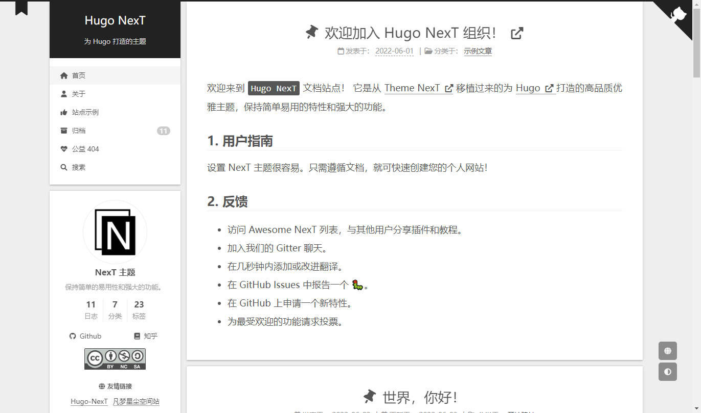

## 主题配置相关

> 基本上将config.yml挑想改的选项从头改到尾就行了

### 自定义样式

对于熟悉前端开发的用户来说，可以通过自定义文件配置，实现对站点的样式和布局进行个性化的调整。其中布局方面主要是支持左侧边栏的站点概览部分，以及站点底部2个位置，但样式的重置可以是整个站点的任意位置。

#### 打开配置参数

首先要明确在配置文件的 `params` 区域中有配置如下参数：

```yaml
customFilePath:
  sidebar: custom_sidebar.html
  footer: custom_footer.html
  style: /css/custom_style.css
```


```


**注意：** `sidebar` 和 `footer` 的文件命名不可以与它们的参数名称相同，不然会影响系统默认的布局设计，切记！！！ :smile:


```

然后在站点的根目录下创建 `layouts/partials` 2个目录，用于存放自定布局设计文件，另外在站点根目录下创建 `statics/css` 2个目录，用于存放自定义 CSS 样式文件。一切就绪后，就可以参考如下的步骤，完成自己的设计想法。

#### 侧边栏设计

在前面创建 `partials` 目录中新一个后缀名为 `html` 的文件，可以在里面书写你所想表达的设计或内容，比如引入一些第三方组件内容。示例如下：

```html
<div class="mydefined animated" itemprop="custom">
  <span>支持自定义CSS和Sidebar布局啦💄💄💄</span>
</div>
```

再把该文件的路径配置到相应的参数中，效果请查看左侧边栏底部的效果。

#### 底部设计

在前面创建 `partials` 目录中新一个后缀名为 `html` 的文件，可以在里面书写你所想表达的设计或内容，比如引入一些第三方组件内容。示例如下：

```html
<div class="custom-footer">
Website source code <a href="https://github.com/hugo-next/hugo-theme-next/tree/develop/exampleSite/layouts/partials/custom-footer.html" target="_blank">here</a>
</div>
```

再把该文件的路径配置到相应的参数中，效果请查看站点底部的效果。


#### 自定义样式

在前面创建 `css` 目录中新一个后缀名为 `css` 的文件，然后可以在里面把站点的样式进行重定义，或是增加一些自己定义的样式设计，在写文章时进行引用，示例如下：

```css
.custom-head5 {
  font-size: 1.2em;
  color: #ed6c24;
  font-weight: bold;
}
```

再把该文件的路径配置到相应的参数中，效果参考如下：

<span class="custom-head5">我是自定义的标题样式效果!!!</span>

#### 有趣的Console

在`custom_footer.html`中找个地方放置以下代码

```javascript
// 有趣的控制台
console.log(
`%c 左耳 %c nbchen.com %c`,
'background:#35495e ; padding: 3px; font-size:12px; border-radius: 3px 0 0 3px;  color: #fadfa3',
'background:#41b883 ; padding: 3px; font-size:12px; border-radius: 0 3px 3px 0;  color: #fff',
'background:transparent'
) 

let speed = 1200; 
let array = ['啊哦', '被','发','现','了', 'o(*////▽////*)q']
let index = 0
let singleIndex = 0
function loop() {
    speed -= 200; 
    if (array[index]) {
        if (index == array.length-1) {
            console.log('%co(*////▽////*)q', 'color: pink; font-weight:700;');
        } else {
            console.log(array[index]);
        }
    }
    index ++
    if (speed <= 0 || index > 20) {
        clearInterval(intervalId); // 停止循环
    } else {
        // 继续循环，并根据新的速度调整时间间隔
        intervalId = setInterval(loop, speed); 
    }
}
let intervalId = setInterval(loop, speed);
```

效果：

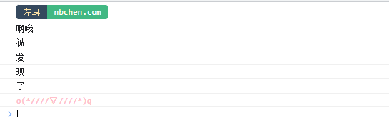

### 自定义页面

> 在已有主题中新增不受现有布局样式影响的HTML页面

```yaml
创建一个空的.md文件

content/nav/_index.md

创建一个.html文件

layouts/section/nav.html

加入主菜单

menus:
  main:
    - identifier: nav
      name: 导航
      url: /nav
      pre: heartbeat
      weight: 6
```

自定义页面有啥用？可以达到子站点的效果，本站的导航就是这个样式

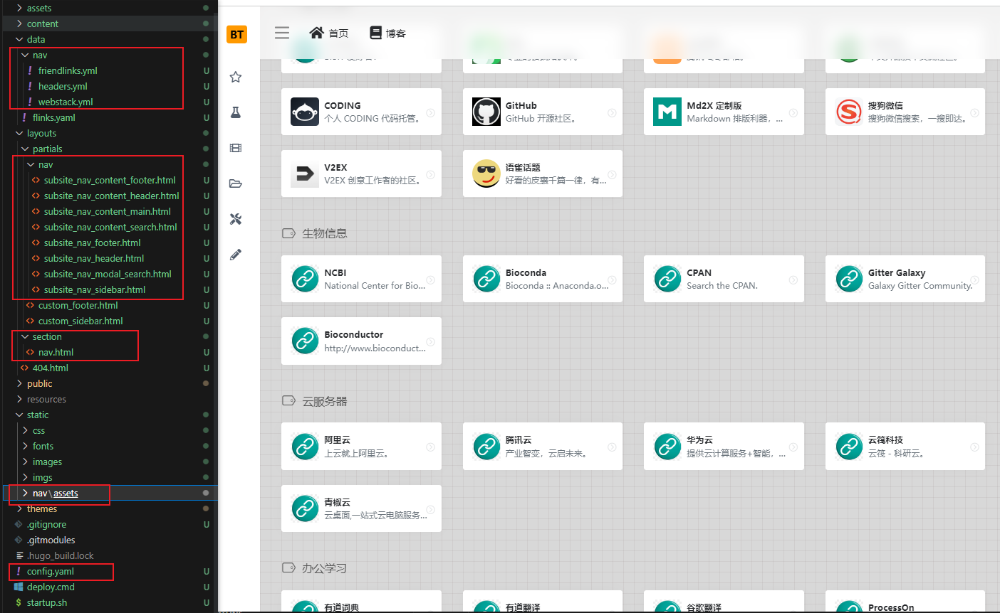

### 评论系统

#### giscus

用了好多，giscus这个比较简单，而且不用自部署，颜值也可以。喜欢。

- 开源。
- 无跟踪，无广告，永久免费。
- 无需数据库。全部数据均储存在 GitHub Discussions 中。
- 支持自定义主题！
- 支持多种语言。
- 高度可配置。
- 自动从 GitHub 拉取新评论与编辑。
- 可自建服务！

**1、创建新仓库**

新建公开仓库，并开放discussions。

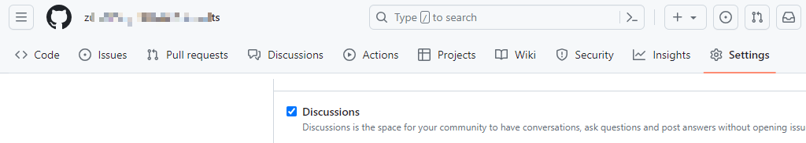

**2.安装giscus应用**

- 仓库：[https://github.com/giscus](https://github.com/giscus)

- 官网：[https://giscus.app/zh-CN](https://giscus.app/zh-CN)

- 安装：[https://github.com/apps/giscus](https://github.com/apps/giscus)


安装后在官网选择项生成配置，配置到自己的主题参数里。

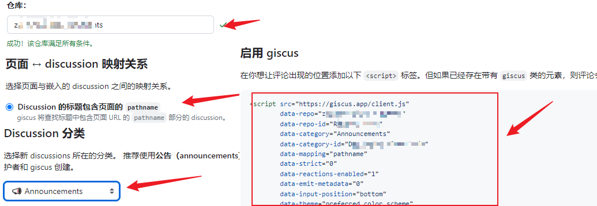

效果：

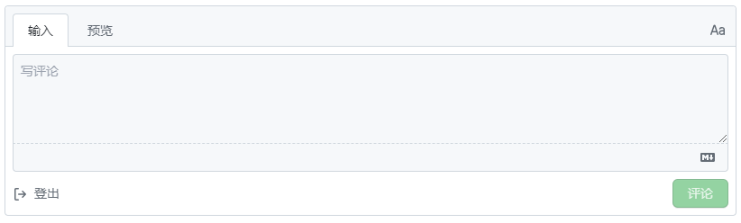

#### waline

> 这个用的人也多，功能也强大

文档：[https://waline.js.org/guide/get-started/](https://waline.js.org/guide/get-started/) （其实很详细了，这里简单记录一下实操过程）

1.在 Leancloud 国内版 ([leancloud.cn](https://leancloud.cn/))登陆并创建应用，绑定域名（腾讯云也要解析leancloud应用的地址到子域名）

2.部署waline到[vercel](https://vercel.com/new/clone?repository-url=https%3A%2F%2Fgithub.com%2Fwalinejs%2Fwaline%2Ftree%2Fmain%2Fexample),会让你在github创建仓库等等，然后配置好leancloud的参数（国内版要多配置`LEAN_SERVER`），重新部署

3.在博客中开启即可

```diff
  waline:
    placeholder: "请文明发言哟 ヾ(≧▽≦*)o"
    sofa: "快来发表你的意见吧 (≧∀≦)ゞ"
    emoji: false
    imgUploader: false
    wordLimit: 200
    requiredMeta: ['nick', 'mail']
    reaction: true
    reactionText: [ '点赞', '踩一下', '得意', '不屑', '尴尬', '睡觉']
    reactionTitle: "你认为这篇文章怎么样？"
+    serverURL: https://blog-waline-comments.vercel.app/ #<your waline server url>
```

效果：

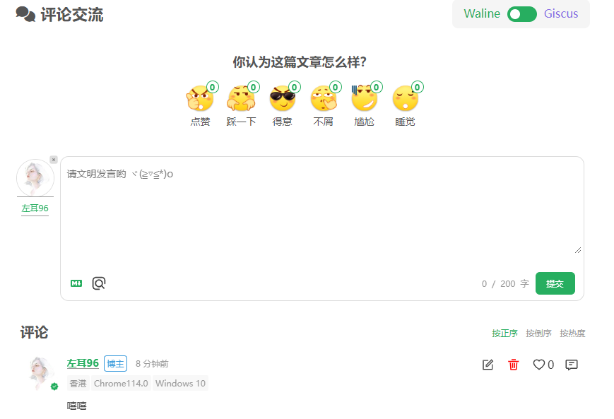

4.开启QQ邮箱评论通知

- AUTHOR_EMAIL：博主邮箱，用来区分发布的评论是否是博主本身发布的。如果是博主发布的则不进行提醒通知。
- SMTP_SERVICE：SMTP 邮件发送服务提供商，可以在[这个页面](https://github.com/nodemailer/nodemailer/blob/master/lib/well-known/services.json)查看所有支持的运营商。如果没在列表中的可以自行配置 SMTP_HOST 和 SMTP_PORT。
- SMTP_HOST：SMTP 服务器地址，如果未配置 SMTP_SERVICE 的话该项必填。
- SMTP_PORT：SMTP 服务器端口，如果未配置 SMTP_SERVICE 的话该项必填。
- SMTP_USER：SMTP 邮件发送服务的用户名，一般为登录邮箱。
- SMTP_PASS：SMTP 邮件发送服务的密码，一般为邮箱登录密码，部分邮箱（例如 163 邮箱）是单独的 SMTP 密码。
- SITE_NAME：网站名称，用于在消息中显示。
- SITE_URL：网站地址，用于在消息中显示。
- SENDER_NAME：自定义发送邮件的发件人，选填。
- SENDER_EMAIL：自定义发送邮件的发件地址，选填。
- MAIL_SUBJECT：评论回复邮件标题自定义。
- MAIL_TEMPLATE：评论回复邮件内容自定义。
- MAIL_SUBJECT_ADMIN：新评论通知邮件标题自定义。
- MAIL_TEMPLATE_ADMIN：新评论通知邮件内容自定义。

配置到vercel后台设置环境变量，然后重新部署应用。


### 图片处理

> 没用图床，本地化图片

- 对于hugo

1. `content`目录下 例如图片`content/a.png`，在文章`content/post/a.md`中引用就需要是``
2. `static`目录下 例如图片`static/images/a.png`，在文章`content/post/a.md`中引用就需要是``

- 对于typora

引用图片是绝对路径

- 解决方案

1.打开typora的`偏好设置`，选中`图像`，更改其设置

这就导致了typeroa正常显示的内容到了hugo显示不了，我们可以自定义typora的图片“根目录”

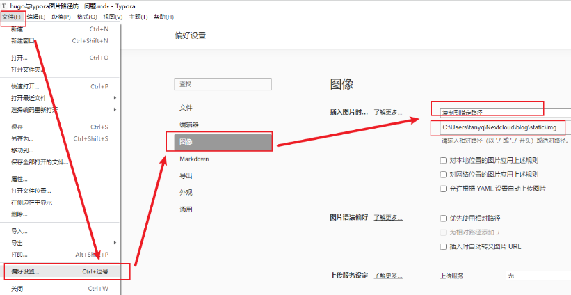

我们默认将图片放到static下的img文件夹里，把这个路径复制到如图所示位置

2.设置图像根目录

选择目录选择到img的上一级static目录（设置为根目录）

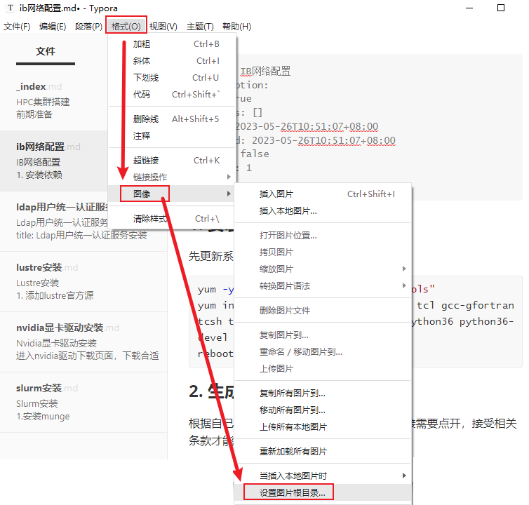

> 这样就可以兼容typora本地查看markdown文件和博客图片显示了，完美。

### 字体处理

项目地址：[https://github.com/chawyehsu/lxgw-wenkai-webfont](https://ixu.me/go/aHR0cHM6Ly9naXRodWIuY29tL2NoYXd5ZWhzdS9seGd3LXdlbmthaS13ZWJmb250)

字体效果预览地址：[https://github.com/lxgw/LxgwWenKai](https://ixu.me/go/aHR0cHM6Ly9naXRodWIuY29tL2x4Z3cvTHhnd1dlbkthaQ)

修改`static/css/custom_style.css`

```css
/* 自定义标签字体 全局配置文件未实现，后续实现后不在这里设置 */
body,
h1,
h2,
h3,
h4,
h5,
h6,
.post-body {
  font-family: EB Garamond, "Noto Serif SC", sans-serif;
}

.site-title {
  font-family: Cinzel Decorative, EB Garamond, "Noto Serif SC", sans-serif;
}

pre,
code {
  font-family: JetBrains Mono, consolas, Menlo, monospace, "Noto Serif SC";
}
```


- [Chinese Standard Web Fonts: A Guide to CSS Font Family Declarations for Web Design in Simplified Chinese](http://www.kendraschaefer.com/2012/06/chinese-standard-web-fonts-the-ultimate-guide-to-css-font-family-declarations-for-web-design-in-simplified-chinese/)

### 代码块处理

修改`static\css\custom_style.css`

```css
.highlight pre {
  border-radius: 5px;
}
```

调整了下圆角

- [x] 后续需要美化高亮，间隔，字体等

### SEO相关

#### 站点验证

- 百度站点验证
- 谷歌站点验证
- 雅虎站点验证
- 微软站点验证


## 自动部署相关

> 原理：hugo 每次生成public，我们利用git hook，将改目录自动部署到云服务器的博客目录下

- 服务器（备案）
- 域名（解析、HTTPS、SSL）

- 服务器配置

### 安装 git nginx

```
yum -y update
yum install -y git nginx

安装完后，rpm -qa | grep nginx 查看
启动nginx：systemctl start nginx
加入开机启动：systemctl enable nginx
查看nginx的状态：systemctl status nginx
```

### 创建服务器博客目录

```
mkdir -p /data/www/blog
chmod -R 755 /data/www/blog
```

### 配置nginx

将腾讯云SSL证书控制台下载的文件防止到`/etc/nginx`目录下

```nginx
vim /etc/nginx/nginx.conf
# 如果是root用户启动,则设置
# user root
server {
   listen 443 ssl;
    #填写绑定证书的域名
    server_name 域名(xxx.com);
    #证书文件名称
    ssl_certificate 域名(xxx.com)_bundle.crt;
    #私钥文件名称
    ssl_certificate_key 域名(xxx.com).key;
    ssl_session_timeout 5m;
    ssl_ciphers ECDHE-RSA-AES128-GCM-SHA256:ECDHE:ECDH:AES:HIGH:!NULL:!aNULL:!MD5:!ADH:!RC4;
    ssl_protocols TLSv1.2 TLSv1.3;
    ssl_prefer_server_ciphers on;
    location / {
        #网站主页路径。此路径仅供参考，具体请您按照实际目录操作。 
        #例如，您的网站运行目录在/etc/www下，则填写/etc/www。
        root /data/www/blog;
        index index.html index.htm;
    }
}
server {
    listen 80;
    #填写绑定证书的域名
    server_name 域名(xxx.com);
    #把http的域名请求转成https
    return 301 https://$host$request_uri;
}
```

### 测试index.html

```html
vim /data/www/blog/index.html

<!DOCTYPE html>
<html>
  <head>
    <title></title>
    <meta charset="UTF-8">
  </head>
  <body>
    <p>Nginx running</p>
  </body>
</html>
```

### 配置git

> 这里为什么叫public，这样拉取代码时，就直接将`.git`拉去到本地的`public`目录

```shell
mkdir /data/git_repo
chmod -R 755 /data/git_repo
> 初始化裸库
cd /data/git_repo
git init --bare public.git
> 创建 Git 钩子(hook)：用于指定 Git 的源代码 和 Git 配置文件
vim /data/git_repo/public.git/hooks/post-receive

#!/bin/bash
# 指定分支：
git --work-tree=/data/www/blog --git-dir=/data/git_repo/public.git checkout main -f

> 保存并退出后, 给该文件添加可执行权限
chmod +x /data/git_repo/public.git/hooks/post-receive
```

### windows本地配置

```shell
git --version
node -v
npm -v

npm install hexo-deployer-git

# hexo配置文件配置
url: http://www.域名(xxx.com) //个人域名
......
# 一个是服务器
deploy:
  type: git
  repo: root@xx.xx.xx.xx:/data/git_repo/blog.git
  branch: master
  
# 一键部署
hexo clean && hexo g && hexo d
```

### 免密登录

```shell
cd ~

mkdir .ssh

cd .ssh

vi authorized_keys

// 这个时候把公钥，也就是windows下的.ssh/id_rsa.pub文件内的文本内容复制粘贴到authorized_keys文件中

chmod 600 ~/.ssh/authorized_keys

chmod 700 ~/.ssh 
```

> 后续流程：`编写文章`->`hugo生成`->`git Extensions提交代码`->服务器出发git hook，自动部署

### 后续优化

- [x] 计划：hugo 生成和提交代码这还要点好几下，后续继续优化，思路大概是写个cmd，自动执行`hugo`和提交代码。

在`blog`根目录创建`deploy.cmd`脚步

```shell
@echo off
echo 开始提交到git....
@echo on
 
D:
cd D:\blog_hugo\blog\

@echo off
echo 开始生成文件到public....
@echo on
hugo

@echo off
echo 生成文件成功....
@echo on

cd D:\blog_hugo\blog\public
 
git add .
git commit -m 'update'
git push
 
@echo off
echo 推送到git成功
pause
```


## 源码修改备忘

> 记录一些样式外面不好调整，要修改源码的地方

### 置顶图标样式

删除`themes\hugo-theme-next\layouts\partials\post\header.html`默认置顶样式

```diff
-<i class="fa fa-thumbtack"></i>
```

添加入口：`themes\hugo-theme-next\layouts\partials\post\header.html`

```diff
{{ $isComment := and (.Scratch.Get "isComment") .Site.Params.postMeta.comments.enable }}
<div class="post-meta-container">
  <div class="post-meta-items">
+    {{ partial "post/header_meta/zhiding.html" . }}
    {{ partial "post/header_meta/created_date.html" . }}
```

文章元信息设置置顶

```properties
weight: 1
```

在header_meta下新建`zhiding.html`

> 判断，如果文章有置顶，则显示

```html
{{- if .Params.weight -}}
<span class="post-meta-item">
    <i class="fa fa-thumb-tack"></i>
    <font color=7D26CD>置顶</font>
    <span class="post-meta-divider">|</span>
</span>
{{ end }}
```

效果：

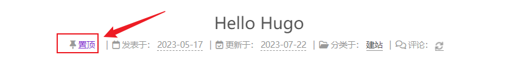

> 基本上都优化的差不多了，就可以开始使用了

### 修复最近修改时间

修改`themes\hugo-theme-next\layouts\partials\_funs\cal_siteinfo.html`

```diff
{{ range first 1 $pages }}
- {{ $scratch.Set "first" (time.Format .Site.Params.timeFormat .Date ) }}
+ {{ $scratch.Set "first" (time.Format .Site.Params.timeFormat .Lastmod ) }}
{{ end }}
{{ range last 1 $pages }}
  {{ $scratch.Set "last" (time.Format .Site.Params.timeFormat .Date) }}
{{ end }}
```

说明：这里是取文件的创建时间，也就是你用hugo new命令的时间，此时也会生成修改时间，但是由于后续修改文件需要你手动改修改时间，因此，这里的优化其实不够。

### 底部站点信息美化

关闭侧边站点信息

```yaml
  siteState: 
    views:  
      enable: false
```

[可选操作]删除`themes\hugo-theme-next\layouts\partials\sidebar.html`

```diff
-{{ if .Site.Params.siteState.views.enable }}
-    {{ partialCached "sidebar/siteinfo.html" . }}
-{{ end }}
```

在自定义底部页面`layouts\partials\custom_footer.html`添加代码

```javascript
<!-- 网站信息 -->
{{ $scratch := partialCached "_funs/cal_siteinfo.html" . }}
<div class="custom-footer">
    <!-- 这里也可以取到变量的，比如： -->
    <!-- {{ T "SiteInfoItems.title" }} -->
    <a href="https://nbchen.com">
        </img>
    </a> 
    <a href="https://nbchen.com">
        </img>
    </a> 
    <a href="https://nbchen.com">
        <span id="runDays"></span>
    </a>
    <a href="https://nbchen.com">
        </img>
    </a>
    <a href="https://beian.miit.gov.cn/" target="_blank">
        </img>
    </a>
    <a href="http://www.beian.gov.cn/portal/registerSystemInfo?recordcode=35030502000216" target="_blank">
        </img>
    </a>
    <a href="https://www.foreverblog.cn/go.html" target="_blank">
        </img>
    </a>

    <a href="https://nbchen.com">
        </img>
    </a>
    <span id="last-push-date" data-lastpushdate="{{ $scratch.Get "first" }}" style="display: none;"></span>
    <span id="update_show"></span>

    <span id="readTimes" data-times="{{ $scratch.Get "totalTimes" }}" style="display: none;"></span>
    <span id="readtime_show"></span>

    <span id="busuanzi_value_site_uv" style="display: none;"></span>
    <span id="uv_show"></span>
    <span id="busuanzi_value_site_pv" style="display: none;"></span>
    <span id="pv_show"></span>
</div>

<script>
(function () {
    // 定义网站运行天数
    // 定义网站开通日期
    var websiteLaunchDate = new Date("2023-05-17");
    // 计算天数差
    var today = new Date();
    var differenceInTime = today.getTime() - websiteLaunchDate.getTime();
    var differenceInDays = differenceInTime / (1000 * 3600 * 24);
    // 输出天数差
    var runDays = Math.floor(differenceInDays);
    // 将运行天数赋值给指定 id 的元素 
    document.getElementById("runDays").innerHTML = "</img>";
    // 定义网站运行天数
    const readTimes = document.getElementById('readTimes');
    const readtime_show = document.getElementById('readtime_show');
    if (readTimes) {
    const times = readTimes.getAttribute('data-times');

    const hour = 60;
    const day = hour * 24;

    const daysCount = parseInt(times / day);
    const hoursCount = parseInt(times / hour);

    let timesLabel;
    if (daysCount >= 1) {
        timesLabel = daysCount + "天" + parseInt((times - daysCount * day) / hour) + "小时";
    } else if (hoursCount >= 1) {
        timesLabel = hoursCount + "小时" + (times - hoursCount * hour) + "分钟";
    } else {
        timesLabel = times + "分钟";
    }

    readtime_show.innerHTML = "</img>";
    }

    // 不蒜子访问量统计
    // pv uv 处理
    setTimeout(function () {
        // 更新时间处理 
        const lastPushDate = document.getElementById('last-push-date');
        const update_show = document.getElementById('update_show');
        if (lastPushDate) {
            const pushDateVal = NexT.utils.diffDate(lastPushDate.getAttribute('data-lastPushDate'), 1);
            update_show.innerHTML = "</img>";
        }

        // uv处理
        const bszUV = document.getElementById("busuanzi_value_site_uv")
        const bszUV2 = document.getElementById("uv_show")
        if (bszUV) {
            const uv_val = NexT.utils.numberFormat(bszUV.innerText);
            bszUV2.innerHTML = "</img>";
        }
        // pv处理
        const bszPV = document.getElementById("busuanzi_value_site_pv")
        const bszPV2 = document.getElementById("pv_show")
        if (bszPV) {
            const pv_val = NexT.utils.numberFormat(bszPV.innerText);
            bszPV2.innerHTML = "</img>";
        }
    }, 800);


    // 有趣的控制台
    console.log(
    `%c 左耳 %c nbchen.com %c`,
    'background:#35495e ; padding: 3px; font-size:12px; border-radius: 3px 0 0 3px;  color: #fadfa3',
    'background:#41b883 ; padding: 3px; font-size:12px; border-radius: 0 3px 3px 0;  color: #fff',
    'background:transparent'
    ) 

 
    let speed = 1200; 
    let array = ['啊哦', '被','发','现','了', 'o(*////▽////*)q']
    let index = 0
    let singleIndex = 0
    function loop() {
        speed -= 200; 
        if (array[index]) {
            if (index == array.length-1) {
                console.log('%co(*////▽////*)q', 'color: pink; font-weight:700;');
            } else {
                console.log(array[index]);
            }
        }
        index ++
        if (speed <= 0 || index > 20) {
            clearInterval(intervalId); // 停止循环
        } else {
            // 继续循环，并根据新的速度调整时间间隔
            intervalId = setInterval(loop, speed); 
        }
    }
    let intervalId = setInterval(loop, speed);

})();
</script>
```

特别说明：

shields很强大，除了最基础的用法，中文可以用[URL编码转换工具](https://tool.oschina.net/encode?type=4)转换后拼接。

还可以跟上logo，style等，具体用法可以参考上面的ICP和公案备案

效果：

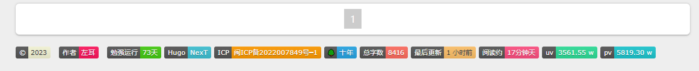

### 点击头像返回主页

每次看文章滑倒下面后，头像这个卡片会黏住，就必须滚动到最上面。不是很方便，所以有了这个优化。

修改`themes\hugo-theme-next\layouts\partials\sidebar\overview.html`

```diff
+    <a href="{{ "/" }}">
      
+    </a>
```


## 食用篇：Emoji表情支持

> 在markdown里写emoji，文章显得更有趣生动,[更多表情](https://getemoji.com/)

使用方法：全局设置 `enableEmoji` 为 `true`，粘贴下面的代码，既可以看到图标了。

以下**符号清单**是 记录一些比较常用的emoji表情，后续慢慢补充

| 图标                           | 代码                           |
| ------------------------------ | ------------------------------ |
| :heart_eyes:                   | `heart_eyes`                   |
| :grin:                         | `grin`                         |
| :sweat_smile:                  | `sweat_smile`                  |
| :joy:                          | `joy`                          |
| :rofl:                         | `rofl`                         |
| :smile:                        | `smile`                        |
| :yum:                          | `yum`                          |
| :kissing_heart:                | `kissing_heart`                |
| :relaxed:                      | `relaxed`                      |
| :kissing_smiling_eyes:         | `kissing_smiling_eyes`         |
| :upside_down_face:             | `upside_down_face`             |
| :wink:                         | `wink`                         |
| :laughing:                     | `laughing`                     |
| :stuck_out_tongue_winking_eye: | `stuck_out_tongue_winking_eye` |

## 食用篇：MarkDown语法

> 为了减少篇幅，这里也不过多展开，只记录容易遗忘的技巧，更多基础用法见：[https://markdown.com.cn/](https://markdown.com.cn/)


### 段落格式

根据[ W3C ](https://www.w3.org/)定义的[ HTML5 规范](https://www.w3.org/TR/html5/dom.html#elements)，**HTML 文档由元素和文本组成**。每个元素的组成都由一个[开始标记](https://www.w3.org/TR/html5/syntax.html#syntax-start-tags)表示，例如： `<body>` ，和[结束标记](https://www.w3.org/TR/html5/syntax.html#syntax-end-tags)表示，例如： `</body>` 。（*某些开始标记和结束标记在某些情况下可以省略，并由其他标记暗示。*）
元素可以具有属性，这些属性控制元素的工作方式。例如：超链接是使用 `a` 元素及其 `href` 属性形成的。

- Markdown 语法

```markdown


举例：

```

- HTML IMG 标签

```html


举例：

```

- SVG 格式

```html
<svg>xxxxxx</svg>

举例：
<svg class="canon" xxxxx></svg>
```

### 块引用

`blockquote` 元素表示从另一个源引用的内容，可以选择引用必须在 `footer` 或 `cite` 元素中，也可以选择使用注释和缩写等行内更改。

```
> 引用文本
> 这一行也是同样的引用
> 同样你也在 `blockquote` 中使用 **Markdown** 语法书写
```

带有引文的 `Blockquote` 元素效果。

```html
<blockquote>
  <p>我的目标不是赚大钱,是为了制造好的电脑。当我意识到我可以永远当工程师时，我才创办了这家公司。</p>
  <footer>— <cite>史蒂夫·沃兹尼亚克</cite></footer>
</blockquote>
```

根据 Mozilla 的网站记录，<q cite="https://www.mozilla.org/en-US/about/history/details/">Firefox 1.0 于 2004 年发布，并取得了巨大成功。</q>

### Code

用3个反引号包裹起来的就是代码块

````html
```html
<!DOCTYPE html>
<html lang="en">
<head>
  <meta charset="UTF-8">
  <title>Example HTML5 Document</title>
</head>
<body>
  <p>Test</p>
</body>
</html>
```
````

还可以用段代码高亮包裹html形式表达

```


<!DOCTYPE html>
<html lang="en">
<head>
  <meta charset="UTF-8">
  <title>Example HTML5 Document</title>
</head>
<body>
  <p>Test</p>
</body>
</html>



```


### 其它元素:abbr、sub、sup、kbd等

- 缩写

```html
<abbr title="Graphics Interchange Format">GIF</abbr> 是位图图像格式。
```

- 下标

```html
H<sub>2</sub>O
C<sub>6</sub>H<sub>12</sub>O<sub>6</sub>
```

- 上标

```html
X<sup>n</sup> + Y<sup>n</sup> = Z<sup>n</sup>
```

- 键盘

```html
按<kbd>X</kbd>获胜。或按<kbd><kbd>CTRL</kbd>+<kbd>ALT</kbd>+<kbd>F</kbd></kbd>显示 FPS 计数器。
```

- 标记

```html
<mark>比特作为信息论中的信息单位，也被称为 shannon </mark>，以信息论领域的创始人 Claude shannon 的名字命名。
```

## 食用篇：Chroma语法高亮

Hugo 通过 Chroma 提供非常快速的语法高亮显示，现 Hugo 中使用 Chroma 作为代码块高亮支持，它内置在 Go 语言当中，速度是真的非常、非常快，而且最为重要的是它也兼容之前我们使用的 Pygments 方式。

以下通过 Hugo 内置短代码 `highlight` 和 `Markdown` 代码块方式分别验证不同语言的代码块渲染效果并能正确高亮显示，有关优化语法突出显示的更多信息，请参阅 [Hugo 文档](https://gohugo.io/getting-started/configuration-markup#highlight)。

### Git 对比

> 值得一提的是这个`diff`挺好用，突出增删行

```diff
-removed line
+new line
```

> 支持语言(go,python等)、文件(make、markdown等)、数据内容(json、xml、SQL等)的高亮

## 食用篇：公式和流程图

### Mermaid流程图

> 我一般不会去用这种代码写，直接画个图截图就行了。所以这里只是浅提一下，更多用法看官方文档。

支持 `Mermaid` 实现以纯文本的方式绘制流程图、序列图、甘特图、状态图、关系图行等等，随着 `Mermaid` 也在逐步发展，后续还会有各种各样的图被引入进来，更多的类型及使用方式可关注其官方网站：[https://mermaid-js.github.io/](https://mermaid-js.github.io/)

- 在文章头部配置 `mermaid: true`
- 使用`短代码`书写各种类型的图，自带2个参数： align（对齐） 和 bc（背景色），可参考如下使用示例

```shell

graph TD;
    A-->B;
    A-->C;
    B-->D;
    C-->D;

```


```

graph TD;
    A-->B;
    A-->C;
    B-->D;
    C-->D;

```


### Math数学公式

> 很少写数学公式。所以这里也只是浅提一下，更多用法看[文档](https://en.wikibooks.org/wiki/LaTeX/Mathematics)。

支持 `mathjax` 和 `katex` 两种不的方案支持数学公式的渲染，可根据自已的需求进行选择。

- 可以全局启用数据公式渲染，请在项目配置参数 `math: katex` 或 `math: mathjax`
- 或是将参数`math: katex` 或`math: mathjax`配置到需要显示数学公式的页面头部（减少不必要的加载消耗）

```
$$
\begin{aligned} {x} + {y} = 1  \end{aligned}
$$
```


$$
\begin{aligned} {x} + {y} = 1  \end{aligned}
$$

 

## 食用篇：ShortCode短代码

虽然 `Markdown` 语法已经非常丰富能够满足我们写文章的绝大部分需求，但是为更好的对文章内容进行更友好的排版，为引设计一套自定义的短语，便于在使用时能够快速引用。

### 块引用

在引用一些经典名言名句时，可以采用此短语，语法参考如下：

```markdown

  ### block quote
  写下你想表达的话语！

```

实际效果：

```


希望是无所谓有，无所谓无的，这正如地上的路。


其实地上本没有路，走的人多了，也便成了路。

**鲁迅**


```


### 信息块

支持 `default`，`info`，`success`，`warning`，`danger` 等五种不同效果的展示，语法参考如下：

```markdown

  书写表达的信息
  支持 Markdown 语法

```


```
实际应用：



  #### 默认标题不带图标

  **欢迎** 访问 [左耳的博客](https://nbchen.com)




  #### 默认标题

  **欢迎** 访问 [左耳的博客](https://nbchen.com)




  #### 信息标题

  **欢迎** 访问 [左耳的博客](https://nbchen.com)




  #### 成功标题

  **欢迎** 访问 [左耳的博客](https://nbchen.com)




  #### 警告标题

  **欢迎** 访问 [左耳的博客](https://nbchen.com)




  #### 危险标题

  **欢迎** 访问 [左耳的博客](https://nbchen.com)

```

