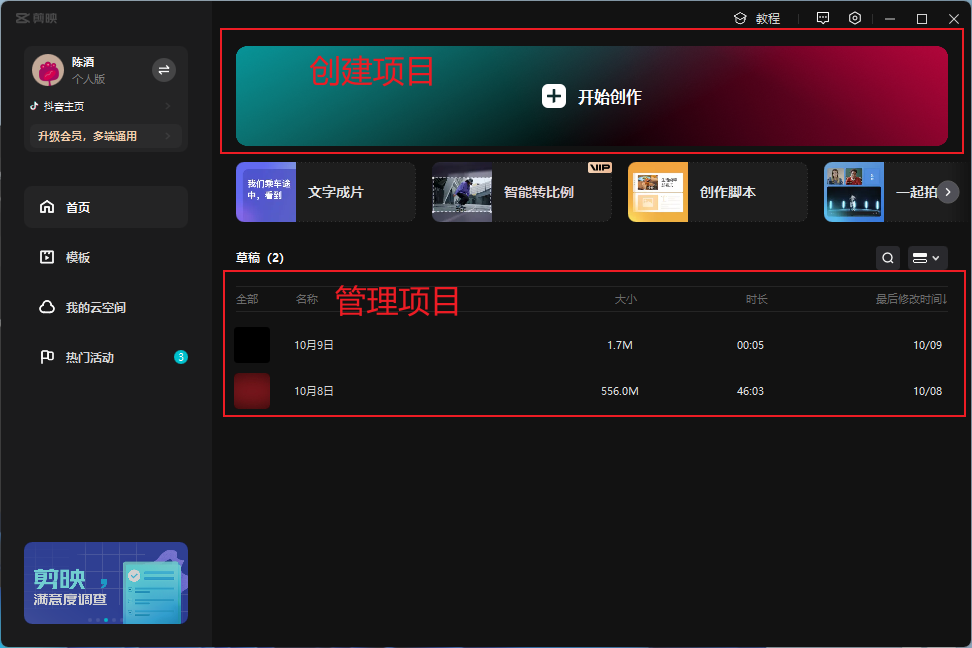

# 剪映

## 剪映前言

### 介绍

是一款视频剪辑软件

### 视频剪辑流程

1.素材的采集和整理

2.剪辑素材，粗剪、精剪

3.输出和包装，注意格式、编码、像素设置

### 专业术语

时长：视频时间长度，基本单位：秒。常见的格式：00:00:00:00(时:分:秒:帧)

帧：视频的基础单位，视频其实也是又一帧一帧来组成，它是比秒还要小的一个单位，一帧可以理解为一张图片。

帧速率：每秒播放帧的数量，单位是帧/秒(FPS)，帧速率越高，画面越流畅

关键帧：指素材特定帧，通过设置属性，控制动画的流，回放还有其他特性

帧尺寸：帧（视频画面）宽和高，宽和高一般用像素数量表示，帧尺寸越大，视频画面越大，像素数越多

像素比：每个像素的宽度和高度之比，又称长宽比

画面尺寸：视频画面实际显示的宽和高

画面比例：视频画面实际显示的宽和高的比值，通常16：9、4：3，在拍摄的时候就需要注意的，不同画面比例给人的感觉氛围也不一样。

画面深度：指颜色位数，单位bit，通常RGB视频种，8bit是常见的画面深度，支持256种颜色；12位的支持4096种颜色。

声道：分为单声道、立体声、双声道和多声道

声音深度：画面深度相似，分为16bit、24bit

缓存：计算机内存种用来存储静止图像和数字影片的区域，它是为影片实时回放准备的

### 视频格式

avi: 微软公司退出的多媒体容器格式，允许声音视频同步回放哪个，类似DVD视频格式

flv：全称flash video，文件极小，加载速度极快，适合在网上传播

mov: 苹果公司开发的一种视频格式，具有高压缩比率和高视频清晰度，占用存储空间小，无论是macos还是windows都可以运行。

mpeg: 1988年成立动态图像专家组，制定满足各种应用需求的音频视频压缩，常见格式：mp4等

wmv: 微软推出一种采用独立码并且支持在网上实时观看视频的文件压缩格式

rmvb：能够保证静止画面质量的前提下，大幅提高了运动图像的画面质量，从而在图像质量和文件大小之间达到平衡。

### 音频格式

wav: 微软，和cd格式文件一样音色出众，无压缩，文件大

mp3：对高频信号加大压缩比(甚至忽略信号)，对低频信号使用小压缩比，尽量保证信号不失真，文件小，音质好的特点。

midi: 乐器数字接口，midi并不是一段录制好的声音，而是记录声音的信息

wma：MP3格式齐名的一种新的音频格式，wma7版本之后的wma格式支持证书加密，需要获得许可证

aac: 通过结合其他的功来提升编码效率，可以在比mp3格式文件小30%的前提下，提供更好的音质。

### 图片格式

bmp: windows标准图片文件格式，不采用压缩技术，占用磁盘空间较大。

tiff: 无损压缩算法的标签图像文件格式，图像质量高，建议用于打印、印刷输出的图像

jpeg: 有损压缩，压缩比大，文件较小，经常用于网络传输

gif: 可以同时存储若干静止图像进而形成连续的动画，可指定透明区域，文件较小，适合网络传输

psd: 在Photoshop的专用格式，可以保存图像的图层信息、通道蒙版信息，便于后续的修改和特效制作。

pdf: (portable document format)又称可移植/携带文件格式，具备跨平台特性，能有效 控制专业的制版和印刷生产信息，可以作为印前领域通用的文件格式。

### 下载安装

官网： https://www.capcut.cn/

推荐配置：https://www.capcut.cn/readme

### 首页界面解析

### 菜单命令

### 工具栏、列表栏、素材库面板

### 播放器参数调节面板

