# 驾考

### 一、驾驶证基础考点

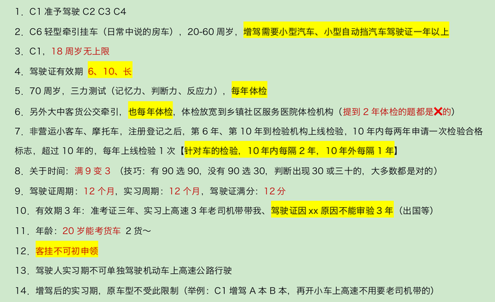

### 二、新政策学分减分满分

**（一）满分教育日期问题**

1、满12分教育日期（参加科一考试）

| 车型 | 现场（天） | 网络（天） | 自主（天） | 共计（天） |
| ---- | ---------- | ---------- | ---------- | ---------- |
| 小车 | **2**      | 3          | 2          | 7          |
| 大车 | 5          | 5          | 20         | 30         |

每增加12分，小车加7天（最多60），大车加30（最多120），但现场和网络天数不变

2、满24-36分，参加科一、科三考试

3、满36分，参加科一、科二、科三考试

4、一周期内没有满12分，则下一周期从头计算

> 科目一法律法规、科目二场地、科目三道路驾驶技能

**（二）不可以通过接受教育来扣减记分的**

1、实习期内，头一年领证的

2、有2次以上参加满分教育记录的，即扣满24分及以上的

3、酒驾被处罚3个记分周期内

**（三）学法减分时间**

| 车型              | 学习时间 | 是否要考试 | 扣减分数 | 技巧      |
| ----------------- | -------- | ---------- | -------- | --------- |
| 网络学习（3天内） | 30分钟   | 是         | 1        | 网络 30 1 |
| 现场活动          | 1小时    | 是         | 2        | 现场 1 2  |
| 公益活动          | 1小时    | 否         | 1        | 公益 1 1  |

注：每个周期，最多减6分

还有很重要的两个知识点口诀，那就是：

**车（行驶证）登记，证随意**

**假1 骗3 撤3 毒3 醉5 逃罪终生**

### 三、安全常识

1、ABS车轮防抱死 => 找紧急制动

2、安全带找减轻

3、安全头枕保护颈部，放在头后

4、气囊的双重保护作用就是与安全带一起

### 四、新政英文字母题

> 知乎的表格列的长度无法自行调整……我还是放图片叭

关键单词：自动Auto、预警Warn、电子Electronic、交通Traffic、盲Blind、辅助Assist、巡航CC

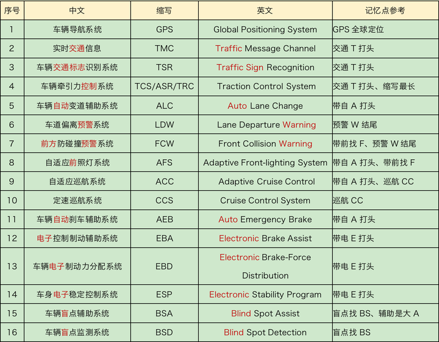

### 五、驾驶中的❌行为

**这一部分大都是常识，主要需要留意以下三点：**

1、熄火/空档/惯性滑行，**只要滑行就**❌

2、连续开4小时未休息或者休息时间少于20分钟（420法则）

3、提前/检查都是对的，电动车这块有普通灭火器就❌

### 六、拘留扣留

**重点需要记住的技巧：**

1、扣留技巧，只有两种情况错误，剩下的都对，错误情况：扣留行驶证❌、没带身份证❌

2、拘留技巧，跟钱在一起的拘留就是对的，没有钱的拘留就是❌的

### 七、判刑项目

**关于判刑有以下三点：**

1、出现重大事故致人重伤、死亡，3年以下或者拘役

2、出现重大事故致人重伤、死亡且逃逸，3年以上7年以下（申请人在机动车驾驶人考试过程中组织作弊的，情节严重构成犯罪）

3、出现重大事故因逃逸致人死亡的，7年以上

**记忆技巧：**

1、**有拘役优先选拘役**，有‘拘役’就对，遇到‘有期徒刑’结尾的判❌

2、‘且 /（组织作弊） ’找3-7，‘因’找7以上

### 八、事故处理

1．有争议、有人员伤亡、有喝酒司机、有违法行为都是立刻报警（判断有报警✅）

2．无争议、无人员伤亡 （轻微、刮擦等）撤离现场自行协商，不要影响交通，不要死等警察或者保险公司，警察来了责令你撤离，交通堵塞啦还得罚款200元

### 九、救援

这一部分的应急知识，个人感觉非常有用，需要牢记：

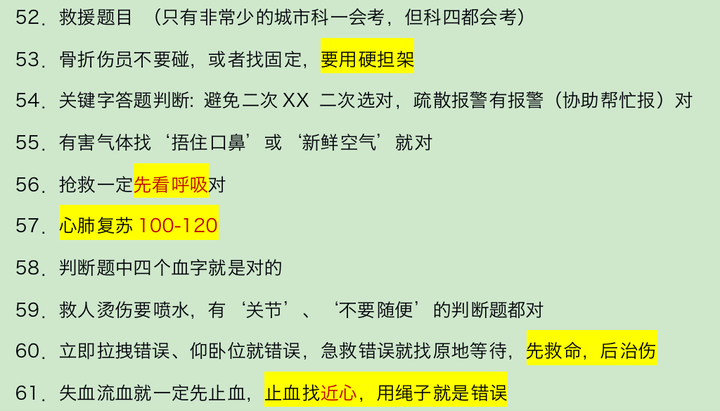

### 十、其他

科目二+科目三=预约次数5

出现"科目二/科目三"字眼，题目中没有分数的判断题都是正确的，有分数的就是错误的。

如果参加不了考试，提前一日取消，要不然直接算考试不合格，

行为前面，找违法 => 违法行为

责任前面找刑事/全部 => 刑事责任/全部责任

### 通行原则

1．只要有‘加速XX’都是❌的，因为都是为了安全，减速慢行才是王道

2．通行的时候，只要让人家就✅啦，吃亏是福，反正各种礼让各种让

3．减速慢行、减速靠右、减速或停车、停车避让就直接选✅

4．只要提到不用减速慢行，无需减速，不必减速都是❌的

5．==‘不得’两个字在判断题中绝大多数都是✅的==

6．减少并行时间，就是对的，因为并行很危险

7．主动、依次、顺序、有序、礼让、注意避让、确认安全、减少并行，都是✅的

8．持续/连续/长按喇叭，都是❌的，催促、逼迫、迫使、抢、占、保持原速的意思都是❌的

9．‘立即XX’‘立刻XX’几乎都是❌的

10．顺序通行三大原则：**转弯让直行、右转弯让左转弯、同样直行让右侧先行**

11．不得超车情况有【***\*超车只能从左侧\****】：

- 前车正在左转弯、掉头、超车的；与对面来车有会车可能的
- 前车为执行紧急任务的警车、消防车、救护车、工程救险车的
- 特殊道路（行经铁路道口、交叉路口、窄桥、弯道、陡坡、人行横道、市区交通流量大的路段等没有超车条件的。而且不能倒车停车）

12．只有提到虚线才可以越线、掉头、超车等，==实线坚决不可以过线、不可以压线（指向的箭头也不能压线）==。

13．铁路道口、漫水路、漫水桥三原则：（1停2看3通过）

- 停下来
- 看观察确认安全
- 低速通过进入铁路道口后，==不能变换档位==（因为你已经低挡了）

14．出现故障有四步

- 开启危险报警闪光灯（开双闪）
- 移到不妨碍交通的地方，如果无法移动就继续第三步
- 车后方放置警告标志（普通道路50-100米之间，高速==150米以外==）
- 人得下车去安全的地带（右侧路肩），报警等待救援

15．超车只能==从左侧超车== （看到题目或图片说从右侧两侧超车直接❌）

16．超车时，如果无法保证与被超车辆的安全间距，应主动==放弃超车、停止超车==（遇到这两组词优先选，判断为✅）

17．道路没有划分机动车道、非机动车道和人行道的，在道路中间通行，给行人、非机动车在两侧留有充足的空间

18．变更车道的顺序：

- 打开转向灯
- 观察确认安全
- 平稳变（直接驶入，转的就❌），完成后关闭转向灯即可

19．关于停车距离考点: （==口5站3==）

- 交叉路口、铁路道口、急弯路、窄路、桥梁、陡坡、隧道==50米以内==的路段，不得停车
- 公共汽车站、急救站、加油站、消防队（站）门前以及距离上述地点==30米以内==不得停车

**技巧：只要没提站就找50，有站就找30**

20．驾驶机动车遇有前方交叉路口交通阻塞，或者看到图中堵车我们只能==依次排队在路口外==，坚决不能进入路口。（**有依次、有顺序直接选，没有选路口外**）

21．狭窄山路会车，靠山体的一方要让不靠山体的一方先行、环岛外的车让环岛内的车先行、有障碍的一方让无障碍的一方先行、辅路车让主路车先行。 （主路车流大速度快）

- 主打一个安全，==不靠山体更危险，所以先行==
- 主打交通通畅，==环岛内先行、无障碍先行，更不会堵塞交通==

22．看到随意通行，‘**随意**’二字的或者看到说‘不用减速’的题目都直接判断❌就可以 （**只有行人具有随意性的特点是✅的**）

23．车前方校车问题：

- 两车道，前方有校车，停下来等待
- 三车道，**提前变道最左侧超越**

24．没事不能去紧急停车道（应急车道）去行驶除非警察安排或者急救别人，剩下的没事去走（比如堵车去那边超越）绝对不行

### 速度有关

1．==速度不得超过30公里/小时的==：【记不住直接看下一条】

- 机动车行驶中在冰雪、泥泞的道路上行驶时
- 遇到进出非机动车道，通过铁路道口、急弯路、窄路、窄桥时
- 遇到掉头、转弯、下陡坡时
- 遇到雾、雨、雪、沙尘、冰雹，能见度在50米以内时

2．科目一里（==只要不是普通道路，特殊道路都是30公里/小时==）

**技巧1: 关于判断题中出现XX公里/小时，公里前面数字不是30或者100 就是❌的**

**技巧2：选项中出现问最高速度不得超过多少，没有配图的，就选30**

3．公里速度指示牌：**红高蓝低**

4．高速公路能见度、速度、距离的口诀：==2 6 1、1 4 5、5 2离==

- 驾驶机动车在高速公路上行驶，遇低能见度气象条件时，能见度在200米以下，车速不得超过每小时60公里，与同车道前车至少保持100米以上的距离
- 驾驶机动车在高速公路上行驶，遇低能见度气象条件时，能见度在100米以下，车速不得超过每小时40公里，与同车道前车至少保持50米以上的距离
- 驾驶机动车在高速公路上行驶，遇低能见度气象条件时度在50米以下，车速不得超过每小时20公里，尽快驶离高速

5．**高速速度：红高蓝低黄建议【马路上立的牌子】**

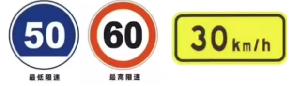

6．路面速度：**黄高白低【马路上印的油漆】**

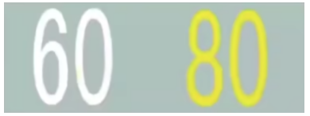

7．安全距离：速度高于100找距离100以上的，低于100找距离50以上的

8．高速上车道速度限制小口诀：

- 双车道：10-12、6-10
- 三车道：11-12、9-11、6-9

9．注意，==图里有标志的，要按标志速度来判断==，图中最高标志是90，那最高速度就是90

10．城市公路的最高限速：

- 没有中心线：城3公4
- 有中心线：城5公7

11．**速度考点总结：**

- 特殊道路限速一般 30公里/小时
- 城市公路 技巧 有无中心线，无3 4、有5 7
- 高速公路能见度 261 145 52离
- 高速公路2 3条车道的限速要求
- 路面标记限速 红高蓝底黄建议

### 特殊天气

1．特殊天气的灯光，只有雾天雾灯，没有特殊的灯光

2．关键字答题：

1) 雨天找滑字
2) 冰雪找制动问题，制动变长【**制动就是刹车**】
3) 雪天找车辙（车印子），泥泞找车轮
4) 雾天、夜晚都找能见度问题，并且==回应喇叭✅==
5) 水淹路面找观察路面问题
6) 车辆涉水找间断，没有‘间断轻踏’就找‘轻踏’

3．看到题目中有‘困难/无法’两个字找‘停车’【比如行车困难】

4．特殊情况和特殊天气，都应该==发动机制动减速==，看到‘紧急制动减速’❌

5．有车辙就对，特殊路面，选择坚实的路面行驶缓慢通过对、大安全距离对

### 交警手势

1．手心高举，**停车等待**【拓展：此处是左手】

2．双臂伸直，直行

3．捂住胸口/看到手回弯的，**变道**

4．摸到伞杆，待转【==哪个手摸往哪边转==】

5．**两手**一高一低，转弯【哪个手在下，往哪边转】【==胳膊有徽章的是左手==】

6．**单手**一高一低，减速慢行【拓展：此处是右手】

### 灯光

1．近光灯：有车，有人，都需要，照明条件良好、**隧道**

2．远光灯：**照明条件不好**，可以开（技巧: 判断题目开远光灯、使用远光灯都是❌）

3．交替使用远近光灯：

1) 超车（用于提醒前车）
2) 夜间特殊道路（举例：交叉路口，急转弯，人行横道等）
3) 用来提醒开远光灯的人

4．雾灯：**只有雾天开雾灯**，其他天气开都是❌的

5．**危险报警闪光灯，什么时候打开**：

1) 临时停车
2) 故障
3) 雾天 
4) 牵引故障车

6．左转向灯：只要有像左的动作，就得开（**左转弯，掉头，超车，向左变道，进高速口**）

7．右转向灯：只要有像右的动作，就得开（右转弯，向右变道，靠边停车，出环岛，出高速口）

8．**高速左进右出**，但是环岛不一样，进不用，==只有**出**需要开右==

9．只要图中或者题目中遇到有人或有车时，需要将远光灯转换近光灯！

10．**跟车、尾随车、会车（图中无论下雪下雨，前面有车）**禁止使用远光灯，避免灯光照射至前车后视镜造成前车驾驶人眩目

11．**‘前面有车’这种字眼，都不能用远光灯！只能用近光灯！**

12．夜间会车遇到对向来车需要在**150米以外**的距离就要变成近光灯

13．机动车**在夜间**通过急转弯、坡路、拱桥、**人行横道**或者没有交通信号灯控制的路口时（特殊道路），应当交替使用**远近光灯**【总结: 夜间，非正常道路，交替使用远近】

14．技巧判断题：远近✅， 远、近❌

15．远光灯非常刺眼，使人炫目，容易发生危险

16．**关于灯光考点技巧总结**：

1) ‘远近’判断题中比喻夫妻，远近在一起就✅，远、近分开这种就是❌
2) 只要题目中说‘开/使用远光灯’，大多数就是❌的
3) 只要有人、有车、跟车、会车，必须使用近光灯
4) 临时停车找危险闪光灯
5) **答案中交替远近光灯就选交替，没有交替选近光灯**
6) 夜间、特殊路（只要不提正常路）交替变化远近光灯
7) 隧道就找开灯，近光灯也行
8) 夜间视距找变短 

远光变近光找150米以外

### 标志信号

1．路面标志

- 红灯：禁止通行；黄灯：路口警示警示；绿灯：准许通行
- 红色箭头：代表禁止，指向哪个方向，哪个方向禁止行驶
- 绿灯箭头：代表可以通行，指哪个方向即哪个方向可以通行
- ==圆形的红灯不影响右转；朝右红色箭头不能右转==

2．❌率高发考点：黄灯信号

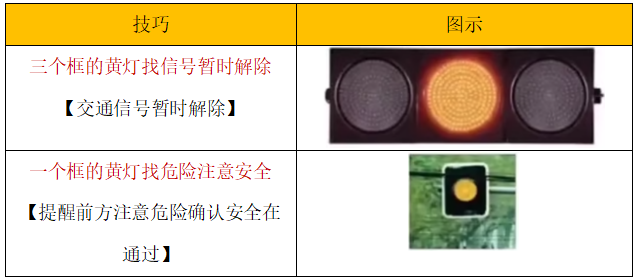

3．左侧通行、两侧通行、右侧通行：**上半部分看哪边有三角形**

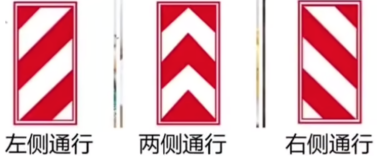

4．马路边和指示牌的禁止停车

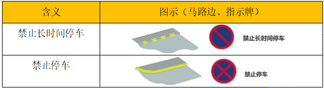

5．导向车道线，有齿可变，无齿导向（技巧：==有导向优先选导向==）

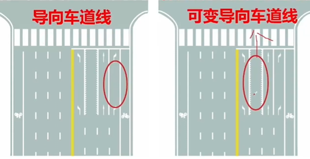

6．高速公路，左进右出（出入口的箭头）

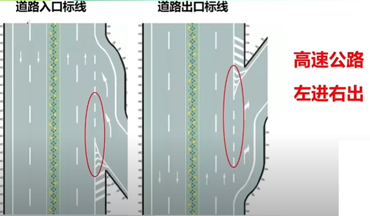

7．纵向减速标线、横向减速标线、立面标记

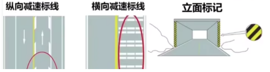

8．网状线，不能停车

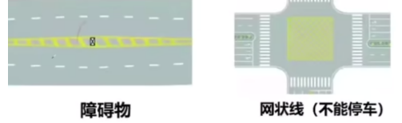

9．导向线，有导向选导向

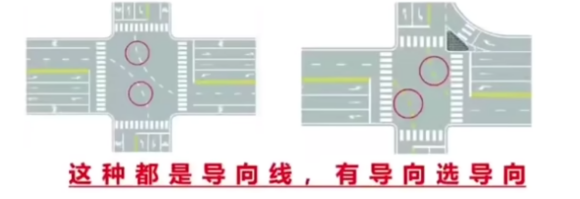

10.中心圈、人行横道预告、禁止右转、左右转弯、导流线

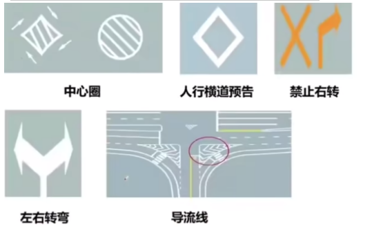

11．实线、虚线

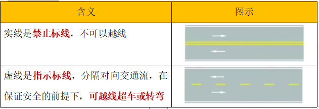

12．停车位，三种：平行式停车位、固定方向停车位、限时停车位

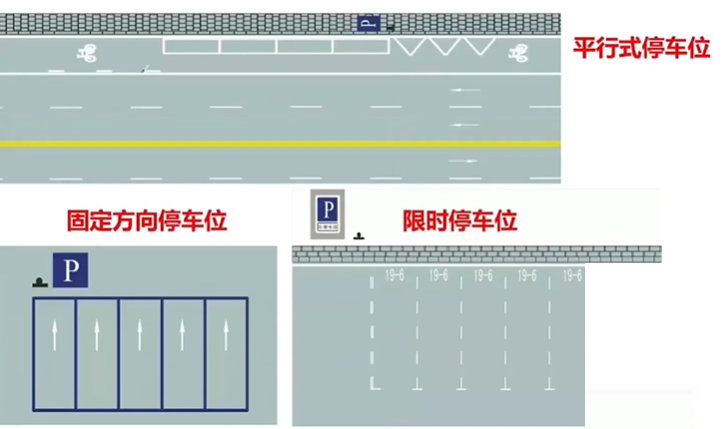

13．**粉色标志找‘管理’**

交通事故管理

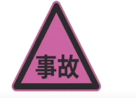

14．黄色三角，***\*警告标志\****，目的提醒你注意（技巧：有***\*注意\****优先考虑，找选项里有注意的）

1) 箭头找合流，没有箭头找Y型

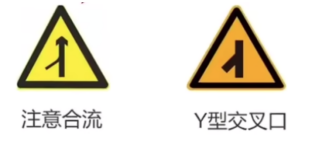

2.上下陡坡、连续上下

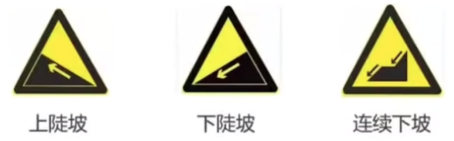

3.有障碍物左右绕行（左箭头左绕，右箭头右绕）、上下箭头找**双向交通、有人找施工**

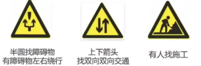

4.山旁有路傍山险路，水旁有路是堤坝路，抛物线状注意落石，车轮抬起注意易滑

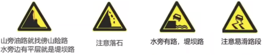

5.牛找牲畜，鹿找野生动物

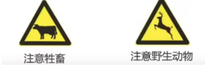

6. 下宽上窄路面变窄，腰细找窄桥

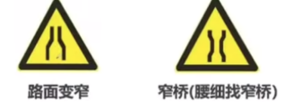

7.有栅栏无人烟，一红杠50米

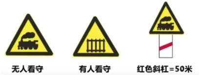

8.1急2反3连续

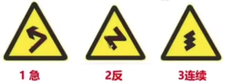

9.路面高突（减速丘）、**高低不平(桥头跳车)**、低洼，驼峰桥

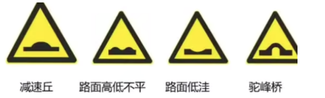

10.小旗飘找大风、看到平房找村镇、隧道就是隧道

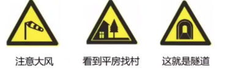

11.两车相撞找事故

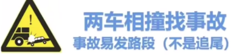

12.潮汐车道：警告标志里的双黑虚线、路面上的双黄虚线

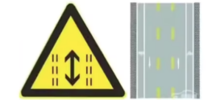

15.比较容易混淆的标志

1) 黄色找注意，蓝色找道

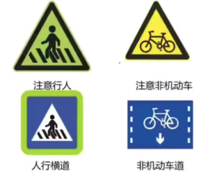

2.上下箭头找双向，左右箭头找分离

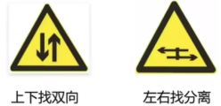

16．蓝色标志，***\*指示标志\****，允许标志的操作

1) 指路标志，**需要有地点和方向**
2) 小火箭找干路（干路是主要道路），三个方向找分向。在方框里，和圆圈里的箭头指向左右就是左右转弯不用考虑变道，**虚实线才考你变道问题**

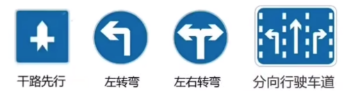

3.单行道（长方形）、只准直行（圆形）、直行车道（带虚线）

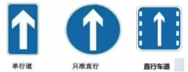

4.会车让行、会车先行（**谁粗谁先走，谁红谁停**）

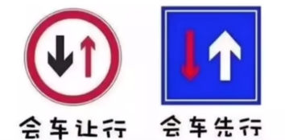

5.只要交叉的地方是断开的，就代表立体式的意思

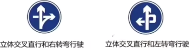

6.环路、Y型交叉路口、行人（也可以叫步行）

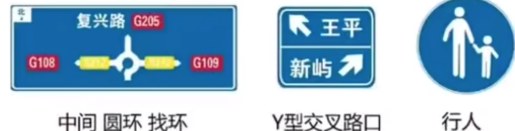

7.分隔带右侧行驶、分隔带左侧行驶、车道数变少、车道数增驾

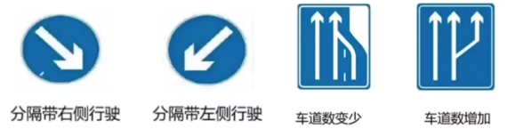

8.露天停车场，室内停车场（有屋顶）

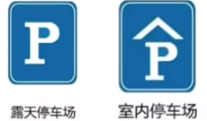

9.圆圈行驶，两虚线车道，BRT是快速，红色禁止此路不通

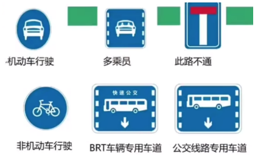

10.折线找线-线性诱导标志，跑找急，两个口找出口

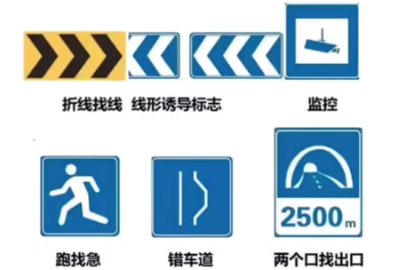

11.蓝色标志开车灯（不是近光灯，注意）

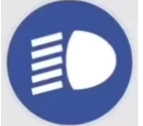

12.箭头直行是开始、箭头拐弯是即将结束、红色是结束

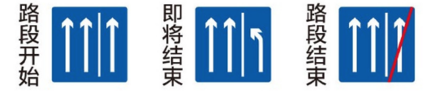

17．红色禁令标志，禁止限制的作用

红色圆圈禁止通行（人和车都禁止）、***\*八停三减\****（八角形、三角形）、一条横杠禁止驶入

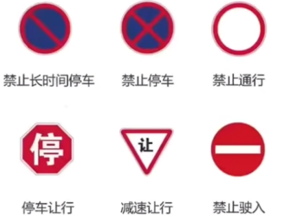

1) 黑色解除禁止的意思
2) 不能左转的，同样不能掉头（因为掉头得往左转掉头）

18．国道G、省道S、县道X、乡道Y（前三个是字的拼音首字母）

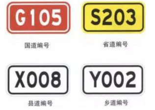

19．高速公路标志

1) 起点和终点

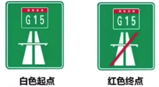

2.图中有字答案中找字、箭头代表方向、XX km代表距离

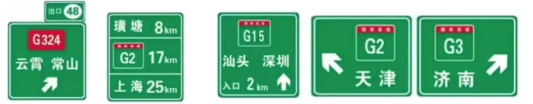

3.服务区（有饭店-刀叉）、停车区（有水喝）、停车场

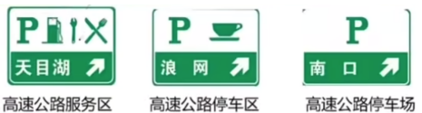

4.紧急停车带、紧急电话、救援电话

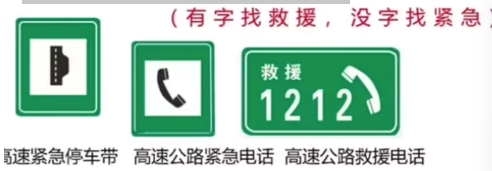

20.**棕色代表旅游区**

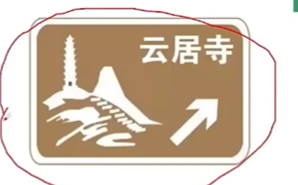

箭头代表方向

### 仪表指示

1．数字过百找速度，数字小到8找发动机转速

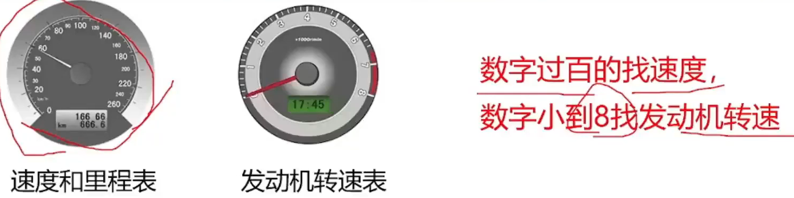

2．点火开关（技巧：14对、23❌）

1) LOCK：切断电源，锁定方向盘
2) ACC：接通附件电源（比如收音机等附件）
3) ON：接通除起动机外的全车全部电源
4) START：接通起动机电源，启动发动机

3.看到钥匙找开锁、看到被包裹找儿童、看到太阳找总字

4.上边按钮前挡风除雾，下边按钮后挡风除雾（前-扇形，后-矩形，里面有三条向上的波浪线）

5.车灯，技巧：平远斜近，前绿后黄、斜杠在前在后区分

6.看到扇叶找风扇；前后位置灯，也叫示廓灯

7.危险报警闪光灯手动打开、红P双制动、+-找电路

8．前发后行，前发动机，后行李舱

9.机油不足引起压力过低；下图两个都是冷却液不足

10.汽油柴油统一叫燃油，闪电找发动机控制系统

11．仪表指示灯的文字技巧：仪表盘灯亮，证明出问题才会亮，所以只要题目中出现仪表亮说是工作状态打开状态的题目都是❌的，题目中有不足两个字是✅的

12．技巧：黄色图只有两侧车门打开是✅的，剩下的黄色图都是❌的

13．仪表指示灯金句总结：

1) 数字表盘，数字小的找发，过百找速度，波浪线找水
2) 平远斜近、前绿后黄
3) 前扇后长、前发后行
4) 看到钥匙在开锁，看到红P找两个制动，看到点燃的烟找出字，看到水温表找冷却液问题，看到箭头找外和内，看到+-找电路，看到滴找低，一前一后的灯找示廓灯

14.离合器、刹车、油门踏板、变速器、驻车制动器（离合、脚刹、油门、换档、手刹）

15．左灯右水

1) 上右下左转向灯

2.技巧：戒指掉下来就❌，在中间就是对的

### 新规扣分项目

#### 九种超速扣分项

1) 驾驶校车、中型以上载客载货汽车、危险品运输车辆以外

| 车型                             | 普通道路 | 扣分  | 高速公路 | 扣分   |
| -------------------------------- | -------- | ----- | -------- | ------ |
| XX以外的其他机动车               | 20%-50%  | **3** | 20%-50%  | **6**  |
|                                  | 50%以上  | **6** | 50%以上  | **12** |
| 中型客车以上（校车、危险运输车） | 10%-20%  | 1     | 20%以下  | 6      |
|                                  | 20%-50%  | 6     | 20%以上  | 12     |
|                                  | 50%      | **9** |          |        |

2) 小汽车，普3、6，高6、12
3) 大汽车，50%以上普9

#### 七种超员扣分项

1) 超员，标红字的容易考到

| 车型                                           | 核定人数 | 扣分   |
| ---------------------------------------------- | -------- | ------ |
| 驾驶校车、公路客运汽车、旅游客运汽车（大汽车） | 20%以上  | **12** |
| 驾驶校车、公路客运汽车、旅游客运汽车           | 20%以下  | 6      |
| 驾驶7座以上载客汽车载人                        | 50%-100% | **9**  |
| 驾驶7座以上载客汽车载人                        | 20%-50%  | 6      |
| 以外其他载客汽车                               | 100%     | **12** |
| 以外其他载客汽车                               | 50%-100% | 6      |
| 以外其他载客汽车                               | 20%-50%  | 3      |

2) 校车大汽车，**二十决生死**，20%以下6、20%以上12
3) 7座以上，提到100%就是9分，50%以下6，50%以上9（这里只有这个有9分）
4) 以外就是，50%以下3，50%以上6，100%是12

#### 三种超载扣分

1) 超载，标红字的容易考到

| 车型             | 核定人数             | 扣分  |
| ---------------- | -------------------- | ----- |
| 驾驶载货汽车载物 | 50%                  | 6     |
| 驾驶载货汽车载物 | 30%-50%/违反规定载客 | **3** |
| 驾驶载货汽车载物 | 30%以下              | **1** |

**2)** 30%以下1，50%以下3（包含30%），50%是6

#### 三种安全技术扣分

1) 安全技术，标红字的容易考到

| 关键字                                                       | 扣分  | 问（安全技术）技巧     |
| ------------------------------------------------------------ | ----- | ---------------------- |
| **以外的机动车**未按规定定期进行安全技术检验                 | **1** | 以外的安全技术         |
| 未按规定定期进行安全技术检验的公路客运汽车、旅游客运汽车、危险物品运输车辆 | 3     | 大汽车这些安全技术检验 |
| 未对校车车况是否符合安全技术要求进行检查，或者驾驶存在安全隐患的校车上道路行驶的 | 3     | 校车安全技术/校车安全  |

2.以外的，就是指小汽车

#### 扣1分的考点：（共10点）

1) 驾驶未按规定定期进行安全技术检验的公路客运汽车、旅游客运汽车、危险物品运输车辆以外的机动车上道路行驶的（以外安全1）
2) 驾驶机动车不按规定会车，普通道路不按规定倒车掉头（会车/掉头/倒车找1）
3) 违反禁令标志禁止标线（禁令找1）【禁令标志红色的】
4) 不按规定使用灯光（灯光找1）【比如常开远光灯、常开危险报警闪光灯】
5) 未按规定系安全带（安全带找1）
6) 驾驶校车、中型以上载客载货汽车、危险物品运输车辆在高速公路、城市快速路以外的道路上行驶超过规定时速百分之十以上未达到百分之二十的【基本不会考】
7) 驾驶机动车载货长度、宽度、高度超过规定的（长宽高找1）
8) 驾驶擅自改变已登记的结构、构造或者特征的载货汽车上道路行驶的（擅自找1）
9) 驾驶载货汽车载物超过最大允许总质量未达到百分之三十的
10) 驾驶摩托车，不戴安全头盔的（头盔找1）

#### 扣3分的考点：（共14点）

1) 拨打接听手机（打电话找3）
2) 在路上出现事故故障停车后，没有按规定使用灯光和放置警告标志（故障警告找3）
3) 普通道路上逆行/高速以外的道路逆行（普逆找3）
4) 借道占道对面车道穿插（穿插找3）
5) 不避让校车（不让找3）
6) 不按规定安装号牌（安装找3）
7) 驾驶校车上道路行驶前，未对校车车况是否符合安全技术要求进行检查，或者驾驶存在安全隐患的校车上道路行驶的（校车安全技术找3）
8) 载货汽车420法则4小时未停车或者休息少于20分钟（420法则看载货还是载客，载货就3，载客就9）
9) 高速公路行驶低于最低时速的（低低找3）
10) （驾驶校车公路汽车7座以外的其他） 载客汽车超过核定人数20%-50%
11) 驾驶校车、中型以上载客载货汽车、危险物品运输车辆以外的机动车在高速公路、城市快速路以外的道路上行驶超过规定时速百分之二十以上未达到百分之五十的（普通道路超速20-50%）
12) 驾驶载货汽车载物超过最大允许总质量30%以上未达到50%的或者违反规定载客
13) 驾驶未按规定定期进行安全技术检验的公路客运汽车、旅游客运汽车、危险物品运输车辆上道路行驶的（安全技术检验大客车的找3）
14) 高速公路城市快速路不按规定车道行驶/不按规定超车让行/人行横道不按规定减速停车避让行人的（不按规定车道/超车让行/减速停车让行人找3或者不让找3）

#### 扣6分的考点（共12个）

1) 违法占用应急车道（急找6）
2) 驾驶证被暂扣扣留期间驾驶机动车（扣找6）【无证驾驶6】
3) 没有遵守交通信号灯（信号灯找6）【闯红灯6】
4) 逃逸无死亡轻伤以下（轻伤/无伤逃逸都找6）
5) （驾驶校车、中型以上载客载货汽车、危险物品运输车辆以外的机动车）机动车高速超速20%-50%之间，普通50%以上
6) 驾驶其他载客汽车超过核定人数50%-100%（50-100%找6）
7) 驾驶载货汽车载物超过最大允许总质量50%的
8) 驾驶校车、公路客运汽车、旅游客运汽车载人超过核定人数未达到20%，或者驾驶7座以上载客汽车载人超过核定人数20%以上未达到50%
9) 驾驶校车、中型以上载客载货汽车、危险物品运输车辆在高速公路城市快速路上行驶超过规定时速未达到20%，或者在高速公路、城市快速路以外的道路上行驶超过规定时速20%以上未达到50%的
10) 驾驶机动车运载超限不可解体的物品，未按指定时间路线行驶或者未悬挂警示标识
11) 驾驶机动车运输危险化学品，未经批准进入危险化学品运输车辆限制通行的区域
12) 驾驶机动车载运爆炸物品、易燃易爆化学物品以及剧毒、放射性等危险物品，未按指定的时间、路线、速度行驶或者未悬挂警示标志并采取必要的安全措施的（未按指定时间/路线/速度，未经批准的找6，品找6）

#### 扣9分的考点（共7点）

1) 高速公路城市快速路违法停车（违法停车9）
2) 未悬挂机动车号牌或者故意遮挡污损号牌（技巧: 未挂，遮挡污损号牌）
3) 驾驶车型不符（不符找9）
4) 未取得校车驾驶资格驾驶校车（校车资格找9）
5) 载客汽车危险物品运输车420法则，4小时未停车或者休息少于20分钟
6) 驾驶7座以上载客汽车人超过核定50%-100%（7座的人50-100%）
7) 驾驶校车、中型以上载客载货汽车、危险物品运输车辆在高速公路、城市快速路以外的道路上行驶超过规定时速百分之五十以上的（校车等普通道路超速50%以上找9）

#### 扣12分的考点（共7点）

1) 饮酒找12
2) 使用伪造、变造的驾驶证/行驶证/号牌，使用其他号牌行驶证（技巧: 看到伪造、变造即12） 
3) 造成交通事故后逃逸死亡或者轻伤以上（逃逸死亡重伤等找12）
4) 驾驶校车、中型以上载客汽车等载高速快速路超过20%以上，高速超速50%以上（大车高速20%以上，小车高速50%以上）
5) 高速上倒车、逆行、穿越分隔带（高逆找12）【城市快速路上，一样扣12】
6) 代替实际驾驶人接受违法行为出发和记分谋取利益（谋取利益找12）
7) 驾驶校车、公路客运汽车载人超过核定人数20%以上，或者驾驶其他载客汽车载人超过核定100%以上（大车人数20%以上，或者100%以上找12）

### 罚款新政策更新版

1．只要问到受到什么处罚什么处理的？知识点小口诀：1罚2吊（顺序优先选，罚款有20元不选，例外：**实习期单独上高速，补领机动车驾驶证**）罚款、吊销驾驶证

2．驾驶证被扣的情况，就不能吊销了，需要先拘留

**3．【未按照规定/未及时XXX】罚款200元以下：**

1) 未按照规定时限办理机动车转让登记
2) 改车未按照规定时限变更登记
3) 未按照规定期限检车
4) 大型客车或中/重型载货车未按照规定喷涂号牌
5) 大中重型车驾驶证信息变更未及时申报

**4．关于申请人假1骗3的罚款考点**

1) 申请人以欺骗、贿赂等不正当手段（骗）取得校车驾驶资格的，处***\*两干元\****以下罚款，申请人在***\*三年\****内不得再次申请校车驾驶资格。
2) 申请人在考试过程中有贿赂、舞弊（=作假）行为的，已经通过考试的其他科目成绩无效，处***\*两千元\****以下罚款，申请人在***\*一年\****内不得再次申领机动车驾驶证
3) 欺骗、贿赂、舞弊的都找2000

**5．跟分有关的罚款（买分/卖分）**

1) 机动车驾驶人请他人代为接受交通违法行为处罚和记分并支付经济利益的（买分），由公安机关交通管理部门处所支付经济利益***\*三倍\****以下罚款，但最高不超过***\*五万\****元；同时，依法对原交通违法行为作出处罚
2) 代替实际机动车驾驶人接受交通违法行为处罚和记分牟取经济利益的（卖分），由公安机关交通管理部门处违法所得***\*三倍\****以下罚款，但最高不超过***\*五万\****元；同时，依法撤销原行政处罚决定
3) **组织他人**实施前两款行为之一牟取经济利益的，由公安机关交通管理部门处违法所得***\*五倍\****以下罚款，但最高不超过***\*十万\****元
4) 有扰乱单位秩序等行为，构成违反治安管理行为的，依法予以治安管理处罚
5) 请他人=买分=代替他人=卖分，都是3倍5万，组织买卖记分5倍10万

**6．关于弄虚作假的罚款**

1) 扣减记分/满分学习时弄虚作假：1000以下
2) 假申请驾驶证资格找500

7．关于‘代替’关键词的罚款，有2种，代替审验教育/满分教育/接受交通安全教育扣减交通违法行为记分代替审验教育，都是***\*2000以下\****

8．**关于‘组织’关键字的罚款行为**

1) 组织买卖分的，严重***\*5倍10万\****以下
2) 组织他人（满分教育扣减分的/审验教育）都找***\*3倍2万\****以下
3) 组织作假欺骗不正当取得驾驶证的都是***\*3-5倍，10万\****以下

9．**逾期找250，200-500罚款**

10．逃逸、非法、私自安装报警器，都找两个2（22），***\*200-2000\****罚款

11．看到判断题绝大多数200选✅

12．醉酒、饮酒同时出现，选***\*饮酒\****

13．喷涂找200

14．**其他口诀，做题自己补充的：**

1) 罚款15天
2) 伪造变造2千5千
3) 危险驾驶：醉驾、追逐竞驶、载客车超载/超速、运输危险化学品

未交强险两倍罚款

### 技巧合集

1．看到加速、迅速超越、迅速通过、迅速XX(除迅速降低速度，迅速报警是✅)判断为❌

2．判断题中看到30/三十/确认(确保)安全/违法行为都是✅；应当/按/都是对的

3．选题提中三个未字选不一样开头的，三个可字选不一样开头的

4．判断题中XXX不足选 ✅

5．看到连续持续长按鸣喇叭/催促/逼迫/迫使的字眼，直接判断为❌，轻按/回应喇叭✅

6．只要看到人/非机动车/机动车，都要让！！停车让/减速靠右让，不能立即停车迅速停车，所以看到是❌的，因为会追尾(技巧看到减速靠右、减速慢行、减速或停车，直接选)

7．ABS和紧急制动四个字在一起的判断题就是✅，没有紧急制动就是❌

8．不能空挡/熄火/惯性滑行！三个滑行方法都是❌的不能用！

9．看到“双引号”的判断题直接判断✅

10．看到安全距离，直接选

11．判断题中‘可以不XXX’判断❌

12．看到开(使用) 远光灯，直接判断❌

13．醉酒与饮酒同时出现，选饮酒，没有饮酒选醉酒

14．判断题中出现数字‘200’，绝大多数选✅

15．看到‘只需XXX’，判断❌

16．‘利用发动机’这五个字出现就选✅，‘不要紧急制动’也是选✅

17．看到‘主动，排队、依次，礼让，注意避让’的题目都是✅的

18．判断题远近光灯这样连续在一起的判断就是✅的，远、近光灯用顿号、分开就是❌的

19．只要出现‘公里’这两个字的判断题，前面不是30/100的数字都是❌的，是的话就是✅的。

20．紧急制动减速就是❌的，不要紧急制动，不要冒险，不要随章都是✅的，还有利用发动机制动减速是✅的

21．假1骗（撤）3毒3醉5逃罪终生

22．看到‘易XXXX‘判断✅

23．禁止去红灯亮的地方，绿灯通行

24．处罚题目: 1罚 (绝大多数20元不选，例外2种情况) 2吊

25．一个黄灯的不断闪烁，是注意危险，三个灯中间黄灯不断闪烁，是信号暂时解除

26．看到扣留‘车’对的（忘记带身份证扣车是❌的，扣留行驶证是❌的）

27．看到考题关于谁先行的：转弯让直行、右转让左转、同样直行让右方先行、有障碍一方让无障碍一方先行，靠山体一方让不靠山体一方先行

28．实线禁止跨越、虚线可以跨越

29．追究就是✅的，不追究就是❌的

30．重踏持续踏踏板(制动踏板) 都是❌的，只有间断轻踏或者轻踏是对的。有间断轻踏直接选

31．不得超车：前车正在左向动作不能超，交通流量大、人行横道铁路道口、隧道、弯道、窄路等特殊道路、执行任务的车不能超

32．黄色警告标志，优先考虑注意，红色警告禁止限制，蓝色指示标志

33．看到报警 都是✅的判断题

34．超车只能从左侧超车，不能借用右侧公交车道

35．注意避让，判断题中✅

36．替代、代替判断题都是❌的，只有救援题目替代包扎是对的

37．圆形红、黄、绿灯都不影响右转

38．爆胎找气压问题，需要紧握转向盘，看到紧握转向盘的判断题✅，选择也选它

39．交强险找2倍、C1C2C3视力表找3x3=9，找有9的（4.9），C1能开C2 C3 C4

40．大安全距离就是√，大距离大间距

41．停车收费颜色: 白色收费、蓝色免费

42．在高速公路或者十字路口疏忽过了，就只能找继续向前，不能折回，频繁变道就❌，迅速转向、迅速驶入、迅速提速都❌，只有迅速减速(降低速度)、迅速报警是对的，立即停车，迅速停车也是❌的

43．只要提到油耗、节油、省油、美观、天气对车的影响、电子设备对车信号影响都是❌的

44．有‘间断轻踏’直接选，没有找轻踏(重踏持续踏都是❌的)

45．行为前面找违法，其他的违规违章违纪等都是❌的。

46．‘不得’多数都✅的 (看题即可)

47．拼装、报废上路就❌

48．十字路口内的网状线、人行横道都不能停车

49．只要堵车，坚决不能进入路口内，只能在路口外等待，或者疏通后绿灯亮了在走。 (混淆你的‘保证安全进入路口’也是❌的)

50．故障有4步：1.开危险报警闪光灯 2.移动不妨碍交通的地方 3.放置警告标志 4.人一定下车去安全的地方等报警救援

51．停车的技巧：有站就找30，没有站就找50

52．车登记证随意 (只有驾驶证随意，其他的都是车登记的)

53．放弃超车。停车超车 直接选✅

54．圆形的红灯不影响右转，除非箭头的右转红色

55．只有加防撞不用登记，剩下什么颜色、发动机、车身变都需要登记

56．自学直考的人只能符合自学直考的标准，只能和教练一辆蓝色的牌子车学习，不能用黄色牌子教练车

57．减少并行就是✅的

58．特殊天气问题：雨天找滑字，冰雪道路找制动问题，水淹路面找观察路面，山区找弯，雾天夜晚都找能见度问题，泥泞找车轮问题

59．A车掉东西砸别人车了，A的责任

60．有累加、记分转入四个字就对

61．防滑链找驱动轮

62．直接驶入就是❌的，箭头压实线也是❌的

63．起步找观察周围、近光灯，逆时针绕车一周，带图的题，图中有字去答案找字。

64．‘未满XX’肯定不对，所以‘未满XX不得做什么’是对的

65．冬季给电动汽车充电前，应提前预热电池；驾驶电动汽车出行前，应检查剩余电量；提前/检查都是对的，电动车这款有普通灭火器就❌

66．延期审验找核发地

67．临时车牌3天过期

### **英文缩写补充**

关键单词：自动Auto、预警Warn、电子Electronic、交通Traffic、盲Blind、辅助Assist、巡航CC

| 序号 | 中文                   | 缩写        | 英文                                | 记忆点参考          |
| ---- | ---------------------- | ----------- | ----------------------------------- | ------------------- |
| 1    | 车辆导航系统           | GPS         | Global Positioning System           | GPS全球定位         |
| 2    | 实时交通信息           | TMC         | Traffic Message Channel             | 交通T打头           |
| 3    | 车辆交通标志识别系统   | TSR         | Traffic Sign Recognition            | 交通T打头           |
| 4    | 车辆牵引力控制系统     | TCS/ASR/TRC | Traction Control System             | 交通T打头、缩写最长 |
| 5    | 车辆自动变道辅助系统   | ALC         | Auto Lane Change                    | 带自A打头           |
| 6    | 车道偏离预警系统       | LDW         | Lane Departure Warning              | 预警W结尾           |
| 7    | 前方防碰撞预警系统     | FCW         | Front Collision Warning             | 带前找F、预警W结尾  |
| 8    | 自适应前照灯系统       | AFS         | Adaptive Front-lighting System      | 带自A打头、带前找F  |
| 9    | 自适应巡航系统         | ACC         | Adaptive Cruise Control             | 带自A打头、巡航CC   |
| 10   | 定速巡航系统           | CCS         | Cruise Control System               | 巡航CC              |
| 11   | 车辆自动刹车辅助系统   | AEB         | Auto Emergency Brake                | 带自A打头           |
| 12   | 电子控制制动辅助系统   | EBA         | Electronic Brake Assist             | 带电E打头           |
| 13   | 车辆电子制动力分配系统 | EBD         | Electronic Brake-Force Distribution | 带电E打头           |
| 14   | 车身电子稳定控制系统   | ESP         | Electronic Stability Program        | 带电E打头           |
| 15   | 车辆盲点辅助系统       | BSA         | Blind Spot Assist                   | 盲点找BS、辅助是大A |
| 16   | 车辆盲点监测系统       | BSD         | Blind Spot Detection                | 盲点找BS            |