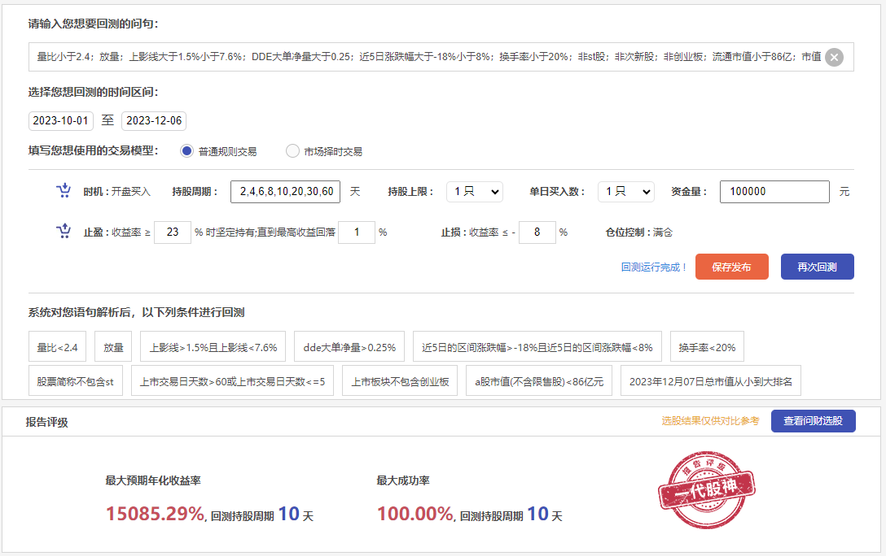
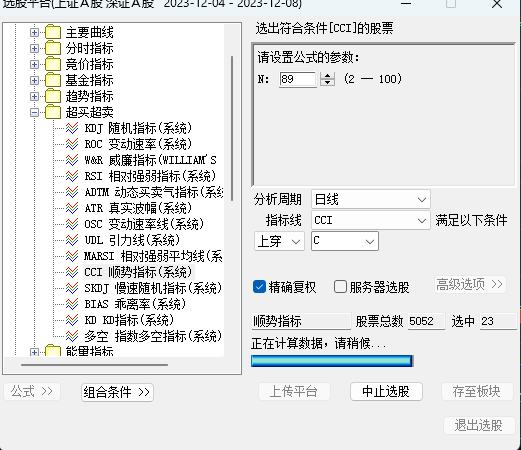
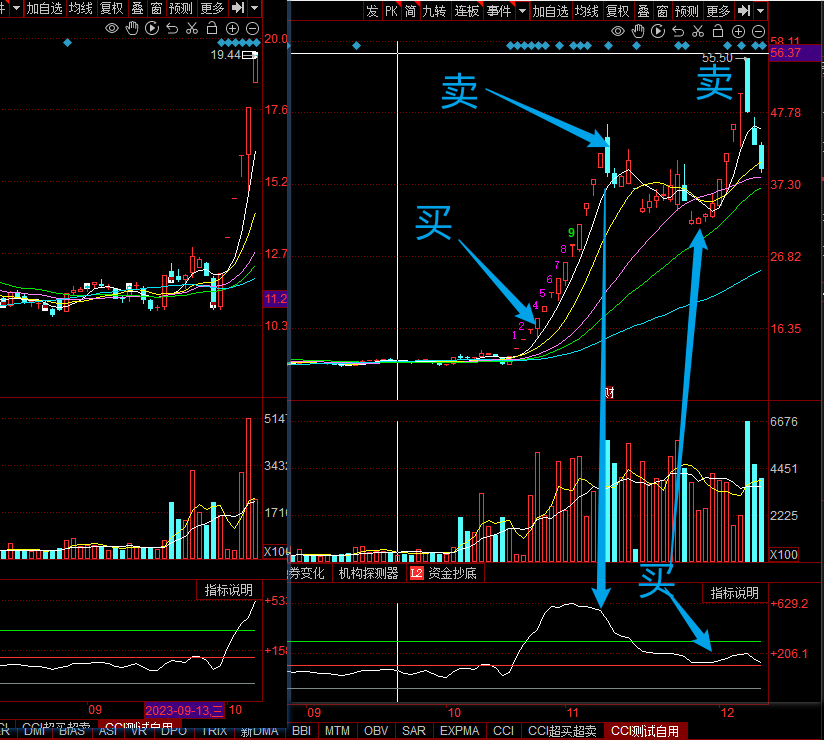

# 选股

> 前一天收盘后选股，第二天开盘买入

> 选出股票后，找**比较强势**的，然后**短线爆发性强**的，结合**热门概念和热门板块**，做一些二次筛选 最后搞到7-8只，不然注意力完全跟不上

## 策略一：成功率达79%的百倍策略！

### 策略说明

🏷️主升浪超短选股

🏷️历史最高年化收益率

🟢小盘股、小市值

🔴主力动向

🔴近期走势

**选股条件：**[日期] 量比小于2.4；放量；上影线大于1.5%小于7.6%；DDE大单净量大于0.25；近5日涨跌幅大于-18%小于8%；换手率小于20%；非st股；非次新股；非创业板；流通市值小于86亿；市值从小到大

**买入时机：**开盘买入；

**持股上限：**1只

**止盈：**收益率 ≥ 23.2 % 时坚定持有；直到最高收益回落 0.77%

**止损：**收益率 ≤ -8.5 %

**最佳持有周期:**  <span style="color: red;font-weight:700">4天</span>

> 很强，这个股就算是达到止损线，后续也会继续发力，只是被洗出去了。

```
yoyo花：
如果4天不能涨，就要甩掉
选股的时候会选出很多，
二次筛选：符合短线爆发线索/特性的越多越好，
比如：量比；不能接近前期图形高点；不能市场关注度太低(有个表头叫：市场关注度)；不能不是主流热点里的；
这样筛选下来就会只剩一些票了
```

> 注意点：当天盘后选股股票，买入是日次，当天是放量的，**第二天往往缩量**，走势不行，甚至下跌，请别被洗走，**可以在之后3天考虑低吸**

### 策略回测

问句：

量比小于2.4；放量；上影线大于1.5%小于7.6%；DDE大单净量大于0.25；近5日涨跌幅大于-18%小于8%；换手率小于20%；非st股；非次新股；非创业板；流通市值小于86亿；市值从小到大

回测区间： 

 至 2023-10-01~2023-12-06

**资金量 :** 220000 元

> **坚定执行：**
>
> **持股周期：**10天
>
> **止盈 :** 收益率 ≥ % 时坚定持有;直到最高收益回落 %
>
> **止损 :** 收益率 ≤ - %
>
> **仓位控制 :** 满仓
>
> **持股上限：**1只
>
> **单日买入：**1只



### 策略执行

|       | 选股             | 买                      | 卖   |
| ----- | ---------------- | ----------------------- | ---- |
| 12-06 | 百洋股份[002696] |                         |      |
| 12-07 | 三木集团[000632] | 百洋股份[002696] ：半仓 |      |
| 12-08 |                  |                         |      |


## 策略二：筹码结构选股，持续两年至今成功率100%！

🏷️筹码结构高度集中

🏷️成功率最高

**选股条件：**中证500，筹码集中度90小于12%，收盘价大于20均线，市值从小到大排名

 **时机 :** 开盘买入

 **止盈 :** 收益率 ≥ 20 % 时坚定持有;直到最高收益回落 8 %

 **止损 :** 收益率 ≤ - 14 %

**最佳持有周期:** 67天

> 可以的，很稳

## 策略三：最高13连板，回测4年仅一次亏损

🏷️年化率收益高

🏷️持股胜率高

🟢最佳长周期持股

 **选股条件：**属于中证1000指数，30天区间涨跌幅小于10%，5日平均换手率大于1.5，总市值从小到大排列

 **时机：**开盘买入

 **止盈：**收益率 ≥ 25 % 时坚定持有；直到最高收益回落 7 %

 **止损：**收益率 ≤ - 18 %

> 测出来后，不急着买入，可以观察几天看看

## 策略四：长线股民必看，持有3个月成功率90%

🟢最佳小盘股策略

**选股条件：**中证1000指数，30日涨幅小于18%，90日线上移，市值从小到大排列

**时机：**开盘买入

**止盈：**收益率 ≥ 50 % 时坚定持有；直到最高收益回落 10 %

**止损：**收益率 ≤ - 12 %

> 这个策略较好的地方就是可以视情况，调整持股周期，可以看到下边的数据中，在持股周期为20天时，收益最大，在持股80天时，成功率最高！

> 设想一下：在持股一段时间后，视大盘调整情况，迅速止盈；即使被套住了，长期持股，也会有很大概率解套，可以灵活调整的策略，是不是要好用得多。


## 策略五：曾经100%成功率的策略，如今表现的怎么样？

 这个策略在21年——22年的回测中，成功率100%，最大年化收益619%，而且持股周期也比较短，是比较符合短线投资者的了。

 **选股条件：**10日均线上穿30日均线，阳包阴，涨幅小于5%，按市值从大到小排列

 **时机 :** 开盘买入

 **止盈 :** 收益率 ≥ 20 % 时坚定持有;直到最高收益回落 3 %

 **止损 :** 收益率 ≤ - 10 %

> 这个策略从10日线上穿，涨幅选股，在21-22年4月表现非常好，在持有35天时，收益率和成功率都达到最高，22年4月之后，成功率有降低，但还是可以作参考的。

## 策略六：低估股票选股

**股价/每股净值小于0.95**

```
过滤235天之内新股，过滤st股票，过滤*st股票，过滤退市股票，过滤创业板，过滤科创板，非停牌，
股价>1.5,
股价小于每股净值*0.95，
近一期季报净利润为正，
动态市盈率小于35，
市值从小到大排序
```

> 就是找到被低估的价值股票

> 为什么回测大盘差它的趋势更猛?


## 其他策略


### 中长线方案

```
中证1000指数，20日涨幅小于17%，60日线上移，最近 季度财报业绩为正，市值从小到大排列
```

### 龙头打板战法

```
连续涨停天数2后量能突破，流通市值大于100亿，非科创板，非创业板，股价低于90元
```

时机 : 开盘买入
持股周期 :   5,13,20  天
持股上限 :   1 只
单日买入数 :   1 只
资金量 :   1000000
止盈 : 收益率 ≥ 15 % 时坚定持有;直到最高收益回落 5 %
止损 : 收益率 ≤ - 8 %
仓位控制 : 满仓

> 先用这个迅速扩大本金到10w，然后再考虑其他稳定的选股策略

### 板块资金流入最高和个股净流入资金最高

这个一般第一天直接拉很高，但是第二天会不会炸，要验证。

## 抓龙头妖股主升浪 ♥

CCI指标选出强势股（参数改为89，设置c:300指标线）

买点：回踩/站上5日线（最低价在5日均线上的）





## 原理

- 动态市盈率小于35：[PEG的概念](https://xueqiu.com/1911019489/187628443)
- 股价小于每股净值*0.95：[股价净值比的概念](https://www.oanda.com/bvi-ft/lab-education/invest_us_stock/book-value-per-share/)