# 股票

> 短线！！擒龙！！

## 小白疑问

- 怎么知道热股的方向
- 怎么知道一只股能不能追
- 怎么知道高位能不能高
- 怎么知道一只股能不能翻身
- 道氏理论是什么

- 怎么找到新股可以申购的消息


- 每支股票都有主力么？怎么判断是否有主力在运作？
- 集合竞价怎么捕捉机会
- 一只股票每天流入流出资金都是几个亿，能根据这个数据看多/看空？好像不行，有时候今天流出，明天却是涨的。怎么看股票每日的资金流动情况。


## 股票基本定义

### 股票挂牌对上市公司的好处

- 股票上市后，上市公司就成为股民的投资对象，可以更容易吸收股民的钱，增加集资来源。
- 上市后股权分散到千万个股民中，可以避免股权被少数股东单独支配的风险，增加公司经营自由度。
- 股票交易所对上市公司股票行情和公告有广告效果，增加上市公司的知名度和信誉。
- 上市公司主权分散及资本大众化，直接效果就是股东人数增加，股东自然而然会优先消费上市公司的产品。
- 上市可以争取更多的股东
- 利于公司股票价格的确定。
- 上市公司即可公开发行证券，又可对原有股东增发新增，这样公司资金来源就很充分。
- 为了鼓励资本市场的建立和资本积累的形成，一般对上市公司进行减税优待。因为在交易所挂牌要定期公布财务状况，所有不是所有的大公司都愿意将其股票在交易所挂牌上市。

### 股票挂牌对股民的好处

- 挂牌上市为了股票提供了一个连续性市场，这有利于股票的流通。
- 利于获得上市公司的经营及财务方面的资料，了解公司的现状，从而做出正确的决策。
- 上市股票的买卖，须经买卖双方的竞争。只有买进和卖出一致时方能成交，所以证券交易所里的成交交割远比市场里的成交价格公平合理。
- 股票交易所的媒介传播，可以让股民可以更快的关注到股票和企业，从而对未来的走向做投资决策。
- 证券交易所对经纪人所收取的佣金有统一的标准。

### 股票的定义

- 是给股东的凭证，每个股票代表股东拥有一个基本单位的所有权。(股票单位：一手=100股)

### 特征

股票投资免入不能退股，不能要求退回本金，可以通过交易所卖出股票

## 股票分析

### 技术分析

- 市场行为包容一切：经济事件、社会事件、战争、自然灾害等等作用于市场因素，反应到价格变化中
- 价格以趋势方式演变
- 历史会重演。

### 基本分析

通过对决定股票内在价值和影响股票价格的宏观经济形势、行业状况、公司经营状况等进行分析，评估股票的投资价值和合理价值，与股票市场价进行比较，相应形成买卖的建议。

### 演化分析

以演化证券学理论为基础，将股市波动的生命运动特性作为主要研究对象，从股市的代谢性，趋利性，适应性，可塑行，应激性，变异性和节律性等方面入手，对市场波动方向与空间进行动态跟踪研究，为股票交易决策提供机会和风险评估的方法总和。


## 股票术语

### 开盘价

当日开盘后该股票的第一笔交易成交的价格。如果开市后30分钟内无成交价，则以前日的收盘价作为开盘价。

### 收盘价

指每天成交中最后一笔股票的价格，也就是收盘价格

### 最高价

是指当日所成交的价格中的最高价位。有时最高价只有一笔，有时也不止一笔。

### 最低价

是指当日所成交的价格中的最低价位。有时最低价只有一笔，有时也不止一笔。

### 涨跌幅度

即当日该股上涨和下跌的绝对值幅度，以元为单位

### 现手

即当时最新一笔成交的量，计量单位为手(一手=100股,最少买1手即100股)，收盘时的现手，实际上就是当日最后一笔成交的量。

### 普通股

上深所交易的股票都是普通股，普通股享有基本权利：公司决策参与权、利润分配权、优先认股全、剩余资产分配权。（a股有固定分红/股息的股票不多）

### 优先股

在利润分配由于普通股

### 绩优股

业绩优良，增长速度较慢的公司的股票，a股中的大公司，可以抗住经济衰退等因素，这类股票也不适用于投机，而且国内a股的大公司股票很少有固定分红。

### 报价

就是买卖的进价、出价。现在一般都有软件购买。

### 涨跌幅限制

一个交易日内，除上市首日证券外，证券交易价格相对上个交易日收市价格的涨跌幅不得超过10%。超过的委托为无效委托。

### 多头/多头市场

指股民对股票看好，看涨，于是在低价买进，等待高价卖出。获取差额收益。

一般将长期保持上涨姿势的股票市场成为多头市场，股价的变化特征是一连串的大涨小跌。（牛市）

### 空头/空头市场

指股民对股票看坏，看跌，于是将股票卖出，等待低价再买入。

一般将长期保持下跌姿势的股票市场成为空头市场，股价的变化特征是一连串的大跌小涨。（熊市）

### 洗盘

股民先把股票大幅度杀低，使大批小额股票投资者（散户）产生恐慌而抛售股票，然后再把股票抬高。以便乘积渔利。

### 回档

在股市中，股价不断上涨趋势，终因股加上涨速度过快而反转回跌到某一价位，这一调整现象称为回档。一般来说，股票的回档幅度要比上涨幅度小，通常时反转会跌到前一次上涨幅度的1/3左右又恢复原来上涨趋势。

### 反弹

在股市上，股票呈不断下跌趋势，终因股价下跌速度过快而反转到某一价位的调整现象称为反弹。一般来说，股票的反弹幅度要比下跌幅度小，通常是反弹到前一次下跌幅度的1/3左右时，又恢复原来的下跌趋势。

> 如果掌握不了最低点和最高点，反弹的周期也就2-3天，很容易被套

### 买空/融资

投资者预测股价将会上涨，但自由资金有限不能购买大量股票于是先缴纳部分保证金，并通过经纪人向银行融资以买进股票，待股价上涨到某一价位时再卖，以获取差额收益（加杠杆）

### 卖空/融券

是投资者预测股票价格将会下跌，于是向经纪人交付抵押金，并借入股票抢先卖出。待股票下跌到某一价位时再买进股票，然后归还借入股票，并从中获取差额收益

### 多杀多

即多头杀多头，股市上的投资者普遍认为当天股价将会上涨时大家抢多头帽子买进股票，然而股市行情事与愿违，股价并没有大幅度上涨，无法高价卖出股票，等到股市结束前，持股票者竞相卖出，造成股市收盘价大幅度下跌的局面。

### 轧空

即空头倾扎空头，股民一致认为当天股票将会大下跌，于是多数人当看空的一方，卖出股票。然而当天股价并没有大幅度下跌，无法低价买入股票，股市结束时，做空头的只竞相补进，从而出现收盘价大幅度上升的局面。

### 跳空

指受强烈利多或利空消息刺激，股价开始大幅度跳动。跳空通常再股价大变动的开始或结束前出现。

### 补空

是空头买回以前卖出的股票的行为

### 套牢

是指进行股票交易时所遭遇的交易风险。例如投资者预计股价将上涨，但在买入后股价却一直下跌趋势，这种叫多头套牢。

相反，股民预测股价将下跌，将股票防控卖出，但是股价却一直上涨，这种叫空头套牢。

### 阻力线

股市受利多信息影响，股价上涨到某一个价格后，做多头的认为有利可图，便大量卖出，使股价至此停止上升，甚至出现回跌。股市上一般将这种遇到阻力时的价位成为关卡，股价上升时的关卡称为阻力线。

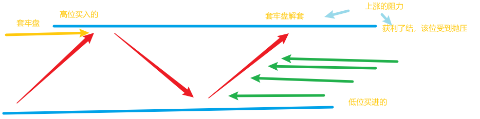

### 支撑线

股市受利空信息影响，股价跌到某个价格时，做空头的认为有利可图，大量买进股票，使股价不再下跌，甚至出现回升趋势，股价下跌时的关卡成为支撑线。

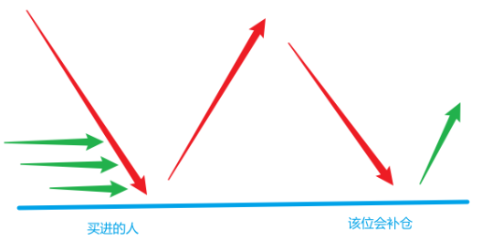

### IPO

首次公开发行股票，IPO速度过快，其实会利空。因为总的盘子就那么大

### 涨停板

证券市场中交易当天价格的最高限度成为涨停板，涨停板时的价格叫涨停板价。

### 一字型

即开盘价、收盘价、最高价、最低价在同一价格位，可分为几种情况

1.涨停：开盘即以涨停价开出，至收盘为止，涨停未被打开过，全天均以最高价成交，说明买盘旺盛，该股属于强势股

2.跌停：开盘即以跌停价开出，至收盘为止，跌停未被打开过，全天均以最低价成交，说明卖盘沉重，该股属于弱势股

3.交易非常冷清，全日交易只有一档价位成交。（国内a股很少有这种的）

### ST股票

深沪交易所在1998年4月22日宣布，将对财务状况或其他状况出现异常的上市公司股票交易进行特殊处理，由于特殊处理，在简称前冠以ST，所以这类股票称为ST股。

### T+1交收制度

从1995年1月1日起，为了保证股票市场的稳定，防止过度投机，股市实行T+1交收制度，当日买进的股票，要到下一交易日才能卖出，同时对资金仍然实行T+0，即当日回笼的资金可以马上使用。这中交收方式适用于我过的A股，基金，国债交易。

### 委托撤单

在委托未成交之前，投资者可以撤销委托。

### 交易时间

周一到周五（法定休假日除外）上午9:30--11：30，下午13：00--15：00

### 竞价成交

竞价原则：价格优先，时间优先。价格较高的买进委托优先于价格较低买进委托，价格价低卖出委托优先于较高的卖出委托；同价位委托，则按时间顺序优先。

竞价方式：上午9:15--9:25进行集合竞价；上午9：30--11：30，下午13：00--14：30进行连续竞价（对有效委托逐笔处理）

### 交易单位

单位为股，100股=1手，委托买入数量必须为100股或其整数倍

当委托数量不能全部成交或分红送股时可能出现灵股（不足1手的为零股），零股只能委托卖出，不能委托买入零股。

### 报价单位

股票以股为报价单位，交易委托价格最小变动单位，A股为人民币0.01元。


### 厘米

股票十厘米表示股票上涨了10%,20厘米表示股票上涨了20%。

### 低吸

**低吸**，又称**[低价买入](https://zh.wikipedia.org/wiki/低價買入)**、**[趁低吸纳](https://zh.wikipedia.org/wiki/趁低吸納)**、**[抄底](https://zh.wikipedia.org/wiki/抄底)**，在香港也叫**[低捞](https://zh.wikipedia.org/wiki/低撈)**、**[捞底](https://zh.wikipedia.org/wiki/撈底)**，是中国大陆和[香港](https://zh.wikipedia.org/wiki/香港)[股市](https://zh.wikipedia.org/wiki/股市)评论员常用的名词，即[投资者](https://zh.wikipedia.org/wiki/投資者)在某只[股票](https://zh.wikipedia.org/wiki/股票)下跌，甚至创新低后，以低位买入股票，期望[转势](https://zh.wikipedia.org/w/index.php?title=轉勢&action=edit&redlink=1)[谷底](https://zh.wikipedia.org/w/index.php?title=谷底&action=edit&redlink=1)反弹。 低价买入股票后有三个可能性：

1. 股票可能回升，令投资者获利。
2. 股票可能再下跌，令投资者账面亏损。[股票被套牢](https://zh.wikipedia.org/wiki/套牢股票)。
3. [牛皮](https://zh.wikipedia.org/wiki/牛皮): 现金投资者要付上[机会成本](https://zh.wikipedia.org/wiki/機會成本)，等转势。

股资市场有句话“低处未算低”，因为高位与低位只是相对的概念而已。

### 转板

**股票转板**是指标的[公司](https://wiki.mbalib.com/wiki/公司)根据内部或者外部条件的变化，自主选择(一般为升板)或者被强制性地(一般为降板)将其[股票](https://wiki.mbalib.com/wiki/股票)从一个市场板转到另一个市场[板块](https://wiki.mbalib.com/wiki/板块)进行交易。

转板又可以分为升板和降板。对应业绩好坏


### 被套

当前的股价比你买入的时候低，但是你又舍不得卖出才能理解为套


### 诱多

1、诱多是指主力或者庄家通过种种手段制造股价即将上涨的假象，来引诱其他投资者买入，这种情况大多数出现在股价盘整已久，下跌可能性增大的时候。
2、主力突然将股价拉高，使得多方误以为股价会向上突破，纷纷加码，踏入陷阱。然后空方从高价惯压而下，使大量多头被套牢，这种行为被称为诱多。
3、我们常常会看到一些个股，在尾市突然出现拉高的行情，这通常都是主力为了制造弱市还可以赚钱的假象。
4、主力利用了少量的资金来做出尾盘抢筹码的假象，将收盘价做高，使K线图走势变得好看，诱骗散户跟进来做短线，当出现资金跟风的时候，主力往往就会在第二天直接低开，使得跟风盘被套，这是最常见的一种诱多手法。

### **诱空**

1)连续性阴跌走势，摧毁投资者的持股信心，达到骗筹的效果。

2)短期快速的跳水式暴跌。在庄家基本建仓完毕后的震荡洗盘阶段，庄家为了清洗浮筹，骗取更多的低价股票，往往会采取接近跌停板的暴跌来恐吓意志不坚定的投资者，表现在K线形态上是一根或连续多根的较长实体阴线的快速暴跌。


### ST股

ST股票是指财务状况或其它状况出现异常的上市公司股票，这些股票在交易时会被特别处理。这种“特别处理”在股票简称前会加上“ST”，所以这类股票被称为ST股。

特别处理的英文字母是Special treatment，简写为那就是ST

可能有退市风险！！


封板

墓碑线

洗盘

跌停

两融+量化


### 天地板

天地板一般是指[开盘涨停](https://baike.baidu.com/item/开盘涨停/9573127?fromModule=lemma_inlink),收盘跌停的股票.一般多出现在ST板块股票中.特别是*ST的股票.容易看到这种走势诡异的股票

### 高位吸筹

### 板上吸筹

### 封单

### CPI

CPI是居民消费价格指数的英文缩写，反映消费者支付商品和劳务的价格变化情况，也是一种度量通货膨胀水平的工具。

CPI告诉人们的是，购买具有代表性的一组消费品，在今天要比过去某一时间多花费多少。如我国7月份CPI同比上涨6.3%，意思就是说如果去年7月我国普通家庭购买某一组商品的费用是100元，那么今年7月购买同样商品大约需要106.3元。

### 建仓

投资者开始买入看涨的股票。

### 1手

 买卖股票以手为单位，每手是100股。每次买卖以1手起。如果你要买的股票每股是1元，则买1手所需的资金是100元，如果每股是10元，则买1手所需的资金是1000元。大于100股的买卖必须是100股的整数倍。

### 全流通

我国股市成立时制度上比较特殊，一家上市公司发行的股票中有很大一部分不能流通（即在交易所公开买卖），包括国家股，法人股等等，这就是所谓的“股权分置”或“全流通”问题。一般投资者购买的是可以流通的流通股。这就造成了很多问题。

比如大东股（一般都是非流通股）并不关心股价的高低，（反正不能卖），他们可以做一些对自己有利但对全体股东（公司）不利的事而不必担心股价会跌，比如转移利润、为他人贷款担保，有的大东股甚至将流通股东看作是“提款机”，把流通股东出的钱当成不要成本的“善款”。这极大的影响了股市的正常发展。
目前正在进行的“股权分置”改革，就是要让所有的股票都可以自由买卖，也就是“全流通”，让股市在制度在走向完善，让其正常发挥作用。这项改革有很多困难，制度上的、利益上的、操作上的等等，其中之一就是利益的再分配。

非流通股东的持股成本大都很低，而流通股东的成本很高，比如以前的国企改制成股份公司时，按净资产折价为国家股，后来发行现流通股时则按几倍于净资产的价格发行，当时由于国家股不能流通，发行时也没有太多问题。现在如果都可以买卖了，对流通股东就很不公平，这就需要非流通股东向流通股东支付一定的补偿来获取“流通权”，这就是所谓的支付“对价”

### 破发

跌破发行价。股票市场，新股或增发的股票认购价格叫发行价。当股市上股票的价格低于发行价时，就叫做破发。

### 吸筹

是指在股市中庄家,或主力,大户介入某一个股,一段时间内不断买入（建仓或加仓）的行为.

一般所说的吸筹就是指主动吸筹.

### 现手

某一股票即时的成交量。

如果甲下单5元买100股，乙下单5.01元卖300股，当然不会成交。5元就是买入价，5.01 就是卖出价。
这时，有丙下单 5.01元买200股，于是乙的股票中就有200股卖给丙了（还有100股没有卖出去），这时候，成交价是 5.01元，现手就是2手即200股，显示2，显示的颜色是红的。
还是上面的情况，如果丁下单 5元卖200股，于是甲和丁就成交了，这时候成交价是 5元，由于甲只买100股，所以成交了100股，现手是1，颜色是绿的。
因此，主动去适应卖方的价格而成交的，就是红色，叫外盘。主动迎合买方的价格而成交的，就是绿色，叫内盘。

### 杀跌

就是在股市下跌的时候，不管当初股票买入的价格是多少，都立刻卖出，以求避免更大的损失。这种行为叫杀跌

### **除权**

是由于公司股本增加，每股股票所代表的企业实际价值(每股净资产)有所减少，需要在发生该事实之后从股票市场价格中剔除这部分因素，而形成的剔除行为。

### 解套

股价回升到买进价以上，将股票卖出，收回资金，称之为解套。

### 减仓

就是卖出手中持有的股票。减少手中（比喻为仓库）的股票，不一定是全部卖出。全部卖出好像叫平仓。

### 盘口

语言非常丰富，以下例举：
1）在上午开盘时成交量急速放大,且形态较好的个股.可仿分时图谱即时买进。不放量不买！
2）涨幅榜前20位的同类强势个股。可寻机买进。（板块）
3）今天继续强势的昨日强势股。可逢低买入。强者恒强原则！
4）低开后平稳上涨且有大手笔成交股。可随机买进。
5）尾盘进入60分钟涨幅排名榜（前20名）个股。可今买明卖。
6）盘中涨幅不多而突然放量上涨的个股。可及时买进。
7）炒股票要紧盯热点。买就买热点原则！
8）对于那些首次进入成交量排行榜，股价又涨的股票须有进货的考虑；对于那些首次进入成交量排行榜，股价又跌的股票应有出货的考虑。
9）开盘大幅低开后,走高至[涨停](http://www.11159.com/Special/zhangting/)(特别在大盘不太强时),可仿分时图谱进出.
10）每周第一天收盘往往与本周周线收盘相吻合，即同阴阳。
11）每月第一天收盘往往与本月月线收盘相吻合，即同阴阳。
12）上午不论何因停盘的股票，复盘后只要不[涨停](http://www.11159.com/Special/zhangting/)立即卖掉（无论好坏消息）
13）第一天出现“小猫钓鱼”走势，可大胆跟进并持有，但一旦钓鱼反抽卖掉。要斩就早斩.要追就早追.犹豫不决.股市大忌逢高不出货、套牢不斩仓、热点转移不换手、才解套来又被套，亏损股民共有特性! （此乃多数） 对股民来说最危险的事情莫过于企盼狂跌中的股票不会再下跌了（事实还跌）个股异动预示底部临近； 板块轮涨表明已可建仓；疯狂拉升注定结束！
14）在上午临收盘时成交稀少且弱于大盘走势的个股，应逢高了结。
15）昨日上涨前20名，而今日弱势调整的个股，说明庄家实力较弱，应退出为上。 16）高开低走且有大手笔成交的个股。必须即时卖出。

17）尾盘进入60分钟跌幅榜的个股，必须先卖掉，恐有利空。
18）在强势时，可在周初重仓，而在周末轻仓，并养成一种习惯。但在敏感区域必须空仓。初进末结！
19）在弱势时,可在周中小仓,而在周末平仓,并养成一种习惯。（最好不要全仓。逆市有险！）
20）在平势时,可在周一小仓,而在周中平仓,并养成一种习惯。（最好不要全仓。逆市有险！）
21）每次个股大涨之后的第二天上午10时30分以前5浪不板出货.特别在平衡市中见利即出。
22）股市易在每日下午14：30分后开始出现大波动,买卖须在此时观察清楚后再采取行动!最后一分钟买入，风险只有一分钟。
23）应付股市的突然变化，唯一的方法就是果断斩仓。（要有壮士断臂精神！）
24）中国股市只要大幅高开先出总没错！特别具有下列情形更应注意：

- 1、是否真有特大利好能支撑如此的开盘大涨；
- 2、目前的七日RSI是否过高，是否会引发开高大量出货；
- 3、前期涨幅是否过大，主力是否会拉高出货；
- 4、高开当日第一小时成交量是否高于前日（期）的水准,但不可过大,过大可能尾市杀跌；
- 5、开高的指数（股价）是否已冲破关卡；
- 6、领涨板块涨幅是否平均；
- 7、高开之后量价配合是否得宜；
- 8、各项指标是否支持上涨（包括分时指标）；
- 9、指标股是否有掩护出货的嫌疑；
- 10、高开放量之后不可在10:30以后出现股价下坠现象(因下坠是高开最危险的信号；
- 11、一但开高走低且大量长黑收盘,次日必须先探底才能有反弹成功的机会；

25）大盘跌的时候，内盘大于外盘会下跌，而且两者差异愈悬殊则跌幅愈大 。
26）当第一个跌停板出现以后要有警觉心,特别同板块的股票应做先行出脱的考虑 。
27）当个股即将触及跌停板前,应先做最坏的打算(即先出来),不可有反弹回生的幻想 。
28）以上两条出现跌停的股票如若是龙头或领涨股，则必须不打折扣立即逃跑。涨跌停板具有极强的传染性。
29）带量冲关之后如被拉回，必跌幅不浅（尤其弱市）。挑顶卖货！
30）高开低走、并均价线向下,反抽必卖。只因会形成乌云盖顶!饿狼扑食!
注：何为乌云盖顶？只要盖过昨日收盘价就是,也就是说高开后不可补当日缺口.
31）高开高走不涨停，先卖掉。
32）分时走势图中出现数次急跌拉回，小心庄家向买盘出货。深水炸弹!也称下跌脉冲。
33）分时走势图中出现冲高回落走势并于上午伴有较大成交量，只要不涨停，五浪或拐头时先出货。翻山越岭!（即全天走势如同翻过一座大山一样，前市上山、后市下山）
34）当股价跌破前一天涨停板价时，说明前一天的涨停毫无意义，就是最后一棒！
35）炒股：不需要什么提前预测,也不需要到处打听消息,只要看懂了盘面,就能轻轻松松逃顶和抄底.盘面反映一切!
36）在相对高位区，“事故多发地带”股民应采取“一看二慢三通过”和“宁等三分不抢一秒”及“卖要坚决、买要谨慎、割肉要狠、止损要快”的策略！

### **静态市盈率**

是市场广泛谈及的市盈率，即以目前市场价格除以已知的最近公开的每股收益后的比值。

一般来说，市盈率表示该公司需要累积多少年的盈利才能达到目前的市价水平，所以市盈率指标数值越低越小越好，越小说明投资回收期越短，风险越小，投资价值一般就越高；倍数大则意味着翻本期长，风险大。

> 美国从1891年到1991年的一百年间，市盈率一般在10～20倍，日本常在60～70倍之间，我国股市曾有过成千上万倍的个股，但目前多在20～30倍左右。

### **动态市盈率**

是指还没有真正实现的下一年度的预测利润的市盈率。

动态市盈率理论告诉我们一个简单朴素而又深刻的道理，即投资股市一定要选择有持续成长性的公司。于是，我们不难理解资产重组为什么会成为市场永恒的主题，及有些业绩不好的公司在实质性的重组题材支撑下成为市场黑马。

动态市盈率一般都比静态市盈率小很多，代表了一个业绩增长或发展的动态变化。

### **摊平**

指[股票投资](http://www.11159.com/gupiao/touzi/)者在股价下跌时购买股票，趁低价增加购买，以降低自己股票的平均值。

摊平是被套牢后的一种被动应变策略，它本身不是一个解套的好办法，但在某些特定情况下它是最合适的方法。股市中没有最好的方法，只有最合适的方法。

1、空头初期不能摊平

　　这道理作股票的人都懂，但有些投资者无法区分牛熊转折点怎么办？有一个很简单的办法：股价跌得不深坚决不摊平。如果股票现价比买入价低5%就不用摊平，因为随便一次盘中震荡都可能解套。要是现价比买入价低20%～30%以上，甚至有的股价被夭斩时，就可以考虑摊平，后势进一步下跌的 空间已经相对有限。

　　2、大盘未走稳不摊平

　　大盘处于下跌通道中或中继反弹时都不能摊平，因为，加权进一步下跌时会拖累绝大多数个股一起走下坡路，只有极少数逆势走强的个股可以例外。摊平的最佳时机是在指数位于相对低位或刚刚向上反转时。这时上涨的潜力巨大，下跌的可能最小，摊平较为安全。

　　3、弱势股不补

　　特别是那些大盘涨它不涨，大盘跌它跟着跌的无主力股。因为，摊平的目的是希望用后来摊平的股的盈利弥补前面被套股的损失， 既然这样大可不必限制自己一定要补原来被套的个股。摊平补什么个股不关键，关键是摊平的个股要取得最大的盈利，这才是要重点考虑的。所以，摊平要补就补强势股，不能补弱势股。

　　4、前期暴涨过的超级黑马不补

　　历史曾经有许多独领风骚的龙头，在发出短暂耀眼的光芒后，从此步入漫漫长夜的黑暗中。如：四川长虹、深发展、中国嘉陵、青岛海尔、济南轻骑等，它们下跌周期长，往往深跌后还能深跌，探底后还有更深的底部。投资者摊平这类股，只会越补越套，而且越套越深，最终将身陷泥潭。

　　5、把握好摊平的时机，力求一次成功

　　千万不能分段摊平、逐级摊平。首先，普通投资者的资金有限，无法经受得起多次摊平操作。其次，摊平是对前一次错误买入行为的弥补，它本身就不应该再成为第二次错误的交易。所谓逐级摊平是在为不谨慎的买入行为做辩护，多次摊平，越买越套的结果必将使自己陷入无法自拔的境地。

### 换手

换手是：总手/流通股 换手实是：总手/自由流通股 注：自由流通股是指市场上实际可交易的股份数量，又称实际流通股。

**实际换手率和换手率主要区别是实际换手率考虑了流通股本中一些股东所持股票通常不会在市场交易的情况，而换手率则没有将其考虑进去。**温馨提示：①以上信息仅供参考，不构成任何投资建议。②入市有风险，投资需谨慎。

换手率=成交量/总股份数量*100%。换手率越高，说明股票流通性较好，投资者交易意愿比较强烈，换手率较低，那说明股票没有关注度、流动性较差，投资者一般要避免此类股票。

## 基本面分析

### 定义

以判断金融市场未来走势为目标，对经济和政治数据的透彻分析。基本面从字面上的意思可以理解为共同拥有的属性指标，按股票的基本面来讲，是指那一些各自都拥有的基本情况的汇总。一般我们所讲的基本面分析是指对宏观经济面、公司主营业务所处行业，公司业务同行业竞争水平和公司内部管理水平包括对管理层的考察这诸多方面的分析，数据在这里充当了最大的分析依据，**但往往不能以数据来做最终的投资决策，**如果数据可以解决问题，那计算机早就代替人脑完成基本面分析，事实上除了数据还要包括许许多多无法以数据来衡量的东西。

比较适用于长期的股票价格预测，我们根据股票基本面来分析，分析这只股票在我们自己内心的价格位置。

根本是确定股票的合理价格，首先要预测公司预期的股利和盈利，我们呢把分析预期收益等价值决定因素的方法称为基本面分析。

基本面分析：

- 宏观：研究国家政策，货币政策，通过科学分析方法，照出市场的内在价值，并于市场实际价值做比较，从而挑选出最具投资价值的股票
- 微观：研究上市公司经济行为和相应的经济变量，为买卖股票提供参考依据。

基本面根本

- 财务分析，三大报表，年报等。上市公司财务报表为了主营业务好看，会耍花招，弄虚作假。

### 分析步骤

基本面从宏观经济开始，再到公司行业，然后是公司。

宏观经济其实不用太深入，只要不是像08年股市那样就行。平时的话，宏观经济都是相对好坏的，大方向不乱就行。

行业的话，需要对行业景气进行分析，比如教育行业就可能受国家政策的影响整体下跌。

然后公司的分析，分析后的目的也是提升对公司的信任程度，不至于被洗盘洗一下就没有信心了。

> 我们一般投入的本金为1/6-1/8是比较合理的。

### 分析定式

基本面分析充满了主观性，并没有定式。

没有确定性，其实是件好事，因为对散户来说有了机会。

### 价值投资

主张买入后永久持有，不存在投机的讨论空间。比较过时的理论。

### 分析任务

- 通过基本分析评估证券的内在价值，作用于判断证券市场价格的高低，作为一个是否会上涨下跌的参照标准
- 因素分析，试图通过与证券价格存在逻辑联系的各种因素的分析，探索价格变动的内在原因（为什么涨跌?）。再次基础上对价格走势进行判断。

> 讲究一个整体的、大体的趋势走向分析。

影响决定价格因素

- 按内容：政治、经济、社会、自然、政策、战争、市场、心理因素
- 按层次：宏观经济、行业、企业等
- 按地域：国内、国际因素
- 按发生时间：已发生、正在发生、将要发生的因素
- 按影响广度：整个市场、影响局部市场和影响个股等
- 按信息的充分程度：确定性、不确定性、风险性因素
- 按发生状态：常态、突发因素；按价格变化方向：利多、利空、中性
- 按影响对象：影响债券、股票、期货、期权价格因素

### 分析工具

- 每日市场传闻汇总

热点新闻，真假自辨

- 最新个股利好消息

沪深两市最新的个股利好消息播报，把我市场基本面，动晓先机。

- 最新个股利空消息

股民投资避雷针

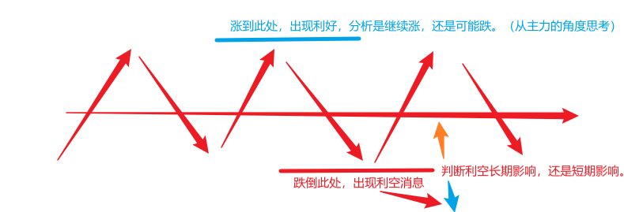

> 当然利好利空有的时候不用较真，有时候你看到的是别人想让你看到的。可以先从技术面分析，然后下单前参考基本面，看是否存在很大的问题即可。

- 公司重大事件纰漏

精选两市上市公司的最新重大事件曝光，先知先行

- 焦点政策要闻点评

最新最热政策，把我下个投资点

- 分红配送提示

两市最新分红配送提示，淘金短线题材，把握个股状况。

### 商品的基本分析

- 商品的价格

商品的价格最终反映的必然是供求双方力量均衡点的价格。

- 本期产量

指年度和本季度的商品生产量，影响因素很复杂。需要对影响因素具体分析，以便较为准确的把我其可能的变动。


### 宏观经济

长期和根本上，股票走势由一国经济发展水平和经济景气状况所决定的。

股票市场价格有一定的超前，被称为宏观经济的晴雨表。

### 利率水平

银行的利息，利率上升资金吸引到银行存储，减少股票市场的资金量，对股价有一定的影响。

同时由于利率上升，企业经营成本增加，利润减少，股票价格也会有所下降。

反之利率降低，可能会将资金投到股市，从而刺激股票价格的上涨。

同时由于利率降低，企业经营成本降低，利润增加，也会促使股票价格上涨。

但对于银行来说，利率上升，如果存贷息差加大，银行可以通过调整存贷比例，增加贷款额从而实现净利润将增加，形成利好。

> 如果本金大，一个点的利率都是很多的，要对数字敏感。

### 通货膨胀

有利有弊，总的弊大于利，他会推动股市的泡沫成分增大。

再通货膨胀初期，由于货币增加会刺激生产和雄安飞，增加企业的盈利，从而促使股票价格上涨。

但通货膨胀到了一定程度时，将会推动利率上扬，从而促使股市下跌。

> 某种程度上，有泡沫才有吸引力，比如房价

### 企业素质

影响其价位高低的主要因素在企业本身的内在素质，包括财务状况，经营情况，管理水平，技术能力，市场大小，行业特点，发展潜力等系列因素。

### 行业因素

行业在国民经济中地位的变更，行业的发展前景和发展潜力，新兴行业引来的冲击等，以及上市公司在行业中所处的位置，经济业绩，经营情况，资金组合的改变及领导层人事变动等都会影响相关股票的价格。

### 心理素质

股民在受到各个方面的影响后产生心理状态改变，往往导致情绪波动，判断失误，做出盲目追随大户，狂抛抢购行为，这往往也是引起股价狂跌暴涨的重要因素。

散户和主力的区别在于，买入的时间点不同。别人恐惧我贪婪，被人贪婪我恐惧。散户很容易低位不买，去追高，就很容易造成买了就跌，卖了就涨的情况。

## 分析技巧

### 主营分析

主营是否突出，利润是否有足够的空间。

需要考虑主营之间是否存在相关性，是否有上下游关系，或者可以共享市场，技术，服务等资源；

利润空间除了主要看主业的毛利润空间，还要看净利润 空间有多大。要特别关注公司的主营业务构成和主营业务的净利润情况。

### 盈利分析

如果年度指标下降，往往是公司长期经营转向劣势的标志。

下降的时候，要看公司的规模是否扩大，是否能保证总利润或净利润不变，当公司盈利上升时，一般要消除偶然因素或季节性因素的影响，再判断盈利是否可以持续上升。

市盈率是每股收益多少，但是是经过层层包装后的，是会变动的。

> 尽量选市盈率低的

### 规模分析

先看公司的收入规模，利润规模

再看公司做大的时候是否做强

再看公司是否有足够的拓展空间

关注公司的主营业务收入和净利润

看规模中往往可以挖掘行业的龙头，一些企业特别是中小型企业面临共性问题，上市以后发展的空间有多大，企业上市后除了能够拥有融资渠道，其他的成本，比如劳动力的成本，管理的成本等等必然增加，反过来会压缩这些企业的利润空间，降低企业的竞争力。

> 能买龙头就买龙头

### 效率分析

1.看增产、增效

2.看中间费用(营业费用、管理费用、财务费用)有没有吞噬利润

3.看员工效率(体现企业管理水平)

### 家底分析

买公司，除了看公司的盈利能力，也再买公司的资产。

可以将上市公司分为三种类型的公司，殷实型的公司，虚胖型的公司，破落型的公司。

再看公司家底要关注公司的资产状况，尤其是流动资产状况。

虚胖型的公司表面的资产庞大，但是可能是看银行借的钱撑起来的牌面。资金链出现问题，就会出问题。

### 同期分析

1.营业性周期，比如高档酒行业总在每年的4、1季度收入较高

2.账务性周期，比如依赖投资收益并表的公司总在2、4季度反映经营业务较好。

> 就好比招聘的金三银四，金九银十。股票主营业务有可能跟季节有关系

### 负债分析

指公司对外的欠款，比如银行，供应商。

1.企业负债程度，一般30%-50%是比较合理的负债度

2.企业的预收帐款变化情况，预收款是一种企业负债，将来要用产品和服务归坏，但繁殖，如果预收款大幅上升，说明企业产品销路转好，客户需预付才能提货，从另一个角度说明公司经营改善。（03年的钢铁股行情）

> 负债投资是一把双刃剑，并不是绝对的坏，主要还是看公司的经营，马云当初也借了不少钱。

### 控盘分析

1.高度控盘：庄股，近几年庄股暴仓，股民谈仓色变。如果高控盘的基本年是阳光资金，可以长期关注。

2.中度控盘：往往是行情的第二冲击波

3.缺乏关注：要判断基本面行不行

## 盘面基础

### 基础信息说明

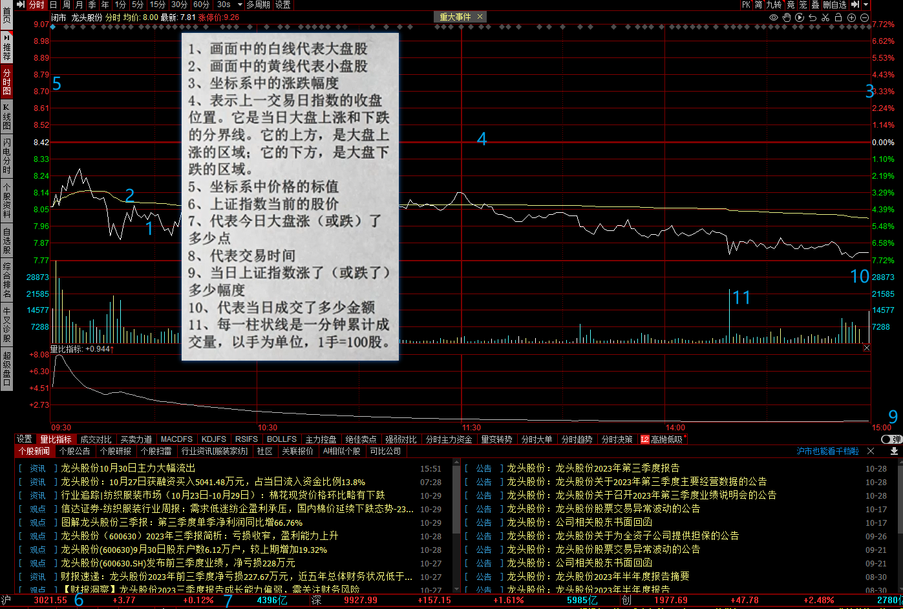

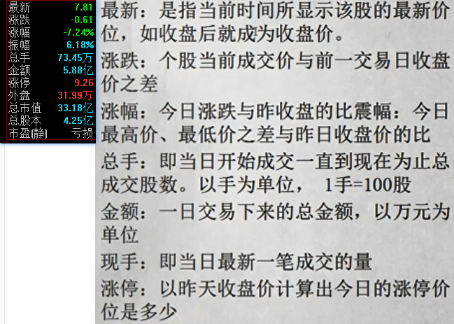

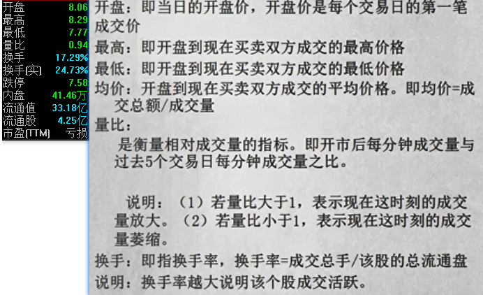

市盈率

市盈率：当今市场价/近期八期年每股收益

交易量手数↑

交易量

交易量：今天收市系数。

昨收

昨收（上证指数）：上一工作日的收市系数。

跌涨

跌涨：一览-昨收

开盘

升幅

升幅：跌涨/昨收

震幅

震幅%：（最大-最少）/昨收

现手

现手：早已交易量的一览大笔交易手数。

量比

量比：是考量取决于交易量的指数，是开市后一分钟交易量与以往5个工作日一分钟交易量比为。


### 委比

委比时委买手数、委卖手数之差与之和的比值，它是衡量一段时间内内场内买、卖强弱的一种技术指标。

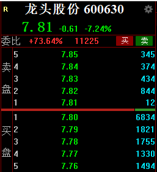

卖一、卖二、卖三、卖四、卖五表达已受托但并未交易量的受托价最少的五笔售出价钱以及总数，列举卖一为最少申卖价钱。

买一、买二、买三、买四、买五表达已受托但并未交易量的受托价最大的五笔买入价钱以及总数。列举买一为最大申买价钱。

委买手数：某股当今受托买进五档（买一、买二、买三、买四、买五）手数相加。

委卖手数：某股当今受托售出五档（卖一、卖二、卖三、卖四、卖五）手数相加。

委比计算公式：委比=(委买手数-委卖手数)/(委买手数+委卖手数)X100%

委差计算公式：委买手数相加－委卖手数相加

说明：

- 当委比值为正值时，表示买方比卖方强
- 当委比值为负值时，表示卖方比买方强

> 这个指标只是看一时/当日的。比如卖方比买方强的时候，可以适当考虑获利了结

### 内盘外盘

- 外盘

成交价在卖出价叫外盘，当成交价在卖出价时，将现手数量加入外盘累计数量中，

**当外盘累计数量比内盘累计数量大很多，而股价上涨时，表示很多人在抢盘买入股票**

- 内盘

成交价在买入价叫内盘，当成交价在买入价时，将现手数量加入内盘累计数量中，

**当内盘累计数量比外盘累计数量大很多，而股价下跌时，表示很多人在抛盘**

#### 外盘内盘操作策略

> 介绍2种利用内盘外盘制造假象的情景。

**情况一：当某只股票在低位横盘，机构投资者吸筹阶段（内盘>外盘,日后却走出大行情）**

操作手法：机构投资者用大单托住股价，并在若干个价位上用更大单压住股价

->许多人被大卖单所迷惑，或经不起长期的横盘，于是一点点地卖出（主动性卖盘，记入内盘），此时机构投资者并不急于抬高价位，只是一点点承接（散户里有少数人看到股价已无深跌可能，偶尔比机构投资者打高一点少量买入，形成一点点外盘），造成**内盘较外盘大**，给投资者制造下行的假象。

> 股票跌倒一个位置的时候，我们要分清主力在里面的动作，是在吸筹，还是在减持。
>
> ps: 由于机构资金雄厚，吸筹布局1-2年都是有的。

**情况二：当股价经过充分炒作之后已经高高在上了，机构投资者准备出货。（外盘>内盘，日后股价却不断探低）**

操作手法：机构投资者用大买单赶着散户往上冲，而他一点点的出货，出掉一些后把价位再抬上去，散户竞相抢筹，甚至立即撤单高价追赶，不买到誓不罢休，这个时候的**外盘就远大于内盘**了，给投资者制造上行的假象

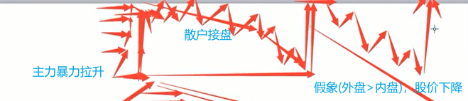

*散户高位接盘，被套牢了，当然，可能涨吗？可能，但是可能性较小。*

*股票获利的基本逻辑：低买高卖！*

*股票获利的第二逻辑：站在主力的角度分析股票，跟着主力买卖*

**情况三：当股票沿着一定斜率波浪上升**

1.当每一波的高点之前，多是外盘强于内盘，盘中常见大买单层层推进或不停地有主动买盘介入，股价在冲刺过程中，价量齐升，此时应注意**逐步逢高减磅**，而当股价见顶回落时，内盘就强于外盘了，**此时更应及时离场。**

2.随后，股价有一定跌幅，收到某一均线的支持，虽然内盘仍强于外盘，但股价已不再下跌，盘中常见大买单横在那，虽然不往上抬，但有多少接多少，这就是所谓**逢低吸纳**了，可少量参与。（也就是上涨中的回调）

**情况四：当股价运行在下降通道**

1.当股票沿着一定斜率波浪下降时，大多数情况下都是内盘大于外盘，显然不参与。


2.至于箱型震荡股，由于成交量往往呈有规律的放大和缩小，因此介入和退出的时机较好把握，借助内外盘做判断的特征大致和走上升通道的股票操作思路一致。

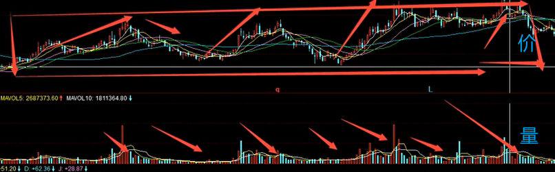


3.窄幅盘整的股，则往往伴随**成交量**的大幅萎缩，内外盘的参考意义不大。

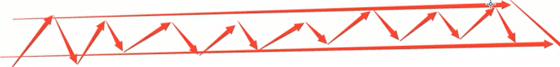

**情况五：涨停和跌停时的内盘和外盘**

此时比较特殊

不能因为内盘远大于外盘，就判断走势欠佳，

不能因为外盘远大于内盘，就判断走势强劲


> 内盘和外盘的大小对判断股票的走势有一定的帮助，但是一定要同时结合股价所处的位置和成交量，即要把握内盘外盘给我们操作带来的提示，又不能过分注重这些细节而忽略了大势，尤其特别注意的时机构投资者吸筹和出货两种情况。

### K线图

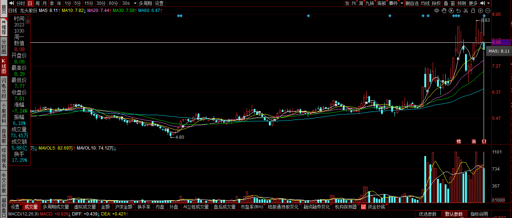

如果要该线的颜色，推荐的配置如下：

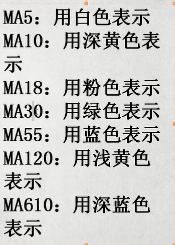


### 换手率

#### 换手率基础介绍

> 换手率：（当今交易量总计/流通股数）×100％

1.换手率太低，说明成交不活跃，如果是庄股，则说明筹码已基本集中到主力手中，浮筹不多

2.换手率高，说明交投踊跃，反映主力大量吸货，有较大的活跃度，今后拉高可能性大。

注意事项：

一个上升波段的较好的换手率标准在5%左右。

小于这个数，说明交投不够活跃，太大则有主力出货嫌疑。

若日换手率超过10%，就要格外小心，主力出货迹象已相当明显了。

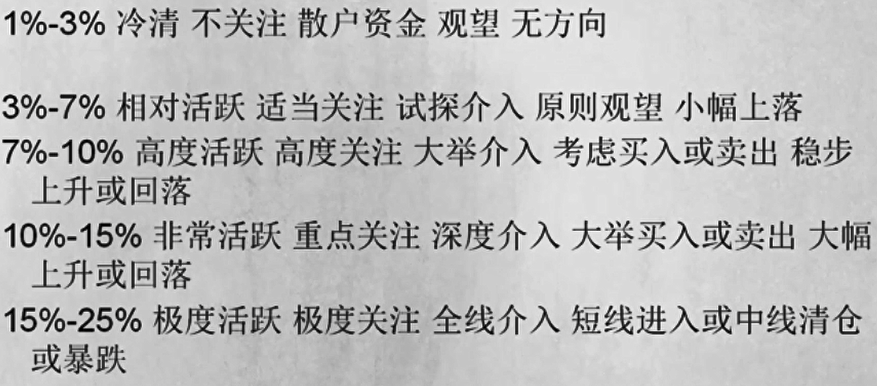

1%-3%：

3%-7%:

7%-10%:

10%-15%:

15%-25%:

换手率是指某只股票在一定时间内成交的股数与其流通股本之间的比值

简单说就是，换手率高的股票，说明资金进入量相对较多，属于热门股。

反之，换手率低的股票，说明资金进入量相对较少，属于冷门股。

换手率高低是一个相对数值，判定有几种分类：

- 按照大市场的活跃度来区分

熊市(差)日平均换手，个股表现在2%。大于2%，可视为换手率高的股票

在熊市里，换手率的高低与股票价格成正比，股价随着换手率提高上涨，随换手率降低而下降。

- 按照流通盘的大小来区分

股本的大小对于换手率有着决定性的意义。

20个亿以上的流通股，换手大于5%，算换手率高

5-20个亿，换手大于10%

1-5个亿，换手大于15%

1个亿以下，大于20%-30%

> 换手率高低只是一个参考指标，不是决定性的因素，庄家可能用换手率迷惑投资者。
>
> 但是有一点，换手率高，这只股票近期一定是比较活跃的，关注度比较高。

#### 如何利用换手率选股

单纯利用换手率数值来选股，是不可取的，但是换手率跟均线一样，作为指标里的万金油。在实战当中，对于一档个股是否买入，是否在回调，是否卖出，有着非常重要的决定意义。

*简单的说，如果某一个人的炒股正确率70%，加入换手率的判断后，可以提交15%*

根据**强者恒强**的原则，换手率越高代表资金的热点越高的原理。我们在操作，就是喜爱操作庄股/短线的朋友，对于换手的选择，只有一个标准：**选择换手率高的股票。**

选择众多庄家持有的，换手高的股票。

相对于单个的庄家，控股能力强，在目前市场监管较严的情况下，很容易受到打压。多庄家的轮换，第一保证该股的资金充沛，第二后期的回报往往更加丰厚。

**选择一段时间**，而不是两天之内的换手，单天的换手能够敲定买卖，但不能决定买点。

如果只是一两天的换手高，多有借消息拉高出货的迹象，这类型的股票风险自然不言而喻。因此在操作中选择一段时间内的换手率活跃而且逐渐增加的股票，这类股票的发动行情时涨幅要高于大盘，且更能走出独立于大盘的行情。（中线机构个股的早期选择标准之一）

#### 换手率和强庄股的关系

换手率高不仅仅说明交投的活跃，还表面交易者之间的换手充分程度。换手率也变成机构作假成本最高的一个指标。

主力只能引导换手率，但不能决定换手率，换手率是对资金最真实的反应。

**因此，学会看清换手率和强庄股的关系是我们在运用涨停板战法或者超短线方法去捕捉妖股不可避免的参考指标。**

**规律：**

1，当一只股票的换手持续在**3％～7％**之间，说明该股已经进入相对活跃的状态。如果配合量能，尤其是经过长期的单边**下跌**时。这个阶段通常是**主力吸纳筹码聚集人气的时段**。

2，**7％～10％**的日换手率是在**强势股**经常出现的状况。属于股价走势的高度活跃状态，一般来说，这些股票正在被市场重点关注。所以**当某日走出缩量换手缩小的洗盘时，是我们短线进入时机**，因为主力出货需要更大的换手，**洗盘清洗浮筹**就是我们去**参与最后冲刺行情的机会**。

3，日换手率**10％～15％**的股票如果不是在上升的历史高区或者见中长期顶的时段，则意味着强庄股的大举运作，若**其后出现大幅的回调**，在回调过程中满足**日最小成交量或者成交量的三分之一**则可以**追入**。

4，当一只个股出现超过**15％**的日换手率后，能够保持在当日密集成交区附近运行，则说明该股后市具潜在的极大的上升能量，是超级强庄股的技术特征，因而后市**有机会成为市场中最大的黑马**。


**相对高位成交量突然放大**

属于主力派发的意愿是很明显，高位能放量来说是很不容易的事情，首先主力底仓的筹码依旧较集中，伴随一些利好出台，主力才能够顺利的完成底部筹码的派发从而获利出局。

**新股**

上市之初新股有活跃的换手率是正常的事，随着市场的变化，新股上市后高开低走成为现实，所以，新股的换手率高不一定代表能上涨。

**底部放量**

价位不高的强势股，尤其以往较为活跃的，其换手率的活跃的可信程度较高，说明，新资金的介入迹象很明显，上行中的抛压越轻。此外，目前股市的特点是局部的反弹行情，换手率高有望成为强势股，强势股就代表了市场的热点，从底部换手的活跃我们就能看出，市场的资金热点走向哪里。

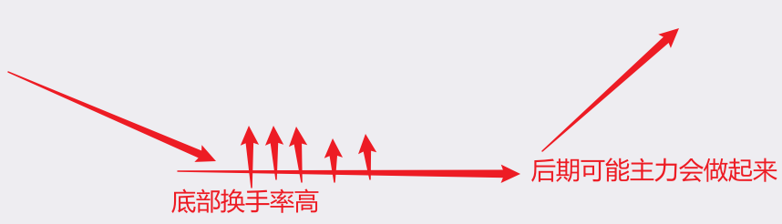

#### 为什么要看换手率

量能是股市的唯一标准，而成交量是主力最容易操控的指标，通过倒手换仓，就能做出缩量与放量。而换手是对成交量的科学，理想的标准。

成交量图的绘制，在电脑是自动调整的，如果我们看到一根较长的柱子就认为是放量，而不去仔细研究就可能把小量当成大量，观察换手率数据后，就会得出正确的结论。

#### 实际运用中的注意事项

主力吸筹往往在筹码分布上留下一个低位密集区，在大多数情况下，主力完成低位吸筹之后并不急于拉抬，甚至主力要把股价故意再打到低位密集区的下方，因为这个地方没有抛压，护盘容易，一旦时机成熟，股价形成对筹码密集区的向上穿越。主力巨量持仓的话，盘面上就不会出现太多的解套抛压，从而形成后期的，缩量(无量)推高，缩量涨停，这时已形成主力的高度控盘。股票换手的持续性问题：

- 如果一直股票突然在底部放大只有一天，并不能说明任何问题，反而是很危险的信号，应该卖出。
- 如果在高位突然放大只有一天，也不能说明任何问题，要看是否能持续，持续的递增的高位换手是一只黑马的前兆。

#### 如何用换手率计算庄家成本

首先我们要知道市场庄家的分类。

在我们的市场当中，绝大部分都是中线庄家，其控盘程度大约在40%～60%之间。是相对控盘的区间。

超过60%的流通筹码的控盘的绝对控盘都属于长线庄家。相对他们吸收筹码的时间要更久。

妖庄里面的游资资金从来都不是从头吃到尾，实力不够，都是接力上去的。因此这些人的成本相反是不必去计算的。

其中的计算过程在此省略，有兴趣的可以参考：

一般而言，股价在上涨时，庄家所占的成交量比率大约是30%左右，而在股价下跌时上庄家所占的比例大约是20%左右，但股价上涨时放量，下跌缩量，我们初步假设放量:缩量=2:1 ，这样我们可以得出一个推论，前提假设为若上涨时换手200%，则下跌时的换手则应是100%，这段时间总换手率为300%，则可得出庄家在这段时间内的持仓量=200%x30%—100%x20%=40%。**即换手率达到300%时，一档庄家的持仓量才达到40%**，即每换手100%时其持仓量为40%/300%x100%=13.3%， （任何公式估算带有一定误差）

所以我们把从**MACD开始金叉**的那一周开始(**周线**)，到你缩计算的那一周为止，把所有各周的成交量加起来再除以流通盘，可得出这段时间的换手在大量的买进，股价可能会随之上扬。如果某只股持续上涨了一个时期后的换手率，把这个换手率乘以13.3%得出的数字即庄家的控盘度。**所以一个中线控盘庄家的换手率应在300%～450%之间。只有足够的换手，庄家在能够吸足筹码**。**成本的计算，把这段时间的内的最低价加上最高价，除以2，即庄家成本。中线第一目标价位即=成本x(50%+1)，若庄家成本为10元，则第一目标价为15元。**

> 工具使用：可以直接选中区间范围，然后会有区间统计

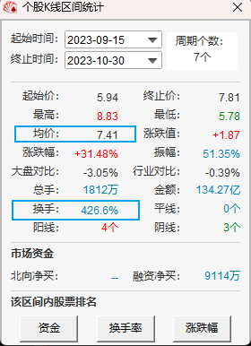

推荐换手400%以上(主力控盘在50%左右)，后期主力高仓位一定会让这只股票做起来的，这时继续持有就行了。

【总结】通过上面复杂的学习后，我们跟踪中线庄票时有几点的总结和分享
1，**周K线图对中线的参考意义最大**，周K线的均线系统开始由空头转为多头是证明庄家介入的信号。但是通常时间周期较长，所以我们在计算换手率，即计算庄家开始建仓的标志是：**周MACD指标金叉这也是计算换手的起点。**
2，**投资者要跟中线庄时，最好跟持仓量超过50%的庄家**

> 短线，一般交易1-5个交易日，一周以内都可以称为短线；
>
> 中线，一般交易3个月以内，这类可以称之为中线交易；
>
> 长线，一般指持有一年以上的交易者，这样可以称为长线

#### 什么情况下换手率大是好事

> 换手率实际上是一个比较复杂的内容，没有一个定量，没有一个公式，但是学习有所领悟之后能够非常有助于我们对主力的真实意图做一个准确的分析。希望大家都有所体悟。

次新的换手都比较大，因为一上市的个股往往都是个人中签，上市之后，换手很小，说明散户没有抛售，主力没有承接筹码
所以，次新股一开板的换手要大

换手越大说明主力筹码吸收越充分，后市越强悍。

案例：300649

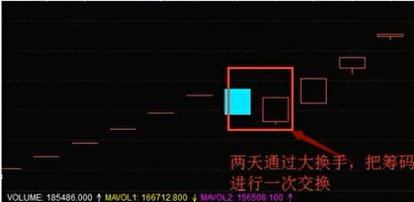

#### 什么情况下换手率小是好事

A，当一档个股的主力还要不断的拉升，脱离自己的成本价，就会保持一个相对小换手的推高和拉升，维持在3%-10%（还要识别流通股本的大小）
B，低位出现的不能出现大换手。当一档个股经过连续的下跌，主力已经完成吸筹过程的时候，为什么还会放出大换手？说明主力吸筹并未结束或上方抛压强烈

案例：600196

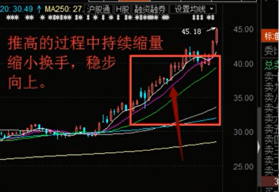

### 成交量

#### 成交量和价格的关系

##### 1.确认当前价格运行趋势

市场上行或下探，其趋势可以用**较大**的成交量或**日益增加**的成交量进行确认

逆趋势而行可以用成交量**日益缩减或清淡**成交量进行确认。

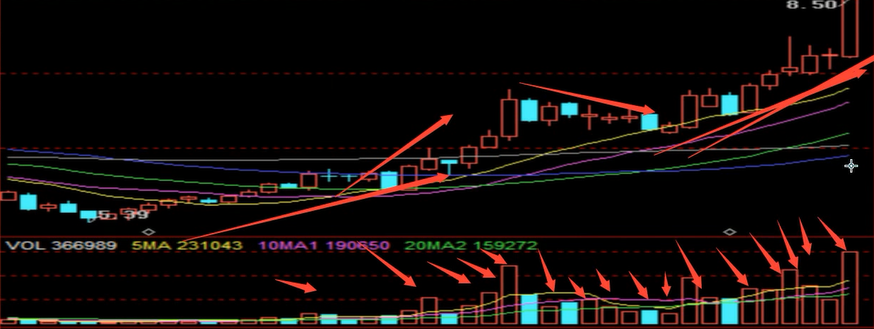

##### 2.趋势呈弱势的警告

如果市场成交量一直保持**锐减**，则警告目前趋势正开始**弱化**

尤其是市场在**清淡成交量**情况下**创新高或新低**，以上判断的准确性更高。在清单成交量情况下创新高或新低应该值得怀疑。

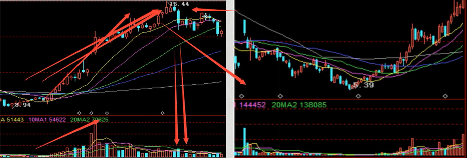

##### 3.区间突破的确认方法

市场失去运行趋势时即处于区间波动，创新高或新低即实现对区间的**突破**将伴随**成交量的急剧增加**。

价格得到突破但**缺乏成交量**的配合预示市场尚未真正改变当前运行区间，所以应多加谨慎。

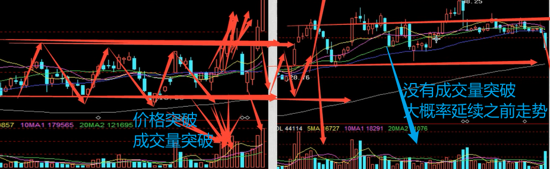

##### 4.股市成交量的部分看法

**a）成交量催化股价涨跌。一只股票成交量的大小，反映的是该股票对市场的吸引程度。**

当更多的人或更多的资金对股票未来看好时，他们就会投入资金；当更多的人或资金不看好股票未来时，他们就会卖出手中的股票，从而引起价格下跌。这是一个相对的过程，也就是说，不会所有的人对股票“一致地”看好或着坏

更深层的意义在于：股票处于不同的价格区域，看好的人和看淡的人数量会产生变化

**b）大多数人都有一个错误的看法：成交量越大，价格就越涨。**

要知道，对于任何一个买入者，必然有一个相对应的卖出者，无论在任何价格，都是如此。

在一个价格区域，如果成交量出乎意料地放大，只能说明在这个区域人们有非常大的分，比如50个人看，50个人看跌；如果成交量非常清淡，则说明有分的人很少或者人们对该股票毫不关心，比如5个人看，5个人看跌，90个人无动于或在观望

**c）可以从成交量变化分析某股票对市场的吸引程度**。

成交量越大，说明越有吸引力，以后的价格波动幅度可能会越大

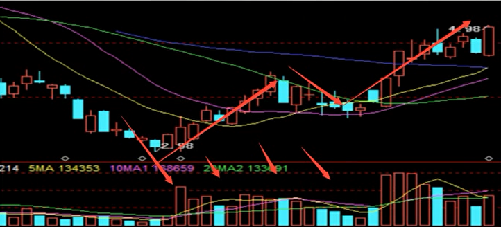

**d）可以从成交量变化分析某股票的价格压力和支撑区域。**

在一个价格区域如果成交量很大，说明该区域有很大的压力或支撑，超势将在这里产生停顿或反转。

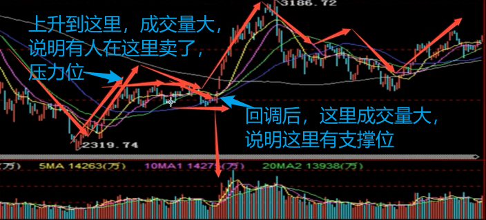

**e）可以观察价格走出成交密集区域的方向。**

当价格走出成交密集区，说明多空分得到了暂时的统一，如果是向上走，那价格倾向于上升；若向下走，则价格倾向于下跌。

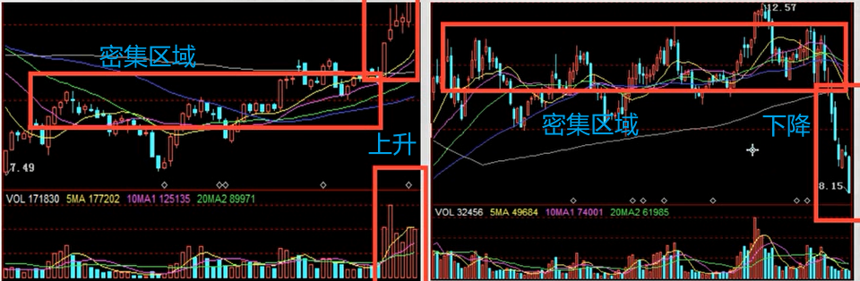

**f) 可以观察成交量在不同价格区域的相对值大小，来判断超势的健康性或持续性。**

随看某股票价格的上升，成交量应呈现阶梯性减弱，一般来说，股票相应的价格越高，感兴趣或敢于参与的人就相应越少。不过这一点，从成交额的角度来看，会更加简单扼要。

**g）仅仅根据成交量，并不能判断价格趋势的变化，至少还要有价格来确认。**

成交量是价格变化的一个重要因素之一，也是一个可能引起本质变动的因素，但是在大多数时候，只起到催化剂的作用

**h）市场上有这样一种认识，认为个股或股指的上涨，必须要有量能的配合**

如果是价升量增，则表示上涨动能充足，预示个股或股指将继续上涨；

反之，如果缩量上涨，则视为无量空涨，量价配合不理想，预示个股或股指不会有较大的上升空间或难以持续上行

> 也是一个辅助指标，不能单独使用


## k线基础

> 技术分析的根本：根据K线图形来分析是很受限制的，要结合大势，依据所处趋势的末期、中期、以及周围的k线形态才能判定。

### k线定义

> 每一种k线都有他独特的意义

K线图这种图表源处于日本，被当时日本市的商人用来记录来市的行情与价格波动，后因其细腻独到的标画方式而被引入到股市及期货市场。日前，这种图表分析法在我国以至整个东南亚地区为流行。由于用这种方法绘制出来的图表形状颜似一根根蜡烛，加上这些蜡烛有黑白之分，因而也叫阴阳线图表。通过K线图，我们能够把每日或某一周期的市况表现完全记录下来。

实体：开盘价和收盘价之间的波幅

影线：上涨/下跌过程被折回后的痕迹，上影线表示股价上涨动能遭到阻挠与反抗；下影线表示股价下跌动能遭到阻挠和反抗。上下影线的长度和反抗的力度成正比。

> 开盘和收盘价决定了实体的大小，最高价和最低价与开盘收盘价格的距离决定了上下影线的长短。

K线从形态上可分为阳线，阴线和同价线3种类型。

阳线是指收盘价高于开盘价的K线，阳线接其实体大小可以分为大阳线、中阳线和小阳线。

阴线是指收盘价低于开盘价的K线，阴线按其实体大小可以分为大阴线、中阴线和小阴线。同价线是指收盘价等于开盘价，两者处于同一个价位的一种特殊形式的K线。

同价线常以“十”字形和“T字形表现出来，故称十字线、T字线。同价线按上下影线的长短、有无，又可以分为长十字线、十字线和T字线、倒T字线一字线等。

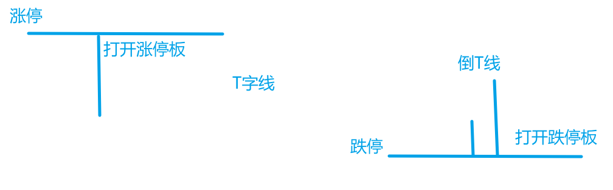

K线从时间上可以分为日K线、周K线、月K线、年K线以及将一日内交易时间分成若干等分，如5分钟K线、15分钟K线、30分钟K线、60分钟K线等

日K线（即我们经常在报刊杂志上看到的一种K线）。它反映的是股价短期走势。
周K线、月K线、年K线反映的是股价中长期走势。

> 日k容易人为制造技术陷阱，周K反映一周交易情况，不容易被伪造，就算日k被伪造，也会在周k上被过滤或烫平。
>
> 一般我们对于确定买卖时机，先分析周k是否安全，再分析日k的组合和量价关系配合是否合理。然后才能在合适的时机选择具体的操作。

5分钟K线、15分钟K线、30分钟K线、60分钟K线反映的是股价超短期的走势。

它们的绘制方法都和日K线绘制方法相同，即取某一时段的开盘价、收盘价、最高价、最低价进行绘制。例如周K线，只要找到周一的开盘价、周五的收盘价，一周中的最高价和最低价就能绘制出来。

> 日K、周K最常用，分钟k、月k周期过短/过长，实盘操作中一般较少使用
>
> 当然，也不能小瞧1分钟K线，5分钟k线，实际上他们在短线/超短线中可以看出一些合适的买卖点

> **k线形态是结果，成交量是动因，一定要配合成交量来看k线**

### 单根k线

- 根据K线的计算周期可将其分为日K线，周K线，月K线，年K线。

众多分析软件提供的5分钟K线15分钟K线、30分钟K线和60分钟K线也具有重要的参考价值。

- 根据开盘价与收盘价的波动范围，可将线分为阳星、小阴星，小阴、小阳，中阴中阳和大阴、大阳等线型。

它们一般的波动范围（如图所示）。

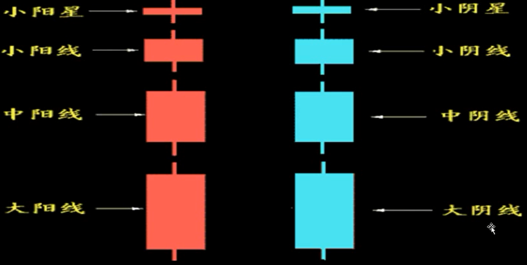

实体是重要的价格参考区间

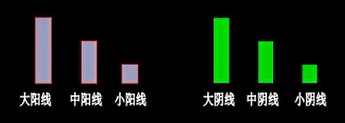

开盘价、收盘价一致证明多空力量大致相等，价格变化一般会保持原有趋势的方向。

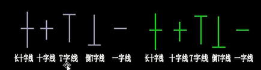

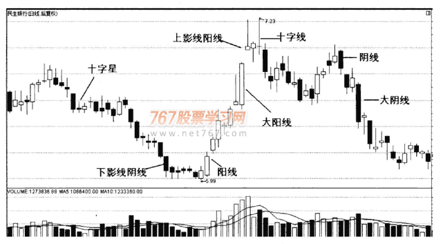

我们结合分时图时走势图，分别说明几种常见的单个日K线图的形成过程和不同含义。分时走势图记录了股价的全天走势，不同的走势形成了不同种类的K线，而同一种K线却因股价走势不同而各具不同的含义。

> 我们后期一般是看k线的组合图形

#### 小阳星单k线分析：

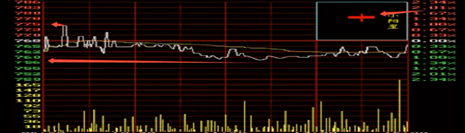

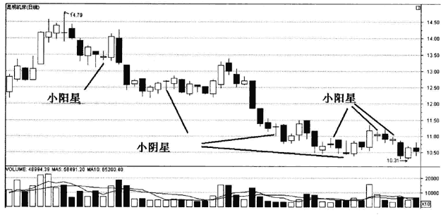

这种图形表示：全日中股价波动很小，开盘价与收盘价极其接近，收盘价略高于开盘价。如果收盘价等于开盘价，此时的K线图也称为阳十字星。

小阳星的出现，表明**行情正处于混乱不明的阶段，后市的涨跌无法预测**，此时要根据其前期K线组合的形状以及当时所处的价位区域综合判断。

> 高位谨慎，低位看涨可能性较高

#### 小阴星单k线分析：

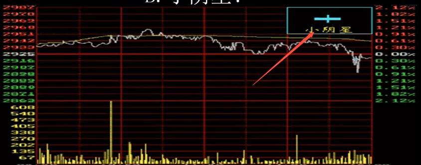

小阴星的分时走势图与小阳星相似，只是收盘价格略低于开盘价格。

**表明行情疲软，发展方向不明。**同样，如果收盘价等于开盘价，此时的K线图也称为阴十字星。

> 小阳星、小阴星: 如果高位，建议暂避风险，如果低位，建议考虑入手。

#### 小阳线单k线分析：

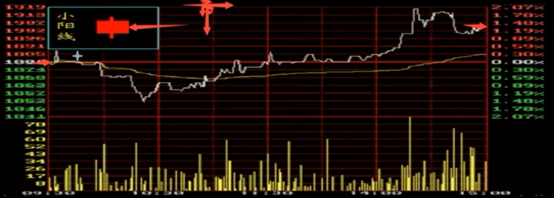

其波动范围较小阳星增大，多头稍占上分，但上攻乏力，**表明行情发展扑朔迷离。**

> 如果主力对后期看好，也就不会只是拉一个小阳线，而是大量买进，至少一个中阳线。

#### 上吊阳线单k线分析：

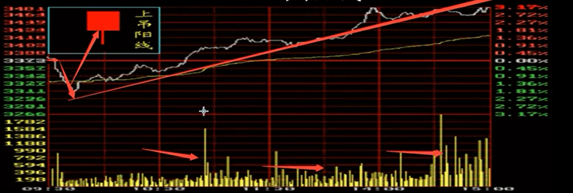

如果在低价位区域出现上吊阳线，如图所示，股价表现出探底过程中成交量缩，随着股价的逐步攀高，成交量呈均匀放大事态，并最终以阳线报收，预示**后市股价看涨。**

#### 下影阳线单k线分析：

反映了空方曾于盘中发起过攻击，但却并未保住胜果，且下影线越长，则空方的攻击力度越大，但攻击后所保住的胜果也越少。

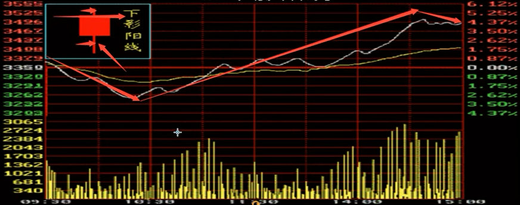

它的出现，表明多空交战中多方的攻击沉稳有力，**股价先跌后涨，行情有进一步上涨的潜力**

#### 上影阳线单k线分析：

反映了多方曾于盘中发起过攻击，但却并未保住胜果，且上影线越长，则多方的攻击力度越大，但攻击后所保住的胜果也越少。

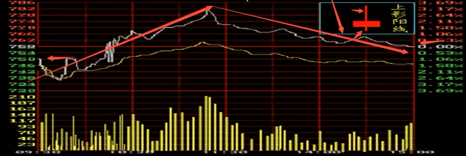

显示多方攻击时上方抛压沉重。这种图形常见于主力的试盘动作，说明此时浮动筹码较多，**涨势不强。**

主力在上涨过程中，抛压解套，或者是获利盘。就是高位有人在不停的卖。

常见于股票下跌，上涨，过程中，V字型。解套盘，和获利盘的压力位。我们在上涨过程中遇到这种的，尽可能远离，获利了结也不是坏事，如果是股票关注很久了，遇到这种的，可以再看看。不急于入场。要关注上涨过程中的压力位

> 长上影线一定要特别警觉，观察(30分钟)MACD或者其他辅助线，看是不是庄家在拉高出货

#### 穿头破脚阳线单k线分析：

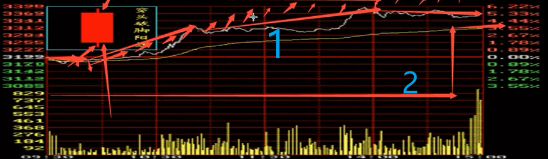

股价走出如图所示的图形说明多方已占据优势，并出现逐波上攻行情，股价在成交量的配合下稳步升高，预示**后市看涨。**

同样为穿头破脚阳线，股价走势若表现出在全日多数时间内横盘或者盘跌而尾市突然拉高时，预示次日可能跳空高开后低走。

还有一种情况，股价走势若表现为全日宽幅振荡尾市放量拉升收阳时，可能是当日主力通过振荡洗盘驱坐轿客，然后轻松拉高，后可能**继续看涨。**

#### 光头阳线单k线分析：

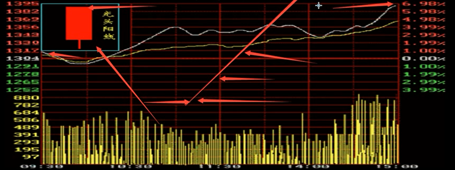

光头阳线若出现在低价位区域，在分时走势图上表现为股价探底后浪走高且成交量同时放大，预示为一轮上升行情的开始。如果出现在上升行情途中，表明**后市继续看好。**

#### 光脚阳线单k线分析：

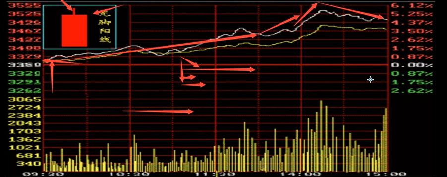

表示上升势头很强，但再高位处多空双方有分歧，购买时应谨慎。**(低位可以，高位谨慎)**

#### 上影阳线单k线分析：

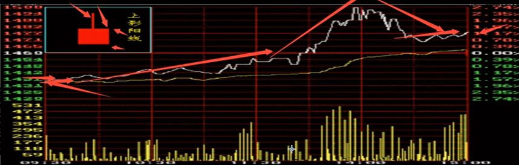

这是一种带上影线的红实体。开盘价即最低价。一开盘买方强盛，价位一路上推，但在高价位遇卖方压力，使股价上升受阻。卖方与买方交战结果为买方略胜一筹。

具体情况仍应观察实体与影线的长短。果红实体比影线长，就属于光脚阳线，表示买方在高价位是遇到阻力，部分多头获利回吐，实体与影线同长，买方把价位上推，但卖方压力也在增加。二者交战结果，卖方把价位压回一半，买方虽占优势。但显然不如其优势大。如果实体比影线短。在高价位遇卖方的压力卖方全面反击，买方受到严重考验。大多短线投资者纷纷获利回吐，在当日交战结束后，卖方已收回大部分失地。买方一块小小的堡垒（实体部分）将很快被消灭，**这种K线如出现在高价区，则后市看跌。**

#### 光头光脚阳线单k线分析：

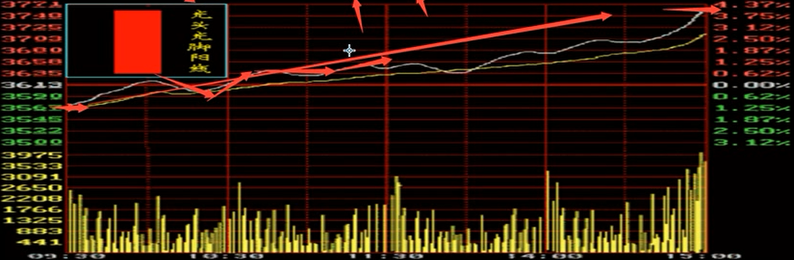

此种图表示最高价与收盘价相同，最低价与开盘价一样。上下没有影线。从一开盘，买方就积极进攻，中间也可能出现买方与卖方的斗争，但买方发挥最大力量一直到收盘。买方始终占优势，使价格一路上扬，直至收盘。表示强烈的涨势，股市呈现高潮，买方疯狂涌进，不限价买进。握有股票者，因看到买气的旺盛，不愿抛售，出现供不应求的状况

#### 小阴线单k线分析：

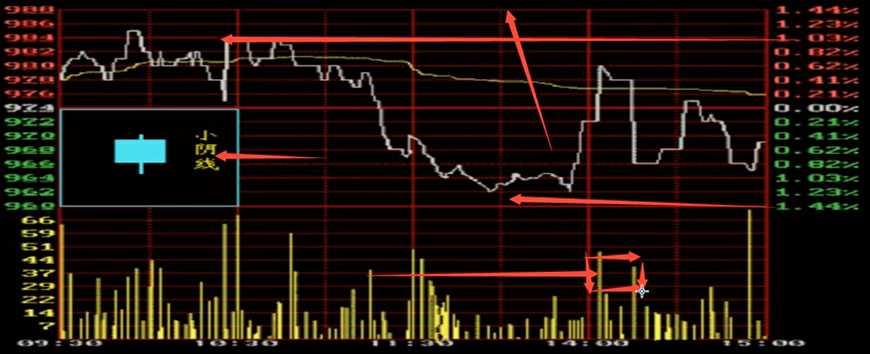

**表示空方呈打压势态，但力度不大。**

#### 光脚阴线单k线分析：

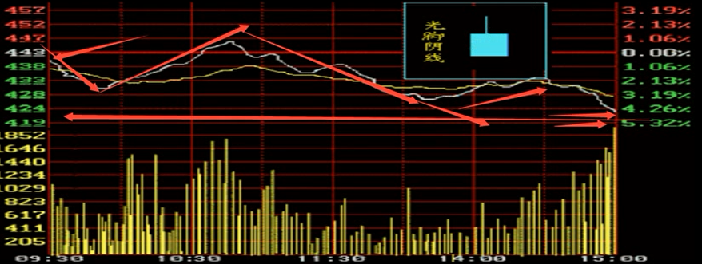

光脚阴线的出现表示股价虽有反弹，**但上档抛压沉重**，空方趁势打压使股价以阴线报收。

空方占据优势，多方物理抵抗，股价跌势强烈，次日低开可能性比较大。如果高位，建议回避风险

#### 光头阴线单k线分析：

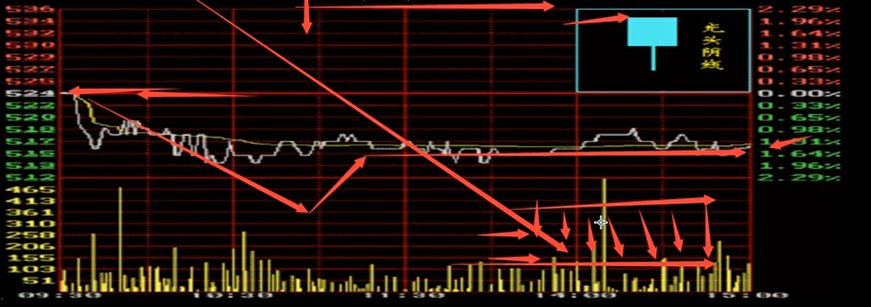

这是一种带下影线的黑实体，开盘价是最高价。一开盘卖方力量就特别大，价位一直下跌，但在低价位上遇到买方的支撑。**后市可能会反弹，但力度不大。**

#### 下影十字星，T形线单k线分析：

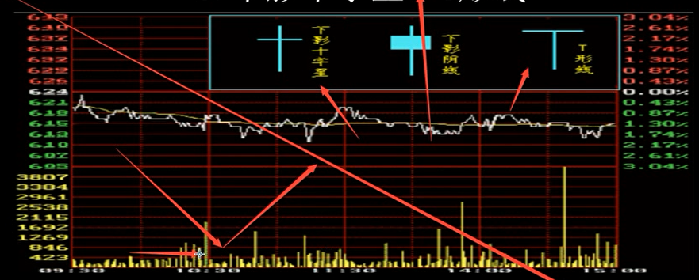

这3中线型中的任何一种**出现再低价位区时，都说明下档承接力较强，股价有反弹的可能。**

#### 上影阴线、倒T型线单k线分析:

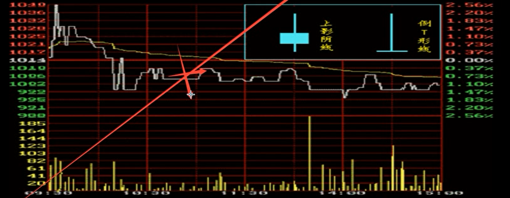

这两种线型中的任何一种**出现在高价位区时，说明上档抛压严重，行情疲软，股价有反转下跌的可能**；**如果出现在中价位区的上升途中，则表明后市仍有上升空间**。

#### 大阴线单k线分析:

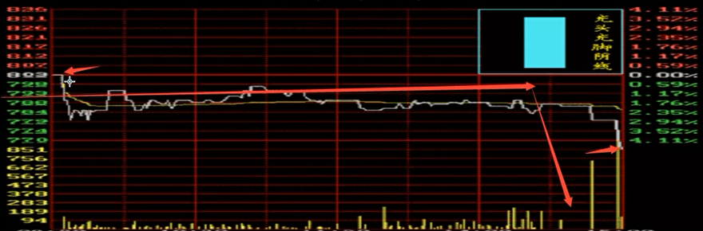

股价横盘一日，尾盘突然放量下攻，表明空方在一日交战中最终占据了主导优势，次日低开的可能性较大。

如果股价走出如图所示的逐波下跌的行情，这说明空方已占尽优势，多方无力抵抗，**股价被逐步打低，后市看淡。**

### K线组合定义

> 买进卖出的信号

第一类为上升形态和见底形态。即当这种K线或者K线组合出现或者表示股价要上涨，或者表示股价已经见底。

第二类为下跌形态和上涨结束形态。即当这种K线或者K线组合出现，或者表示股价要下跌，或者表示股价上涨已经遇到强大的阻力，短期内走势会转弱。

第三类既是上升形态又是下跌形态即这种K线，K线组合在某种场合出现，它表示股价要上涨。而在另一种场合出现，则表示股价要下跌。

### k线组合：上升形态和见底形态

> 买入信号，站在主力角度考虑问题，为什么几天下来是走出这种图形

#### 早晨十字星/希望十字星

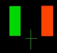

**出现在下跌的途中**

有3跟K线组成，第一根是阴线，第二根是十字线，第三根是阳线第三根K线实体深入到第一根K线实体之内

> 技术含义：见底信号、后市看涨

#### 早晨之星/希望之星

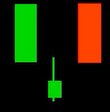

和早晨十字星相似，区别在于早晨十字星的第二根K线是字线

而早晨之星的第二根K线是**小阴线或小阳线**。

> 技术含义：见底信号、后市看涨。

信号不如早晨十字星强

#### 好友反攻

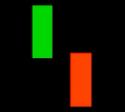

（1）出现在下跌行情中

（2）由一根阳线、一根阴线两根K线组

（3）先是一根大阴 ，接着跳低开盘，结果收了一根中阳线或大阳线，并且收在前一根K线收盘价相同接近的位置上。(第二天低开强势反弹)

> 技术含义：见底信号、后市看涨

转势信号不如曙光初现强

#### 曙光初现

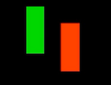

(1) 出现在下跌趋势中

(2) 由一阳一阴两根K线组成
(3) 先是出现一根大阴线或者中阴线接着出现一根大阳线者中阳线。阳线的实体深入到阴线实体的二分之一以上处。

> 技术含义： 见底信号、后市看涨

阳线实体深入阴线实体的部分越多，转市信号越强。

#### 旭日东升

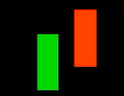

(1) 出现在下跌趋势中
(2）由一阳一阴两根K线组成
(3) 先是一根大阴线或者中阴线，接着出现一根高开的大阳线或中阳线。阳线的收盘价已高于前一根阳线的开盘价。

> 技术含义：见底信号、后市看涨

阳线实体深入阴线实体部分越多，转势

信号越强。见底信号强于曙光初现

#### 倒锤头线

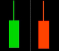

（1）出现在下跌途中
（2）阳线.（可以是阴线）实体很小，上影线大于等于实体的两倍
（3）一般无下影线，少数会略有一点下影线

> 技术含义： 见底信号、后市看涨

实体于上影线比例约悬殊，信号越有参考价值。如倒锤头于早晨之星同时出现，见底信号就更加可靠。

#### 锤头线

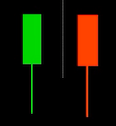

（1）出现在下跌途中
（2）阳线（亦可以是阴线）实体很小，影线大于等于实体的两倍
（3）一般无上影线，少数会略有一点上影线。

> 技术含义：见底信号、后市看涨

实体于上影线比例，信号越有参考价值

如锤头于早晨之星同时出现，见底信号就更加可靠。

#### 平底/倒锤线

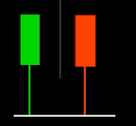

  （1）在下跌超势中出现
  （2）由两根或两根以上K线组成
  （3）最低位处在同一水平

> 技术含义：见底信号、后市看涨

#### 塔型底

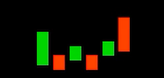

 （1）在下跌超势中出现
 （2）先是一根大阴线或中阴线，后为一串小阴小阳线，最后出现一根大阳线或中阳线

> 技术含义： 见底信号、后市看涨

#### 圆底(是否补回)

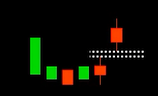

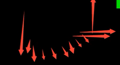

（1）在下跌中出现

（2）价格形成一个圆弧底

（3）圆弧内的K线多为小阴小阳线，最后以上跳空缺口来确定圆底形态成立

> 技术含义：见底信号、后市看涨与技术图形的圆底有一定区别

#### 低位并排阳线

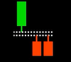

 （1）在下跌趋势中出现
 （2）由两根阳线组成
 （3）第一根阳线跳空低开，收盘时在前一根K线下方留一个缺口，后面一根阳线与第一根阳线并肩而立。

> 技术含义：见底信号、后市看涨

#### 低档五阳线

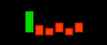

（1）出现在下跌行情中

（2）连续拉出5跟阳线，多为小阳线

> 技术含义： 见底信号、后市看涨

低档五阳线不一定是5根阳线，也可以是6根、7根阳线。

#### 连续跳空三连阴


  （1）出现在下跌超势中
  （2）连续出现3根向下跳空低开的阴线

> 技术含义： 见底信号、后市看涨   

如在价格已有大幅下挫的情况下出现，见底可能性更大。

#### 红三兵

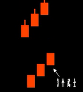

 （1）出现在上涨行情初期
 （2）由3根连续创新高的小阳线组成

> 技术含义：买进信号、后市看涨

当3根小阳线收于最高点时，称为3个白色武：3个白色武士拉开股价的作用重视。

#### 上升形


  （1）在盘整后期出现
  （2）由若干根小K线（一般不少于8根）组成，其中以小阳线居多，中间也可以夹着小阴线、十字线
  （3）整个K线组合排列略为向上倾斜状态

> 技术含义：买进信号、后市看涨

该K线组合犹如升起的旭日，升幅虽不大，但它往往是股价大涨的前兆

如果成交量同步放大，这种可能性就越大

#### 徐缓上升形


  （1）多数出现在涨势初期
  （2）先是接连出现几根小阳线，然后才拉出中阳线或大阳线。

> 技术含义： 买进信号、后市看涨

#### 稳步上涨形

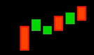

  （1）出现在上涨行情中
  （2）众多阳线中夹杂较少的小阴线，整个K线排列呈向上倾斜状。

> 技术含义： 买进信号、后市看涨

后面的阳线对插入的阴线覆盖的速度越快越有力，上升的潜力越大。

#### 上升抵抗形

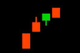

  （1）出现在上涨途中
  （2）由若干根K线组成
  （3）连续跳高开盘，即使中间收出阴线，但收盘价也要比前一根K线的收盘价高。

> 技术含义：买进信号、后市看涨

#### 弧线形


在涨势初期出现

由若干根K线组成

股市走势是一个向上的抛物线

> 技术含义：买进信号、后市看涨

一且弧形线为市场认可，上涨周期就很长

#### 上探下涨形


在上涨途中，突然跳低开盘（甚至以跌停板开盘）当日以涨势收盘，收出一根大阳线（甚至以涨停板收盘）。

> 技术含义： 买进信号、后市看涨

多数为控盘庄家利用消息洗盘，一般后市将有较大升势。

#### 上涨两颗星

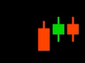

（1）在涨势初期，中期出现
（2）由一大二小三根K线组成
（3）在上涨时，先出现一根大阳线或者中阳线，随后就在这跟阳线的上方出现2根小K线（既可以是小十字线也可是实体很小的阳线、阴线）

> 技术含义：继续看涨

少数情况下会在一根大阳线上方出现3根小K线，这称为上涨三颗星。上涨三颗星技术含义与上涨两颗星相同

#### 跳空上扬形/升势鹤鸦缺口

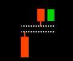

 （1）出现在涨势中
 （2）由两根一阴一阳的K线组成
 （3）先是拉出一根跳空上扬的阳线，留下一个缺口，第二天又出现一根低收的阴线，但它收在前一根阳线缺口上方附近。

> 技术含义：继续看涨

#### 高位并排阳线/升势恋人肩并肩缺口

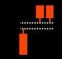

（1）出现在涨势中
（2）由两根阳线组成
（3）第一根阳线跳空向上，其收盘时在前根K线上方留下个缺口。第二根阳线与之并排，开盘价与第一根阳线的开盘价基本相同。

> 技术含义：继续看涨

这个向上跳空的缺口对日后汇价走势有较强的支撑作用，但如发现日后汇价跌破这个缺口，股价走势就会转弱

#### 跳空下跌三颗星

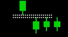

 （1）出现在连续下跌途中
 （2）由3根小阴线组成
 （3）3根小阴线与上面的一根K线有个明显的空白区域，也即是通常说的缺口。

> 技术含义：见底信号

如果3根小阴线后出现一根大阳线，上涨的可能性就更大。

#### 上升三部曲/升势三鸦


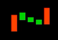

（1）出现在上涨途中

（2）由大小不等的5根K线组成

（3）先拉出一根大阳线或中阳线，接着连续出现了3根小阴线，但都没有跌破前面阳线的开盘价，随后出现了一根大阳线或中阳线。其走势，有点类似英文字母N

> 技术含义：继续看涨

要理解主力的意思，就是一波上涨后，连续三天的震仓，（为了拿到更多的筹码）然后后期继续更大的涨势

#### 多方尖兵

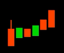

 （1）出现在上涨行情中
 （2）由若干根K线组成
 （3）在拉出一根中阳线或大阳线时，留下根较长的上影线，然后股价回落，但不久股价又涨至上影线的上方。

> 技术含义：继续看

走势图上出现这种K线形态，实际上是多方主力发动全面进攻前的一次试盘

#### 两红夹一黑

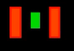

 （1）既可以出现在涨势中，也可以出现在跌势中
 （2）由2根较长的阳线和一根较短的阴线组成，阴线夹在阳线中

> 技术含义：在涨势中出现，继续看涨，在跌势中出现是见底信号

### k线组合：下降形态和见顶形态

#### 黄昏十字星

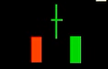

（1）出现在涨势中
（2）由3根K线组成，第一根为阳线，第二根为十字线，第三根为阴线。第三根K线实体深入到第一根K线实体之内。

> 技术含义：见顶信号，后市看跌

#### 黄昏之星


和黄十字星相似，区别在于黄十字星第二根K线是小阴线或者小阳线。

> 技术含义：见顶信号，后市看跌

信号不如黄十字星强

#### 淡友反攻


（1）出现在涨势中
（2）由一阴一阳2根K线组成
（3）先是出现一根大阳线接着跳高开盘结果拉出一根中阴线或大阴线，收在前一很K线收盘价相同或相近的位置上。

> 技术含义：见顶信号，后市看跌

转市信号不如乌云盖顶强

#### 乌云盖顶

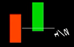

 （1）出现在涨势中
 （2）由一根中阳线或大阳线和一根中阴线或大阴线组成
 （3）阴线已深入到阳线实体二分之一以上处。

> 技术含义：见顶信号

阴线深入阳线实体部分越多，转势信号越强

#### 倾盆大雨

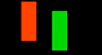

 （1）出现在上涨势中
 （2）由一阴一阳2根K线组成
 （3）先是一根太线或中阻线，接着出现了根低开的天阴线或中阴线，阴线的收盘价已经低于前一根阳线的开盘价。

> 技术含义： 见顶信号，后市看跌

见顶信号强于乌云盖顶，阴线实体低于阳线实体的部分越多，转市信号越强

#### 吊颈线/绞刑线

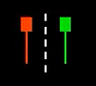

 （1）出现在涨势中
 （2）阳线（亦可以是阴线）实体很小，下影线大于等于实体两倍
 （3）一般无上影线，少数会略有一点上影线

> 技术含义：见顶信号，后市看跌

实体与下影线的比例越悬殊，信号越有参考价值。

如吊颈线与黄昏之星同时出现，见顶信号就更加可靠

#### 平顶/钳子顶

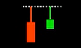

  （1）出现在上涨超势中
   2） 由两根或两根以上的K线组成
  （3）最高价处在同一水平位置上

> 技术含义：见顶信号，后市看跌

#### 塔形顶


 （1）出现在上涨超势中
 （2）先是一根大阳线或者中阳线，后为一连串小阴阴小阳线，最后出现一根大阴线或者中阴线。

> 技术含义：见顶信号，后市看跌

#### 圆顶

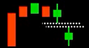

（1）出现在上涨超势中
（2）汇价形成一个圆弧顶
（3）圆弧内的K线多为小阳小阴线，最后以向下跳空缺口来确定圆顶形态成立。

> 技术含义：见顶信号，后市看跌

与技术图形的圆顶有一定区别

#### 双飞乌鸦

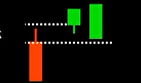

1）出现在涨势中
2）由2根一大一小阴线组成
3）第一根阴线的收盘价高于前根阳线的收盘价，且第二根阴线完全包容看第一根阴线。

> 技术含义：见顶信号，后市看跌

#### 三只乌鸦/暴跌三杰


 （1）出现在涨势中
 （2）由3根阴线组成，阴线多为大阴线或者中阴线
 （3）每次均以跳高开盘，最后以下跌收盘。

> 技术含义：见顶信号，后市看跌

#### 高档五阴线

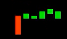

 （1）出现在涨势中
 （2）由5根阴线组成，但大多为小阴线
 （3）先是拉出一根较有力度的阳线，接着连续出现5根并排阴线。

> 技术含义：见顶信号，后市看跌

高档五阴线并不一定都是5根阴线，有时也可能是6-8根。

#### 下降覆盖线

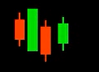

 （1）在上涨的行情中出现
 （2）由4根K线组成，前2根K线构成个穿头破脚形态，第三根K线是一根中阳线或者小阳线，但阳线的实体通常比前一根阴线要短，之后又出现一根中阴线或小阴线，阴线实体已经深入到前一根阳线实体之中。

> 技术含义：见顶信号，后市看跌

见底信号强于穿头破脚

主力在高位出货，大幅度震仓，洗仓。成本不高，主力卖的比买的多，拉高出货才有意义

#### 抵挡盘旋形


  （1）出现在下跌途中
  （2）由若干根小阴小阳线组成
  （3）先是小阴小阳线的横盘，后来出现一根跳高向下的阴线

> 技术含义：卖出信号，后市看跌

#### 黑三兵

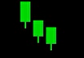

（1）既可以在涨势中出现，也可以在跌势中出现。
（2）由3根小阴线组成，最低价一根比一根低

#### 绵绵阴跌形

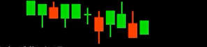

在整盘后期出现
由若干根小K线组成（一般不少于8根）。其中以小阴线居多，中间也可以夹着一些小阳线，十字线
这个K线排列呈略微向下倾斜状

> 技术含义：卖出信号，后市看跌

绵绵阴跌，跌幅虽然不大，但犹如黄梅天的阴雨下个不停，从此延长了下跌的时间和托展了下跌的空间，股价有可能就此长期走弱。因此，对绵绵阴跌的走势，应及早作出判断。

*主力在这里出货，如果上涨阳线多，主力在吸货，阴线多，主力在出货*

#### 徐缓下跌形

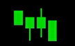

  （1） 多数出现跌势初期
  （2）先接连出现几根小阴线，然后拉出中大阴线

> 技术含义： 卖出信号，后市看跌

#### 下跌不止形

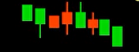

  （1）出现在下跌途中
  （2）众多阴线中夹着较少的小阳线，整个K线排列呈向下倾斜状。

> 技术含义：卖出信号，后市看跌

### 其他k线

#### 大阳线

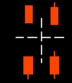

1）带有上下影线的大阳线
2）带有上影线的大阳线
3）带有下影线的大阳线
4）光头光脚大阳线
特征：
 （1）可出现在任何情况下
 （2）阳线实体较长，可略带上下影线

> 技术含义：
>
> 在上涨刚开始时，出现大阳线后市看涨。
>
> 在上涨途中出现大阳线，是见顶信号。
>
> 在连续下跌的行情中出现，有见底回开的意义。阳线实体越长，信号越可靠

#### 大阴线

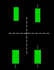

1）带有上下影线的大阴线
2）带有上影线的大阴线
3）带有下影线的大阴线
4）光头光脚大阴线
特征：
 （1）可出现在任何情况下
 （2）阳线实体较长，可略带上下影线始是出现天阴线，后市看。在下途中出现，继续着

> 技术含义：
>
> 在涨势中出现明线，是见顶信号：
>
> 在下跌刚开始时显出大阴线，后市看跌。
>
> 在下跌途中出现，继续看跌。
>
> 在连续加速下跌行情中出现，有空头陷阱的嫌疑(吸筹)

#### 小阳线

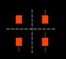

特征：
 （1）在盘整行情中出现较多，也可在上涨和卡跌行情中出现
 （2）K线实体很小，可以略带上下影线

> 技术含义：
> 说明行情不明朗，多空双方小心接触但多方略占上风。单根小阳线研判意义不大，应该结合其他K线形态一起研判。

#### 小阴线

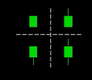

 （1）在盘整行情中出现较多，也可以在下跌和上涨行情中出现
 （2）K线实体很小，可以略带上下影线

> 技术含义：说明行情不明朗，多空双方小心接触但空方略古风。根小线研判意文大，应该结合其他K线形态一起研判

#### 十字线


既可以出现在涨势中，也可以出现在跌势中
开盘价收盘价相同，成一字，但上下影线较短

> 技术含义：
>   在上涨势末端出现，是见顶信号，在下跌趋势末端出现，是见底信号，在下跌途中出现，继续看跌，在上涨途中出现
> 继续看涨。信号可靠性不强，应结合其他K线一起研判

#### 长十字线

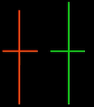

 （1）既可以出现在涨势中，也可以出现在跌势中
 （2）开盘价收盘价相同：成一字，但最高价和最低价拉的很开。因此上下影线都很长。

> 技术含义：
> 在上涨趋势末端出现，，是见顶信号，在下跌趋势末端出现，是见底信号，在下跌途中出现，继续看跌，在上涨途中出现，继续看涨。
> 虽然长士字线的技术含义于普通的十字线含义相同，但其信号可靠程度比后者高。
>
> 因此可以将它作为逃顶和抄底的重要参考指标。

#### 螺旋桨

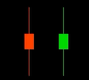

  （1） 既可以出现在涨势中，也可以出现在跌势中
  （2）开盘价收盘价接近，K线实体（可阴可阳）很小，最高价和最低价拉的很开，因此上下影线都很长。

> 技术含义：
>  在涨势中出现，后市看跌，在后跌途中出现，继续看跌，在连续加速的跌势中出现有见底回开的意义。
> 转势信号，比长十字更强

#### 一字线

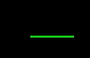

（1）既可以出现在涨势中，也可以出现在跌势中

（2）开盘价、收盘价、最高价、最低价几乎成为一字

> 技术含义
>
> 在涨势中出现，是买进信号，
>
> 在跌势中出现，是卖出信号。
>
> 在涨跌停板下，一字有特别意义，涨势中出现一字，表示股价封在涨停价上，说明多头气盛。日后价格往往很强势。
>
> 跌势中出现表示价格封杀在跌停价上，说明空头力量极大，日后价格往往会走弱。

#### T字线

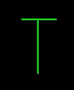

特征：
开盘价、收盘价、最高价粘连在一起，成一字。但最低价有的距离，因此在K线上留下一根下影线，成十学图形。

> 技术含义：
> 在上涨趋势末端出现，为卖出信号，
>
> 在下跌趋势末端出现，为买进信号。
>
> 在上涨途中出现，继续看涨，
>
> 在下跌途中出现，继续看跌
>
> T字线下影线越长，力度越大，信号越可靠。

#### 倒T字线

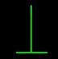

特征：
开盘价、收盘价、最低价粘连在一起，成一字。但最高价与之有相当的距离，因此在K线上留下一根上影线，构成T字图形。

> 技术含义：
>
> 在上涨趋势末端出现，为卖出信号，
>
> 在下跌趋势末端出现，为买进信号。
>
> 在上涨途中出现，继续看涨，
>
> 在下跌途中出现，继续看跌
>
> T字线上影线越长，力度越大，信号越可靠。
>
> 在上涨趋势中出现倒T字线，称为上档T字线，又称下跌转折线。

#### 穿头破脚

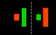

 （1）既可在上涨趋势中出现，也可以在下跌超势中出现
 （2）由大小不等，阴阳相反的2根K线组成
 （3）在上涨超势中出现，前一根为阳线，后一根为阴线，后者将前者的实体全部包容在内（不包括上影线）4）在下跌趋势中出现，前一根为阴线

> 技术含义：
>
> 在上涨趋势中出现，为卖出信号，
>
> 在下跌趋势中出现，为买进信号
>
> 2根K线的长短越悬殊，或一根长的K线包容前面的K线越多，信号的参考价值就越大

#### 身怀六甲

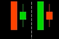

 （1）既可以在上涨趋势中出现，也可以在下跌趋势中出现

（2）由大小不等的2根K线组成，两根K线可以是一阴一阻，亦可以是两阳或两阴。                     

（3）第一根K线实体要能完全包容第二根K线实体
（4）第二根K线可以是小阴小阳线，亦可以是十字线

> 技术含义：
>
> 在上涨趋势中出现，为卖出信号，
>
> 在下跌趋势中出现，为买进信号，
>
> 若第二根K线是十字线，俗称十字胎，在身怀六甲中，十字胎是力度最大的K线形态之一。

#### 夹子线

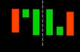

（1）既可在上涨趋势中出现，也可在下跌超势中出现                         

（2）由3根两大一小的K线组成

（3）3根K线的最高价几乎在同一水平位置上（从图上看就像有人拿着夹着一块小东西）

> 技术含义：在上涨时出现为头部信号，在下跌时出现为底部信号

#### 上档盘旋形

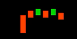

1）出现在涨势途中
2）由若干根或几十根K线组成
3）在上涨时拉出一根较有力度的阳线后，就出现了阴阳交错，上下波动范围很小的横盘走势，上档盘旋时间在5-14天内

> 技术含义
> 多数看涨，超过14天多数看跌
> 盘旋时间太久，说明多方上攻愿望不强，因此跌的可能性很大

#### 加速度线

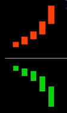

（1）既可在上涨趋势中出现，也可在下跌趋势中出现                      

（2）上涨时出现加速度线，表现为开始缓慢爬升，后来攀升速度越来越快，接着连续拉出中阳线或大阳
线
（3）下跌时出现加速度线，表现为开始缓慢下跌，后来下跌的速度越来越快，接着连续拉出中阴线或大阴线。

> 技术含义：
> 在上涨时出现为头部信号，在下跌时出现为底部信号。

#### 下跌三连阴


  

（1）出现在跌势中                

（2）由3根阴线组成，阴线多为大阴线或者中阴线

（3）每根阴线都以最低价或次低价报收，最后一根阴线往往是大阴线

> 技术含义：
>
> 在下跌初期出现，继续看跌，
>
> 在下跌后期出现，是见底信号
>
> 在连续阴跌不止情况下，特别是在股价已有较大跌幅后出现三连阴，表示空方力量已经用尽。


> K线要结合环境，考虑实际的应用，并不是绝对的。因为这些图主力都是可以做出来的！！假如主力做个红三兵出货，你买不买？
>
> 目前只是看山是山的层次

### 练习：手动绘制k线图

听说绘图一小时，感悟开盘价，收盘价，最高价，最低价的魅力以及k线和k线之间的价位排列呈现的一种内在规则，低得盯盘10天的功力，等到悟了的时候，就有与庄家战斗的资本。

### 结合价格走势

单单看k线就决定它的意义是不行的，

比如**长上影线**可以出现在一波涨势后的相对高位区，也可以出现在一波跌势后的相对低位区；

比如**w形双重底**可以出现在深幅下跌后的底部区，也可以出现在持续上涨后的顶部区。

所以我们**应当结合价格的走势情况，来辅助验证k线形态所蕴含的市场含义**。

#### 长上影线

比如**持续上涨中出现长上影线=>看跌**

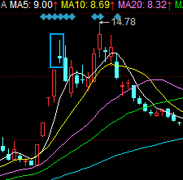

比如**持续上涨前期，出现长上影线，表示多方有意发起工具，并不是预示该股要在抛压回调。=>看涨**

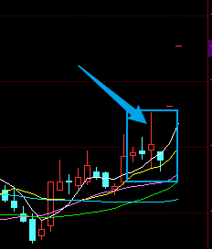

### 支撑线和阻力

支撑对应波谷，或者说反作用的最低点。走势图中市场下方的一个价位或区域，市场在此处消化了卖方的力量，买方力量开始推升价格，股价在这里停止下跌并向上反弹，遇此支撑止跌回稳的价位即支撑位，多个支撑位的连线即为支撑线。

阻力对应波峰，它代表市场上方的一个价位或区域，价格在上升过程中，在波峰位置收到阻力，市场消化了买方的力量，卖方力量开始推低价格，价格在这里停止上升并向下回落，这个股价遇压力反转下跌的价位即阻力位，多个阻力位组成的连线即为阻力线。

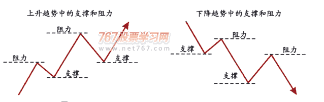

#### **支撑位形成原理：**

市场在支撑位波动一段时间后，积累了加大的成交量，当股价由上而下向支撑线靠拢时，空方获利筹码已清，手中已无打压抛空筹码；多方乘机低吸，形成需求，部分套牢者套牢已深，筹码锁定不轻易斩仓，故在这一价位区间需求>供给，自然形成了强有力的支撑基础。

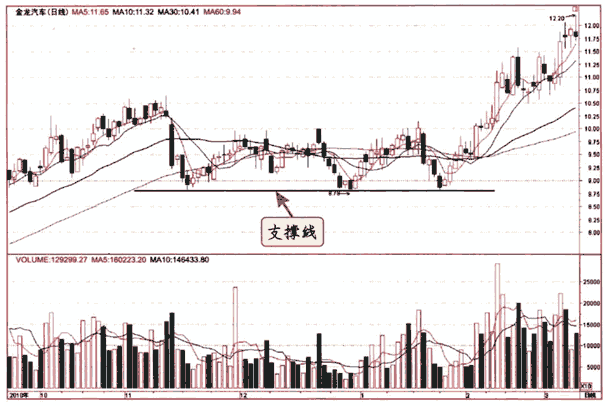

#### **支撑位类型：**

    1.成本支撑。
    2.技术指标形成的支撑
    3.均线系统形成的支撑。
    4.上升超势线形成的支撑。
    5.上升通道的下轨线形成的支撑。
    6.大型缺口的下边缘线形成的支撑
    7.前期密集成交区形成的支撑。
    8.历史上曾经多次发挥支撑作用的历史性支撑。
    9.各种技术形态的颈线支撑，如头肩顶或双顶等头部形态的颈线支撑。
    10.整数关口形成的支撑。交易者往往把10、20、25、50、75和100（以及1000的倍数）这样的重要整数位当做目标价位，并采取相应的行动

> 支撑位是制定投资计划的参考依据，但支撑位只是表明该点位对股价的下跌将起到一定的支撑作用，并不代表股价一定不会下跌。

#### **阻力形成原理：**

与支撑一样，通常也出现在成交密集区，这一区间积累了较大的成交量，当交易价格在该密集区以下时，市场中由大量套牢者，因此当行情由下向上回升，迫近阻力线时，对后市看空者急于解套或获利回吐，大量抛盘涌出，股票供应量放大，对后市看好者也不想追高，希望在股价回档时再跟进，故此时股票的需求量相对较小，反复多次，阻力便形成了。

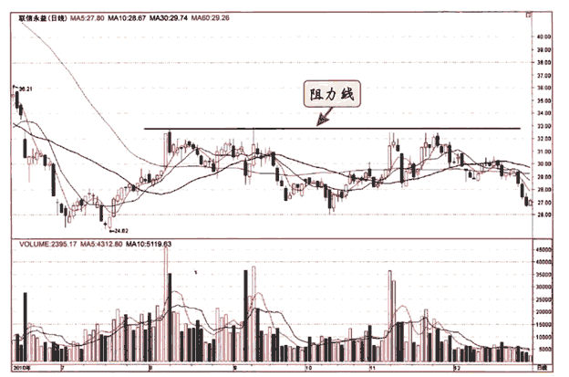

#### 应用：上升/下跌趋势中

##### 上涨趋势

上涨趋势中，阻力位和支撑位时逐步上移的，**如果股价回落到上一个支撑位，则说明支撑位并无上移，暗示上涨趋势可能结束。**即使位转为下跌，也会转位横向趋势，若向下突破支撑位，更反映跌势开始来临。

同理，**如果股价回档后上升到之前的高位，无法向上突破，说明阻力位无法逐步上移，暗示升势可能结束，**之后行情可能转为下跌或横向趋势。

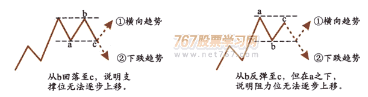

##### 下跌趋势

下跌趋势中，阻力位和支撑位时逐步下移的，如果股价回升至上一个阻力位，则说明阻力位并无下移，暗示跌势可能结束。即使为转为上涨，也会转为横向趋势。如果股价向上突破阻力位，更是反映上涨趋势开始来临。

同理，如果股价反弹后回落至之前的低位，无法再向下突破，说明支撑位无法逐步下移，暗示跌势可能结束。之后行情可能转为上升趋势或横向趋势。

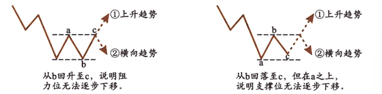

#### 应用：横向趋势中

##### 1.受到支撑和上升受阻的操作

受到支撑是说股价下跌到前期的高点/低点附近时就止跌回升，该支撑位是做多的理想点位（买入点）

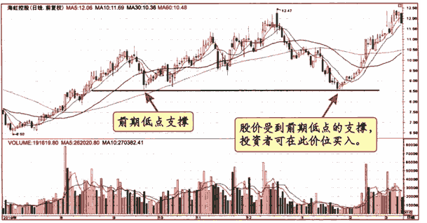

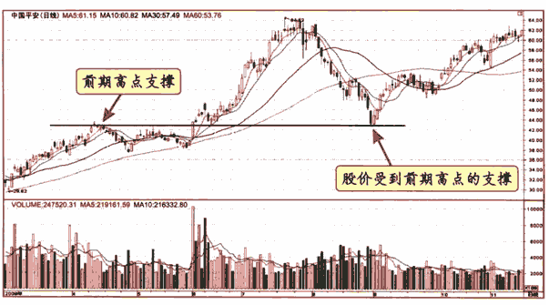

上升受阻是指价格在上升途中，遇到前期波峰高点或波谷低点时就反转下行，若行情反转回落，我们应该先获利了结。

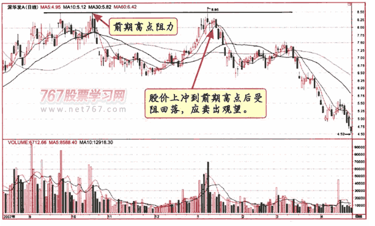

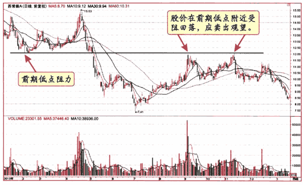

> 支撑线和阻力线组成的平行区间可以看作是股价运行的箱体，比较适合波段操作。
>
> 操作方法比较简单：当股价运行到支撑线附近止跌回升时，可买入股票，当股价运行到阻力线附近受阻回落时，应卖出股票

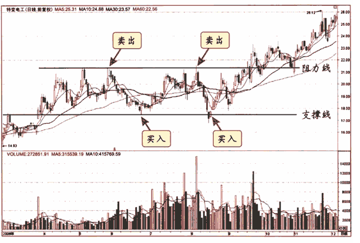

注意：

- 该波段操作运行时间短，会缺乏稳定性
- 平行区间间隔如果太小，会缺乏获利空间
- 成交量过大时，会突破原有的箱体。

##### 2.跌破支撑和突破阻力的操作

突破阻力后会向前猛冲一段，突破时做多，可以获利

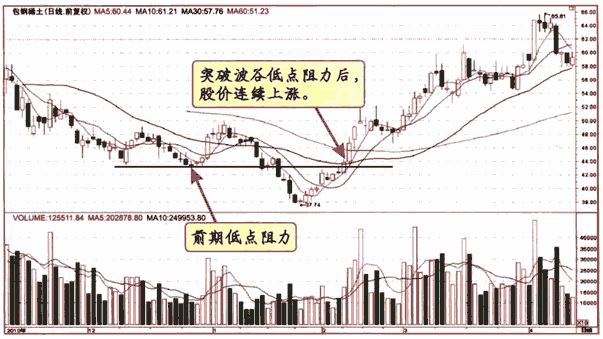

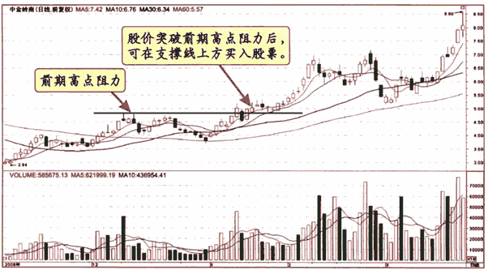

跌破支撑后，股价继续下跌且幅度较大，应卖出股票，并到下一个支撑位寻找买点。

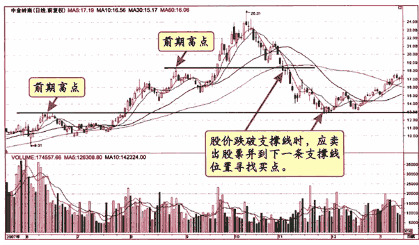

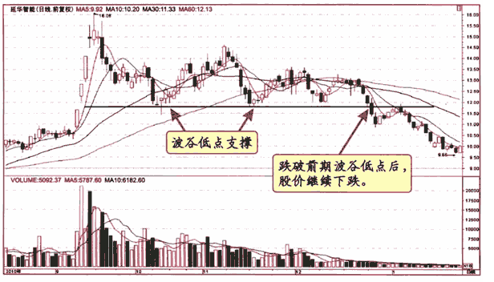

##### 3.支撑和阻力的转换

支撑位和阻力位可以互相转换，当股价从上向下跌破支撑位时，原有的支撑位可能变成阻力位。当股价从下向上突破阻力位时，原有的阻力位也将可能变成支撑位。

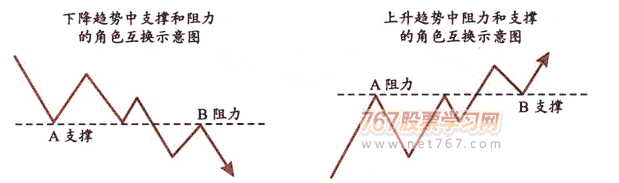

比如A点的阻力线被突破后，角色转换位支撑线，B点在该位受到支撑

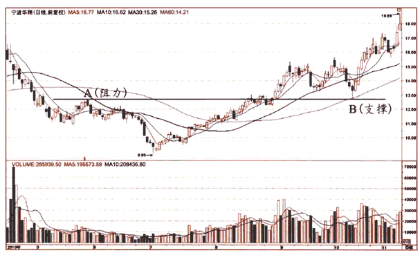

比如A点的支撑线被跌破后，角色转换位阻力线，B、C点受到阻力回落

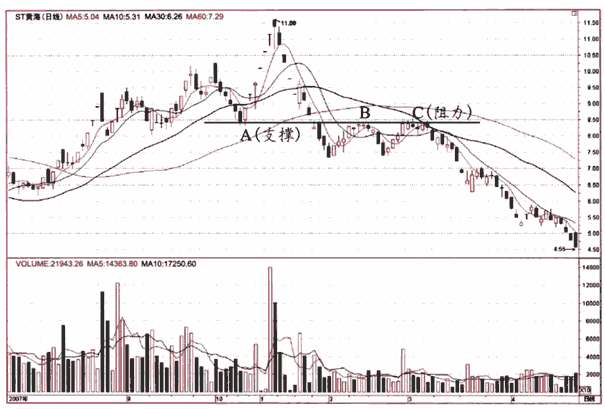

角色转换的可能性取决于：

- 原支撑位/阻力位的成交量越大，这个点角色转换的概率越大
- 原股价在支撑位/阻力位进行的交易时间越长，角色转换的可能性越大
- 近一时期在这一价位交易的次数越多，这个价位在股民头脑中就越清晰，也就越容易转换。


## 技术指标

入口：个股-K线图-设置/指标广场

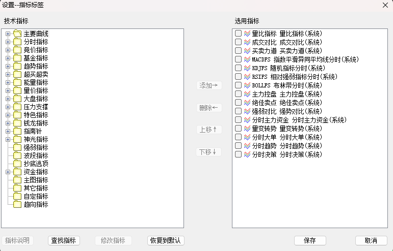

> 所有指标都是从基础信息演化出来的，一些自定义/或者指标平台的指标不用过度追求，不一定经得住市场的考验。研究一些常用的MACD之类的就行了。

分类

- 趋势方向类指标
- 强势上涨弱势下跌指标
- 随机买入技术指标

### MACD:指数平滑异同异动平均线

作用：由Gerald Appel于1970年代提出，用于研判价格或指数变化的强度、方向、能量以及趋势周期，以便把握买进和卖出的时机。

颜色说明：白线是差离值（DIF），黄线是讯号线（DEM），红绿区块柱形图（MACD bar / OSC）是两者的差（D-M）。

使用：

**1、当DIF(线)和DEA(线)处于0轴以上时，属于多头市场,整体上涨。**

**2、当DIF(线)和DEA(线)处于0轴以下时，属于空头市场,整体下跌。**

3、柱状线收缩和放大。

4、震荡行情中MACD指标将失真(失去参考价值)。

MACD，在多头市场，考虑买入操作

**然后金叉为买入点**

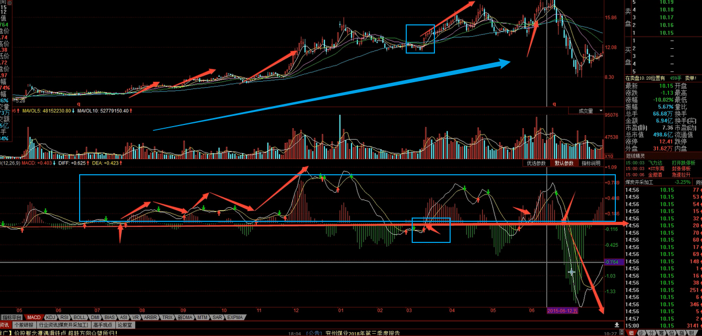

> **在0轴上方的金叉才是有效金叉！！！**

### KDJ:随机指标

KDJ指标最早是以KD指标的形式出现，而KD指标是在威廉指标的基础上发展起来的。不过KD指标只判断股票的超买超卖的现象，在KDJ指标中则融合了移动平均线速度上的观念，形成比较准确的买卖信号依据。在实践中，K线与D线配合J线组成KDJ指标来使用。

在KDJ指标的三条曲线中，波动最频繁的是J线，其次是K线，波动最不频繁的是D线。

KDJ指标在设计过程中主要是研究最高价、最低价和收盘价之间的关系，同时也融合了动量观念、强弱指标和移动平均线的一些优点。因此，能够比较迅速、快捷、直观地研判行情，被广泛用于股市的中**短期**趋势分析，是期货和股票市场上最常用的技术分析工具。

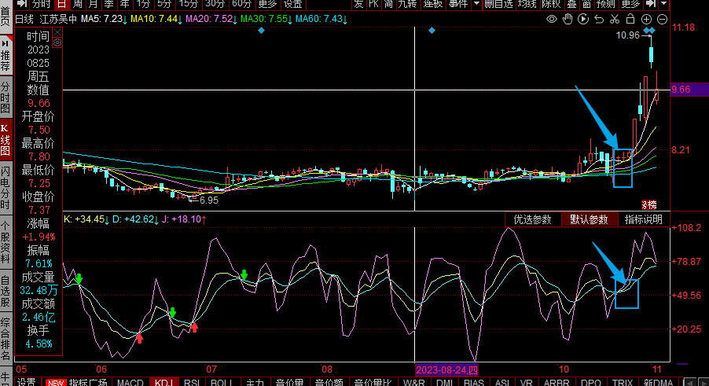

> 短线：观察2-3天的形况。交叉处，紫线在上面，可以尝试入手。
>
> 中期的可以看周K的KDJ
>
> 不用过度依赖这个不一定有用，比如高位提示我们超买，造成恐慌，提前离场。或者低位超卖信号，造成以为下跌到底，提前入场被套。实际上可能还要跌。

**KDJ比较符合投资者的初期心理，但是不能过度依赖，比如MACD**

### RSI:相对强弱指标

来判断股票价格内部本质强弱、推测价格未来的变动方向的技术指标。

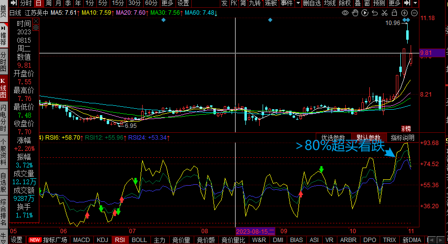

操作：

1、当6日RSI低于20时，行情进入超卖状态。这是**看涨买入**信号。

2、当6日RSI超过80时，行情进入超买状态。这是**看跌卖出**信号。

3、当6日RSI在低位向上穿越12日RSI时，形成RSI低位金叉。这是**看涨买入**信号。

4、当6日RSI在高位向下穿越12日RSI时，形成RSI高位死叉。这是**看跌卖出**信号。

5、当6日RSI连续两次下跌到同一位置获得支撑反弹时，形成RSI的双重底形态。这是**看涨买入**信号。

6、当6日RSI连续两次上涨到同一位置遇到阻力回落时，形成RSI的双重顶形态。这是**看跌卖出**信号。

7、如果股价连创新低的同时RSI指标没有创新低，就形成RSI指标**底背离**。底背离是**看涨买入**信号。

8、如果股价连创新高的同时RSI指标不能创新高，就形成RSI指标**顶背离**。顶背离是**看跌卖出**信号。

推演：2个十字星，横线，底部上升，后续上升

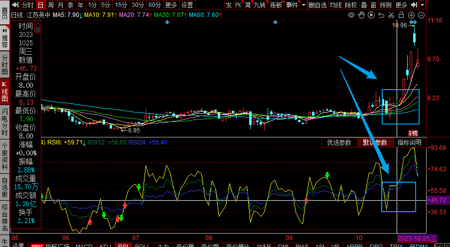

### BOLL:布林线指标

布林线是研判股价运动趋势的一种中长期技术分析工具。

> 算是一种辅助工具把，不像MACD指导性那么强

一般而言，股价的运动总是围绕某一价值中枢（如均线、成本线等）在一定的范围内变动，布林线指标指标正是在上述条件的基础上，引进了“股价通道”的概念，其认为股价通道的宽窄随着股价波动幅度的大小而变化，而且股价通道又具有变异性，它会随着股价的变化而自动调整。

**一、在常态范围内，布林线使用的技术和方法**

常态范围通常是股价运行在一定宽度的带状范围内，它的特征是股价**没有极度大涨/大跌，处在一种相对平衡的状态之中，此时使用布林线的方法非常简单。**

1，当股价穿越上限压力线（动态上限压力线，静态最上压力线BOLB1）时，卖点信号；

2，当股价穿越下限支撑丝（动态下限支撑线，静态最下支撑线BOLB4）时，买点信号；

3，当股价由下向上穿越中界限（静态从BOLB4穿越BOLB3）时，为加码信号；

4，当股价由上向下穿越中界线（静态由BOLB1穿越BOLB2）时，为卖出信号。

**二、在单边上升行情布林线的使用方法**

在一个强势市场中，股价连续上升，通常股价会运行在BOLB1和BOLB2之间，当股价连续上升较长时间，股价上穿BOLB1，次日又下穿BOLB1且进一步打破BOLB2，带动BOLB1曲线，出现由上升转平的明显拐点，此时为卖出信号。

**三、缩口的意义**

1，股价经过数波下跌后，随后常会转为较长时间的窄幅整理，这时我们发现布林线的上限和下限空间极小，愈来愈窄，愈来愈近.盘中显示股价的最高价和最低价差价极小，短线没有获利空间，经常是连手续费都挣不出来,盘中交易不活跃，成交量稀少，投资者要密切注意此种缩口情况，因为一轮大行情可能正在酝酿中，一旦成交量增大，股价上升，布林线开口扩大，上升行情宣告开始。

2，如布林线在高位开口极度综小，一旦股价向下破位，布林线开口放大，一轮跌势将不可避免。

**四，布林线开口的意义**

1，当股价由低位向高位经过数浪上升后，布林线最上压力线和最下支撑线开口达到了极大程度，并开口不能继续放大转为收缩时，此时是卖出信号，通常股价紧跟着是一轮大幅下跌或调整行情。

2，当股价经过数浪大幅下跌，布林线上限和下限的开口不能继续放大，布林线上限压力线提前由上向下缩口，等到布林线下限支撑线随后由下向上缩口时，一轮跌势将告结束。

**五，使用布林线的注意事项**

1，布林线参数的设定不得小于6，静态钱龙值通常是10；动态钱龙设定时通常为20。

2，使用布林线要注意判明是在常态区还是非常态区，在非常态区不能单纯以破上限 卖，破下限买为原则。

3，动用开口缩小，在低位容易捕捉住牛股，但在高位或一旦缩口后,股价向下突破，常会有较大下跌空间。

4，可将布林线和其他指标配合使用，效果会更好，如成交量，KDJ指标等。

> 有滞后性，不是很好用。比如boll线横线缩口卖出，但实际上可能是MACD金叉买入点

### ARBR:人气指标

AR是一种“潜在动能”。由于开盘价乃是是股民经一夜冷静思考后，共同默契的一个合理价格，那么，从开盘价向上推升至当日最高价之间，每超越一个价位都会损耗一分能量。当AR值升高至一定限度时，代表能量已经消耗殆尽，缺乏推升力道的股价，很快的就会面临反转危机。相反地股价从开盘之后并未向上冲高，自然就减少能量的损耗，相对的也就屯积保存了许多累积能量，这一股无形的潜能，随时都有可能在适当成熟的时机暴发出来。

BR是一种“情绪指标”就是以“反市场心理”的立场为基础。

AR人气指标，介于80至100，可能盘整；过高，可能回落；过低可能反弹。

BR意愿指标，介于70至150，可能盘整；高于300，可能回档；

低于50，可能反弹。

> 主力进场，买
>
> 散户进场，卖

**总结**

KDJ和BOLL不能给到明确的提示，

MACD,ARBR可能更好用些

### 移动平均线

在技术分析中，市场成本原理非常重要，它是超势产生的基础，市场中的势之所以能够维持，是因为市场成本的推动力，例如：在上升势里，市场的成本是逐渐上升的，下降趋势里，市场的成本是逐渐下移的。成本的变化导致了超势的延续。均线代表了一定时期内的市场平均成本变化。均线是重要的技术分析基础。

#### 资者平均成本

1、投资公众的平均成本：就是在某一段时间内投资者持股的平均值
例如5天以来的投资公众的持筹成本就是把第1天到第5天的股价加起来除以5，以此作为5天的平均成本。
根据平均成本的原理，将股价变动的趋势数字化，由这些数字相应的坐标点连成曲线就是移动平均线。

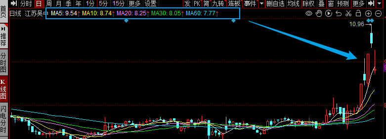

#### 均线类型

多动平均线称均线系统或均线系统理

不同周期的移动平均线可以为您表明短线、中线和长线的大盘趋势。

常用5天、10天、20天、60天、120天和240天取样的价格来计算。

5天、10天和20天的移动平均线看作短期移动平均线，称作月均线指标。

20天、30天和60天是中期移动平均线，称作季均线指标。

60天、120天和240天是长期移动平均线，称作年均线指标。

> 日周月K线的MA线可能更适合中短线玩家

#### 计算方法

移动平均线的计算方法

将某一时间段的收盘股价或收盘指数相加的总和以该时间段的天数，即得到这一时间段的平均数值

如：10日移动平均数，就是将头10日的收盘价相加除以10，得到的就是第一个10日移动平均数值；

再将第一个10日平均数乘以10减去第一日的收盘价加上第11日的收盘价的总和除以10，得到第二个10日移动平均数值；

依此类推，然后将计算的平均数画在坐标图上连成曲线，即得到10日移动平均线。

#### 确定买入点卖出点

在移动平均线的应用上，是单纯以股价与移动平均线系统之间的关系作为研判的依据，确定买入点和卖出点。
**由于这一方法是以数日收盘价的平均值计算，反映较为退缓**
**但准确度很高，较适合于中长线投资者使用(短线也就可以其实)**


#### 使用方法

移动平均线的使用方法

##### 移动平均线的上升点

1、移动平均线运行一段时间后，将会出现波峰和波谷也就是拐点。拐点预示着趋势的转变
2、当一种移动平均线向上运行，**无法再创新高而形成波峰**，这是股价无力再创新高，可能转变为下一步行走势的征兆，                           如下图。

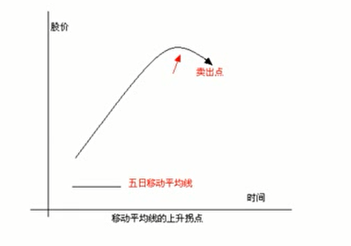

分析：

A处是5日移动平均线，在股价头部第1个掉头向下，出现拐点和股票的卖点。
B处是10日移动平均线，在股价头部第2个掉头向下，出现拐点和股票的卖点。
C处是20日移动平均线，在股价头部第3个掉头向下，出现拐点和股票的卖点。
D处是60日移动平均线，在股价头部第4个掉头向下，出现拐点和股票的卖点。
发出卖出股票信号的先后顺序是：5、10、20和60日均线。


##### 移动平均线的下降点

1、在股价下跌过程中，移动平均线向下运行，当无法再下跌时形成波谷，这是股价不能再下跌，可能变成上升走势的征兆。如下图。
这个拐点通常是买点，公众应跟踪移动平均线，及时发现拐点（波峰和波谷）来寻找买卖点。

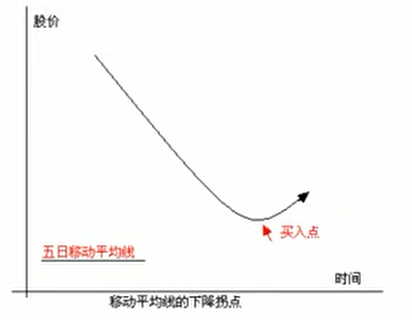


> 操作技巧（建议，力度可自行调整）
>
> 5日线买入点时，建仓20%-30%
>
> 10日线买入点时，加仓40%-50%
>
> 20日线买入点时，加仓60%-70%
>
> 30日线买入点时，加仓70%-80%
>
> 
>
> 5日线卖出点时，减持30%
>
> 10日线卖出点时，减持30%
>
> 20日线卖出点时，减持20%
>
> 30日线卖出点时，剩下20%可以保持持仓，有盈利了，以免遇到回撤，较为可惜。

##### 双底/三重底形态

> 移动平均线在底部出现双底形态或三重底形态，将是最佳买入时机。

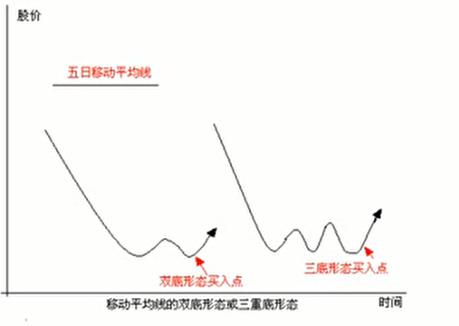

##### 双顶/三重顶形态

> 移动平均线在底部出现双顶形态或三重顶形态，将是最佳卖出时机。

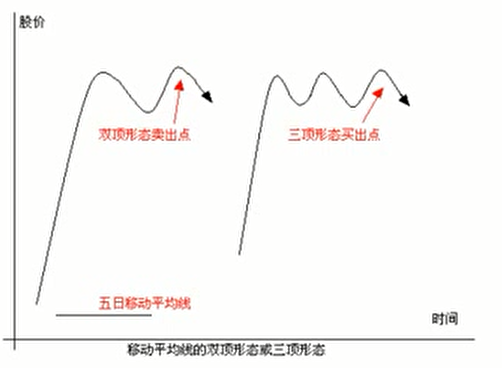

#### 死亡交叉

短期移动平均线和长期移动平均线的死亡交叉

当5日短期移动平均线在**高位从上向下穿**10日长期移动平均线时所得到的交叉点，叫”死亡交叉“。

**死亡交叉发生时，是一个较好的卖出点，**如下图：

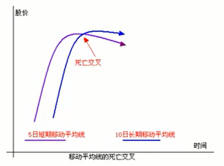

请注意：  

（1）大多技术指标均使用短线快速指标从下上穿长线慢速指  所发出的买入信号。

（2）大多技术指标均使用短线快速指标从上下穿长线慢速指  所发出的卖出信号

（3）不是所有的黄金交又和死亡交又都有是买入点和卖出点

当庄家进行振荡吸筹和振荡出货时，黄金交和死亡交指示的买卖点是不可靠的。投资者应学会判明这种情况。

#### 黄金交叉

短期移动平均线和长期移动平均线的黄金交叉

当5日短期移动平均线在**低位上穿**10日长期移动平均线时所得到的交叉点，叫”黄金交叉“。

通常是**较好的买入点**。如下图：

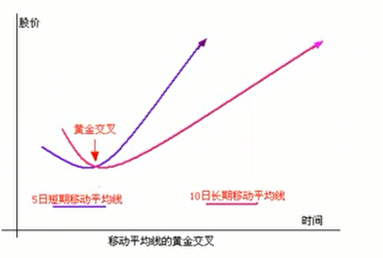

分析：

A处是5日移动平均线；B处是10日移动平均线。

C处、D处和E处都是**5日均线上穿10日均线产生的黄金交，当日收出一根放量长阳**，站立在黄金交上，发生黄金交后，买进股票。之后，股价上涨。

分析：

A是5日移动平均线；B是10日移动平均线；C是20日移动平均线。

E处是5日均线下穿10日均线时所产生的死亡交叉。之后股指下降。

G处是5日均线下穿20日均线时所产生的死亡交叉。之后股指下降。

F处是10日均线下穿20日均线时所产生的死亡交叉。之后股指下降。

#### 多头并排

当股指或股价上涨时，移动平均线托着K线上升，也就是K线在均线的左上方，而所有均线处在K线的右下方，按均线时间周期的长短，从小到大，从左到右自然排列，此现象叫“多头排列”。如下图。

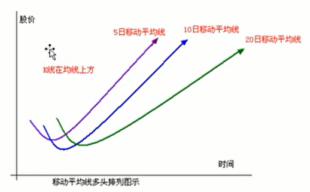

多头排列是投资者的**持股最佳时期**，股价**呈强劲上升势头**。

多头排列常出现在**利好消息充斥**，**庄家资金雄厚且控制了大部分流通筹码时**。

当多头排列出现，股价呈直线上升。

#### 空头排列

当股指或股价下时，移动平均线由大到小自然排列在K线的上方，压制K线向右上方行进，此现象叫“空头排此现象，是投资者的特币期，投资者应耐心持币观望

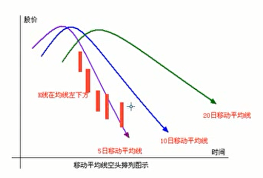

#### 日均线反映主力成本

> 均线的重要性要比成交量，股价，换手率更好，因为周期长，更不容易被作假
>
> 均线+k线(看盘) -> (有买卖意向了)消息面(看市场情况) -> 辅助型指标(成交量等)

60日移动平均线反映庄家的持股成本移动平均线反映了持股成本，这是一个非常重要的技术指标。

**其重要性相当于成交量、股价和换手率等技术指标**

**您必须每天使用这些指标来分析胶票的走势**

如庄家在低位吸货45日，拉升15日，这60日的均线将反映庄家的进货成本。

庄家在完成吸货后，要抛货赚钱，这时股价必定在60日均线以上抛货。

移动平均线对股价均有**支撑和压方作用**

股价跌破或冲破5日、10日和20日均线都是极重要的心理关口。

**记住：庄家的平均持股成本一般用60均线左石来表示**

这是一条非常重要的均线。庄家总是在60日均线以下建仓，在60日均线以上出货。

#### 综合实战

> **如果主力成本均线60日在K线(柱状线)下面，起支撑作用，比较稳定**

> **如果上升途中，遇到回调，5日线就会失去作用，但是可以去看5日线是否突破10日线/20日线/30日线。是否有支撑。**

1、在股票买卖交易时，运用移动平均线指材可以界定风险程度，将亏损的可能性降低
2、在行情刚发生转变时，买入或卖出都可能获得丰厚的利润，利用移动平均线的组合，往往较容易看出行情的真正趋势。
3、当行情处在盘整时，买卖信号频繁，容易使投资者操作失误或迷失方向。
4、移动平均线的最佳日数和组合比较难以确认在实战中要通过多次的试验，调整和检验方可确定。

不同的走势和不同的时期有不同的确定和组合。

5、单凭移动平均线的买卖信号，无法给投资者足够的信心。通常还需要其他技术指标参与共同印证
6、移动平均线趋于平缓时，是行情可能产生重大变化的时刻。必须用其他指标对行情进行仔细研究，以确定未来的走势。
7、移动平均线的拐点是提示操作者买进或卖出的机会。短期移动平均线的拐点多，可行程度低。

中长线移动平均线的拐点有较高的参考价值，可使操作者有效地掌握股票买卖的最佳时机。

8、移动平均线是一种比较滞后的技术指标，因而对短期的振荡常有假突破的现象发生。

因此，移动平均线只能指导中长线投资者。短线投资者要用其他方法和技术指标来指导自己的行动。

9、为了避免突破的错误信号的误导，有些人设定了2%和3%的幅度限制


> 短期均线系统的实战应用案例

#### 黄金三角

黄金三角交是指5日均线上穿10日均线、再穿20日均线，10日均线穿20日均线而产生的三角形此三角形称三角交叉。如下图。


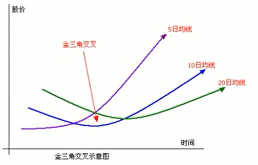

金三角交叉的有效性和可靠性大于5日和10日的黄金交叉

原因是：它又加上一条20日均线（月均线），把短期的振荡除掉。

只有经过一个**长期的底部**才能产生金三角交。三角形的**高度越低，底部时间越长，可靠性越高**

当金三角形变为点时，就成为**三线金叉**

发生金三角交叉和三线金叉是买进股票的好机会。

> **注意：金三线交叉在实际的股价走中经常出现，一且出现金三线交叉并伴随有成交量放大，投资者要立刻大胆进场。**

#### 死亡三角

死亡三角交叉是指5日均线在头部下穿10日均线、再穿20日均线，10日均线下穿20日均线而产生的三角形此三角形称死亡三角。如下图。

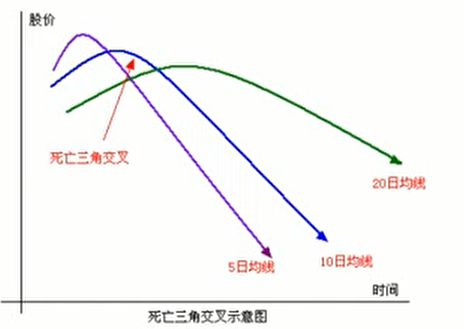

死亡三角交的有效性和可靠性大于5日和10日的死亡交叉

原因：它又加上一条20日均线（月均线），把短期的振荡除掉。只有经过一个真正的头部才能产生死亡三角交叉。

三角形的**高度越低，头部时间越长，可靠性越高**

当死亡三角变为点时，就成为**死亡三线交叉**

发生死亡三角交叉或死亡三线交叉时，是卖出股票的好机会。

**缺点：比较滞后**

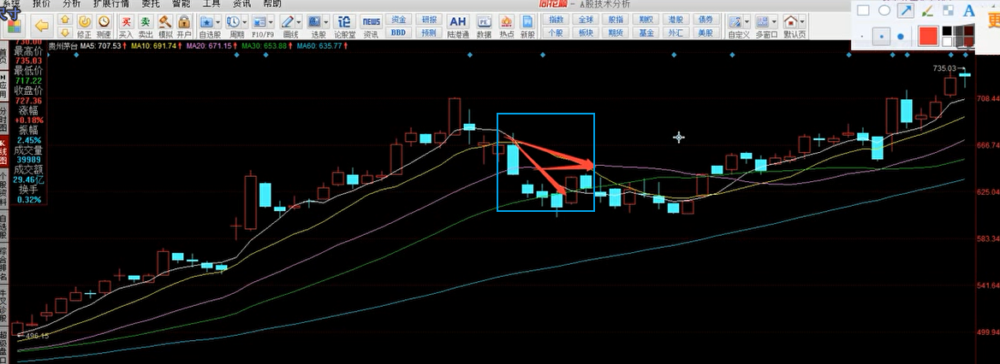

**三角交叉出现要比死亡交叉出现靠后**


## 中长线

几个月，几年，甚至几十年

- 技术面选股，别再高位，避免几年回落
- 基本面选股，题材热点、配合资金、市场可靠性、价值投资、公司管理如何

**中长线推荐周线**->月线->日线，这样看比较明朗。

> **主力的运作步骤：1.建仓->2.洗盘->3.拉升->4.调整->5.拉高->6.出货->7.反弹->8.打压**

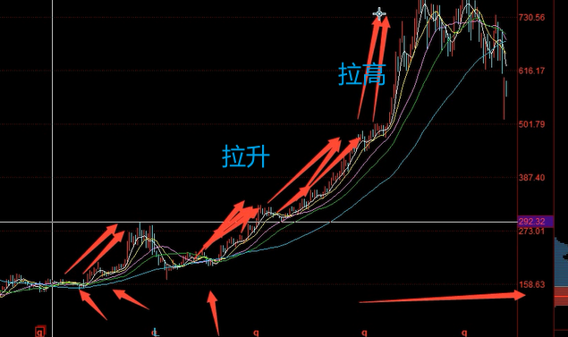

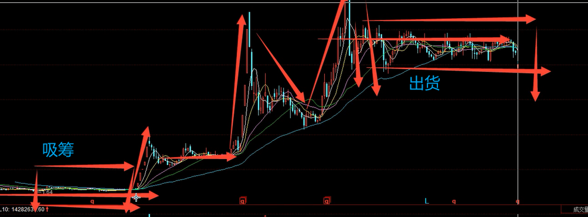

> 拉高是为了吸引散户注意！！
>
> 建仓的的初期一般和调整的末期在同一个水平位上。
>
> 打压期，主力不计成本的出库。
>
> 看周线，很明显

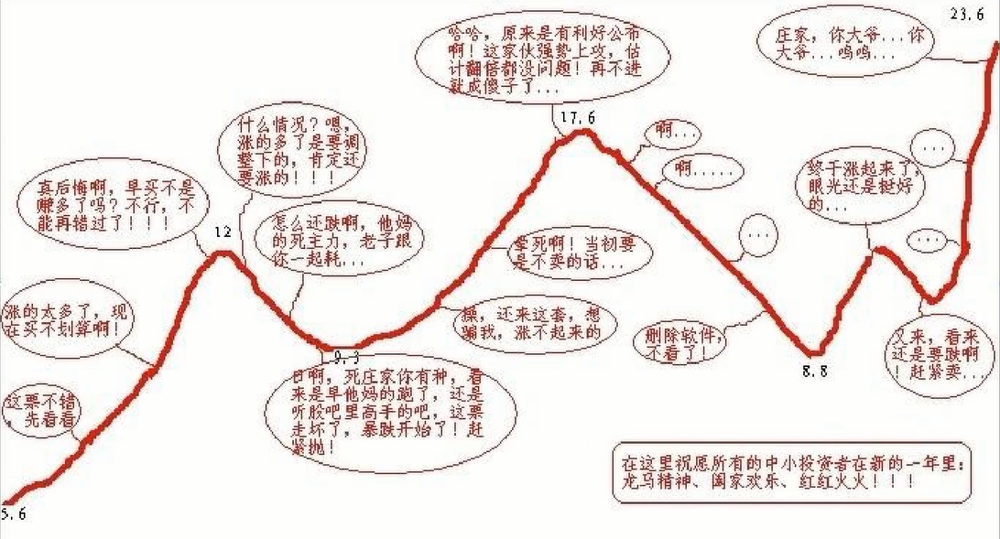

> 操作模式：分析以中长线，操作以短线

中长期基本原则：判断股票处于高位低位！上涨初期，下跌末期、中后期可以买，其他的不能买

**炒作的股票：**引诱投资者跟风。（舆论都是别人想让你看到的，明星都能控制自己的不好的消息，何况股市的主力）


### 除权

复权要去掉，打开向前除权，才能看到完整连续的价格线

> 可能是高位主力无法出货，所以除权后，价格降低，更好出货。

### 绩优股

要避免庄家刻意制造的绩优股

比如每股盈利原0.5，涨到1块钱每股，原股价7块，则应该算14块，但是炒到28块，就算价值高估。

## 波段操作

强于大盘，优于大盘

必须快人一步，每个阶段都有一些股票属于上涨期。

在大盘的底部，主力已经有很多题材的股票完成建仓，主力跑的比大盘快。

在牛市中尽可能找第二浪的股票

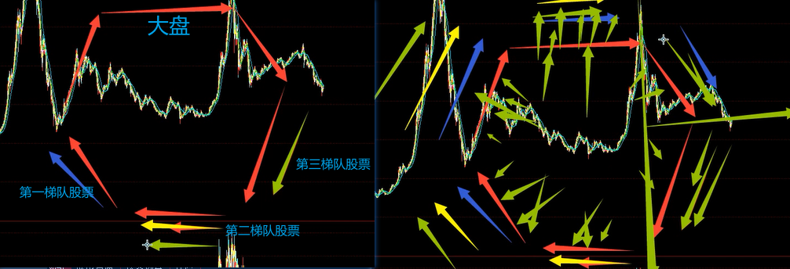

### 道氏理论

道氏理论断言，股票会随市场的趋势同向变化以反映市场趋势和状况。股票的变化表现为三种趋势：主要趋势、中期趋势及短期趋势。

#### 主要趋势

持续一年或以上，大部分股票将随大市上升或下跌，幅度一般超过20%。

#### 中期趋势

与基本趋势完全相反的方向，持续期超过三星期，幅度为基本趋势的三分之一至三分之二。

#### 短期趋势

只反映股票价格的短期变化，持续时间不超过六天。

牛市的特征表现为，主要趋势由三次主要的上升动力所组成，其中被两次下跌所打断，如：疲软期。在整个活动周期中，可能比预期的下跌得低，每次都比上次更低。在整个活动周期中，通常由几次中期趋势的下跌和恢复所构成。

> 次级折返走，在下降趋势中也可以找到好的板块

#### 画趋势线

趋势线的有效最低点和有效最高点的连线

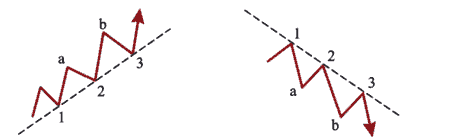

趋势线的应用

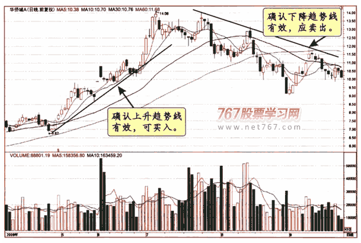

> 适用于中长期的股票，以及适用于短期的股票操作基础依据

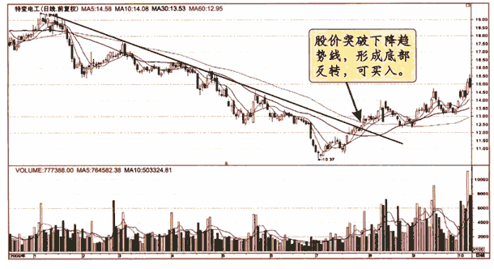

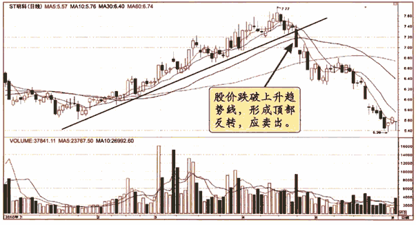

股价突破趋势线后往往会出现反抽确认现象

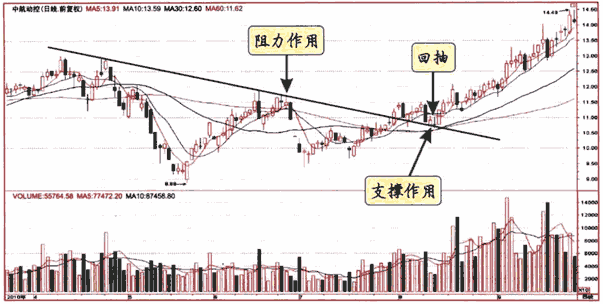

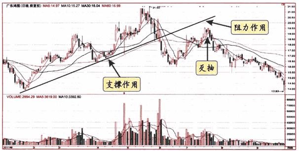

趋势线的突破是否有效：关注角度、幅度、量能配合情况

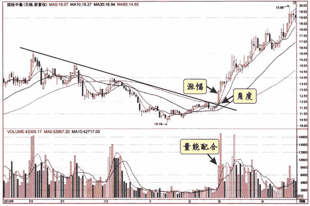

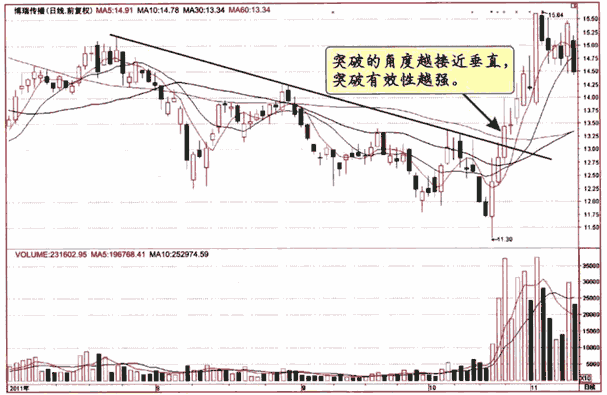

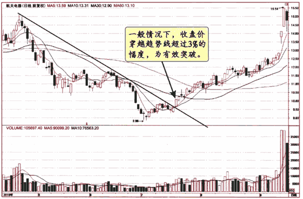

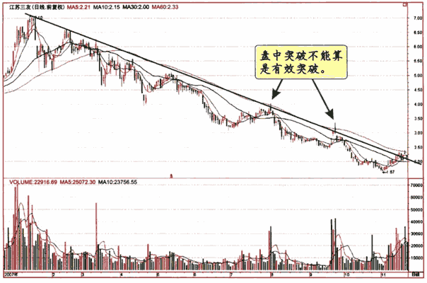

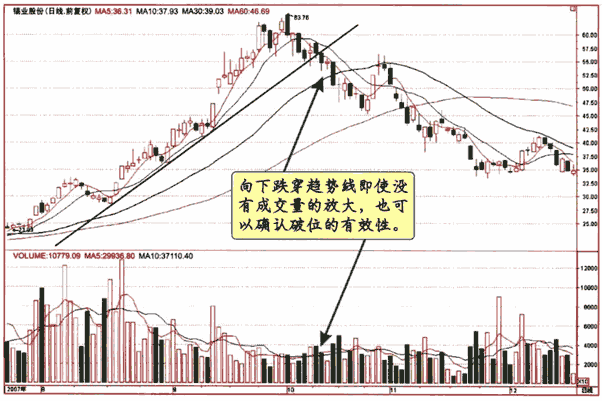

作用：确认上升趋势线，保证该股的后续涨势波段稳定，然后可以在股价下跌触及趋势线时考虑买点。

> 当然，趋势线更多的是辅助验证作用，而不是直接构成买卖决定的依据。我们在确定目标后以此做近一步验证即可。

#### 画通道线

和趋势线类似，最高最低点都画线，就为通道

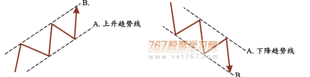

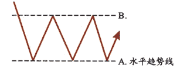

> 通道最终会选择一个方向突破

通道在波段的各个阶段都存在

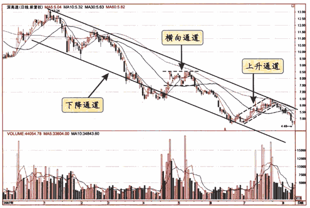

> **通道和趋势线都是用来协助我们正确判断和预测趋势变化以及目标价格**

### 大盘和个股趋势8卦图

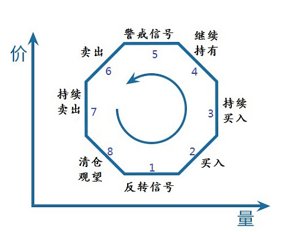

> 大盘是个股的风向标，如果主要趋势和中期趋势是向下的，要停止中长线操作

### 波段操作要点

明确时间周期：通过大盘，选择切入点，比如底部下影线，然后选择周线走势好的**，真正突破趋势的周线，还是很好过的**

明确股票趋势：**不要碰由涨变为跌，下降趋势的周K股票，比如做上涨初期上涨中期的股票**

### 设置止损止盈位置

如果均线由强支撑可以考虑，日K破了别慌，周K没破就行。如果周K见顶，要考虑退出。

### 如何掌握热点板块节奏

个股很可能收到市场和板块的影响，所以要找热点板块(强者恒强)

电脑端右下角搜索板块，可以查到板块下的所有股票，然后一个个分析过去。

### 如何抓住热点板块中的龙头

下跌过程中找低位，上涨过程中找支撑位


## 短线交易

### 基础

考验思路，短线的波段

消息股需要配合题材，配合技术面的分析

短线可以追涨，我们可能会去找下跌的，找底部股，希望补涨，但是强者恒强。

不要以中长线的思路做短线。

短线选择上升趋势的个股

**短线操作基本原则：一个个股没有了攻击力，要迅速离场，只参与有力度的上攻趋势个股**

### 短线操作成功的基础条件

自信、耐心、细心、恒心

### 操作错误后的保护措施

如果选错龙头 ，及时高位止损和低位补仓


### 短线操作的大盘条件

短线看大盘，大盘很重要，大盘当天是红的，说明大部分股票都是上涨的

涨幅排行如果超过5%的股票个数超过100个，就说明今天行情不错

涨幅加速(超过10%)的股票个数没有超过50个，就要考虑下是否要买

还可以看跌幅股票个数，对比看真的是否行情好

### 如何选择目标短线股

- 找个股强于大盘的

大盘上涨，查找**涨幅超过3%**的个股，如果5日均线翘头，可以关注。

大盘如果调整，涨幅只有0.01之类的，也可以去找个股强于大盘的

- 找放量在1以上的

**量比>1**，如果价上去了，但是没有放量，则比较虚，后期可能会跌**。量放的越大越好**

- 看股票K线图

5日均线是否带量上扬

前期是否有一组止跌的k线

该股是否是近期放量

- 打开股票周K，看MACD

MACD是否是在低位金叉，后者是在强势区域向上运动，0轴以上。

### 庄家的建仓手法

#### 打压建仓

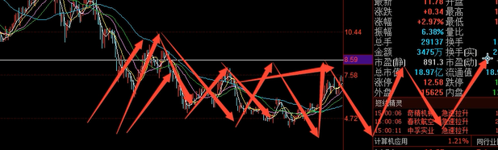


#### 暴力建仓

#### 推土机


### 短线的买入之道

> 收益和风险成正比

- 渐进形

对于凶狠砸盘，看外盘数量>内盘数量，说明庄家在洗盘，而不是在出货。只是想把价格打下来，他们再接货。

对于阴跌形，主力不做任何操作，不买不卖，散户在主力连续几天没有操作，会选择卖出，体现为跌幅不大，在一个平面，成交量在萎缩。

对于楼梯股，选择好介入时间

- 打板形

专业打板，一般选择低位，中位，尽可能避免高位股，可以选择流通盘在5000股到-2万股。涨停越早封停越好，中间打开板的可以选择介入。下载打涨停的话，很有可能是主力在抛压不大的情况下，拉高明日抛货。如果有能力涨停，不用等到下午。

市场比较弱的话不要追涨停板。

追涨停板，要选有题材的。

如果持续不涨停，高位在9.5，9.8左右，很有可能是主力在早上8、9点选择出货。

要坚持一种风格，如果要追涨停，就固定选择追涨停的风格，选择擅长的方式。

搜索涨幅排行版，查看快要接近涨停的，查看股票走势和流通盘大小，以确定是否要介入。如果9.30开盘到10点半小时的成交量是昨天成交量的1/4，基本上可以达到昨天的1倍到2倍了。

追股的话就追龙头，强者恒强，弱者恒弱。

### 短线的卖出之道

在见顶信号时卖出：高位十字星、长影线、大阴线、放量无上涨/涨停


### 集合竞价

> 9:15-9:25,(9:15-9:20,前10分钟)可以撤单，(9:20-9:25,后5分钟)不能撤单

> 集合竞价是主力活动的序幕，一支票如果是有计划的涨停，一定先从集合竞价就开始表演，这儿能充分体现主力的做盘意图，我们不看盘一定不能错过这10分钟的宝贵时间。

#### **第一种：缓慢上攻型**

1、整个集合竞价期间，撮合价格逐步加高，最好最后一两分钟有突破拉高，最后成交价最好过1%不超过4%。

2、9：20之后成交量逐渐缓慢放大，且红柱子为主，最好每个柱子间没有空隙，也就是我在群里讲课时说的密集成交。成交量时时在放大。

3、最好9：20分前，临时有巨单挂过涨停板（跌停板也可以加分）。

4、该类型要求前期不能有大涨，K线形态处在相对底部的横盘阶段。股票处于相对低位。

5、该类型要求最好是个股行为，不要受消息面影响，不然容易是假象。这样成功概率低。

6、最好个股在暖慢的上升通道，前几天有过异动。

狙击方式：及时参与集合竞价，由于这种竞价是暖慢上攻型，所以它的开盘价一般会比之前的都要高一些，我们参与的时候一定要9：24就要下单，迟了怕传不到交易所的主机，这样就没办法成交。

如果太早下单，怕有变故，例如最后一两分钟，价格轨迹突后向下打压了，这个就不符合要求了。

所以在时间的把握上要精准一些。

举例：600033 福建高速

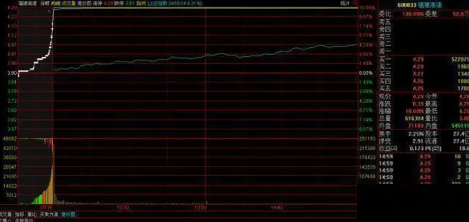

举例：002698 博实股份

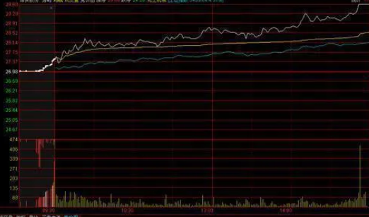

#### **第二种：急剧下坠型**

1、9：20之前高开，以涨停价持续到9：20之后。申报单没有撤单。

2、9：20之后买单不减少（注意这点很重要），卖单逐渐增加，最后几分钟卖单超过买单，价格缓慢下降。

注意是缓慢下降，不是向下跳空急降，这一点也非常重要哦。

3、可能最后几分钟价格下降严重，也许从10个点9个点开始缓慢下降到5个点6个点，最后急掉到1 2个点，都算可以接受范围。但必需是红盘高开，如果转绿盘就要小心了，不符合条件了。

4、该类型要求，最后几分钟价格可以下降很多，但是最后分钟的卖单量，要缓慢增加，如果突然加太多，就要扣分。

5、该类型要求，开始买单要大，越大越好，而且不能撤单（说明主力高位挂单是真的，真心想做多）。

6、该类型要求，开始的买单价格要高，一定要是涨停价开始，并且会延续到9：20之后。

7、该类型要求，不是因为消息而，个股行为，如果板块行动就很容易失败。不可以是前期暴涨股，前期无量板最佳。

狙击方式：激进的可以在9.24分左右挂单买入，因为9.30分以后也许主力就直接拉板了。

稳健的朋友，可以等9.30分以后观察10几分钟，看到资金不大额流出，价格稳定有支撑，就可以逢低买入。

举例：600080 金花股份

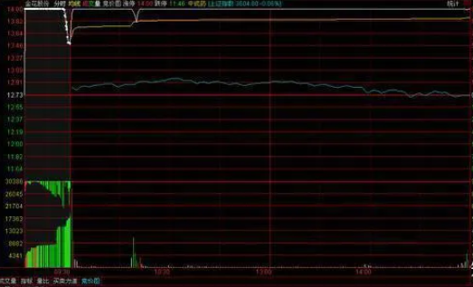

举例：600094 大铭城

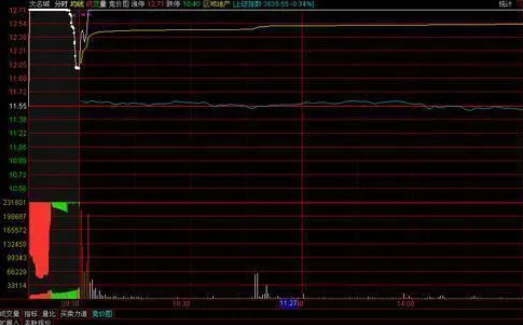

#### **第三种：无量一字型**

1、9.20分后，撮合价格稳定不动，价格轨迹成一条直线，可以小幅高开的，也可以是昨日收盘价。

2、要求成交量缓慢增加，不能变动太大。

3、要求红柱子多，绿柱子少，成交量时时变化。

4、最好撮合价格上，买入数量比卖出数量大许多，最好是1.5倍以上。

5、该类型要求，个股上升通道，无暴涨暴跌，最好有利好消息（切记该点要求和前两种情况要求截然相反）。

6、9：20之前有涨停或跌停价格出现，可以加分。

7、这一字型主要指的是9：20之后的价格运行轨迹。

狙击方式：可以等9：30以后，成交价格，不低于开盘价，稳步上攻时买入。

可以追涨，如果开盘往下杀跌，没有快速反弹到开盘价之上，都不能介入，这个模式不能先入为主，要多关注盘面。

举例：601011 宝泰隆

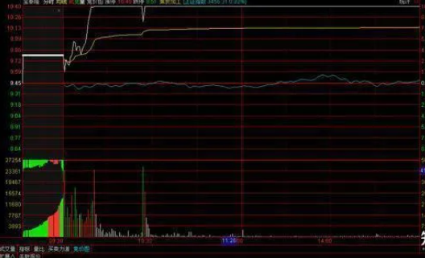

举例：

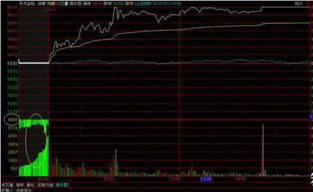

#### **操作注意事项：**

1、集合竞价买入法，容易追高，注意追高风险。

2、集合竞价买入法，容易失败，大家一定要注意每个选股的要求的细节，最好等到有完美图形出现时再出手。

3、集合竞价买入法，一旦成功，就是涨停，后期也许还有拉高或涨停

4、集合竞价买入法，最好能事前留有仓位，不能满仓干，这样被套后非常被动

### 开盘走势

> 9:30-10:00，开盘5分钟最重要！

#### 开盘位置

#### 开盘战法1：跳空开盘趋势强劲

跳空波段位置和技术关口的关系

高位跳空高开，回落，上方压力比较大。后续看空

低位跳空低开，上升，后续看多

- 突破性

- 持续性跳空高开

需要确定该股波段位置，是否是刚突破历史高位、压力位。如果是高位，很可能是衰竭性跳空开盘

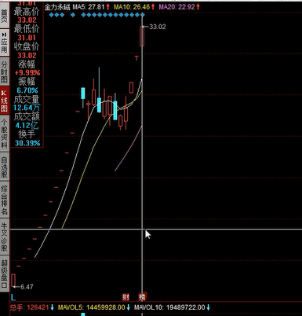

- 衰竭性

#### 开盘战法2：跳空回补区别对待

上升过程中，没有明显压力位的话，就是在震荡

上升末期，很可能是衰竭性走势

#### 开盘战法3：强势太多注意变盘

#### 开盘战法4：急涨急跌价格还原

### 中盘走势

开盘走势很强，中盘回落是对开盘走势的调整修复，可以考虑逢弱买入，当然，要考虑近期走势等等


### 尾盘基础

#### 尾盘特性移动及交易时机

尾盘选股时间段要在14:30之后。

- 按照量比降序（从大到小）排列。

量比可以反映出主力对于一直个股的喜好程度，所以尾盘我们同样可以参照早盘集合竞价的方式，在尾盘时间段，打开60排行榜，按照量比降序排列。

- 尾盘选股条件

（1）涨幅过高，屡创新高的，以及ST股统统剔除。

（2）尾盘时间段选择的个股务必站在重要支撑位上方，最好是站在60均线上方或者突破60均线。

（3）选择短期内较为活跃的个股。

大家都知道个股是具有股性的，很长时间没有一个涨停板的股票，之后的走势也很难活跃，所以短期内出现过涨停板的个股是我们的首选。比如：20个交易日内出现三到五个涨停，或者近10个交易日内出现过涨停。

（4）属于近期热点板块或者热点题材。

尾盘选股的目的就是尾盘买入，第二天或者第三天要有不错的涨幅，那么必然要求个股上涨走势要具有持续性，所以尽量选择热点板块或者题材。

（5）关注量能的变化。所选个股要属于放量上涨走势。

尾盘择机买进后安心休息，第二天盈利走人，这样一般不回套着你。

> 很多人会选择尾盘交易！可以预估未来走势，以及T+1就可以操作，好离场

一般推荐尾盘操作，除非是打榜

### 黑马形态

#### 横长竖高

这种股票竖高波段收益高，走势好

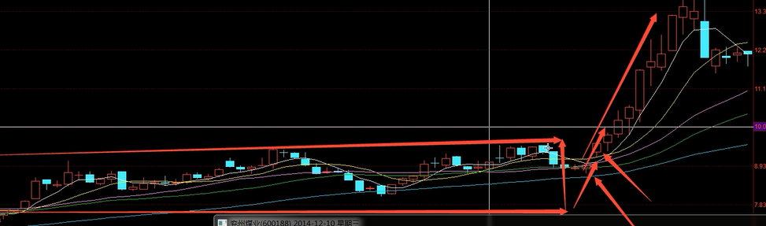

#### 窄幅箱体

说明主力比较强势，也相对安全

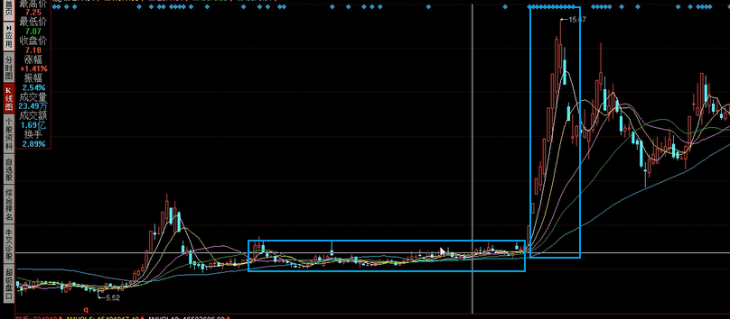

> 只要大盘不是连续跌的，哪怕是横盘调整，也是有机会的

#### 黄金三角

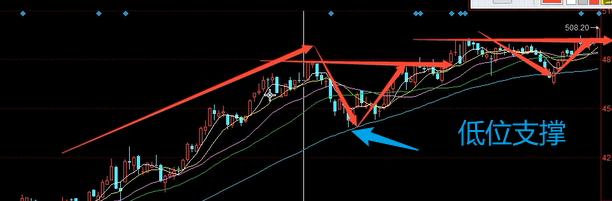

#### 斜上云天

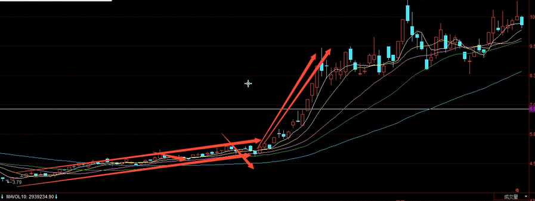

#### 斜下斗转

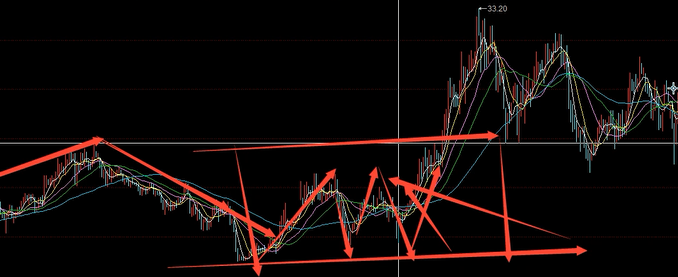

#### 龙行渐行

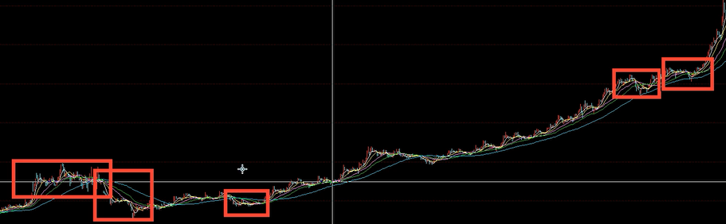

#### 诱空陷阱

## 炒股心态

> 等！

### 如何调整炒股心态

### 不要急于操作

### 不要急于挽回损失

### 不要盲目斩仓

### 不要过度恐慌

### 不要过于懊悔

### 不要急于抢反弹

### 不要过分看空

### 要顺应趋势

### 调整仓位结构

### 等待行情临界点

### 学习

### 认错

### 风险意识

### 不要急于实盘

### 不要透支

### 不听小道消息

### 不过分期望

### 不迷信

### 注意修身养性

### 不能有赌博心理

### 坚持

## 倚天屠龙理论

### 核心基础

### 注意事项

### 如何结合周K理论

### 周K操作法基础

### 趋势操作的重要性

### 如何通过周K确定趋势

## MACD

### 为什么是指标之王

### 顶背离和底背离

### 实战基础

### 零轴的作用

### 实战

### 指标之王

> 周K可以确定趋势，而大势所趋是炒股核心

## 买卖黄金点

同花顺怎么找双早晨十字星，以及他们一定上涨吗？

同花顺怎么找到底部的股票，

同花顺怎么知道主力在建仓末期

同花顺怎么找到上升初期的股票，可能是热点不高的股票

同花顺找到热门板块的热门股，并且是热门板块上升趋势的上升热门股。

怎么选到趋势向上的股票

怎么买进底部刚刚启动的股票

禁止参与拉高的股票！！已经涨了2-3波的股票也不要碰！！

如何找到黄金交叉比较明显的股票

### 金叉趋势是可以遇见的

> 0轴以上的第一个金叉！重点关注

在这个点可以考虑买入

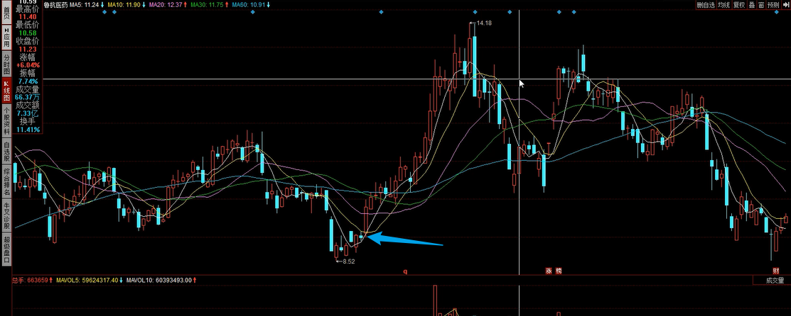

### 楼梯股

震仓一般时在下一个高位的一半，如果有把握，可以高抛低吸

比如上个回调时10个点，我们可以考虑在回调的最点开始算20个点时（此时可能时下一个回调高点），考虑出局

注意成交量，如果回调时是连续3个交易日以上的放量，可以考虑出局

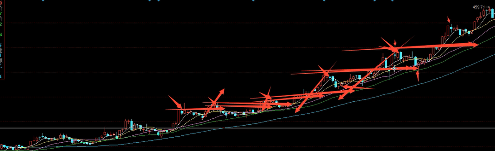

### 涨停股

> 其实越是龙头越安全

5日均线走平/转弯时考虑出局

MACD红柱缩短/走平时考虑出局

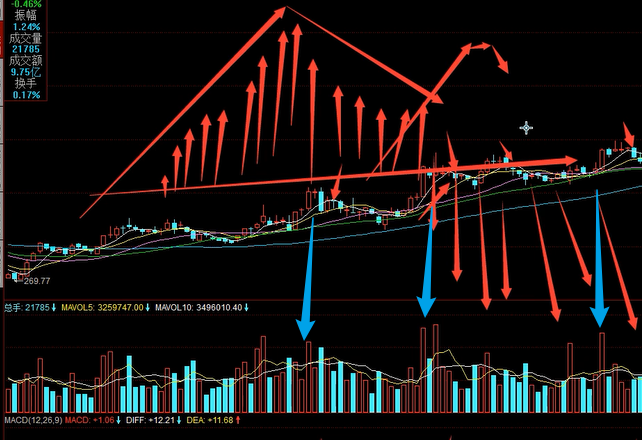

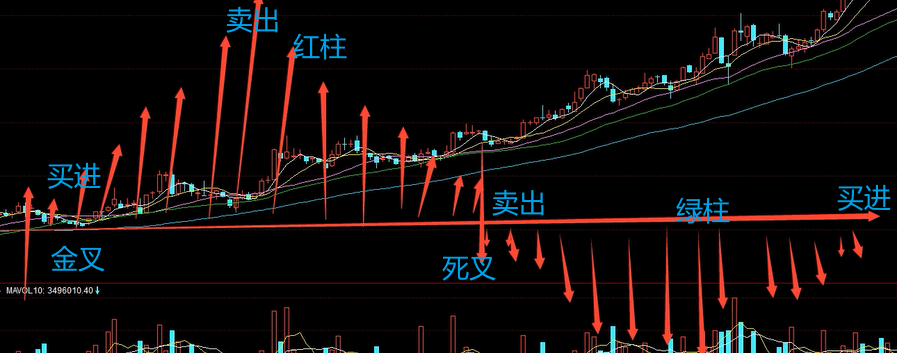

如果第二天开盘30分钟左右又涨停了，可以放心大胆持有

如果追涨停板的股票，连续3天没有涨，考虑卖出，1是资金使用被限制，2是这种股票没有力度。

A股大盘一反弹就涨停的个股，一般是领头羊，后续继续上涨的可能性比较大，可以考虑入手。

## 公式

### 倍量假阴线

**（一）符合选股策略。**出现倍量阴，特别是涨停板后，第二天就砸盘的股票，其换手率一定**是高的，这点符合绝大多数的选股策略。**

**（二）属于主力作秀。**拉这样走线，是绝对容易吸起别人注意的，那主动为什么还这么做？

- 一是吸引散户关注。
- 二是解救套牢盘。
- 三是让涨停进去的人重新套，并成为他下跌后不愿意扔筹的拥护者。
- 四是跌几天后，老股东还没解套的，新进刚被套不久的都绝望的抛筹。

（三）**下跌后就是上车机会。（当然，不能要业务不好的，不能在高位的）**

```
VWAP:=AMOUNT/(VOL*100);
假阴线1:=VWAP>REF(C,1) AND C<REFX(&OPEN,0) AND VOL>REF(VOL,1);
倍量:=VOL>REF(V,1)*1.618;
涨停:=REF(C,1)>REF(C,2)*1.090;
找到涨停:=涨停 AND 假阴线1 AND 倍量;
XG:COUNT(找到涨停,N)>=1;
```


种子理论是什么？

## 买卖实践

### 如何筛选除最近2天是下影十字星的股票

可能上攻

### 如何筛选除体量合适的股票

盘子太大，主力不一定想做，比如400亿的，一般可能20-50亿的盘子比较合适


## 开盘走势

震荡走势

高开高走

低开低走

震荡走强

震荡走弱


## 巴菲特投资

公司业务运作模式：盈利、费用、现金流、劳工关系、价格的灵活性、公司的资本需要、分配和运用状况。

ROE、FCF、低负债

（1）公司大约价值是多少？（2）公司将来偿还债务的可能性有多大？（3）管理人员的工作状态如何？是否完成了他们的任务。

> 市场就象上帝，只帮助那些努力的人；但与上帝不同，市场不会宽恕那些不清楚自己在干什么的人。

巴菲特的目标公司

　　1.我想重复一下我们在寻找什么样的公司:　(至少有5,000万美元的税后利润)

　　2.证明有持续的赢利能力(我们对预测未来不感兴趣，对“扭亏为盈”也不感兴趣)

　　3.在少量举债或不举债时，公司的净资产收益状况良好

　　4.管理得当(我们不提供管理)

　　5.业务简单(如果太复杂，我们会弄不明白)

　　6.明确的售价(在价格不明确的时候，我们连初步探讨也不情愿，因为我们不想浪费自己和卖方的时间)

# 杂谈

## **北证a股和上证A股区别**

A股市场主要板块目前A股市场有三个交易所：分别是**上海交易所**、**深圳交易所**、**北京交易所**。

根据定位不同，分为主板（上海主板、深圳主板）、科创板、创业板、北交所四大板块。

- **主板：**也称一板市场，主板又分为沪市主板和深市主板；

主板定位：突出“大盘蓝筹”特色，重点支持业务模式成熟、经营业绩稳定、规模较大、具有行业代表性的优质企业能够上主板的大多都是大型企业，具有比较大的资本规模和比较稳定的盈利能力。比如贵州茅台、四大行等等。这些企业都是各行各业的中流砥柱，主板市场又称一板市场，高富帅聚集地，准入门槛最高，传统行业偏多。主板也被视为“中国经济的晴雨表”。

- **科创板：**科创板以“支持和鼓励‘硬科技’企业上市”为核心目标，专注服务“硬科技”。

面向世界科技前沿、面向经济主战场、面向国家重大需求。优先支持符合国家战略，拥有关键核心技术，科技创新能力突出，主要依靠核心技术开展生产经营，具有稳定的商业模式，市场认可度高，社会形象良好，具有较强成长性的企业。

- **创业板：**又称二板市场，创业板主要服务成长型创新创业企业，深入贯彻创新驱动发展战略，

创业板适应发展更多依靠创新、创造、创意的大趋势，支持传统产业与新技术、新产业、新业态、新模式深度融合（即“三创四新”）

- **北交所：**全称北京证券交易所，于2021年9月3日注册成立，北交所主要服务创新型中小企业，重点支持先进制造业和现代服务业，推动传统产业转型升级，培育经济发展新动能，促进经济高质量发展。

**各主要板块股票代码**

1、沪市主板：以600、601或603开头

2、深市主板：以000、001、002、003开头

3、创业板：以300开头，属于深交所

4、科创板：以688开头，属于上交所

5、北交所：以8开头

6、新三板；以400、430、830开头

## 什么是假阴线

三七互娱 0002555 2023-11-07

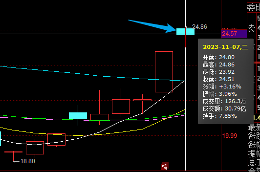

日K线是阴线，涨跌幅是红盘报收称之为假阴线.

昨天涨停，今天早盘冲高后遭遇短线获利盘回吐开始回落，午后反弹力度足矣,说明短线有所承接，不然今天会收出一根真实的阴线，而非假阴线。我对于它的期望并非是1-2天的涨跌那么简单，18.8元作为一个阶段底，经历了这么长时间的调整，上方套牢盘已经清理掉了80%，此时的反弹可以用反转一词来替代，所以接下来一段时间内，趋势上我是看上行的，短线的涨跌对我不会有太大影响 

## 跌破5日均线是什么？

就是MA5，意思就是股票下跌突破白线，后续看跌。

## 每支股票都有主力么？怎么判断是否有主力在运作？

作者：柚子
链接：https://www.zhihu.com/question/31211031/answer/2252753779
来源：知乎
著作权归作者所有。商业转载请联系作者获得授权，非商业转载请注明出处。


机构为了赚散户钱，不断的在研究散户心理和行为学，我们散户不妨反过来，把自己当成机构投资者，也来研究一下机构的心理和行为学，这样才能在这个充满陷阱、欺诈、骗术和谣言四起的市场里立于不败之地。

### **一、选票**

如果我们想做一支股票，公司会组织研究人员和投资经理，探讨出一支大小合适，前景无需多么优秀，但几年之内绝对不会倒闭的那一种。另外，公司的背景和市值也是我们要考虑的因素。

### **二、拜票**

再选出股票后，公司会安排公关人员（一般都是一个资深研究员和一个超级美女）去拜会该公司领导，告诉他我想投资他那支股票，请他们配合。行内成为“拜票”。那么要求上市公司如何配合呢?就是在我们吸筹时，在公报时尽量将业绩放平，或者适当隐藏利润，这一点公司很容易做到，只要对报表进行适当调整就行了，例如，将某些损益一个季度提完，使其报表看上去亏损；或者将后面数年的费用半年摊完，这都使得当期报表非常难看。

### **三、砸盘**

拜票成功之后（成功的几率几乎是90%，因为这些高管也想挣钱啊，你懂得……），就要开始进一些筹码，这些筹码主要用来砸盘的。

怎么收集这些砸盘的筹码?我不会每天慢慢去收集，因为这样会使股票天天上涨，反而难以收到足够的筹码，还容易被散户抢，并使技术指标形成向上趋势，更使自己收集成本提高。我会在某一天用大涨的办法来收集，当连跌数天后，散户都悲观失望，猛然一个大涨，套牢的看到了希望，不会抛出；而短线获利的，可能就交枪了，其实，在这个价位我只是要砸盘的筹码，不需要收集很多，因此用猛然大涨的办法就很容易达到目的。

第二天来个低开。为什么要低开而不高开，因为我昨天收集的筹码并不准备获利，而且要让昨天追风进去的短线筹码帮我砸盘，如果高开，很容易让短线筹码获利，他们就会在下跌途中有更多的资金来跟我抢筹，所以一定要低开，消耗这些短线资金。在这个下跌途中，我将逐步用单托底，因为我要形成自己的底仓。经过几天的连续下跌，有些割肉的筹码就会回补自己的仓位，这时候我不能让他们回补，我必须迅速的吃上去让他们追风，当形成追风盘时，我将在底部的部分筹码高抛，一是为了降低成本，二是腾出资金，然后再迅速的砸下去。

同样的，我会边托边砸，这样一来我就会得到更多价格更低的筹码。

当跌到很低位时，基本上就没人和我抢筹码了，因为在这个下跌途中，我通过不断的高抛低吸，不断的大幅度振荡，将大部分抄底的，抢反弹的都套在下跌途中，或者将他们亏损怠尽，使其不敢在来涉足这个股票，这时候我的目的就达到了。而公司的配合在这时就非常关键，长时间的业绩没有任何起色，使大部分散户因怀疑其会不会ST，到恐惧惊慌，高位筹码就会不断的掉落，我就可以在底部横盘当中不断的高抛低吸来收集筹码，这个可能需要较长时间，关键看顶部筹码掉落程度而定，如果高位筹码长时间的不松动，那我就不会去拉这只股票。

### **四、散布消息**

当筹码收集足够多时，公司的业绩也会转好了，因为在我收集筹码当中，公司将后面几年能想的出来的损益，或者费用都在那一年半载中摊完了，后面的报表当然好看。这时候我拉起来毫不费力，也无需多大成本。当这个市场里其他人看到这个股原来这么优秀，必然跟风者众，我就在这这当中逐步减仓。

会通过东财股吧、新浪微博、傻瓜理财直播等互动交流社区去发布一些关于上市公司的消息，当然，因为我们是跟上市公司沟通好的，自然我们能拿到第一手的消息，引发投资者关注。

公司能如此配合，那他能得到什么好处?其实很简单，我将股票拉到高位，他们也能卖个好价钱；在低位时，他们同样可以购入自己的股票，还能挣得名声，这样一来收益会相当可观，何乐而不为?

这当然要和大盘走势相同，在这中间，散户该知道怎么办了吧。

### **五、监管**

当然，如果我做庄，还必需考虑很多问题：

第一是证监会的监控，他们捏死个把苍蝇还是不成问题的，所以操控股票不能让他们抓住把柄，这时候就要考虑多户头，或者拉几个私募大户集体作战。

第二要考虑产业资本的问题，如果我们拉的时候，他们看到利润可观，结果大量抛出筹码，那我们就惨了，必然会亏本出局，在做之前就必需先和他们沟通好，而且还要了解他们手上的流通盘是多少，抛售意向如何，这就是大小非问题。

第三个要考虑的是老庄，如果这个股没有被老庄放弃，那我是尽量不会去碰的，因为一但被老庄反做，那你死得就惨了。

第四个就是大盘状况，跟风的多不多，社会上的存量资金足不足，如果大部分散户或者大户都刚被大宰一刀，这时候就不适宜做股票，你拉人家卖，结果把自己套在里面，那现在最适宜的就是砸股票。一般人都有个心态，20元买的股，跌到15元不卖，跌到10元不卖，跌到5元仍然没多少会人卖，但是你要跌到2元再拉回4元，不少人一看翻倍基本上都会割肉的，特别是长时间的向下或者横盘。如果这些问题都解决了，砸盘就要开始。砸多少为适宜?根据大盘状况，每天操盘必需跟着大盘走，当大盘大跌时，你必需深砸下去，这时候成本很低，只要用少量筹码将关键点位砸开即可，会有止损盘帮你接着砸下去。但是尾盘必需进一些筹码，防止第二天大盘走低或者走高，有一定量筹码就好灵活掌握，也就是说，要在操盘时盯着[指标股](https://www.zhihu.com/search?q=指标股&search_source=Entity&hybrid_search_source=Entity&hybrid_search_extra={"sourceType"%3A"answer"%2C"sourceId"%3A1834775128})。

为什么要盯着指标股去做?关键就在于成本，随着大盘波动，你的成本最低，指标股跌时，你也跌，所用砸盘筹码量最少，因为没有多少人敢买，可以深砸。当大盘涨时你去拉，同样无须买多少，只要将关键点位的筹码买掉即可，有人会将股价推上去，到一定高点，你还可以将低位进的筹码出掉一些，这样可以腾出一点资金做一点差价。

所以，我们看到的股市局面就是要涨一起涨，要跌大家都去跌。

### **六、针对不同投资者的策略**

在股市中的人分好几种，趋势投资者，套牢后不理不睬者，技术派，基本面派，长线客，短线炒家等等。

我要在这个股票里做庄，这些人我都要面对，尽量的让他们在我控制的这个股票里少赚或者割肉而去，这时候我就要用很多办法来对付，因为他们赚多了，意味着我就赚少了，他们不割肉，我就赚不到钱。

对趋势投资者，我没什么好办法，只能将他们看做[锁仓](https://www.zhihu.com/search?q=锁仓&search_source=Entity&hybrid_search_source=Entity&hybrid_search_extra={"sourceType"%3A"answer"%2C"sourceId"%3A1834775128})的一员。

技术派一般短线较多，喜欢做波段，这里面高手很多，这些也是我们要重点提防的，有时候稍有不慎就可能导致我们整个计划的夭折。因为一些高手有不少死忠跟着，容易形成较大的资金买盘或者卖盘。有时候，我们也会跟一些民间高手进行沟通，希望他们能配合我们的布局，当然，我们会让他们在这其中也能有所获利。

我一般最喜欢套牢后不理不睬的，这些人把钱交给我后帮我锁定了大部分筹码，使我在底位有充足的资金纵横驰骋。

基本面派也是我喜欢的第二位，因为当我将股价拉高后他们基本就接手了，企业的基本面在我拉高股价后变得非常亮丽，他们就会来接盘;等他们接完后公司基本面就发生改变，他们在低位就将筹码再还给我。

回过头来看，呵呵，真搞笑，K线走的还真符合某些技术指标特点。偶然乎，必然乎。

这里解释一下我为什么要猛杀游资。

其实这关乎自己的短期收益，因为短线客和游资的钱最好赚，他们持筹码的时间短，可以使我非常短的时间里获利。

例如套牢盘，你只能一次性的赚他一下，他然后就不动了,你就拿他一点办法都没有，这中间有时候长达几年，在这几年里我可是要吃要喝的；基本面派也使我获利不多，因为他们的利润我还要和公司均分。

但短线客和游资就不同了，我在一个波段中就可以获利丰厚。

那怎么做呢?

第一是是逐步拉升，这时候技术指标就开始走好，技术派的人一看技术指标，一般都容易被诱惑进来，这中间我就边拉边卖，需要控制的就是在顶背离之前将筹码交他们手中，使他们看上去技术指标仍然没有到顶，股价还可以涨得更高，这时候第二天来个冲高回落，然后第三天猛然下跌，他们基本上就开始交枪了，不用我来，股价就下去了，这中间自然我设定好价位来捡果实，对游资更是这样，上半段我来拉，游资一看股价看涨，立即蜂拥而来，那下半段我就将部分筹码交给他们，第二天我来个低开低走，游资一看势头不对立即出逃，这时候我就要看出逃数量，并计算自己的成果，如果出逃数量足够多，那我下午就拉起，因为大部分短线客都走了，我就不需要支付多少利润出去，很容易将股价拉起来，而我在这两天来回的差价最少是赚交易额的3%左右。但如果发现没有走多少时，那我就继续向下做。

这就是我们操作一只股票的整个过程，这个时间少则一年的时间，多则2-3年。现在回头来看，那些什么明星[基金经理](https://www.zhihu.com/search?q=基金经理&search_source=Entity&hybrid_search_source=Entity&hybrid_search_extra={"sourceType"%3A"answer"%2C"sourceId"%3A2252753779})、交易员，都是包装出来的；分析师发布的报告，也都是为了应付差事，拿一份工资。真正的操盘手是根本不看这些的。

现在你明白为什么你一卖就涨，一买就跌啊?因为你跟大部分人的行为是一致的。

这正是机构能 获利的根本原因！

## 委比100%说明什么

公式：委比=(委买手数-委卖手数)÷(委买手数+委卖手数)×100%。

解读：

- 委比值是<0时(负数)，卖盘要大于买盘；而委比值>0时(正数)，说明买盘比卖盘大。

- 当委比值为-100时，它想告诉我们的是卖盘，却没有买盘，通常是在股票跌停时能看到的景象，说明市场的抛盘操作很强劲；
- 当委比值为+100时，通常这种情况会出现在股票涨跌的时候，说明正在操作买盘的股民不在少数。

## 筹码峰

红色获利，蓝色套牢，白色平均成本

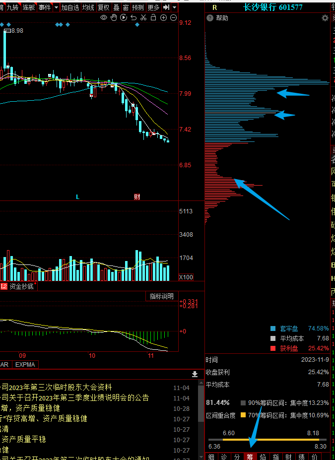


# 妖股

## 历史

### 2016 三江购物

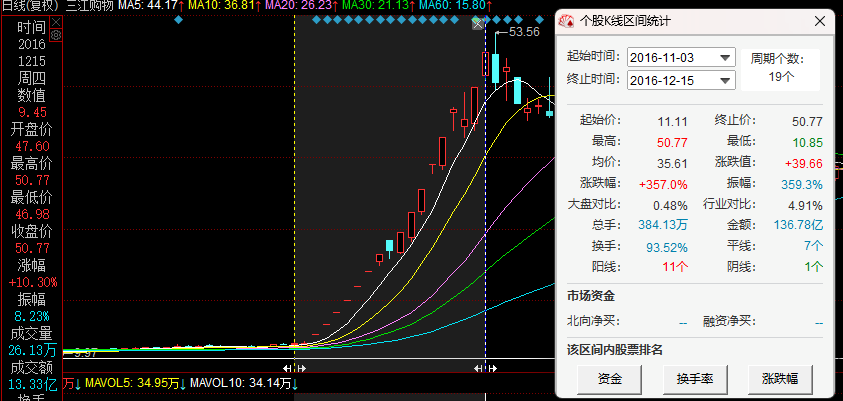

### 2017 贵州燃气

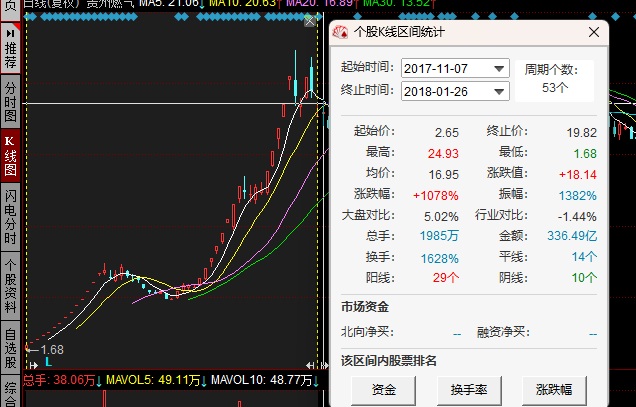

### 2018 东方通信

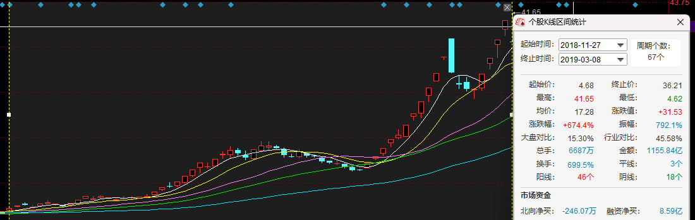

### 2019 星期六

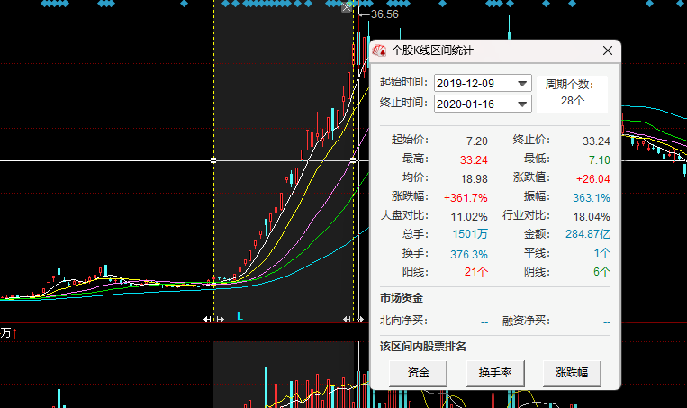

### 2020 郑州煤电

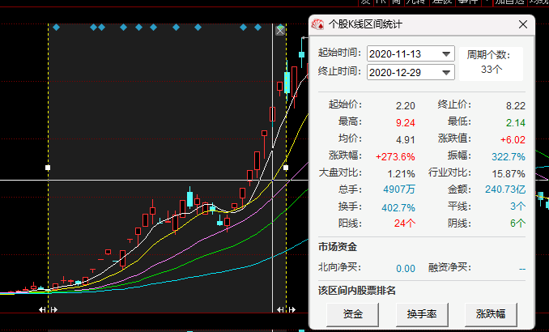

### 2021 九安医疗

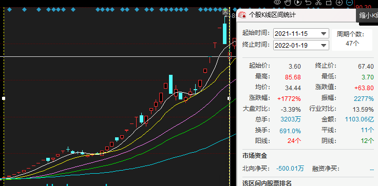

### 2022 西安饮食

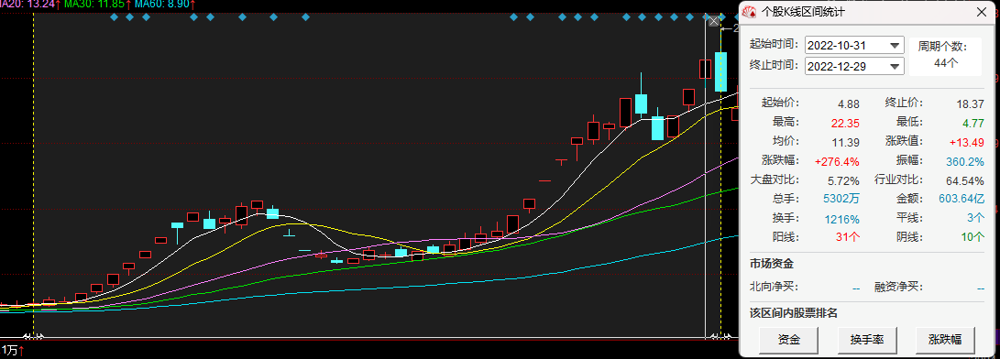

## 特性

> 跨年大妖

介入时间：10、11月

市值<50亿/20亿

股价<10元

*大题材，主线龙头*


## 完蛋我们被龙凤包围了

> 龙字辈炒完炒凤字辈


# 复盘

> 增加盘感 ✔️ ❌

## 2023-11-06 002555 三七互娱

买入: 22.996 

选择理由：

- MACD五日均线上穿10日均线，形成金叉
- 且1105为早晨十字星

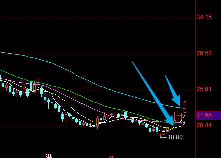

- 且资金流入大，有量比（我就是在早上开盘后去按资金流入排序选中的）

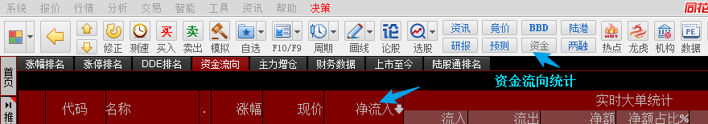

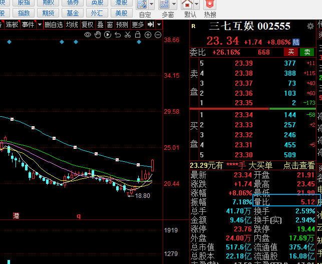

- 周K虽然还没有突破，但是走势是上扬的

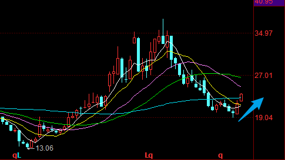

- 成交量也是上升形态

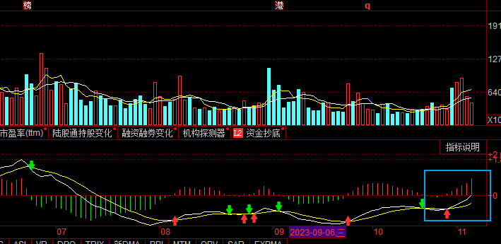

> 祝我追涨成功！

2023年11月6日 10点46分： 真的涨停了

## 2023-11-07 002229 鸿博股份

- 资金流入，高✔️

- 日K，金叉✔️
- 周k，突破20日线，整体下降趋势，且处于高位❌
- 周k，有60日线支撑，在60日线上方❌
- MACD在0轴下方，虽有上升趋势，但是高位❌
- 【结论】观望，短期可以尝试操作，中长期不看好，未有不建议追入


## 2023-11-07 300606 金太阳

日k向上

周k有支撑

有量

MACD在0轴以上，金叉后第3天

整体趋势向上

好股，观望，无资金买入，后续看涨

## 总结

- 仓位管理

要做好仓位管理

全仓一只股，这股第二天涨幅一点点，不如去买其他走势好，可能涨停的股。

这样收益会更多？待验证？

- 看资金流入

不是很准确，并不是多了就是好的。比如资金净流入3个亿，第二天也可能是下跌的。（也可能是洗盘）

还要看其他指标

- 收益

其实玩股票最重要的是收益率，1天最高10%，而你要做的是尽可能让你的本金收益接近10%。

而要做到这样，一个是擒龙，这个随缘

一个是将鸡蛋放到不同的盘子里，1只不涨停，可能另一只就涨停了。最后总体的收益率就会高些


# 追龙

## 选择概念/行业

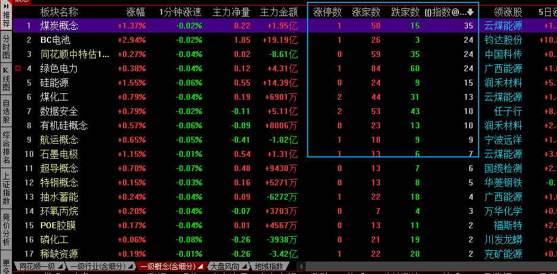


- 概念股异动->龙头，比如今天网络安全突然异动，涨了十几个点，怎么知道这个消息？
- 浪潮信息追高了，消息最早出现在新浪新闻。11/9 早6点，下午4点17分股吧消息，该股迅速拉升

- 主力怎么选择要炒作的概念？

- 如何确定起爆的手板，不追高，不打版
- 是否可以线确定热门板块？在选择板块龙头？（但是感觉板块热不热都是根据时点新闻来的）
- **搜索0%获利盘的股票**,`WINNER(C)*100 <=0;`,强者恒强有一定的道理，但是从物极必反的角度，反向选择盈利盘小的(5%)也不是不行(此阶段大部分人是亏钱的)。


短线超级难做！！

筛选出金叉上升状态的股票，然后直接看中长期把！！

妖股随缘


# 总结

> 就三七互娱的思路正确了一把

基础项：

- MACD五日均线上穿10日均线,形成金叉（最好是即将形成金叉，金叉/二次金叉太晚了），且形成金叉前有量（资金入场，可以查看个股资金净流入）

加分项：(符合越多越准确，每一项都不能单独作为依赖，不然会亏很多。。)

- 筹码峰<10%，越小越好，且公司经营时间久，这样就可能是横盘见底了。(盈利的人少，套牢的人多，极有可能触底反弹)
- 成交量属于上升状态

- KDJ形成交叉，紫色J线在上面

- RSI接近或小于20（超卖）
- 股价创新低，RSI底背离（看涨）（形成底背离是后一天了，属于复盘验证）
- 总股本最好在10-50亿(资金喜欢的段位，太大太小都不好)

研究：

- 根据AI相似个股查找走势相似的股票！！（最好可以指定时间）

> 通过概念的涨跌，选择板块的龙头股，这种思路是否可行？


# 感想

- 我们应该用10W本金选一只上涨走势的股票做中长线，假设6个月翻10倍，就是100W！！

- 每日收盘后研读涨幅排行版前几的股票，复盘股票异动，把控趋势
- 不能选换手率低的，卖都卖不出去
- 选周K的MACD黄金交叉点

# 做T

## 基本要求

股要有预期（股性要好）

股要活跃

日内T+0

## 目的

保留底仓，滚动做T（风控管理，利润最大化）

**核心目的是把成本降下来！！**

## 原理

本质：先买后买（低吸高抛）(正T)，先卖后买(高抛低吸)(倒T)

基础：

- 选一只可以中长期持有的股票（可以考虑定投标普500）

- 先有一个底仓（一般40%-60%）会比较好一点
- 选的股票日间振幅得要够大（交易有手续费，如果买卖差值不够大，那就是给券商打工了）
- 不用关注股票的涨跌，因为你此时操作的是赚取差价，涨跌不是你考虑的点。
- 如果股票当天是单边上涨，就做先买后买（低吸高抛）(正T)
- 如果股票当天是单边下跌，就做先卖后买 (高抛低吸) (倒T)

原则：

- **T完之后保持原来的仓位不变，当天买进多少就得卖出多少，卖出多少就得买进多少。**
- 要设置预期目标值，比如5%-20%。不能看涨得好，就舍不得(卖出)做T了，一看跌的凶，就不敢(买进)做T了。(你是做T的，不是在做补仓止盈止损）
- **要严格控制买入卖出的数量，单次买入卖出数量不超过半仓，行情好可以日内做2-3次，建议每次数量控制在30%-50%仓位**

做T最重要的成本就是佣金加上印花税，印花税是千一，佣金现在普遍是万2.5（最低起交5元钱），

那么如果你的资产超过了4万，按照半仓2万做一次T的话，成本就是印花税20元加上佣金10元，那就是30除以20000等于0.15%，

这样一来，就一定要找那种5%**振幅**的股票做T，只要是有1%的振幅，扣除个0.15%，一天还是能赚不少的。

> 做T炒的是股数

凡事资金低于10w的不用去做了。10w资金的体量也就买卖10块以下的个股才能做日内，但一次交易，你赚2-3个点也就2，3毛，还不够你开支手续费的。就算你牛b，赚10个点，扣除手续费，也就赚几毛，也就赚个几百块钱，为了几百块钱相对于要付出的风险，性价比太低，根本无意义。。

标的越高价，越值得做日内。比如茅台，你做的好，1，2个点就10几块的波动

50元以上的标的最好，因为升1-2个点就有几块钱的利润，刨去交易成本，还有比较客观的利润。做日内，一定要计算性价比，风险收益比。这是做生意最基本的逻辑。没这个逻辑的人不要去做日内，那是一定亏钱的。

所以在考虑做日内的时候，先想想你有多少本钱。

## 成本计算

如果股数多，会降低成本

如果股数少，会增加成本

验证下高抛低吸的手法：

假如你有100股，先卖可得3.9x100-5（佣金）-0.39（印花税）=384.61元，

再买需花-3.85x100-5=-390元，

一卖一买，倒赔5.39元，每股成本会增加0.0539元，变成3.8539元

假设你有1000股，就不一样了，

先卖可得3.9x1000-5-3.9=3891.1元，再买需画-3.85x1000-5=-3855元，一卖一买，赚了36.9元，每股成本会减少0.0369元变为3.7631元。

## 案例

### 先卖后买(高抛低吸)

假设你持有股票A 1000股，每股 10块钱，

你在 10块钱 的位置 卖出 500股

你在 9.5块 的位置 买回 500股

当股票 涨回 10块钱 的时候，你的成本就变成 9.75 块了


## 判断可以做T

### 先卖后买（高抛低吸）

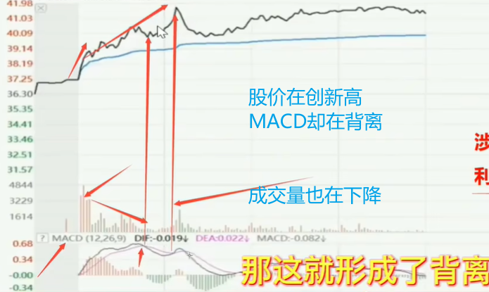

成交量和MACD同步出现背离时时最准确的


### 先买后卖（低吸高抛）

盘中确定低点

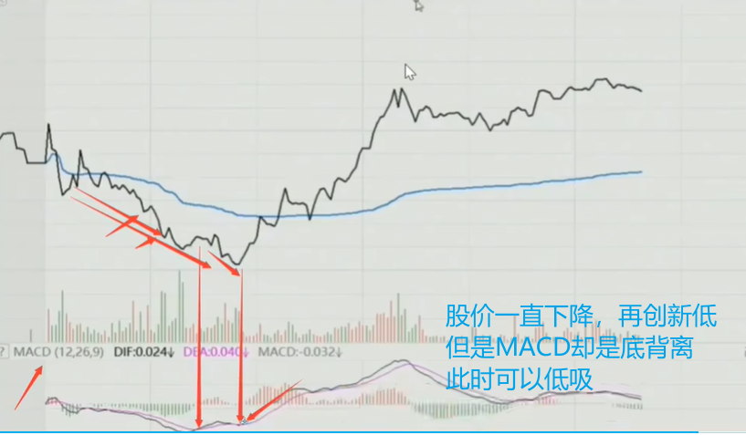


## 做T失败

震荡才能做T，趋势不好做T

比如低点买入，高点卖出，遇到持续创新低，就变成套牢了，增加成本

比如高点卖出，低点买入，遇到持续上涨，就变成大牛股越走越远了。

波动小的股票，忙来忙去对冲手续费，也赚不了钱。

# 选股

## 板块主线

市场的主线，汽车及零配件，文化传媒，消费电子，算力租赁，医药，存储芯片，燃气

> 跟对行业板块和概念，可能会迟到大肉，具体慎入研究一下。

选定热门行业（行业的k线图）

选定热门概念（概念的k线图）

选定热门股票（股票的k线图、周K图、MACD、筹码峰、KDJ、RSI等）

做出合理的判断

~~根据近期涨幅比较大的热股选定形态走势相同的股（在起跳前）~~

~~2连板的股？关键词：2天2板/2天1板~~

三进三爆：板块三次进入涨幅榜前十，板块成分股三次出现爆发式涨停。这样的板块就有希望

## 涨跌幅

**一般先查清各类排行版前20名的股票在一个月内的涨幅情况，**尽快整理出整个股市之中的龙头股

排行榜中有多只股票同属一个板块，说明该板块已成为短期热点，可以关注其中成交量大、涨幅不大的个股以及次新品种

通过涨跌幅排行榜寻找龙头的步骤：**先找到龙头板块->在板块中寻找最有爆发力量的个股**

## 成交量

选黑马股

- 成交量温和放大伴随股价小幅上涨，是大涨的前兆
- 当日内平均成交量的概念要牢记，当若干日平均成交量非常接近一致时，表示庄家在上攻之前成交量已经调整到位，浮码已清除干净；经过观察可发现5日成交均量和10日成交均相匹配，在股价上涨之前发起的买入信号较明确。
- RSI显示底背离时，成交量放大，5日成交均量超过10日成交均量，表示庄家出少进多，底部承接盘活跃，买气旺盛，大底出现了，最佳买入时机到了。

缩量上涨

某些股票在底部出现明显放量后，开始在一个上升通道中震荡上行，随着股价运动到比较高的区域，成交量反而逐步缩小。这些股票的缩量，反映了这些股票的庄家通过在底部的吸货和洗盘，已经将筹码大量聚集在自己的手中，所以股价越是向上走，成交量就会越小。遇到此类股票，可在其上升通道中逢低吸纳，会有较大的收益。

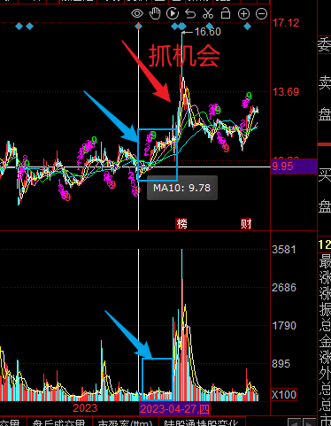

> 缩量指的是整体的成交量在高成交量量的下面

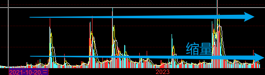

> 强者恒强，能涨停的股票才能赚大钱

## 趋势线

趋势让自己立于不败之地

## 轨道线

下降通道突破上轨

## MACD

**0轴以上的金叉**为买点(有效金叉)，如果大胆一些，可以考虑在形成金叉前几天**观察蜡烛图**买入，收益更大，风险也更大（可能会形成不了金叉）

## KDJ

> 日KDJ变化比周KDJ快，往往周KDJ金叉时，日KDJ已提前形成几天金叉了，买入成本会更高，可以考虑提前买入。

日KDJ曲线也徘徊在中位（50附近），同时股价也在比较大成交量的配合下，向上突破股价的中长期均线时，股价短期内将上涨，

**周KDJ曲线低位金交叉时，月KDJ、周KDJ、日KDJ所有指标低位全部金叉共震，50%资金应全线买入，且中线持有**

日周kdj不一致时，以月kdj判断趋势

**下跌趋势中，交叉点，紫色在上面可以考虑买入**

## RSI

下跌趋势中比较有效

1、当6日RSI低于20时，行情进入超卖状态。这是**看涨买入**信号。

2、当6日RSI超过80时，行情进入超买状态。这是**看跌卖出**信号。

3、当6日RSI在低位向上穿越12日RSI时，形成RSI低位金叉。这是**看涨买入**信号。

4、当6日RSI在高位向下穿越12日RSI时，形成RSI高位死叉。这是**看跌卖出**信号。

5、当6日RSI连续两次下跌到同一位置获得支撑反弹时，形成RSI的双重底形态。这是**看涨买入**信号。

6、当6日RSI连续两次上涨到同一位置遇到阻力回落时，形成RSI的双重顶形态。这是**看跌卖出**信号。

7、如果股价连创新低的同时RSI指标没有创新低，就形成RSI指标**底背离**。底背离是**看涨买入**信号。

8、如果股价连创新高的同时RSI指标不能创新高，就形成RSI指标**顶背离**。顶背离是**看跌卖出**信号。

推演：2个十字星，横线，底部上升，后续上升

## APBR

AR人气指标，介于80至100，可能盘整；过高，可能回落；过低可能反弹。

BR意愿指标，介于70至150，可能盘整；高于300，可能回档；

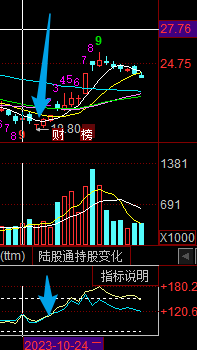

## BOLL

股价多数时间在**上轨与中轨之间运行，表示股价处于强势区运行**，股价有望不断走高，这类股票投资者可以考虑介入

开口逐渐变小代表股价涨跌幅度逐渐变小，多空力量趋于一致，股价将会选择方向突破，**开口越小，股价突破力度越大。**

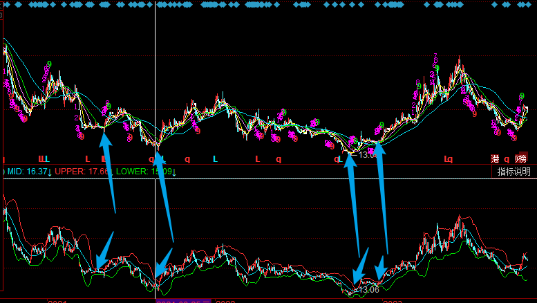

k线图缩小2-3倍，观察每个起步趋势的boll开口大小，判断当前是否处于下一个爬坡起步开口

> 选定boll线开口较小的股票后，不要急于买进，要进一步观察其他指标，比如股价位置，k线，基本面等

下降趋势中的上涨boll线开口比较明显

## 黑马股

1.低起点，大多数<10元

2.远景题材

3.动力

4.市值小，流通盘小（抛压轻，易拉升，大盘不利时主力能够以护盘）

5.启动前各种利空消息

## 换手率

一般来说，当某股的股价处于低位，当日换手率达到4%左右时，应引起投资者的关注，而上升途中的换手率达到20%左右时则应引起警惕。


## 量比

**量比>1**，如果价上去了，但是没有放量，则比较虚，后期可能会跌**。量放的越大越好**

## 市赚率

市赚率=市盈率/净资产收益率（PR=PE/ROE）。当市赚率等于1PR为合理估值，大于1PR和小于1PR则为高估和低估。

*ROE去掉百分号直接计算*

## 打板

首板中提出非热门题材,题材太偏不行

已有题材估计也无法上位，毕竟只能有一个龙头

启动前的趋势要平稳，k线差的剔除

市值高的剔除，最好在3-8块

l1的上位概率大，融的无法上位(?),深股融的可能可以(但是走不远?)，剔除科创的(?)。走到后期的基本上时L1的(5板以上)

*市值是随着股价涨停增加的，8个涨停，市值就能翻倍！*

**最厉害的：找到打板前的股票！！！**！ 趋势都类似：金叉，然后平稳

## 找底部

找到汤勺底部，然后布局

> 最稳健的方式

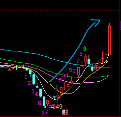

> 研究研究研究！！！！！找出这种走势的图形


# 战法

## 独立穿越龙头的二波

龙头的辨识度是非常高的，人气也非常大，一般情况下很少只走一波，往往都会有两波，甚至是三波的行情，如今年的浙江建投、西安饮食等。

## 破位洗盘涨停技术

这里的技术核心就是涨停最低价跌破时成交量是萎缩的，说明主力资金并没有出逃，当随后股价再次上穿涨停最低价时就是我们极佳的入场点。

## 龙头战法-九阳神功

龙头首阴战法：指股价连续上涨后出现了一根放量阴线，次日就开始止跌上涨，这里的保险买点就是股价突破放量阴的最高价时介入。

## 涨停回马

股价在低位出现涨停板，随后股价出现了冲高回落，但未有跌破涨停板的最低价，如果股价在涨停板最低价附近止跌企稳我们就可以及时介入。

## 放量阴试盘

股价突破放量阴的最高价就是试盘结束的信号，随后就是一波快速拉升的主升浪行情。

## 2板定龙头

在二板的时候可以缩小K线图看看其左边的高点，如果是突破了左峰，那么这里的放量就有可能是前期的套牢盘充分释放了，后面将会有一波快速上涨的空间。


# 二进三

**规律总结：**

周五的二板：换手率高的（20~40左右），下周一都晋级成功了

例外：**2进3，高换手，但是晋级失败的，还会在次周二拉一次。**

省广集团 20231117，换手高，但次周一多空不一致没有晋级成功，但后续也继续走高

四通集团 20231117，换手低，因为是一字板，但次周一低开高走封涨停。（2板1字板，不跟就是了=.=）

XXXXXXXXXXXXXXX

错误战法！！

> 二板打板，需要4板才有10%收益，很危险！！

应该1进二，然后二进三换手如果高，是稳定君心。


# 1进二

## 换手战法

短线擒龙中

首板中排序换手率>20%的涨停板，2板都晋级成功了！

2板中高换手率的，3板都晋级成功了！

**策略：=> 而我们就是盯着首板成功的股票中换手率高的，在次日的开盘买进！！，这样我们就可以吃到一个涨停板！**

**失败例子：**

国际汽车 20231101，换手率高，但是次日晋级2板失败

首版涨停+换手[实]>20%

> 换手[实]的分母是自由流通股，而换手的分母是流通股！所以日K换手一般会比换手[实]低

**操作步骤：**

热点->短线擒龙->昨日首版->高换手率(>20%)->日K换手(>20%)->加入自选->次日开盘买进->隔日尾盘卖出

> **原理：首板涨停，2板开盘进，3板尾盘卖出，吃一个涨停！**

战法验证；

### 10-31

#### 浙江正特

首板成功 -> 进2成功[开盘/低位进] -> **进3成功**<font style="font-weight:bold;color:red">[吃:尾盘出]</font> -> <font style="font-weight:bold;color:orange">进4失败</font>

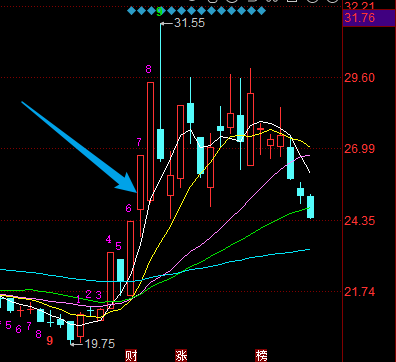

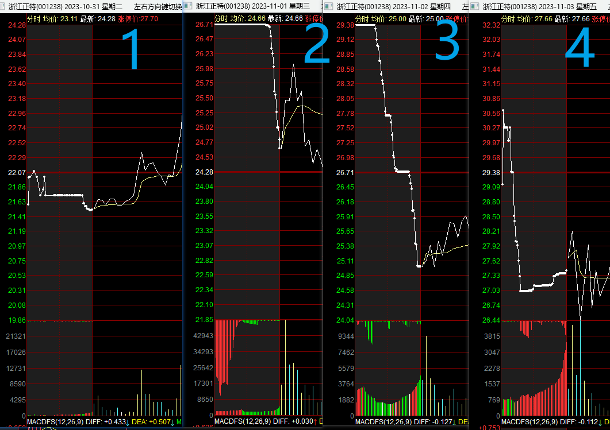

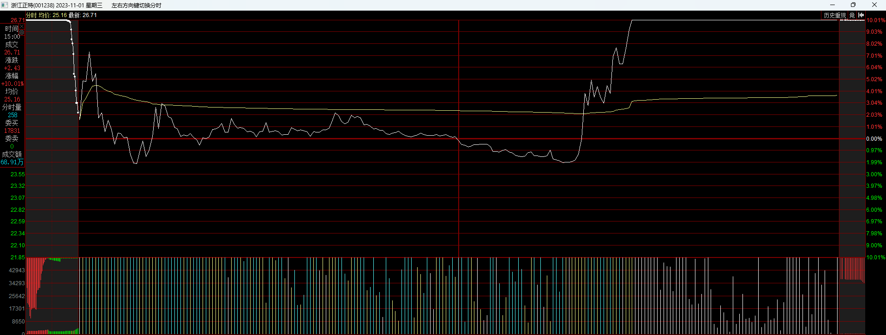

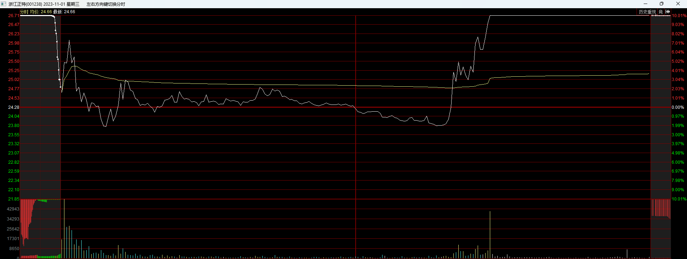

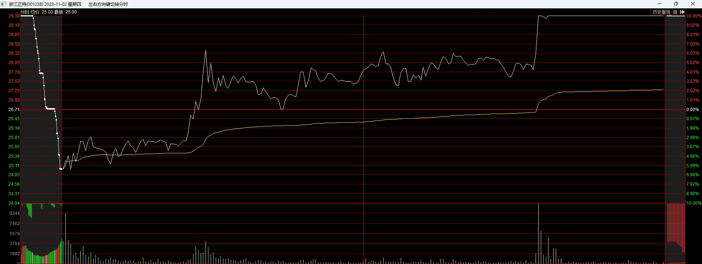

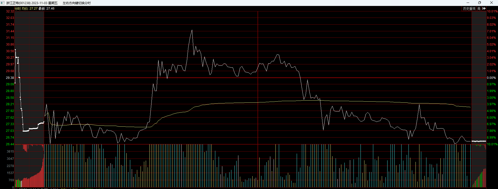

> 2板水下反弹，3板低开高走，4板低开冲高出货。冲高也只是比3板高一点，所以3板尾盘直接卖了走，赚一个板也不亏。或者等4板角儿不对劲再卖，但是风险比较大。

### 11-01

#### 国机汽车

首板成功 -> 进2成功[开盘/低位进] -> **进3失败**<font style="font-weight:bold;color:green">[惊]</font> : 2板有多方的人，多空不一致，3板下跌

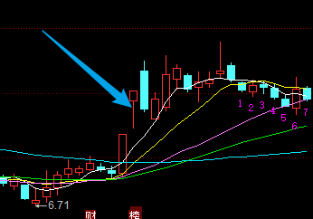


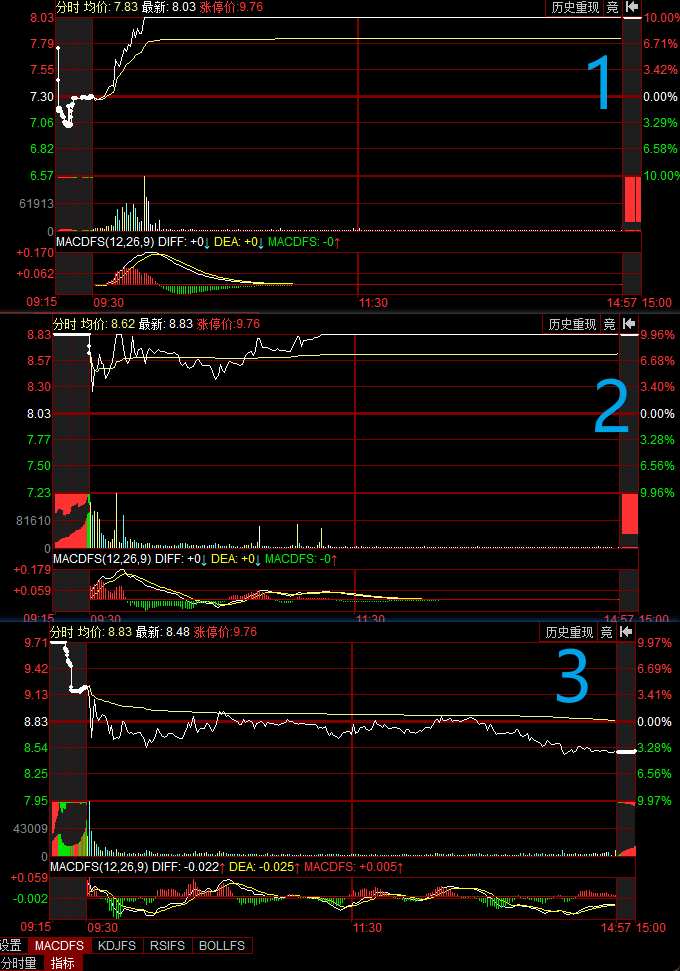

> 2板低位进，3板开盘走，虽然没有赚到，但是也不会亏损

### 11-02

#### 正裕工业

首板成功 -> 进2成功[开盘/低位进] -> **进3失败**<font style="font-weight:bold;color:green">[惊]</font> 

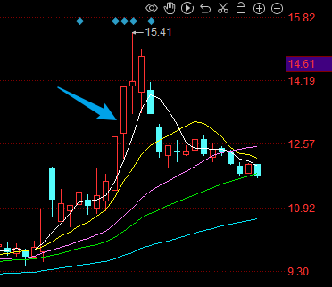

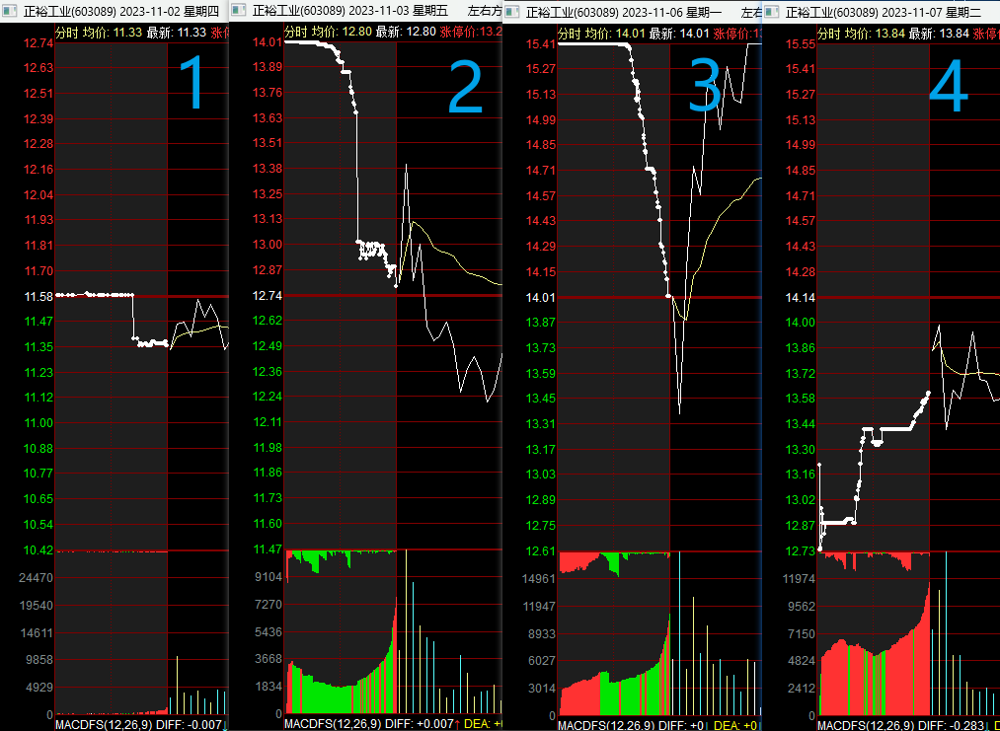

#### 龙韵股份

首板成功 -> 进2成功[开盘/低位进] -> **进3成功**<font style="font-weight:bold;color:red">[吃:尾盘出]</font>  -> 进4成功 -> <font style="font-weight:bold;color:orange">进5失败</font>

#### 天威视讯

首板成功 -> 进2成功[开盘/低位进] -> **进3成功**<font style="font-weight:bold;color:red">[吃:尾盘出]</font>  -> 进4成功 -> <font style="font-weight:bold;color:orange">进5失败</font>

### 11-03

#### 亚翔集团

首板版成功 -> 进2成功[开盘/低位进] -> **进3失败**<font style="font-weight:bold;color:green">[惊]</font> ：日K换手<20

### 11-06

#### 东方嘉盛

首板成功 -> 进2成功[开盘/低位进] -> **进3失败**<font style="font-weight:bold;color:green">[惊]</font> ：日K换手<20

#### 文一科技

首板成功 -> 进2成功[开盘/低位进] -> **进3成功**<font style="font-weight:bold;color:red">[吃:尾盘出]</font>

#### 龙宇股份

首板成功 -> 进2成功[开盘/低位进] -> **进3成功**<font style="font-weight:bold;color:red">[吃:尾盘出]</font>

### 11-07

思美传媒：首板成功 -> 进2成功[开盘/低位进] -> **进3失败**<font style="font-weight:bold;color:green">[惊]</font> ：日K换手>20,进2多次炸板

龙头股份：首板成功 -> 进2成功[开盘/低位进] -> **进3失败**<font style="font-weight:bold;color:green">[惊]</font> ：日K换手>20,低开跳水

太龙药业：首板成功 -> 进2成功[开盘/低位进] -> **进3失败**<font style="font-weight:bold;color:green">[惊]</font> ：日K换手>200,低开跳水

### 11-08

无换手大于20%的股票

### 11-09

云煤能源：首板成功 -> 进2成功[开盘/低位进] -> **进3成功**<font style="font-weight:bold;color:red">[吃:尾盘出]</font> -> <font style="font-weight:bold;color:orange">进4失败</font>

宁波远洋：首板成功 -> 进2成功[开盘/低位进] -> **进3成功**<font style="font-weight:bold;color:red">[吃:尾盘出]</font> -> 进4成功 -> <font style="font-weight:bold;color:orange">进5失败</font>

### 11-10

海马汽车：首板成功 -> 进2成功[开盘/低位进] -> **进3成功**<font style="font-weight:bold;color:red">[吃:尾盘出]</font> -> <font style="font-weight:bold;color:orange">进4失败</font>

三柏硕：首板成功 -> 进2成功[开盘/低位进] -> **进3成功**<font style="font-weight:bold;color:red">[吃:尾盘出]</font> -> 进4成功 -> 进5成功 -> **进6成功 -> 进7成功 -> 进8成功 -> 进9成功** -> <font style="font-weight:bold;color:orange">进10失败</font>

### 11-13

无换手大于20%的股票

### 11-14

至正股份：首板成功 -> 进2成功[开盘/低位进] -> **进3失败**<font style="font-weight:bold;color:green">[惊]</font> ：日K换手>20,但集合竞价跳水低开

江铃汽车：首板成功 -> 进2成功[开盘/低位进] -> **进3失败**<font style="font-weight:bold;color:green">[惊]</font> ：日K换手<20,日k为十字星

中科金财：首板成功 -> 进2成功[开盘/低位进] -> **进3失败**<font style="font-weight:bold;color:green">[惊]</font> ：日K换手<20,集合竞价跳水低开

### 11-15

西陇科学：首板成功 -> 进2成功[开盘/低位进] -> **进3成功**<font style="font-weight:bold;color:red">[吃:尾盘出]</font> -> 进4成功 -> <font style="font-weight:bold;color:orange">进5失败</font>

元成股份：首板成功 -> 进2成功[开盘/低位进] -> **进3失败**<font style="font-weight:bold;color:green">[惊]</font> ：日K换手>20,但集合竞价跳水低开

统一股份：首板成功 -> 进2成功[开盘/低位进] -> **进3成功**<font style="font-weight:bold;color:red">[吃:尾盘出]</font> -> 进4成功 -> <font style="font-weight:bold;color:orange">进5失败</font>

### 11-16

直真科技：首板成功 -> 进2成功[开盘/低位进] -> **进3成功**<font style="font-weight:bold;color:red">[吃:尾盘出]</font> -> <font style="font-weight:bold;color:orange">进4失败</font>

引力传媒：首板成功 -> 进2成功[开盘/低位进] -> **进3成功**<font style="font-weight:bold;color:red">[吃:尾盘出]</font> -> 进4成功 -> <font style="font-weight:bold;color:orange">进5失败</font>

亚威集团：首板成功 -> 进2成功[开盘/低位进] -> **进3成功**<font style="font-weight:bold;color:red">[吃:尾盘出]</font> -> 进4成功 -> <font style="font-weight:bold;color:orange">进5失败</font>

省广集团：首板成功 -> 进2成功[开盘/低位进] -> **进3失败**<font style="font-weight:bold;color:green">[惊]</font> ：日K换手>20,但集合竞价跳水低开

### 11-17

跃岭股份：首板成功 -> 进2成功[开盘/低位进] -> **进3成功**<font style="font-weight:bold;color:red">[吃:尾盘出]</font> -> <font style="font-weight:bold;color:orange">进4失败</font>

宏昌电子：首板成功 -> 进2成功[开盘/低位进] -> **进3失败**<font style="font-weight:bold;color:green">[惊]</font> ：日K换手>20,但集合竞价跳水低开

富佳股份：首板成功 -> 进2成功[开盘/低位进] -> **进3失败**<font style="font-weight:bold;color:green">[惊]</font> ：集合竞价跳水低开

圣龙股份：首板成功 -> 进2成功[开盘/低位进] -> **进3成功**<font style="font-weight:bold;color:red">[吃:尾盘出]</font> -> 进4成功

### 11-20

一彬科技：首板成功 -> 进2成功[开盘/低位进] -> **进3成功**<font style="font-weight:bold;color:red">[吃:尾盘出]</font> -> <font style="font-weight:bold;color:orange">进4失败</font>

黄河旋风：首板成功 -> 进2成功[开盘/低位进] -> **进3失败**<font style="font-weight:bold;color:green">[惊]</font> ：集合竞价走坏低开

博通股份：首板成功 -> 进2成功[开盘/低位进] -> **进3失败**<font style="font-weight:bold;color:green">[惊]</font> ：集合竞价水下低开

### 11-21

坤泰股份：首板成功 -> 进2成功[开盘/低位进] -> **进3失败**<font style="font-weight:bold;color:green">[惊]</font> ：集合竞价低开

```
早盘触及涨停板，然后炸板，早盘11点又封涨停
买点1，开盘直接买，26.23
买点2，炸板后买，25.06
第二天集合竞价以前一天收盘价附近开盘，然后下跌，拉高到27.92
买点2高一些
```

华阳新材：首板成功 -> 进2成功[开盘/低位进] -> **进3失败**<font style="font-weight:bold;color:green">[惊]</font> ：集合竞价跳水

中广天择：首板成功 -> 进2成功[开盘/低位进] -> **进3失败**<font style="font-weight:bold;color:green">[惊]</font> ：跳水

深赛格：首板成功 -> 进2成功[开盘/低位进] -> **进3失败**<font style="font-weight:bold;color:green">[惊]</font> ：集合竞价地板开局！

### 11-22

天元智能：首板成功 -> 进2成功[开盘/低位进] -> **进3失败**<font style="font-weight:bold;color:green">[惊]</font> : 集合竞价低开跳水

思美传媒：首板成功 -> 进2成功[开盘/低位进] -> **进3失败**<font style="font-weight:bold;color:green">[惊]</font> : 进2多次炸板

龙版传媒：首板成功 -> 进2成功[开盘/低位进] -> **进3成功**<font style="font-weight:bold;color:red">[吃:尾盘出]</font> 

实益达：首板成功 -> 进2成功[开盘/低位进] -> **进3失败**<font style="font-weight:bold;color:green">[惊]</font> : 炸板

### 11-23

无换手大于20%的股票

### 11-24

三羊马：首板成功

天龙股份：首板成功

特一药业：首板成功

```
试了买进每个股1w左右，很慌，早盘不是很理想
```


> 这套战法就算次日失败了，过几天也会回调，也不要急着出去，而是耐心观察局势，别倍洗出去了。
>
> 跟大盘情绪应该有一定的关系，情绪高，换手高的有人接，有人抬，情绪低的，3板直接炸（也可以考虑反向排除出可以走更远的股）


> **如何以更低的价钱买入，一分钱也是钱啊**

比如集合竞价怎么更低价钱买入

比如怎么判断日内会不会以更低价格浮动


> 单只股票投入3W，慎重全仓！验证我的战法逻辑！！


> 这是个事后复盘指标，而不是盘前指标


# 1进二修正

先看涨停分析

## 过滤首板

> 过滤了ST，

中远海科

浙江仙通

长久物流

**长安汽车**

**东箭科技**

**英唐智控**

**捷顺科技**

云内动力

元成股份

兴民智通

伟时电子

威尔泰

皖通科技

松炀资源

四环生物

思美传媒

瑞玛精密

日盈电子

美芝股份

零点有数

雷赛智能

吉视传媒

惠威科技

惠发食品

汇通能源

湖南天雁

宏英智能

宏辉果蔬

合兴股份

合锻智能

海立股份

高鸿股份


东安动力

德生科技

保变电气


# 长安汽车系列


# 选股

## 主升浪超短选股

选股条件：

量比小于2.4；放量；上影线大于1.5%小于7.6%；DDE大单净量大于0.25；近5日涨跌幅大于-18%小于8%；换手率小于20%；非st股；流通市值小于86亿；市值从小到大;

其他条件: 非创业板;

买入时机：开盘买入；

持股上限：1只

止盈：收益率 ≥ 23.2 % 时坚定持有；直到最高收益回落 0.77%

止损：收益率 ≤ -8.5 %

这个策略通过主力动向，近期走势和小市值选出股票，最佳持有周期为4天的情况下，收益率和选股成功率达到最大值，**单次收益最高为41.46%，最低值为-16.78%**，非常适合短线操作中的捕捉主升浪。


