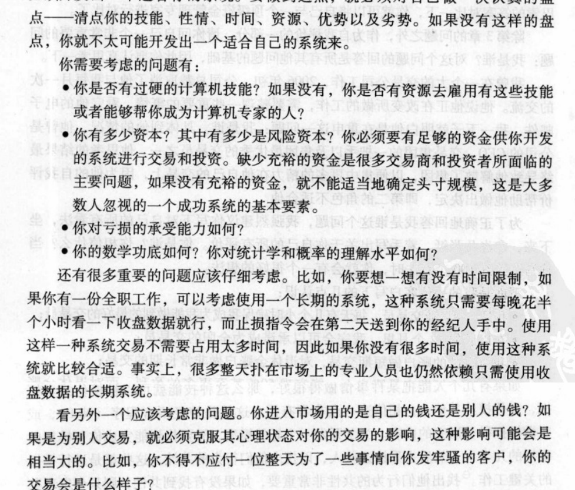
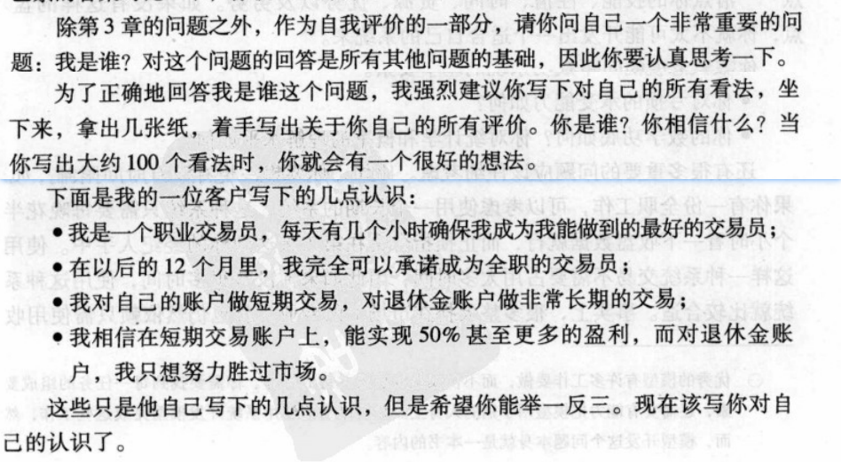

> 以下内容摘自《通向财务自由之路》—— van k trap

## 新手村

萌新问题：

- 市场现在想做什么？
- 我现在应该买什么？
- 我持有x，你认为它会涨吗？（如果你说不对，那我他们会继续问别人知道有人同意他们的观点为止！）
- 告诉我，我能怎样进入市场，而且在大多数时间又是正确的。

> 有趣的是，通过向提出这些问题的人提供他们想要的答案的人都赚到了钱

我的问题：

- 什么样的交易系统是好的交易系统

## 赚钱的重要因素

头寸的确定

个人的心理问题

## 波动幅度突破

1.得到昨天的价格浮动幅度

2.如果昨天和前天的价格波动幅度存在缺口，就把缺口算到昨天的价格浮动幅度上。(真实波动幅度)

3.在今天的开盘价上分别加/减昨天真实波动幅度的40%

（+40%）得到的上限值,就是买进的信号（买多的信号）

（-40%）得到的下限值,就是卖出的信息（卖空的信息）

任何一个信号出现，就进入市场，有80%的把握可以赚钱。

> 好像有点意思，但是完全按照这个方法，可能会破产，这个方法无法解决一下问题：

- 如果市场走势与你的判断背道而驰，你该怎么保护你的资本？
- 如何或者何时可以实现你的盈利？
- 在得道市场的信号时，该买入/卖出多少？
- 这一个方法是为哪些市场设计的，是否可以用于所有的市场？
- 这一个方法什么时候有效，什么时候会惨败？

- 综合考虑以上问题，然后问自己，这个方法适合自己吗?符合自己的性格吗？自己可以容忍可能造成的亏损，甚至连续的失败吗？这个方法让你感到舒适吗？

## 什么东西在影响你的交易系统?

**交易系统的开发**

- 被表象误导，比如日K、指标等
- 被历史走势、市场消息影响
- 认为我只要入市，市场会按照规律自己走。

> 交易的黄金法则：止损获利，与何时入市无关、而何时与退出市场关系重大。

- 觉得用几个精选案例验证就可以证明这个模式就一定有用
- 觉得某个被历史案例验证的走势/模式就是可靠的
- 认为市场是随机的一定有最高点/最低点
- 试图理解市场的走势规律并且为他找到合适的理由

**交易系统的测试**

- 觉得跟历史走势越吻合才越可靠
- 用未发生的数据支撑你的交易系统
- 忽略头寸规模和市场退出对交易系统的重要性

**交易系统的执行**

- 一连串的失败后，可能会成功的赌徒心理
- 对于获利很保存，对于止损很冒险
- 交易必须成功的心理

## 设定目标

> 一个有目标的人，众人、世界、有时甚至是坟墓都会为他让路，而哪些漫无目的的随波漂流者则只会被唾弃。 —— 古罗马谚语

- 你本金多少?
- 你想赚多少？你的目标是？（多少收益率？）
- 你能容忍亏多少？多少钱是你亏得起？（多少止损率？）
- 

## 开发系统

> 肯定有一张数据图或者一种数据模型向我们展示可以达到的目标以及通往目标的最佳路线 —— 大卫·福斯特

- 列出自己的优势和劣势

- 我是谁？

