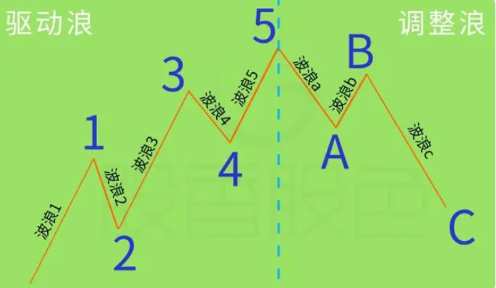
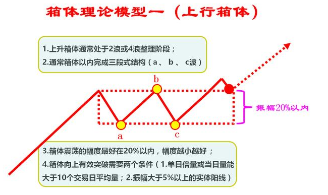

# 6股价机构——压力与支撑

## 股市博弈模式

### 股市博弈的本质

#### 市场的参与者

证监会

- **基金**
  - 公募基金
    - 社保基金
    - 投资基金
    - 商业银行
  - 私募基金
    - 投资顾问
    - 信托管理
    - 游资

- 券商
  - **机构投资者**
  - 大型财团或企业
  - 中小散户投资者
-  QFII

> 期货市场也是这样吗？

### 散户盈利思维模式

#### 股市的本质

所谓的价值投资和企业成长性，~~大部分情况下~~只不过是主力骗取散户筹码和资金的一块遮羞布。

庄家对待散户的策略：养=>套=>杀

#### 散户的致命弱点

- [ ] 可以将历史的交易记录都打印出来，标注上，分析每一次为什么买入，为什么卖出，反思自己的操作。

散户炒股，之所以亏损累累，根本原因在于：追涨杀跌

江恩：《华尔街四十五年》1949：投资者在市场买卖亏损的主要原因有：

- 在有限的资本上过度买卖
- 投资者没有设立止损点以控制损失
- 缺乏市场知识，这是在市场买卖中损失的重要原因

### 江恩21条买卖法则

1. 每次入市买卖，损失不应超过资金的十分之一
2. 每次交易都要设置止损点，以减少买卖出错时可能赵成的损失
3. 永不过量买卖
4. 永不让所持仓位转盈位亏
5. 永不逆势操作，市场趋势不明显时，宁可在场外观望
6. 有怀疑，即平仓离场，入市时要坚决，犹豫不决时不要入市
7. 只在活跃的市场买卖，买卖清单时不宜操作
8. 永不设定目标价位出入市，避免限价出入市，只服从市场走势
9. 如无适当理由，不将所持仓位平盘，可用止盈位保障所得利润
10. 在市场连站皆捷后，可以将部分利润提取出来，一杯不时之需
11. 买股票切记指望分红收息（赚市场差价第一）
12. 买卖遭受损失时，切忌赌徒式加码，谋求摊低成本
13. 不要因为不耐烦而入市，也不要因为不耐烦而平仓
14. 切记肯输不肯赢，赔多赚少的买卖不要做
15. 入市时设定的止损位，不能胡乱取消
16. 做多错多，入市要等待机会，买卖不宜太频繁
17. 做多做空自如，不应只做单边
18. 不要因为价格太低而吸纳，也不要因为价格太高而沽空
19. 永不对冲
20. 尽量避免在不适当的时机搞金字塔加码
21. 若无适当理由，避免胡乱更改所持股票的买卖策略

### 庄家论

很多人觉得庄家在市场上肆无忌惮，残忍贪婪，只看到股票疯狂地飙涨，以及价格上涨带来的财富效应，却不知庄家为了这一刻长年累月的策划、布局和运作，看不到其背后付出的努力和艰辛。相比较而言，散户更贪婪，不想付出时间和精力，只想搭上庄家的顺风车。

股市是斗智斗勇的舞台，散户想要战胜庄家，必须要有更严格的纪律、更成熟的心态和更稳定安全的办法，别无捷径！不以涨喜，不以跌悲，不冲动，不盲从，在风云变幻的股市里，做到荣辱不惊，心如止水，卓绝坚忍，才有了成功的基础。要想做到这一点，需要不断地学习、研究、思考、实践、领悟，能够忍受寂寞，耐心等待时机，全面出击；还需要你不断的磨砺自己，不断经历痛苦和失败，不断的挑战和颠覆自我，脱胎换股，实现涅槃。

每天，把你的弱电背上一百遍；每天，把你的操作手法反复琢磨上千遍。

**还要反过来从庄家的角度来思考，在当前的形势下，庄家会怎么做。庄家会怎么想。**

做到这一步，恭喜你，你终于跳出散户的思维框架了，你成熟了。

像高飞的鹰，三维的立体视觉，用锐利的目光俯瞰宏观大势、市场格局，对博弈双方做出战略性评价，这就是超越市场。

你仍需磨炼，调整、练习、改变，直到这些思维模式、临盘心态、操作手法烂熟在你的心里，化作你的肉，你的骨，你的灵魂。股即是我，我即是股，股我两忘。

恭喜你，你终于实现了自我突破，战胜了自我，羽化成蝶。对，就是这样！

成功者永远要高瞻远瞩，超  凡脱俗，用于超然的心胸，良好的心态，恬淡的人生态度，达到一种“采菊东篱下，悠然见南山” 的至高境界。

**股入人生，人生如股。**

## 股价波动结构理论基础

### 斐波那契数列

### 波浪理论

数学理论基础：斐波那契数列

股价波动犹如海水涨落，长期趋势是潮汐，中期趋势是波浪，短期趋势像波纹。

波浪理论优点：对即将出现的顶部和底部能提前发出警示信号，而传统的技术分析方法只能事后验证。

上升4浪，下跌4浪，也是对股价对称性的印证。

这个理论最难的是：**波浪等级的划分。**不仅需要形态支持，还要对波浪运行时间周期的判断。易学难精。

**艾略特波浪理论主要反映群众心理的波动变化，参与市场的人越多，其准确性越高。**

基础要点：

- 一个完整的循环包括八个波浪，五上三落。
- 波浪可合并为高一级的浪，亦可以再分割为低一级的小浪。:question:
- 跟随主流行走的波浪可以分割为低一级的五个小浪。
- 1、3、5三个波浪中，第3浪（波浪5）不可以是最短的一个波浪。
- 假如三个推动浪中的任何一个浪成为延伸浪，其余两个波浪的运行时间及幅度会趋一致。:question:
- 调整浪通常以三个浪的形态运行。
- 黄金分割率理论奇异数字组合是波浪理论的数据基础。
- 经常遇见的回吐比率为0.382、0.5及0.618。
- 第四浪的底不可以低于第一浪的顶。
- 艾略特波段理论包括三部分：形态、比率及时间，其重要性以排行先后为序。

### 箱体理论

每个箱体顶部就是上涨压力，底部就是下跌时的支撑。在箱体内可以在靠近顶/底部时低买高卖（做多）/高买低卖（做空）。

当突破箱体时，表示压力已经克服。价格继续上升。一旦回调，过去的箱体的顶部就会形成现在箱体的底部支撑。

当股价在第一个箱体内起伏时，可以观望，不要贸然行动，等股价确认上升到第二个箱体/第三个箱体时，进场买入。在买入后，只要股价不回跌到前一箱体的顶部，就不卖出。这是短线操作的一个理论依据。站在箱体之上买涨的股票。

箱顶和箱底都是风险区，应该谨慎对待。

### 成本理论

股价波动就是将手中的现金在低位转化为股票，高位转化为现金。

- 成本均线

可以通过5日、13日、34日成本均线观察市场的平均建仓成本。

- 筹码分布

可以看清大部分投资者持股成本的分布情况

当股价放量突破密单峰，是一轮上升行情的征兆，换手越充分，上攻行情的力度越大；反之是一轮下跌行情的开始。

### 参照系

一般参照30日、60日均线。

比如股价5日线均线上涨，但60日均线在上方压制，就任然处于下跌模式。

### 股价波动结构理论

只有顺应市场趋势，你才会从市场中获得别人艳羡的财富。

股价波动结构体系：

| 体系层次 | 内容           | 备注                               |
| -------- | -------------- | ---------------------------------- |
| 技术形态 | 压力支撑       | 找到股价波动的拐点                 |
|          | 趋势轨道       | 判断股价运行的方向                 |
|          | 波浪形态       | 解析股价波动的结构特点             |
|          | 时间周期       | 判断股价波动的时间跨度             |
| 交易控制 | 资金仓位管理   | 详解各个资金模型，分散散户账户     |
|          | 心里控制和止损 | 赌徒心态、交易心理控制、止损纪律   |
|          | 主升浪战法     | 顶级核心交易战法                   |
| 股价结构 | 操盘中级实战   | 真实账户实盘跟踪，实时讲解操盘手法 |

## 股价波动压力位和支撑位判断方法

### 前期高低点

判断支撑位是为了让我们对持股有信心，当股价在压力位下或者支撑位上时，不必理会他的波动，安心睡觉即可。只有当处于压力位时，我们需要判断行情是否可以出现突破，接下来持有还是卖出；处于支撑位时，需要判断市场是否可以止跌，接下来观望还是买进。这样我们炒股就会很轻松。

操作要点：

- 震荡行情时，如果股价到前高，但是成交量没有持续放大，并超过前高对应的成交量，应该卖出股票
- 震荡行情时，如果股价到前低，股票K线实体越来越小，若成交量逐渐缩小，当出现实体超过3%的阳线，同时成交量放量时，应当买入股票。
- 上涨行情时，如果股价放量突破前高，然后股价回调，期间并未放出大量，股价回落至前高压力位附近时考虑加仓买入
- 下降行情时，如果股价跌破前低，然后股价反弹，期间成交稀疏，无量配合，冲高至前低形成的支撑位附近是最后的逃命时机。

注意事项：

- 震荡行情和趋势行情要分清楚，做反就可能损失严重。一般不建议做震荡行情
- 一旦股价和预测的相反，要设置止损，一般在5%6%，如果有量配合的行情更好坚决止损。不然可能会炸。
- 震荡行情主力反复横盘调整，就是为了折磨跟风者，洗去浮筹，抬高他人持仓成本。一般建议仓位控制20%30%，高抛低吸赚差价，只要是保持交易热身状态，一旦趋势向上加速，就可以补仓加码，及时跟进。

### 整数关口

### 黄金分割位

### 趋势线

### 均线位

### 颈线位

### 通道上下轨

### 缺口

### 成交密集区

### 其他算法

## 股价波动压力位和支撑位转化法

### 转化原理

### 单X线

### 双X线

## 股价波动结构与突破

### 有效突破

### 无效突破

## 股价波动压力位和支撑位的印证

### 反转印证信号

### 压力位反转信号

### 支撑位反转信号

